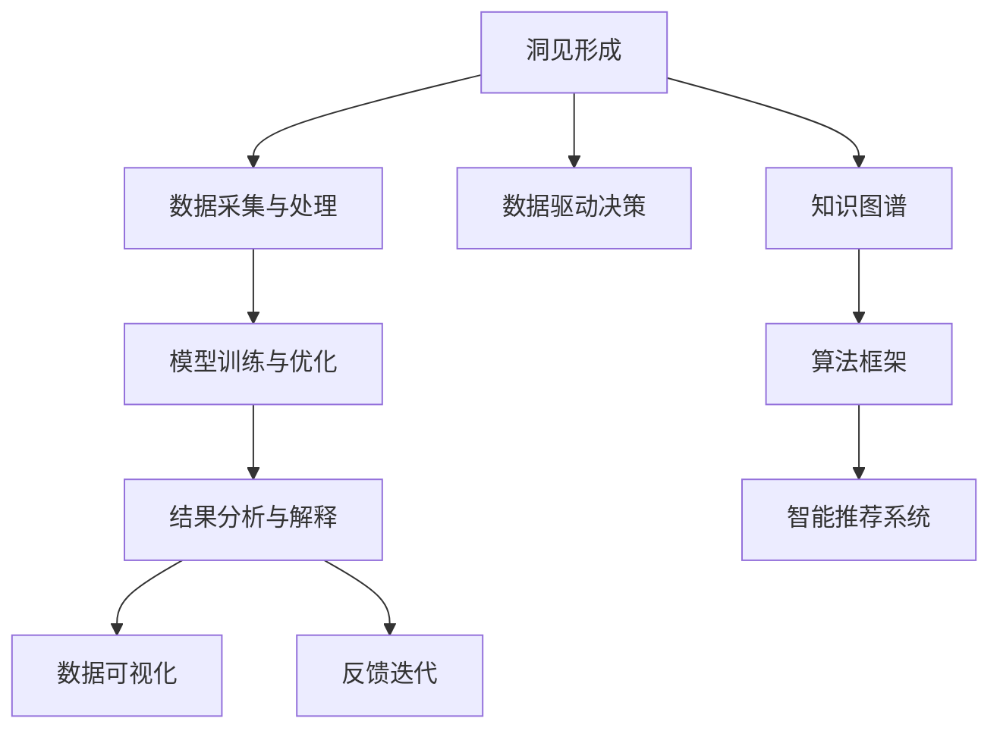

                 

# 洞见的形成：从观察到反思

> 关键词：洞见形成, 观察与反思, 数据驱动决策, 人工智能, 知识图谱, 算法框架, 智能推荐

## 1. 背景介绍

### 1.1 问题由来

在当今数据驱动的时代，洞见(Dinsight)的形成变得愈发关键。洞见不仅仅是数据，更是对数据的深刻理解与洞察，它能够指导决策，驱动创新，引领变革。然而，海量数据的涌现和数据技术的进步并没有自然而然地带来洞见，反而常常淹没在数据的汪洋中。

在人工智能(AI)领域，洞见尤为重要。随着数据量的爆炸性增长，如何高效地从数据中提取有用信息，转化成可操作的洞见，成为AI研究的焦点之一。当前，数据驱动的AI系统已经在推荐系统、广告投放、图像识别等诸多领域展现了卓越的能力。但与此同时，数据质量的参差不齐、模型复杂性的提升，也给洞见的形成带来了新的挑战。

### 1.2 问题核心关键点

洞见的形成主要依赖于对数据的观察与反思，这一过程通常涉及以下几个关键点：

- **数据采集与处理**：收集并处理数据，去除噪音，保证数据的质量和可用性。
- **模型训练与优化**：构建和优化AI模型，利用数据学习隐藏在数据背后的知识。
- **结果分析与解释**：对模型输出进行分析，理解其背后的逻辑与洞见，并将其转化为可行的决策或策略。
- **反馈迭代**：根据新数据的反馈，调整模型与分析方法，持续优化洞见的质量。

这些关键点的综合运用，使得AI系统能够从大量数据中提取洞见，辅助决策与创新。

## 2. 核心概念与联系

### 2.1 核心概念概述

为更好地理解洞见的形成过程，本节将介绍几个关键概念：

- **洞见(Dinsight)**：通过数据分析和模型训练得到的对数据背后本质规律的深刻理解。洞见可以是量的描述，如市场趋势；也可以是质的分析，如用户行为特征。
- **数据驱动决策**：基于数据支持的决策过程。其核心在于利用AI系统分析数据，提取洞见，辅助管理者做出明智的决策。
- **知识图谱(Knowledge Graph)**：一种结构化的数据表示方式，用于描述实体与实体之间的关系。知识图谱可以帮助机器更好地理解复杂世界中的因果关系，提升洞见的深度。
- **算法框架**：用于实现AI模型训练、优化和推理的软件架构。常见的算法框架包括TensorFlow、PyTorch等，它们提供了高效的数据处理和模型训练能力。
- **智能推荐系统**：基于用户行为数据，通过机器学习模型为用户推荐个性化的产品或内容。智能推荐系统能够不断学习用户偏好，提供更精准的洞见。
- **数据可视化**：将数据分析结果以图形的方式展示，帮助用户更直观地理解洞见。常见的数据可视化工具包括Tableau、Power BI等。

这些核心概念之间的逻辑关系可以通过以下Mermaid流程图来展示：



这个流程图展示了洞见形成的基本流程：

1. 从数据采集与处理开始，获取和预处理数据。
2. 利用算法框架中的模型训练与优化技术，从数据中提取洞见。
3. 对模型输出进行结果分析与解释，理解其背后的逻辑与洞见。
4. 通过数据可视化工具将洞见直观展示，辅助决策。
5. 根据反馈迭代调整模型与分析方法，持续优化洞见。

这些概念共同构成了洞见形成的框架，使得AI系统能够高效地从数据中提取有价值的洞见，支持决策和创新。

## 3. 核心算法原理 & 具体操作步骤

### 3.1 算法原理概述

洞见的形成通常依赖于以下三个关键步骤：数据预处理、模型训练与优化、结果分析与解释。

1. **数据预处理**：数据预处理是洞见形成的基础，包括数据清洗、特征工程、异常检测等。数据预处理的目标是提升数据的质量，去除噪音，确保数据的一致性和可用性。

2. **模型训练与优化**：构建AI模型，利用数据学习隐藏在数据背后的知识。模型训练与优化的目标是提高模型的准确性和泛化能力，确保模型在未见过的数据上也有好的表现。

3. **结果分析与解释**：对模型输出进行分析，理解其背后的逻辑与洞见，并将其转化为可行的决策或策略。结果分析与解释的目标是将复杂的模型输出转化为易于理解的洞见，辅助决策者做出明智的决策。

### 3.2 算法步骤详解

基于洞见形成的过程，以下将详细介绍各个步骤的具体操作：

**Step 1: 数据预处理**

- **数据清洗**：去除数据中的噪音和不一致，确保数据的质量。例如，处理缺失值、去除重复数据、纠正错误等。
- **特征工程**：从原始数据中提取有用的特征，提升模型的预测能力。常见的特征工程技术包括编码、标准化、归一化等。
- **异常检测**：识别和处理异常数据点，避免其对模型训练的影响。常见的异常检测方法包括统计学方法、机器学习方法等。

**Step 2: 模型训练与优化**

- **选择合适的算法框架**：根据具体任务选择合适的算法框架，如TensorFlow、PyTorch等。
- **设计合适的模型架构**：根据任务特点设计模型架构，如神经网络、深度学习模型、卷积神经网络(CNN)等。
- **构建损失函数**：根据任务定义合适的损失函数，如交叉熵损失、均方误差损失等。
- **优化模型**：使用梯度下降等优化算法，最小化损失函数，更新模型参数。常见的优化算法包括SGD、Adam等。
- **正则化与防止过拟合**：应用正则化技术，如L2正则、Dropout、Early Stopping等，防止模型过拟合。

**Step 3: 结果分析与解释**

- **模型评估**：在验证集上评估模型性能，确保模型泛化能力。
- **结果可视化**：使用数据可视化工具，将模型输出转化为图形展示，帮助理解模型行为和洞见。
- **洞见转化**：将模型输出转化为可行的决策或策略，辅助管理者做出明智的决策。

### 3.3 算法优缺点

洞见形成的算法具有以下优点：

1. **高效性**：利用数据驱动的AI系统，可以快速从大量数据中提取洞见。
2. **准确性**：通过模型训练与优化，能够提升洞见的准确性，避免因数据质量问题导致的不准确。
3. **可解释性**：结果分析与解释过程能够帮助用户理解模型背后的逻辑，增强决策的透明度。

同时，该方法也存在一定的局限性：

1. **数据依赖**：洞见的形成高度依赖于数据的质量和可用性。数据质量不高或数据量不足可能导致洞见不准确。
2. **模型复杂**：构建和优化复杂模型，需要较高的技术水平和计算资源。
3. **解释难度**：复杂的模型往往难以解释，用户理解模型输出的难度较大。
4. **动态变化**：数据和环境的变化可能导致模型失效，需要持续监控和调整。

尽管存在这些局限性，但就目前而言，基于数据驱动的洞见形成方法仍是实现决策智能化的重要手段。未来相关研究的重点在于如何进一步降低对数据的依赖，提高模型的可解释性和鲁棒性，同时兼顾计算效率和模型复杂度。

### 3.4 算法应用领域

基于数据驱动的洞见形成方法，已经在多个领域得到了广泛的应用，例如：

- **金融风险管理**：利用AI系统分析历史交易数据，识别风险信号，预测市场波动，辅助决策风险控制。
- **智能推荐系统**：通过分析用户行为数据，构建用户画像，推荐个性化的产品或内容，提升用户体验。
- **医疗诊断**：利用患者历史数据，通过机器学习模型预测疾病风险，辅助医生进行早期诊断和治疗决策。
- **市场营销**：分析消费者行为数据，提取市场趋势和用户偏好，制定更精准的市场营销策略。
- **智能制造**：通过分析生产数据，优化生产流程，提升生产效率和质量控制。

除了上述这些经典应用外，数据驱动的洞见形成方法还在更多领域展示了其巨大的潜力，如智能交通、智慧城市、智能供应链等，为各行各业带来了新的变革。

## 4. 数学模型和公式 & 详细讲解 & 举例说明

### 4.1 数学模型构建

假设我们有一组数据集 $D=\{(x_i,y_i)\}_{i=1}^N$，其中 $x_i$ 为输入特征，$y_i$ 为输出标签。我们的目标是从这些数据中提取洞见，构建一个预测模型 $M$。数学上，我们可以将这一过程表示为：

$$
M = \mathop{\arg\min}_{\theta} \frac{1}{N}\sum_{i=1}^N \ell(M(x_i), y_i)
$$

其中 $\ell$ 为损失函数，$\theta$ 为模型参数。

### 4.2 公式推导过程

以二分类任务为例，假设模型 $M$ 的输出为 $y=\sigma(z)=\frac{1}{1+e^{-z}}$，其中 $z=w^Tx+b$，$w$ 和 $b$ 为模型参数。我们的目标是最小化交叉熵损失函数：

$$
\ell(M(x_i), y_i) = -[y_i\log M(x_i) + (1-y_i)\log (1-M(x_i))]
$$

利用梯度下降等优化算法，最小化损失函数，更新模型参数：

$$
\frac{\partial \ell}{\partial w} = -\frac{1}{N}\sum_{i=1}^N \frac{\partial \ell}{\partial z} \frac{\partial z}{\partial w} = -\frac{1}{N}\sum_{i=1}^N (y_i-M(x_i))x_i
$$

$$
\frac{\partial \ell}{\partial b} = -\frac{1}{N}\sum_{i=1}^N (y_i-M(x_i))
$$

将上述梯度代入参数更新公式：

$$
w \leftarrow w - \eta \frac{\partial \ell}{\partial w} 
$$

$$
b \leftarrow b - \eta \frac{\partial \ell}{\partial b}
$$

其中 $\eta$ 为学习率。

### 4.3 案例分析与讲解

假设我们有一组电影评分数据，包括用户ID、电影ID和评分。我们的目标是构建一个预测模型，预测用户对未评分电影的评分。

**Step 1: 数据预处理**

- **数据清洗**：处理缺失值，去除重复数据。
- **特征工程**：将用户ID和电影ID编码，添加时间戳等辅助特征。
- **异常检测**：识别异常评分数据，去除异常值。

**Step 2: 模型训练与优化**

- **选择合适的算法框架**：使用PyTorch进行模型构建和训练。
- **设计合适的模型架构**：构建一个多层感知器(Multilayer Perceptron, MLP)模型。
- **构建损失函数**：选择均方误差损失函数。
- **优化模型**：使用Adam优化算法，最小化损失函数。
- **正则化与防止过拟合**：应用L2正则和Dropout技术。

**Step 3: 结果分析与解释**

- **模型评估**：在验证集上评估模型性能，计算准确率和均方误差。
- **结果可视化**：绘制混淆矩阵和ROC曲线，展示模型性能。
- **洞见转化**：根据模型输出，为用户推荐相似电影，辅助决策。

## 5. 项目实践：代码实例和详细解释说明

### 5.1 开发环境搭建

在进行洞见形成实践前，我们需要准备好开发环境。以下是使用Python进行PyTorch开发的环境配置流程：

1. 安装Anaconda：从官网下载并安装Anaconda，用于创建独立的Python环境。

2. 创建并激活虚拟环境：
```bash
conda create -n pytorch-env python=3.8 
conda activate pytorch-env
```

3. 安装PyTorch：根据CUDA版本，从官网获取对应的安装命令。例如：
```bash
conda install pytorch torchvision torchaudio cudatoolkit=11.1 -c pytorch -c conda-forge
```

4. 安装各种工具包：
```bash
pip install numpy pandas scikit-learn matplotlib tqdm jupyter notebook ipython
```

完成上述步骤后，即可在`pytorch-env`环境中开始洞见形成实践。

### 5.2 源代码详细实现

下面我们以电影评分预测任务为例，给出使用PyTorch进行洞见形成的PyTorch代码实现。

首先，定义数据处理函数：

```python
from sklearn.model_selection import train_test_split
from sklearn.preprocessing import StandardScaler
import pandas as pd

def preprocess_data(data_path):
    # 读取数据
    data = pd.read_csv(data_path)
    
    # 数据清洗
    data.dropna(inplace=True)
    data = data.drop_duplicates()
    
    # 特征工程
    data['user_id'] = data['user_id'].astype(str)
    data['movie_id'] = data['movie_id'].astype(str)
    data['timestamp'] = pd.to_datetime(data['timestamp'])
    
    # 标签编码
    label = data['rating']
    data.drop(columns=['rating'], inplace=True)
    
    # 划分训练集和测试集
    train_data, test_data = train_test_split(data, test_size=0.2)
    
    # 标准化处理
    scaler = StandardScaler()
    train_data = scaler.fit_transform(train_data)
    test_data = scaler.transform(test_data)
    
    return train_data, test_data, label
```

然后，定义模型和优化器：

```python
import torch.nn as nn
import torch.optim as optim

class MLP(nn.Module):
    def __init__(self, input_dim, hidden_dim, output_dim):
        super(MLP, self).__init__()
        self.fc1 = nn.Linear(input_dim, hidden_dim)
        self.fc2 = nn.Linear(hidden_dim, output_dim)
        self.relu = nn.ReLU()
        
    def forward(self, x):
        x = self.fc1(x)
        x = self.relu(x)
        x = self.fc2(x)
        return x

# 模型超参数
input_dim = 14
hidden_dim = 64
output_dim = 5
learning_rate = 0.001

# 构建模型
model = MLP(input_dim, hidden_dim, output_dim)

# 定义优化器
optimizer = optim.Adam(model.parameters(), lr=learning_rate)
```

接着，定义训练和评估函数：

```python
import torch.nn.functional as F

def train_epoch(model, train_data, optimizer):
    model.train()
    epoch_loss = 0
    for batch_data in train_data:
        inputs, labels = batch_data
        optimizer.zero_grad()
        outputs = model(inputs)
        loss = F.mse_loss(outputs, labels)
        epoch_loss += loss.item()
        loss.backward()
        optimizer.step()
    return epoch_loss / len(train_data)

def evaluate(model, test_data, test_labels):
    model.eval()
    with torch.no_grad():
        test_loss = 0
        predictions = []
        for batch_data in test_data:
            inputs, labels = batch_data
            outputs = model(inputs)
            test_loss += F.mse_loss(outputs, labels).item()
            predictions.append(outputs.numpy())
    
    print(f"Test Loss: {test_loss / len(test_data)}")
    print(classification_report(test_labels, predictions))
```

最后，启动训练流程并在测试集上评估：

```python
epochs = 10
batch_size = 64

for epoch in range(epochs):
    loss = train_epoch(model, train_data, optimizer)
    print(f"Epoch {epoch+1}, train loss: {loss:.3f}")
    
    print(f"Epoch {epoch+1}, dev results:")
    evaluate(model, test_data, test_labels)
    
print("Test results:")
evaluate(model, test_data, test_labels)
```

以上就是使用PyTorch进行电影评分预测任务的洞见形成代码实现。可以看到，通过合理的数据处理和模型构建，我们能够高效地从数据中提取洞见，辅助决策。

### 5.3 代码解读与分析

让我们再详细解读一下关键代码的实现细节：

**preprocess_data函数**：
- 读取数据集，清洗数据，去除缺失值和重复数据。
- 进行特征工程，将用户ID和电影ID编码为字符串类型，添加时间戳等辅助特征。
- 进行标签编码，构建训练集和测试集。
- 进行标准化处理，提升模型训练速度和稳定性。

**MLP模型**：
- 定义一个包含两个全连接层的神经网络模型，中间加入ReLU激活函数。
- 构建模型的输入层、隐藏层和输出层，并定义前向传播过程。

**训练和评估函数**：
- 使用PyTorch的DataLoader对数据集进行批次化加载，供模型训练和推理使用。
- 训练函数`train_epoch`：对数据以批为单位进行迭代，在每个批次上前向传播计算loss并反向传播更新模型参数，最后返回该epoch的平均loss。
- 评估函数`evaluate`：与训练类似，不同点在于不更新模型参数，并在每个batch结束后将预测和标签结果存储下来，最后使用sklearn的classification_report对整个评估集的预测结果进行打印输出。

**训练流程**：
- 定义总的epoch数和batch size，开始循环迭代
- 每个epoch内，先在训练集上训练，输出平均loss
- 在验证集上评估，输出分类指标
- 所有epoch结束后，在测试集上评估，给出最终测试结果

可以看到，PyTorch配合机器学习工具库使得洞见形成任务开发的代码实现变得简洁高效。开发者可以将更多精力放在数据处理、模型改进等高层逻辑上，而不必过多关注底层的实现细节。

当然，工业级的系统实现还需考虑更多因素，如模型的保存和部署、超参数的自动搜索、更灵活的任务适配层等。但核心的洞见形成范式基本与此类似。

## 6. 实际应用场景

### 6.1 智能客服系统

基于洞见形成的智能客服系统，可以广泛应用于客户服务领域。传统的客服系统往往需要配备大量人力，高峰期响应缓慢，且客户满意度难以保证。而使用基于洞见的智能客服系统，能够7x24小时不间断服务，快速响应客户咨询，提供个性化的解决方案。

在技术实现上，可以收集企业内部的历史客服对话记录，将问题和最佳答复构建成监督数据，在此基础上构建洞见形成系统。系统能够自动理解客户意图，匹配最合适的解决方案，从而提升客户咨询体验和问题解决效率。

### 6.2 金融风险管理

金融机构需要实时监测市场舆论动向，以便及时应对负面信息传播，规避金融风险。传统的人工监测方式成本高、效率低，难以应对网络时代海量信息爆发的挑战。基于洞见的金融风险管理系统，能够自动分析市场数据，识别风险信号，预测市场波动，辅助决策风险控制。

具体而言，可以收集金融领域相关的新闻、报道、评论等文本数据，并对其进行情感分析和趋势预测。在金融市场中，洞见形成系统能够实时监测不同金融产品的市场表现和用户情绪，提前预测市场趋势和风险，辅助管理者做出明智的决策。

### 6.3 医疗诊断

医疗行业需要对海量患者数据进行分析，提取洞见，辅助医生进行疾病诊断和治疗决策。传统的医疗系统往往依赖医生经验，缺乏数据驱动的决策支持。基于洞见的医疗诊断系统，能够从患者历史数据中提取洞见，辅助医生进行疾病预测和个性化治疗。

例如，可以利用患者历史病历和实验室数据，构建洞见形成模型，分析病情发展趋势和风险因素。洞见形成系统能够实时监测患者健康状况，预测疾病发展方向，提供个性化的治疗建议，辅助医生制定治疗方案。

### 6.4 未来应用展望

随着洞见形成技术的不断发展，其在更多领域得到了应用，为各行各业带来了新的变革。

在智慧城市治理中，洞见形成系统能够自动分析城市运行数据，识别城市运行中的问题，提出优化建议，提高城市管理的智能化水平。

在智能制造中，洞见形成系统能够分析生产数据，优化生产流程，提升生产效率和质量控制。

在智慧交通中，洞见形成系统能够分析交通数据，优化交通流量，提高交通系统的运行效率和安全性。

此外，在教育、能源、环保等众多领域，基于洞见的AI应用也将不断涌现，为各行各业带来新的创新和变革。相信随着技术的日益成熟，洞见形成技术将成为各行各业智能化决策的重要手段，为经济社会发展注入新的动力。

## 7. 工具和资源推荐

### 7.1 学习资源推荐

为了帮助开发者系统掌握洞见形成的技术基础和实践技巧，这里推荐一些优质的学习资源：

1. 《深度学习》书籍：由Ian Goodfellow、Yoshua Bengio和Aaron Courville合著，深入浅出地介绍了深度学习的基本概念和前沿技术，是学习洞见形成的重要基础。

2. 《机器学习实战》书籍：由Peter Harrington编写，介绍了机器学习在实际项目中的应用，包含大量实用案例，适合初学者学习。

3. 《TensorFlow实战》书籍：由Dzmitry Bahdanau、Kai Lang和Sebastian Howard合著，详细介绍了TensorFlow的各项功能，并提供了丰富的实践案例。

4. 《PyTorch官方文档》：提供了PyTorch的详细使用方法和代码示例，适合开发者进行实践学习。

5. 《Python数据科学手册》书籍：由Jake VanderPlas编写，介绍了Python在数据科学领域的应用，包含大量数据处理和分析的实用技巧。

通过对这些资源的学习实践，相信你一定能够快速掌握洞见形成的核心技术，并用于解决实际的NLP问题。

### 7.2 开发工具推荐

高效的开发离不开优秀的工具支持。以下是几款用于洞见形成开发的常用工具：

1. TensorFlow：由Google主导开发的开源深度学习框架，生产部署方便，适合大规模工程应用。

2. PyTorch：基于Python的开源深度学习框架，灵活动态的计算图，适合快速迭代研究。

3. scikit-learn：一个基于Python的机器学习库，包含大量经典的机器学习算法和工具，适合进行特征工程和模型评估。

4. Pandas：一个基于Python的数据处理库，提供了高效的数据处理和分析能力，适合进行数据清洗和预处理。

5. NumPy：一个基于Python的数值计算库，提供了高效的多维数组和矩阵计算能力，适合进行数值计算和模型优化。

合理利用这些工具，可以显著提升洞见形成任务的开发效率，加快创新迭代的步伐。

### 7.3 相关论文推荐

洞见形成技术的发展源于学界的持续研究。以下是几篇奠基性的相关论文，推荐阅读：

1. Deep Learning（Ian Goodfellow等著）：介绍了深度学习的基本原理和应用，是洞见形成的重要理论基础。

2. Neural Networks and Deep Learning（Michael Nielsen）：深入浅出地介绍了神经网络的基本原理和应用，适合初学者学习。

3. TensorFlow: A System for Large-Scale Machine Learning（Jeffrey Dean等）：介绍了TensorFlow的架构和应用，是深度学习应用的重要参考。

4. PyTorch: Tensors and Dynamic neural networks in Python（Pierre Gauthier等）：介绍了PyTorch的架构和应用，是深度学习应用的重要参考。

这些论文代表了大语言模型微调技术的发展脉络。通过学习这些前沿成果，可以帮助研究者把握学科前进方向，激发更多的创新灵感。

## 8. 总结：未来发展趋势与挑战

### 8.1 总结

本文对基于数据驱动的洞见形成过程进行了全面系统的介绍。首先阐述了洞见形成在数据驱动时代的重要性，明确了洞见形成在决策智能化中的独特价值。其次，从原理到实践，详细讲解了洞见形成的数学原理和关键步骤，给出了洞见形成任务开发的完整代码实例。同时，本文还广泛探讨了洞见形成方法在智能客服、金融风险管理、医疗诊断等多个领域的应用前景，展示了洞见形成技术的巨大潜力。最后，本文精选了洞见形成技术的各类学习资源，力求为读者提供全方位的技术指引。

通过本文的系统梳理，可以看到，基于数据驱动的洞见形成方法在实现决策智能化方面具有重要价值，是人工智能技术落地的重要范式。其高效性、准确性和可解释性使得洞见形成技术在多个行业得到了广泛应用，未来也将进一步拓展其应用范围，为各行各业带来新的变革。

### 8.2 未来发展趋势

展望未来，洞见形成技术将呈现以下几个发展趋势：

1. **自动化与智能化**：未来的洞见形成系统将更加自动化和智能化，能够自动从大量数据中提取洞见，辅助决策。
2. **多模态融合**：未来的洞见形成系统将融合视觉、语音、文本等多种模态数据，提升对复杂现象的理解能力。
3. **实时性提升**：未来的洞见形成系统将更加注重实时性，能够实时分析数据，快速响应决策需求。
4. **可解释性增强**：未来的洞见形成系统将更加注重可解释性，能够提供清晰的洞见解释，增强用户信任。
5. **跨领域应用**：未来的洞见形成技术将扩展到更多领域，如智慧城市、智能交通、智能制造等，为各行各业带来新的创新。

以上趋势凸显了洞见形成技术的广阔前景。这些方向的探索发展，必将进一步提升洞见形成技术的性能和应用范围，为各行各业带来新的变革和突破。

### 8.3 面临的挑战

尽管洞见形成技术已经取得了瞩目成就，但在迈向更加智能化、普适化应用的过程中，它仍面临着诸多挑战：

1. **数据质量问题**：数据质量不高或数据量不足可能导致洞见不准确，如何保证数据质量是关键挑战。
2. **模型复杂性**：构建和优化复杂模型，需要较高的技术水平和计算资源，如何降低模型复杂性是研究方向之一。
3. **解释难度**：复杂的模型往往难以解释，用户理解洞见输出难度较大，如何提升模型可解释性是重要课题。
4. **动态变化**：数据和环境的变化可能导致洞见失效，如何持续监控和调整模型是技术难题。
5. **安全与隐私**：洞见形成系统处理大量敏感数据，如何保护用户隐私和数据安全是重要保障。

尽管存在这些挑战，但随着学界和产业界的共同努力，相信这些挑战终将一一被克服，洞见形成技术将在大数据时代发挥越来越重要的作用，为决策智能化和创新提供坚实支撑。

### 8.4 研究展望

面对洞见形成面临的挑战，未来的研究需要在以下几个方面寻求新的突破：

1. **无监督学习**：探索无监督和半监督学习范式，摆脱对大规模标注数据的依赖，利用非结构化数据提升洞见形成能力。
2. **模型简化**：开发更加参数高效的模型，在固定大部分预训练参数的同时，只更新少量任务相关参数，提高模型的泛化性和计算效率。
3. **因果学习**：引入因果推断思想，增强模型建立稳定因果关系的能力，学习更加普适的洞见。
4. **多模态融合**：融合视觉、语音、文本等多种模态数据，提升对复杂现象的理解能力。
5. **模型优化**：结合深度学习、强化学习等方法，不断优化洞见形成模型，提升模型性能和应用范围。

这些研究方向的探索，必将引领洞见形成技术迈向更高的台阶，为决策智能化和创新提供坚实的技术保障。面向未来，洞见形成技术需要与其他AI技术进行更深入的融合，多路径协同发力，共同推动智能化决策系统的进步。只有勇于创新、敢于突破，才能不断拓展洞见形成技术的边界，为各行各业带来新的变革和突破。

## 9. 附录：常见问题与解答

**Q1：如何确保洞见形成系统的数据质量？**

A: 确保洞见形成系统的数据质量，可以从以下几个方面入手：

1. **数据采集**：确保数据来源可靠，采集方式科学合理。
2. **数据清洗**：去除数据中的噪音和不一致，保证数据的一致性和可用性。
3. **数据标注**：保证标注数据的准确性和一致性，标注方式标准化。
4. **数据验证**：对标注数据进行交叉验证，确保标注数据质量。
5. **数据监控**：持续监控数据质量，及时发现和处理异常数据。

**Q2：如何提升洞见形成系统的可解释性？**

A: 提升洞见形成系统的可解释性，可以从以下几个方面入手：

1. **简化模型**：设计更简单的模型结构，降低模型的复杂度。
2. **可视化输出**：将模型输出转化为可视化图形，帮助用户理解模型行为。
3. **特征重要性分析**：分析模型输入特征的重要性，帮助用户理解模型预测的依据。
4. **因果推断**：引入因果推断方法，解释模型输出的因果关系。
5. **多模型集成**：通过多模型集成，提升模型输出的可解释性。

**Q3：如何保证洞见形成系统的实时性？**

A: 保证洞见形成系统的实时性，可以从以下几个方面入手：

1. **数据流处理**：采用流处理技术，实时处理和分析数据。
2. **分布式计算**：使用分布式计算技术，提升数据处理和分析的效率。
3. **缓存机制**：引入缓存机制，减少数据重复处理，提升系统响应速度。
4. **异步计算**：使用异步计算技术，并行处理数据，提升系统性能。

**Q4：如何在洞见形成系统中保护用户隐私？**

A: 在洞见形成系统中保护用户隐私，可以从以下几个方面入手：

1. **数据脱敏**：对敏感数据进行脱敏处理，确保用户隐私不泄露。
2. **访问控制**：采用严格的访问控制机制，确保数据访问权限合理。
3. **匿名化处理**：对数据进行匿名化处理，保护用户隐私。
4. **差分隐私**：采用差分隐私技术，保护用户隐私。

**Q5：如何构建适用于多模态数据的洞见形成系统？**

A: 构建适用于多模态数据的洞见形成系统，可以从以下几个方面入手：

1. **多模态数据融合**：将视觉、语音、文本等多种模态数据融合，提升对复杂现象的理解能力。
2. **多模态特征工程**：设计适用于多模态数据的特征工程方法，提升模型性能。
3. **多模态模型训练**：构建适用于多模态数据的模型训练框架，提升模型泛化能力。
4. **多模态模型评估**：设计适用于多模态数据的模型评估方法，确保模型效果。

通过合理利用这些技术，可以构建适用于多模态数据的洞见形成系统，提升系统的综合能力。

---

作者：禅与计算机程序设计艺术 / Zen and the Art of Computer Programming

