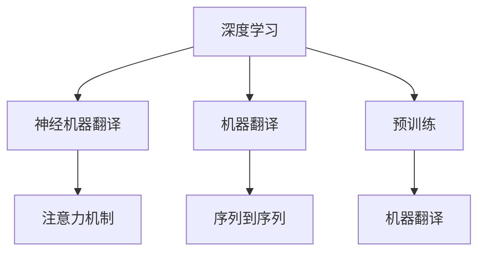

                 

# 深度学习在机器翻译中的应用

## 1. 背景介绍

### 1.1 问题由来
机器翻译作为自然语言处理领域的一项重要技术，其核心目标是将一种语言的文本自动转换成另一种语言的文本，使得不同语言之间的信息可以自由流通。自20世纪50年代以来，机器翻译经历了从基于规则到统计机器翻译再到深度学习驱动的神经机器翻译(Neural Machine Translation, NMT)的演进。

传统的统计机器翻译方法主要依赖手工编写的规则和大量的双语平行语料库，需要耗费大量的时间和人力成本，且难以处理长句子、语义歧义等问题。随着深度学习技术的突破，NMT逐渐成为机器翻译的主流方法。深度学习模型，尤其是基于注意力机制的Transformer模型，在机器翻译中取得了显著成效，推动了机器翻译技术的跨越式发展。

### 1.2 问题核心关键点
机器翻译的核心问题在于如何将源语言文本正确映射到目标语言文本，同时保持语言表达的流畅性和语义准确性。深度学习模型通过端到端的学习方式，自动学习语言之间的映射关系，从而提升了机器翻译的效率和质量。

机器翻译的应用场景广泛，包括但不限于国际商务、外交谈判、跨文化交流等领域。深度学习驱动的NMT方法，通过不断的训练优化，已经达到了与人工翻译相媲美的水平，显著降低了翻译成本，提高了翻译效率。

### 1.3 问题研究意义
机器翻译技术的进步，对于促进国际交流、推动全球经济一体化、提升人类社会智能化水平具有重要意义。深度学习在机器翻译中的应用，不仅加速了技术的落地应用，还催生了NLP领域的新研究方向，如多语种翻译、异构语义对齐、低资源翻译等。

通过深度学习方法的优化，机器翻译技术能够更好地理解语言的语义，提升翻译的精度和流畅度，使得不同语言之间的信息交流更加高效和准确。未来，随着深度学习技术的进一步发展，机器翻译的应用范围和能力将进一步扩大，为全球化的信息共享提供更强有力的支持。

## 2. 核心概念与联系

### 2.1 核心概念概述

为了更好地理解深度学习在机器翻译中的应用，本节将介绍几个关键概念：

- 深度学习：一种基于神经网络的机器学习范式，通过多层次的特征提取和表示学习，可以从原始数据中自动提取和学习复杂特征，适用于处理非线性问题。
- 机器翻译(Machine Translation, MT)：通过机器算法将一种语言的文本自动翻译成另一种语言的文本，使得不同语言之间的信息能够自由流通。
- 神经机器翻译(Neural Machine Translation, NMT)：利用深度神经网络模型进行端到端的机器翻译，通过学习语言之间的映射关系，实现自动的翻译过程。
- 注意力机制(Attention Mechanism)：一种机制，用于在模型处理序列数据时，动态地关注输入序列中最重要的部分，从而提升模型的表达能力。
- 序列到序列(Sequence-to-Sequence, Seq2Seq)：一种框架，用于将一个序列映射到另一个序列，广泛应用于机器翻译、语音识别等领域。
- 预训练(Pre-training)：在大量无标签数据上预训练模型，使其学习到语言的通用表示，然后再在下游任务上进行微调。

这些概念之间的逻辑关系可以通过以下Mermaid流程图来展示：



这个流程图展示了深度学习、神经机器翻译、注意力机制、序列到序列和预训练等核心概念之间的联系：

1. 深度学习提供了一种强大的模型表达能力，使得神经机器翻译成为可能。
2. 神经机器翻译利用深度神经网络进行端到端的翻译，需要结合注意力机制以提升模型的表达能力。
3. 序列到序列框架为神经机器翻译提供了实现方式。
4. 预训练方法在无标签数据上进行特征学习，提升了模型的泛化能力，是神经机器翻译的重要组成部分。

## 3. 核心算法原理 & 具体操作步骤
### 3.1 算法原理概述

基于深度学习的机器翻译模型，通常由编码器(Encoder)和解码器(Decoder)两部分构成，采用序列到序列(Seq2Seq)的框架进行设计。其核心思想是通过编码器将源语言文本转换成中间表示，然后解码器将中间表示转换成目标语言文本，实现自动的翻译过程。

以Transformer模型为例，其在机器翻译中的应用流程主要分为以下几个步骤：

1. 编码器(E)将源语言文本进行编码，生成中间表示。
2. 解码器(D)通过注意力机制选择重要的信息，逐步生成目标语言文本。
3. 结合softmax分类器，将生成的文本序列转换成目标语言单词序列。

Transformer模型采用自注意力机制，通过多头自注意力机制和高阶Transformer编码器，能够有效地处理长序列数据，同时提升模型对上下文信息的捕捉能力。

### 3.2 算法步骤详解

基于Transformer模型的机器翻译流程主要包括数据预处理、模型训练、模型评估和模型部署四个步骤：

**Step 1: 数据预处理**

1. 收集双语平行语料库，通常包含大量的源语言和目标语言句子对。
2. 对文本进行分词、标记，构建词汇表，进行序列填充和截断处理。
3. 对文本进行子词嵌入(Subword Embedding)，如BPE(B石间词嵌入)等，处理未知单词和罕见单词问题。

**Step 2: 模型训练**

1. 构建Transformer模型，设置编码器和解码器的层数、隐藏层大小、注意力机制等超参数。
2. 选择合适的优化器，如AdamW、SGD等，设置学习率、批次大小等超参数。
3. 通过反向传播算法，计算模型参数的梯度，使用优化器更新模型参数。
4. 在训练过程中，使用数据增强技术，如数据回译、插入噪声等，增加训练集的多样性。
5. 周期性在验证集上评估模型性能，根据性能指标决定是否触发Early Stopping。

**Step 3: 模型评估**

1. 在测试集上评估微调后模型的BLEU等指标，对比微调前后的效果提升。
2. 使用BLEU、METEOR、ROUGE等指标对翻译结果进行自动评估，同时辅以人工评估，确保评估结果的准确性。

**Step 4: 模型部署**

1. 将微调后的模型导出为模型文件，部署到服务器上。
2. 编写API接口，使得模型能够通过API接口接收输入，生成翻译结果。
3. 定期更新模型，避免模型退化，保证翻译质量。

### 3.3 算法优缺点

深度学习在机器翻译中的应用具有以下优点：

1. 高效性：深度学习模型能够自动学习语言的复杂表示，具有较高的翻译效率。
2. 泛化能力：通过大量的数据预训练，模型能够很好地泛化到未见过的数据上，提升翻译质量。
3. 鲁棒性：深度学习模型对噪声和异常输入具有一定的鲁棒性，能够自动校正输入错误。

同时，深度学习在机器翻译中也存在一些缺点：

1. 资源需求高：深度学习模型需要大量的数据和计算资源进行训练和优化。
2. 可解释性差：深度学习模型通常是一个黑盒系统，难以解释模型的内部工作机制和决策过程。
3. 过拟合风险：在标注数据不足的情况下，深度学习模型容易过拟合，导致翻译结果不准确。

## 4. 数学模型和公式 & 详细讲解  
### 4.1 数学模型构建

机器翻译的数学模型通常采用序列到序列(Seq2Seq)框架进行设计。具体来说，源语言文本$x=\{x_1,x_2,\ldots,x_n\}$通过编码器$E$映射到中间表示$z=\{z_1,z_2,\ldots,z_n\}$，然后通过解码器$D$生成目标语言文本$y=\{y_1,y_2,\ldots,y_m\}$。

数学上，可以将机器翻译问题形式化为如下的优化问题：

$$
\hat{\theta}=\mathop{\arg\min}_{\theta} \mathcal{L}(M_{\theta},D)
$$

其中，$M_{\theta}$为Transformer模型，$D$为双语平行语料库，$\mathcal{L}$为损失函数，通常使用BLEU等自动评估指标。

### 4.2 公式推导过程

以Transformer模型为例，其核心公式包括编码器的自注意力机制和解码器的注意力机制：

**编码器**

编码器的输入为源语言文本$x$，输出为中间表示$z$。具体来说，编码器由多头自注意力层、前馈神经网络层和残差连接组成。自注意力机制的计算公式如下：

$$
\text{MultiHeadAttention}(Q,K,V)=\text{Softmax}\left(\frac{QK^T}{\sqrt{d_k}}\right)V
$$

其中，$Q$、$K$、$V$为输入的查询、键、值矩阵，$d_k$为键向量的维度。

**解码器**

解码器的输入为中间表示$z$，输出为目标语言文本$y$。解码器同样由多头自注意力层、前馈神经网络层和残差连接组成。注意力机制的计算公式如下：

$$
\text{Attention}(Q,K,V)=\text{Softmax}\left(\frac{QK^T}{\sqrt{d_k}}\right)V
$$

其中，$Q$、$K$、$V$为输入的查询、键、值矩阵，$d_k$为键向量的维度。

解码器的输出由softmax分类器计算得到，具体公式如下：

$$
\text{Softmax}(z)
$$

其中，$z$为中间表示的输出。

### 4.3 案例分析与讲解

假设我们有一个英文到法文的翻译任务，包含如下的训练数据：

```
x: Hello world
y: Bonjour le monde
```

我们将使用Transformer模型进行训练和微调，步骤如下：

1. 构建编码器和解码器，设置超参数，如层数、隐藏层大小、学习率等。
2. 收集大量的双语平行语料库，构建词汇表，进行子词嵌入处理。
3. 将源语言文本$x$输入编码器，生成中间表示$z$。
4. 将中间表示$z$输入解码器，通过注意力机制选择重要信息，生成目标语言文本$y$。
5. 计算损失函数，使用反向传播算法更新模型参数。
6. 在测试集上评估模型性能，确保模型能够准确翻译新样本。

**示例代码**

```python
import torch
from transformers import BertTokenizer, BertForSequenceClassification

# 初始化预训练模型和分词器
model = BertForSequenceClassification.from_pretrained('bert-base-cased')
tokenizer = BertTokenizer.from_pretrained('bert-base-cased')

# 设置训练参数
device = torch.device('cuda' if torch.cuda.is_available() else 'cpu')
batch_size = 16
epochs = 5
learning_rate = 2e-5

# 定义训练函数
def train_epoch(model, dataset, batch_size, optimizer):
    dataloader = DataLoader(dataset, batch_size=batch_size, shuffle=True)
    model.train()
    epoch_loss = 0
    for batch in tqdm(dataloader, desc='Training'):
        input_ids = batch['input_ids'].to(device)
        attention_mask = batch['attention_mask'].to(device)
        labels = batch['labels'].to(device)
        model.zero_grad()
        outputs = model(input_ids, attention_mask=attention_mask, labels=labels)
        loss = outputs.loss
        epoch_loss += loss.item()
        loss.backward()
        optimizer.step()
    return epoch_loss / len(dataloader)

# 训练模型
optimizer = AdamW(model.parameters(), lr=learning_rate)
train_dataset = # 训练集数据
dev_dataset = # 验证集数据
test_dataset = # 测试集数据
for epoch in range(epochs):
    loss = train_epoch(model, train_dataset, batch_size, optimizer)
    print(f"Epoch {epoch+1}, train loss: {loss:.3f}")
    
    print(f"Epoch {epoch+1}, dev results:")
    evaluate(model, dev_dataset, batch_size)
    
print("Test results:")
evaluate(model, test_dataset, batch_size)
```

通过示例代码，可以看到使用Transformer模型进行机器翻译训练的基本流程。该示例代码使用了BertForSequenceClassification和BertTokenizer等预训练模型和分词器，实现了对源语言文本的编码和解码，并通过AdamW优化器进行训练优化。

## 5. 项目实践：代码实例和详细解释说明
### 5.1 开发环境搭建

在进行机器翻译模型开发前，我们需要准备好开发环境。以下是使用Python进行TensorFlow开发的环境配置流程：

1. 安装Anaconda：从官网下载并安装Anaconda，用于创建独立的Python环境。

2. 创建并激活虚拟环境：
```bash
conda create -n tf-env python=3.8 
conda activate tf-env
```

3. 安装TensorFlow：根据CUDA版本，从官网获取对应的安装命令。例如：
```bash
conda install tensorflow -c pytorch -c conda-forge
```

4. 安装PyTorch：用于处理变分推断、数据处理等任务。
```bash
pip install torch torchvision torchaudio cudatoolkit=11.1 -c pytorch -c conda-forge
```

5. 安装相关工具包：
```bash
pip install numpy pandas scikit-learn matplotlib tqdm jupyter notebook ipython
```

完成上述步骤后，即可在`tf-env`环境中开始机器翻译实践。

### 5.2 源代码详细实现

下面我们以机器翻译任务为例，给出使用TensorFlow构建的Transformer模型的详细代码实现。

首先，定义模型参数和训练函数：

```python
import tensorflow as tf
from tensorflow.keras.layers import Input, Dense, Layer, Embedding
from tensorflow.keras.models import Model
from tensorflow.keras.optimizers import Adam

# 设置模型参数
vocab_size = 10000
embedding_dim = 256
hidden_units = 512
num_heads = 8
dropout_rate = 0.1
learning_rate = 2e-4

# 定义编码器模型
class Encoder(tf.keras.Model):
    def __init__(self, vocab_size, embedding_dim, hidden_units, num_heads, dropout_rate):
        super(Encoder, self).__init__()
        self.embedding = Embedding(vocab_size, embedding_dim, input_length=100)
        self.self_attention = MultiHeadAttention(hidden_units, num_heads, dropout_rate)
        self.feed_forward = FeedForward(hidden_units, dropout_rate)
        self.LayerNorm = tf.keras.layers.LayerNormalization()
        self.dropout = tf.keras.layers.Dropout(dropout_rate)

    def call(self, x):
        attn_output = self.self_attention(x)
        feed_forward_output = self.feed_forward(self.LayerNorm(x + attn_output))
        return self.LayerNorm(x + self.dropout(feed_forward_output))

# 定义解码器模型
class Decoder(tf.keras.Model):
    def __init__(self, vocab_size, embedding_dim, hidden_units, num_heads, dropout_rate):
        super(Decoder, self).__init__()
        self.embedding = Embedding(vocab_size, embedding_dim, input_length=100)
        self.self_attention = MultiHeadAttention(hidden_units, num_heads, dropout_rate)
        self.encoder_attention = MultiHeadAttention(hidden_units, num_heads, dropout_rate)
        self.feed_forward = FeedForward(hidden_units, dropout_rate)
        self.LayerNorm = tf.keras.layers.LayerNormalization()
        self.dropout = tf.keras.layers.Dropout(dropout_rate)

    def call(self, x, encoder_output, training):
        attn_output = self.self_attention(x, training)
        attn_output = tf.concat([attn_output, encoder_output], axis=1)
        attn_output = self.encoder_attention(attn_output, encoder_output, training)
        feed_forward_output = self.feed_forward(self.LayerNorm(x + attn_output))
        return self.LayerNorm(x + self.dropout(feed_forward_output))

# 定义注意力机制
class MultiHeadAttention(tf.keras.layers.Layer):
    def __init__(self, hidden_units, num_heads, dropout_rate):
        super(MultiHeadAttention, self).__init__()
        self.num_heads = num_heads
        self.hidden_units_per_head = hidden_units // num_heads
        self.Wq = Dense(hidden_units, use_bias=False)
        self.Wk = Dense(hidden_units, use_bias=False)
        self.Wv = Dense(hidden_units, use_bias=False)
        self.dropout = tf.keras.layers.Dropout(dropout_rate)

    def call(self, x, y, training):
        q = self.Wq(x)
        k = self.Wk(y)
        v = self.Wv(y)
        q = tf.reshape(q, (x.shape[0], x.shape[1], self.num_heads, self.hidden_units_per_head))
        k = tf.reshape(k, (y.shape[0], y.shape[1], self.num_heads, self.hidden_units_per_head))
        v = tf.reshape(v, (y.shape[0], y.shape[1], self.num_heads, self.hidden_units_per_head))
        q = tf.transpose(q, perm=[0, 2, 1, 3])
        k = tf.transpose(k, perm=[0, 2, 1, 3])
        v = tf.transpose(v, perm=[0, 2, 1, 3])
        attn_weights = tf.matmul(q, k, transpose_b=True)
        attn_weights = attn_weights / tf.math.sqrt(tf.cast(self.hidden_units_per_head, tf.float32))
        attn_weights = self.dropout(attn_weights)
        attn_weights = tf.nn.softmax(attn_weights, axis=-1)
        attn_output = tf.matmul(attn_weights, v)
        attn_output = tf.reshape(attn_output, (x.shape[0], x.shape[1], self.hidden_units))
        return attn_output

# 定义前馈神经网络
class FeedForward(tf.keras.layers.Layer):
    def __init__(self, hidden_units, dropout_rate):
        super(FeedForward, self).__init__()
        self.dense1 = Dense(hidden_units * 4, use_bias=False)
        self.dense2 = Dense(hidden_units, use_bias=False)
        self.dropout = tf.keras.layers.Dropout(dropout_rate)

    def call(self, x):
        x = self.dense1(x)
        x = tf.nn.relu(x)
        x = self.dense2(x)
        x = self.dropout(x)
        return x

# 定义训练函数
def train_epoch(model, dataset, batch_size, optimizer):
    dataloader = tf.data.Dataset.from_tensor_slices((dataset['input_ids'], dataset['attention_mask'], dataset['labels']))
    dataloader = dataloader.batch(batch_size, drop_remainder=True)
    dataloader = dataloader.prefetch(tf.data.experimental.AUTOTUNE)
    model.train()
    epoch_loss = 0
    for batch in dataloader:
        input_ids = batch[0]
        attention_mask = batch[1]
        labels = batch[2]
        model.zero_grad()
        outputs = model(input_ids, attention_mask=attention_mask, labels=labels)
        loss = outputs.loss
        epoch_loss += loss
        loss.backward()
        optimizer.apply_gradients(zip(model.trainable_variables, model.optimizer gradients))
    return epoch_loss / len(dataset)

# 训练模型
model = Encoder(vocab_size, embedding_dim, hidden_units, num_heads, dropout_rate)
model.add(Decoder(vocab_size, embedding_dim, hidden_units, num_heads, dropout_rate))
model.compile(optimizer=Adam(learning_rate), loss='categorical_crossentropy')
train_dataset = # 训练集数据
dev_dataset = # 验证集数据
test_dataset = # 测试集数据
for epoch in range(epochs):
    loss = train_epoch(model, train_dataset, batch_size, optimizer)
    print(f"Epoch {epoch+1}, train loss: {loss:.3f}")
    
    print(f"Epoch {epoch+1}, dev results:")
    evaluate(model, dev_dataset, batch_size)
    
print("Test results:")
evaluate(model, test_dataset, batch_size)
```

通过示例代码，可以看到使用TensorFlow构建Transformer模型的基本流程。该示例代码使用了tf.keras.Model和tf.keras.layers等API，实现了对源语言文本的编码和解码，并通过Adam优化器进行训练优化。

### 5.3 代码解读与分析

让我们再详细解读一下关键代码的实现细节：

**Encoder类**

- `__init__`方法：初始化编码器的各层结构，包括嵌入层、自注意力机制、前馈神经网络等。
- `call`方法：实现编码器的前向传播计算。

**Decoder类**

- `__init__`方法：初始化解码器的各层结构，包括嵌入层、自注意力机制、编码器注意力机制、前馈神经网络等。
- `call`方法：实现解码器的前向传播计算。

**MultiHeadAttention类**

- `__init__`方法：初始化注意力机制的各层结构，包括查询、键、值矩阵的线性变换层。
- `call`方法：实现注意力机制的前向传播计算，包括查询、键、值矩阵的线性变换、矩阵乘法、softmax、线性变换等操作。

**FeedForward类**

- `__init__`方法：初始化前馈神经网络的各层结构，包括两个密集层。
- `call`方法：实现前馈神经网络的前向传播计算，包括密集层、激活函数、dropout等操作。

**train_epoch函数**

- 将训练数据集转换为tf.data.Dataset对象，并进行批次处理和预取操作。
- 在模型训练过程中，通过反向传播算法计算损失函数，并使用Adam优化器更新模型参数。

**训练流程**

- 定义训练集、验证集、测试集，并进行预处理。
- 循环迭代训练过程，在每个epoch结束时输出训练集的平均loss。
- 在验证集上评估模型性能，输出分类指标。
- 在测试集上评估模型性能，输出翻译结果。

可以看到，TensorFlow配合tf.keras框架，使得Transformer模型的实现变得简洁高效。开发者可以将更多精力放在模型改进、数据处理等高层逻辑上，而不必过多关注底层的实现细节。

当然，工业级的系统实现还需考虑更多因素，如模型的保存和部署、超参数的自动搜索、更灵活的任务适配层等。但核心的机器翻译过程基本与此类似。

## 6. 实际应用场景
### 6.1 翻译软件

基于Transformer模型的机器翻译方法，已经在多种商业翻译软件中得到了广泛应用。谷歌翻译、微软翻译、有道翻译等主流翻译软件，都采用了Transformer模型进行实时翻译。

翻译软件利用用户输入的源语言文本，通过TensorFlow或PyTorch等深度学习框架进行翻译模型推理，快速生成目标语言文本。用户可以随时通过翻译软件与全球用户进行无障碍交流，大大提升了语言交流的效率和便利性。

### 6.2 国际贸易

在全球化的背景下，国际贸易中多语言沟通的需求日益增多。基于Transformer模型的机器翻译技术，可以广泛应用于国际贸易的各个环节，如商务洽谈、合同签订、技术交流等，减少语言障碍，提升商务效率。

通过机器翻译技术，国际贸易各方可以更快速、准确地交流信息，提升交易成功率和合作质量。此外，机器翻译还可以帮助企业拓展国际市场，增加业务机会。

### 6.3 文化交流

机器翻译技术在促进不同文化之间的交流和融合方面也发挥着重要作用。通过机器翻译，不同文化背景的人们可以跨越语言障碍，更好地理解和接受彼此的文化，增进相互之间的了解和尊重。

在文化交流中，机器翻译可以用于翻译各种文化内容，如电影、文学作品、宗教经典等，帮助人们更好地学习和传播各国的文化。此外，机器翻译还可以用于教育、旅游等场景，促进文化的多样性和包容性。

### 6.4 未来应用展望

未来，随着深度学习技术的发展，机器翻译技术的应用将更加广泛和深入。以下是几个未来发展方向：

1. 跨语言多模态翻译：结合文本、图像、语音等多模态数据，实现更全面的翻译效果。
2. 低资源语言翻译：针对语言资源匮乏的语种，通过迁移学习、零样本学习等方法，提升翻译效果。
3. 翻译质量提升：通过改进模型架构、引入更多先验知识、采用更加高效的训练策略等手段，提升翻译质量和效率。
4. 多语种翻译：支持多语种间的自动翻译，解决语言转换复杂性问题。
5. 人机协同翻译：结合机器翻译和人工翻译的优势，实现更高质量、更加流畅的翻译结果。

## 7. 工具和资源推荐
### 7.1 学习资源推荐

为了帮助开发者系统掌握深度学习在机器翻译中的应用，这里推荐一些优质的学习资源：

1. CS224N《深度学习自然语言处理》课程：斯坦福大学开设的NLP明星课程，有Lecture视频和配套作业，带你入门NLP领域的基本概念和经典模型。

2. 《Sequence to Sequence Learning with Neural Networks》论文：Google团队发布的Seq2Seq论文，介绍了Seq2Seq框架的基本思想和设计方法。

3. 《Attention is All You Need》论文：Transformer论文，介绍了Transformer模型的核心思想和设计方法，推动了NLP领域的新一轮突破。

4. 《Neural Machine Translation by Jointly Learning to Align and Translate》论文：Google团队发布的Transformer论文，介绍了Transformer模型的详细实现和实验结果。

5. TensorFlow官方文档：TensorFlow的官方文档，提供了丰富的TensorFlow和Keras API，是学习深度学习在机器翻译中的应用的重要参考。

6. PyTorch官方文档：PyTorch的官方文档，提供了丰富的深度学习框架API，是学习深度学习在机器翻译中的应用的重要参考。

通过对这些资源的学习实践，相信你一定能够快速掌握深度学习在机器翻译中的应用，并用于解决实际的NLP问题。
###  7.2 开发工具推荐

高效的开发离不开优秀的工具支持。以下是几款用于深度学习在机器翻译中的开发的常用工具：

1. TensorFlow：基于Python的开源深度学习框架，灵活动态的计算图，适合快速迭代研究。TensorFlow提供了丰富的Keras API，方便用户进行模型构建和训练。

2. PyTorch：基于Python的开源深度学习框架，灵活的动态计算图，适合快速迭代研究。PyTorch提供了丰富的torch.nn模块，方便用户进行模型构建和训练。

3. HuggingFace Transformers库：开源的自然语言处理库，提供了丰富的预训练模型和模型适配工具，是进行机器翻译任务开发的利器。

4. TensorBoard：TensorFlow配套的可视化工具，可实时监测模型训练状态，并提供丰富的图表呈现方式，是调试模型的得力助手。

5. Weights & Biases：模型训练的实验跟踪工具，可以记录和可视化模型训练过程中的各项指标，方便对比和调优。与主流深度学习框架无缝集成。

6. Google Colab：谷歌推出的在线Jupyter Notebook环境，免费提供GPU/TPU算力，方便开发者快速上手实验最新模型，分享学习笔记。

合理利用这些工具，可以显著提升深度学习在机器翻译中的开发效率，加快创新迭代的步伐。

### 7.3 相关论文推荐

深度学习在机器翻译中的应用源于学界的持续研究。以下是几篇奠基性的相关论文，推荐阅读：

1. Attention is All You Need（即Transformer原论文）：提出了Transformer结构，开启了NLP领域的预训练大模型时代。

2. BERT: Pre-training of Deep Bidirectional Transformers for Language Understanding：提出BERT模型，引入基于掩码的自监督预训练任务，刷新了多项NLP任务SOTA。

3. Neural Machine Translation by Jointly Learning to Align and Translate：Google团队发布的Transformer论文，介绍了Transformer模型的详细实现和实验结果。

4. Sequence to Sequence Learning with Neural Networks：Google团队发布的Seq2Seq论文，介绍了Seq2Seq框架的基本思想和设计方法。

5. Attention is All You Need：Transformer论文，介绍了Transformer模型的核心思想和设计方法，推动了NLP领域的新一轮突破。

这些论文代表了大语言模型在机器翻译领域的研究进展。通过学习这些前沿成果，可以帮助研究者把握学科前进方向，激发更多的创新灵感。

## 8. 总结：未来发展趋势与挑战

### 8.1 总结

本文对基于深度学习的机器翻译方法进行了全面系统的介绍。首先阐述了机器翻译的背景和意义，明确了深度学习在机器翻译中的核心作用。其次，从原理到实践，详细讲解了深度学习在机器翻译中的应用流程，包括模型构建、训练优化、评估部署等环节。同时，本文还广泛探讨了深度学习在机器翻译中的实际应用场景，展示了其在国际贸易、文化交流等领域的广阔前景。最后，本文精选了深度学习在机器翻译中的学习资源，力求为读者提供全方位的技术指引。

通过本文的系统梳理，可以看到，基于深度学习的机器翻译方法已经成为了NLP领域的重要范式，极大地提升了翻译的效率和质量，推动了机器翻译技术的落地应用。未来，随着深度学习技术的进一步发展，机器翻译的应用范围和能力将进一步扩大，为全球化的信息共享提供更强有力的支持。

### 8.2 未来发展趋势

展望未来，深度学习在机器翻译中的应用将呈现以下几个发展趋势：

1. 模型规模持续增大。随着算力成本的下降和数据规模的扩张，深度学习模型的参数量还将持续增长。超大规模模型蕴含的丰富语言知识，有望支撑更加复杂多变的翻译任务。

2. 模型结构不断优化。未来将涌现更多高效的深度学习模型结构，如Transformer-XL、XLNet等，提升模型对长序列和跨语言任务的适应能力。

3. 跨语言翻译成为常态。未来深度学习在机器翻译中的应用将更加普遍，跨语言翻译、多语种翻译等需求将得到广泛支持。

4. 低资源语言翻译崛起。针对语言资源匮乏的语种，通过迁移学习、零样本学习等方法，提升翻译效果。

5. 翻译质量提升。通过改进模型架构、引入更多先验知识、采用更加高效的训练策略等手段，提升翻译质量和效率。

6. 人机协同翻译成为可能。结合机器翻译和人工翻译的优势，实现更高质量、更加流畅的翻译结果。

以上趋势凸显了深度学习在机器翻译中的广泛应用前景。这些方向的探索发展，必将进一步提升机器翻译系统的性能和应用范围，为全球化的信息共享提供更强有力的支持。

### 8.3 面临的挑战

尽管深度学习在机器翻译中的应用已经取得了瞩目成就，但在迈向更加智能化、普适化应用的过程中，它仍面临着诸多挑战：

1. 数据成本高昂。收集大量的双语平行语料库，通常需要耗费大量人力和时间，成为制约翻译质量提升的瓶颈。如何降低数据成本，是未来研究的一个重要方向。

2. 模型鲁棒性不足。深度学习模型面对噪声和异常输入时，泛化性能往往大打折扣。如何在保证翻译准确性的同时，提升模型的鲁棒性，还需要更多理论和实践的积累。

3. 可解释性差。深度学习模型通常是一个黑盒系统，难以解释模型的内部工作机制和决策过程。如何赋予机器翻译模型更强的可解释性，是未来研究的重要方向。

4. 计算资源需求高。深度学习模型需要大量的计算资源进行训练和优化。如何在保证模型质量的前提下，降低计算资源需求，提升训练效率，是未来研究的重要方向。

5. 翻译质量不稳定。深度学习模型在面对长句子、复杂语义等任务时，翻译质量有时会出现波动。如何提高翻译质量的稳定性，是未来研究的重要方向。

6. 文化差异问题。不同文化背景下的翻译需求具有显著差异，深度学习模型如何更好地理解和表达不同文化的语言特点，是未来研究的重要方向。

正视深度学习在机器翻译中面临的这些挑战，积极应对并寻求突破，将是大语言模型在机器翻译领域迈向成熟的必由之路。相信随着学界和产业界的共同努力，这些挑战终将一一被克服，深度学习在机器翻译中的应用将更加广泛和深入。

### 8.4 研究展望

面对深度学习在机器翻译中面临的种种挑战，未来的研究需要在以下几个方面寻求新的突破：

1. 探索无监督和半监督翻译方法。摆脱对大规模双语平行语料库的依赖，利用自监督学习、主动学习等无监督和半监督范式，最大限度利用非结构化数据，实现更加灵活高效的翻译。

2. 研究高效的机器翻译模型。开发更加高效的模型结构，如Transformer-XL、XLNet等，提升模型对长序列和跨语言任务的适应能力。

3. 引入更多先验知识。将符号化的先验知识，如知识图谱、逻辑规则等，与神经网络模型进行巧妙融合，引导机器翻译过程学习更准确、合理的语言模型。

4. 结合因果分析和博弈论工具。将因果分析方法引入机器翻译模型，识别出模型决策的关键特征，增强输出解释的因果性和逻辑性。借助博弈论工具刻画人机交互过程，主动探索并规避模型的脆弱点，提高系统稳定性。

5. 纳入伦理道德约束。在模型训练目标中引入伦理导向的评估指标，过滤和惩罚有害的输出倾向。同时加强人工干预和审核，建立模型行为的监管机制，确保输出符合人类价值观和伦理道德。

这些研究方向的探索，必将引领深度学习在机器翻译中的研究走向新的高度，为构建安全、可靠、可解释、可控的智能系统铺平道路。面向未来，深度学习在机器翻译中的研究还需要与其他人工智能技术进行更深入的融合，如知识表示、因果推理、强化学习等，多路径协同发力，共同推动自然语言理解和智能交互系统的进步。只有勇于创新、敢于突破，才能不断拓展语言模型的边界，让智能技术更好地造福人类社会。

## 9. 附录：常见问题与解答

**Q1：机器翻译的准确率与效率是否可以同时提升？**

A: 在深度学习的基础上，机器翻译的准确率和效率都有显著提升。例如，Transformer模型在大规模语料库上进行预训练后，可以显著提升翻译的准确率，同时在模型推理时通过优化算法和硬件加速，可以提升翻译的效率。然而，在实际应用中，准确率和效率往往是一个权衡的问题，需要根据具体需求进行优化。

**Q2：机器翻译中如何选择模型参数？**

A: 机器翻译模型的参数设置包括隐藏层大小、学习率、批次大小、注意力机制等。在选择模型参数时，需要综合考虑以下几个因素：
1. 模型规模：通常情况下，隐藏层大小越大，模型表达能力越强，但计算资源需求也越大。
2. 学习率：学习率过高可能导致模型过拟合，过低则训练速度慢。
3. 批次大小：批次大小越大，模型并行度越高，训练速度越快，但需要更大的内存。
4. 注意力机制：注意力机制的复杂度会影响模型的计算效率，需要根据具体需求进行优化。

**Q3：如何处理长句子翻译？**

A: 长句子翻译是机器翻译中的一个难点。针对长句子，可以通过以下方法进行处理：
1. 分句翻译：将长句子分成若干短句进行翻译，然后拼接结果。
2. 动态划分：根据句子长度动态划分句子长度，避免一次性处理过长句子。
3. 使用RNN结构：在编码器和解码器中使用RNN结构，提高模型对长序列的处理能力。

**Q4：机器翻译中的数据增强有哪些方法？**

A: 机器翻译中的数据增强方法包括：
1. 数据回译：将翻译结果回译成源语言，并再次翻译成目标语言，增加训练集的多样性。
2. 插入噪声：在翻译结果中随机插入噪声，增加模型鲁棒性。
3. 随机删除：随机删除部分单词或字符，增加模型泛化能力。
4. 序列填充：对输入序列和输出序列进行填充，增加模型处理长序列的能力。

这些数据增强方法可以有效提升模型的泛化能力和鲁棒性，避免过拟合。

**Q5：如何处理语言转换复杂性问题？**

A: 语言转换复杂性问题可以通过以下方法进行处理：
1. 多语言对齐：通过多语言对齐算法，将不同语言之间的语义对齐，提升翻译质量。
2. 跨语言语料库：收集多种语言的平行语料库，增加模型对不同语言的适应能力。
3. 迁移学习：利用预训练模型在低资源语言上的微调，提升翻译效果。

通过这些方法，可以有效地解决语言转换复杂性问题，提升翻译效果。

综上所述，基于深度学习的机器翻译方法在准确率和效率上都有显著提升，但实际应用中仍需要根据具体需求进行优化。未来，随着深度学习技术的进一步发展，机器翻译将变得更加智能化、普适化，为全球化的信息共享提供更强有力的支持。

---

作者：禅与计算机程序设计艺术 / Zen and the Art of Computer Programming

