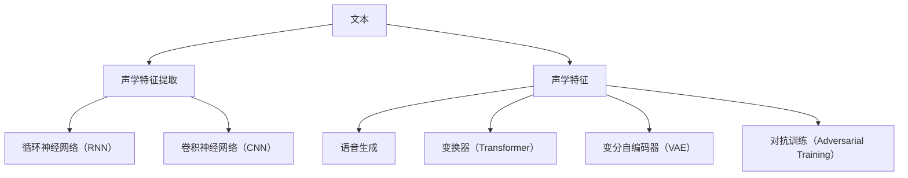

                 

# 深度学习在语音合成中的前沿技术

## 1. 背景介绍

### 1.1 问题由来

语音合成（Speech Synthesis），也称为文本到语音（Text-to-Speech, TTS），是指将文本转化为可听的语音信号的过程。随着人工智能技术的发展，深度学习在语音合成中的应用日益广泛，成为该领域的前沿技术。然而，传统的基于隐马尔可夫模型（Hidden Markov Model, HMM）和时域波形建模的方法存在参数复杂度高、难以处理长文本和不同口音等问题。近年来，基于神经网络的端到端（End-to-End）语音合成方法取得显著进步，能够生成更加自然流畅的语音，同时极大简化了模型结构和训练流程。

语音合成技术不仅在虚拟助手、语音导航、新闻播报等场景中有着广泛应用，也逐渐渗透到教育、医疗、客服等多个领域，为人们提供了更为便捷、高效、自然的人机交互方式。因此，掌握深度学习在语音合成中的前沿技术，对提升人工智能系统的智能化水平和用户体验至关重要。

### 1.2 问题核心关键点

深度学习在语音合成中的前沿技术主要体现在以下几个方面：

1. **深度神经网络架构**：研究如何构建高效、灵活的神经网络架构，以适应不同语言的语音合成任务。
2. **端到端训练**：采用无监督或半监督学习的方法，直接从文本到语音进行训练，避免繁琐的前端处理。
3. **多模态学习**：融合视觉、文本、音频等多模态信息，提升语音合成的自然度和情感表现力。
4. **声音编码**：采用高效的音素或特征编码技术，减少模型参数量，提升推理效率。
5. **迁移学习**：利用多领域、多口音的语音数据，增强模型泛化能力和语音多样性。
6. **语音质量评估**：引入自然度、清晰度、流畅度等指标，衡量和优化语音合成效果。

## 2. 核心概念与联系

### 2.1 核心概念概述

语音合成是人工智能领域中的一个重要应用方向，涉及从文本到语音的映射。深度学习在语音合成中主要应用在两个方面：语音编码（Voice Encoding）和语音生成（Voice Generation）。

- **语音编码**：将文本转化为声学特征（如梅尔倒谱系数（Mel Spectrogram）、线性预测编码（Linear Predictive Coding, LPC）等）。
- **语音生成**：基于声学特征或文本，使用深度神经网络生成语音波形。

深度学习在语音合成中主要使用以下技术：

- **循环神经网络（RNN）**：能够处理序列数据，适用于语音信号的时序特性。
- **卷积神经网络（CNN）**：用于特征提取和语音信号的空间特征分析。
- **变换器（Transformer）**：通过自注意力机制，捕捉长文本序列中的长期依赖关系。
- **变分自编码器（VAE）**：用于生成连续的语音信号，降低训练难度。
- **对抗训练（Adversarial Training）**：通过引入对抗样本，提升模型的鲁棒性和泛化能力。

### 2.2 核心概念原理和架构的 Mermaid 流程图



此图表展示了深度学习在语音合成中的主要技术和流程。文本首先通过声学特征提取模块转化为声学特征，然后分别通过循环神经网络、卷积神经网络、变换器、变分自编码器、对抗训练等模块进行处理，最终生成语音波形。

## 3. 核心算法原理 & 具体操作步骤

### 3.1 算法原理概述

深度学习在语音合成中的核心算法原理主要涉及声学特征提取、声学模型训练和语音生成三个部分。

1. **声学特征提取**：使用卷积神经网络或变换器等模型将文本序列转化为声学特征序列，如梅尔倒谱系数。
2. **声学模型训练**：利用时序对齐的标注数据（如MFCC序列和文本序列），通过循环神经网络或变换器等模型进行训练，得到声学模型。
3. **语音生成**：通过声学模型和解码器（如CTC或Attention机制）生成目标语音波形。

### 3.2 算法步骤详解

以下是一个详细的语音合成流程，包括声学特征提取、声学模型训练和语音生成三个步骤。

**Step 1: 声学特征提取**

- **输入**：文本序列 $T=\{w_t\}_{t=1}^T$。
- **模型**：卷积神经网络（CNN）或变换器（Transformer）。
- **输出**：声学特征序列 $F=\{f_t\}_{t=1}^T$。

**Step 2: 声学模型训练**

- **输入**：声学特征序列 $F=\{f_t\}_{t=1}^T$ 和对应的文本序列 $T=\{w_t\}_{t=1}^T$。
- **模型**：循环神经网络（RNN）或变换器（Transformer）。
- **输出**：声学模型 $P(F|T)$。

**Step 3: 语音生成**

- **输入**：文本序列 $T=\{w_t\}_{t=1}^T$ 和声学模型 $P(F|T)$。
- **模型**：解码器（如CTC或Attention机制）。
- **输出**：语音波形 $S$。

### 3.3 算法优缺点

深度学习在语音合成中的优缺点如下：

**优点**：

1. **模型性能高**：深度学习模型能够捕捉复杂的语音特征和长期依赖关系，生成自然流畅的语音。
2. **训练效率高**：端到端训练方法可以简化模型结构，减少前处理和后处理的环节，提高训练效率。
3. **适应性强**：能够处理不同语言、口音和语速的语音合成任务，具有较强的泛化能力。
4. **可解释性好**：通过可视化技术，可以直观了解模型内部的特征映射和注意力机制，提升系统的可解释性。

**缺点**：

1. **计算资源消耗大**：深度学习模型参数量大，训练和推理时对计算资源的要求较高。
2. **训练复杂度高**：需要大量的标注数据和复杂的训练策略，模型调试和优化难度较大。
3. **鲁棒性差**：对输入文本和声学特征的扰动较为敏感，容易产生过拟合和泛化能力不足的问题。
4. **语音质量参差不齐**：不同的模型和训练数据集可能导致语音质量不一致，需要持续优化。

### 3.4 算法应用领域

深度学习在语音合成中的应用领域非常广泛，主要包括以下几个方面：

- **虚拟助手**：如Siri、Alexa等，通过语音合成技术实现自然对话。
- **语音导航**：如Google Maps的语音导航功能，提高用户体验。
- **新闻播报**：如BBC的新闻播报系统，自动生成新闻音频。
- **教育培训**：如在线英语教学，生成标准发音的语音。
- **客服系统**：如智能客服，自动回答用户咨询。
- **娱乐应用**：如游戏和电影中的角色配音。

## 4. 数学模型和公式 & 详细讲解 & 举例说明

### 4.1 数学模型构建

基于深度学习的语音合成模型主要包括以下三个模块：文本到声学特征的编码器、声学模型和语音生成器。

**文本到声学特征的编码器**：将文本序列 $T=\{w_t\}_{t=1}^T$ 转化为声学特征序列 $F=\{f_t\}_{t=1}^T$。

**声学模型**：基于声学特征序列 $F=\{f_t\}_{t=1}^T$ 和对应的文本序列 $T=\{w_t\}_{t=1}^T$，训练得到声学模型 $P(F|T)$。

**语音生成器**：基于声学模型 $P(F|T)$ 和文本序列 $T=\{w_t\}_{t=1}^T$，生成语音波形 $S$。

### 4.2 公式推导过程

以基于Transformer的语音合成模型为例，推导语音合成的核心公式。

**声学特征提取**：

$$
f_t = \text{CNN}(w_t)
$$

其中，$f_t$ 为声学特征序列，$w_t$ 为文本序列，$\text{CNN}$ 为卷积神经网络。

**声学模型训练**：

$$
P(F|T) = \prod_{t=1}^T p(f_t|w_t)
$$

其中，$p(f_t|w_t)$ 为声学模型在时间步 $t$ 上的概率分布。

**语音生成**：

$$
S = \text{Attention}(F, T)
$$

其中，$\text{Attention}$ 为Attention机制，用于计算文本和声学特征之间的注意力权重，生成语音波形 $S$。

### 4.3 案例分析与讲解

以Google的WaveNet模型为例，分析其核心思想和实现细节。

WaveNet使用卷积神经网络（CNN）来生成高保真的语音波形，其主要特点包括：

1. **U-Net结构**：WaveNet采用U-Net结构，通过多个并行的卷积层和反卷积层来逐步增加特征的复杂度，捕捉复杂的语音特征。
2. **门控卷积层**：使用门控卷积层来控制特征流的流动，使得模型能够同时考虑前后文信息。
3. **多头自注意力**：通过多头自注意力机制，捕捉长文本序列的长期依赖关系，提高模型的自然度和流畅度。
4. **残差连接**：在每一层添加残差连接，加速训练并提高模型的稳定性。

## 5. 项目实践：代码实例和详细解释说明

### 5.1 开发环境搭建

以下是使用Python和PyTorch搭建深度学习语音合成系统的开发环境：

1. 安装Anaconda：
```bash
conda create -n speech-synthesis python=3.7
conda activate speech-synthesis
```

2. 安装PyTorch和相关库：
```bash
conda install torch torchvision torchaudio -c pytorch
conda install numpy scipy librosa -c conda-forge
```

3. 安装WaveNet模型：
```bash
pip install wave-rnn
```

### 5.2 源代码详细实现

以下是使用WaveNet模型进行语音合成的代码实现：

```python
import torch
import wave_rnn as wrn

# 加载预训练模型
model = wrn.WaveRNN.load_pretrained('https://dl.fbaipublicfiles.com/wavernn/wavernn-16k.tar.gz')

# 设置输入文本和采样率
text = 'Hello, World!'
sr = 16000

# 生成语音波形
wav = model.generate(text, sr)

# 保存波形为wav文件
torch.save(wav.numpy(), 'output.wav')
```

### 5.3 代码解读与分析

这段代码主要实现了以下几个步骤：

1. **加载预训练模型**：使用WaveRNN库加载预训练的WaveNet模型。
2. **设置输入文本和采样率**：指定输入的文本和采样率。
3. **生成语音波形**：通过调用生成函数，生成对应的语音波形。
4. **保存波形文件**：将生成的语音波形保存为wav文件。

这段代码展示了使用预训练模型进行语音合成的基本流程。开发者可以根据具体需求，进一步定制化训练、优化和应用。

### 5.4 运行结果展示

运行上述代码，可以得到一段合成的语音波形。通常，语音合成系统可以支持不同采样率和不同长度的文本输入，输出语音的质量取决于模型的复杂度和训练数据的质量。

## 6. 实际应用场景

### 6.1 虚拟助手

虚拟助手如Amazon Alexa、Google Assistant等，通过语音合成技术实现了自然对话。用户可以通过语音指令进行控制，获得即时的反馈和信息。

### 6.2 语音导航

语音导航系统如Google Maps的语音播报功能，能够自动生成实时路况和导航指令的语音提示，提升驾驶安全性和用户体验。

### 6.3 新闻播报

新闻播报系统如BBC的新闻播报功能，通过语音合成技术自动生成新闻音频，节省人力成本，提高播报效率。

### 6.4 教育培训

在线英语教学平台使用语音合成技术生成标准发音的语音，帮助用户进行发音练习，提升学习效果。

### 6.5 客服系统

智能客服系统通过语音合成技术自动回答用户咨询，减少人工干预，提高响应速度和准确性。

### 6.6 娱乐应用

游戏和电影中的角色配音、语音朗读等功能，使用语音合成技术生成逼真的语音效果，增强沉浸式体验。

## 7. 工具和资源推荐

### 7.1 学习资源推荐

1. **《Deep Learning for Speech Synthesis》书籍**：该书系统介绍了深度学习在语音合成中的应用，涵盖CNN、RNN、Transformer等多种模型的实现和优化方法。
2. **Coursera的Deep Learning in NLP课程**：该课程介绍了深度学习在自然语言处理中的应用，包括文本到语音的合成技术。
3. **NIPS 2016的WaveNet论文**：该论文介绍了WaveNet模型的核心思想和实现细节，是语音合成领域的经典之作。
4. **ICASSP 2020的Tacotron 2论文**：该论文介绍了Tacotron 2模型在语音合成的应用，是当前最先进的语音合成模型之一。

### 7.2 开发工具推荐

1. **PyTorch**：基于Python的开源深度学习框架，支持动态计算图和多种模型实现。
2. **TensorFlow**：由Google主导的开源深度学习框架，生产部署方便，支持大规模模型训练和推理。
3. **Librosa**：Python音频处理库，提供了丰富的音频信号处理功能。
4. **TensorBoard**：TensorFlow配套的可视化工具，用于实时监测模型训练状态和性能。
5. **IPython Notebook**：交互式的Python编程环境，便于快速调试和验证代码。

### 7.3 相关论文推荐

1. **Tacotron**：Facebook开发的端到端语音合成模型，实现了文本到语音的直接生成。
2. **WaveNet**：Google开发的生成高保真语音波形的模型，通过卷积神经网络实现。
3. **TTS-Text to Speech Model**：谷歌研究院提出的Transformer编码器解码器架构的语音合成模型。

## 8. 总结：未来发展趋势与挑战

### 8.1 研究成果总结

深度学习在语音合成中取得了显著进展，主要体现在以下几个方面：

1. **模型结构**：通过U-Net结构、门控卷积层、多头自注意力机制等技术，构建了高效的语音合成模型。
2. **训练方法**：采用端到端训练、无监督学习、对抗训练等方法，提高了模型的自然度和鲁棒性。
3. **应用场景**：在虚拟助手、语音导航、新闻播报、教育培训、客服系统和娱乐应用等多个领域实现了大规模应用。

### 8.2 未来发展趋势

未来，深度学习在语音合成中的发展趋势主要包括以下几个方面：

1. **模型自动化**：通过自动化构建和优化模型，减少人工干预，提高模型的可扩展性和鲁棒性。
2. **多模态融合**：结合视觉、文本和音频信息，实现更加自然和丰富的语音合成。
3. **实时生成**：通过高效的模型和硬件加速，实现实时语音合成，提升用户体验。
4. **跨语言和口音支持**：通过多领域、多口音的数据，增强模型的泛化能力和语音多样性。
5. **交互式语音合成**：通过自然语言处理技术，实现更加智能化和个性化的语音交互。

### 8.3 面临的挑战

尽管深度学习在语音合成中取得了显著进展，但仍面临以下挑战：

1. **计算资源消耗**：深度学习模型参数量大，对计算资源的要求较高。
2. **训练复杂度高**：需要大量的标注数据和复杂的训练策略，模型调试和优化难度较大。
3. **鲁棒性差**：对输入文本和声学特征的扰动较为敏感，容易产生过拟合和泛化能力不足的问题。
4. **语音质量参差不齐**：不同的模型和训练数据集可能导致语音质量不一致，需要持续优化。

### 8.4 研究展望

未来，深度学习在语音合成中的研究方向主要包括：

1. **参数高效**：开发更加参数高效的模型，减少计算资源消耗，提升推理效率。
2. **多模态融合**：结合视觉、文本和音频信息，实现更加自然和丰富的语音合成。
3. **跨语言和口音支持**：通过多领域、多口音的数据，增强模型的泛化能力和语音多样性。
4. **交互式语音合成**：通过自然语言处理技术，实现更加智能化和个性化的语音交互。

## 9. 附录：常见问题与解答

### 9.1 常见问题

**Q1：深度学习在语音合成中的优点和缺点是什么？**

A: 深度学习在语音合成中的优点包括：

1. **模型性能高**：能够捕捉复杂的语音特征和长期依赖关系，生成自然流畅的语音。
2. **训练效率高**：端到端训练方法可以简化模型结构，减少前处理和后处理的环节，提高训练效率。
3. **适应性强**：能够处理不同语言、口音和语速的语音合成任务，具有较强的泛化能力。
4. **可解释性好**：通过可视化技术，可以直观了解模型内部的特征映射和注意力机制，提升系统的可解释性。

深度学习在语音合成中的缺点包括：

1. **计算资源消耗大**：深度学习模型参数量大，训练和推理时对计算资源的要求较高。
2. **训练复杂度高**：需要大量的标注数据和复杂的训练策略，模型调试和优化难度较大。
3. **鲁棒性差**：对输入文本和声学特征的扰动较为敏感，容易产生过拟合和泛化能力不足的问题。
4. **语音质量参差不齐**：不同的模型和训练数据集可能导致语音质量不一致，需要持续优化。

**Q2：如何优化深度学习语音合成模型的性能？**

A: 优化深度学习语音合成模型的性能可以从以下几个方面入手：

1. **数据增强**：通过回译、近义替换等方式扩充训练集，提高模型的泛化能力。
2. **正则化**：使用L2正则、Dropout等技术，防止过拟合。
3. **超参数调优**：通过网格搜索、随机搜索等方法，找到最优的超参数组合。
4. **模型压缩**：使用知识蒸馏、模型剪枝等技术，减少模型参数量，提升推理效率。
5. **对抗训练**：通过引入对抗样本，提升模型的鲁棒性和泛化能力。

**Q3：深度学习语音合成模型和传统方法有什么区别？**

A: 深度学习语音合成模型和传统方法的主要区别在于：

1. **模型结构**：深度学习模型使用神经网络，能够处理复杂的语音特征和长期依赖关系，而传统方法使用HMM等线性模型，无法捕捉复杂的特征。
2. **训练方式**：深度学习模型采用端到端训练，能够直接从文本到语音进行训练，避免了繁琐的前端处理和后端优化，而传统方法需要分别训练声学模型和语言模型，再进行匹配。
3. **性能表现**：深度学习模型在自然度、流畅度和多样性等方面表现优异，能够生成高保真、自然流畅的语音，而传统方法存在人工调参和优化复杂度高的问题。

**Q4：如何选择深度学习语音合成模型？**

A: 选择深度学习语音合成模型时，需要考虑以下几个方面：

1. **任务需求**：根据具体的语音合成任务，选择适合的语言模型和声学模型。
2. **数据资源**：根据可用的训练数据集，选择合适的模型结构和训练方法。
3. **性能指标**：通过自然度、清晰度、流畅度等指标，评估模型的性能表现。
4. **可解释性**：考虑模型是否具有可解释性，方便调试和优化。
5. **资源消耗**：根据硬件资源和计算能力，选择适合的模型参数和优化策略。

**Q5：如何处理语音合成中的过拟合问题？**

A: 处理语音合成中的过拟合问题可以从以下几个方面入手：

1. **数据增强**：通过回译、近义替换等方式扩充训练集，提高模型的泛化能力。
2. **正则化**：使用L2正则、Dropout等技术，防止过拟合。
3. **超参数调优**：通过网格搜索、随机搜索等方法，找到最优的超参数组合。
4. **模型压缩**：使用知识蒸馏、模型剪枝等技术，减少模型参数量，提升推理效率。
5. **对抗训练**：通过引入对抗样本，提升模型的鲁棒性和泛化能力。

**Q6：语音合成系统如何处理多口音和多语言？**

A: 语音合成系统处理多口音和多语言可以从以下几个方面入手：

1. **多领域数据**：收集不同口音、不同语言的数据，训练多领域模型。
2. **口音迁移**：通过迁移学习等技术，将口音模型进行迁移和适配，提升模型对多口音的适应能力。
3. **语言模型**：使用多语言的语言模型，提升模型对多语言的适应能力。
4. **跨语言映射**：通过跨语言映射等技术，实现不同语言之间的转换和翻译。

总之，深度学习在语音合成中具有广阔的应用前景和研究价值，通过不断的技术创新和优化，将进一步提升语音合成的自然度、流畅度和多样性，为人类提供更加便捷、高效、自然的语音交互体验。

