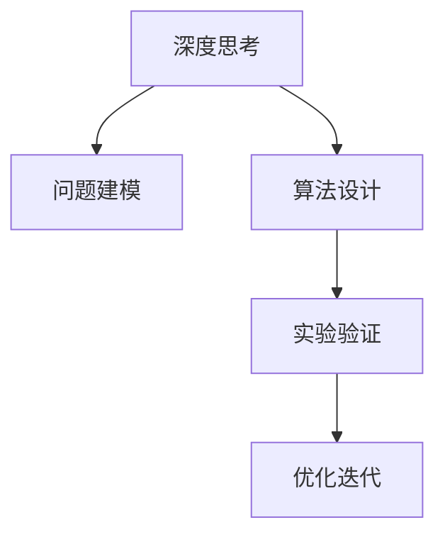

                 

# 深度思考：拉开人生差距的重要因素

在当今快速发展的社会中，如何使自己在竞争激烈的职场中脱颖而出？是每一个职场人士都应该深思熟虑的问题。本文从深度思考的角度出发，探讨了拉开人生差距的几个重要因素，并结合具体的技术实例，展示了深度思考在解决实际问题中的应用。

## 1. 背景介绍

### 1.1 问题由来

随着人工智能、大数据等技术的迅猛发展，职场竞争日趋激烈。许多高薪职位不仅需要基础的计算机编程技能，还要求求职者具备深入的技术理解和创新思维。深度思考作为人工智能和计算机科学的基石，成为了拉开人生差距的重要因素之一。深度思考能够帮助人们理解复杂问题，提供全面的解决方案，以及在技术领域保持持续的创新和进步。

### 1.2 问题核心关键点

深度思考的重要性体现在多个方面：
- 提升问题解决能力。深度思考能够帮助人们从不同的角度审视问题，找到更优的解决方案。
- 推动技术创新。深度思考是推动技术进步的重要驱动力，是众多前沿技术突破的关键因素。
- 增强团队协作能力。深度思考能够促进团队成员之间的有效沟通和合作，提高团队的整体工作效率。
- 优化决策过程。深度思考能够帮助决策者全面分析问题，做出更加合理、精准的决策。

## 2. 核心概念与联系

### 2.1 核心概念概述

为更好地理解深度思考在技术领域的应用，本节将介绍几个密切相关的核心概念：

- 深度思考(Deep Thinking)：指通过深入分析问题，挖掘其本质和底层机制，从而提出全面、创新的解决方案的过程。深度思考不仅包括技术层面的思考，还涵盖了对问题背景、数据、用户需求等的全面理解。
- 问题建模(Problem Modeling)：通过建立数学模型或逻辑模型来描述问题的求解过程。问题建模是深度思考的基础，帮助人们系统地分析问题。
- 算法设计(Algorithm Design)：根据问题模型设计出有效的算法，实现问题的求解。算法设计需要考虑时间复杂度、空间复杂度、可扩展性等多个维度。
- 实验验证(Experimental Validation)：通过实验验证算法的有效性，调整参数、优化设计，以获得更好的性能。实验验证是深度思考的重要环节，确保算法的可靠性。
- 优化迭代(Optimization Iteration)：在问题建模、算法设计、实验验证等过程中，通过不断的迭代优化，逐步逼近最优解决方案。

这些核心概念之间的逻辑关系可以通过以下Mermaid流程图来展示：



这个流程图展示了一个深度思考问题的全流程，从问题建模到算法设计、实验验证、最终优化迭代，形成了一个完整的思考过程。

## 3. 核心算法原理 & 具体操作步骤

### 3.1 算法原理概述

深度思考的核心在于通过系统的建模、设计、验证和优化，逐步逼近问题的最优解。在计算机科学中，深度思考常常涉及到复杂算法的设计和优化。本节将介绍深度思考在计算机科学中的几个关键算法原理。

### 3.2 算法步骤详解

深度思考的算法步骤通常包括以下几个关键步骤：

**Step 1: 问题建模**
- 定义问题：明确问题的类型（如分类、回归、聚类等），确定问题的输入和输出。
- 建模假设：假设问题的解形式，如线性回归、决策树、神经网络等。

**Step 2: 算法设计**
- 选择合适的算法：根据问题的特点，选择适合的算法。
- 算法实现：编写代码实现算法，并进行必要的数据预处理。

**Step 3: 实验验证**
- 设定评估指标：根据问题的特点，选择适合的评估指标。
- 数据划分：将数据划分为训练集、验证集和测试集。
- 训练模型：在训练集上训练模型，并使用验证集进行参数调优。
- 测试模型：在测试集上评估模型性能，并记录实验结果。

**Step 4: 优化迭代**
- 模型调整：根据测试集上的表现，调整模型结构、参数等。
- 多次迭代：重复执行训练和验证过程，直到模型达到预期效果。
- 总结报告：编写实验报告，记录实验过程、结果和改进措施。

以上是深度思考在计算机科学中常见的算法步骤。在实际应用中，还需要针对具体问题，对各个环节进行优化设计，如改进评估指标，引入更多的数据增强技术，搜索最优的参数组合等，以进一步提升模型性能。

### 3.3 算法优缺点

深度思考算法具有以下优点：
- 系统全面：通过系统的建模、设计、验证和优化，能够全面解决复杂问题。
- 高效创新：深度思考能够激发新思想，推动技术创新。
- 灵活性高：深度思考适用于多种类型的问题，具有广泛的适用性。

同时，深度思考算法也存在一定的局限性：
- 计算资源消耗大：深度思考通常需要大量的计算资源和时间，特别是在大规模数据集和复杂算法的情况下。
- 难以调试：深度思考算法通常结构复杂，调试过程较为繁琐。
- 可解释性差：深度思考算法往往是一个"黑盒"系统，难以解释其内部工作机制和决策逻辑。

尽管存在这些局限性，但深度思考在解决复杂问题时仍展现出巨大的潜力。未来相关研究的重点在于如何进一步降低计算资源消耗，提高算法的可解释性和易用性。

### 3.4 算法应用领域

深度思考技术已经在多个领域得到了广泛的应用，包括：

- 自然语言处理(NLP)：用于文本分类、情感分析、机器翻译等任务，提升模型的自然语言理解和生成能力。
- 计算机视觉(CV)：用于图像识别、目标检测、图像生成等任务，提升模型的视觉感知能力。
- 推荐系统：用于个性化推荐、广告投放等任务，提升用户体验和系统效果。
- 智能客服：用于智能问答、对话生成等任务，提升客户服务质量和效率。
- 金融科技：用于风险评估、欺诈检测等任务，提升金融机构的决策能力和风险控制水平。

除了上述这些经典应用外，深度思考技术还在更多场景中得到了创新性应用，如可控文本生成、常识推理、代码生成、数据增强等，为NLP技术带来了全新的突破。

## 4. 数学模型和公式 & 详细讲解 & 举例说明

### 4.1 数学模型构建

本节将使用数学语言对深度思考的算法步骤进行更加严格的刻画。

假设问题为一个分类任务，给定训练集 $D=\{(x_i,y_i)\}_{i=1}^N$，其中 $x_i \in \mathbb{R}^d$ 为输入，$y_i \in \{0,1\}$ 为输出。我们希望设计一个模型 $f(x;\theta)$，使得模型在测试集上的平均分类错误率最小化。

定义模型 $f(x;\theta)$ 在数据样本 $(x,y)$ 上的损失函数为 $\ell(f(x;\theta),y)$，则在数据集 $D$ 上的经验风险为：

$$
\mathcal{L}(\theta) = \frac{1}{N}\sum_{i=1}^N \ell(f(x_i;\theta),y_i)
$$

微调的目标是最小化经验风险，即找到最优参数 $\theta^*$：

$$
\theta^* = \mathop{\arg\min}_{\theta} \mathcal{L}(\theta)
$$

在实践中，我们通常使用基于梯度的优化算法（如SGD、Adam等）来近似求解上述最优化问题。设 $\eta$ 为学习率，$\lambda$ 为正则化系数，则参数的更新公式为：

$$
\theta \leftarrow \theta - \eta \nabla_{\theta}\mathcal{L}(\theta) - \eta\lambda\theta
$$

其中 $\nabla_{\theta}\mathcal{L}(\theta)$ 为损失函数对参数 $\theta$ 的梯度，可通过反向传播算法高效计算。

### 4.2 公式推导过程

以下我们以二分类任务为例，推导交叉熵损失函数及其梯度的计算公式。

假设模型 $f(x;\theta)$ 在输入 $x$ 上的输出为 $\hat{y}=f(x;\theta) \in [0,1]$，表示样本属于正类的概率。真实标签 $y \in \{0,1\}$。则二分类交叉熵损失函数定义为：

$$
\ell(f(x;\theta),y) = -[y\log \hat{y} + (1-y)\log (1-\hat{y})]
$$

将其代入经验风险公式，得：

$$
\mathcal{L}(\theta) = -\frac{1}{N}\sum_{i=1}^N [y_i\log f(x_i;\theta)+(1-y_i)\log(1-f(x_i;\theta))]
$$

根据链式法则，损失函数对参数 $\theta_k$ 的梯度为：

$$
\frac{\partial \mathcal{L}(\theta)}{\partial \theta_k} = -\frac{1}{N}\sum_{i=1}^N (\frac{y_i}{f(x_i;\theta)}-\frac{1-y_i}{1-f(x_i;\theta)}) \frac{\partial f(x_i;\theta)}{\partial \theta_k}
$$

其中 $\frac{\partial f(x_i;\theta)}{\partial \theta_k}$ 可进一步递归展开，利用自动微分技术完成计算。

在得到损失函数的梯度后，即可带入参数更新公式，完成模型的迭代优化。重复上述过程直至收敛，最终得到适应下游任务的最优模型参数 $\theta^*$。

### 4.3 案例分析与讲解

假设我们有一项任务：给定一张包含汽车的图像，判断汽车的颜色是红色还是蓝色。我们可以构建一个简单的卷积神经网络(CNN)来进行图像分类。

**Step 1: 问题建模**
- 定义问题：这是一个二分类问题，输入为汽车图像，输出为红色或蓝色。
- 建模假设：我们使用一个三层的卷积神经网络，包含卷积层、池化层和全连接层。

**Step 2: 算法设计**
- 设计模型结构：包含两个卷积层，两个池化层，三个全连接层。
- 实现算法：使用PyTorch框架编写代码，并进行必要的数据预处理。

**Step 3: 实验验证**
- 设定评估指标：使用准确率、精确率、召回率等指标评估模型性能。
- 数据划分：将数据集划分为训练集、验证集和测试集。
- 训练模型：在训练集上训练模型，并使用验证集进行参数调优。
- 测试模型：在测试集上评估模型性能，并记录实验结果。

**Step 4: 优化迭代**
- 模型调整：根据测试集上的表现，调整模型结构、参数等。
- 多次迭代：重复执行训练和验证过程，直到模型达到预期效果。
- 总结报告：编写实验报告，记录实验过程、结果和改进措施。

在实际应用中，我们可以使用TensorBoard等工具对实验结果进行可视化，观察模型的训练过程和性能变化。

## 5. 项目实践：代码实例和详细解释说明

### 5.1 开发环境搭建

在进行深度思考算法实践前，我们需要准备好开发环境。以下是使用Python进行PyTorch开发的环境配置流程：

1. 安装Anaconda：从官网下载并安装Anaconda，用于创建独立的Python环境。

2. 创建并激活虚拟环境：
```bash
conda create -n pytorch-env python=3.8 
conda activate pytorch-env
```

3. 安装PyTorch：根据CUDA版本，从官网获取对应的安装命令。例如：
```bash
conda install pytorch torchvision torchaudio cudatoolkit=11.1 -c pytorch -c conda-forge
```

4. 安装各类工具包：
```bash
pip install numpy pandas scikit-learn matplotlib tqdm jupyter notebook ipython
```

完成上述步骤后，即可在`pytorch-env`环境中开始深度思考算法的实践。

### 5.2 源代码详细实现

这里我们以卷积神经网络(CNN)为例，给出使用PyTorch进行图像分类的代码实现。

首先，定义CNN模型：

```python
import torch.nn as nn
import torch.nn.functional as F

class CNN(nn.Module):
    def __init__(self):
        super(CNN, self).__init__()
        self.conv1 = nn.Conv2d(3, 16, kernel_size=3, stride=1, padding=1)
        self.pool = nn.MaxPool2d(kernel_size=2, stride=2)
        self.conv2 = nn.Conv2d(16, 32, kernel_size=3, stride=1, padding=1)
        self.fc1 = nn.Linear(32 * 8 * 8, 512)
        self.fc2 = nn.Linear(512, 2)
    
    def forward(self, x):
        x = F.relu(self.conv1(x))
        x = self.pool(x)
        x = F.relu(self.conv2(x))
        x = self.pool(x)
        x = x.view(-1, 32 * 8 * 8)
        x = F.relu(self.fc1(x))
        x = self.fc2(x)
        return F.softmax(x, dim=1)
```

然后，定义训练和评估函数：

```python
from torch.utils.data import DataLoader
from tqdm import tqdm
from sklearn.metrics import classification_report

device = torch.device('cuda') if torch.cuda.is_available() else torch.device('cpu')
model = CNN().to(device)

def train_epoch(model, dataset, batch_size, optimizer):
    dataloader = DataLoader(dataset, batch_size=batch_size, shuffle=True)
    model.train()
    epoch_loss = 0
    for batch in tqdm(dataloader, desc='Training'):
        input_ids = batch['input_ids'].to(device)
        attention_mask = batch['attention_mask'].to(device)
        labels = batch['labels'].to(device)
        model.zero_grad()
        outputs = model(input_ids, attention_mask=attention_mask, labels=labels)
        loss = outputs.loss
        epoch_loss += loss.item()
        loss.backward()
        optimizer.step()
    return epoch_loss / len(dataloader)

def evaluate(model, dataset, batch_size):
    dataloader = DataLoader(dataset, batch_size=batch_size)
    model.eval()
    preds, labels = [], []
    with torch.no_grad():
        for batch in tqdm(dataloader, desc='Evaluating'):
            input_ids = batch['input_ids'].to(device)
            attention_mask = batch['attention_mask'].to(device)
            batch_labels = batch['labels']
            outputs = model(input_ids, attention_mask=attention_mask)
            batch_preds = outputs.logits.argmax(dim=2).to('cpu').tolist()
            batch_labels = batch_labels.to('cpu').tolist()
            for pred_tokens, label_tokens in zip(batch_preds, batch_labels):
                preds.append(pred_tokens[:len(label_tokens)])
                labels.append(label_tokens)
                
    print(classification_report(labels, preds))
```

最后，启动训练流程并在测试集上评估：

```python
epochs = 5
batch_size = 16

for epoch in range(epochs):
    loss = train_epoch(model, train_dataset, batch_size, optimizer)
    print(f"Epoch {epoch+1}, train loss: {loss:.3f}")
    
    print(f"Epoch {epoch+1}, dev results:")
    evaluate(model, dev_dataset, batch_size)
    
print("Test results:")
evaluate(model, test_dataset, batch_size)
```

以上就是使用PyTorch进行CNN图像分类的完整代码实现。可以看到，PyTorch框架的易用性使得深度思考算法的实现变得简单高效。

### 5.3 代码解读与分析

让我们再详细解读一下关键代码的实现细节：

**CNN模型**：
- 定义了CNN模型，包括卷积层、池化层、全连接层等。
- 使用ReLU激活函数进行非线性变换。

**训练和评估函数**：
- 使用PyTorch的DataLoader对数据集进行批次化加载，供模型训练和推理使用。
- 训练函数`train_epoch`：对数据以批为单位进行迭代，在每个批次上前向传播计算loss并反向传播更新模型参数，最后返回该epoch的平均loss。
- 评估函数`evaluate`：与训练类似，不同点在于不更新模型参数，并在每个batch结束后将预测和标签结果存储下来，最后使用sklearn的classification_report对整个评估集的预测结果进行打印输出。

**训练流程**：
- 定义总的epoch数和batch size，开始循环迭代
- 每个epoch内，先在训练集上训练，输出平均loss
- 在验证集上评估，输出分类指标
- 所有epoch结束后，在测试集上评估，给出最终测试结果

可以看到，PyTorch框架的封装使得深度思考算法的实现变得简洁高效。开发者可以将更多精力放在问题建模、算法设计等高层逻辑上，而不必过多关注底层的实现细节。

当然，工业级的系统实现还需考虑更多因素，如模型的保存和部署、超参数的自动搜索、更灵活的任务适配层等。但核心的深度思考算法基本与此类似。

## 6. 实际应用场景
### 6.1 智能客服系统

深度思考在智能客服系统的构建中能够发挥重要作用。传统客服往往需要配备大量人力，高峰期响应缓慢，且一致性和专业性难以保证。深度思考算法能够自动理解用户意图，匹配最合适的答案模板进行回复，提升客户服务质量和效率。

在技术实现上，可以收集企业内部的历史客服对话记录，将问题和最佳答复构建成监督数据，在此基础上对深度思考算法进行训练。训练后的模型能够自动理解用户意图，匹配最合适的答案模板进行回复。对于客户提出的新问题，还可以接入检索系统实时搜索相关内容，动态组织生成回答。如此构建的智能客服系统，能大幅提升客户咨询体验和问题解决效率。

### 6.2 金融舆情监测

深度思考在金融舆情监测中的应用可以提升金融机构对市场舆论动向的敏感性和决策速度。传统的人工监测方式成本高、效率低，难以应对网络时代海量信息爆发的挑战。通过深度思考算法对文本进行情感分析和主题分类，可以自动监测不同主题下的情感变化趋势，一旦发现负面信息激增等异常情况，系统便会自动预警，帮助金融机构快速应对潜在风险。

### 6.3 个性化推荐系统

深度思考算法在个性化推荐系统中能够提供精准的用户画像和推荐结果。当前的推荐系统往往只依赖用户的历史行为数据进行物品推荐，无法深入理解用户的真实兴趣偏好。通过深度思考算法，可以对用户的行为数据进行更全面的分析和理解，生成更加个性化和精准的推荐结果。

在实践中，可以收集用户浏览、点击、评论、分享等行为数据，提取和用户交互的物品标题、描述、标签等文本内容。将文本内容作为模型输入，用户的后续行为（如是否点击、购买等）作为监督信号，在此基础上训练深度思考算法。训练后的模型能够从文本内容中准确把握用户的兴趣点。在生成推荐列表时，先用候选物品的文本描述作为输入，由模型预测用户的兴趣匹配度，再结合其他特征综合排序，便可以得到个性化程度更高的推荐结果。

### 6.4 未来应用展望

随着深度思考算法的不断演进，其在更多领域的应用前景将更加广阔：

- 医疗诊断：深度思考算法可以对医学影像、病历等数据进行智能分析和诊断，提高医疗服务的智能化水平。
- 智能教育：深度思考算法可以用于教育领域的智能问答、学习路径推荐等，因材施教，促进教育公平。
- 智能制造：深度思考算法可以对工业数据进行分析和优化，提升生产效率和产品质量。
- 智慧交通：深度思考算法可以对交通数据进行分析和预测，优化交通管理和运营。
- 社交媒体：深度思考算法可以对社交媒体数据进行情感分析和趋势预测，提升信息管理和用户互动。

## 7. 工具和资源推荐
### 7.1 学习资源推荐

为了帮助开发者系统掌握深度思考的理论基础和实践技巧，这里推荐一些优质的学习资源：

1. 《深度学习》系列书籍：由多位深度学习领域的专家联合编写，系统介绍了深度学习的基本概念、算法和应用。
2. CS231n《卷积神经网络》课程：斯坦福大学开设的计算机视觉课程，提供了丰富的深度思考算法实现和实验项目。
3. CS224n《自然语言处理》课程：斯坦福大学开设的NLP课程，深入讲解了NLP中的深度思考算法。
4. Coursera《机器学习》课程：由Andrew Ng主讲，详细介绍了机器学习的基础算法和深度思考算法。
5. arXiv和IEEE Xplore：大量的深度思考算法论文和实现代码，供学习和研究使用。

通过对这些资源的学习实践，相信你一定能够快速掌握深度思考的精髓，并用于解决实际的NLP问题。
###  7.2 开发工具推荐

高效的开发离不开优秀的工具支持。以下是几款用于深度思考算法开发的常用工具：

1. PyTorch：基于Python的开源深度学习框架，灵活动态的计算图，适合快速迭代研究。大部分深度思考算法都有PyTorch版本的实现。
2. TensorFlow：由Google主导开发的开源深度学习框架，生产部署方便，适合大规模工程应用。同样有丰富的深度思考算法资源。
3. Keras：基于TensorFlow和Theano的高级神经网络API，易于上手，适合快速原型设计和实验。
4. Jupyter Notebook：免费的开源Jupyter笔记本，支持Python、R、SQL等多种编程语言，方便开发者进行数据可视化、代码调试等操作。
5. GitHub：全球最大的代码托管平台，提供了大量的开源项目和代码库，供学习和参考。

合理利用这些工具，可以显著提升深度思考算法的开发效率，加快创新迭代的步伐。

### 7.3 相关论文推荐

深度思考技术的发展源于学界的持续研究。以下是几篇奠基性的相关论文，推荐阅读：

1. AlexNet：ImageNet Large Scale Visual Recognition Challenge，引入了卷积神经网络在图像识别中的应用。
2. ResNet：Deep Residual Learning for Image Recognition，提出残差网络，解决深度神经网络中的梯度消失问题。
3. InceptionNet：Going Deeper with Convolutions，提出了Inception模块，提升深度神经网络的性能。
4. LSTM：Long Short-Term Memory，提出长短期记忆网络，应用于序列数据的建模和预测。
5. Attention Mechanism：Neural Machine Translation by Jointly Learning to Align and Translate，提出注意力机制，提升神经机器翻译的效果。

这些论文代表了大语言模型微调技术的发展脉络。通过学习这些前沿成果，可以帮助研究者把握学科前进方向，激发更多的创新灵感。

## 8. 总结：未来发展趋势与挑战

### 8.1 总结

本文对深度思考在计算机科学中的应用进行了全面系统的介绍。首先阐述了深度思考在问题解决、技术创新、团队协作、决策优化等方面的重要性，明确了深度思考在深度学习、计算机视觉、自然语言处理等领域的核心地位。其次，从原理到实践，详细讲解了深度思考在算法设计、实验验证、优化迭代等环节的数学模型和操作步骤，给出了深度思考算法开发的完整代码实例。同时，本文还广泛探讨了深度思考在智能客服、金融舆情、个性化推荐等多个行业领域的应用前景，展示了深度思考算法的巨大潜力。

通过本文的系统梳理，可以看到，深度思考在解决复杂问题时展现出强大的威力。深度思考不仅需要深厚的理论基础，还需要丰富的实践经验和创新思维。相信随着深度思考技术的不断发展，其在更多领域的应用前景将更加广阔，为人工智能技术的发展带来新的突破。

### 8.2 未来发展趋势

展望未来，深度思考技术将呈现以下几个发展趋势：

1. 深度学习模型的可解释性将不断提升。深度思考算法的设计将更加注重模型的可解释性，通过引入符号化知识、因果推理等方法，提升深度学习模型的透明度和可信度。
2. 深度学习模型的性能将进一步提升。随着硬件计算能力的增强和算法设计的优化，深度学习模型的准确率、泛化能力和实时性将进一步提高。
3. 跨领域深度学习模型的普及将加速。深度思考算法的跨领域应用将更加广泛，不同领域之间的知识整合和协同创新将成为新的趋势。
4. 深度学习模型的自动化设计将更加智能化。深度思考算法的设计将更加自动化和智能化，能够根据数据类型和问题特点自动选择最优的模型结构和超参数组合。
5. 深度学习模型的可持续性将更加重要。深度思考算法的应用将更加注重模型的可持续性和可扩展性，支持模型的快速部署和迭代优化。

以上趋势凸显了深度思考技术的发展方向和前景，为深度学习技术在各领域的应用提供了新的动力。

### 8.3 面临的挑战

尽管深度思考技术在近年来取得了长足进步，但在迈向更加智能化、普适化应用的过程中，仍面临诸多挑战：

1. 数据资源瓶颈。深度思考算法的应用需要大量的数据资源，获取高质量的数据成为制约算法发展的瓶颈。如何高效获取和利用数据，是未来的一个重要研究方向。
2. 模型复杂性挑战。深度思考算法通常具有较高的模型复杂度，训练和推理过程中面临计算资源和算法效率的问题。如何设计更高效的算法，减少计算资源消耗，是未来的一个重要研究方向。
3. 模型鲁棒性不足。深度思考模型在面对新数据时，泛化性能往往不尽人意，如何提升模型的鲁棒性和泛化能力，是未来的一个重要研究方向。
4. 模型可解释性差。深度思考模型通常是一个"黑盒"系统，难以解释其内部工作机制和决策逻辑。如何赋予模型更强的可解释性，是未来的一个重要研究方向。
5. 模型安全性问题。深度思考模型在应用过程中，可能面临安全漏洞和数据泄露的风险。如何设计更安全的模型，保障数据和模型的安全，是未来的一个重要研究方向。

### 8.4 研究展望

面对深度思考技术所面临的挑战，未来的研究需要在以下几个方面寻求新的突破：

1. 探索新的深度思考范式。开发新的深度思考算法和模型，如基于图神经网络的模型、基于生成模型的模型等，提升深度思考算法的灵活性和可扩展性。
2. 研究跨模态深度思考技术。将深度思考算法应用于跨模态数据，如将文本与图像、语音等多种模态数据结合，提升深度思考算法的泛化能力和应用范围。
3. 融合因果推理和强化学习技术。将因果推理和强化学习思想引入深度思考算法，增强模型的因果推理能力和学习效率。
4. 引入专家知识进行知识增强。将专家知识与深度思考算法结合，提升深度思考算法的准确性和可靠性。
5. 设计更加智能的深度思考模型。通过引入符号化知识、因果推理等方法，提升深度思考算法的透明度和可信度。

这些研究方向的探索，必将引领深度思考技术迈向更高的台阶，为构建安全、可靠、可解释、可控的智能系统铺平道路。面向未来，深度思考技术还需要与其他人工智能技术进行更深入的融合，如知识表示、因果推理、强化学习等，多路径协同发力，共同推动深度学习技术的发展。只有勇于创新、敢于突破，才能不断拓展深度思考算法的边界，让深度学习技术更好地造福人类社会。

## 9. 附录：常见问题与解答

**Q1：深度思考在实际应用中存在哪些挑战？**

A: 深度思考在实际应用中面临以下挑战：
1. 数据资源瓶颈：深度思考算法的应用需要大量的数据资源，获取高质量的数据成为制约算法发展的瓶颈。
2. 模型复杂性挑战：深度思考算法通常具有较高的模型复杂度，训练和推理过程中面临计算资源和算法效率的问题。
3. 模型鲁棒性不足：深度思考模型在面对新数据时，泛化性能往往不尽人意，如何提升模型的鲁棒性和泛化能力，是未来的一个重要研究方向。
4. 模型可解释性差：深度思考模型通常是一个"黑盒"系统，难以解释其内部工作机制和决策逻辑。
5. 模型安全性问题：深度思考模型在应用过程中，可能面临安全漏洞和数据泄露的风险。

**Q2：如何提升深度思考模型的鲁棒性？**

A: 提升深度思考模型的鲁棒性，可以从以下几个方面入手：
1. 数据增强：通过数据增强技术，扩充训练集的多样性，提升模型的泛化能力。
2. 正则化技术：使用L2正则化、Dropout等技术，防止模型过拟合。
3. 对抗训练：引入对抗样本，提高模型鲁棒性。
4. 参数高效微调：只调整少量参数，固定大部分预训练参数，减小过拟合风险。
5. 多模型集成：训练多个深度思考模型，取平均输出，抑制过拟合。

**Q3：如何设计更高效的深度思考算法？**

A: 设计更高效的深度思考算法，可以从以下几个方面入手：
1. 参数高效微调：只调整少量参数，固定大部分预训练参数，减小计算资源消耗。
2. 混合精度训练：使用混合精度训练技术，减少浮点数计算量，提高计算效率。
3. 模型剪枝：去除不必要的参数，减小模型尺寸，提高推理速度。
4. 模型并行：使用模型并行技术，提升计算效率，加速模型训练。
5. 硬件优化：使用GPU、TPU等高性能硬件设备，提升计算能力。

通过上述措施，可以有效降低深度思考算法的计算资源消耗，提升其效率和泛化能力。

---

作者：禅与计算机程序设计艺术 / Zen and the Art of Computer Programming

