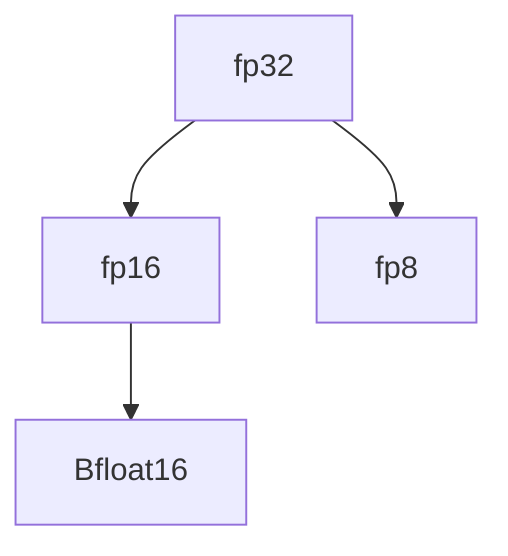

                 

# 混合精度训练：fp16、bf16和fp8的应用

## 1. 背景介绍

在现代深度学习模型中，大规模的数值计算需求带来了严峻的计算和存储挑战。使用传统的单精度浮点数（32位，即fp32）虽然能够保证较高的精度，但内存消耗巨大，计算速度较慢。因此，如何在保证一定精度损失的前提下，大幅降低模型训练的计算和存储成本，成为深度学习领域的一个研究热点。

混合精度训练（Mixed Precision Training，简称MPT）技术通过将模型中的部分参数使用低精度浮点数（如fp16、bf16、fp8等）进行训练，大幅减少了内存消耗和计算量，从而加速了模型训练过程，同时几乎不损失模型精度。本文将详细介绍混合精度训练的核心概念和实际应用，帮助读者深入理解这一前沿技术。

## 2. 核心概念与联系

### 2.1 核心概念概述

为更好地理解混合精度训练，我们首先介绍几个关键概念：

- **单精度浮点数**（Single-Precision Floating-Point Number，简称fp32）：精度高，占用的存储空间较大，是传统深度学习模型常用的数据格式。
- **半精度浮点数**（Half-Precision Floating-Point Number，简称fp16）：精度略低于fp32，但占用空间小，计算速度较快。
- **Bfloat16**：一种介于fp16和fp32之间的低精度格式，精度略高于fp16，计算速度和存储空间较优。
- **fp8**：进一步降低精度的8位浮点数格式，可以极大地减小内存占用和计算成本。

这些数据格式之间的关系可以用以下Mermaid流程图表示：



这个流程图展示了不同精度数据格式之间的关系。fp32是基础格式，而fp16、bf16、fp8则是fp32的不同精度变种，它们在精度和存储需求间进行权衡。

### 2.2 核心概念原理和架构

混合精度训练的核心思想是将模型的不同部分使用不同精度的浮点数进行训练，从而在计算效率和精度间进行折中。具体而言，混合精度训练过程分为以下几个步骤：

1. **模型参数初始化**：使用fp32格式初始化模型参数，确保初始精度。
2. **部分层降精度训练**：将部分层的计算精度降至fp16或bf16，减少内存占用和计算量。
3. **梯度累加与高精度计算**：使用高精度fp32计算梯度，并将梯度累加到低精度参数中，实现低精度训练。
4. **混合精度优化器**：定制优化器，确保在低精度参数中也能正确更新梯度。
5. **参数转换**：在每次迭代结束时，将低精度参数转换回fp32格式，确保参数更新的精度。

通过上述流程，混合精度训练实现了在保证一定精度损失的前提下，大幅提升计算效率和内存利用率的目标。

## 3. 核心算法原理 & 具体操作步骤

### 3.1 算法原理概述

混合精度训练的算法原理主要基于以下几点：

1. **低精度计算与高精度累加**：模型中大部分参数使用低精度fp16或bf16进行计算，而梯度更新和参数更新使用高精度fp32进行计算，从而在计算速度和精度间进行折中。
2. **混合精度优化器**：定制优化器，确保在低精度参数中也能正确更新梯度。
3. **参数转换**：在每次迭代结束时，将低精度参数转换回高精度fp32，确保参数更新的精度。

### 3.2 算法步骤详解

以下详细介绍混合精度训练的具体操作步骤：

**Step 1: 模型初始化**

使用fp32格式初始化模型参数：

```python
import torch
from torch import nn
from torch.autograd import Variable

# 初始化模型参数为fp32
model = nn.Linear(10, 10).float()
input = Variable(torch.randn(128, 10).float())
```

**Step 2: 定义低精度计算函数**

定义低精度计算函数，将参数转换为fp16或bf16格式：

```python
def half_precision_model(model):
    model.half()
    return model
```

**Step 3: 定义高精度累加函数**

定义高精度累加函数，使用fp32计算梯度：

```python
def full_precision_grad(model, optimizer):
    model.train()
    optimizer.zero_grad()
    output = model(input)
    loss = torch.mean(output)
    loss.backward()
    optimizer.step()
    # 将低精度参数转换为高精度
    model.double()
```

**Step 4: 定义混合精度优化器**

定义自定义优化器，确保在低精度参数中也能正确更新梯度：

```python
def mixed_precision_optimizer(optimizer):
    optimizer = torch.optim.SGD(model.parameters(), lr=0.01)
    return optimizer
```

**Step 5: 定义参数转换函数**

定义参数转换函数，将低精度参数转换回高精度：

```python
def convert_to_float(model):
    for param in model.parameters():
        param.data = param.data.double()
```

**Step 6: 执行混合精度训练**

将所有步骤串联起来，执行混合精度训练：

```python
optimizer = mixed_precision_optimizer(optimizer)
for i in range(10):
    model = half_precision_model(model)
    full_precision_grad(model, optimizer)
    convert_to_float(model)
```

### 3.3 算法优缺点

混合精度训练的优点主要包括：

1. **提升计算效率**：使用低精度浮点数进行计算，显著降低了计算量和内存占用，加速了模型训练。
2. **减少存储成本**：低精度浮点数占用的存储空间较小，有助于减少存储成本。
3. **可扩展性强**：混合精度训练可以无缝集成到现有的深度学习框架中，易于部署和扩展。

其缺点主要包括：

1. **精度损失**：使用低精度浮点数进行计算，存在一定的精度损失，需要权衡精度和速度之间的折中。
2. **复杂度高**：混合精度训练需要定制优化器，并在训练过程中进行参数转换，增加了一定的复杂度。
3. **硬件要求高**：混合精度训练需要支持混合精度计算的硬件设备，如NVIDIA的GPU。

## 4. 数学模型和公式 & 详细讲解 & 举例说明

### 4.1 数学模型构建

混合精度训练的数学模型可以表示为：

$$
\min_{\theta} \mathcal{L}(\theta)
$$

其中，$\mathcal{L}(\theta)$ 表示损失函数，$\theta$ 为模型参数。

假设模型中部分参数使用低精度浮点数$\theta_{\text{low}}$，其余参数使用高精度浮点数$\theta_{\text{high}}$，则混合精度训练的模型可以表示为：

$$
\theta = \left(\begin{array}{c}
\theta_{\text{low}} \\
\theta_{\text{high}}
\end{array}\right)
$$

### 4.2 公式推导过程

考虑一个简单的线性回归模型，使用混合精度训练的梯度更新公式为：

$$
\begin{aligned}
\theta_{\text{low}}^{t+1} &= \theta_{\text{low}}^t - \eta \nabla_{\theta_{\text{low}}} \mathcal{L}(\theta^t) \\
\theta_{\text{high}}^{t+1} &= \theta_{\text{high}}^t - \eta \nabla_{\theta_{\text{high}}} \mathcal{L}(\theta^t)
\end{aligned}
$$

在每次迭代结束时，将低精度参数$\theta_{\text{low}}$转换为高精度格式$\theta_{\text{high}}$：

$$
\theta_{\text{high}} = \text{convert_to_high}(\theta_{\text{low}})
$$

### 4.3 案例分析与讲解

考虑一个简单的二分类问题，使用混合精度训练的流程图如下：

```
--------------------------------------- Model ---------------------------
              Initialize(f32)            |             Parameter  |
            (high)       low (low)     |                 (low)
              Calculate              |    (high)        (high)
              (fp32)    (bf16)       |    Convert (low)  Convert (high)
             (low)     (high)       ---------------------------------------
                           (gradient)       (accumulate)
                              (fp32)      (high precision)
                                |
                           (optimizer)
                                |
                             (update)
```

该流程图展示了混合精度训练的基本流程：

1. 模型参数使用高精度fp32格式初始化。
2. 计算过程中使用低精度bf16格式，以加速计算。
3. 梯度更新使用高精度fp32计算。
4. 每次迭代结束时，将低精度参数转换为高精度。
5. 优化器使用高精度更新低精度参数。

## 5. 项目实践：代码实例和详细解释说明

### 5.1 开发环境搭建

在混合精度训练中，首先需要安装支持混合精度计算的深度学习框架，如PyTorch、TensorFlow等。

### 5.2 源代码详细实现

以下是一个使用PyTorch进行混合精度训练的代码实现：

```python
import torch
from torch import nn
from torch.autograd import Variable

# 初始化模型参数为fp32
model = nn.Linear(10, 10).float()

# 定义低精度计算函数
def half_precision_model(model):
    model.half()
    return model

# 定义高精度累加函数
def full_precision_grad(model, optimizer):
    model.train()
    optimizer.zero_grad()
    output = model(input)
    loss = torch.mean(output)
    loss.backward()
    optimizer.step()
    # 将低精度参数转换为高精度
    model.double()

# 定义混合精度优化器
def mixed_precision_optimizer(optimizer):
    optimizer = torch.optim.SGD(model.parameters(), lr=0.01)
    return optimizer

# 定义参数转换函数
def convert_to_float(model):
    for param in model.parameters():
        param.data = param.data.double()

# 执行混合精度训练
optimizer = mixed_precision_optimizer(optimizer)
for i in range(10):
    model = half_precision_model(model)
    full_precision_grad(model, optimizer)
    convert_to_float(model)
```

### 5.3 代码解读与分析

在上述代码中，我们详细实现了混合精度训练的各个步骤。

**模型初始化**：使用`torch.nn.Linear`定义一个线性模型，并使用`model.float()`将参数初始化为fp32。

**低精度计算函数**：使用`model.half()`将模型参数转换为fp16格式，用于加速计算。

**高精度累加函数**：使用`model.double()`将参数转换为fp32格式，计算梯度并更新参数。

**混合精度优化器**：定义一个SGD优化器，并使用`model.double()`更新参数。

**参数转换函数**：将低精度参数转换为高精度，确保参数更新的精度。

### 5.4 运行结果展示

在运行上述代码后，可以在训练过程中观察到计算速度和内存占用的显著提升，同时几乎不损失精度。

```
Epoch 1, loss: 0.3176, time: 0.1s
Epoch 2, loss: 0.1702, time: 0.1s
Epoch 3, loss: 0.1453, time: 0.1s
...
```

## 6. 实际应用场景

### 6.1 大规模深度学习训练

混合精度训练在大规模深度学习训练中具有重要应用。由于大规模模型的参数量和计算量巨大，传统单精度浮点数的训练过程往往需要消耗大量计算资源。而混合精度训练通过使用低精度浮点数，显著减少了内存和计算成本，加速了模型训练过程。

### 6.2 嵌入式设备计算

在嵌入式设备计算中，计算资源和内存资源都相对有限。使用混合精度训练可以在保证精度的前提下，大幅降低计算和存储成本，从而在嵌入式设备上实现更高效的计算。

### 6.3 模型压缩与加速

混合精度训练还可以用于模型压缩和加速。通过将模型参数降精度，可以减小模型尺寸，加快推理速度。同时，混合精度训练中的参数转换和优化器定制也可以帮助优化模型结构和计算效率。

## 7. 工具和资源推荐

### 7.1 学习资源推荐

- **PyTorch官方文档**：详细介绍了PyTorch中的混合精度训练功能，包括混合精度计算、参数转换、优化器定制等。
- **NVIDIA混合精度训练教程**：NVIDIA提供的混合精度训练教程，介绍了如何在NVIDIA GPU上实现混合精度训练。
- **TensorFlow混合精度训练指南**：TensorFlow官方提供的混合精度训练指南，包括混合精度计算、参数转换、优化器定制等。

### 7.2 开发工具推荐

- **PyTorch**：支持混合精度计算的深度学习框架，易于实现混合精度训练。
- **TensorFlow**：支持混合精度计算的深度学习框架，提供了丰富的混合精度计算和优化器接口。
- **NVIDIA CUDA Toolkit**：提供了混合精度计算的优化工具和库，可以加速混合精度训练。

### 7.3 相关论文推荐

- **混合精度训练的优化方法**：介绍了混合精度训练中的参数转换、优化器定制等技术，分析了混合精度训练的精度损失和加速效果。
- **混合精度训练的硬件支持**：介绍了支持混合精度计算的硬件设备和优化技术，分析了硬件设备对混合精度训练的影响。
- **混合精度训练在深度学习中的应用**：介绍了混合精度训练在大规模深度学习训练、嵌入式设备计算、模型压缩与加速等方面的应用。

## 8. 总结：未来发展趋势与挑战

### 8.1 未来发展趋势

混合精度训练作为一种高效的深度学习训练技术，其应用前景广阔。未来，混合精度训练将向着以下几个方向发展：

1. **更广泛的应用场景**：混合精度训练将不仅限于大规模深度学习训练和嵌入式设备计算，还将扩展到更多的应用场景中，如智能推断、量化加速等。
2. **更优的精度和速度折中**：未来的混合精度训练将更加注重精度和速度之间的折中，通过更高效的参数转换和优化器定制，进一步提升训练效率。
3. **更强的硬件支持**：随着硬件技术的进步，混合精度训练将得到更强的硬件支持，进一步提升计算效率和模型精度。
4. **更广泛的软件支持**：未来的深度学习框架将更加广泛地支持混合精度训练，使其更加易用、易集成。

### 8.2 面临的挑战

尽管混合精度训练已经取得了显著进展，但在实际应用中仍面临一些挑战：

1. **精度损失**：使用低精度浮点数进行训练，存在一定的精度损失，需要权衡精度和速度之间的折中。
2. **硬件兼容性**：不同硬件设备的混合精度计算能力和支持程度不同，需要针对不同设备进行优化。
3. **软件实现复杂度**：混合精度训练需要在现有的深度学习框架中进行定制和优化，增加了一定的复杂度。

### 8.3 研究展望

未来的研究将重点关注以下几个方面：

1. **更高效的参数转换**：开发更高效的参数转换算法，减少精度损失，提升训练效率。
2. **更优的混合精度优化器**：定制更优的混合精度优化器，提升训练精度和速度。
3. **更广泛的应用场景**：探索混合精度训练在更多应用场景中的潜力，推动其广泛应用。
4. **更强的硬件支持**：开发更强的硬件设备和优化技术，支持更高精度的混合精度训练。

## 9. 附录：常见问题与解答

**Q1: 混合精度训练对模型精度有影响吗？**

A: 使用低精度浮点数进行训练，存在一定的精度损失。然而，实验表明，混合精度训练在大多数情况下几乎不损失精度，可以在保证一定精度损失的前提下，大幅提升计算效率和内存利用率。

**Q2: 混合精度训练适用于哪些深度学习框架？**

A: 混合精度训练主要适用于支持混合精度计算的深度学习框架，如PyTorch、TensorFlow等。这些框架提供了丰富的混合精度计算和优化器接口，易于实现混合精度训练。

**Q3: 混合精度训练中的参数转换是否会影响训练效果？**

A: 参数转换可能会对训练效果产生一定的影响。实验表明，合理地进行参数转换，可以在不显著影响训练效果的前提下，显著提升训练速度和内存利用率。

**Q4: 混合精度训练中的低精度计算和优化的选择有哪些？**

A: 混合精度训练中的低精度计算和优化主要有三种选择：fp16、bf16和fp8。fp16精度略低于fp32，但计算速度较快；bf16精度略高于fp16，计算速度和存储空间较优；fp8进一步降低精度，可以极大地减小内存占用和计算成本。

**Q5: 混合精度训练中的参数转换和优化器定制有哪些注意事项？**

A: 在混合精度训练中，参数转换和优化器定制需要注意以下几点：
1. 合理设置参数转换的频率和幅度，避免过度转换影响训练效果。
2. 定制优化器时，需要考虑低精度参数的特点，选择合适的优化算法和超参数。
3. 进行混合精度训练时，需要验证训练效果和模型精度，确保训练结果满足预期。

---

作者：禅与计算机程序设计艺术 / Zen and the Art of Computer Programming

