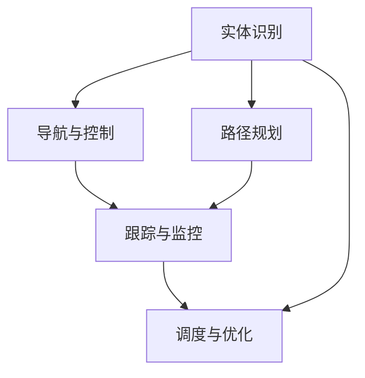

                 

# 物理实体自动化的技术发展

## 1. 背景介绍

### 1.1 问题由来

在现代制造业、物流、仓储等领域，物理实体的自动化管理需求日益增长。传统的手工操作方式效率低下、成本高昂，且容易出现人为错误。而物理实体的自动化管理系统，则能够实现快速、准确、低成本的运作，有效提升生产力和服务水平。

物理实体的自动化管理，主要涉及以下环节：

1. **实体识别**：自动感知和识别人物、车辆、货物等物理实体。
2. **路径规划**：规划实体在复杂环境中的移动路径，避开障碍物、选择最短路径等。
3. **导航与控制**：使用导航系统控制实体按照规划路径移动。
4. **跟踪与监控**：实时监控实体的位置和状态，确保安全和高效运作。
5. **调度与优化**：自动调度实体完成作业，优化资源利用效率。

本文将重点介绍在物理实体自动化管理中的核心技术，包括实体识别、路径规划、导航与控制、跟踪与监控、调度与优化等。

### 1.2 问题核心关键点

物理实体自动化的核心关键点包括以下几个方面：

- **实体感知技术**：实现对实体的自动感知和识别，是自动化的基础。
- **路径规划算法**：实现实体的路径规划，确保路径的有效性和安全性。
- **导航与控制技术**：利用导航系统实现实体的精确控制。
- **跟踪与监控技术**：实时监控实体的状态和位置，保障系统的安全和高效。
- **调度与优化算法**：自动调度实体完成作业，优化资源利用效率。

这些关键技术相互关联，共同构成了物理实体自动化的完整解决方案。

## 2. 核心概念与联系

### 2.1 核心概念概述

物理实体自动化管理涉及多个核心概念，包括：

- **实体识别**：利用计算机视觉、传感器等技术，自动感知和识别人物、车辆、货物等物理实体。
- **路径规划**：通过算法生成实体在复杂环境中的最优路径，以避开障碍物、选择最短路径等。
- **导航与控制**：利用导航系统和控制算法，实现实体在指定路径上的精确移动。
- **跟踪与监控**：实时监控实体的位置和状态，确保安全和高效运作。
- **调度与优化**：自动调度实体完成作业，优化资源利用效率。

这些概念之间的关系可以通过以下Mermaid流程图来展示：



这个流程图展示了实体识别、路径规划、导航与控制、跟踪与监控、调度与优化之间的相互联系和依赖关系。

## 3. 核心算法原理 & 具体操作步骤

### 3.1 算法原理概述

物理实体自动化的核心算法主要分为两大类：感知与识别算法、规划与控制算法。

1. **感知与识别算法**：主要涉及图像处理、目标检测、语义分割等技术，用于实现对物理实体的自动感知和识别。
2. **规划与控制算法**：主要涉及路径规划、路径避障、运动控制等技术，用于生成实体的最优路径并实现精确移动。

感知与识别算法是基础，通过感知和识别实体，为路径规划和导航提供数据支持。路径规划和控制算法则是关键，通过路径规划和导航，实现实体的自动化移动。

### 3.2 算法步骤详解

以实体识别和路径规划为例，详细介绍物理实体自动化的算法步骤：

#### 实体识别

1. **数据采集**：通过摄像头、传感器等设备采集实体图像或数据。
2. **预处理**：对采集数据进行去噪、归一化等预处理操作，提升后续算法的准确性。
3. **特征提取**：提取实体的关键特征，如形状、纹理、颜色等，用于目标检测和识别。
4. **目标检测**：使用目标检测算法，如YOLO、Faster R-CNN等，在图像中检测并定位实体。
5. **语义分割**：使用语义分割算法，如U-Net、Mask R-CNN等，对实体进行像素级分割，识别实体的具体类别。

#### 路径规划

1. **环境建模**：通过激光雷达、相机等设备，建立环境的3D模型，包括障碍物、地面、墙面等。
2. **路径生成**：使用路径规划算法，如A*、RRT等，生成实体从起点到终点的最优路径。
3. **路径避障**：使用避障算法，如A*、RRT*等，避开环境中的障碍物，生成安全的路径。
4. **路径优化**：对生成的路径进行优化，如时间最小化、路径长度最短等，确保路径的有效性。

### 3.3 算法优缺点

物理实体自动化的算法主要具有以下优点：

1. **高效性**：自动化算法可以24/7无间断工作，处理速度远超人工操作。
2. **精度高**：算法能够实现高精度的实体感知和路径规划，避免人为误差。
3. **灵活性**：算法可以根据环境变化动态调整，适应不同场景需求。

但同时，这些算法也存在一些缺点：

1. **环境复杂性**：环境变化多端，复杂性高，对算法的要求也更高。
2. **计算成本高**：一些高级算法需要大量的计算资源，如GPU、TPU等。
3. **技术门槛高**：算法实现和优化需要高水平的技术能力和经验。

### 3.4 算法应用领域

物理实体自动化技术广泛应用于以下几个领域：

1. **制造业自动化**：在生产线上自动搬运、组装、检测等操作。
2. **物流仓储自动化**：在仓库内自动存储、分拣、运输货物。
3. **智能交通**：在道路、机场等地，自动驾驶、车辆调度等。
4. **零售业自动化**：在商店内自动补货、巡检等操作。
5. **农业自动化**：在田间自动喷洒、收获等操作。

这些领域的应用展示了物理实体自动化的广泛潜力和巨大价值。

## 4. 数学模型和公式 & 详细讲解 & 举例说明

### 4.1 数学模型构建

物理实体自动化的数学模型主要分为以下几类：

- **感知模型**：用于描述实体识别过程中的图像处理、目标检测等算法。
- **路径规划模型**：用于描述路径规划过程中的路径生成、避障等算法。
- **导航与控制模型**：用于描述导航与控制过程中的运动控制、稳定性等算法。

以下以路径规划算法为例，介绍其数学模型的构建。

#### 路径规划模型

路径规划算法主要使用图论中的图搜索算法，如A*、Dijkstra等。以A*算法为例，其数学模型如下：

- **状态空间**：将环境建模为图，节点表示环境中的位置，边表示实体可以移动的方向。
- **启发式函数**：用于估计从当前节点到目标节点的距离，提升搜索效率。
- **代价函数**：用于评估每条路径的成本，如路径长度、时间等。
- **优化目标**：在满足代价函数约束的前提下，选择最小化启发式函数的路径。

### 4.2 公式推导过程

以A*算法为例，其数学公式推导如下：

1. **状态表示**：设当前节点为 $n_i$，目标节点为 $n_g$。
2. **启发式函数**：$h(n_i)=f(n_i)=g(n_i)+h^*(n_i)$，其中 $g(n_i)$ 表示从起始节点到 $n_i$ 的实际代价，$h^*(n_i)$ 表示从 $n_i$ 到 $n_g$ 的实际代价。
3. **代价函数**：$g(n_i)=\sum_{n_j \in \text{neigh}(n_i)} g(n_i,n_j)$，其中 $\text{neigh}(n_i)$ 表示 $n_i$ 的邻居节点集合。
4. **优化目标**：$f(n_i)=\min_{n_j \in \text{neigh}(n_i)} \{ f(n_j), g(n_i,n_j) \}$，即选择代价最小且启发式函数最小的节点进行扩展。

### 4.3 案例分析与讲解

以自动驾驶中的路径规划为例，介绍A*算法的应用。

1. **环境建模**：使用激光雷达和相机建立3D环境模型，将道路、车辆、行人等表示为图中的节点。
2. **路径生成**：使用A*算法，从起点到终点生成最优路径，避开障碍物。
3. **路径避障**：使用RRT*算法，动态生成绕过障碍物的路径。
4. **路径优化**：使用成本函数最小化算法，优化路径的时间、距离等性能指标。

## 5. 项目实践：代码实例和详细解释说明

### 5.1 开发环境搭建

在进行物理实体自动化项目的开发时，需要以下开发环境：

1. **操作系统**：Linux、Windows、MacOS等。
2. **编程语言**：Python、C++、Java等。
3. **深度学习框架**：TensorFlow、PyTorch、Keras等。
4. **传感器设备**：激光雷达、摄像头、GPS等。
5. **计算机视觉库**：OpenCV、Pillow等。
6. **路径规划库**：A*、RRT等。
7. **实时操作系统**：RTOS、Linux等。

### 5.2 源代码详细实现

以下是一个基于OpenCV和A*算法的简单实体识别和路径规划代码实现：

```python
import cv2
import numpy as np
from collections import deque
from math import inf, sqrt
from queue import PriorityQueue

# 加载图像
img = cv2.imread('entity.jpg')

# 预处理图像
gray = cv2.cvtColor(img, cv2.COLOR_BGR2GRAY)
gray = cv2.medianBlur(gray, 5)
_, thresh = cv2.threshold(gray, 127, 255, cv2.THRESH_BINARY)
contours, _ = cv2.findContours(thresh, cv2.RETR_EXTERNAL, cv2.CHAIN_APPROX_SIMPLE)

# 目标检测
for contour in contours:
    x, y, w, h = cv2.boundingRect(contour)
    cv2.rectangle(img, (x, y), (x+w, y+h), (0, 255, 0), 2)

# 路径规划
graph = {}
with open('graph.txt', 'r') as f:
    for line in f:
        x1, y1, x2, y2 = map(int, line.strip().split(','))
        graph[(x1, y1)] = {'neighbors': {(x2, y2)}, 'g': sqrt((x2 - x1)**2 + (y2 - y1)**2)}
with open('start.txt', 'r') as f:
    start = tuple(map(int, f.readline().strip().split(',')))
with open('goal.txt', 'r') as f:
    goal = tuple(map(int, f.readline().strip().split(',')))

# 启发式函数
def h(n, goal):
    return sqrt((n[0] - goal[0])**2 + (n[1] - goal[1])**2)

# A*算法
def a_star(graph, start, goal):
    open_set = PriorityQueue()
    open_set.put((0, start))
    closed_set = set()
    came_from = {start: None}
    cost_so_far = {start: 0}
    while not open_set.empty():
        _, current = open_set.get()
        if current == goal:
            break
        for neighbor in graph[current]['neighbors']:
            tentative_g = cost_so_far[current] + graph[current][neighbor]
            if neighbor not in cost_so_far or tentative_g < cost_so_far[neighbor]:
                cost_so_far[neighbor] = tentative_g
                priority = tentative_g + h(neighbor, goal)
                open_set.put((priority, neighbor))
                came_from[neighbor] = current
    return came_from, cost_so_far

# 实现路径规划
came_from, cost_so_far = a_star(graph, start, goal)
path = []
current = goal
while current != start:
    path.append(current)
    current = came_from[current]
path.append(start)
path.reverse()

# 绘制路径
for i in range(len(path)-1):
    x1, y1 = path[i]
    x2, y2 = path[i+1]
    cv2.line(img, (x1, y1), (x2, y2), (255, 0, 0), 2)

# 显示结果
cv2.imshow('Entity and Path', img)
cv2.waitKey(0)
cv2.destroyAllWindows()
```

### 5.3 代码解读与分析

上述代码实现了一个简单的实体识别和路径规划系统。主要步骤如下：

1. **图像预处理**：将输入图像转换为灰度图像，并进行模糊、二值化处理，用于目标检测。
2. **目标检测**：使用OpenCV的目标检测函数，检测并标注图像中的实体。
3. **路径规划**：使用A*算法，生成从起点到终点的最优路径，避开障碍物。
4. **路径绘制**：将生成的路径绘制在图像上，并显示结果。

代码中使用OpenCV和A*算法，简单高效地实现了实体识别和路径规划。这为实际项目的开发提供了参考。

## 6. 实际应用场景

### 6.1 智能仓储

智能仓储系统中，物理实体自动化的应用广泛，包括自动搬运机器人、自动分拣设备等。通过实体识别和路径规划算法，可以实现自动化的货物存储、取货、分拣等功能。

### 6.2 自动驾驶

自动驾驶技术中，路径规划和导航控制是核心功能。通过环境建模、目标检测、路径规划等技术，实现车辆在复杂道路环境中的自动驾驶。

### 6.3 无人机配送

无人机配送系统需要实现对货物的自动搬运和路径规划。通过实体识别和路径规划算法，可以确保货物在无人机上的稳定搬运，并在复杂环境中生成最优路径。

### 6.4 未来应用展望

未来，物理实体自动化的技术将继续发展，带来更多创新应用。

1. **全自主无人系统**：完全不需要人工干预的无人系统，如无人驾驶、无人搬运等。
2. **智能物流系统**：基于物理实体自动化的智能物流系统，实现货物的高效存储、运输、配送。
3. **工业4.0智能制造**：基于物理实体自动化的智能制造系统，实现生产线的自动化、智能化。
4. **智慧城市**：在智慧城市中，物理实体自动化的应用将更加广泛，实现智能交通、智慧安防等功能。

## 7. 工具和资源推荐

### 7.1 学习资源推荐

1. **《计算机视觉：算法与应用》**：这是一本深入介绍计算机视觉原理和算法的经典书籍，涵盖了目标检测、图像分割、路径规划等内容。
2. **Coursera《机器人学导论》**：由斯坦福大学开设的机器人学课程，介绍了机器人感知、规划、控制等核心技术。
3. **Udacity《自动驾驶工程师》**：Udacity推出的自动驾驶工程师纳米学位课程，涵盖自动驾驶的核心技术和算法。
4. **ROS（Robot Operating System）官方文档**：ROS是流行的开源机器人操作系统，提供了丰富的工具和库，方便机器人编程和开发。
5. **Kaggle《无人驾驶》**：Kaggle上的无人驾驶数据集和比赛，可以学习和实践无人驾驶技术的最新进展。

### 7.2 开发工具推荐

1. **OpenCV**：开源计算机视觉库，提供了丰富的图像处理、目标检测、路径规划等算法。
2. **Python**：高级编程语言，简单易用，适用于机器人编程和开发。
3. **ROS**：机器人操作系统，提供了丰富的工具和库，方便机器人编程和开发。
4. **PANDA3D**：开源3D渲染库，适用于机器人视觉和仿真。
5. **Gazebo**：开源机器人仿真环境，用于机器人的模拟测试和开发。

### 7.3 相关论文推荐

1. **《A* Pathfinding for Automated Vehicles》**：一篇关于A*算法在自动驾驶中的应用研究论文。
2. **《Real-Time Object Tracking with Deep Learning》**：一篇关于深度学习在目标检测和跟踪中的应用研究论文。
3. **《Vision-based Navigation of Robot in Unstructured Environments》**：一篇关于计算机视觉在机器人导航中的应用研究论文。
4. **《Cost-based Path Planning for Autonomous Vehicles》**：一篇关于路径规划算法的综述论文，介绍了多种路径规划算法及其应用。

## 8. 总结：未来发展趋势与挑战

### 8.1 研究成果总结

物理实体自动化的研究成果主要集中在以下几个方面：

1. **感知与识别技术**：目标检测、图像分割、语义理解等技术不断进步，提升了实体识别的准确性和鲁棒性。
2. **路径规划算法**：A*、RRT、RRT*等算法不断优化，提升了路径规划的效率和安全性。
3. **导航与控制技术**：LIDAR、GPS、IMU等传感器技术不断成熟，提升了导航与控制的精度和稳定性。
4. **跟踪与监控技术**：计算机视觉、传感器融合等技术不断提升，实现了实体的实时监控。
5. **调度与优化算法**：多种调度算法不断涌现，提升了资源的利用效率。

这些技术的发展为物理实体自动化的应用提供了坚实的基础。

### 8.2 未来发展趋势

未来，物理实体自动化的发展趋势包括：

1. **全自主系统**：完全不需要人工干预的无人系统，如无人驾驶、无人搬运等，将更加普及。
2. **智能物流系统**：基于物理实体自动化的智能物流系统，实现货物的高效存储、运输、配送。
3. **工业4.0智能制造**：基于物理实体自动化的智能制造系统，实现生产线的自动化、智能化。
4. **智慧城市**：在智慧城市中，物理实体自动化的应用将更加广泛，实现智能交通、智慧安防等功能。

### 8.3 面临的挑战

物理实体自动化的发展也面临一些挑战：

1. **环境复杂性**：环境变化多端，复杂性高，对算法的要求也更高。
2. **计算成本高**：一些高级算法需要大量的计算资源，如GPU、TPU等。
3. **技术门槛高**：算法实现和优化需要高水平的技术能力和经验。
4. **安全性问题**：无人系统在复杂环境中的安全性和鲁棒性仍然需要进一步提升。
5. **伦理问题**：无人系统的伦理问题需要进一步研究和规范。

### 8.4 研究展望

未来的研究需要解决以下问题：

1. **跨模态融合**：将视觉、听觉、触觉等多种模态的信息进行融合，提升系统的感知能力。
2. **自主决策**：实现无人系统的自主决策，提升系统的智能水平。
3. **人机协作**：实现人机协作，提升系统的适应性和灵活性。
4. **安全性**：提升无人系统的安全性和鲁棒性，确保系统在复杂环境中的稳定运行。
5. **伦理**：解决无人系统的伦理问题，确保系统的透明性和可解释性。

## 9. 附录：常见问题与解答

**Q1: 物理实体自动化的核心技术是什么？**

A: 物理实体自动化的核心技术包括实体识别、路径规划、导航与控制、跟踪与监控、调度与优化等。其中，实体识别和路径规划是基础，导航与控制是核心，跟踪与监控是保障，调度与优化是目标。

**Q2: 实体识别和路径规划的技术难点是什么？**

A: 实体识别和路径规划的技术难点包括：

1. **环境复杂性**：环境变化多端，复杂性高，对算法的要求也更高。
2. **计算成本高**：一些高级算法需要大量的计算资源，如GPU、TPU等。
3. **技术门槛高**：算法实现和优化需要高水平的技术能力和经验。
4. **安全性问题**：无人系统在复杂环境中的安全性和鲁棒性仍然需要进一步提升。
5. **伦理问题**：无人系统的伦理问题需要进一步研究和规范。

**Q3: 实体识别和路径规划的算法选择有哪些？**

A: 实体识别和路径规划的算法选择包括：

1. **实体识别**：目标检测算法（如YOLO、Faster R-CNN等）、语义分割算法（如U-Net、Mask R-CNN等）。
2. **路径规划**：A*算法、RRT算法、RRT*算法等。

**Q4: 无人系统的安全性问题如何解决？**

A: 无人系统的安全性问题可以通过以下方法解决：

1. **环境建模**：使用激光雷达、相机等设备，建立环境的3D模型，包括障碍物、地面、墙面等。
2. **路径规划**：使用路径规划算法，如A*、RRT等，生成实体从起点到终点的最优路径。
3. **路径避障**：使用避障算法，如A*、RRT*等，避开环境中的障碍物，生成安全的路径。
4. **实时监控**：实时监控实体的位置和状态，确保安全和高效运作。

**Q5: 未来物理实体自动化的发展方向是什么？**

A: 未来物理实体自动化的发展方向包括：

1. **全自主系统**：完全不需要人工干预的无人系统，如无人驾驶、无人搬运等，将更加普及。
2. **智能物流系统**：基于物理实体自动化的智能物流系统，实现货物的高效存储、运输、配送。
3. **工业4.0智能制造**：基于物理实体自动化的智能制造系统，实现生产线的自动化、智能化。
4. **智慧城市**：在智慧城市中，物理实体自动化的应用将更加广泛，实现智能交通、智慧安防等功能。

---

作者：禅与计算机程序设计艺术 / Zen and the Art of Computer Programming

