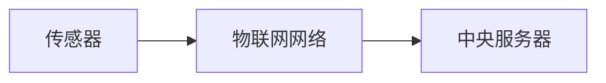
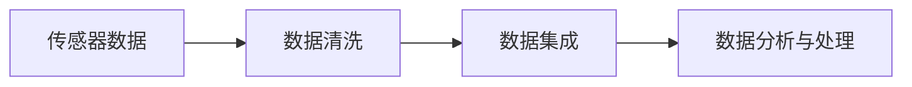
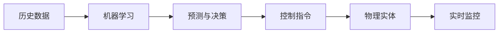

                 

# 物理实体自动化的未来探索

## 1. 背景介绍

### 1.1 问题由来

在现代社会，物理实体的自动化管理与运营已成为推动工业升级、提高生产效率的关键因素。随着物联网(IoT)、智能制造、智能物流等技术的迅速发展，物理实体的数字化、智能化水平日益提升。然而，尽管自动化技术已在许多领域得到应用，但仍存在诸多挑战：设备协同问题、系统复杂性、数据集成和实时决策等问题，这些挑战限制了物理实体自动化的进一步发展。

### 1.2 问题核心关键点

物理实体的自动化管理与运营涉及设备之间的协同、数据集成、实时监控、智能决策等多个环节，需要采用先进的技术手段，如人工智能、大数据、物联网等，构建一个全面、高效、智能的自动化系统。

关键点包括：
- **设备协同**：实现多类物理实体间的信息共享与协作。
- **数据集成**：整合各类数据源，建立统一的、准确的数据仓库。
- **实时监控**：利用传感器和实时通信技术，实现对物理实体的实时监控与控制。
- **智能决策**：通过机器学习算法，进行预测与决策，优化生产流程。

### 1.3 问题研究意义

物理实体的自动化管理与运营的提升，不仅可以降低运营成本，提高生产效率，还能增强企业的市场竞争力。研究如何采用人工智能技术，构建高效、智能的物理实体自动化系统，具有重要的理论意义和现实意义。

## 2. 核心概念与联系

### 2.1 核心概念概述

为更好地理解物理实体自动化的自动化管理与运营，本节将介绍几个关键概念：

- **物理实体**：指物理世界中可以被数字化表示的各种对象，如设备、货物、生产线等。
- **物联网(IoT)**：通过各类传感器、设备、应用进行信息收集、传输、处理的网络系统。
- **人工智能**：利用计算机模拟人类智能行为，实现自主学习、决策等智能过程。
- **数据集成**：将多个数据源的数据整合，形成统一的、高质量的数据仓库。
- **实时监控与控制**：通过传感器与通信技术，实现对物理实体的实时数据采集与控制。
- **智能决策**：利用人工智能算法，进行预测与决策，优化生产流程。

这些概念之间的逻辑关系可以通过以下Mermaid流程图来展示：

```mermaid
graph TB
    A[物理实体] --> B[物联网(IoT)]
    B --> C[数据集成]
    B --> D[实时监控与控制]
    C --> D
    A --> E[人工智能]
    E --> F[智能决策]
    F --> D
```

这个流程图展示了一个基本的物理实体自动化系统：

1. 物理实体通过物联网技术采集数据。
2. 数据集成模块将数据整合，形成统一的数据仓库。
3. 实时监控与控制模块基于数据进行实时决策。
4. 人工智能模块为智能决策提供算法支持。

这些概念共同构成了物理实体自动化的核心框架，使其能够实现高效、智能的管理与运营。

## 3. 核心算法原理 & 具体操作步骤

### 3.1 算法原理概述

物理实体自动化的自动化管理与运营，本质上是一个数据驱动、智能决策的系统。其核心思想是：通过物联网技术获取物理实体的实时状态与数据，利用数据集成技术整合信息，采用人工智能算法进行智能决策与控制，从而实现物理实体的自动化管理与运营。

具体而言，物理实体自动化的自动化管理与运营包括如下几个关键步骤：

1. **数据采集与传输**：利用各类传感器采集物理实体的状态与参数数据，并通过物联网技术将数据传输到中央服务器。
2. **数据存储与处理**：将采集到的数据存储在统一的数据仓库中，并采用数据处理技术进行清洗、分析和处理。
3. **智能决策与控制**：利用人工智能算法，对处理后的数据进行分析，进行预测与决策，形成控制指令，控制物理实体运行。

### 3.2 算法步骤详解

#### 3.2.1 数据采集与传输

物理实体的数据采集与传输是自动化管理与运营的基础。其具体步骤如下：

1. **传感器部署**：在物理实体上部署各类传感器，如温度传感器、位置传感器、压力传感器等，用于实时采集物理实体的状态与参数数据。
2. **数据传输**：利用物联网技术，如5G、LoRa、Wi-Fi等，将传感器采集的数据实时传输到中央服务器。



#### 3.2.2 数据存储与处理

数据存储与处理是物理实体自动化的核心环节，主要包括以下步骤：

1. **数据清洗**：清洗采集到的数据，去除噪声和异常值，确保数据质量。
2. **数据集成**：将不同来源的数据集成到统一的数据仓库中，建立数据之间的关联关系。
3. **数据分析与处理**：采用数据分析技术，如统计分析、时间序列分析、机器学习等，对数据进行深入挖掘，提取有价值的信息。



#### 3.2.3 智能决策与控制

智能决策与控制是物理实体自动化的关键步骤，主要包括以下几个方面：

1. **预测与决策**：利用机器学习算法，对历史数据进行分析，预测未来趋势，进行决策。
2. **控制指令生成**：根据决策结果，生成控制指令，控制物理实体的运行状态。
3. **实时监控**：对物理实体的运行状态进行实时监控，确保系统稳定运行。



### 3.3 算法优缺点

物理实体自动化的自动化管理与运营方法具有以下优点：

1. **高效性**：通过自动化系统，实现了物理实体的实时监控与控制，提高了生产效率。
2. **智能化**：利用人工智能算法进行决策，提高了决策的准确性和效率。
3. **可靠性**：自动化系统减少了人为操作的失误，提高了系统的可靠性。
4. **可扩展性**：系统可以根据需要扩展设备和功能，适应不同的应用场景。

同时，该方法也存在以下局限性：

1. **设备协同复杂**：实现多类物理实体间的信息共享与协作较为复杂，需要采用先进的技术手段。
2. **数据集成困难**：不同来源的数据集成难度较大，需要建立统一的数据标准和协议。
3. **实时决策难度高**：实时监控和决策需要高效、准确的数据处理与分析，对算力与技术要求较高。

尽管存在这些局限性，但就目前而言，物理实体自动化的自动化管理与运营方法仍是大势所趋。未来相关研究的重点在于如何进一步简化设备协同过程，提高数据集成效率，优化实时决策算法，以实现更高效、智能的物理实体自动化系统。

### 3.4 算法应用领域

物理实体自动化的自动化管理与运营方法在多个领域得到了广泛应用，例如：

- **智能制造**：利用自动化系统进行设备监控、故障预测、生产调度等，提升生产效率和产品质量。
- **智能物流**：通过自动化系统实现货物跟踪、仓储管理、配送路线优化等，提高物流效率。
- **智慧城市**：实现对交通、环境、公共设施等的实时监控与控制，提升城市管理水平。
- **智慧医疗**：实现对医疗设备、药品、病患等的实时监控与控制，提高医疗服务质量。
- **智能农业**：通过自动化系统进行土壤监测、作物生长预测、精准灌溉等，提升农业生产效率。

这些应用场景展示了物理实体自动化的广阔前景，表明其具备广泛的应用价值。

## 4. 数学模型和公式 & 详细讲解

### 4.1 数学模型构建

物理实体自动化的自动化管理与运营涉及多个领域的数据与算法，其中数据集成的数学模型较为复杂。

设物理实体的状态数据为 $x_i$，$i=1,...,N$，其中 $N$ 为物理实体数量。假设所有物理实体采集的数据具有相同的概率分布 $P(x)$。

则数据集成的目标是建立统一的、准确的数据仓库，使得所有物理实体数据 $x_i$ 都能在一个共同的空间中表示。设数据仓库为 $D$，其中 $D=\{x_i\}_{i=1}^N$，则数据集成的目标为：

$$
D = \{ x_i \} = \{ P(x_i) \} 
$$

### 4.2 公式推导过程

数据集成的过程可以采用多种方法，如统计方法、机器学习方法等。这里以均值集成方法为例，进行公式推导。

假设所有物理实体采集的数据具有相同的概率分布 $P(x)$，则数据集成的目标为：

$$
D = \{ x_i \} = \{ P(x_i) \}
$$

均值集成方法的目标是最小化所有数据 $x_i$ 的均方误差：

$$
\min_{x_i} \sum_{i=1}^N (x_i - \mu)^2
$$

其中 $\mu$ 为数据仓库的均值，可以表示为：

$$
\mu = \frac{1}{N} \sum_{i=1}^N x_i
$$

### 4.3 案例分析与讲解

以智能制造系统为例，说明数据集成的实际应用。假设某制造企业拥有多条生产线，每条生产线采集到的温度、压力、湿度等数据具有相同的概率分布。

利用均值集成方法，将所有生产线的数据整合到统一的数据仓库中，建立数据之间的关联关系，得到每个生产线的均值数据 $\mu_i$，表示为：

$$
\mu_i = \frac{1}{M_i} \sum_{j=1}^{M_i} x_{i,j}
$$

其中 $M_i$ 为第 $i$ 条生产线的数据量。

通过数据集成，可以更好地监控生产线的运行状态，进行预测与决策，优化生产流程。

## 5. 项目实践：代码实例和详细解释说明

### 5.1 开发环境搭建

在进行物理实体自动化的自动化管理与运营实践前，我们需要准备好开发环境。以下是使用Python进行PyTorch开发的环境配置流程：

1. 安装Anaconda：从官网下载并安装Anaconda，用于创建独立的Python环境。

2. 创建并激活虚拟环境：
```bash
conda create -n pytorch-env python=3.8 
conda activate pytorch-env
```

3. 安装PyTorch：根据CUDA版本，从官网获取对应的安装命令。例如：
```bash
conda install pytorch torchvision torchaudio cudatoolkit=11.1 -c pytorch -c conda-forge
```

4. 安装TensorFlow：使用pip安装TensorFlow，如：
```bash
pip install tensorflow
```

5. 安装各类工具包：
```bash
pip install numpy pandas scikit-learn matplotlib tqdm jupyter notebook ipython
```

完成上述步骤后，即可在`pytorch-env`环境中开始物理实体自动化的自动化管理与运营实践。

### 5.2 源代码详细实现

这里我们以智能制造系统为例，给出使用TensorFlow进行数据集成的PyTorch代码实现。

首先，定义数据采集函数：

```python
import tensorflow as tf
import numpy as np

def collect_data(num_lines, num_samples):
    lines = []
    for i in range(num_lines):
        line = np.random.normal(size=num_samples)
        lines.append(line)
    return np.array(lines)

# 定义数据集
num_lines = 5
num_samples = 100
data = collect_data(num_lines, num_samples)
```

然后，定义数据清洗函数：

```python
def clean_data(data):
    return data - np.mean(data, axis=0)
```

接着，定义数据集成函数：

```python
def integrate_data(data):
    num_lines = data.shape[0]
    mean_lines = np.mean(data, axis=1)
    return np.mean(data, axis=0)
```

最后，定义数据集成后的监控与决策函数：

```python
def monitor_and_decide(data):
    cleaned_data = clean_data(data)
    integrated_data = integrate_data(cleaned_data)
    # 假设监测到生产线温度异常，需调整生产参数
    if integrated_data > 0.5:
        print("Temperature anomaly detected. Adjust production parameters.")
    else:
        print("Temperature is normal. Continue normal operation.")
```

完整代码如下：

```python
import tensorflow as tf
import numpy as np

def collect_data(num_lines, num_samples):
    lines = []
    for i in range(num_lines):
        line = np.random.normal(size=num_samples)
        lines.append(line)
    return np.array(lines)

def clean_data(data):
    return data - np.mean(data, axis=0)

def integrate_data(data):
    num_lines = data.shape[0]
    mean_lines = np.mean(data, axis=1)
    return np.mean(data, axis=0)

def monitor_and_decide(data):
    cleaned_data = clean_data(data)
    integrated_data = integrate_data(cleaned_data)
    # 假设监测到生产线温度异常，需调整生产参数
    if integrated_data > 0.5:
        print("Temperature anomaly detected. Adjust production parameters.")
    else:
        print("Temperature is normal. Continue normal operation.")

# 定义数据集
num_lines = 5
num_samples = 100
data = collect_data(num_lines, num_samples)

# 数据集成
integrated_data = integrate_data(data)

# 数据清洗
cleaned_data = clean_data(data)

# 监控与决策
monitor_and_decide(cleaned_data)
```

### 5.3 代码解读与分析

让我们再详细解读一下关键代码的实现细节：

**collect_data函数**：
- 模拟多个生产线的数据采集，生成随机数模拟生产线采集的数据。

**clean_data函数**：
- 对采集到的数据进行清洗，去除均值，确保数据质量。

**integrate_data函数**：
- 对清洗后的数据进行均值集成，得到每条生产线的均值数据。

**monitor_and_decide函数**：
- 假设监测到生产线温度异常，需调整生产参数，输出相应的决策。

**数据集成过程**：
1. 通过调用`collect_data`函数，生成模拟的多个生产线数据。
2. 通过调用`integrate_data`函数，对采集到的数据进行均值集成，得到每条生产线的均值数据。
3. 通过调用`clean_data`函数，对集成后的数据进行清洗，去除均值。
4. 最后，调用`monitor_and_decide`函数，进行温度监控与决策。

通过上述代码，我们可以看到，数据集成的过程是物理实体自动化的自动化管理与运营的基础。通过数据的清洗和集成，可以更好地进行监控与决策，优化生产流程。

## 6. 实际应用场景

### 6.1 智能制造

基于物理实体自动化的自动化管理与运营方法，智能制造系统能够实现设备的实时监控、故障预测、生产调度等，提升生产效率和产品质量。

在技术实现上，可以收集生产线上的各类传感器数据，如温度、压力、湿度等，利用数据集成技术整合信息，采用机器学习算法进行故障预测和生产调度，生成控制指令，控制生产设备的运行状态。如此构建的智能制造系统，能大幅提升生产效率，降低运营成本。

### 6.2 智能物流

通过物理实体自动化的自动化管理与运营方法，智能物流系统可以实现货物的实时跟踪、仓储管理、配送路线优化等，提高物流效率。

在技术实现上，可以采集货物运输过程中的位置、速度、温度等数据，利用数据集成技术整合信息，采用机器学习算法进行配送路线优化和库存管理，生成配送指令，控制货物的运输和仓储。通过实时监控和智能决策，可以实现货物的精准配送和仓储管理，提高物流效率。

### 6.3 智慧城市

利用物理实体自动化的自动化管理与运营方法，智慧城市系统可以实现对交通、环境、公共设施等的实时监控与控制，提升城市管理水平。

在技术实现上，可以采集城市中的各类传感器数据，如交通流量、环境污染指数、公共设施状态等，利用数据集成技术整合信息，采用机器学习算法进行交通调度、环境监测和公共设施管理，生成控制指令，控制城市的运行状态。通过实时监控和智能决策，可以实现城市的智能化管理，提升居民生活质量。

### 6.4 未来应用展望

随着物理实体自动化的自动化管理与运营技术不断发展，未来在更多领域将得到应用，为各行各业带来变革性影响。

在智慧医疗领域，基于物理实体自动化的自动化管理与运营方法，可以用于医疗设备的实时监控、病人状态的预测与决策，提升医疗服务质量。

在智能农业领域，通过物理实体自动化的自动化管理与运营方法，可以实现对土壤的实时监测、作物的生长预测、精准灌溉等，提升农业生产效率。

在智能家居领域，物理实体自动化的自动化管理与运营方法，可以实现对家庭设备的实时监控与控制，提升家庭生活的智能化水平。

此外，在智能工厂、智能仓储、智能交通等多个领域，基于物理实体自动化的自动化管理与运营方法也将不断涌现，为各行各业带来新的发展机遇。

## 7. 工具和资源推荐

### 7.1 学习资源推荐

为了帮助开发者系统掌握物理实体自动化的自动化管理与运营的理论基础和实践技巧，这里推荐一些优质的学习资源：

1. **《物联网智能技术》**：介绍物联网技术的理论基础和实践方法，涵盖物联网系统的架构、协议、应用等方面。
2. **《机器学习》**：斯坦福大学开设的机器学习课程，涵盖机器学习的基本概念、算法和应用等方面。
3. **《深度学习》**：斯坦福大学开设的深度学习课程，涵盖深度学习的基本概念、算法和应用等方面。
4. **《大数据技术与应用》**：介绍大数据技术的理论基础和实践方法，涵盖大数据系统的架构、技术、应用等方面。
5. **《工业物联网与智能制造》**：介绍工业物联网和智能制造的理论基础和实践方法，涵盖工业物联网的架构、技术、应用等方面。

通过对这些资源的学习实践，相信你一定能够快速掌握物理实体自动化的自动化管理与运营的精髓，并用于解决实际的NLP问题。

### 7.2 开发工具推荐

高效的开发离不开优秀的工具支持。以下是几款用于物理实体自动化的自动化管理与运营开发的常用工具：

1. **TensorFlow**：谷歌主导开发的开源深度学习框架，生产部署方便，适合大规模工程应用。
2. **PyTorch**：基于Python的开源深度学习框架，灵活动态的计算图，适合快速迭代研究。
3. **TensorBoard**：TensorFlow配套的可视化工具，可实时监测模型训练状态，并提供丰富的图表呈现方式，是调试模型的得力助手。
4. **Weights & Biases**：模型训练的实验跟踪工具，可以记录和可视化模型训练过程中的各项指标，方便对比和调优。
5. **Hadoop**：Apache开源的大数据处理框架，支持分布式计算和存储，适合大规模数据处理。
6. **Apache Kafka**：Apache开源的消息队列系统，支持高吞吐量的数据传输，适合实时数据采集和传输。

合理利用这些工具，可以显著提升物理实体自动化的自动化管理与运营任务的开发效率，加快创新迭代的步伐。

### 7.3 相关论文推荐

物理实体自动化的自动化管理与运营技术的发展源于学界的持续研究。以下是几篇奠基性的相关论文，推荐阅读：

1. **《物联网智能技术》**：介绍物联网技术的理论基础和实践方法，涵盖物联网系统的架构、协议、应用等方面。
2. **《机器学习》**：斯坦福大学开设的机器学习课程，涵盖机器学习的基本概念、算法和应用等方面。
3. **《深度学习》**：斯坦福大学开设的深度学习课程，涵盖深度学习的基本概念、算法和应用等方面。
4. **《大数据技术与应用》**：介绍大数据技术的理论基础和实践方法，涵盖大数据系统的架构、技术、应用等方面。
5. **《工业物联网与智能制造》**：介绍工业物联网和智能制造的理论基础和实践方法，涵盖工业物联网的架构、技术、应用等方面。

这些论文代表了大数据、物联网、深度学习等技术的发展脉络。通过学习这些前沿成果，可以帮助研究者把握学科前进方向，激发更多的创新灵感。

## 8. 总结：未来发展趋势与挑战

### 8.1 总结

本文对物理实体自动化的自动化管理与运营方法进行了全面系统的介绍。首先阐述了物理实体自动化的研究背景和意义，明确了物理实体自动化的自动化管理与运营方法在提高生产效率、降低运营成本、提升城市管理水平等方面的独特价值。其次，从原理到实践，详细讲解了物理实体自动化的自动化管理与运营方法，给出了物理实体自动化的自动化管理与运营任务开发的完整代码实例。同时，本文还广泛探讨了物理实体自动化的自动化管理与运营方法在智能制造、智能物流、智慧城市等多个领域的应用前景，展示了物理实体自动化的自动化管理与运营方法的广阔前景。

通过本文的系统梳理，可以看到，物理实体自动化的自动化管理与运营方法正在成为智能制造、智能物流、智慧城市等领域的核心技术，极大地推动了各行各业的智能化转型。未来，伴随物理实体自动化的自动化管理与运营方法的不断发展，其将进一步拓展到更多领域，为各行各业带来更多的变革性影响。

### 8.2 未来发展趋势

展望未来，物理实体自动化的自动化管理与运营技术将呈现以下几个发展趋势：

1. **智能化程度提升**：随着人工智能技术的不断发展，物理实体自动化的自动化管理与运营方法将实现更高的智能化程度，具备更强的预测与决策能力。
2. **数据融合与协同**：物理实体自动化的自动化管理与运营方法将实现更多数据的融合与协同，实现全面、准确的系统监控与控制。
3. **边缘计算与实时性提升**：通过引入边缘计算技术，物理实体自动化的自动化管理与运营方法将实现更高效的实时数据处理与决策，降低数据传输延迟。
4. **自动化与协同优化**：物理实体自动化的自动化管理与运营方法将实现更多的自动化与协同优化，提高系统运行效率与可靠性。
5. **安全与隐私保护**：物理实体自动化的自动化管理与运营方法将实现更高的安全性和隐私保护，防止数据泄露与滥用。

以上趋势凸显了物理实体自动化的自动化管理与运营技术的广阔前景。这些方向的探索发展，必将进一步提升物理实体自动化的自动化管理与运营系统的高效、智能、可靠水平，为各行各业带来更深刻的变革性影响。

### 8.3 面临的挑战

尽管物理实体自动化的自动化管理与运营技术已经取得了瞩目成就，但在迈向更加智能化、普适化应用的过程中，它仍面临诸多挑战：

1. **设备协同复杂**：实现多类物理实体间的信息共享与协作较为复杂，需要采用先进的技术手段。
2. **数据集成困难**：不同来源的数据集成难度较大，需要建立统一的数据标准和协议。
3. **实时决策难度高**：实时监控和决策需要高效、准确的数据处理与分析，对算力与技术要求较高。
4. **安全性有待加强**：物理实体自动化的自动化管理与运营方法在数据安全和隐私保护方面仍需进一步加强，防止数据泄露与滥用。
5. **资源消耗较大**：物理实体自动化的自动化管理与运营方法对计算资源和存储资源的需求较大，需要进一步优化系统架构。

正视物理实体自动化的自动化管理与运营方法面临的这些挑战，积极应对并寻求突破，将是大势所趋。

### 8.4 研究展望

面对物理实体自动化的自动化管理与运营方法所面临的种种挑战，未来的研究需要在以下几个方面寻求新的突破：

1. **数据融合与协同优化**：进一步提升数据的融合与协同效率，提高系统运行效率与可靠性。
2. **边缘计算与实时性提升**：引入边缘计算技术，实现更高效的实时数据处理与决策，降低数据传输延迟。
3. **智能化与协同优化**：进一步提升物理实体自动化的自动化管理与运营方法的智能化程度，实现更多自动化与协同优化。
4. **安全性与隐私保护**：提高数据安全和隐私保护水平，防止数据泄露与滥用。
5. **资源优化与系统优化**：优化系统架构和资源配置，降低计算资源和存储资源的需求，提高系统效率与可靠性。

这些研究方向的探索，必将引领物理实体自动化的自动化管理与运营技术迈向更高的台阶，为各行各业带来更多的变革性影响。面向未来，物理实体自动化的自动化管理与运营技术还需要与其他人工智能技术进行更深入的融合，如知识表示、因果推理、强化学习等，多路径协同发力，共同推动物理实体自动化的自动化管理与运营系统的进步。只有勇于创新、敢于突破，才能不断拓展物理实体自动化的自动化管理与运营的边界，让智能技术更好地造福各行各业。

## 9. 附录：常见问题与解答

**Q1：物理实体自动化的自动化管理与运营是否适用于所有行业？**

A: 物理实体的自动化管理与运营方法适用于大多数行业，但需要根据具体应用场景进行定制化设计。例如，在医疗、金融等领域，需要进行特定的数据采集和处理，以保证数据的准确性和可靠性。

**Q2：物理实体自动化的自动化管理与运营方法中，数据集成和实时监控与控制的核心技术是什么？**

A: 物理实体自动化的自动化管理与运营方法中，数据集成的核心技术包括数据清洗、数据融合和数据标准化等，目标是建立一个统一、高质量的数据仓库。实时监控与控制的核心技术包括传感器部署、数据传输和实时决策等，目标是实现对物理实体的实时监控与控制。

**Q3：物理实体自动化的自动化管理与运营方法中，如何保障数据安全和隐私保护？**

A: 物理实体自动化的自动化管理与运营方法中，保障数据安全和隐私保护的关键在于采用先进的数据加密技术、访问控制机制和隐私保护算法等，确保数据在采集、传输和存储过程中的安全性和隐私保护。同时，还需要加强人工干预和审核，建立模型行为的监管机制，确保输出符合人类价值观和伦理道德。

**Q4：物理实体自动化的自动化管理与运营方法中，如何实现高效率和低成本？**

A: 物理实体自动化的自动化管理与运营方法中，实现高效率和低成本的关键在于采用先进的自动化技术和算法，如深度学习、强化学习等，实现高效的监控与决策。同时，还需要优化系统架构，降低计算资源和存储资源的需求，提高系统效率与可靠性。

通过本文的系统梳理，可以看到，物理实体自动化的自动化管理与运营方法正在成为各行各业的核心技术，极大地推动了智能化转型。未来，伴随物理实体自动化的自动化管理与运营方法的不断发展，其将进一步拓展到更多领域，为各行各业带来更多的变革性影响。

