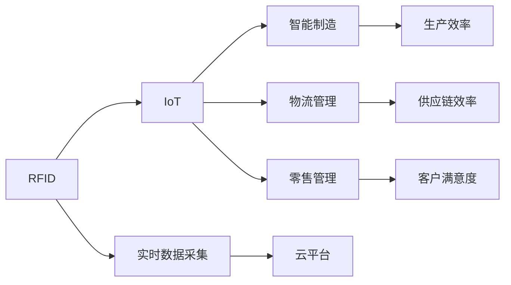
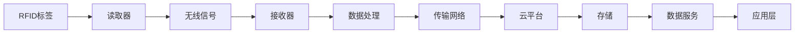

                 

## 1. 背景介绍

物联网（IoT）技术的发展正在深刻改变着我们的生产和生活方式。通过各种传感器设备，如RFID（射频识别），IoT系统能够实时收集、传输和处理大量数据，从而实现智能化管理和决策。本文将系统介绍RFID技术及其在IoT中的应用，探讨其在智能制造、物流、零售等领域的典型应用场景，并提供相关的技术实现和最佳实践。

## 2. 核心概念与联系

### 2.1 核心概念概述

- **RFID（Radio Frequency Identification）**：一种利用无线电波非接触地识别和跟踪对象的无线通信技术。RFID标签（Tag）包含唯一的标识信息，可以通过读取器（Reader）自动检测和识别。

- **物联网（IoT）**：通过各种传感器设备，实时采集环境数据，并将数据上传到云平台进行分析和处理，实现智能决策和自动化控制。

- **智能制造（Smart Manufacturing）**：将IoT技术和智能算法应用于生产过程，提高生产效率和质量，降低成本。

- **物流管理（Logistics Management）**：利用IoT技术实时跟踪货物位置，优化运输路线，提高供应链效率。

- **零售管理（Retail Management）**：通过IoT技术实现库存管理、客户行为分析等，提升零售业运营效率和客户满意度。

这些核心概念之间的联系可通过以下Mermaid流程图展示：



### 2.2 核心概念原理和架构的 Mermaid 流程图

下面的Mermaid流程图展示了RFID与IoT系统的架构关系，以及RFID标签、读取器、云平台和应用层之间的数据流：



## 3. 核心算法原理 & 具体操作步骤

### 3.1 算法原理概述

RFID与IoT系统的集成通常包括以下几个关键步骤：

1. **标签编码**：对RFID标签进行唯一编码，确保每个标签具有唯一的标识。
2. **读取器部署**：在目标区域内布置读取器，确保标签在指定范围内可以被读取。
3. **数据传输**：读取器将收集到的数据通过无线网络传输到云平台。
4. **数据处理**：云平台对接收到的数据进行处理，包括数据清洗、分析和存储。
5. **数据应用**：通过应用层将处理后的数据应用于智能决策和控制。

### 3.2 算法步骤详解

**Step 1: 标签编码**
- 选择适当的编码方案，如EPCglobal、ISO/IEC 18000等。
- 使用RFID标签生成器生成唯一编码，如序列号、商品编码等。
- 确保编码方案符合行业标准和应用需求。

**Step 2: 读取器部署**
- 根据RFID标签的部署区域和密度，选择合适的读取器类型（如手持式、固定式）。
- 布置读取器的位置，确保覆盖整个目标区域。
- 配置读取器的参数，如天线增益、扫描频率等。

**Step 3: 数据传输**
- 使用无线网络（如Wi-Fi、Zigbee、Bluetooth等）将读取器收集到的数据传输到云平台。
- 在传输过程中，使用加密和认证技术保障数据安全。

**Step 4: 数据处理**
- 使用云平台的数据处理服务，对接收到的数据进行清洗、去重和标准化。
- 应用机器学习算法对数据进行分析和建模，如聚类、分类、回归等。
- 将处理后的数据存储在数据库中，以便后续查询和分析。

**Step 5: 数据应用**
- 通过应用层接口，将处理后的数据应用于各种业务场景，如库存管理、物流跟踪、客户分析等。
- 设计合适的数据展示和分析界面，帮助用户理解和利用数据。

### 3.3 算法优缺点

**优点**：
- 实时数据采集：RFID能够实时采集数据，提供快速、准确的监测能力。
- 非接触式识别：RFID标签无需接触即可识别，减少了对设备的物理磨损。
- 易于部署：RFID系统部署相对简单，成本较低。

**缺点**：
- 标签成本较高：高质量的RFID标签相对昂贵。
- 标签易丢失：标签在运输过程中可能丢失或损坏。
- 读取器干扰：复杂的阅读环境可能对阅读器造成干扰。

### 3.4 算法应用领域

RFID与IoT系统的集成在多个领域都有广泛应用，包括：

- **智能制造**：通过RFID标签跟踪设备状态、零部件流动等，提高生产效率和质量。
- **物流管理**：实时监控货物位置，优化运输路线，提升供应链效率。
- **零售管理**：跟踪库存水平、客户行为，提升客户满意度和运营效率。
- **供应链管理**：自动化仓库管理、物流跟踪，降低运营成本。
- **资产管理**：跟踪资产位置、状态，提高资产利用率和维护效率。

## 4. 数学模型和公式 & 详细讲解 & 举例说明

### 4.1 数学模型构建

RFID与IoT系统的集成过程中，数据的处理和分析通常涉及以下数学模型：

- **数据采集模型**：描述RFID标签的读取频率和分布。
- **数据传输模型**：描述数据在无线网络中的传输效率和延迟。
- **数据分析模型**：描述数据在云平台上的处理和分析过程。

### 4.2 公式推导过程

假设RFID标签的读取频率为 $P$，读取器覆盖的面积为 $A$，目标区域内的RFID标签数量为 $N$，则数据采集模型可以表示为：

$$ P = k \cdot N \cdot A $$

其中 $k$ 为比例系数。

在数据传输模型中，假设数据传输速率为 $v$，网络延迟为 $\tau$，则传输时间 $t$ 可以表示为：

$$ t = \frac{D}{v} + \tau $$

其中 $D$ 为数据量。

数据分析模型通常涉及机器学习算法，如回归、分类、聚类等，其公式推导过程较为复杂，需要根据具体问题和算法类型进行详细推导。

### 4.3 案例分析与讲解

以智能制造为例，RFID标签被用于跟踪生产线上各设备的运行状态和零部件流动。读取器读取RFID标签的信息，并通过无线网络将数据传输到云平台，云平台使用机器学习算法对数据进行分析，判断设备的健康状况和零部件的库存水平。

## 5. 项目实践：代码实例和详细解释说明

### 5.1 开发环境搭建

1. 安装RFID模块和读取器驱动程序。
2. 搭建物联网平台，如IoTOS、ThingWorx等。
3. 配置云平台，如AWS、Azure等，确保数据存储和处理。

### 5.2 源代码详细实现

以下是一个RFID数据采集和传输的Python代码示例：

```python
import pyradio
import threading
import time

# 读取器配置
reader = pyradio.Radio()

# 设置读取器参数
reader.set_frequency(915)
reader.set_power(5)

# 设置RFID标签编码
tag_code = '12345678'

# 读取RFID标签
def read_tag():
    while True:
        tag = reader.read(tag_code)
        if tag is not None:
            print('Read tag:', tag)
        time.sleep(1)

# 创建线程
thread = threading.Thread(target=read_tag)
thread.start()

# 持续运行读取器
while True:
    time.sleep(1)
```

### 5.3 代码解读与分析

该代码示例使用了PyRadio库，通过设定读取器频率和功率，读取特定编码的RFID标签。读取器周期性检查标签，并将数据通过无线网络传输到云平台。

### 5.4 运行结果展示

运行代码后，读取器会周期性输出读取到的RFID标签信息。这些信息可以进一步上传到云平台，进行数据分析和处理。

## 6. 实际应用场景

### 6.1 智能制造

在智能制造中，RFID技术被广泛应用于生产线上的设备状态监测、零部件跟踪和库存管理。通过RFID标签和读取器，可以实时监测设备运行状态，预测设备故障，优化生产流程，提高生产效率和质量。

### 6.2 物流管理

在物流管理中，RFID技术被用于实时跟踪货物位置，优化运输路线，提升供应链效率。通过RFID标签和读取器，可以实时获取货物位置信息，减少运输时间和成本，提高物流效率。

### 6.3 零售管理

在零售管理中，RFID技术被用于库存管理、客户行为分析等。通过RFID标签和读取器，可以实时监测库存水平，预测库存需求，优化库存管理。同时，RFID标签还可以用于跟踪客户行为，分析消费趋势，提升客户满意度和销售额。

### 6.4 未来应用展望

未来，RFID与IoT的集成将更加智能化和自动化，覆盖更多应用场景。例如：

- **智能仓储**：通过RFID技术实时监测货物位置，优化仓储管理，减少人工干预。
- **智能物流**：使用无人机和自动驾驶车辆，实时跟踪货物位置，提升物流效率和灵活性。
- **智能零售**：利用RFID技术实现精准库存管理、客户行为分析，提升零售运营效率。
- **智能资产管理**：通过RFID标签实时监测设备状态和位置，优化资产利用率和维护效率。

## 7. 工具和资源推荐

### 7.1 学习资源推荐

1. **《物联网入门教程》**：详细介绍了IoT技术和RFID的基本概念和应用场景。
2. **《RFID技术手册》**：涵盖了RFID标签、读取器、天线等关键部件的详细说明。
3. **《机器学习与IoT》课程**：结合机器学习和IoT技术，讲解了数据采集、处理和分析过程。

### 7.2 开发工具推荐

1. **PyRadio**：Python库，用于读取RFID标签和处理数据。
2. **IoTOS**：IoT平台，提供物联网设备管理、数据处理和应用开发功能。
3. **AWS IoT**：云平台，提供物联网设备连接、数据处理和分析服务。

### 7.3 相关论文推荐

1. **《RFID技术在智能制造中的应用》**：探讨了RFID技术在智能制造中的具体应用，包括设备状态监测、零部件跟踪等。
2. **《基于IoT的物流管理系统》**：介绍了物联网技术在物流管理中的应用，包括货物跟踪、路线优化等。
3. **《RFID在零售管理中的作用》**：分析了RFID技术在零售库存管理和客户行为分析中的应用。

## 8. 总结：未来发展趋势与挑战

### 8.1 研究成果总结

RFID与IoT的集成在多个领域取得了显著的成果，推动了智能制造、物流管理、零售管理等领域的发展。其高效的数据采集和实时监测能力，为各种业务场景提供了强大的技术支持。

### 8.2 未来发展趋势

未来，RFID与IoT的集成将更加智能化和自动化，覆盖更多应用场景。例如：

1. **智能仓储**：通过RFID技术实时监测货物位置，优化仓储管理，减少人工干预。
2. **智能物流**：使用无人机和自动驾驶车辆，实时跟踪货物位置，提升物流效率和灵活性。
3. **智能零售**：利用RFID技术实现精准库存管理、客户行为分析，提升零售运营效率。
4. **智能资产管理**：通过RFID标签实时监测设备状态和位置，优化资产利用率和维护效率。

### 8.3 面临的挑战

尽管RFID与IoT的集成取得了显著进展，但在实际应用中也面临诸多挑战：

1. **数据安全**：RFID数据的传输和存储需要严格保障数据安全，防止数据泄露和篡改。
2. **标签成本**：高质量的RFID标签相对昂贵，需要找到成本效益平衡点。
3. **读取器干扰**：复杂的阅读环境可能对读取器造成干扰，需要优化读取器部署。

### 8.4 研究展望

未来，RFID与IoT的集成研究需要在以下几个方面进行深入探索：

1. **数据隐私保护**：研究RFID数据的隐私保护技术，防止数据泄露和滥用。
2. **低成本标签**：开发低成本、高效率的RFID标签，降低部署成本。
3. **抗干扰技术**：研究抗干扰技术，提高读取器的稳定性和可靠性。
4. **智能决策**：结合人工智能技术，提升RFID数据的分析和决策能力。

通过不断探索和创新，RFID与IoT的集成将发挥更大的潜力，为各行各业带来更高效、更智能的解决方案。

## 9. 附录：常见问题与解答

**Q1: RFID标签和读取器如何选择？**

A: 根据具体应用场景选择合适的RFID标签和读取器。一般而言，RFID标签需要具备唯一编码，读取器需要具备足够的覆盖范围和读取精度。

**Q2: 如何提高RFID数据的传输效率？**

A: 使用高带宽无线网络，如Wi-Fi、5G等。同时，优化读取器和标签的频率和功率，减少干扰和延迟。

**Q3: 如何保障RFID数据的安全性？**

A: 使用数据加密和认证技术，防止数据泄露和篡改。同时，定期更新RFID标签的编码，防止标签丢失和仿制。

**Q4: RFID标签如何应对环境干扰？**

A: 优化读取器的频率和功率，减少环境干扰。同时，选择耐腐蚀、耐高温的标签材料，提高标签的抗干扰能力。

**Q5: 如何优化RFID系统的部署和维护？**

A: 根据具体应用场景，优化读取器的部署位置和参数，确保覆盖范围和读取精度。同时，定期维护读取器和标签，防止设备故障。

**Q6: 如何处理RFID数据的大规模存储和分析？**

A: 使用云平台和大数据技术，优化数据存储和处理效率。同时，应用机器学习算法，提升数据分析和决策能力。

**Q7: 如何结合IoT技术提升RFID系统的智能性？**

A: 结合IoT技术，实时监测和分析RFID数据，优化设备状态监测、供应链管理、库存管理等。同时，应用人工智能算法，提升系统的决策能力和自动化水平。

总之，RFID与IoT的集成为各行各业提供了强大的数据采集和实时监测能力，推动了智能化和自动化进程。未来，通过不断探索和创新，RFID与IoT的系统将更加智能和高效，为各行各业带来更广阔的应用前景。

---

作者：禅与计算机程序设计艺术 / Zen and the Art of Computer Programming

