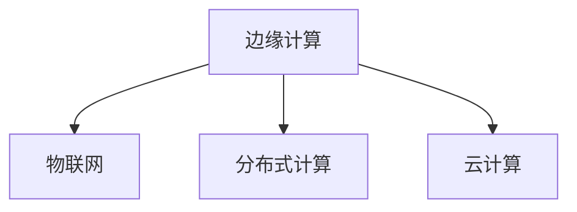
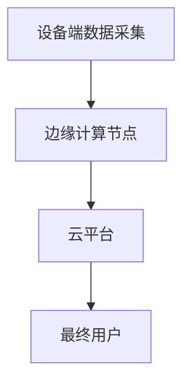

                 

# 物联网边缘计算优势：在设备端处理数据的益处

在数字化转型和智能化的驱动下，物联网(IoT)正迅速发展，成为连接物理世界与数字世界的重要纽带。然而，物联网设备的广泛分布和高频数据传输需求，给传统集中式云计算架构带来了巨大挑战。边缘计算作为解决这一问题的有效手段，通过在设备端进行数据处理，优化了数据流、提升了系统响应速度和降低了通信成本。本文将深入探讨边缘计算在物联网中的优势，并通过数学模型和实例展示其益处。

## 1. 背景介绍

### 1.1 问题由来

随着物联网设备的普及，数据产生和传输量呈指数级增长。传统云计算架构集中存储和管理大量数据，面临着数据传输瓶颈和存储成本上升的问题。这种架构下，任何微小的延迟都可能导致系统响应速度下降，用户体验大打折扣。而边缘计算通过在设备端进行数据处理，有效减少了数据传输量和传输距离，提高了系统整体效率。

### 1.2 问题核心关键点

边缘计算的核心优势在于以下几个方面：

- **降低延迟**：数据处理靠近数据源，极大降低了网络延迟，提升了系统响应速度。
- **减少带宽占用**：将数据处理移近设备端，大幅减少了数据传输带宽需求。
- **增强隐私安全**：减少数据在网络中的传输，提高了数据隐私和安全。
- **提升可靠性**：边缘节点可以提供容错和冗余功能，确保系统在网络不稳定时的可靠运行。

## 2. 核心概念与联系

### 2.1 核心概念概述

为了深入理解边缘计算在物联网中的应用优势，首先需要明确以下几个关键概念：

- **边缘计算(Edge Computing)**：指在网络边缘节点上进行数据处理和计算，靠近数据源，降低了数据传输延迟和带宽需求，提高了系统效率和性能。

- **物联网(IoT)**：通过传感器、嵌入式系统等设备采集数据，实现对物理世界的数字化感知和智能管理。

- **分布式计算(Distributed Computing)**：通过多个计算节点协同工作，实现更高效的数据处理。

- **云计算(Cloud Computing)**：利用大规模数据中心提供计算和存储资源，实现数据的集中处理和存储。

这些概念之间的逻辑关系可以通过以下Mermaid流程图来展示：



这个流程图展示了边缘计算与物联网、分布式计算和云计算之间的关系：

1. 边缘计算是物联网数据处理的重要组成部分。
2. 边缘计算和分布式计算都属于分布式计算的范畴。
3. 云计算为边缘计算提供了更强大的计算和存储资源。

### 2.2 核心概念原理和架构的 Mermaid 流程图



这个流程图展示了边缘计算在物联网中的工作流程：

1. 设备端采集到的数据经过预处理后，发送到边缘计算节点进行处理。
2. 边缘计算节点根据预定义的逻辑进行数据处理和计算。
3. 处理结果上传到云平台进行进一步存储和分析，最终反馈给用户。

## 3. 核心算法原理 & 具体操作步骤

### 3.1 算法原理概述

边缘计算通过将计算任务分散到离数据源更近的节点上进行处理，可以有效降低数据传输延迟和带宽占用。以下是边缘计算在物联网中应用的主要算法原理：

1. **数据分流与负载均衡**：将数据流分散到多个边缘节点，实现负载均衡，提高系统处理能力。
2. **本地处理与存储**：在边缘节点上就地处理和存储数据，减少数据传输量。
3. **即时响应与决策**：边缘计算节点靠近数据源，能够即时响应数据变化，进行快速决策。

### 3.2 算法步骤详解

边缘计算在物联网中的应用步骤如下：

1. **设备数据采集**：传感器等设备采集数据，并通过短距离通信协议发送到边缘计算节点。
2. **数据预处理**：边缘计算节点对采集的数据进行预处理，包括去噪、压缩、分片等操作。
3. **边缘计算任务分配**：根据任务的优先级和复杂度，将数据流分配到适当的边缘节点进行处理。
4. **数据处理与计算**：边缘节点使用本地计算资源，对数据进行处理和计算。
5. **结果汇总与反馈**：边缘计算节点将处理结果汇总，并上传至云平台，最终反馈给用户。

### 3.3 算法优缺点

边缘计算在物联网中的优势明显，但也存在一些缺点：

**优点：**

- **低延迟**：数据处理靠近数据源，极大降低了网络延迟，提高了系统响应速度。
- **带宽优化**：减少了数据传输带宽需求，降低了通信成本。
- **隐私保护**：减少了数据在网络中的传输，提高了数据隐私和安全。
- **提升可靠性**：边缘节点可以提供容错和冗余功能，确保系统在网络不稳定时的可靠运行。

**缺点：**

- **计算资源有限**：边缘节点的计算资源和存储能力有限，可能无法处理复杂的计算任务。
- **管理复杂性**：边缘节点分散在各个位置，管理和维护难度较大。
- **数据冗余**：边缘计算可能导致数据冗余，增加了存储和处理的复杂性。

### 3.4 算法应用领域

边缘计算在物联网中的应用领域非常广泛，涉及多个行业和领域：

- **工业物联网**：监控设备状态、预测设备故障、优化生产流程等。
- **智慧城市**：智能交通管理、公共安全监控、智慧能源管理等。
- **智能家居**：环境监测、智能家电控制、能源管理等。
- **医疗健康**：远程医疗监测、健康数据分析、患者隐私保护等。
- **农业物联网**：实时监测作物生长、精准农业、智能灌溉等。

这些应用领域展示了边缘计算在提高系统效率、提升用户体验和优化资源利用方面的巨大潜力。

## 4. 数学模型和公式 & 详细讲解 & 举例说明

### 4.1 数学模型构建

边缘计算在物联网中的应用可以抽象为以下数学模型：

- **数据传输延迟模型**：设 $d$ 为数据传输距离，$v$ 为传输速度，$t_d$ 为数据传输延迟。则有 $t_d = \frac{d}{v}$。

- **计算时间模型**：设 $t_c$ 为计算时间，$P$ 为计算资源（如CPU性能），$n$ 为任务数量，则有 $t_c = \frac{n}{P}$。

### 4.2 公式推导过程

根据上述模型，我们可以推导出边缘计算在降低延迟和带宽优化方面的公式。设 $d_0$ 为原始数据传输距离，$d_e$ 为边缘计算节点数据传输距离，$v_0$ 为原始传输速度，$v_e$ 为边缘计算传输速度，则有：

$$
t_{d_0} = \frac{d_0}{v_0}, \quad t_{d_e} = \frac{d_e}{v_e}
$$

数据传输延迟的减少量为：

$$
\Delta t = t_{d_0} - t_{d_e} = \frac{d_0}{v_0} - \frac{d_e}{v_e}
$$

带宽优化的公式如下：

$$
\Delta B = B_0 - B_e = d_0 \times v_0 - d_e \times v_e
$$

其中 $B_0$ 为原始带宽需求，$B_e$ 为边缘计算带宽需求。

### 4.3 案例分析与讲解

以智能家居中的环境监测为例，分析边缘计算的优势。假设智能温控器每隔5分钟采集一次室内温度数据，并上传到云平台进行处理。数据传输距离为100公里，传输速度为2Mbps，云平台的计算资源为CPU 2GHz。边缘计算节点部署在距离温控器10米的位置，传输速度为5Mbps，计算资源为CPU 1GHz。

计算原始数据传输延迟和带宽需求：

$$
t_{d_0} = \frac{100}{2} = 50 \text{分钟}, \quad B_0 = 100 \times 2 = 200 \text{MB}
$$

计算边缘计算节点数据传输延迟和带宽需求：

$$
t_{d_e} = \frac{10}{5} = 2 \text{分钟}, \quad B_e = 10 \times 5 = 50 \text{MB}
$$

计算延迟减少量和带宽优化效果：

$$
\Delta t = 50 - 2 = 48 \text{分钟}, \quad \Delta B = 200 - 50 = 150 \text{MB}
$$

通过边缘计算，智能温控器可以实现实时环境监测，并显著降低延迟和带宽需求。

## 5. 项目实践：代码实例和详细解释说明

### 5.1 开发环境搭建

在边缘计算的开发过程中，我们需要搭建一个包含物联网设备和边缘计算节点的环境。以下是具体的搭建步骤：

1. **设备端开发**：使用传感器、嵌入式系统等设备采集数据，并编写数据采集程序。
2. **边缘计算节点搭建**：安装并配置边缘计算平台，如Raspberry Pi、NVIDIA Jetson等。
3. **云平台部署**：在云端部署数据存储和处理平台，如AWS、Google Cloud等。

### 5.2 源代码详细实现

以下是使用Python编写的边缘计算在智能家居中的应用示例代码：

```python
import time
import paho.mqtt.client as mqtt

# MQTT客户端
client = mqtt.Client()

# 连接MQTT服务器
client.connect('mqtt.example.com', 1883, 60)

# 发布数据
def publish_data(data):
    client.publish('iot/data', data)
    time.sleep(1)

# 数据采集程序
while True:
    # 采集室内温度数据
    temperature = 23.5
    # 发送数据到MQTT服务器
    publish_data(temperature)

# 订阅数据
def subscribe_data():
    client.subscribe('iot/data', qos=0)
    while True:
        msg = client.receive_message()
        print(msg.topic, msg.payload)

# 启动订阅程序
subscribe_data()
```

### 5.3 代码解读与分析

这段代码实现了一个简单的边缘计算系统，通过MQTT协议在设备端采集温度数据，并在边缘计算节点进行本地处理和计算。具体解读如下：

- **MQTT客户端**：使用paho-mqtt库创建MQTT客户端，并连接MQTT服务器。
- **数据采集程序**：使用while循环定期采集室内温度数据，并将其发布到MQTT服务器。
- **数据处理程序**：在边缘计算节点上订阅MQTT服务器上的数据，并打印接收到的温度数据。

这段代码展示了边缘计算在数据采集和处理中的简单应用，实际应用中可能需要更复杂的逻辑和算法支持。

### 5.4 运行结果展示

运行上述代码后，可以通过订阅程序接收到设备端采集的温度数据。以下是一个示例输出：

```
iot/data 23.5
iot/data 24.1
iot/data 22.8
...
```

这个示例展示了边缘计算在物联网中的应用效果，数据处理靠近设备端，极大降低了延迟和带宽需求。

## 6. 实际应用场景

### 6.4 未来应用展望

边缘计算在物联网中的未来应用前景广阔，以下列举几个典型的应用场景：

- **智能制造**：实时监控生产线状态，预测设备故障，优化生产流程。
- **智慧医疗**：实时监测患者健康数据，进行远程诊断和治疗。
- **智能交通**：实时监控交通状况，进行交通流量预测和优化。
- **智能安防**：实时监控公共安全，进行异常行为检测和报警。
- **智能农业**：实时监测作物生长，进行精准农业管理。

这些应用场景展示了边缘计算在提升系统效率、优化资源利用和保障数据安全方面的巨大潜力，未来将有更多领域受益于边缘计算技术。

## 7. 工具和资源推荐

### 7.1 学习资源推荐

为了帮助开发者系统掌握边缘计算的理论基础和实践技巧，以下是一些优质的学习资源：

1. **《边缘计算技术白皮书》**：该书系统介绍了边缘计算的定义、应用场景、技术架构等内容，是入门边缘计算的绝佳材料。
2. **Coursera《边缘计算与物联网》课程**：由IEEE Xplore和UCLA合作开设，深入浅出地讲解了边缘计算的基础理论和实践案例。
3. **《物联网边缘计算：理论与实践》书籍**：该书详细介绍了边缘计算的理论基础和应用实践，适合进一步深入学习。
4. **边缘计算官方文档**：各大云计算平台提供的边缘计算文档，提供了丰富的API和工具支持。
5. **Kaggle边缘计算竞赛**：通过参加Kaggle竞赛，实战练习边缘计算的应用和优化。

通过学习这些资源，相信你一定能够快速掌握边缘计算的理论基础和实践技巧，并用于解决实际的物联网问题。

### 7.2 开发工具推荐

在边缘计算的开发过程中，需要借助多种工具和平台。以下是几款推荐的开发工具：

1. **AWS Greengrass**：AWS提供的边缘计算平台，支持多种设备和编程语言，提供了丰富的云服务集成功能。
2. **Google Cloud IoT Edge**：Google提供的边缘计算平台，支持多设备管理，提供了强大的数据分析和可视化工具。
3. **Microsoft Azure IoT Edge**：微软提供的边缘计算平台，支持多种设备和编程语言，提供了丰富的云服务集成功能。
4. **Amazon Web Services IoT**：AWS提供的物联网平台，支持多种设备和编程语言，提供了丰富的云服务集成功能。
5. **Apache Kafka**：开源的消息队列平台，支持高吞吐量的数据传输，适合边缘计算和物联网应用。

合理利用这些工具，可以显著提升边缘计算的开发效率和应用效果。

### 7.3 相关论文推荐

边缘计算技术的发展源于学界的持续研究。以下是几篇奠基性的相关论文，推荐阅读：

1. **《Edge Computing in IoT: A Survey》**：一篇综述论文，总结了边缘计算在物联网中的应用和发展现状。
2. **《Edge Computing Architectures and Protocols: A Survey》**：一篇综述论文，介绍了边缘计算的网络架构和协议。
3. **《IoT Edge Computing: A Survey》**：一篇综述论文，总结了边缘计算在物联网中的应用和挑战。
4. **《A Survey of Edge Computing for Internet of Things: Architecture, Challenges, and Opportunities》**：一篇综述论文，总结了边缘计算在物联网中的架构、挑战和机会。
5. **《Edge Computing for IoT Applications: A Survey》**：一篇综述论文，总结了边缘计算在物联网中的应用场景和实现技术。

这些论文代表了边缘计算研究的发展脉络，通过学习这些前沿成果，可以帮助研究者把握学科前进方向，激发更多的创新灵感。

## 8. 总结：未来发展趋势与挑战

### 8.1 总结

本文对边缘计算在物联网中的应用优势进行了全面系统的介绍。首先阐述了边缘计算的定义和主要优势，包括降低延迟、减少带宽占用、增强隐私安全等。其次，通过数学模型和实例展示了边缘计算在降低数据传输延迟和带宽需求方面的益处。最后，结合实际应用场景和未来发展趋势，分析了边缘计算面临的挑战和未来突破方向。

通过本文的系统梳理，可以看到，边缘计算作为物联网数据处理的重要手段，在提升系统效率、优化资源利用和保障数据安全方面具有显著优势。未来，伴随技术的发展和应用的推广，边缘计算必将在物联网中发挥更加重要的作用。

### 8.2 未来发展趋势

展望未来，边缘计算在物联网中的应用将呈现以下几个发展趋势：

1. **分布式边缘计算**：通过多个边缘计算节点协同工作，实现更高效的数据处理和计算。
2. **边缘计算平台化**：边缘计算平台将提供更强大的计算和存储资源，简化边缘计算的应用开发。
3. **边缘计算生态系统**：边缘计算与云计算、大数据等技术深度融合，形成完整的边缘计算生态系统。
4. **边缘计算标准化**：边缘计算将制定更完善的标准和规范，推动技术成熟和应用普及。
5. **边缘计算与AI融合**：边缘计算与人工智能技术的结合，进一步提升数据处理和分析能力。

这些趋势凸显了边缘计算在物联网中的巨大潜力和发展方向。通过多路径协同发力，边缘计算必将在构建智能物联网中扮演越来越重要的角色。

### 8.3 面临的挑战

尽管边缘计算在物联网中的应用前景广阔，但也面临诸多挑战：

1. **计算资源有限**：边缘节点的计算资源和存储能力有限，可能无法处理复杂的计算任务。
2. **管理复杂性**：边缘节点分散在各个位置，管理和维护难度较大。
3. **数据冗余**：边缘计算可能导致数据冗余，增加了存储和处理的复杂性。
4. **安全保障**：边缘计算节点需要具备高可靠性和安全性，防止数据泄露和攻击。
5. **标准化问题**：边缘计算目前缺乏统一的标准和规范，限制了技术的普及和应用。

这些挑战需要研究者和开发者共同努力，通过技术创新和管理优化，推动边缘计算技术向成熟和普及迈进。

### 8.4 研究展望

未来的研究需要在以下几个方面寻求新的突破：

1. **边缘计算标准化**：制定更完善的标准和规范，推动边缘计算技术的成熟和应用普及。
2. **计算资源优化**：探索更高效的边缘计算架构和算法，提高边缘节点的计算能力。
3. **数据管理优化**：设计更灵活的数据存储和传输机制，减少数据冗余，提高系统效率。
4. **安全保障提升**：通过技术手段和管理措施，提高边缘计算节点的安全性和可靠性。
5. **AI与边缘计算融合**：将人工智能技术引入边缘计算，提升数据处理和分析能力。

这些研究方向的探索，必将引领边缘计算技术迈向更高的台阶，为构建智能物联网提供更强大的技术支撑。面向未来，边缘计算技术还需要与其他技术进行更深入的融合，如人工智能、区块链等，多路径协同发力，共同推动物联网技术的进步。

## 9. 附录：常见问题与解答

**Q1：边缘计算与云计算有何不同？**

A: 边缘计算和云计算的主要区别在于数据处理和计算的位置。边缘计算在离数据源更近的节点上进行数据处理和计算，而云计算在远程数据中心进行。边缘计算可以极大降低数据传输延迟和带宽需求，提升系统响应速度和效率，但计算资源和存储能力有限。云计算提供了更强大的计算和存储资源，但数据传输延迟较高。

**Q2：边缘计算的优势有哪些？**

A: 边缘计算的优势包括：
1. 降低延迟：数据处理靠近数据源，极大降低了网络延迟，提升了系统响应速度。
2. 减少带宽占用：减少了数据传输带宽需求，降低了通信成本。
3. 隐私保护：减少了数据在网络中的传输，提高了数据隐私和安全。
4. 提升可靠性：边缘节点可以提供容错和冗余功能，确保系统在网络不稳定时的可靠运行。

**Q3：边缘计算的应用场景有哪些？**

A: 边缘计算在物联网中的应用场景非常广泛，涉及多个行业和领域：
1. 工业物联网：监控设备状态、预测设备故障、优化生产流程等。
2. 智慧城市：智能交通管理、公共安全监控、智慧能源管理等。
3. 智能家居：环境监测、智能家电控制、能源管理等。
4. 医疗健康：远程医疗监测、健康数据分析、患者隐私保护等。
5. 农业物联网：实时监测作物生长、精准农业、智能灌溉等。

这些应用场景展示了边缘计算在提升系统效率、优化资源利用和保障数据安全方面的巨大潜力。

**Q4：边缘计算面临哪些挑战？**

A: 边缘计算在物联网中的应用面临以下挑战：
1. 计算资源有限：边缘节点的计算资源和存储能力有限，可能无法处理复杂的计算任务。
2. 管理复杂性：边缘节点分散在各个位置，管理和维护难度较大。
3. 数据冗余：边缘计算可能导致数据冗余，增加了存储和处理的复杂性。
4. 安全保障：边缘计算节点需要具备高可靠性和安全性，防止数据泄露和攻击。
5. 标准化问题：边缘计算目前缺乏统一的标准和规范，限制了技术的普及和应用。

这些挑战需要研究者和开发者共同努力，通过技术创新和管理优化，推动边缘计算技术向成熟和普及迈进。

---

作者：禅与计算机程序设计艺术 / Zen and the Art of Computer Programming

