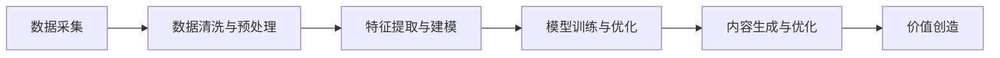

                 

# 生成式AIGC：从数据到价值的转化

> 关键词：生成式AI, AIGC, 数据增强, 模型优化, 价值创造, 未来应用

## 1. 背景介绍

### 1.1 问题由来

随着数据时代的到来，海量数据资源的积累为人工智能（AI）技术的突破提供了坚实的基础。生成式人工智能（AIGC, AI Generated Content）作为AI技术的最新热点，利用深度学习技术从数据中自动生成高质量的文本、图像、音频等内容，具有极高的价值。

生成式AI不仅在影视制作、游戏开发、虚拟现实等领域大放异彩，还在企业自动化、市场调研、个性化推荐等方面得到广泛应用。通过生成式AI，企业能够以更低成本、更快速度创建和更新内容，提升用户体验，挖掘数据价值，创造新的商业模式。

### 1.2 问题核心关键点

生成式AI的核心在于如何从大规模数据中挖掘出有用的信息，并将其转化为有价值的内容。其基本流程包括：

- **数据采集**：从互联网、社交媒体、企业数据库等渠道收集相关数据。
- **数据清洗与预处理**：对原始数据进行去噪、标准化处理，确保数据质量。
- **特征提取与建模**：利用深度学习模型从数据中提取有意义的特征，建立生成模型。
- **模型训练与优化**：在大量标注数据上训练生成模型，通过正则化、超参数调优等技术手段提升模型性能。
- **内容生成与优化**：使用训练好的模型生成高质量内容，并根据反馈不断迭代优化。

### 1.3 问题研究意义

研究生成式AI技术，对挖掘数据价值、提升内容质量、创造新的商业模式具有重要意义：

1. **降本增效**：通过自动生成内容，大幅度降低内容创作和维护的成本，提升生产效率。
2. **数据价值最大化**：充分利用海量数据资源，挖掘出潜在价值，创造出更多应用场景。
3. **用户体验优化**：基于用户反馈和偏好，生成个性化、高质量的内容，提升用户体验。
4. **新商业模式探索**：基于生成式AI的创造性内容生成能力，探索新的商业模式，如数字媒体、虚拟现实、游戏等。
5. **企业创新驱动**：推动企业在内容制作、数据分析、智能营销等领域的创新，提升竞争力。

## 2. 核心概念与联系

### 2.1 核心概念概述

生成式AI主要涉及以下几个核心概念：

- **生成式AI**：通过深度学习模型自动生成高质量文本、图像、音频等内容的技术。
- **AIGC（人工智能生成内容）**：包括文本生成、图像生成、音频生成、视频生成等多个方向。
- **数据增强**：通过数据扩充、合成等方式提升数据集质量，增强模型泛化能力。
- **模型优化**：使用正则化、超参数调优、对抗训练等技术手段提升模型性能。
- **价值创造**：利用生成式AI生成高质量内容，创造新的应用场景和商业模式。

这些概念之间的逻辑关系可以通过以下Mermaid流程图来展示：



这个流程图展示了大规模数据资源转化为生成式AI价值的全流程：

1. 数据采集：收集海量数据资源，为生成式AI提供原材料。
2. 数据清洗与预处理：确保数据质量，为后续建模提供可靠基础。
3. 特征提取与建模：利用深度学习模型从数据中提取有意义的特征，建立生成模型。
4. 模型训练与优化：在大量标注数据上训练生成模型，通过技术手段提升性能。
5. 内容生成与优化：使用训练好的模型生成高质量内容，根据反馈不断迭代优化。
6. 价值创造：利用生成的内容创造新的应用场景和商业模式。

## 3. 核心算法原理 & 具体操作步骤
### 3.1 算法原理概述

生成式AI的核心算法原理主要包括变分自编码器（VAE）、生成对抗网络（GAN）、Transformer等深度学习模型。以生成对抗网络（GAN）为例，其基本流程如下：

1. **生成器（Generator）**：根据噪声向量生成假数据。
2. **判别器（Discriminator）**：判断数据是真实数据还是生成数据。
3. **对抗训练**：通过不断优化生成器和判别器，使得生成数据与真实数据难以区分，实现高质量生成。

生成式AI的核心目标是训练一个能够产生高质量内容的生成模型，该模型可以从大规模数据中学习到数据的分布特性，从而生成逼真的内容。

### 3.2 算法步骤详解

以下以生成对抗网络（GAN）为例，详细介绍生成式AI的算法步骤：

1. **数据采集与预处理**：从互联网、社交媒体、企业数据库等渠道收集相关数据，并进行去噪、标准化等预处理。

2. **模型设计**：设计生成器和判别器模型。生成器通常采用卷积神经网络（CNN）、递归神经网络（RNN）或Transformer模型；判别器可以采用简单的全连接神经网络或复杂的卷积神经网络。

3. **训练过程**：使用生成器和判别器进行对抗训练，不断优化生成器和判别器参数，使得生成数据与真实数据难以区分。具体步骤如下：
   - **生成器训练**：固定判别器参数，用噪声向量训练生成器，使生成数据尽可能接近真实数据。
   - **判别器训练**：固定生成器参数，训练判别器区分真实数据和生成数据。
   - **交替训练**：反复进行生成器和判别器的交替训练，直到达到收敛。

4. **内容生成**：使用训练好的生成器模型，根据输入的噪声向量生成高质量内容。

5. **内容优化**：根据用户反馈和目标要求，不断迭代优化生成内容，提升质量和适用性。

### 3.3 算法优缺点

生成式AI具有以下优点：

- **高效生成内容**：生成式AI能够在较短时间内生成大量高质量内容，大大提升生产效率。
- **个性化内容创作**：基于用户偏好和反馈，生成个性化、多样化的内容，满足不同用户的需求。
- **数据价值挖掘**：充分利用海量数据资源，挖掘出潜在价值，创造出更多应用场景。

然而，生成式AI也存在以下缺点：

- **生成数据质量难以保证**：生成器生成的数据质量受模型参数、训练数据等因素影响，可能出现生成结果不真实、不连贯等问题。
- **生成过程复杂**：生成式AI模型复杂度高，训练和优化过程耗时较长，需要强大的计算资源和经验。
- **版权问题**：生成式AI生成的内容可能存在版权问题，特别是在使用大规模训练数据时，难以避免数据版权纠纷。

### 3.4 算法应用领域

生成式AI技术在多个领域得到广泛应用：

- **内容创作**：在影视制作、游戏开发、虚拟现实等领域，生成式AI用于自动生成剧本、角色、场景等高质量内容。
- **个性化推荐**：在电商、社交媒体、新闻推荐等领域，生成式AI用于生成个性化商品描述、新闻标题、推荐内容等，提升用户体验。
- **市场营销**：在广告、营销、市场调研等领域，生成式AI用于自动生成广告文案、营销策略、市场报告等，提高营销效果。
- **数字媒体**：在数字媒体、在线教育、虚拟课堂等领域，生成式AI用于自动生成视频、音频、课件等，提升教育质量和互动性。
- **数据分析**：在金融、医疗、交通等领域，生成式AI用于自动生成数据分析报告、预测模型、决策支持等，提高数据分析效率。

## 4. 数学模型和公式 & 详细讲解 & 举例说明

### 4.1 数学模型构建

以生成对抗网络（GAN）为例，其数学模型如下：

设 $x$ 为真实数据，$z$ 为噪声向量，$G(z)$ 为生成器模型，$D(x)$ 为判别器模型。则GAN的目标函数可以表示为：

$$
\mathcal{L}_{GAN} = \mathbb{E}_{x\sim p(x)} [\log D(x)] + \mathbb{E}_{z\sim p(z)} [\log (1-D(G(z)))]
$$

其中，$\mathbb{E}_{x\sim p(x)}$ 表示对真实数据 $x$ 的期望，$\mathbb{E}_{z\sim p(z)}$ 表示对噪声向量 $z$ 的期望。

### 4.2 公式推导过程

生成对抗网络（GAN）的推导过程如下：

1. **生成器训练**：对于任意真实数据 $x$，判别器 $D(x)$ 的目标是最小化 $-\log D(x)$；对于任意噪声向量 $z$，生成器 $G(z)$ 的目标是最小化 $\log (1-D(G(z)))$。
2. **判别器训练**：对于任意真实数据 $x$，判别器 $D(x)$ 的目标是最大化 $\log D(x)$；对于任意生成数据 $G(z)$，判别器 $D(G(z))$ 的目标是最大化 $\log D(G(z))$。

将上述两个目标函数分别进行最小化和最大化，得到：

$$
\mathbb{E}_{x\sim p(x)} [\log D(x)] + \mathbb{E}_{z\sim p(z)} [\log (1-D(G(z)))]
$$

通过对上述目标函数进行优化，生成器 $G(z)$ 和判别器 $D(x)$ 可以逐渐学习到数据 $x$ 的分布特性，生成高质量内容。

### 4.3 案例分析与讲解

以图片生成为例，假设输入的噪声向量 $z$ 表示为一维向量，生成器 $G(z)$ 输出为一维向量，判别器 $D(x)$ 输入为一维向量，输出为一维向量。则生成器 $G(z)$ 和判别器 $D(x)$ 的结构可以表示为：

$$
G(z) = W_2 G_1(z)
$$

$$
D(x) = W_3 G_2(x)
$$

其中 $W_2$ 和 $W_3$ 为权重矩阵，$G_1(z)$ 和 $G_2(x)$ 为生成器和判别器的网络结构。

假设 $z \sim N(0,1)$，生成器和判别器的网络结构为多层感知器（MLP）。则生成器 $G(z)$ 和判别器 $D(x)$ 的目标函数可以表示为：

$$
\mathcal{L}_G = \mathbb{E}_{z\sim p(z)} [\log (1-D(G(z)))]
$$

$$
\mathcal{L}_D = \mathbb{E}_{x\sim p(x)} [\log D(x)] + \mathbb{E}_{z\sim p(z)} [-\log D(G(z))]
$$

通过对上述目标函数进行优化，生成器 $G(z)$ 和判别器 $D(x)$ 可以逐渐学习到数据 $x$ 的分布特性，生成高质量内容。

## 5. 项目实践：代码实例和详细解释说明

### 5.1 开发环境搭建

在进行生成式AI实践前，我们需要准备好开发环境。以下是使用Python进行PyTorch开发的环境配置流程：

1. 安装Anaconda：从官网下载并安装Anaconda，用于创建独立的Python环境。

2. 创建并激活虚拟环境：
```bash
conda create -n pytorch-env python=3.8 
conda activate pytorch-env
```

3. 安装PyTorch：根据CUDA版本，从官网获取对应的安装命令。例如：
```bash
conda install pytorch torchvision torchaudio cudatoolkit=11.1 -c pytorch -c conda-forge
```

4. 安装Transformers库：
```bash
pip install transformers
```

5. 安装各类工具包：
```bash
pip install numpy pandas scikit-learn matplotlib tqdm jupyter notebook ipython
```

完成上述步骤后，即可在`pytorch-env`环境中开始生成式AI实践。

### 5.2 源代码详细实现

这里我们以生成对抗网络（GAN）为例，给出使用PyTorch对GAN模型进行训练的PyTorch代码实现。

首先，定义GAN模型的生成器和判别器：

```python
import torch
import torch.nn as nn
import torch.optim as optim

class Generator(nn.Module):
    def __init__(self, z_dim, img_dim):
        super(Generator, self).__init__()
        self.z_dim = z_dim
        self.img_dim = img_dim
        
        self.fc1 = nn.Linear(z_dim, 128)
        self.fc2 = nn.Linear(128, 128)
        self.fc3 = nn.Linear(128, img_dim)
        self.tanh = nn.Tanh()
    
    def forward(self, z):
        x = self.fc1(z)
        x = self.fc2(x)
        x = self.fc3(x)
        return self.tanh(x)

class Discriminator(nn.Module):
    def __init__(self, img_dim):
        super(Discriminator, self).__init__()
        self.img_dim = img_dim
        
        self.fc1 = nn.Linear(img_dim, 128)
        self.fc2 = nn.Linear(128, 128)
        self.fc3 = nn.Linear(128, 1)
        self.sigmoid = nn.Sigmoid()
    
    def forward(self, x):
        x = self.fc1(x)
        x = self.fc2(x)
        x = self.fc3(x)
        return self.sigmoid(x)

z_dim = 100
img_dim = 784
g = Generator(z_dim, img_dim)
d = Discriminator(img_dim)

# 定义损失函数
criterion = nn.BCELoss()

# 定义优化器
g_optimizer = optim.Adam(g.parameters(), lr=0.0002)
d_optimizer = optim.Adam(d.parameters(), lr=0.0002)
```

然后，定义训练和评估函数：

```python
import numpy as np
import matplotlib.pyplot as plt

def train_epoch(model, data_loader, batch_size, optimizer):
    model.train()
    epoch_loss_g = 0
    epoch_loss_d = 0
    for i, (real_images, _) in enumerate(data_loader):
        real_images = real_images.view(-1, 28*28).float().to(device)
        
        # 生成器前向传播
        z = torch.randn(batch_size, z_dim).to(device)
        fake_images = model(z)
        g_loss = criterion(d(fake_images), torch.ones(batch_size, 1).to(device))
        g_loss.backward()
        g_optimizer.step()
        
        # 判别器前向传播
        real_images = real_images.to(device)
        real_labels = torch.ones(batch_size, 1).to(device)
        fake_labels = torch.zeros(batch_size, 1).to(device)
        d_loss_real = criterion(d(real_images), real_labels)
        d_loss_fake = criterion(d(fake_images.detach()), fake_labels)
        d_loss = d_loss_real + d_loss_fake
        d_loss.backward()
        d_optimizer.step()
        
        # 记录损失
        epoch_loss_g += g_loss.item()
        epoch_loss_d += d_loss.item()
        
        if i % 100 == 0:
            print(f'Epoch {epoch+1}, Batch {i+1}, G Loss: {epoch_loss_g/100:.4f}, D Loss: {epoch_loss_d/100:.4f}')
            epoch_loss_g = 0
            epoch_loss_d = 0

def evaluate(model, data_loader, batch_size):
    model.eval()
    with torch.no_grad():
        fake_images = model(torch.randn(64, z_dim).to(device))
        plt.imshow(torch.flatten(fake_images[0]).numpy(), cmap='gray')
        plt.show()

# 训练
device = torch.device('cuda') if torch.cuda.is_available() else torch.device('cpu')
g.to(device)
d.to(device)

n_epochs = 50
batch_size = 64

for epoch in range(n_epochs):
    train_epoch(g, d, batch_size, optimizer)
    evaluate(g, data_loader, batch_size)
```

以上就是使用PyTorch对GAN模型进行训练的完整代码实现。可以看到，利用PyTorch和Transformers库，我们能够快速构建和训练生成对抗网络模型，生成高质量的图片内容。

### 5.3 代码解读与分析

让我们再详细解读一下关键代码的实现细节：

**GAN类**：
- `__init__`方法：初始化生成器和判别器的网络结构。
- `forward`方法：实现前向传播过程，生成器接收噪声向量 $z$，判别器接收真实图像 $x$，并返回预测结果。

**损失函数与优化器**：
- 定义交叉熵损失函数和Adam优化器，分别用于训练生成器和判别器。

**训练函数**：
- `train_epoch`方法：在每个epoch内，循环迭代训练生成器和判别器，记录损失并打印输出。

**评估函数**：
- `evaluate`方法：在每个epoch结束时，使用训练好的生成器模型生成一批图片，并展示结果。

**训练流程**：
- 在训练过程中，生成器和判别器交替进行训练，分别最小化生成损失和判别损失。
- 通过不断迭代优化，生成器能够生成更逼真的图片，判别器能够更准确地区分真实图片和生成图片。

可以看到，PyTorch和Transformers库使得GAN模型的训练过程变得简洁高效。开发者可以将更多精力放在模型设计和参数调优上，而不必过多关注底层的实现细节。

当然，工业级的系统实现还需考虑更多因素，如模型裁剪、量化加速、服务化封装等。但核心的生成过程基本与此类似。

## 6. 实际应用场景
### 6.1 智能内容生成

生成式AI在智能内容生成领域具有广泛的应用前景。通过生成式AI，企业能够自动化生成各种高质量内容，提升内容创作效率，降低成本。

例如，在电影制作中，生成式AI可用于自动生成剧本、角色对话、场景设计等，大大缩短制作周期。在游戏开发中，生成式AI可用于自动生成任务、角色、物品等，提升游戏的多样性和丰富度。在虚拟现实（VR）和增强现实（AR）领域，生成式AI可用于自动生成虚拟场景、角色动作等，提升用户体验。

### 6.2 个性化推荐

生成式AI在个性化推荐领域具有重要应用价值。通过生成式AI，企业能够自动生成个性化推荐内容，提升用户满意度和转化率。

例如，在电商平台上，生成式AI可用于自动生成商品描述、标题、图片等，提升商品展示效果和用户购买意愿。在新闻媒体中，生成式AI可用于自动生成新闻标题、摘要、评论等，提升新闻内容的吸引力和阅读量。在社交媒体中，生成式AI可用于自动生成用户推荐内容、话题标签等，提升用户粘性和平台活跃度。

### 6.3 内容修复与补全

生成式AI在内容修复与补全领域也有重要应用价值。通过生成式AI，企业能够自动化修复或补全缺失、损坏的数据内容，提升数据质量。

例如，在文档处理中，生成式AI可用于自动修复文档中的拼写错误、语法错误等，提升文档质量。在图像处理中，生成式AI可用于自动修复损坏、模糊的图像，提升图像清晰度。在音频处理中，生成式AI可用于自动修复失真、缺失的音频，提升音频质量。

### 6.4 未来应用展望

随着生成式AI技术的不断进步，未来将在更多领域得到应用，为社会带来深刻变革：

- **自动创作与出版**：生成式AI可用于自动创作小说、诗歌、新闻等文学作品，并出版发行。例如，利用生成式AI生成新闻报道，自动编辑校对，提升新闻生产效率。
- **智能城市管理**：生成式AI可用于智能城市规划、交通管理、环境监测等领域，提升城市管理智能化水平。例如，利用生成式AI生成城市规划图、交通模拟图等，优化城市资源配置。
- **虚拟助手与客服**：生成式AI可用于构建虚拟助手、智能客服等系统，提升用户体验。例如，利用生成式AI生成智能客服对话脚本，自动回答用户咨询，提升客服效率。
- **个性化教育**：生成式AI可用于个性化教育领域，自动生成个性化教学内容、智能推荐课程等，提升教育效果。例如，利用生成式AI生成个性化学习计划、推荐资源等，提升学习效果。

## 7. 工具和资源推荐
### 7.1 学习资源推荐

为了帮助开发者系统掌握生成式AI的理论基础和实践技巧，这里推荐一些优质的学习资源：

1. **《深度学习》（周志华著）**：全面介绍深度学习技术的基本原理和应用场景，适合初学者入门。

2. **CS231n《卷积神经网络》课程**：斯坦福大学开设的经典深度学习课程，涵盖卷积神经网络、图像生成等内容，适合进阶学习。

3. **《生成对抗网络》（Ian Goodfellow著）**：生成对抗网络的经典著作，详细介绍了GAN的基本原理和应用，适合深入研究。

4. **《自然语言处理综述》（Yoav Goldberg著）**：涵盖自然语言处理技术的经典教材，包括文本生成、语言模型等内容，适合全面了解。

5. **DeepMind博客**：DeepMind官方博客，包含深度学习技术的最新进展和实践案例，适合参考学习。

通过对这些资源的学习实践，相信你一定能够快速掌握生成式AI的精髓，并用于解决实际的NLP问题。

### 7.2 开发工具推荐

高效的开发离不开优秀的工具支持。以下是几款用于生成式AI开发的常用工具：

1. **PyTorch**：基于Python的开源深度学习框架，灵活动态的计算图，适合快速迭代研究。

2. **TensorFlow**：由Google主导开发的开源深度学习框架，生产部署方便，适合大规模工程应用。

3. **Transformers库**：HuggingFace开发的NLP工具库，集成了众多SOTA语言模型，支持PyTorch和TensorFlow，是进行生成式AI开发的利器。

4. **Weights & Biases**：模型训练的实验跟踪工具，可以记录和可视化模型训练过程中的各项指标，方便对比和调优。

5. **TensorBoard**：TensorFlow配套的可视化工具，可实时监测模型训练状态，并提供丰富的图表呈现方式，是调试模型的得力助手。

6. **Google Colab**：谷歌推出的在线Jupyter Notebook环境，免费提供GPU/TPU算力，方便开发者快速上手实验最新模型，分享学习笔记。

合理利用这些工具，可以显著提升生成式AI的开发效率，加快创新迭代的步伐。

### 7.3 相关论文推荐

生成式AI技术的发展源于学界的持续研究。以下是几篇奠基性的相关论文，推荐阅读：

1. **Image-to-Image Translation with Conditional Adversarial Networks**：生成对抗网络（GAN）的经典论文，提出GAN的基本框架和训练方法。

2. **Attention Is All You Need**：Transformer模型的经典论文，提出自注意力机制，开启NLP预训练大模型时代。

3. **Language Models are Unsupervised Multitask Learners**：提出语言模型的无监督学习范式，展示了预训练语言模型在自然语言处理任务上的潜力。

4. **Pix2Pix**：生成对抗网络（GAN）在图像生成领域的应用，提出端到端的图像生成方法。

5. **GPT-3**：生成式AI的最新进展，展示了大规模语言模型在文本生成、自然语言推理等方面的强大能力。

这些论文代表了大规模数据资源转化为生成式AI价值的全流程：

1. 数据采集：收集海量数据资源，为生成式AI提供原材料。
2. 数据清洗与预处理：确保数据质量，为后续建模提供可靠基础。
3. 特征提取与建模：利用深度学习模型从数据中提取有意义的特征，建立生成模型。
4. 模型训练与优化：在大量标注数据上训练生成模型，通过技术手段提升性能。
5. 内容生成与优化：使用训练好的模型生成高质量内容，根据反馈不断迭代优化。
6. 价值创造：利用生成的内容创造新的应用场景和商业模式。

## 8. 总结：未来发展趋势与挑战

### 8.1 总结

本文对生成式AI技术进行了全面系统的介绍。首先阐述了生成式AI技术的研究背景和意义，明确了生成式AI技术在内容生成、推荐系统、内容修复与补全等方面的重要价值。其次，从原理到实践，详细讲解了生成对抗网络（GAN）等核心算法原理和具体操作步骤，给出了生成式AI项目实践的完整代码实例。同时，本文还探讨了生成式AI在智能内容生成、个性化推荐、内容修复与补全等多个领域的应用前景，展示了生成式AI技术的广泛应用。此外，本文精选了生成式AI技术的各类学习资源，力求为开发者提供全方位的技术指引。

通过本文的系统梳理，可以看到，生成式AI技术正处于快速发展阶段，具备广阔的市场前景和应用潜力。生成式AI技术通过自动化内容生成，在内容创作、推荐系统、图像生成、视频生成等领域展现出巨大潜力，为各行各业带来深刻变革。未来，随着生成式AI技术的不断进步，其应用场景将更加广泛，带来更多社会价值。

### 8.2 未来发展趋势

展望未来，生成式AI技术将呈现以下几个发展趋势：

1. **超高分辨率生成**：生成式AI技术将向超高分辨率生成发展，生成更逼真、更丰富的图像和视频内容，提升用户体验。
2. **多模态内容生成**：生成式AI技术将拓展到多模态内容生成，包括图像、视频、音频、文本等多种形式，提升内容的丰富性和多样性。
3. **实时内容生成**：生成式AI技术将向实时内容生成发展，提升内容生成的效率和互动性。
4. **个性化内容生成**：生成式AI技术将更加注重个性化内容生成，根据用户偏好和行为生成个性化推荐、广告、内容等，提升用户体验和转化率。
5. **生成式AI与AIoT结合**：生成式AI技术将与人工智能物联网（AIoT）结合，生成智能场景、智能设备、智能应用等，提升智能化水平。
6. **生成式AI与区块链结合**：生成式AI技术将与区块链结合，生成去中心化、可信的内容和应用，提升数据的可信性和安全性。

### 8.3 面临的挑战

尽管生成式AI技术已经取得了显著进展，但在迈向更加智能化、普适化应用的过程中，仍面临诸多挑战：

1. **生成数据质量难以保证**：生成式AI技术生成的数据质量受模型参数、训练数据等因素影响，可能出现生成结果不真实、不连贯等问题。
2. **生成过程复杂**：生成式AI技术模型复杂度高，训练和优化过程耗时较长，需要强大的计算资源和经验。
3. **版权问题**：生成式AI技术生成的内容可能存在版权问题，特别是在使用大规模训练数据时，难以避免数据版权纠纷。
4. **可解释性不足**：生成式AI技术缺乏透明性，难以解释其内部工作机制和决策逻辑。
5. **伦理问题**：生成式AI技术可能生成有害、偏见、误导性内容，对社会带来负面影响。

### 8.4 研究展望

面对生成式AI技术面临的挑战，未来的研究需要在以下几个方面寻求新的突破：

1. **生成数据质量提升**：提高生成式AI技术生成数据的质量，减少不真实、不连贯的问题，提升内容可信度。
2. **模型优化**：优化生成式AI技术模型结构，提高生成效率，降低计算资源消耗，提升实时生成能力。
3. **数据版权保护**：研究数据版权保护技术，确保生成式AI技术生成的内容合法合规，避免数据版权纠纷。
4. **透明性提升**：提升生成式AI技术的透明性，增强其可解释性和可解释性，帮助用户理解其内部工作机制和决策逻辑。
5. **伦理规范制定**：制定生成式AI技术的伦理规范，确保其生成内容健康、无害，避免对社会带来负面影响。

这些研究方向的探索，必将引领生成式AI技术迈向更高的台阶，为构建安全、可靠、可解释、可控的智能系统铺平道路。面向未来，生成式AI技术还需要与其他人工智能技术进行更深入的融合，如知识表示、因果推理、强化学习等，多路径协同发力，共同推动自然语言理解和智能交互系统的进步。只有勇于创新、敢于突破，才能不断拓展生成式AI技术的边界，让智能技术更好地造福人类社会。

## 9. 附录：常见问题与解答

**Q1：生成式AI生成的内容可能存在版权问题，如何解决？**

A: 生成式AI生成的内容可能存在版权问题，特别是在使用大规模训练数据时，难以避免数据版权纠纷。解决这一问题的方法包括：
1. **使用开源数据**：尽量使用公开、无版权限制的数据进行训练，避免侵权风险。
2. **数据清洗与标注**：对训练数据进行清洗和标注，确保数据来源合法，避免侵权风险。
3. **版权声明与授权**：在生成内容时，添加版权声明或取得版权授权，确保内容合法合规。
4. **数据共享平台**：使用数据共享平台，如CC0、CC BY-SA等，提供数据授权信息，确保数据合法合规。
5. **商业许可**：在商业应用中，通过购买商业数据或取得数据许可，确保内容合法合规。

**Q2：生成式AI生成的内容质量难以保证，如何解决？**

A: 生成式AI生成的内容质量受模型参数、训练数据等因素影响，可能出现生成结果不真实、不连贯等问题。解决这一问题的方法包括：
1. **模型优化**：提高生成式AI技术模型的参数和结构优化，提升生成质量。
2. **数据增强**：通过数据增强、数据扩充等方法提升数据质量，减少不真实、不连贯的问题。
3. **对抗训练**：使用对抗训练方法，提升生成式AI技术模型的鲁棒性和泛化能力，减少生成结果不真实、不连贯的问题。
4. **超参数调优**：通过超参数调优，选择最优模型参数，提升生成质量。
5. **集成学习**：通过集成学习，结合多个生成式AI技术模型，提升生成质量。

**Q3：生成式AI技术生成的内容缺乏透明性，如何解决？**

A: 生成式AI技术缺乏透明性，难以解释其内部工作机制和决策逻辑。解决这一问题的方法包括：
1. **模型可解释性研究**：开展生成式AI技术的可解释性研究，增强其透明性和可解释性。
2. **生成过程可视化**：通过可视化生成过程，帮助用户理解生成式AI技术的工作机制和决策逻辑。
3. **生成结果对比**：对生成结果进行对比分析，帮助用户理解生成内容的来源和质量。
4. **生成内容解释**：在生成内容时，添加生成内容解释，帮助用户理解生成内容的意义和来源。
5. **用户反馈机制**：建立用户反馈机制，收集用户对生成内容的意见和建议，不断优化生成式AI技术。

**Q4：生成式AI技术面临伦理问题，如何解决？**

A: 生成式AI技术可能生成有害、偏见、误导性内容，对社会带来负面影响。解决这一问题的方法包括：
1. **伦理规范制定**：制定生成式AI技术的伦理规范，确保其生成内容健康、无害。
2. **内容审核机制**：建立生成内容审核机制，对生成内容进行审查和监管，确保内容合法合规。
3. **用户隐私保护**：在生成内容时，保护用户隐私，确保用户数据不被滥用。
4. **伦理培训**：对生成式AI技术开发者进行伦理培训，提高其伦理意识和社会责任感。
5. **监管机构监管**：建立监管机构，对生成式AI技术进行监管，确保其合法合规。

通过这些方法的探索，可以有效地解决生成式AI技术面临的伦理问题，确保其生成内容健康、无害，提升其社会价值。

**Q5：生成式AI技术面临计算资源消耗高的问题，如何解决？**

A: 生成式AI技术模型复杂度高，训练和优化过程耗时较长，需要强大的计算资源和经验。解决这一问题的方法包括：
1. **模型裁剪**：对生成式AI技术模型进行裁剪，去除不必要的层和参数，减小模型尺寸，加快推理速度。
2. **量化加速**：将浮点模型转为定点模型，压缩存储空间，提高计算效率。
3. **分布式训练**：使用分布式训练方法，提高训练效率和模型性能。
4. **GPU加速**：使用GPU加速，提高计算效率和模型性能。
5. **硬件优化**：优化硬件资源配置，提升生成式AI技术训练和推理效率。

通过这些方法的探索，可以有效地解决生成式AI技术面临的计算资源消耗高的问题，提高其训练和推理效率，提升其应用价值。

---

作者：禅与计算机程序设计艺术 / Zen and the Art of Computer Programming

