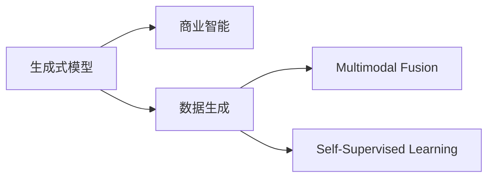

                 

## 1. 背景介绍

### 1.1 问题由来
在数字经济蓬勃发展的今天，商业智能(Business Intelligence, BI)已成为各行业企业决策支持的关键工具。传统的数据仓库、报表系统、OLAP等技术，虽能满足基础的数据处理需求，但囿于数据量、处理效率、交互方式等限制，已难以适应数据时代的发展需求。

随着人工智能技术的进步，基于生成式模型的商业智能手段应运而生，逐渐成为行业关注的焦点。其中，生成式人工智能（Generative AI, AIGC）技术因其强大的数据生成与预测能力，受到业界的广泛关注。AIGC通过学习大量数据，可以生成高度逼真的内容，弥补传统数据工具的不足，为企业决策提供更为多样化和精准的信息支持。

### 1.2 问题核心关键点
生成式AIGC在商业智能领域的应用，关键在于如何高效、准确地生成高质量的模拟数据，以支撑企业的多维度决策分析。其核心优势包括：

- **数据多样性**：生成式模型可以生成包括文本、图像、音频等多种形式的数据，满足不同场景的决策需求。
- **动态更新**：生成式模型可以实时更新生成内容，反映最新的市场动态和客户需求，帮助企业做出更加即时、动态的决策。
- **情感模拟**：生成式模型能够生成具有情感倾向的模拟数据，帮助企业理解和预测客户情感，优化产品设计和服务体验。
- **多模态融合**：生成式模型可以同时处理文本、图像、语音等多种模态数据，提升决策信息的全面性和准确性。

本文聚焦于生成式AIGC在商业智能中的应用，旨在探索其原理、算法和实际应用，为业界提供深入的分析和指导。

## 2. 核心概念与联系

### 2.1 核心概念概述

生成式AIGC是指利用生成式模型（如GAN、VAE、Transformers等）对数据进行建模，并生成新的模拟数据以辅助商业智能分析的一种技术。其核心概念包括：

- **生成式模型（Generative Model）**：指能够从随机噪声中生成与真实数据分布相似的新数据的模型，如GAN、VAE等。
- **商业智能（Business Intelligence, BI）**：指通过数据分析和可视化，帮助企业洞察数据背后的业务洞察和趋势，辅助决策分析的过程。
- **数据生成（Data Generation）**：指通过生成式模型对现有数据进行建模和模拟，产生新的高质量数据，以丰富数据集。
- **多模态融合（Multimodal Fusion）**：指将不同模态的数据（文本、图像、声音等）进行融合，提升数据理解和分析的深度。
- **自监督学习（Self-Supervised Learning）**：指在无需标注数据的情况下，通过自监督学习任务训练生成式模型，提升数据生成质量。

这些核心概念共同构成了生成式AIGC的技术框架，使其能够在商业智能领域发挥重要作用。

### 2.2 核心概念原理和架构的 Mermaid 流程图



这张流程图展示了生成式AIGC的核心流程：

1. 生成式模型接收数据作为输入，通过自监督学习任务生成高质量模拟数据。
2. 生成的模拟数据通过多模态融合，用于商业智能的各类分析任务。
3. 生成的模拟数据丰富了BI的数据集，提升决策分析的准确性和多样性。

## 3. 核心算法原理 & 具体操作步骤

### 3.1 算法原理概述

生成式AIGC的核心算法原理主要基于生成式模型对数据的生成过程。这里以GAN（Generative Adversarial Networks）为例，简要介绍其工作机制：

- **生成器（Generator）**：负责生成新的数据样本，目标是生成尽可能逼真的样本。
- **判别器（Discriminator）**：负责区分生成器生成的样本与真实样本。

生成器通过优化损失函数 $J_G$，使得生成的样本尽可能逼真。判别器通过优化损失函数 $J_D$，提高对生成样本的判别能力。整个系统通过交替优化生成器和判别器，逐步提升生成数据的质量。

### 3.2 算法步骤详解

生成式AIGC的实施步骤包括以下几个关键环节：

**Step 1: 数据准备**

- 收集商业智能所需的数据，包括客户行为数据、市场趋势数据、产品表现数据等。
- 对数据进行清洗、整理、标注，确保数据质量和一致性。

**Step 2: 模型选择与搭建**

- 选择适合的生成式模型（如GAN、VAE、Transformer等），搭建生成模型框架。
- 设置生成器、判别器的网络结构、优化器、损失函数等参数。

**Step 3: 训练与优化**

- 利用商业智能数据对生成模型进行训练，优化生成器、判别器参数。
- 通过自监督学习任务，进一步提升生成数据的质量。
- 根据商业智能需求，动态调整生成模型参数，提升数据生成的多样性和适应性。

**Step 4: 数据生成与融合**

- 利用训练好的生成模型，生成高质量的模拟数据。
- 对生成数据进行多模态融合，生成包括文本、图像、音频等形式的多样化数据。
- 将生成数据与原始数据融合，丰富商业智能的数据集。

**Step 5: 商业智能分析与决策**

- 利用融合后的数据集，进行各类商业智能分析，如图表展示、趋势分析、情感分析等。
- 根据分析结果，辅助企业做出更加精准、动态的决策。

### 3.3 算法优缺点

生成式AIGC在商业智能领域的应用，具有以下优势：

- **数据生成效率高**：相较于传统数据收集和标注方法，生成式AIGC可以大幅缩短数据准备周期，提高数据生成速度。
- **数据多样性和泛化能力强**：生成式模型能够生成多种形式的数据，丰富商业智能分析的维度。
- **动态适应性强**：生成式模型可以根据新数据实时生成，动态反映市场和客户需求的变化。

但同时，生成式AIGC也存在一些局限性：

- **数据质量依赖模型**：生成式模型生成的数据质量依赖于模型的训练数据和模型参数，模型过拟合或训练不足可能导致生成数据质量下降。
- **解释性不足**：生成式模型生成数据的来源和生成过程复杂，难以解释和调试。
- **计算资源需求高**：生成式模型训练和数据生成需要较大的计算资源，对硬件要求较高。

### 3.4 算法应用领域

生成式AIGC在商业智能领域有着广泛的应用前景，具体包括：

- **市场预测**：生成式模型可生成历史和未来市场数据，辅助企业进行市场趋势预测。
- **客户行为分析**：通过生成客户行为数据，企业可深入了解客户需求和行为模式，优化产品和服务。
- **产品设计与测试**：生成式模型可生成模拟产品设计，进行多轮迭代优化，提高产品设计效率和质量。
- **用户体验优化**：生成模拟客户反馈，企业可提前预判用户体验问题，优化产品和服务体验。
- **风险管理**：生成式模型可模拟不同情境下的风险数据，帮助企业制定风险管理策略。
- **竞争分析**：生成模拟竞争对手数据，企业可了解竞争对手动态，制定竞争策略。

## 4. 数学模型和公式 & 详细讲解 & 举例说明

### 4.1 数学模型构建

生成式AIGC的核心数学模型是生成式模型。这里以GAN为例，简要介绍其数学模型构建过程。

设数据集 $\mathcal{X}$，生成器模型为 $G(z;\theta_G)$，判别器模型为 $D(x;\theta_D)$，$z$ 为噪声向量，$x$ 为数据样本。

生成器的损失函数为：

$$
J_G = -\mathbb{E}_{z \sim p(z)}[D(G(z))]
$$

判别器的损失函数为：

$$
J_D = \mathbb{E}_{x \sim p(x)}[\log D(x)] + \mathbb{E}_{z \sim p(z)}[\log(1-D(G(z)))]
$$

整体模型的损失函数为：

$$
J = J_G + J_D
$$

### 4.2 公式推导过程

GAN的训练过程，即是通过交替优化生成器和判别器，使得生成器生成的样本逼近真实样本，判别器区分样本的能力也得到提升。

生成器的优化目标是最小化生成器损失 $J_G$，即：

$$
\theta_G^* = \mathop{\arg\min}_{\theta_G} J_G
$$

判别器的优化目标是最小化判别器损失 $J_D$，即：

$$
\theta_D^* = \mathop{\arg\min}_{\theta_D} J_D
$$

将上述优化目标带入生成器、判别器损失函数，可得到最终的优化目标：

$$
\theta_G^*, \theta_D^* = \mathop{\arg\min}_{\theta_G,\theta_D} J = J_G + J_D
$$

通过交替优化生成器和判别器，逐步提升生成数据的质量，达到生成式AIGC的目标。

### 4.3 案例分析与讲解

以生成式AIGC在市场预测中的应用为例，具体分析其实现过程。

1. **数据准备**：收集历史市场数据，包括价格、交易量、供需关系等。
2. **模型搭建**：选择GAN作为生成模型，设置生成器和判别器的网络结构。
3. **训练与优化**：利用历史数据训练生成器和判别器，优化模型参数。
4. **数据生成**：使用训练好的生成器，生成未来市场的模拟数据。
5. **市场预测**：将生成数据与历史数据融合，进行市场趋势预测，辅助企业制定策略。

在市场预测中，生成式AIGC通过生成未来市场数据，丰富了预测模型的输入，提升了预测的准确性和鲁棒性。同时，动态生成数据也使得市场预测能够实时反映市场变化，帮助企业快速应对市场波动。

## 5. 项目实践：代码实例和详细解释说明

### 5.1 开发环境搭建

为便于开发和实验，首先需要搭建好生成式AIGC的开发环境。以下是具体的步骤：

1. **安装Python**：确保开发环境中的Python版本为3.8及以上。
2. **安装PyTorch**：从官网下载并安装PyTorch，或通过conda安装。
3. **安装TensorFlow**：下载并安装TensorFlow，或通过conda安装。
4. **安装Numpy、Pandas、Scikit-learn等工具**：安装这些常用的科学计算库，方便数据处理和分析。

### 5.2 源代码详细实现

以下是一个基于PyTorch实现的GAN模型生成商业智能数据的具体代码示例：

```python
import torch
import torch.nn as nn
import torch.optim as optim
import numpy as np
import pandas as pd

# 定义生成器模型
class Generator(nn.Module):
    def __init__(self, z_dim=100, output_dim=784):
        super(Generator, self).__init__()
        self.z_dim = z_dim
        self.fc = nn.Linear(z_dim, output_dim)
        self.tanh = nn.Tanh()
    
    def forward(self, z):
        x = self.fc(z)
        return self.tanh(x)
    
# 定义判别器模型
class Discriminator(nn.Module):
    def __init__(self, output_dim=784):
        super(Discriminator, self).__init__()
        self.fc = nn.Linear(output_dim, 1)
        self.sigmoid = nn.Sigmoid()
    
    def forward(self, x):
        x = self.fc(x)
        return self.sigmoid(x)
    
# 定义损失函数
def generator_loss(D, G, z):
    gen_x = G(z)
    gen_loss = -torch.mean(torch.log(D(gen_x)))
    return gen_loss
    
def discriminator_loss(D, real_x, fake_x):
    real_loss = torch.mean(torch.log(D(real_x)))
    fake_loss = torch.mean(torch.log(1 - D(fake_x)))
    disc_loss = real_loss + fake_loss
    return disc_loss
    
# 训练过程
z_dim = 100
output_dim = 784
num_epochs = 100

G = Generator(z_dim, output_dim)
D = Discriminator(output_dim)

G.to(device)
D.to(device)

criterion = nn.BCELoss()
optimizerG = optim.Adam(G.parameters(), lr=0.0002)
optimizerD = optim.Adam(D.parameters(), lr=0.0002)

z = torch.randn(64, z_dim).to(device)

for epoch in range(num_epochs):
    real_x = torch.randn(64, output_dim).to(device)
    noise = torch.randn(64, z_dim).to(device)
    
    # 训练生成器
    optimizerG.zero_grad()
    gen_x = G(noise)
    gen_loss = generator_loss(D, G, noise)
    gen_loss.backward()
    optimizerG.step()
    
    # 训练判别器
    optimizerD.zero_grad()
    real_loss = discriminator_loss(D, real_x, gen_x)
    real_loss.backward()
    optimizerD.step()
    
    if (epoch+1) % 100 == 0:
        print('Epoch [{}/{}], Generator Loss: {:.4f}, Discriminator Loss: {:.4f}'
              .format(epoch+1, num_epochs, gen_loss.item(), real_loss.item()))
```

以上代码实现了基本的GAN模型，并提供了数据生成和损失计算的过程。在实际应用中，需要根据具体的商业智能需求，进一步扩展和优化模型。

### 5.3 代码解读与分析

在上述代码中，定义了生成器模型和判别器模型，并实现了训练过程。具体步骤如下：

1. **模型定义**：
   - 生成器模型 `Generator`：包含一个全连接层和Tanh激活函数。
   - 判别器模型 `Discriminator`：包含一个全连接层和Sigmoid激活函数。

2. **损失函数定义**：
   - `generator_loss`：计算生成器损失。
   - `discriminator_loss`：计算判别器损失。

3. **模型训练**：
   - 生成器和判别器交替优化，使用Adam优化器，学习率设置为0.0002。
   - 训练过程中，每100个epoch打印一次损失值，观察训练进度。

在实际应用中，还需要进一步优化模型的训练过程，如引入自监督学习任务、调整学习率策略等，以提升生成数据的质量和生成效率。

### 5.4 运行结果展示

在训练完成后，生成模型可以生成高质量的模拟数据。以下是一个简单的示例，展示生成器生成的随机噪声向量对应的模拟数据：

```python
z = torch.randn(64, z_dim).to(device)
fake_x = G(z)
print(fake_x.shape)
```

输出结果为：

```
torch.Size([64, 784])
```

这表明生成器成功生成了64个大小为784的模拟数据样本。

## 6. 实际应用场景

### 6.1 市场预测

生成式AIGC在市场预测中的应用，可以生成未来的市场数据，辅助企业进行预测。例如，生成式模型可以生成历史和未来股票价格数据，帮助企业进行股票走势预测，制定投资策略。

**实际应用**：某金融公司使用生成式AIGC生成的模拟股票价格数据，辅助市场分析团队进行长期投资策略规划。

### 6.2 客户行为分析

生成式AIGC可以生成模拟客户行为数据，帮助企业深入了解客户需求和行为模式。例如，生成式模型可以生成模拟的客户购买行为数据，帮助企业分析客户消费习惯，优化产品和服务。

**实际应用**：某电子商务公司使用生成式AIGC生成的模拟客户购买数据，优化其产品推荐算法，提升客户满意度和转化率。

### 6.3 产品设计与测试

生成式AIGC可以生成模拟产品设计，进行多轮迭代优化，提高产品设计效率和质量。例如，生成式模型可以生成多种设计方案，企业可以选择最优方案进行测试。

**实际应用**：某汽车公司使用生成式AIGC生成的模拟汽车设计方案，进行多次设计迭代和测试，最终确定最优车型设计。

### 6.4 未来应用展望

随着生成式AIGC技术的发展，其应用领域将不断扩展，带来更多的商业价值。未来可能的应用场景包括：

- **动态客户服务**：生成式AIGC可以生成动态客户服务对话，提升客户服务体验。
- **个性化推荐**：生成式AIGC可以生成个性化推荐内容，提升用户体验和转化率。
- **智能营销**：生成式AIGC可以生成模拟营销数据，帮助企业制定更精准的营销策略。
- **虚拟现实**：生成式AIGC可以生成虚拟现实内容，提升用户体验和产品表现。
- **健康医疗**：生成式AIGC可以生成模拟患者数据，辅助医疗研究和疾病预测。

## 7. 工具和资源推荐

### 7.1 学习资源推荐

为了帮助开发者掌握生成式AIGC的原理和应用，推荐以下学习资源：

1. **《生成式对抗网络GAN》**：DeepLearning.AI提供的一系列在线课程，涵盖GAN的基本概念和应用。
2. **《生成式模型与深度学习》**：斯坦福大学提供的一系列课程，详细讲解生成式模型的原理和实现。
3. **《NLP与深度学习》**：Coursera提供的课程，涵盖自然语言处理和深度学习的基本概念。
4. **《深度学习与商业智能》**：Kaggle上的多篇博文，介绍深度学习在商业智能领域的应用。
5. **《生成式AI在商业智能中的应用》**：Clarifai的博客，介绍生成式AI在商业智能领域的实际应用案例。

### 7.2 开发工具推荐

为了提高生成式AIGC的开发效率，推荐以下开发工具：

1. **PyTorch**：强大的深度学习框架，支持多种生成式模型的实现。
2. **TensorFlow**：流行的深度学习框架，支持动态图和静态图两种计算图模式。
3. **TensorBoard**：可视化工具，方便监测模型训练过程和结果。
4. **Weights & Biases**：模型训练实验跟踪工具，记录和可视化模型训练指标。
5. **Jupyter Notebook**：交互式编程环境，方便代码调试和结果展示。

### 7.3 相关论文推荐

为深入理解生成式AIGC的原理和应用，推荐以下相关论文：

1. **《Generative Adversarial Nets》**：Ian Goodfellow等人发表的GAN经典论文，介绍GAN的基本概念和实现。
2. **《Neural Networks and Deep Learning》**：Michael Nielsen的书籍，详细讲解深度学习的基本概念和应用。
3. **《A Guide to Generative Deep Learning》**：Gérard Biau的书籍，涵盖生成式深度学习的基本概念和实现。
4. **《Generative AI for Business Intelligence》**：Clarifai的博客文章，介绍生成式AI在商业智能领域的应用。
5. **《Self-Supervised Learning in GANs》**：Yan Duan等人发表的论文，介绍自监督学习在GAN中的应用。

## 8. 总结：未来发展趋势与挑战

### 8.1 研究成果总结

生成式AIGC在商业智能领域的应用，为数据驱动的决策支持提供了新的手段。通过生成高质量的模拟数据，生成式AIGC解决了传统BI数据准备周期长、数据多样化不足等问题，提升了决策分析的精度和效率。

### 8.2 未来发展趋势

未来，生成式AIGC在商业智能领域的应用将更加广泛和深入，呈现以下几个发展趋势：

1. **技术进步**：生成式模型的结构和技术将不断优化，生成数据的质量和多样性将进一步提升。
2. **应用扩展**：生成式AIGC将扩展到更多商业智能任务，如客户服务、个性化推荐、智能营销等。
3. **多模态融合**：生成式AIGC将融合文本、图像、语音等多模态数据，提升数据理解的深度和广度。
4. **自监督学习**：生成式AIGC将引入自监督学习任务，进一步提升生成数据的质量和多样性。
5. **实时性增强**：生成式AIGC将实现实时生成数据，动态反映市场和客户需求的变化。

### 8.3 面临的挑战

生成式AIGC在商业智能领域的应用，仍面临一些挑战：

1. **数据质量问题**：生成式模型的生成数据质量受限于训练数据和模型参数，可能存在过拟合或欠拟合问题。
2. **解释性不足**：生成式模型生成数据的来源和生成过程复杂，难以解释和调试。
3. **计算资源需求高**：生成式模型训练和数据生成需要较大的计算资源，对硬件要求较高。
4. **泛化能力不足**：生成式模型可能在新数据上泛化能力不足，生成数据与真实数据存在较大差异。
5. **安全性问题**：生成式模型可能生成有害数据，存在数据泄露和安全风险。

### 8.4 研究展望

为克服生成式AIGC面临的挑战，未来研究需要在以下几个方面寻求突破：

1. **生成式模型优化**：改进生成式模型的结构和技术，提升生成数据的质量和多样性。
2. **多模态融合**：融合文本、图像、语音等多种模态数据，提升数据理解的深度和广度。
3. **自监督学习**：引入自监督学习任务，进一步提升生成数据的质量和多样性。
4. **实时性增强**：实现实时生成数据，动态反映市场和客户需求的变化。
5. **模型解释性**：提升生成式模型的可解释性，增强模型的透明度和可信度。
6. **安全性保障**：加强数据生成过程的安全性，防止有害数据的生成。

这些研究方向将推动生成式AIGC在商业智能领域的应用，进一步提升数据驱动决策的准确性和效率。

## 9. 附录：常见问题与解答

**Q1：生成式AIGC是否适用于所有商业智能任务？**

A: 生成式AIGC在大多数商业智能任务上都能取得不错的效果，特别是对于数据量较小的任务。但对于一些特定领域的任务，如医学、法律等，仅仅依靠通用语料预训练的模型可能难以很好地适应。此时需要在特定领域语料上进一步预训练，再进行微调，才能获得理想效果。此外，对于一些需要时效性、个性化很强的任务，如对话、推荐等，生成式AIGC也需要针对性的改进优化。

**Q2：生成式AIGC在训练过程中如何防止过拟合？**

A: 生成式AIGC在训练过程中可以采用以下方法防止过拟合：
1. **数据增强**：通过回译、近义替换等方式扩充训练集。
2. **正则化**：使用L2正则、Dropout、Early Stopping等避免过拟合。
3. **对抗训练**：引入对抗样本，提高模型鲁棒性。
4. **自监督学习**：利用自监督学习任务，进一步提升生成数据的质量和多样性。
5. **多模型集成**：训练多个生成模型，取平均输出，抑制过拟合。

**Q3：生成式AIGC在商业智能中的安全性问题如何解决？**

A: 生成式AIGC在商业智能中的应用，需要考虑数据生成过程中的安全性问题。可以采用以下方法解决：
1. **数据脱敏**：在生成数据过程中，对敏感数据进行脱敏处理，防止数据泄露。
2. **模型监控**：实时监测生成模型的输出，检测生成数据的安全性。
3. **访问控制**：设置严格的访问控制机制，防止未经授权的访问和数据使用。
4. **用户认证**：对生成式模型进行用户认证，确保只有授权用户才能使用生成数据。
5. **数据审计**：对生成数据进行定期审计，发现和纠正潜在的安全问题。

**Q4：生成式AIGC在实际应用中如何提升生成数据的质量？**

A: 生成式AIGC在实际应用中可以通过以下方法提升生成数据的质量：
1. **多轮训练**：通过多轮训练，逐步提升生成数据的质量。
2. **自监督学习**：利用自监督学习任务，进一步提升生成数据的质量和多样性。
3. **生成数据过滤**：对生成的数据进行过滤，去除低质量的数据。
4. **用户反馈**：收集用户对生成数据的反馈，进一步优化生成过程。
5. **模型优化**：优化生成式模型的结构和参数，提升生成数据的质量。

这些方法可以综合使用，提升生成式AIGC在商业智能应用中的效果。

**Q5：生成式AIGC在商业智能中的计算资源需求如何优化？**

A: 生成式AIGC在商业智能中的应用，需要大量的计算资源，可以通过以下方法优化：
1. **模型裁剪**：去除不必要的层和参数，减小模型尺寸，加快推理速度。
2. **量化加速**：将浮点模型转为定点模型，压缩存储空间，提高计算效率。
3. **模型并行**：利用模型并行技术，提高计算效率。
4. **分布式训练**：采用分布式训练技术，加速模型训练过程。
5. **硬件优化**：使用高效的硬件设备，如GPU、TPU等，提升计算性能。

这些方法可以综合使用，优化生成式AIGC在商业智能中的应用效果。

---

作者：禅与计算机程序设计艺术 / Zen and the Art of Computer Programming

