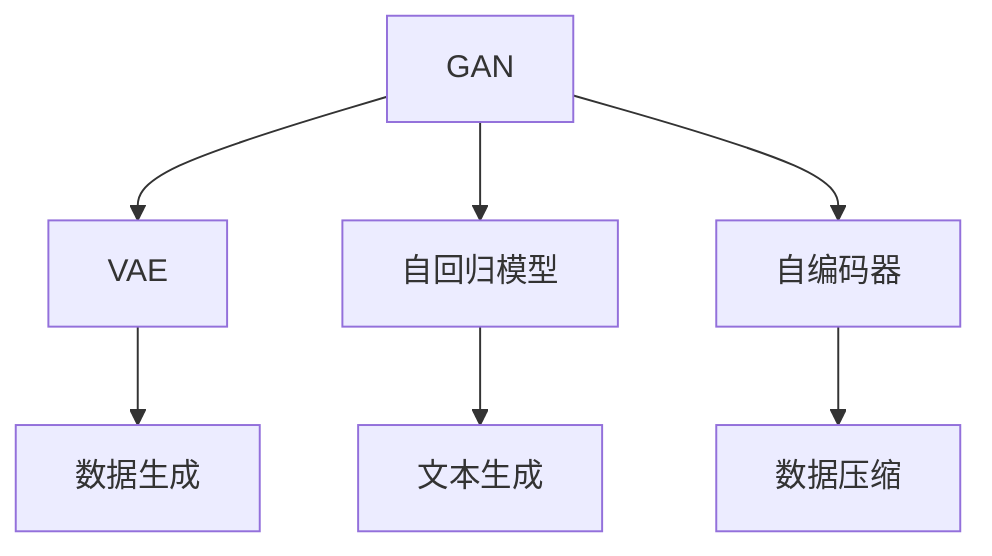

                 

# 生成式AIGC：数据驱动的商业变革

> 关键词：生成式AI,生成对抗网络(GAN),深度学习,计算机视觉,自然语言处理(NLP),增强现实(AR),虚拟现实(VR),数据驱动的商业决策

## 1. 背景介绍

### 1.1 问题由来

随着深度学习技术的发展，人工智能(AI)领域涌现出大量的创新成果，其中生成式AI(Generative AI)无疑是近年来最令人瞩目的技术之一。生成式AI通过深度学习模型生成全新的数据，具有高度的灵活性和创造性。这种能力使得生成式AI在许多行业领域中展现出了巨大的应用潜力，推动了商业模式的变革。

### 1.2 问题核心关键点

生成式AI的核心在于通过深度学习模型生成高质量的数据，这些数据可以包括但不限于图像、音频、视频、文本等形式。它主要依赖于以下几种核心技术：

1. **生成对抗网络(GAN)**：GAN由生成器和判别器两部分组成，通过两者之间的对抗性训练，生成器能够生成逼真的数据。
2. **变分自编码器(VAE)**：VAE通过学习数据分布，生成新的样本。
3. **自回归模型**：如OpenAI的GPT系列模型，能够根据已有数据生成新的文本。
4. **自编码器**：通过将数据压缩成低维编码，再通过解码器生成新的数据。

这些技术在自然语言处理(NLP)、计算机视觉(CV)、增强现实(AR)和虚拟现实(VR)等众多领域得到了广泛应用，成为推动商业变革的重要动力。

### 1.3 问题研究意义

生成式AI技术的应用意义重大，不仅在娱乐、影视制作、游戏开发等领域带来了颠覆性的变革，还在医疗、教育、金融等行业提供了新的数据生成和分析手段，极大地提升了数据利用效率，推动了产业升级和商业模式创新。

1. **内容创作**：生成式AI可以自动化生成高质量的文本、音频、视频等内容，大大降低内容创作的成本，提升内容创作的效率和质量。
2. **数据增强**：通过生成式AI生成更多样化的训练数据，提升机器学习模型的泛化能力和鲁棒性。
3. **模拟仿真**：生成式AI可以模拟复杂的物理和自然现象，为虚拟现实和仿真训练提供高质量的数据支持。
4. **个性化推荐**：生成式AI可以动态生成个性化内容，提升用户体验，增强推荐系统的精准度。
5. **智能决策**：生成式AI可以生成多维度、多模态的数据，支持数据驱动的商业决策，提升决策的科学性和精准度。

## 2. 核心概念与联系

### 2.1 核心概念概述

为了更好地理解生成式AI，本节将介绍几个密切相关的核心概念：

- **生成对抗网络(GAN)**：由生成器和判别器组成，通过对抗性训练生成逼真的数据。
- **变分自编码器(VAE)**：通过学习数据分布，生成新的样本，具有变分推断和数据重构的能力。
- **自回归模型**：如GPT系列模型，能够根据已有数据生成新的文本，具有语言建模的能力。
- **自编码器**：通过将数据压缩成低维编码，再通过解码器生成新的数据，具有数据压缩和重构的能力。

这些概念之间的逻辑关系可以通过以下Mermaid流程图来展示：



这个流程图展示了大语言模型的核心概念及其之间的关系：

1. GAN通过对抗性训练生成逼真的数据。
2. VAE通过学习数据分布，生成新的样本。
3. 自回归模型通过语言建模生成新的文本。
4. 自编码器通过压缩和解码生成新的数据。

这些概念共同构成了生成式AI的基础，使得模型能够生成高质量的数据，并在各个领域中发挥重要作用。

## 3. 核心算法原理 & 具体操作步骤
### 3.1 算法原理概述

生成式AI的核心算法原理主要依赖于深度学习模型，通过学习数据的分布或生成机制，实现对新数据的生成。其主要算法包括生成对抗网络(GAN)、变分自编码器(VAE)、自回归模型等。

- **GAN**：通过生成器和判别器的对抗性训练，生成逼真的数据。
- **VAE**：通过学习数据的分布，生成新的样本，具有变分推断和数据重构的能力。
- **自回归模型**：如GPT系列模型，能够根据已有数据生成新的文本，具有语言建模的能力。

这些算法在生成式AI中均有广泛应用，生成对抗网络GAN是生成式AI中最具代表性的技术。

### 3.2 算法步骤详解

以生成对抗网络GAN为例，下面详细介绍其具体算法步骤：

**Step 1: 准备数据和模型架构**

- 收集需要生成的数据集，将其分为训练集和测试集。
- 定义生成器和判别器的架构，如使用CNN、RNN或Transformer等。

**Step 2: 初始化模型参数**

- 随机初始化生成器和判别器的权重参数。

**Step 3: 对抗性训练**

- 随机生成一批数据，将其中一部分送入生成器生成假数据。
- 将真实数据和假数据混合，送入判别器进行分类，判断是真实数据还是假数据。
- 计算判别器的损失函数，并根据损失函数更新判别器的参数。
- 使用判别器的输出作为生成器的目标，更新生成器的参数。
- 不断重复上述过程，直到生成器生成的数据能够以一定的概率欺骗判别器。

**Step 4: 数据生成**

- 使用训练好的生成器生成新的数据，并将其送入判别器进行分类。
- 根据判别器的输出判断生成的数据质量。
- 对生成器进行微调，以提高生成数据的真实性。

### 3.3 算法优缺点

生成对抗网络GAN的优点包括：

1. 可以生成高质量、逼真的数据，适用于图像、音频、视频等复杂数据。
2. 模型具有较好的泛化能力，能够生成多样化的数据。
3. 算法简单，易于实现和调整。

但其缺点也显而易见：

1. 训练过程不稳定，生成器和判别器容易陷入不稳定状态，导致训练失败。
2. 生成器生成的数据质量受生成器和判别器之间的对抗性训练影响较大。
3. 生成器容易过拟合训练数据，生成数据质量不高。

### 3.4 算法应用领域

生成对抗网络GAN在生成式AI中的应用非常广泛，主要包括：

1. **计算机视觉**：生成逼真的图像、视频、动画等。
2. **自然语言处理**：生成自然流畅的文本，如对话系统、翻译系统、摘要生成等。
3. **增强现实**：生成虚拟场景、物体，用于增强现实游戏和虚拟现实。
4. **虚拟现实**：生成逼真的虚拟场景和人物，用于虚拟现实体验。
5. **音频生成**：生成逼真的音频数据，如音乐、语音、音效等。

此外，生成对抗网络GAN也在药物研发、智能制造、金融模拟等领域得到了应用。

## 4. 数学模型和公式 & 详细讲解 & 举例说明

### 4.1 数学模型构建

以生成对抗网络GAN为例，其数学模型主要包含生成器、判别器和损失函数三个部分。

**生成器模型**：假设生成器为 $G$，其输入为噪声 $z$，输出为生成的图像 $x$。生成器的映射关系为：

$$
x = G(z)
$$

**判别器模型**：假设判别器为 $D$，其输入为真实图像 $x$ 和生成图像 $G(z)$，输出为真实性判断 $y$。判别器的映射关系为：

$$
y = D(x)
$$

**损失函数**：生成器和判别器的目标是通过对抗性训练提高生成数据的逼真性。因此，损失函数由两部分组成：生成器的损失函数 $L_G$ 和判别器的损失函数 $L_D$。

$$
L_G = \mathbb{E}_{z \sim p(z)} [L_D(G(z))]
$$

$$
L_D = \mathbb{E}_{x \sim p(x)} [\log D(x)] + \mathbb{E}_{z \sim p(z)} [-\log D(G(z))]
$$

其中，$p(z)$ 为噪声 $z$ 的分布，$p(x)$ 为真实数据 $x$ 的分布。

### 4.2 公式推导过程

通过上述数学模型，生成器和判别器的对抗性训练过程可以表示为：

1. 生成器 $G$ 的损失函数：

$$
L_G = \mathbb{E}_{z \sim p(z)} [\log (1 - D(G(z))))
$$

2. 判别器 $D$ 的损失函数：

$$
L_D = \mathbb{E}_{x \sim p(x)} [\log D(x)] + \mathbb{E}_{z \sim p(z)} [-\log D(G(z))]
$$

通过优化上述损失函数，生成器和判别器之间的对抗性训练过程如下：

1. 生成器生成假数据 $G(z)$，将其送入判别器 $D$，计算判别器的输出 $y$。
2. 计算生成器的损失函数 $L_G$，根据损失函数反向传播更新生成器的参数。
3. 判别器接收真实数据 $x$ 和假数据 $G(z)$，计算判别器的输出 $y$。
4. 计算判别器的损失函数 $L_D$，根据损失函数反向传播更新判别器的参数。
5. 重复步骤1-4，直至收敛。

### 4.3 案例分析与讲解

假设我们要生成逼真的手写数字图像，可以将MNIST数据集作为训练数据。

**Step 1: 准备数据和模型架构**

- 收集MNIST数据集，将其分为训练集和测试集。
- 定义生成器和判别器的架构，如使用CNN模型。

**Step 2: 初始化模型参数**

- 随机初始化生成器和判别器的权重参数。

**Step 3: 对抗性训练**

- 随机生成一批噪声 $z$，将其送入生成器生成假图像 $G(z)$。
- 将真实图像 $x$ 和假图像 $G(z)$ 混合，送入判别器 $D$ 进行分类。
- 计算判别器的损失函数 $L_D$，并根据损失函数更新判别器的参数。
- 使用判别器的输出作为生成器的目标，更新生成器的参数。
- 不断重复上述过程，直至生成器生成的图像能够以一定的概率欺骗判别器。

**Step 4: 数据生成**

- 使用训练好的生成器生成新的手写数字图像 $G(z)$。
- 将生成的图像送入判别器 $D$ 进行分类，根据判别器的输出判断生成图像的质量。
- 对生成器进行微调，以提高生成图像的真实性。

## 5. 项目实践：代码实例和详细解释说明

### 5.1 开发环境搭建

在进行生成对抗网络GAN的实践前，我们需要准备好开发环境。以下是使用Python进行TensorFlow开发的环境配置流程：

1. 安装Anaconda：从官网下载并安装Anaconda，用于创建独立的Python环境。

2. 创建并激活虚拟环境：
```bash
conda create -n tf-env python=3.8 
conda activate tf-env
```

3. 安装TensorFlow：根据CUDA版本，从官网获取对应的安装命令。例如：
```bash
conda install tensorflow -c tensorflow -c conda-forge
```

4. 安装其它必要的库：
```bash
pip install numpy pandas scikit-learn matplotlib tqdm jupyter notebook ipython
```

完成上述步骤后，即可在`tf-env`环境中开始生成对抗网络GAN的实践。

### 5.2 源代码详细实现

下面以生成手写数字图像为例，给出使用TensorFlow实现生成对抗网络GAN的代码实现。

```python
import tensorflow as tf
from tensorflow.keras import layers
import numpy as np

# 定义生成器和判别器
class Generator(tf.keras.Model):
    def __init__(self):
        super(Generator, self).__init__()
        self.dense1 = layers.Dense(256, input_dim=100)
        self.dense2 = layers.Dense(512, activation='relu')
        self.dense3 = layers.Dense(784, activation='tanh')

    def call(self, x):
        x = self.dense1(x)
        x = self.dense2(x)
        x = self.dense3(x)
        return x

class Discriminator(tf.keras.Model):
    def __init__(self):
        super(Discriminator, self).__init__()
        self.dense1 = layers.Dense(512, input_dim=784)
        self.dense2 = layers.Dense(512, activation='relu')
        self.dense3 = layers.Dense(1, activation='sigmoid')

    def call(self, x):
        x = self.dense1(x)
        x = self.dense2(x)
        x = self.dense3(x)
        return x

# 定义生成器和判别器
generator = Generator()
discriminator = Discriminator()

# 定义优化器
generator_optimizer = tf.keras.optimizers.Adam(learning_rate=0.0002)
discriminator_optimizer = tf.keras.optimizers.Adam(learning_rate=0.0002)

# 定义损失函数
cross_entropy = tf.keras.losses.BinaryCrossentropy()

# 定义梯度计算图
@tf.function
def train_step(images):
    noise = tf.random.normal([BATCH_SIZE, NOISE_DIM])
    with tf.GradientTape() as gen_tape, tf.GradientTape() as disc_tape:
        generated_images = generator(noise, training=True)
        real_output = discriminator(images, training=True)
        fake_output = discriminator(generated_images, training=True)
        gen_loss = cross_entropy(tf.ones_like(fake_output), fake_output)
        disc_loss = cross_entropy(tf.ones_like(real_output), real_output) + cross_entropy(tf.zeros_like(fake_output), fake_output)
        gradients_of_gen = gen_tape.gradient(gen_loss, generator.trainable_variables)
        gradients_of_disc = disc_tape.gradient(disc_loss, discriminator.trainable_variables)
    generator_optimizer.apply_gradients(zip(gradients_of_gen, generator.trainable_variables))
    discriminator_optimizer.apply_gradients(zip(gradients_of_disc, discriminator.trainable_variables))
    return gen_loss, disc_loss

# 定义训练函数
def train_epoch(discriminator, generator, dataset, batch_size, epochs):
    for epoch in range(epochs):
        for image_batch in dataset:
            gen_loss, disc_loss = train_step(image_batch)
            print(f"Epoch: {epoch+1}, Gen Loss: {gen_loss:.4f}, Disc Loss: {disc_loss:.4f}")

# 训练模型
dataset = ...  # 加载数据集
BATCH_SIZE = 64
NOISE_DIM = 100
epochs = 100

train_epoch(discriminator, generator, dataset, BATCH_SIZE, epochs)
```

### 5.3 代码解读与分析

让我们再详细解读一下关键代码的实现细节：

**Generator和Discriminator类**：
- 定义生成器和判别器的结构，包含多个全连接层和激活函数。
- 生成器接收噪声向量 $z$ 作为输入，输出图像 $x$。
- 判别器接收图像 $x$ 作为输入，输出真实性判断 $y$。

**优化器和损失函数**：
- 使用Adam优化器进行模型参数更新。
- 定义交叉熵损失函数，用于衡量生成图像和真实图像的判别器输出差异。

**train_step函数**：
- 定义生成器和判别器的前向传播过程，计算损失函数。
- 使用GradientTape记录梯度，反向传播更新模型参数。
- 返回生成的图像和判别器的损失。

**train_epoch函数**：
- 遍历数据集，对每个批次进行训练。
- 计算生成器和判别器的损失，并输出。

完成上述步骤后，即可在`tf-env`环境中训练生成对抗网络GAN，并生成逼真的手写数字图像。

## 6. 实际应用场景
### 6.1 智能内容创作

生成式AI在内容创作领域具有广阔的应用前景。传统的创意工作如写作、绘画、音乐创作等，需要大量的时间和精力，且具有较高的门槛。而生成式AI可以自动化生成高质量的内容，大大降低创作成本，提升创作效率。

例如，文本生成模型可以根据用户输入的简短描述，生成完整的故事、新闻、评论等文本内容，可用于新闻自动化生成、自动翻译、社交媒体内容创作等场景。图像生成模型可以生成逼真的艺术品、广告、游戏场景等，可用于影视制作、游戏开发等领域。音乐生成模型可以自动创作旋律、编曲、生成背景音乐等，可用于音乐制作、视频配乐等领域。

### 6.2 数据增强

在机器学习和深度学习中，数据增强是一种常见的技术，用于扩充训练数据集，提升模型泛化能力和鲁棒性。生成式AI可以生成大量的增强数据，提升模型训练效果。

例如，在计算机视觉领域，生成对抗网络GAN可以生成多样化的图像数据，用于增强模型的泛化能力和鲁棒性。在自然语言处理领域，自回归模型可以生成多种风格、多种语境的文本数据，提升模型的语言建模能力。

### 6.3 模拟仿真

生成式AI可以生成逼真的虚拟场景、物体和人物，用于模拟仿真训练。这在教育和军事等领域具有重要应用价值。

例如，在教育领域，虚拟现实(VR)和增强现实(AR)技术可以用于虚拟课堂、模拟实验、虚拟场景互动等，提升教学效果和学生体验。在军事领域，生成式AI可以用于模拟战场环境、生成虚拟士兵等，提升军事训练效果。

### 6.4 未来应用展望

随着生成式AI技术的不断发展，其应用前景将更加广泛。未来，生成式AI将在以下领域得到更深入的应用：

1. **娱乐影视**：生成式AI可以生成逼真的影视场景、人物、对话等，用于影视制作和游戏开发。
2. **医疗健康**：生成式AI可以生成模拟患者、模拟医学影像、生成健康建议等，用于医学研究和临床实践。
3. **金融经济**：生成式AI可以生成模拟市场数据、生成金融报告、生成投资策略等，用于金融分析和投资决策。
4. **智能家居**：生成式AI可以生成虚拟家居场景、生成智能家居设备交互指令等，用于智能家居系统开发。
5. **教育培训**：生成式AI可以生成虚拟教师、模拟实验、生成个性化学习内容等，用于教育培训。

## 7. 工具和资源推荐
### 7.1 学习资源推荐

为了帮助开发者系统掌握生成式AI的理论基础和实践技巧，这里推荐一些优质的学习资源：

1. **《Deep Learning Specialization》系列课程**：由Coursera开设，由深度学习领域的知名专家Andrew Ng教授授课，系统讲解深度学习的基础理论和应用实践。
2. **《Generative Adversarial Nets》论文**：Ioannidis等人于2014年发表的生成对抗网络GAN的奠基性论文，详细阐述了GAN的原理和实现方法。
3. **《Deep Learning》书籍**：Goodfellow等人于2016年出版的经典深度学习书籍，涵盖深度学习的基本理论和应用实践，推荐细读。
4. **《Gan Zoo》网站**：GitHub上维护的一个生成对抗网络GAN的资源库，包含大量开源模型和代码示例，非常适合学习和实践。
5. **《TensorFlow Official Documentation》**：TensorFlow官方文档，包含深度学习模型和工具的详细介绍，是学习和使用TensorFlow的必备资源。

通过对这些资源的学习实践，相信你一定能够快速掌握生成式AI的精髓，并用于解决实际的NLP问题。

### 7.2 开发工具推荐

高效的开发离不开优秀的工具支持。以下是几款用于生成式AI开发的常用工具：

1. **TensorFlow**：由Google主导开发的开源深度学习框架，支持多种深度学习模型和算法，生产部署方便，适合大规模工程应用。
2. **PyTorch**：Facebook开源的深度学习框架，支持动态计算图，灵活高效，适合研究型项目。
3. **Keras**：高层深度学习API，支持多种深度学习模型，易于上手，适合初学者和快速原型开发。
4. **OpenCV**：开源计算机视觉库，支持图像处理、特征提取、目标检测等计算机视觉任务。
5. **Tesseract OCR**：开源OCR识别库，支持文本识别、图像处理等任务。

合理利用这些工具，可以显著提升生成式AI开发的效率，加快创新迭代的步伐。

### 7.3 相关论文推荐

生成式AI技术的发展源于学界的持续研究。以下是几篇奠基性的相关论文，推荐阅读：

1. **《ImageNet Classification with Deep Convolutional Neural Networks》**：Krizhevsky等人于2012年发表的深度卷积神经网络在图像分类任务上的突破性成果。
2. **《A Neural Network for Machine Translation》**：Bahdanau等人于2014年发表的深度学习模型在机器翻译任务上的突破性成果。
3. **《Generative Adversarial Nets》**：Goodfellow等人于2014年发表的生成对抗网络GAN的奠基性论文，详细阐述了GAN的原理和实现方法。
4. **《Unsupervised Text Generation with Variational Autoencoders》**：Rezende等人于2014年发表的变分自编码器VAE在文本生成任务上的突破性成果。
5. **《Attention Is All You Need》**：Vaswani等人于2017年发表的自回归模型在文本生成任务上的突破性成果。

这些论文代表了大生成式AI的发展脉络。通过学习这些前沿成果，可以帮助研究者把握学科前进方向，激发更多的创新灵感。

## 8. 总结：未来发展趋势与挑战

### 8.1 总结

本文对生成式AI进行了全面系统的介绍。首先阐述了生成式AI的背景、核心概念和研究意义，明确了生成式AI在内容创作、数据增强、模拟仿真等领域的广泛应用。其次，从原理到实践，详细讲解了生成对抗网络GAN的数学模型和算法步骤，给出了生成对抗网络GAN的代码实例和详细解释说明。同时，本文还探讨了生成式AI在智能内容创作、数据增强、模拟仿真等多个行业领域的应用前景，展示了生成式AI技术的广阔前景。

通过对生成式AI的深入分析，可以看到，生成式AI技术正在成为人工智能领域的重要范式，极大地拓展了深度学习模型的应用边界，为内容创作、数据增强、模拟仿真等领域带来了颠覆性的变革。未来，伴随生成式AI技术的持续演进，其在商业领域的潜力将进一步释放，推动产业升级和商业模式创新。

### 8.2 未来发展趋势

展望未来，生成式AI技术将呈现以下几个发展趋势：

1. **多模态生成**：未来的生成式AI将支持多模态数据的生成，如图像、音频、视频、文本等，生成更加丰富和逼真的数据。
2. **自监督学习**：生成式AI将更多依赖于自监督学习，减少对大量标注数据的依赖，提升数据生成效率和质量。
3. **跨领域应用**：生成式AI将在更多领域得到应用，如医疗、金融、教育、军事等，推动各行各业的数字化转型。
4. **个性化生成**：生成式AI将更加注重个性化生成，根据用户需求和偏好生成定制化的内容。
5. **动态生成**：生成式AI将支持动态生成，根据不同情境和输入生成多样化的数据。

以上趋势凸显了生成式AI技术的广阔前景，为内容创作、数据增强、模拟仿真等领域带来了新的发展机遇。这些方向的探索发展，必将进一步提升生成式AI的性能和应用范围，为人工智能技术在各个领域的落地应用提供新的动力。

### 8.3 面临的挑战

尽管生成式AI技术已经取得了瞩目成就，但在迈向更加智能化、普适化应用的过程中，它仍面临着诸多挑战：

1. **数据质量和多样性**：生成式AI需要大量高质量、多样化的数据进行训练，但获取这些数据的过程往往充满挑战。
2. **算法复杂性和训练成本**：生成式AI算法复杂，训练过程需要大量的计算资源和时间，难以在实际应用中大规模部署。
3. **生成数据质量**：生成式AI生成的数据质量受模型参数、训练数据等因素影响较大，难以保证高质量输出。
4. **伦理和隐私问题**：生成式AI生成的数据可能带有偏见、有害信息，甚至可能被用于恶意用途，带来伦理和隐私问题。

这些挑战需要学界和产业界共同努力，积极探索新的方法，推动生成式AI技术的不断进步。

### 8.4 研究展望

面对生成式AI所面临的种种挑战，未来的研究需要在以下几个方面寻求新的突破：

1. **无监督学习**：探索无监督学习技术，减少对标注数据的依赖，提升数据生成效率和质量。
2. **高效训练**：开发更加高效的训练算法和工具，优化生成式AI的训练过程，降低计算资源和时间成本。
3. **数据增强**：利用数据增强技术，提升生成式AI生成的数据多样性和质量。
4. **跨模态融合**：探索跨模态融合技术，提升生成式AI在不同模态数据之间的生成能力。
5. **模型鲁棒性**：增强生成式AI的鲁棒性，使其能够生成高质量、鲁棒的数据。
6. **伦理和安全**：在生成式AI模型中加入伦理和安全约束，确保生成数据的无害性和合法性。

这些研究方向将引领生成式AI技术迈向更高的台阶，为内容创作、数据增强、模拟仿真等领域提供更强大、更可靠的技术支持。面向未来，生成式AI技术需要在算法、数据、模型、伦理等多个维度进行全面优化，才能真正实现其巨大的应用潜力。

## 9. 附录：常见问题与解答

**Q1: 生成式AI在内容创作领域的应用前景如何？**

A: 生成式AI在内容创作领域具有广阔的应用前景。传统的创意工作如写作、绘画、音乐创作等，需要大量的时间和精力，且具有较高的门槛。而生成式AI可以自动化生成高质量的内容，大大降低创作成本，提升创作效率。例如，文本生成模型可以根据用户输入的简短描述，生成完整的故事、新闻、评论等文本内容，可用于新闻自动化生成、自动翻译、社交媒体内容创作等场景。图像生成模型可以生成逼真的艺术品、广告、游戏场景等，可用于影视制作、游戏开发等领域。音乐生成模型可以自动创作旋律、编曲、生成背景音乐等，可用于音乐制作、视频配乐等领域。

**Q2: 生成式AI在数据增强方面的应用前景如何？**

A: 生成式AI在数据增强方面具有巨大的应用前景。传统的机器学习和深度学习模型依赖大量标注数据进行训练，但标注数据的获取成本高、周期长。而生成式AI可以生成大量的增强数据，提升模型泛化能力和鲁棒性。例如，在计算机视觉领域，生成对抗网络GAN可以生成多样化的图像数据，用于增强模型的泛化能力和鲁棒性。在自然语言处理领域，自回归模型可以生成多种风格、多种语境的文本数据，提升模型的语言建模能力。

**Q3: 生成式AI在模拟仿真方面的应用前景如何？**

A: 生成式AI在模拟仿真方面具有广泛的应用前景。传统的模拟仿真依赖大量真实数据，数据获取和处理成本高、效率低。而生成式AI可以生成逼真的虚拟场景、物体和人物，用于模拟仿真训练。这在教育和军事等领域具有重要应用价值。例如，在教育领域，虚拟现实(VR)和增强现实(AR)技术可以用于虚拟课堂、模拟实验、虚拟场景互动等，提升教学效果和学生体验。在军事领域，生成式AI可以用于模拟战场环境、生成虚拟士兵等，提升军事训练效果。

**Q4: 生成式AI在娱乐影视方面的应用前景如何？**

A: 生成式AI在娱乐影视方面具有巨大的应用前景。传统的影视制作依赖大量人力物力，成本高、周期长。而生成式AI可以生成逼真的影视场景、人物、对话等，用于影视制作和游戏开发。例如，生成对抗网络GAN可以生成逼真的影视场景、人物和对话，用于影视制作和游戏开发。自回归模型可以生成高质量的对话和字幕，用于影视翻译和字幕生成。音乐生成模型可以自动创作旋律、编曲、生成背景音乐等，用于音乐制作和视频配乐。

**Q5: 生成式AI在医疗健康方面的应用前景如何？**

A: 生成式AI在医疗健康方面具有巨大的应用前景。传统的医疗健康依赖大量标注数据和专业医生，成本高、效率低。而生成式AI可以生成模拟患者、模拟医学影像、生成健康建议等，用于医学研究和临床实践。例如，生成对抗网络GAN可以生成逼真的虚拟患者，用于医学研究和临床模拟。变分自编码器VAE可以生成高质量的医学影像，用于医学诊断和治疗。自回归模型可以生成个性化的健康建议，用于智能医疗和健康管理。

**Q6: 生成式AI在金融经济方面的应用前景如何？**

A: 生成式AI在金融经济方面具有巨大的应用前景。传统的金融经济依赖大量历史数据和专家分析，成本高、效率低。而生成式AI可以生成模拟市场数据、生成金融报告、生成投资策略等，用于金融分析和投资决策。例如，生成对抗网络GAN可以生成逼真的市场数据，用于金融分析和模拟仿真。自回归模型可以生成高质量的金融报告和投资建议，用于智能投资和风险管理。

**Q7: 生成式AI在智能家居方面的应用前景如何？**

A: 生成式AI在智能家居方面具有巨大的应用前景。传统的智能家居依赖大量传感器数据和复杂算法，成本高、复杂度高。而生成式AI可以生成虚拟家居场景、生成智能家居设备交互指令等，用于智能家居系统开发。例如，生成对抗网络GAN可以生成逼真的虚拟家居场景，用于智能家居设计和展示。自回归模型可以生成个性化的智能家居设备交互指令，用于智能家居控制和优化。

**Q8: 生成式AI在教育培训方面的应用前景如何？**

A: 生成式AI在教育培训方面具有巨大的应用前景。传统的教育培训依赖大量教师和教材，成本高、效率低。而生成式AI可以生成虚拟教师、模拟实验、生成个性化学习内容等，用于教育培训。例如，生成对抗网络GAN可以生成逼真的虚拟教师，用于教育培训和课堂互动。变分自编码器VAE可以生成高质量的模拟实验，用于实验教学和实践培训。自回归模型可以生成个性化的学习内容，用于个性化教育和智能辅导。

