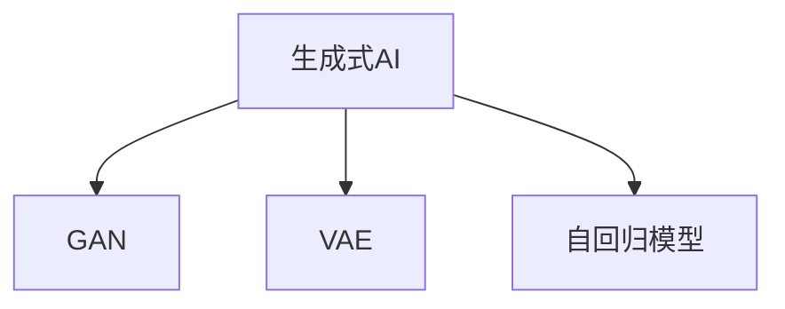

                 

# 生成式AI：机遇与风险并存，如何理性看待？

在人工智能的蓬勃发展中，生成式AI（Generative AI）日益成为最具影响力的技术之一。从文字生成、图像创作，到视频生成、音乐创作，生成式AI在各个领域展示出强大的创造力和应用潜力。然而，其带来的机遇与风险并存，需要我们理性看待，谨慎前行。

## 1. 背景介绍

### 1.1 问题由来

随着深度学习技术的突破，生成式AI逐步从理论走向应用，成为AI领域的一大热点。其核心原理在于使用深度神经网络模型，通过大量训练数据学习并生成新的、符合特定规则或风格的数据。这些技术在艺术创作、内容生成、智能客服、虚拟助手等领域展现出巨大的应用前景。然而，生成式AI的发展也带来了数据隐私、内容真实性、伦理道德等诸多挑战。

### 1.2 问题核心关键点

生成式AI的核心在于生成式模型，其主要目标是学习数据的潜在分布，并据此生成新的、未见过的数据样本。其中，判别生成对抗网络（GAN）、变分自编码器（VAE）和自回归模型（如LSTM、GPT等）是生成式AI的三大支柱。这些技术通过不同的设计思路和训练方式，实现多样化的数据生成任务。

生成式AI的发展不仅推动了AI技术的前沿进步，还深刻影响了人们的生产生活方式。然而，技术的发展也带来了一系列新的挑战，包括数据隐私泄露、内容真实性问题、伦理道德争议等。如何在享受生成式AI带来的机遇的同时，规避其潜在风险，成为当前学界和业界共同面临的重要课题。

## 2. 核心概念与联系

### 2.1 核心概念概述

为更好地理解生成式AI，本节将介绍几个密切相关的核心概念：

- **生成式AI**：使用深度学习模型，从大量数据中学习并生成新的、符合特定规则或风格的数据的技术。
- **判别生成对抗网络（GAN）**：一种生成模型，通过对抗性训练，使得生成模型能够生成与真实数据难以区分的虚假数据。
- **变分自编码器（VAE）**：一种生成模型，通过最小化生成数据与原始数据之间的距离，实现数据的生成和降维。
- **自回归模型**：如LSTM、GPT等，通过学习输入序列的规律，生成与输入序列相似的输出序列。

这些核心概念之间的逻辑关系可以通过以下Mermaid流程图来展示：



这个流程图展示了几大生成式AI技术的核心概念及其之间的关系：

1. 生成式AI涵盖了一系列生成技术。
2. GAN通过对抗性训练，生成高质量的虚假数据。
3. VAE通过优化损失函数，实现数据的生成和降维。
4. 自回归模型通过学习输入序列规律，生成连续的输出序列。

这些核心概念共同构成了生成式AI的基本框架，使其能够实现多样化的数据生成任务。

## 3. 核心算法原理 & 具体操作步骤
### 3.1 算法原理概述

生成式AI的核心算法包括GAN、VAE和自回归模型。这些算法通过学习数据的潜在分布，生成新的、未见过的数据。

GAN通过生成器和判别器的对抗训练，使得生成器能够生成高质量的虚假数据，与真实数据难以区分。VAE通过最小化生成数据与原始数据之间的距离，实现数据的生成和降维。自回归模型通过学习输入序列的规律，生成与输入序列相似的输出序列。

### 3.2 算法步骤详解

以下将分别介绍GAN、VAE和自回归模型的详细步骤：

**GAN算法步骤：**
1. **定义生成器和判别器**：生成器用于生成虚假数据，判别器用于判断数据是否真实。
2. **对抗性训练**：通过交替训练生成器和判别器，使生成器能够生成高质量的虚假数据，同时判别器能够准确识别真实和虚假数据。
3. **损失函数设计**：使用交叉熵等损失函数评估生成器和判别器的性能。
4. **参数更新**：通过反向传播算法更新生成器和判别器的参数，优化模型性能。

**VAE算法步骤：**
1. **定义编码器和解码器**：编码器将输入数据映射为潜在空间中的向量，解码器将潜在空间中的向量映射回原始数据空间。
2. **损失函数设计**：包括重构损失和潜在空间的正则化损失。
3. **参数更新**：通过反向传播算法更新编码器和解码器的参数，最小化损失函数。

**自回归模型算法步骤：**
1. **定义自回归模型**：如LSTM、GPT等，通过学习输入序列的规律，生成输出序列。
2. **参数初始化**：随机初始化模型参数。
3. **前向传播**：输入序列通过模型生成输出序列。
4. **损失函数设计**：使用交叉熵等损失函数评估模型性能。
5. **参数更新**：通过反向传播算法更新模型参数，最小化损失函数。

### 3.3 算法优缺点

生成式AI算法具有以下优点：
1. **多样性**：能够生成多样化的数据，满足不同应用场景的需求。
2. **灵活性**：通过调整模型结构和参数，可以生成不同风格和质量的数据。
3. **应用广泛**：广泛应用于内容生成、图像创作、智能客服等领域，推动了AI技术的产业化进程。

然而，这些算法也存在一些缺点：
1. **生成数据质量不稳定**：生成数据的质量受训练数据、模型结构等因素的影响，难以保证一致性和稳定性。
2. **训练成本高**：生成式AI模型的训练通常需要大量数据和计算资源，训练成本较高。
3. **伦理道德问题**：生成式AI可能产生虚假信息、误导性内容，引发伦理道德争议。
4. **技术复杂**：这些算法的设计和实现较为复杂，需要深厚的数学和编程基础。

### 3.4 算法应用领域

生成式AI在多个领域得到了广泛应用，以下是其中几个主要领域：

- **内容生成**：如文字生成、图片生成、视频生成等。生成式AI能够生成高质量的内容，广泛应用于媒体、广告、文学创作等领域。
- **图像处理**：如图像修复、图像生成、风格转换等。生成式AI能够生成具有高逼真度的图像，推动了计算机视觉技术的发展。
- **智能客服**：如智能客服机器人、虚拟助手等。生成式AI能够理解自然语言并生成智能回复，提升客户服务质量。
- **虚拟现实**：如虚拟角色、虚拟场景生成等。生成式AI能够生成逼真的虚拟环境，推动了虚拟现实技术的发展。
- **游戏开发**：如自动生成游戏地图、角色生成等。生成式AI能够自动生成游戏内容，提升游戏开发效率。

除了上述这些领域，生成式AI还被应用于更多创新场景中，如音乐创作、艺术创作、新闻生成等，为人们提供了更多想象空间和创新可能。

## 4. 数学模型和公式 & 详细讲解  
### 4.1 数学模型构建

本节将使用数学语言对生成式AI的核心算法进行更加严格的刻画。

**GAN模型**：假设生成器和判别器分别为$G$和$D$，则GAN的目标是最大化生成器的损失函数和判别器的损失函数：

$$
\min_G \max_D \mathbb{E}_{x\sim p_{data}}[D(x)] + \mathbb{E}_{z\sim p_z}[D(G(z))]
$$

其中$x$为真实数据，$z$为生成器输入的噪声向量，$p_{data}$为真实数据的分布，$p_z$为生成器输入噪声的分布。

**VAE模型**：假设编码器为$E$，解码器为$D$，则VAE的目标是最大化重构损失和潜在空间的正则化损失：

$$
\min_{E,D} \mathbb{E}_{x\sim p_{data}}[\|x-E(x)\|_2^2] + \beta\mathbb{E}_{x\sim p_{data}}[\|E(x)-\mu_z(x)\|_2^2]
$$

其中$\mu_z(x)$为编码器输出的潜在空间向量，$\beta$为正则化系数。

**自回归模型**：如LSTM、GPT等，其目标是通过学习输入序列$x$的规律，生成输出序列$y$：

$$
\min_{\theta} \frac{1}{N}\sum_{i=1}^N \ell(y_i, y_{i|x_{1:i-1}})
$$

其中$\ell$为交叉熵等损失函数，$y_{i|x_{1:i-1}}$表示在输入序列$x_{1:i-1}$的基础上，模型生成的第$i$个输出。

### 4.2 公式推导过程

以下我们以GAN为例，推导其训练过程的数学公式。

**GAN训练过程**：

1. **生成器训练**：
   - 输入噪声向量$z$，生成虚假数据$G(z)$。
   - 计算判别器对生成数据的判断概率$D(G(z))$。
   - 使用梯度上升更新生成器参数，使得$D(G(z))$最大化。

2. **判别器训练**：
   - 计算判别器对真实数据$x$的判断概率$D(x)$。
   - 计算判别器对生成数据$G(z)$的判断概率$D(G(z))$。
   - 使用梯度下降更新判别器参数，使得$\max_D \mathbb{E}_{x\sim p_{data}}[D(x)] + \mathbb{E}_{z\sim p_z}[D(G(z))]$最大化。

3. **对抗性训练**：
   - 交替训练生成器和判别器，逐步提升生成器和判别器的性能。
   - 使用交叉熵损失函数评估生成器和判别器的性能。

### 4.3 案例分析与讲解

**案例分析**：

假设我们要训练一个GAN模型，生成逼真的手写数字图片。首先，需要收集手写数字图片的训练数据集，然后定义生成器和判别器。生成器用于生成虚假手写数字图片，判别器用于判断图片是否真实。接着，进行对抗性训练，交替训练生成器和判别器，使得生成器能够生成高质量的虚假手写数字图片，同时判别器能够准确识别真实和虚假手写数字图片。

**讲解**：

GAN模型的训练过程需要不断调整生成器和判别器的参数，使得生成器能够生成高质量的虚假手写数字图片，同时判别器能够准确识别真实和虚假手写数字图片。对抗性训练的过程是GAN模型的核心，通过不断调整生成器和判别器的参数，最终生成器能够生成高质量的虚假手写数字图片，判别器能够准确识别这些图片。

## 5. 项目实践：代码实例和详细解释说明
### 5.1 开发环境搭建

在进行生成式AI的实践前，我们需要准备好开发环境。以下是使用Python进行PyTorch开发的环境配置流程：

1. 安装Anaconda：从官网下载并安装Anaconda，用于创建独立的Python环境。

2. 创建并激活虚拟环境：
```bash
conda create -n pytorch-env python=3.8 
conda activate pytorch-env
```

3. 安装PyTorch：根据CUDA版本，从官网获取对应的安装命令。例如：
```bash
conda install pytorch torchvision torchaudio cudatoolkit=11.1 -c pytorch -c conda-forge
```

4. 安装TensorFlow：使用pip安装TensorFlow。

5. 安装各类工具包：
```bash
pip install numpy pandas scikit-learn matplotlib tqdm jupyter notebook ipython
```

完成上述步骤后，即可在`pytorch-env`环境中开始生成式AI的实践。

### 5.2 源代码详细实现

下面以GAN模型为例，给出使用PyTorch进行手写数字图片生成的代码实现。

首先，定义GAN模型的生成器和判别器：

```python
import torch
import torch.nn as nn
import torch.optim as optim

# 定义生成器
class Generator(nn.Module):
    def __init__(self):
        super(Generator, self).__init__()
        self.dense1 = nn.Linear(100, 256)
        self.dense2 = nn.Linear(256, 512)
        self.dense3 = nn.Linear(512, 28*28)
        self.sigmoid = nn.Sigmoid()
    
    def forward(self, x):
        x = torch.relu(self.dense1(x))
        x = torch.relu(self.dense2(x))
        x = self.sigmoid(self.dense3(x))
        return x

# 定义判别器
class Discriminator(nn.Module):
    def __init__(self):
        super(Discriminator, self).__init__()
        self.dense1 = nn.Linear(28*28, 512)
        self.dense2 = nn.Linear(512, 256)
        self.dense3 = nn.Linear(256, 1)
        self.sigmoid = nn.Sigmoid()
    
    def forward(self, x):
        x = torch.relu(self.dense1(x))
        x = torch.relu(self.dense2(x))
        x = self.sigmoid(self.dense3(x))
        return x
```

然后，定义优化器和损失函数：

```python
# 定义优化器和损失函数
def adversarial_loss(D_real, D_fake):
    real_loss = -torch.mean(D_real)
    fake_loss = -torch.mean(D_fake)
    return real_loss + fake_loss

# 训练参数
batch_size = 256
epochs = 100
lr = 0.0002
beta1 = 0.5
noise = torch.randn(batch_size, 100, device=device)

# 定义优化器
G_optimizer = optim.Adam(G.parameters(), lr=lr, betas=(beta1, 0.999))
D_optimizer = optim.Adam(D.parameters(), lr=lr, betas=(beta1, 0.999))

# 定义生成器和判别器
G = Generator().to(device)
D = Discriminator().to(device)
```

接着，定义训练函数：

```python
def train(G, D, G_optimizer, D_optimizer, real_data, real_labels, num_epochs=epochs):
    for epoch in range(num_epochs):
        for i, (real_images, _) in enumerate(real_data):
            # 判别器训练
            D_optimizer.zero_grad()
            real_data = real_images.to(device)
            D_real = D(real_data).view(-1)
            D_loss_real = D_real.mean()
            D_loss_real.backward()
            D_optimizer.step()
            
            # 生成器训练
            G_optimizer.zero_grad()
            fake_data = G(noise).detach().to(device)
            D_fake = D(fake_data).view(-1)
            D_loss_fake = D_fake.mean()
            D_loss_fake.backward()
            G_optimizer.step()
            
            # 对抗性训练
            D_optimizer.zero_grad()
            real_data = real_images.to(device)
            D_real = D(real_data).view(-1)
            D_loss_real = D_real.mean()
            D_loss_real.backward()
            D_optimizer.step()
            
            # 生成器训练
            G_optimizer.zero_grad()
            fake_data = G(noise).detach().to(device)
            D_fake = D(fake_data).view(-1)
            D_loss_fake = D_fake.mean()
            D_loss_fake.backward()
            G_optimizer.step()
            
            print('Epoch [{}/{}], Step [{}/{}], D_Loss: {:.4f}, G_Loss: {:.4f}'.format(epoch+1, num_epochs, i+1, len(real_data), D_loss_real.item(), D_loss_fake.item()))

        print('Epoch [{}/{}], D_Loss: {:.4f}, G_Loss: {:.4f}'.format(epoch+1, num_epochs, D_loss_real.item(), D_loss_fake.item()))
```

最后，启动训练流程：

```python
train(G, D, G_optimizer, D_optimizer, real_data, real_labels)
```

以上就是使用PyTorch对GAN模型进行手写数字图片生成的完整代码实现。可以看到，利用PyTorch的高效计算能力和丰富的函数库，我们可以快速实现GAN模型的训练和测试。

### 5.3 代码解读与分析

让我们再详细解读一下关键代码的实现细节：

**Adversarial_loss函数**：
- 定义了GAN的对抗性损失函数，使用交叉熵损失计算生成器和判别器的性能。
- 在判别器训练中，真实数据的损失为$-\mathbb{E}_{x\sim p_{data}}[D(x)]$，虚假数据的损失为$-\mathbb{E}_{z\sim p_z}[D(G(z))]$。

**train函数**：
- 定义了GAN模型的训练过程，包括生成器和判别器的交替训练。
- 在每个epoch内，生成器和判别器交替进行训练，每个epoch包括两个步骤：判别器训练和生成器训练。
- 在判别器训练中，计算判别器对真实数据和虚假数据的判断概率，并计算损失函数。
- 在生成器训练中，计算生成器生成的虚假数据，并计算判别器对虚假数据的判断概率，并计算损失函数。
- 在对抗性训练中，交替进行生成器和判别器的训练，不断优化生成器和判别器的性能。

**训练过程**：
- 在训练过程中，不断交替训练生成器和判别器，逐步提升生成器和判别器的性能。
- 在每个epoch内，生成器和判别器各进行一次训练，优化器的参数更新分别在生成器和判别器训练过程中进行。
- 通过对抗性训练，逐步提升生成器的生成能力和判别器的识别能力，最终生成高质量的虚假手写数字图片。

可以看出，GAN模型的训练过程需要精心设计，包括生成器和判别器的交替训练、对抗性训练等，通过不断的优化调整，生成器能够生成高质量的虚假手写数字图片，判别器能够准确识别这些图片。

## 6. 实际应用场景
### 6.1 智能客服系统

生成式AI在智能客服系统中得到了广泛应用。智能客服系统能够实时响应客户咨询，提供24/7不间断服务，极大提升了客户体验。

在实际应用中，可以通过生成式AI生成智能客服机器人的回复内容。首先，收集历史客服对话数据，将其标注为问题-回答对，并作为监督数据。接着，在预训练大模型的基础上，对问题-回答对进行微调，训练生成式AI模型。微调后的模型能够根据问题生成自然流畅的智能回复，提升客户服务质量。

### 6.2 金融舆情监测

生成式AI在金融舆情监测中发挥了重要作用。金融机构需要实时监测市场舆论动向，以便及时应对负面信息传播，规避金融风险。

在金融舆情监测中，生成式AI能够自动生成新闻、评论等内容，快速分析舆情变化趋势。收集金融领域相关的新闻、报道、评论等文本数据，并对其进行主题标注和情感标注。在此基础上对生成式AI模型进行微调，使其能够自动生成新闻和评论，并分析其情感倾向和主题，帮助金融机构实时掌握市场动态，做出快速决策。

### 6.3 个性化推荐系统

生成式AI在个性化推荐系统中得到了广泛应用。个性化推荐系统能够根据用户的行为和偏好，推荐最合适的产品或内容。

在个性化推荐系统中，生成式AI能够自动生成用户推荐列表。首先，收集用户浏览、点击、评论等行为数据，并提取和用户交互的物品标题、描述、标签等文本内容。将文本内容作为模型输入，用户的后续行为作为监督信号，在此基础上微调生成式AI模型。微调后的模型能够从文本内容中准确把握用户的兴趣点，生成个性化的推荐列表，提升用户体验。

### 6.4 未来应用展望

随着生成式AI技术的不断进步，其应用前景将更加广阔。

在智慧医疗领域，生成式AI能够自动生成医疗问答、病历分析、药物研发等应用，提升医疗服务的智能化水平，辅助医生诊疗，加速新药开发进程。

在智能教育领域，生成式AI能够自动生成作业、学情分析、知识推荐等内容，因材施教，促进教育公平，提高教学质量。

在智慧城市治理中，生成式AI能够自动生成城市事件监测、舆情分析、应急指挥等内容，提高城市管理的自动化和智能化水平，构建更安全、高效的未来城市。

此外，在企业生产、社会治理、文娱传媒等众多领域，生成式AI将不断涌现新的应用场景，为传统行业数字化转型升级提供新的技术路径。

## 7. 工具和资源推荐
### 7.1 学习资源推荐

为了帮助开发者系统掌握生成式AI的理论基础和实践技巧，这里推荐一些优质的学习资源：

1. 《深度学习入门：基于Python的理论与实现》系列博文：由大模型技术专家撰写，深入浅出地介绍了深度学习的基本原理和实践技巧。

2. 《生成式AI：理论与实践》课程：斯坦福大学开设的生成式AI课程，系统讲解生成式AI的基本概念和经典模型。

3. 《生成对抗网络：理论、算法与应用》书籍：介绍GAN的原理、算法及应用，是深度学习研究的重要参考资料。

4. 《变分自编码器：理论、算法与应用》书籍：介绍VAE的原理、算法及应用，是深度学习研究的重要参考资料。

5. 《自然语言处理与深度学习》书籍：介绍NLP中常用的深度学习模型及其应用，包括生成式AI技术。

通过对这些资源的学习实践，相信你一定能够快速掌握生成式AI的精髓，并用于解决实际的NLP问题。
###  7.2 开发工具推荐

高效的开发离不开优秀的工具支持。以下是几款用于生成式AI开发的常用工具：

1. PyTorch：基于Python的开源深度学习框架，灵活动态的计算图，适合快速迭代研究。

2. TensorFlow：由Google主导开发的开源深度学习框架，生产部署方便，适合大规模工程应用。

3. Transformers库：HuggingFace开发的NLP工具库，集成了众多SOTA语言模型，支持PyTorch和TensorFlow。

4. Weights & Biases：模型训练的实验跟踪工具，可以记录和可视化模型训练过程中的各项指标，方便对比和调优。

5. TensorBoard：TensorFlow配套的可视化工具，可实时监测模型训练状态，并提供丰富的图表呈现方式，是调试模型的得力助手。

6. Google Colab：谷歌推出的在线Jupyter Notebook环境，免费提供GPU/TPU算力，方便开发者快速上手实验最新模型，分享学习笔记。

合理利用这些工具，可以显著提升生成式AI的开发效率，加快创新迭代的步伐。

### 7.3 相关论文推荐

生成式AI的发展源于学界的持续研究。以下是几篇奠基性的相关论文，推荐阅读：

1. Generative Adversarial Networks（GAN论文）：提出GAN结构，开启了生成式AI时代。

2. Variational Autoencoders（VAE论文）：提出VAE结构，实现数据的生成和降维。

3. Attention Is All You Need（即Transformer原论文）：提出Transformer结构，推动了自回归模型的发展。

4. Deep Deterministic Rational Approximations（DDRA论文）：提出DDRA模型，进一步提升生成式AI的生成能力和鲁棒性。

5. Hierarchical Generative Adversarial Networks（HGAN论文）：提出HGAN结构，提升生成式AI的多样性和逼真度。

这些论文代表了大生成式AI的发展脉络。通过学习这些前沿成果，可以帮助研究者把握学科前进方向，激发更多的创新灵感。

## 8. 总结：未来发展趋势与挑战

### 8.1 总结

本文对生成式AI进行了全面系统的介绍。首先阐述了生成式AI的背景和意义，明确了生成式AI在内容生成、图像创作、智能客服等领域的重要应用价值。其次，从原理到实践，详细讲解了GAN、VAE和自回归模型等核心算法，并给出了完整的代码实现和分析。同时，本文还广泛探讨了生成式AI在实际应用中的各种场景，展示了其强大的应用潜力。最后，本文推荐了相关学习资源和工具，以帮助开发者更好地掌握生成式AI技术。

通过本文的系统梳理，可以看到，生成式AI正在成为人工智能领域的重要方向，其带来的机遇和挑战并存。如何在享受生成式AI带来的机遇的同时，规避其潜在风险，成为当前学界和业界共同面临的重要课题。

### 8.2 未来发展趋势

展望未来，生成式AI将呈现以下几个发展趋势：

1. **生成质量提升**：生成式AI模型的训练技术不断进步，生成质量将进一步提升，生成数据的真实度和多样性将大幅增强。

2. **多模态融合**：生成式AI将融合视觉、语音、文本等多种模态，实现更全面的数据生成和分析能力。

3. **个性化生成**：生成式AI将更好地理解用户需求，生成更加个性化的内容，推动个性化推荐系统的发展。

4. **伦理道德关注**：生成式AI的应用将更加注重伦理道德，避免虚假信息、误导性内容的传播，保障用户权益。

5. **跨领域应用**：生成式AI将在更多领域得到应用，如医疗、教育、金融等，推动各行各业数字化转型升级。

6. **实时生成**：生成式AI将实现实时生成，提升数据处理的效率和响应速度，更好地满足实际应用需求。

以上趋势凸显了生成式AI的广阔前景。这些方向的探索发展，必将进一步提升生成式AI的性能和应用范围，为各行各业带来新的技术革新和业务价值。

### 8.3 面临的挑战

尽管生成式AI已经取得了显著进展，但在迈向更加智能化、普适化应用的过程中，它仍面临诸多挑战：

1. **数据隐私问题**：生成式AI模型需要大量的训练数据，如何保护数据隐私，防止数据泄露，是当前面临的重要挑战。

2. **内容真实性问题**：生成式AI生成的数据可能包含虚假信息，如何确保生成数据的真实性和可靠性，是当前亟待解决的问题。

3. **伦理道德争议**：生成式AI生成的内容可能引发伦理道德争议，如何保障内容的安全性和合法性，是当前需要重点关注的问题。

4. **技术复杂性**：生成式AI模型的设计、训练和优化过程较为复杂，需要深厚的数学和编程基础，如何降低技术门槛，是当前面临的重要课题。

5. **资源消耗问题**：生成式AI模型需要大量的计算资源和存储空间，如何优化模型结构，降低资源消耗，是当前需要解决的问题。

6. **公平性问题**：生成式AI模型可能存在偏见，如何确保模型的公平性，避免偏见传播，是当前需要重点关注的问题。

以上挑战需要我们共同努力，积极应对并寻求突破，才能使生成式AI技术在未来发挥更大的潜力。

### 8.4 研究展望

面对生成式AI所面临的种种挑战，未来的研究需要在以下几个方面寻求新的突破：

1. **数据隐私保护**：研究更加安全和隐私保护的数据获取和处理技术，确保数据安全和隐私。

2. **内容真实性验证**：研究内容真实性验证技术，确保生成数据的真实性和可靠性。

3. **伦理道德框架**：建立生成式AI的伦理道德框架，确保内容的安全性和合法性，保障用户权益。

4. **技术简化**：研究生成式AI模型的简化和优化技术，降低技术门槛，提高模型可解释性和可操作性。

5. **资源优化**：研究生成式AI模型的优化技术，降低资源消耗，提升模型性能。

6. **公平性提升**：研究生成式AI模型的公平性提升技术，确保模型在各种场景下的公平性和可靠性。

这些研究方向的研究突破，将推动生成式AI技术向更加成熟、普适化的方向发展，使其在未来发挥更大的作用。

## 9. 附录：常见问题与解答

**Q1：生成式AI是否会取代人类创造力？**

A: 生成式AI能够帮助人类在内容创作、设计等方面提升效率和质量，但无法完全取代人类的创造力。人类的创造力源于复杂的认知过程，包括情感、经验、文化背景等，这些是目前AI难以完全模拟的。因此，生成式AI更多是作为辅助工具，帮助人类更好地发挥创造力。

**Q2：生成式AI是否会引发伦理道德问题？**

A: 生成式AI的应用可能会引发伦理道德问题，如虚假信息传播、版权问题、隐私泄露等。因此，在使用生成式AI时，需要严格遵守相关法律法规和伦理准则，确保生成内容的安全性和合法性。

**Q3：生成式AI是否会降低数据隐私保护难度？**

A: 生成式AI模型需要大量的训练数据，这些数据可能包含个人隐私信息，如何保护数据隐私，防止数据泄露，是当前面临的重要挑战。因此，在使用生成式AI时，需要采取严格的数据隐私保护措施，确保数据安全。

**Q4：生成式AI是否会降低技术门槛？**

A: 生成式AI模型的设计、训练和优化过程较为复杂，需要深厚的数学和编程基础，如何降低技术门槛，使更多人能够轻松使用，是当前亟待解决的问题。

**Q5：生成式AI是否会降低资源消耗？**

A: 生成式AI模型需要大量的计算资源和存储空间，如何优化模型结构，降低资源消耗，是当前需要解决的问题。因此，需要研究生成式AI模型的优化技术，提升模型性能和资源利用效率。

通过这些常见问题的解答，可以看到，生成式AI技术虽然带来了诸多机遇，但也伴随着一定的风险和挑战。只有在理性看待这些机遇与风险，积极应对并寻求突破，才能使生成式AI技术在未来发挥更大的潜力。

---

作者：禅与计算机程序设计艺术 / Zen and the Art of Computer Programming

