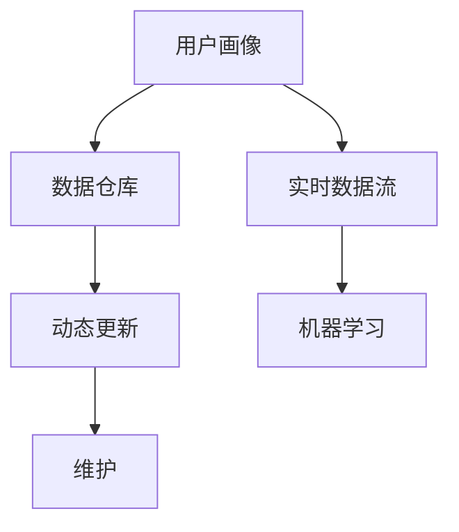

                 

# 用户画像的动态更新与维护

## 1. 背景介绍

随着互联网技术的发展和电子商务的崛起，用户画像（User Profile）在用户管理和精准营销中扮演了越来越重要的角色。用户画像是由一系列关键属性构成的用户描述，可以帮助企业更准确地理解用户需求和行为，从而提供更个性化和高效的服务。然而，由于用户需求和行为是动态变化的，静态的用户画像无法及时反映最新的用户状态，导致了用户服务质量下降和资源浪费。因此，如何实现用户画像的动态更新与维护，成为了提升用户体验和优化运营效率的关键问题。

## 2. 核心概念与联系

### 2.1 核心概念概述

- **用户画像（User Profile）**：由一系列关键属性描述的用户特征，如年龄、性别、地域、兴趣、购买历史等。用户画像可以用于个性化推荐、用户分群、行为预测等应用场景。
- **动态更新（Dynamic Update）**：指在用户行为数据发生变化时，实时地对用户画像进行更新，反映用户最新的需求和行为。
- **维护（Maintenance）**：指对用户画像的定期审视和优化，确保其准确性和时效性。
- **数据仓库（Data Warehouse）**：用于存储和处理大规模用户数据的集中式数据库系统，是用户画像动态更新的基础。
- **实时数据流（Real-time Data Streaming）**：指通过实时数据管道，将用户行为数据源源不断地输入到数据仓库，为动态更新提供支撑。
- **机器学习（Machine Learning）**：用于对用户行为数据进行分析和建模，自动生成和更新用户画像。

这些核心概念之间的关系可以通过以下Mermaid流程图来展示：



这个流程图展示了用户画像的动态更新与维护流程：用户行为数据通过实时数据流不断流入数据仓库，然后由机器学习模型进行分析和建模，生成并更新用户画像。最后，维护机制对画像进行定期审视和优化，确保其准确性和时效性。

## 3. 核心算法原理 & 具体操作步骤

### 3.1 算法原理概述

用户画像的动态更新与维护基于以下几个核心算法原理：

- **事件流处理（Event Stream Processing）**：对用户行为数据进行实时流处理，提取有价值的事件特征。
- **增量更新（Incremental Update）**：对用户画像进行增量式更新，减少对计算资源的消耗。
- **聚类算法（Clustering Algorithm）**：对用户行为数据进行聚类分析，形成更精准的用户分群。
- **预测模型（Predictive Model）**：利用历史用户行为数据进行建模，预测用户未来的行为和需求。

### 3.2 算法步骤详解

用户画像的动态更新与维护主要分为以下几个步骤：

**Step 1: 数据采集与存储**
- 收集用户在各个平台上的行为数据，如网站访问、购物记录、社交互动等。
- 将收集到的数据存储到数据仓库中，如Amazon Redshift、Google BigQuery等。

**Step 2: 事件流处理**
- 将用户行为数据转换为实时数据流，使用Apache Kafka、Apache Flink等流处理引擎进行实时处理。
- 对实时数据流进行去重、清洗、格式转换等预处理操作。

**Step 3: 用户画像生成**
- 使用机器学习算法，如K近邻算法、协同过滤等，对用户行为数据进行分析和建模，生成初步的用户画像。
- 对初步生成的用户画像进行增量更新，只更新发生变化的部分。

**Step 4: 用户分群与分析**
- 使用聚类算法对用户进行分群，形成更细粒度的用户画像。
- 对每个用户群体进行分析，了解其行为特征和需求。

**Step 5: 画像维护与优化**
- 定期审视和优化用户画像，删除过时或错误的信息，加入最新的行为数据。
- 使用预测模型对未来用户行为进行预测，并及时更新用户画像。

**Step 6: 画像应用与反馈**
- 将动态更新的用户画像应用到个性化推荐、用户分群、行为预测等场景中。
- 收集用户的反馈信息，优化用户画像的生成和维护算法。

### 3.3 算法优缺点

用户画像的动态更新与维护方法具有以下优点：
1. 实时更新：能够快速反映用户需求和行为的变化，提高用户服务质量。
2. 数据驱动：基于机器学习和数据分析技术，生成更精准的用户画像。
3. 自动化维护：通过自动化算法和流程，减少人工干预，提高效率。
4. 泛用性强：适用于各种类型的用户画像应用场景，如个性化推荐、行为预测等。

同时，该方法也存在一些局限性：
1. 数据质量要求高：用户行为数据的质量和完整性直接影响画像的准确性。
2. 实时处理复杂：实时流处理和增量更新的技术要求较高，需要大量的计算资源。
3. 模型复杂：机器学习模型和预测算法的选择和调参复杂，需要专业知识。
4. 隐私保护：用户行为数据的隐私保护是一个重要的问题，需要采取数据脱敏和匿名化等措施。

### 3.4 算法应用领域

用户画像的动态更新与维护技术可以广泛应用于以下几个领域：

- **个性化推荐系统**：基于用户画像生成个性化推荐，提升用户满意度。
- **用户行为分析**：分析用户行为特征，识别用户需求和趋势。
- **市场营销**：通过用户画像进行精准营销，提高广告和活动的转化率。
- **风险控制**：利用用户画像进行用户风险评估，减少欺诈和不良行为。
- **客户服务**：根据用户画像提供个性化的客户服务，提升用户体验。

## 4. 数学模型和公式 & 详细讲解 & 举例说明

### 4.1 数学模型构建

用户画像的动态更新与维护可以构建以下数学模型：

设用户画像为 $P$，包含 $n$ 个属性 $x_1, x_2, ..., x_n$，其中 $x_i \in \mathbb{R}^d$，$d$ 为属性维度。设用户行为数据为 $D$，包含 $m$ 个样本 $(x_i, y_i)$，其中 $x_i \in \mathbb{R}^d$ 为用户行为特征，$y_i \in \mathbb{R}^k$ 为行为标签。

用户画像的生成过程可以表示为：

$$
P = \mathcal{F}(D)
$$

其中 $\mathcal{F}$ 为生成函数，可以是聚类算法、机器学习算法等。

### 4.2 公式推导过程

以K-means聚类算法为例，推导用户画像的生成公式：

设用户行为数据 $D$ 中的用户数量为 $N$，用户画像 $P$ 中的用户数量为 $K$，每个用户画像的特征维度为 $d$，每个用户画像的聚类中心为 $\mu_k$，其中 $k=1,2,...,K$。

设用户画像 $P$ 中的第 $k$ 个聚类中心为 $\mu_k$，则用户画像的生成公式为：

$$
P = \{\mu_1, \mu_2, ..., \mu_K\}
$$

其中 $\mu_k$ 的计算公式为：

$$
\mu_k = \frac{1}{|C_k|} \sum_{i \in C_k} x_i
$$

其中 $C_k$ 为第 $k$ 个聚类，包含 $|C_k|$ 个用户，$x_i$ 为第 $i$ 个用户的特征向量。

### 4.3 案例分析与讲解

假设一个电商平台的用户画像包含以下属性：
- 年龄：$[18, 65]$ 岁
- 性别：男女
- 地域：省市
- 购物历史：$[0, 1000]$ 元

通过对用户行为数据进行聚类分析，生成如下用户画像：

- 18-25岁、男性、一线城市的用户画像
- 26-35岁、女性、二线城市用户的画像
- 36-65岁、男性、三线城市用户的画像

这些用户画像可以帮助电商平台进行个性化推荐、精准营销和用户行为分析，提升用户体验和运营效率。

## 5. 项目实践：代码实例和详细解释说明

### 5.1 开发环境搭建

要进行用户画像的动态更新与维护，首先需要搭建相应的开发环境。以下是使用Python进行K-means聚类分析的开发环境配置流程：

1. 安装Anaconda：从官网下载并安装Anaconda，用于创建独立的Python环境。

2. 创建并激活虚拟环境：
```bash
conda create -n user_profile python=3.8 
conda activate user_profile
```

3. 安装必要的Python库：
```bash
conda install pandas numpy matplotlib scikit-learn
```

4. 安装Apache Kafka、Apache Flink等流处理引擎：
```bash
conda install apache-kafka
conda install apache-flink
```

完成上述步骤后，即可在`user_profile`环境中开始项目开发。

### 5.2 源代码详细实现

以下是一个使用K-means算法生成用户画像的Python代码实现：

```python
import pandas as pd
from sklearn.cluster import KMeans
import numpy as np

# 读取用户行为数据
df = pd.read_csv('user_behavior.csv')

# 定义特征列
features = ['age', 'gender', 'location', 'purchase_amount']

# 数据预处理
X = df[features].values

# 聚类分析
kmeans = KMeans(n_clusters=3, random_state=0)
kmeans.fit(X)

# 生成用户画像
labels = kmeans.labels_
clusters = []
for i in range(3):
    cluster = np.mean(X[labels == i, :], axis=0)
    clusters.append(cluster)

# 输出用户画像
for i, cluster in enumerate(clusters):
    print(f'Cluster {i+1}: {cluster}')
```

### 5.3 代码解读与分析

让我们再详细解读一下关键代码的实现细节：

**读取数据**：
```python
df = pd.read_csv('user_behavior.csv')
```

**特征选择**：
```python
features = ['age', 'gender', 'location', 'purchase_amount']
```

**数据预处理**：
```python
X = df[features].values
```

**聚类分析**：
```python
kmeans = KMeans(n_clusters=3, random_state=0)
kmeans.fit(X)
```

**生成用户画像**：
```python
labels = kmeans.labels_
clusters = []
for i in range(3):
    cluster = np.mean(X[labels == i, :], axis=0)
    clusters.append(cluster)
```

**输出用户画像**：
```python
for i, cluster in enumerate(clusters):
    print(f'Cluster {i+1}: {cluster}')
```

可以看到，这段代码实现了K-means聚类算法对用户画像的生成。从数据读取、特征选择、数据预处理、聚类分析到用户画像的输出，每一步都有详细的解释和分析，便于开发者理解和应用。

## 6. 实际应用场景

### 6.1 个性化推荐系统

用户画像的动态更新与维护可以广泛应用于个性化推荐系统中。通过实时更新用户画像，推荐系统能够准确把握用户当前的需求和偏好，提供个性化的商品推荐，提升用户满意度和购买转化率。

在技术实现上，可以将用户的行为数据流实时输入数据仓库，使用K-means聚类算法生成用户画像。然后，根据用户画像生成推荐列表，并通过实时流处理引擎推送到用户端，实现动态推荐。

### 6.2 用户行为分析

用户画像的动态更新与维护可以用于分析用户行为特征，识别用户需求和趋势，从而优化产品和服务设计，提高用户体验和运营效率。

在具体应用中，可以将用户行为数据流实时输入数据仓库，使用K-means聚类算法生成用户画像。然后，对每个用户画像进行行为分析，了解其购买历史、兴趣偏好等信息，形成用户分群。最后，根据用户分群进行针对性的优化和改进，提升产品和服务质量。

### 6.3 市场营销

用户画像的动态更新与维护可以用于精准营销，提高广告和活动的转化率。通过实时更新用户画像，营销系统能够精准定位目标用户，设计更具吸引力的广告和活动，提升用户参与度和购买转化率。

在具体应用中，可以将用户行为数据流实时输入数据仓库，使用K-means聚类算法生成用户画像。然后，根据用户画像进行精准营销，设计个性化的广告和活动，提升用户参与度和转化率。

### 6.4 风险控制

用户画像的动态更新与维护可以用于风险控制，减少欺诈和不良行为。通过实时更新用户画像，风险控制系统能够及时识别高风险用户，采取相应的防范措施，减少损失和风险。

在具体应用中，可以将用户行为数据流实时输入数据仓库，使用K-means聚类算法生成用户画像。然后，根据用户画像进行风险评估，识别高风险用户，采取相应的防范措施，减少欺诈和不良行为。

## 7. 工具和资源推荐

### 7.1 学习资源推荐

为了帮助开发者系统掌握用户画像的动态更新与维护技术，这里推荐一些优质的学习资源：

1. 《机器学习实战》：一本深入浅出、易于理解的机器学习入门书籍，介绍了K-means聚类等核心算法。

2. 《大数据时代》：一本关于大数据和数据科学的重要著作，介绍了数据采集、处理和分析的实践经验。

3. 《Python数据科学手册》：一本全面介绍Python数据科学库的书籍，包括Pandas、NumPy、Scikit-learn等库的使用方法和最佳实践。

4. K-means算法维基百科页面：提供了K-means算法的详细介绍和实现示例。

5. Apache Kafka和Apache Flink官方文档：提供了流处理引擎的详细配置和使用指南。

通过对这些资源的学习实践，相信你一定能够快速掌握用户画像的动态更新与维护技术，并用于解决实际的业务问题。

### 7.2 开发工具推荐

高效的开发离不开优秀的工具支持。以下是几款用于用户画像动态更新与维护开发的常用工具：

1. Python：一种高效易用的编程语言，是数据科学和机器学习的标准工具。

2. Pandas：一个强大的数据处理库，提供了数据清洗、转换和分析的工具。

3. NumPy：一个强大的数学计算库，提供了高效的多维数组和线性代数运算。

4. Scikit-learn：一个机器学习库，提供了多种聚类算法和模型评估工具。

5. Apache Kafka：一个高性能的分布式流处理平台，支持实时的数据流处理和流式消息传输。

6. Apache Flink：一个分布式流处理框架，支持高效的数据流处理和状态管理。

7. Jupyter Notebook：一个交互式的数据科学环境，支持Python代码的实时调试和可视化。

合理利用这些工具，可以显著提升用户画像的动态更新与维护任务的开发效率，加快创新迭代的步伐。

### 7.3 相关论文推荐

用户画像的动态更新与维护技术源于学界的持续研究。以下是几篇奠基性的相关论文，推荐阅读：

1. K-means算法：由Mac Queen提出，是聚类分析的经典算法，广泛应用于数据挖掘和模式识别领域。

2. 大数据用户画像研究：研究了用户画像在大数据环境下的应用，提出了多种用户画像生成和分析方法。

3. 基于用户画像的个性化推荐：研究了用户画像在个性化推荐系统中的应用，提出了多种推荐算法和优化策略。

4. 用户画像的动态生成与维护：研究了用户画像的动态生成和维护方法，提出了多种实时数据处理和聚类分析方法。

5. 用户画像的隐私保护：研究了用户画像的隐私保护问题，提出了多种数据脱敏和匿名化方法。

这些论文代表了大规模用户画像动态更新的研究脉络。通过学习这些前沿成果，可以帮助研究者把握学科前进方向，激发更多的创新灵感。

## 8. 总结：未来发展趋势与挑战

### 8.1 总结

本文对用户画像的动态更新与维护方法进行了全面系统的介绍。首先阐述了用户画像在用户管理和精准营销中的重要性，明确了动态更新与维护在提升用户体验和优化运营效率方面的价值。其次，从原理到实践，详细讲解了用户画像的动态更新与维护过程，包括数据采集、流处理、聚类分析、画像生成等关键步骤，提供了完整的代码实例和详细解释。同时，本文还广泛探讨了动态更新与维护方法在个性化推荐、用户行为分析、市场营销、风险控制等多个行业领域的应用前景，展示了其巨大的应用潜力。此外，本文精选了动态更新与维护技术的各类学习资源，力求为读者提供全方位的技术指引。

通过本文的系统梳理，可以看到，用户画像的动态更新与维护技术正在成为用户管理领域的重要范式，极大地提升了用户服务的实时性和个性化水平，为电商、营销、金融等行业带来了新的发展机遇。未来，伴随数据技术的发展和应用场景的拓展，动态更新与维护方法必将在更多领域得到应用，为各行各业带来变革性影响。

### 8.2 未来发展趋势

展望未来，用户画像的动态更新与维护技术将呈现以下几个发展趋势：

1. **数据融合与集成**：未来用户画像将不仅基于行为数据，还会融合语音、视频、图像等多种数据源，形成更为全面的用户画像。

2. **深度学习的应用**：深度学习技术将在大规模用户画像生成中发挥重要作用，提高聚类和分群的准确性和精细度。

3. **实时流处理**：实时流处理技术将广泛应用于用户画像的动态更新，提供更及时、更准确的画像服务。

4. **多模态分析**：多模态分析技术将结合文本、图像、语音等多种数据类型，提升用户画像的全面性和准确性。

5. **智能优化**：智能优化算法将在用户画像生成和维护中发挥更大作用，实现更高效的资源利用和动态更新。

6. **隐私保护**：用户画像的隐私保护将受到更多重视，采取数据脱敏和匿名化等措施，确保用户隐私安全。

这些趋势凸显了用户画像动态更新与维护技术的广阔前景。这些方向的探索发展，必将进一步提升用户画像的实时性和个性化水平，为电商、营销、金融等行业带来新的发展机遇。

### 8.3 面临的挑战

尽管用户画像的动态更新与维护技术已经取得了一定进展，但在迈向更加智能化、普适化应用的过程中，它仍面临着诸多挑战：

1. **数据质量要求高**：用户行为数据的质量和完整性直接影响画像的准确性，如何获取高质量、实时性的数据是一个重要挑战。

2. **实时处理复杂**：实时流处理和增量更新的技术要求较高，需要大量的计算资源和稳定的网络环境。

3. **模型复杂**：机器学习模型和聚类算法的选择和调参复杂，需要专业知识和技术支持。

4. **隐私保护**：用户行为数据的隐私保护是一个重要问题，需要采取数据脱敏和匿名化等措施。

5. **资源优化**：大规模用户画像的生成和维护需要大量计算资源，如何优化资源配置，提高处理效率是一个挑战。

6. **安全与稳定**：用户画像系统需要保证高可用性和数据安全，如何构建可靠的流处理和数据存储系统是一个重要问题。

正视这些挑战，积极应对并寻求突破，将是用户画像动态更新与维护技术走向成熟的关键。

### 8.4 研究展望

未来，用户画像的动态更新与维护技术需要在以下几个方面寻求新的突破：

1. **数据融合与集成**：探索多种数据源的融合与集成方法，提升用户画像的全面性和准确性。

2. **深度学习的应用**：利用深度学习技术，提高用户画像的生成和分群的精度和效率。

3. **实时流处理**：研究实时流处理技术，提高用户画像的动态更新速度和实时性。

4. **多模态分析**：结合多模态数据，提高用户画像的全面性和准确性。

5. **智能优化**：研究智能优化算法，实现更高效的资源利用和动态更新。

6. **隐私保护**：探索隐私保护技术，确保用户数据的安全和隐私。

7. **安全与稳定**：研究数据安全技术，构建可靠的流处理和数据存储系统。

这些研究方向的探索，必将引领用户画像动态更新与维护技术迈向更高的台阶，为电商、营销、金融等行业带来新的发展机遇。只有勇于创新、敢于突破，才能不断拓展用户画像的边界，为各行各业带来变革性影响。

## 9. 附录：常见问题与解答

**Q1：用户画像的动态更新与维护是否适用于所有业务场景？**

A: 用户画像的动态更新与维护技术适用于需要实时更新的业务场景，如电商、营销、金融等行业。但对于一些静态数据为主的业务，如图书管理、旅游推荐等，并不需要频繁更新用户画像，因此动态更新与维护的价值较小。

**Q2：如何选择合适的聚类算法？**

A: 选择合适的聚类算法需要考虑业务需求和数据特征。对于小规模数据集，可以选择K-means、K-medoids等简单的算法。对于大规模数据集，可以选择DBSCAN、层次聚类等复杂的算法。此外，还需要根据业务场景选择合适的聚类数目和距离度量方法。

**Q3：用户画像的动态更新与维护如何与业务系统集成？**

A: 用户画像的动态更新与维护系统需要与业务系统进行集成，可以通过API接口、数据管道等方式实现数据的实时传输和更新。具体实现方式需要根据业务系统的情况进行定制。

**Q4：用户画像的动态更新与维护对数据质量有哪些要求？**

A: 用户画像的动态更新与维护对数据质量要求较高，需要保证数据的实时性、准确性和完整性。数据来源需要可靠、数据格式需要标准化、数据处理需要规范，才能保证画像的准确性和时效性。

**Q5：用户画像的隐私保护有哪些措施？**

A: 用户画像的隐私保护可以通过以下措施实现：
1. 数据脱敏：对敏感信息进行屏蔽或加密处理，保护用户隐私。
2. 匿名化：对用户数据进行匿名化处理，确保数据无法追溯到个人。
3. 访问控制：对数据访问进行严格的权限控制，防止非法访问和泄露。
4. 数据加密：对数据进行加密处理，确保数据在传输和存储过程中的安全。

这些措施可以有效保护用户隐私，确保用户数据的安全和合规。

---

作者：禅与计算机程序设计艺术 / Zen and the Art of Computer Programming

