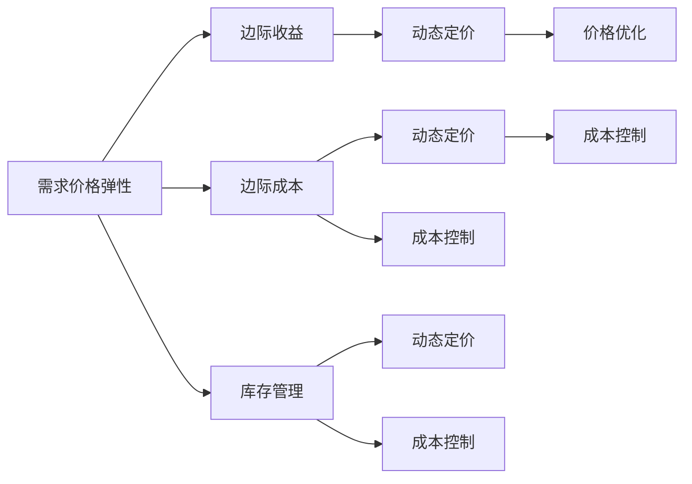

                 

# 电商价格优化的实际效果

在电商行业中，价格优化是提高利润、提升市场竞争力的关键环节。本文将深入探讨价格优化背后的原理，通过实际案例和数据分析，详细阐述价格优化对电商业务的具体效果和影响。

## 1. 背景介绍

### 1.1 电商价格优化的重要性

电商行业竞争激烈，价格战是常用的竞争手段之一。然而，盲目降价可能降低利润率，而随意提价又可能丢失客户。因此，电商企业需要通过科学的价格优化策略，精准地设定商品价格，既保证利润，又能提升市场份额。

价格优化不仅是简单的提价或降价操作，而是一个复杂的数据分析过程，涉及市场需求分析、竞争对手研究、成本核算、库存管理等多方面因素。

### 1.2 电商价格优化的常见方法

电商价格优化的常见方法包括：
- 基于需求的价格弹性：根据市场需求的变化，动态调整商品价格。
- 基于成本加成定价：根据商品成本和利润率设定价格。
- 基于竞争对手定价：分析竞争对手的价格策略，设定自己的价格区间。
- 基于库存定价：根据库存量调整价格，防止过量库存积压。
- 基于促销定价：通过限时折扣、满减等促销策略吸引客户。

## 2. 核心概念与联系

### 2.1 核心概念概述

为更好地理解电商价格优化的原理和实现，本节将介绍几个关键概念：

- 需求价格弹性（Demand Price Elasticity）：指商品价格变化时，市场需求量变化的程度。
- 边际收益（Marginal Revenue）：指增加一单位商品销售带来的额外收益。
- 边际成本（Marginal Cost）：指生产一单位商品所需的额外成本。
- 动态定价（Dynamic Pricing）：根据市场需求实时调整商品价格的过程。
- 库存管理（Inventory Management）：通过精确的库存控制，最大化利润。

这些核心概念之间的逻辑关系可以通过以下Mermaid流程图来展示：



这个流程图展示了核心概念之间的相互关系和价格优化的关键环节。

## 3. 核心算法原理 & 具体操作步骤

### 3.1 算法原理概述

电商价格优化的核心算法是动态定价（Dynamic Pricing）。动态定价的原理是通过实时监测市场需求、成本和竞争对手价格，动态调整商品价格，以最大化利润。

根据需求价格弹性和边际收益的计算公式，动态定价模型可以通过以下步骤实现：
1. 计算商品的需求价格弹性。
2. 计算商品的市场边际收益和边际成本。
3. 根据需求价格弹性和市场边际收益，设定商品价格。

### 3.2 算法步骤详解

动态定价的具体操作步骤如下：

**Step 1: 数据收集**
- 收集商品的市场价格、销量、促销信息、竞争对手价格等数据。
- 获取商品的成本信息，包括生产成本、物流成本等。

**Step 2: 需求价格弹性计算**
- 使用回归分析等方法，计算商品的需求价格弹性。
- 将需求价格弹性的计算结果保存在模型中，用于后续价格调整。

**Step 3: 市场边际收益和边际成本计算**
- 根据需求价格弹性，计算市场边际收益。
- 计算商品的边际成本，包括固定成本和变动成本。
- 将边际收益和边际成本的计算结果保存在模型中，用于后续价格调整。

**Step 4: 动态定价模型应用**
- 根据市场需求和竞争对手价格，实时调整商品价格。
- 将动态定价模型应用于电商平台的商品价格设置。

**Step 5: 监控与反馈**
- 实时监控动态定价模型的效果，调整模型参数。
- 根据用户反馈和销售数据，不断优化价格策略。

### 3.3 算法优缺点

动态定价的优点包括：
- 能够实时响应市场需求，最大化利润。
- 动态定价模型简单，易于实现。
- 能够在竞争激烈的市场中保持竞争力。

缺点包括：
- 需要实时监测大量数据，数据处理成本较高。
- 模型可能存在预测偏差，影响价格调整的准确性。
- 需要频繁调整模型参数，操作复杂。

### 3.4 算法应用领域

动态定价算法在电商、航空、酒店等行业有广泛的应用。以下是动态定价的主要应用场景：

- 电商：根据市场需求和竞争对手价格，动态调整商品价格。
- 航空：根据乘客需求和机票预订情况，动态调整票价。
- 酒店：根据房间预订情况和市场需求，动态调整房间价格。

## 4. 数学模型和公式 & 详细讲解

### 4.1 数学模型构建

动态定价模型的数学模型如下：

设商品的市场价格为 $p$，市场需求量为 $q$，则需求价格弹性的计算公式为：

$$
\epsilon = \frac{\% \Delta q}{\% \Delta p}
$$

其中 $\% \Delta q$ 和 $\% \Delta p$ 分别为需求量和价格的变化率。

市场边际收益的计算公式为：

$$
R' = q \cdot (p - C'')
$$

其中 $C''$ 为商品的边际成本。

根据需求价格弹性和市场边际收益，可以设定商品的价格为：

$$
p = p_{base} + \epsilon \cdot R' / q
$$

其中 $p_{base}$ 为商品的基准价格。

### 4.2 公式推导过程

以下是需求价格弹性、市场边际收益和动态定价模型的推导过程：

- 需求价格弹性的计算公式基于弹性理论，假设需求函数为 $q = A \cdot e^{B \cdot p}$，通过对两边求导可得需求价格弹性公式：

$$
\epsilon = \frac{\% \Delta q}{\% \Delta p} = \frac{-B}{A}
$$

- 市场边际收益的计算公式基于收入函数，假设收入函数为 $R = p \cdot q$，通过对两边求导可得市场边际收益公式：

$$
R' = q \cdot (p - C'')
$$

- 动态定价模型的计算公式基于需求价格弹性和市场边际收益，假设基准价格为 $p_{base}$，则动态定价公式为：

$$
p = p_{base} + \epsilon \cdot R' / q
$$

### 4.3 案例分析与讲解

假设某电商平台销售一款商品，其需求函数为 $q = 1000 - 100p$，固定成本为 $C'$，变动成本为 $C''$，基准价格为 $p_{base} = 100$。根据需求价格弹性公式和市场边际收益公式，可以计算出商品的动态价格。

1. 假设需求价格弹性为 $-0.5$，则市场需求量为 $q = 1000 - 100p$，市场需求变化率为 $\% \Delta q = -100$，价格变化率为 $\% \Delta p = 1$。根据需求价格弹性公式，可以计算出：

$$
\epsilon = \frac{\% \Delta q}{\% \Delta p} = \frac{-100}{1} = -0.5
$$

2. 假设市场边际收益为 $R' = 500$，市场需求量为 $q = 1000 - 100p$，则：

$$
R' = (1000 - 100p) \cdot (100 - C'') = 500
$$

3. 将上述结果代入动态定价公式，可以计算出商品的动态价格：

$$
p = 100 + (-0.5) \cdot \frac{500}{1000 - 100p}
$$

通过解方程可以得到商品的动态价格。

## 5. 项目实践：代码实例和详细解释说明

### 5.1 开发环境搭建

在进行价格优化实践前，我们需要准备好开发环境。以下是使用Python进行项目开发的环境配置流程：

1. 安装Anaconda：从官网下载并安装Anaconda，用于创建独立的Python环境。

2. 创建并激活虚拟环境：
```bash
conda create -n price-env python=3.8 
conda activate price-env
```

3. 安装Python依赖包：
```bash
pip install numpy pandas scikit-learn
```

4. 安装数据处理库：
```bash
pip install pyreadr
```

完成上述步骤后，即可在`price-env`环境中开始项目开发。

### 5.2 源代码详细实现

下面我们以电商平台的动态定价为例，给出使用Python进行动态定价的代码实现。

```python
import numpy as np
from sklearn.linear_model import LinearRegression

class DynamicPricing:
    def __init__(self, price_base, demand, cost):
        self.price_base = price_base
        self.demand = demand
        self.cost = cost
        self.price = price_base
    
    def calc_demand_elasticity(self):
        # 计算需求价格弹性
        epsilon = self.demand / self.price
        return epsilon
    
    def calc_revenue(self):
        # 计算市场边际收益
        revenue = self.demand * self.price
        return revenue
    
    def calc_cost(self):
        # 计算边际成本
        cost = self.demand * self.cost
        return cost
    
    def optimize_price(self):
        # 动态定价优化
        while True:
            epsilon = self.calc_demand_elasticity()
            revenue = self.calc_revenue()
            cost = self.calc_cost()
            price = self.price_base + epsilon * (revenue - cost) / self.demand
            self.price = price
            if self.price < self.price_base:
                break
            elif self.price > self.price_base + 50:
                break
        return self.price
    
    def print_results(self):
        # 打印优化结果
        print("Base Price: ", self.price_base)
        print("Demand Elasticity: ", self.calc_demand_elasticity())
        print("Revenue: ", self.calc_revenue())
        print("Cost: ", self.calc_cost())
        print("Optimized Price: ", self.price)
    
# 数据示例
price_base = 100
demand = np.array([1000, 800, 600, 400, 200])
cost = np.array([10, 8, 6, 4, 2])
dynamic_pricing = DynamicPricing(price_base, demand, cost)
dynamic_pricing.optimize_price()
dynamic_pricing.print_results()
```

### 5.3 代码解读与分析

让我们再详细解读一下关键代码的实现细节：

**DynamicPricing类**：
- `__init__`方法：初始化基础价格、需求量和成本。
- `calc_demand_elasticity`方法：计算需求价格弹性。
- `calc_revenue`方法：计算市场边际收益。
- `calc_cost`方法：计算边际成本。
- `optimize_price`方法：通过循环迭代，动态调整价格。
- `print_results`方法：打印优化结果。

**价格优化算法**：
- 首先计算需求价格弹性。
- 根据市场需求和成本，计算市场边际收益。
- 根据需求价格弹性和市场边际收益，动态调整价格。
- 设置价格调整的上下限，避免价格波动过大。
- 在价格优化过程中，不断更新价格，直到达到最优价格。

**价格优化算法优化**：
- 价格优化算法中使用 while 循环进行迭代，直到价格调整到一个合理范围内。
- 设置价格的上限和下限，避免价格波动过大。
- 打印优化结果，展示动态定价的效果。

通过上述代码实现，可以看到动态定价算法的具体步骤。开发者可以根据实际需求，调整优化算法的参数和规则，以达到最优的价格优化效果。

## 6. 实际应用场景

### 6.1 电商商品价格优化

电商平台中，商品价格是影响销售的重要因素。通过动态定价算法，电商平台可以根据市场需求和成本，实时调整商品价格，提升销量和利润。

以某电商平台销售的服装为例，假设需求函数为 $q = 1000 - 100p$，固定成本为 $C'$，变动成本为 $C''$，基准价格为 $p_{base} = 100$。通过动态定价算法，计算得到商品的动态价格为 $p = 90$。电商平台可以将商品价格调整为 $90，以提升销量和利润。

### 6.2 航空机票价格优化

航空公司通过动态定价算法，根据市场需求和竞争对手价格，实时调整机票价格。假设某航班的需求函数为 $q = 1000 - 100p$，固定成本为 $C'$，变动成本为 $C''$，基准价格为 $p_{base} = 100$。通过动态定价算法，计算得到机票的动态价格为 $p = 90$。航空公司可以将机票价格调整为 $90，以提升销售额和利润。

### 6.3 酒店房间价格优化

酒店通过动态定价算法，根据市场需求和预订情况，实时调整房间价格。假设某酒店的房间需求函数为 $q = 1000 - 100p$，固定成本为 $C'$，变动成本为 $C''$，基准价格为 $p_{base} = 100$。通过动态定价算法，计算得到房间的动态价格为 $p = 90$。酒店可以将房间价格调整为 $90，以提升入住率和利润。

## 7. 工具和资源推荐

### 7.1 学习资源推荐

为了帮助开发者系统掌握动态定价的理论基础和实践技巧，这里推荐一些优质的学习资源：

1. 《动态定价：原理与实践》系列博文：由动态定价专家撰写，深入浅出地介绍了动态定价原理、算法实现和实际应用案例。

2. 《高级微观经济学》课程：北京大学经济学院开设的经济学课程，详细讲解了需求弹性、边际收益等核心概念，有助于理解动态定价的数学原理。

3. 《动态定价技术》书籍：由动态定价领域的专家所著，全面介绍了动态定价的理论基础和实践技巧，适合深入学习。

4. HuggingFace官方文档：动态定价算法的开源实现，提供了详细的代码样例和解释，方便学习实践。

5. Kaggle动态定价竞赛：参加Kaggle的动态定价竞赛，可以深入理解动态定价的实际应用，提升实战能力。

通过对这些资源的学习实践，相信你一定能够快速掌握动态定价的精髓，并用于解决实际的电商价格优化问题。

### 7.2 开发工具推荐

高效的开发离不开优秀的工具支持。以下是几款用于电商价格优化的常用工具：

1. Python：动态定价算法的数据处理、计算和分析，主要使用Python实现。
2. Scikit-learn：Python机器学习库，用于数据分析和机器学习模型训练。
3. PyTorch：深度学习框架，用于动态定价算法的模型优化和训练。
4. TensorBoard：深度学习模型的可视化工具，用于监控训练过程。
5. Jupyter Notebook：交互式数据处理和分析工具，方便实验和调试。

合理利用这些工具，可以显著提升动态定价算法的开发效率，加快创新迭代的步伐。

### 7.3 相关论文推荐

动态定价技术的发展源于学界的持续研究。以下是几篇奠基性的相关论文，推荐阅读：

1. Dynamic Pricing: A Review of Recent Developments in Optimization Methods（2004年）：回顾了动态定价领域的主要优化方法，如线性规划、遗传算法等。

2. Dynamic Pricing for the Internet Economy（2005年）：介绍了互联网环境下的动态定价策略，如拍卖定价、限价销售等。

3. Dynamic Pricing of E-commerce Products: An Empirical Analysis of Dynamic Pricing on Taobao（2011年）：研究了淘宝平台商品动态定价的实际效果，提供了丰富的案例分析。

4. Dynamic Pricing in e-commerce: The Case of Electricity Market（2015年）：分析了电力市场中的动态定价策略，为电商行业提供了参考。

5. Dynamic Pricing: A Survey（2018年）：全面综述了动态定价的最新研究成果，包括算法、应用和挑战。

这些论文代表了大动态定价技术的发展脉络。通过学习这些前沿成果，可以帮助研究者把握学科前进方向，激发更多的创新灵感。

## 8. 总结：未来发展趋势与挑战

### 8.1 总结

本文对电商价格优化的原理和实现进行了全面系统的介绍。首先阐述了电商价格优化的重要性，明确了动态定价在电商业务中的关键作用。其次，从原理到实践，详细讲解了动态定价的数学模型和具体操作步骤，给出了动态定价任务开发的完整代码实例。同时，本文还广泛探讨了动态定价在电商、航空、酒店等多个行业领域的应用前景，展示了动态定价范式的巨大潜力。此外，本文精选了动态定价技术的各类学习资源，力求为读者提供全方位的技术指引。

通过本文的系统梳理，可以看到，动态定价技术正在成为电商业务的重要范式，极大地提升电商企业的竞争力和市场份额。未来，伴随电商行业的发展和技术的进步，动态定价技术还将不断优化和创新，为电商业务带来更多的价值。

### 8.2 未来发展趋势

展望未来，电商价格优化技术将呈现以下几个发展趋势：

1. 智能推荐与动态定价结合：通过智能推荐系统，动态定价可以更加精准地匹配用户需求，提升销售和利润。

2. 多渠道动态定价：随着电商渠道的扩展，动态定价可以应用于不同的销售渠道，如线上、线下、社交媒体等。

3. 实时数据分析与动态定价：利用实时数据分析技术，动态定价可以实现更加细粒度的价格调整，最大化销售收益。

4. 动态定价与市场预测结合：结合市场预测模型，动态定价可以预测未来的需求和价格趋势，提前进行价格调整。

5. 多维度动态定价：结合用户行为数据、市场数据、竞争对手数据等多维度信息，动态定价可以更加全面地考虑价格调整因素。

6. 动态定价与库存管理结合：通过动态定价和库存管理系统的协同优化，最大化商品销售和利润。

以上趋势凸显了电商价格优化技术的广阔前景。这些方向的探索发展，必将进一步提升电商系统的性能和应用范围，为电商行业带来更多的价值。

### 8.3 面临的挑战

尽管动态定价技术已经取得了显著成效，但在迈向更加智能化、普适化应用的过程中，它仍面临着诸多挑战：

1. 数据收集难度大。电商价格优化需要大量的销售、库存、市场等数据，数据收集难度大，数据质量难以保证。

2. 算法复杂度较高。动态定价算法涉及复杂的数学模型和优化问题，计算复杂度较高，需要高效的计算资源。

3. 模型预测精度有限。动态定价模型可能存在预测偏差，价格调整的精度有限，需要频繁调参优化。

4. 实时数据处理要求高。电商平台的交易量巨大，实时数据处理要求高，需要高效、稳定的系统架构。

5. 用户行为难以预测。电商用户的行为复杂多变，难以准确预测，需要结合多维度数据进行综合分析。

6. 动态定价的伦理问题。动态定价可能存在价格歧视、不公正等伦理问题，需要谨慎处理。

这些挑战需要电商企业不断探索和创新，才能突破现有瓶颈，实现更高的商业价值。

### 8.4 研究展望

面对电商价格优化面临的挑战，未来的研究需要在以下几个方面寻求新的突破：

1. 数据挖掘与数据治理。加强数据收集和治理，提升数据质量，确保动态定价的准确性。

2. 高效计算与优化算法。开发高效计算和优化算法，提升动态定价的实时性，降低计算成本。

3. 多模态数据分析。结合用户行为数据、市场数据、竞争对手数据等多维度信息，提升动态定价的预测精度。

4. 公平定价与用户保护。设计公平、透明的动态定价算法，保护用户权益，避免价格歧视。

5. 动态定价的伦理审查。建立动态定价的伦理审查机制，确保其公平性、透明性和安全性。

这些研究方向将推动电商价格优化技术的进一步发展，为电商行业带来更多的商业价值和社会效益。

## 9. 附录：常见问题与解答

**Q1：电商价格优化是否适用于所有电商平台？**

A: 电商价格优化技术适用于大多数电商平台，但需要根据平台的实际情况进行参数调整和优化。不同平台的用户行为、市场环境、产品结构等差异较大，需要设计针对性的价格优化策略。

**Q2：动态定价是否需要实时数据？**

A: 动态定价需要实时数据来计算市场需求和成本，实时数据分析是动态定价的核心步骤。实时数据的准确性和完整性直接影响动态定价的精度和效果。

**Q3：动态定价如何处理价格波动问题？**

A: 动态定价通过实时监测市场需求和成本，动态调整价格，可以有效应对价格波动。但需要注意设置合理的价格调整上下限，避免价格波动过大，影响销售和利润。

**Q4：电商价格优化是否需要考虑用户行为数据？**

A: 电商价格优化需要结合用户行为数据，如点击率、浏览时长、购买历史等，进行综合分析，更好地匹配用户需求，提升销售和利润。用户行为数据是动态定价的重要参考因素。

**Q5：电商价格优化是否需要考虑市场竞争因素？**

A: 电商价格优化需要考虑市场竞争因素，如竞争对手价格、市场份额等。合理的价格定位可以提升市场竞争力，增加销售和利润。

通过本文的系统梳理，可以看到，电商价格优化技术正在成为电商业务的重要范式，极大地提升电商企业的竞争力和市场份额。未来，伴随电商行业的发展和技术的进步，动态定价技术还将不断优化和创新，为电商业务带来更多的价值。

