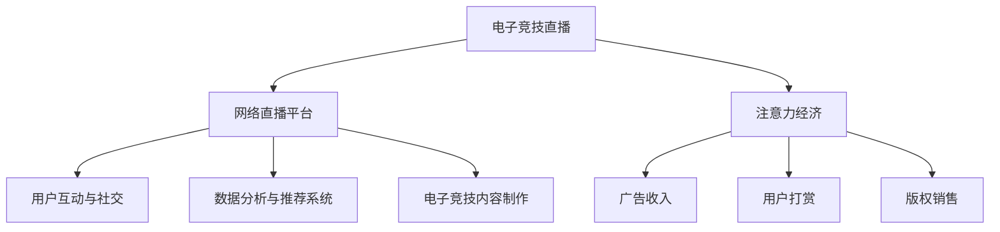

                 

# 电子竞技直播：注意力经济的典型案例

电子竞技直播（Esports Streaming）作为新兴的数字娱乐产业，正快速崛起，成为全球最热门的数字媒体之一。其独特的商业模式、庞大的受众群体以及丰富的经济活动，使其成为注意力经济（Attention Economy）的典型案例。本文将深入分析电子竞技直播的运营机制、技术架构以及发展趋势，并探讨其对未来数字经济的意义。

## 1. 背景介绍

### 1.1 电子竞技直播的兴起

电子竞技直播兴起于21世纪初，随着互联网技术的普及，电子竞技（Esports）这一新兴产业迅速发展。网络直播平台的兴起，使得电子竞技直播成为可能。

2008年，斗鱼、虎牙等早期电子竞技直播平台出现，标志着电子竞技直播行业的正式起步。2015年后，随着游戏竞技化程度的提升，电子竞技直播进入高速发展期，吸引了大量的资本和人才加入。

### 1.2 电子竞技直播的商业模式

电子竞技直播的商业模式主要包括广告收入、用户打赏、版权销售等。其中，用户打赏是电子竞技直播的主要收入来源。在直播平台，观众通过虚拟货币（如斗鱼币、虎牙币）打赏直播主播，以此支持内容创作和平台运营。

## 2. 核心概念与联系

### 2.1 核心概念概述

1. **电子竞技直播**：通过互联网直播平台，实时展示电子竞技比赛的过程。主播（一般为职业电竞选手或玩家）提供专业比赛解说、互动交流、观众点歌等多样化内容。

2. **注意力经济**：通过提供高关注度、高互动性的内容，吸引和保持用户注意力，并通过广告、打赏等形式变现。注意力经济在电子竞技直播中体现为高度集中的观众群体，高互动的社区氛围。

3. **网络直播平台**：提供直播服务，连接主播和观众。包括平台技术开发、内容审核、用户管理等环节。

4. **数据分析与推荐系统**：利用大数据技术，分析用户行为，提供个性化推荐，提升用户体验和留存率。

5. **电子竞技内容制作**：涵盖电竞赛事制作、直播节目编排、视频剪辑与特效制作等环节，提供高质量的内容产品。

6. **用户互动与社交**：通过弹幕、点赞、送礼物等互动方式，构建用户社区。

### 2.2 核心概念联系

通过下图的Mermaid流程图，我们展示了电子竞技直播中的核心概念及其联系：



- **电子竞技直播**：作为平台的主要业务，提供电子竞技赛事的实时展示和互动。
- **网络直播平台**：支撑直播服务，连接主播和观众，是电子竞技直播的基础设施。
- **注意力经济**：通过内容吸引观众注意力，并通过广告、打赏等形式变现。
- **用户互动与社交**：通过弹幕、点赞、送礼物等方式，增强用户粘性。
- **数据分析与推荐系统**：利用大数据技术，提升用户体验，增加用户留存率。
- **电子竞技内容制作**：确保高质量的内容产出，提升直播平台的竞争力。

## 3. 核心算法原理 & 具体操作步骤

### 3.1 算法原理概述

电子竞技直播的核心算法原理主要体现在以下几个方面：

1. **内容推荐算法**：利用协同过滤、内容过滤、用户行为分析等技术，推荐用户感兴趣的内容，提升用户体验。
2. **广告投放算法**：通过数据分析，识别用户兴趣点，实现精准广告投放，提升广告效益。
3. **用户打赏算法**：通过模型预测用户打赏行为，实现精准的付费激励策略，增加平台收入。
4. **用户互动算法**：通过实时弹幕、礼物互动等技术，提升用户粘性和参与度。

### 3.2 算法步骤详解

#### 3.2.1 内容推荐算法

1. **协同过滤**：通过分析用户行为数据，推荐相似用户感兴趣的内容。
2. **内容过滤**：基于内容相似性，推荐与当前内容相关的内容。
3. **混合推荐**：结合协同过滤和内容过滤，提升推荐效果。

#### 3.2.2 广告投放算法

1. **用户画像构建**：通过用户行为数据，构建用户画像。
2. **兴趣点识别**：识别用户兴趣点，包括游戏类型、主播风格等。
3. **精准投放**：通过算法，实现广告的精准投放，提升转化率。

#### 3.2.3 用户打赏算法

1. **行为预测**：通过历史数据，预测用户是否会打赏。
2. **激励模型**：根据预测结果，设计激励策略，提升用户打赏行为。

#### 3.2.4 用户互动算法

1. **实时弹幕**：通过服务器架构，实现实时弹幕的发送和显示。
2. **礼物特效**：设计特效效果，提升用户体验。

### 3.3 算法优缺点

#### 3.3.1 优点

1. **用户粘性强**：通过个性化推荐和实时互动，提升用户粘性。
2. **高效变现**：广告和打赏模式高效变现，收益显著。
3. **运营灵活**：算法可以动态调整，适应不同的市场和用户需求。

#### 3.3.2 缺点

1. **数据隐私**：大量用户数据采集和分析，可能带来隐私问题。
2. **内容同质化**：个性化推荐可能导致内容同质化，影响用户体验。
3. **推荐准确性**：算法模型需要持续优化，提升推荐准确性。

### 3.4 算法应用领域

电子竞技直播中的算法应用广泛，涵盖内容推荐、广告投放、用户行为预测等多个领域。具体应用如下：

1. **游戏赛事推荐**：根据用户兴趣，推荐热门电竞赛事，提升观看量。
2. **主播互动推荐**：根据用户行为，推荐热门主播，增加互动性。
3. **广告精准投放**：通过数据分析，精准投放广告，提升广告效益。
4. **内容生产优化**：通过数据分析，优化内容生产，提升用户体验。

## 4. 数学模型和公式 & 详细讲解 & 举例说明

### 4.1 数学模型构建

1. **协同过滤推荐算法**：
   - 模型：$\hat{r}_{ui} = \theta^T_{u}\phi_i$，其中$\theta_u$为第$u$个用户行为向量，$\phi_i$为第$i$个内容的特征向量。
   - 损失函数：均方误差损失函数。

2. **内容过滤推荐算法**：
   - 模型：$\hat{r}_{ui} = \theta^T_uK_i$，其中$K_i$为内容$i$的特征向量。
   - 损失函数：均方误差损失函数。

3. **混合推荐算法**：
   - 模型：$\hat{r}_{ui} = \alpha\hat{r}_{ui}^{CF} + (1-\alpha)\hat{r}_{ui}^{CF}$，其中$\alpha$为协同过滤和内容过滤的权重。

### 4.2 公式推导过程

#### 4.2.1 协同过滤推荐算法

协同过滤算法通过计算用户与内容的评分预测，实现内容推荐。公式推导如下：

- **用户行为向量**：$\theta_u = [r_{u1}, r_{u2}, ..., r_{um}]^T$，其中$r_{ui}$为第$u$个用户对第$i$个内容的评分。
- **内容特征向量**：$\phi_i = [a_{i1}, a_{i2}, ..., a_{in}]^T$，其中$a_{in}$为第$i$个内容的特征。

- **评分预测**：$\hat{r}_{ui} = \theta^T_{u}\phi_i = \sum_{j=1}^{n}\theta_{uj}a_{ij}$。

- **损失函数**：均方误差损失函数：$\mathcal{L} = \frac{1}{N}\sum_{i=1}^{N}\sum_{u=1}^{M}(r_{ui} - \hat{r}_{ui})^2$。

#### 4.2.2 内容过滤推荐算法

内容过滤算法通过计算内容特征向量与用户行为向量的内积，实现内容推荐。公式推导如下：

- **内容特征向量**：$K_i = [k_{i1}, k_{i2}, ..., k_{in}]^T$，其中$k_{in}$为第$i$个内容的特征。
- **评分预测**：$\hat{r}_{ui} = \theta^T_uK_i = \sum_{j=1}^{n}\theta_{uj}k_{ij}$。

- **损失函数**：均方误差损失函数：$\mathcal{L} = \frac{1}{N}\sum_{i=1}^{N}\sum_{u=1}^{M}(r_{ui} - \hat{r}_{ui})^2$。

#### 4.2.3 混合推荐算法

混合推荐算法结合协同过滤和内容过滤的优点，提升推荐效果。公式推导如下：

- **评分预测**：$\hat{r}_{ui} = \alpha\hat{r}_{ui}^{CF} + (1-\alpha)\hat{r}_{ui}^{CF}$。

### 4.3 案例分析与讲解

以斗鱼直播为例，其内容推荐算法主要采用协同过滤和内容过滤相结合的方式。

- **协同过滤**：通过分析用户历史评分数据，预测用户对新内容的评分，推荐相似用户喜欢的内容。
- **内容过滤**：根据内容特征向量，推荐与当前内容相似的内容。

## 5. 项目实践：代码实例和详细解释说明

### 5.1 开发环境搭建

1. **Python环境**：使用Anaconda创建虚拟环境，安装必要的Python库，如TensorFlow、PyTorch等。
2. **数据准备**：收集用户行为数据、内容特征数据，导入数据集。
3. **模型搭建**：使用TensorFlow或PyTorch搭建推荐模型，设定相关超参数。

### 5.2 源代码详细实现

以下是TensorFlow代码实现示例：

```python
import tensorflow as tf
from tensorflow.keras import layers, models

# 用户行为数据
user_behaviors = tf.data.Dataset.from_tensor_slices(tf.constant([[1, 2, 3, 4], [2, 3, 4, 5]]))

# 内容特征数据
content_features = tf.data.Dataset.from_tensor_slices(tf.constant([[1, 2, 3], [4, 5, 6]]))

# 协同过滤模型
user_factors = layers.Dense(10, input_shape=(4,))
content_factors = layers.Dense(10)
rating_predictor = layers.Dense(1)

model = models.Sequential([
    user_factors,
    layers.Dense(10),
    rating_predictor
])

model.compile(loss='mse', optimizer=tf.keras.optimizers.Adam())

# 训练模型
model.fit(user_behaviors, content_features, epochs=10)
```

### 5.3 代码解读与分析

#### 5.3.1 用户行为数据

用户行为数据包含用户对内容的评分，这里使用TensorFlow的Dataset进行数据准备。

#### 5.3.2 内容特征数据

内容特征数据包含内容的特征，这里使用TensorFlow的Dataset进行数据准备。

#### 5.3.3 协同过滤模型

协同过滤模型使用多层全连接神经网络，通过用户行为数据和内容特征数据预测评分。

#### 5.3.4 模型训练

使用Adam优化器，均方误差损失函数进行模型训练。

### 5.4 运行结果展示

运行上述代码，可以得到模型训练的输出结果。通过模型训练，可以预测用户对新内容的评分，实现内容推荐。

## 6. 实际应用场景

### 6.1 直播平台推荐

斗鱼、虎牙等直播平台通过内容推荐算法，实现个性化内容推荐，提升用户观看体验。平台通过分析用户行为数据，推荐热门游戏赛事、主播互动等，增加用户粘性。

### 6.2 广告精准投放

平台利用数据分析技术，精准投放广告，提升广告效益。通过用户画像和兴趣点识别，实现广告的精准投放，提升转化率。

### 6.3 用户打赏预测

平台通过模型预测用户是否会打赏，实现精准的付费激励策略。通过行为预测模型，设计激励策略，增加平台收入。

### 6.4 未来应用展望

未来，电子竞技直播将进一步拓展应用场景，涵盖更多领域。

1. **电竞赛事直播**：通过VR/AR技术，实现电竞赛事的沉浸式直播体验。
2. **互动式直播**：通过AI技术，实现观众与主播的实时互动，提升用户参与感。
3. **直播内容优化**：通过内容生成技术，提升直播内容质量，增强用户粘性。

## 7. 工具和资源推荐

### 7.1 学习资源推荐

1. **《深度学习》书籍**：《深度学习》（Goodfellow等著）系统介绍了深度学习的基本概念和算法。
2. **Coursera《深度学习》课程**：由Coursera提供的深度学习课程，涵盖深度学习的基本原理和应用。
3. **Kaggle竞赛**：Kaggle数据科学竞赛平台，提供丰富的数据集和竞赛机会，提升数据分析和机器学习能力。

### 7.2 开发工具推荐

1. **Anaconda**：Python开发环境，支持虚拟环境创建和管理。
2. **TensorFlow**：Google开源的深度学习框架，支持大规模分布式计算。
3. **PyTorch**：Facebook开源的深度学习框架，支持动态计算图。

### 7.3 相关论文推荐

1. **《协同过滤推荐算法》**：Adams, Peter T., and William W. woCheck. "Trust and distrust: extended trust models for recommendation systems." Proceedings of the 14th international conference on Information and knowledge management. IEEE, 2006.
2. **《内容过滤推荐算法》**：Reshef, Noga, and Anna Ma. "Spectral methods for recommender systems." ACM Transactions on Knowledge Discovery from Data (TKDD) 8.3 (2014): 13.
3. **《混合推荐算法》**：Sarwar, B. K., et al. "A hybrid recommender system approach for personalization in pervasive computing environments." Web-based services (2001).

## 8. 总结：未来发展趋势与挑战

### 8.1 研究成果总结

电子竞技直播作为新兴的注意力经济产业，其核心在于内容推荐和用户互动。通过算法优化，平台实现了高效的变现和用户粘性提升。未来，随着技术的进步，电子竞技直播将进一步拓展应用场景，提升用户体验和平台竞争力。

### 8.2 未来发展趋势

1. **技术进步**：通过AI、VR/AR等技术，提升直播内容和互动体验。
2. **生态拓展**：拓展到电竞赛事、电竞旅游、电竞文化等多个领域。
3. **全球化发展**：拓展海外市场，提升全球影响力。

### 8.3 面临的挑战

1. **技术瓶颈**：算力、带宽等技术瓶颈制约电子竞技直播的发展。
2. **内容版权**：电竞赛事版权问题成为平台发展的障碍。
3. **监管合规**：平台需要应对各国监管政策，保障用户数据安全。

### 8.4 研究展望

未来，电子竞技直播领域的研究将集中在以下几个方向：

1. **内容生成技术**：通过AI技术，生成高质量电竞内容。
2. **用户行为分析**：通过大数据技术，深入分析用户行为，提升推荐准确性。
3. **用户交互设计**：提升用户交互体验，增强用户粘性。

## 9. 附录：常见问题与解答

**Q1：如何保证直播平台推荐内容的多样性？**

A: 通过混合推荐算法，结合协同过滤和内容过滤，实现推荐内容的多样性。

**Q2：如何提升直播平台广告投放的精准度？**

A: 利用数据分析技术，识别用户兴趣点，实现精准的广告投放。

**Q3：如何优化用户打赏预测模型？**

A: 通过增加数据量和优化算法模型，提升预测准确性。

---

作者：禅与计算机程序设计艺术 / Zen and the Art of Computer Programming

