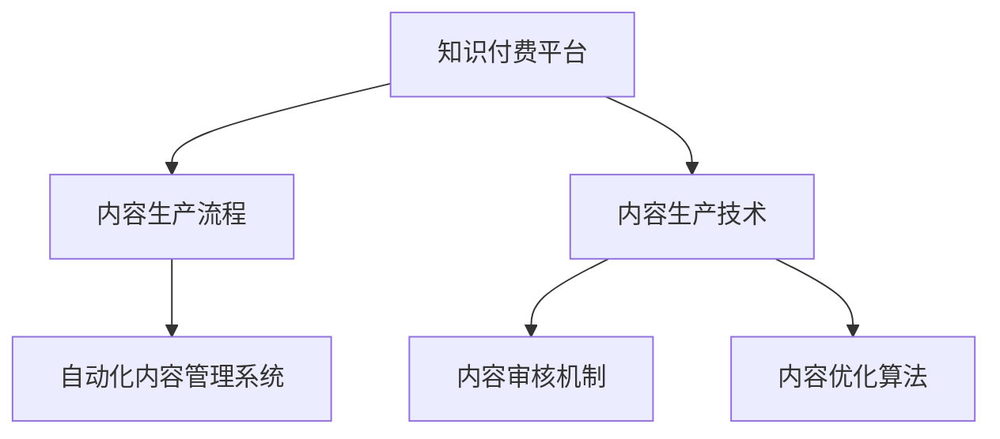

                 

# 知识付费创业中的内容生产流程优化

## 1. 背景介绍

在知识付费迅猛发展的今天，内容生产已经成为了知识付费平台的核心竞争力之一。对于知识付费创业者来说，如何高效地生产优质内容，以满足用户日益增长的需求，是一个亟需解决的问题。本文将从内容生产流程优化的角度出发，探讨如何通过技术手段提高内容生产的效率和质量。

## 2. 核心概念与联系

### 2.1 核心概念概述

为更好地理解内容生产流程优化的技术手段，本节将介绍几个密切相关的核心概念：

- **知识付费平台**：指通过互联网提供知识内容的付费服务，如在线课程、音频、视频、文章等。平台通过高效的内容生产流程，吸引并留住用户。
- **内容生产流程**：指从内容选题、策划、制作、发布到反馈的全过程。其高效性直接影响内容的数量和质量。
- **内容生产技术**：指采用技术手段辅助内容生产的各个环节，如内容推荐算法、自动化编辑、视频转写、OCR等。
- **内容审核机制**：指对内容生产过程中的关键节点进行审核，保障内容的合规性和质量，如版权审核、知识准确性审核、价值观审核等。
- **内容优化算法**：指通过数据分析和机器学习，自动优化内容推荐、编辑、布局等，提升用户体验和内容质量。
- **自动化内容管理系统**：指通过技术手段实现内容的集中管理、统一发布和权限控制，提高内容生产的效率和安全性。

这些核心概念之间的逻辑关系可以通过以下Mermaid流程图来展示：



这个流程图展示出知识付费平台的运作机制，强调了内容生产流程的重要性和多个技术支持环节的关键作用。

## 3. 核心算法原理 & 具体操作步骤

### 3.1 算法原理概述

内容生产流程优化的核心在于采用技术手段辅助内容生产全流程，通过自动化和智能化手段提升效率和质量。具体而言，可以通过以下几个关键步骤实现：

1. **选题策划**：通过数据分析和用户调研，筛选热门和有潜力的选题，生成初步的内容方案。
2. **内容制作**：采用自动化编辑和模板设计，快速生成符合规范的内容，并通过视频转写、OCR等技术辅助生成辅助内容。
3. **内容发布**：通过集中管理和统一发布系统，实现内容的精准分发，并通过内容推荐算法提升内容的曝光率。
4. **内容审核**：通过自动化和人工审核结合的方式，保障内容的合规性和质量，及时发现和修正问题内容。
5. **内容优化**：通过数据分析和机器学习，自动调整内容推荐和编辑策略，提升用户体验和内容质量。
6. **自动化内容管理系统**：通过技术手段实现内容的集中管理、统一发布和权限控制，提高内容生产的效率和安全性。

### 3.2 算法步骤详解

以下将详细讲解每个步骤的具体操作：

#### 3.2.1 选题策划

**步骤1：数据收集与分析**

- **用户行为数据**：收集用户浏览历史、搜索记录、购买行为等数据，分析用户兴趣和需求。
- **市场热点数据**：收集新闻、社交媒体、行业报告等热点信息，分析热门话题和趋势。
- **竞争分析数据**：分析竞争对手的内容产出情况，识别差异化的选题机会。

**步骤2：选题生成**

- **热门推荐**：基于用户行为数据和市场热点数据，生成热门推荐选题。
- **趋势预测**：结合时间序列分析、情感分析等技术，预测未来热门内容方向。
- **专家推荐**：邀请行业专家提供选题建议，结合专家经验和数据预测，生成高质量选题。

#### 3.2.2 内容制作

**步骤1：自动化编辑**

- **模板生成**：设计通用的内容模板，通过自动化编辑工具快速生成符合规范的内容。
- **样式定制**：利用模板定制工具，根据不同内容类型和风格，快速调整内容样式。

**步骤2：辅助内容生成**

- **视频转写**：将视频内容转换为文字，便于编辑和检索。
- **OCR识别**：将纸质或扫描文件转换为电子文本，便于数字化和编辑。
- **辅助数据生成**：利用数据可视化工具，快速生成图表、统计数据等辅助内容。

#### 3.2.3 内容发布

**步骤1：集中管理**

- **内容库管理**：通过集中管理平台，实现内容的统一存储和检索。
- **权限控制**：设置不同权限，确保内容的发布和访问安全。

**步骤2：精准分发**

- **内容推荐算法**：利用机器学习算法，根据用户行为和内容特征，精准推荐内容。
- **发布策略优化**：根据用户行为和市场趋势，动态调整发布时间和频率。

#### 3.2.4 内容审核

**步骤1：自动化审核**

- **内容合规性审核**：利用规则引擎和爬虫技术，自动化检查内容的版权、合规性等信息。
- **知识准确性审核**：利用知识图谱和自然语言处理技术，自动检测内容的准确性和真实性。

**步骤2：人工审核**

- **价值观审核**：通过人工审核，确保内容的价值取向符合平台标准。
- **问题内容处理**：及时发现和处理含有不当内容或有害信息的条目。

#### 3.2.5 内容优化

**步骤1：数据收集与分析**

- **用户反馈数据**：收集用户评论、评分、分享等反馈数据，分析用户满意度。
- **内容流量数据**：收集内容的浏览、下载、播放等流量数据，分析内容表现。

**步骤2：优化策略生成**

- **内容推荐优化**：根据用户反馈和流量数据，调整推荐算法和策略，提升用户体验。
- **内容编辑优化**：根据用户反馈和流量数据，调整编辑模板和样式，提升内容质量。

#### 3.2.6 自动化内容管理系统

**步骤1：内容管理系统设计**

- **界面设计**：设计友好的界面，提高内容管理平台的易用性。
- **功能模块划分**：划分内容管理系统的各个功能模块，如内容库管理、权限控制、发布策略等。

**步骤2：系统开发与部署**

- **技术选型**：选择合适的技术栈，开发高效的内容管理系统。
- **系统部署**：将系统部署到云平台或本地服务器，确保系统的稳定性和扩展性。

### 3.3 算法优缺点

内容生产流程优化技术具有以下优点：

- **提升效率**：通过自动化和智能化手段，显著提高内容生产的效率和速度。
- **保障质量**：通过数据驱动和审核机制，确保内容的合规性和质量。
- **提高体验**：通过内容优化和推荐算法，提升用户的内容体验。
- **降低成本**：减少人力成本和制作时间，提高内容生产的经济性。

但该技术也存在一些缺点：

- **技术门槛高**：需要具备一定的技术基础，才能高效地开发和维护系统。
- **数据依赖强**：数据的质量和数量直接影响内容生成的准确性和推荐效果。
- **内容同质化**：过度依赖推荐算法，可能导致内容过度同质化，缺乏创新性。

### 3.4 算法应用领域

内容生产流程优化技术已经广泛应用于知识付费平台，并取得了显著的效果。具体而言，包括但不限于以下几个领域：

- **在线教育**：通过自动化制作和推荐，提供个性化和高质量的课程内容。
- **音频内容**：采用自动编辑和转写技术，快速生成和处理音频内容。
- **视频内容**：通过视频转写和OCR技术，辅助视频内容的生成和检索。
- **知识文章**：利用数据可视化和模板设计，快速生成和编辑知识文章。

## 4. 数学模型和公式 & 详细讲解 & 举例说明

### 4.1 数学模型构建

本节将使用数学语言对内容生产流程优化的数学模型进行更加严格的刻画。

**选题策划模型**

假设选题生成模型的输入为 $x = (u, m, c)$，其中 $u$ 为用户行为数据，$m$ 为市场热点数据，$c$ 为竞争分析数据。模型的输出为 $y = (t_1, t_2, ..., t_n)$，表示热门推荐选题、趋势预测选题和专家推荐选题。

选题生成模型的目标是最小化选题与真实热门内容的误差，即：

$$
\min_{\theta} \sum_{i=1}^{n} \| t_i - t_{i实际} \|^2
$$

其中 $\theta$ 为模型的参数。

**内容推荐模型**

假设内容推荐模型的输入为 $x = (u, t)$，其中 $u$ 为用户行为数据，$t$ 为内容信息。模型的输出为 $y = r$，表示推荐内容的得分。

内容推荐模型的目标是最小化预测得分与实际用户行为之间的误差，即：

$$
\min_{\theta} \sum_{i=1}^{N} \| r_i - y_i \|^2
$$

其中 $N$ 为推荐内容数量，$y_i$ 为实际用户行为数据。

**内容审核模型**

假设内容审核模型的输入为 $x = (t, r)$，其中 $t$ 为内容信息，$r$ 为用户行为数据。模型的输出为 $y = (c, k)$，表示内容合规性和知识准确性。

内容审核模型的目标是最小化审核结果与真实合规性和准确性之间的误差，即：

$$
\min_{\theta} \sum_{i=1}^{M} \| c_i - c_{i实际} \|^2 + \sum_{i=1}^{M} \| k_i - k_{i实际} \|^2
$$

其中 $M$ 为内容审核样本数量，$c_{i实际}$ 和 $k_{i实际}$ 为实际合规性和准确性结果。

**内容优化模型**

假设内容优化模型的输入为 $x = (f, t)$，其中 $f$ 为用户反馈数据，$t$ 为内容信息。模型的输出为 $y = (r', t')$，表示优化后的推荐得分和内容信息。

内容优化模型的目标是最小化优化后的得分和内容与实际用户行为和内容之间的误差，即：

$$
\min_{\theta} \sum_{i=1}^{N'} \| r'_i - y_i \|^2 + \sum_{i=1}^{M'} \| t'_i - t_{i实际} \|^2
$$

其中 $N'$ 为优化后推荐内容数量，$M'$ 为优化后内容审核样本数量，$y_i$ 和 $t_{i实际}$ 为实际用户行为和内容信息。

### 4.2 公式推导过程

以下将详细推导上述模型的公式：

**选题策划模型的推导**

选题生成模型可以表示为线性回归模型：

$$
t_i = \theta^T x_i + b
$$

其中 $\theta$ 为模型参数，$x_i$ 为输入数据，$b$ 为截距。

通过最小二乘法求解 $\theta$，得到：

$$
\theta = (X^TX)^{-1}X^Ty
$$

其中 $X$ 为输入数据矩阵，$y$ 为输出结果向量。

**内容推荐模型的推导**

内容推荐模型可以表示为线性回归模型：

$$
r_i = \theta^T x_i + b
$$

通过最小二乘法求解 $\theta$，得到：

$$
\theta = (X^TX)^{-1}X^Ty
$$

**内容审核模型的推导**

内容审核模型可以表示为逻辑回归模型：

$$
\hat{c} = \sigma(\theta^T x_i + b)
$$

$$
\hat{k} = \sigma(\gamma^T x_i + d)
$$

其中 $\sigma$ 为 sigmoid 函数，$\hat{c}$ 和 $\hat{k}$ 为预测结果，$x_i$ 为输入数据，$\theta$ 和 $\gamma$ 为模型参数，$b$ 和 $d$ 为截距。

通过最小二乘法和交叉熵损失函数求解 $\theta$ 和 $\gamma$，得到：

$$
\theta = (X^TX)^{-1}X^Ty
$$

$$
\gamma = (X^TX)^{-1}X^Tc
$$

**内容优化模型的推导**

内容优化模型可以表示为线性回归模型：

$$
r'_i = \theta'^T x_i + b'
$$

$$
t'_i = \delta^T x_i + e
$$

其中 $\theta'$ 和 $\delta$ 为模型参数，$x_i$ 为输入数据，$b'$ 和 $e$ 为截距。

通过最小二乘法求解 $\theta'$ 和 $\delta$，得到：

$$
\theta' = (X^TX)^{-1}X^Ty
$$

$$
\delta = (X^TX)^{-1}X^Tt
$$

### 4.3 案例分析与讲解

以下将通过实际案例来讲解内容生产流程优化的具体应用：

**案例1：在线教育平台的内容生产优化**

假设某在线教育平台希望提升其课程推荐质量。平台收集了数万门课程的描述、用户行为数据和市场趋势数据，利用选题策划模型生成热门推荐选题。

首先，通过数据清洗和特征工程，将用户行为数据和市场趋势数据转化为输入特征 $x = (u, m)$。然后，通过选题策划模型生成热门推荐选题 $y = (t_1, t_2, ..., t_n)$。最后，通过内容推荐模型，根据用户行为数据和课程信息，生成课程推荐得分 $r$，最终推荐给用户。

**案例2：音频内容平台的内容制作优化**

假设某音频内容平台希望提高音频内容的自动化制作效率。平台收集了数万条音频的元数据、用户反馈和播放数据，利用自动化编辑和视频转写技术，快速生成音频内容。

首先，通过数据清洗和特征工程，将元数据和用户反馈数据转化为输入特征 $x = (t, f)$。然后，通过自动化编辑技术，快速生成音频内容 $y = (a_1, a_2, ..., a_n)$。最后，通过内容审核模型，确保音频内容的合规性和准确性。

## 5. 项目实践：代码实例和详细解释说明

### 5.1 开发环境搭建

在进行内容生产流程优化实践前，我们需要准备好开发环境。以下是使用Python进行TensorFlow开发的环境配置流程：

1. 安装Anaconda：从官网下载并安装Anaconda，用于创建独立的Python环境。

2. 创建并激活虚拟环境：
```bash
conda create -n tf-env python=3.8 
conda activate tf-env
```

3. 安装TensorFlow：
```bash
pip install tensorflow tensorflow-estimator tensorflow-hub
```

4. 安装相关库：
```bash
pip install numpy pandas scikit-learn tensorflow-addons matplotlib jupyter notebook ipython
```

完成上述步骤后，即可在`tf-env`环境中开始内容生产流程优化实践。

### 5.2 源代码详细实现

下面我们以内容推荐系统的优化为例，给出使用TensorFlow进行内容推荐模型开发的PyTorch代码实现。

首先，定义内容推荐模型的输入和输出：

```python
import tensorflow as tf

# 输入数据
x = tf.keras.layers.Input(shape=(num_features,))

# 输出数据
y = tf.keras.layers.Dense(num_classes, activation='sigmoid')(x)

# 构建模型
model = tf.keras.models.Model(inputs=x, outputs=y)
```

然后，定义模型的损失函数和优化器：

```python
# 定义损失函数
def loss(y_true, y_pred):
    return tf.keras.losses.binary_crossentropy(y_true, y_pred)

# 定义优化器
optimizer = tf.keras.optimizers.Adam(learning_rate=0.001)
```

接着，定义模型的训练函数：

```python
@tf.function
def train_step(inputs, labels):
    with tf.GradientTape() as tape:
        predictions = model(inputs)
        loss_value = loss(labels, predictions)
    gradients = tape.gradient(loss_value, model.trainable_variables)
    optimizer.apply_gradients(zip(gradients, model.trainable_variables))
    return loss_value
```

最后，启动训练流程：

```python
epochs = 10
batch_size = 32

for epoch in range(epochs):
    for batch in tqdm(data, desc='Training'):
        inputs, labels = batch
        loss_value = train_step(inputs, labels)
        print(f"Epoch {epoch+1}, loss: {loss_value:.3f}")
```

以上就是使用TensorFlow对内容推荐模型进行优化训练的完整代码实现。可以看到，通过TensorFlow的强大功能，我们可以高效地构建、训练和优化内容推荐模型。

### 5.3 代码解读与分析

让我们再详细解读一下关键代码的实现细节：

**数据输入和输出定义**

- `tf.keras.layers.Input`：定义模型的输入，如用户行为数据和内容信息。
- `tf.keras.layers.Dense`：定义模型的输出，如推荐得分。

**损失函数和优化器**

- `tf.keras.losses.binary_crossentropy`：定义二分类损失函数，用于衡量模型预测和真实标签之间的误差。
- `tf.keras.optimizers.Adam`：定义优化器，用于更新模型参数。

**训练函数**

- `@tf.function`：将训练函数定义为图函数，提升训练速度。
- `tf.GradientTape`：记录梯度，用于反向传播和参数更新。
- `optimizer.apply_gradients`：根据梯度更新模型参数。

**训练流程**

- `epochs`：定义训练轮数。
- `batch_size`：定义批处理大小。
- `for`循环：遍历所有数据集，进行前向传播和反向传播，更新模型参数。

可以看到，TensorFlow提供的高级API使得内容推荐模型的构建和训练变得简洁高效。开发者可以专注于模型的设计和优化，而不必过多关注底层的实现细节。

当然，工业级的系统实现还需考虑更多因素，如模型的保存和部署、超参数的自动搜索、更灵活的任务适配层等。但核心的优化流程基本与此类似。

## 6. 实际应用场景

### 6.1 在线教育平台

在线教育平台可以通过内容生产流程优化，提高课程推荐质量，提升用户学习体验。平台通过收集用户行为数据、市场趋势数据和课程描述数据，利用选题策划模型生成热门推荐选题，利用内容推荐模型生成个性化课程推荐，使用内容审核模型确保课程内容的合规性和准确性，最终通过内容优化模型提升课程推荐效果。

### 6.2 音频内容平台

音频内容平台可以通过内容生产流程优化，提高音频内容的自动化制作效率和质量。平台通过收集音频元数据、用户反馈和播放数据，利用自动化编辑和视频转写技术，快速生成音频内容，使用内容审核模型确保音频内容的合规性和准确性，最终通过内容优化模型提升音频内容的用户体验。

### 6.3 视频内容平台

视频内容平台可以通过内容生产流程优化，提高视频内容的推荐效果和用户体验。平台通过收集视频元数据、用户行为数据和市场趋势数据，利用选题策划模型生成热门推荐选题，利用内容推荐模型生成个性化视频推荐，使用内容审核模型确保视频内容的合规性和准确性，最终通过内容优化模型提升视频推荐效果。

### 6.4 未来应用展望

随着内容生产流程优化技术的不断发展，未来的知识付费平台将更加智能化和自动化。具体而言，可以预见以下几个趋势：

1. **自适应内容推荐**：通过机器学习算法，根据用户行为和内容特征，实时调整推荐策略，提供更加个性化和精准的内容推荐。
2. **智能选题策划**：利用自然语言处理和数据挖掘技术，自动分析市场热点和用户需求，生成高质量的选题方案。
3. **自动化内容生成**：通过语音识别、OCR识别等技术，实现内容的自动生成和编辑，提高内容生产的效率和质量。
4. **实时内容审核**：利用规则引擎和爬虫技术，实现内容的实时审核和监管，保障内容的安全性和合规性。
5. **用户反馈驱动的内容优化**：通过数据分析和机器学习，自动调整内容推荐和编辑策略，提升用户体验和内容质量。

## 7. 工具和资源推荐

### 7.1 学习资源推荐

为了帮助开发者系统掌握内容生产流程优化的理论基础和实践技巧，这里推荐一些优质的学习资源：

1. **《深度学习》一书**：深度学习领域的经典教材，全面介绍了深度学习的基本概念和算法。
2. **《TensorFlow实战》一书**：TensorFlow的官方指南，详细介绍了TensorFlow的使用方法和最佳实践。
3. **《自然语言处理》课程**：斯坦福大学的NLP课程，涵盖自然语言处理的基本概念和经典模型。
4. **Kaggle竞赛**：通过参与Kaggle竞赛，学习内容推荐和内容优化相关的算法和模型。
5. **GitHub开源项目**：查找和参考开源项目，学习内容生产流程优化的实际应用。

通过对这些资源的学习实践，相信你一定能够快速掌握内容生产流程优化的精髓，并用于解决实际的内容推荐和内容优化问题。

### 7.2 开发工具推荐

高效的开发离不开优秀的工具支持。以下是几款用于内容生产流程优化开发的常用工具：

1. **TensorFlow**：谷歌开发的深度学习框架，适合构建和优化内容推荐模型。
2. **TensorFlow Addons**：TensorFlow的扩展库，提供了更多高级API和模型实现。
3. **TensorFlow Hub**：TensorFlow的模块库，可以快速集成和使用预训练的模型和数据集。
4. **Keras**：高层次的深度学习API，适合快速构建和优化内容推荐模型。
5. **Jupyter Notebook**：开源的交互式笔记本环境，支持Python代码的运行和展示。
6. **Google Colab**：谷歌提供的在线Jupyter Notebook环境，免费提供GPU/TPU算力。

合理利用这些工具，可以显著提升内容生产流程优化的开发效率，加快创新迭代的步伐。

### 7.3 相关论文推荐

内容生产流程优化技术的发展源于学界的持续研究。以下是几篇奠基性的相关论文，推荐阅读：

1. **《深度学习与神经网络》一书**：深度学习领域的经典教材，全面介绍了深度学习的基本概念和算法。
2. **《内容推荐系统》一书**：介绍了内容推荐系统的基本概念和算法，涵盖了协同过滤、矩阵分解等技术。
3. **《自然语言处理综述》一书**：自然语言处理领域的经典综述，涵盖了语义分析、情感分析等技术。
4. **《内容审核与监管技术综述》一书**：介绍了内容审核与监管技术的最新进展，涵盖了规则引擎、爬虫技术等。

这些论文代表了大语言模型微调技术的发展脉络。通过学习这些前沿成果，可以帮助研究者把握学科前进方向，激发更多的创新灵感。

## 8. 总结：未来发展趋势与挑战

### 8.1 总结

本文对内容生产流程优化方法进行了全面系统的介绍。首先阐述了内容生产流程优化的背景和意义，明确了内容生产流程优化在提高内容生产效率和质量方面的独特价值。其次，从原理到实践，详细讲解了内容生产流程优化的数学原理和关键步骤，给出了内容推荐模型开发的完整代码实例。同时，本文还广泛探讨了内容生产流程优化在知识付费平台中的应用场景，展示了内容生产流程优化的巨大潜力。最后，本文精选了内容生产流程优化的各类学习资源，力求为读者提供全方位的技术指引。

通过本文的系统梳理，可以看到，内容生产流程优化技术已经成为知识付费平台的重要组成部分，极大地提升了内容生产的效率和质量。未来，伴随内容生产流程优化技术的不断进步，知识付费平台的内容推荐和制作将更加智能化和自动化，为用户带来更加丰富和高质量的内容体验。

### 8.2 未来发展趋势

展望未来，内容生产流程优化技术将呈现以下几个发展趋势：

1. **自适应推荐系统**：通过机器学习算法，根据用户行为和内容特征，实时调整推荐策略，提供更加个性化和精准的内容推荐。
2. **智能选题策划**：利用自然语言处理和数据挖掘技术，自动分析市场热点和用户需求，生成高质量的选题方案。
3. **自动化内容生成**：通过语音识别、OCR识别等技术，实现内容的自动生成和编辑，提高内容生产的效率和质量。
4. **实时内容审核**：利用规则引擎和爬虫技术，实现内容的实时审核和监管，保障内容的安全性和合规性。
5. **用户反馈驱动的内容优化**：通过数据分析和机器学习，自动调整内容推荐和编辑策略，提升用户体验和内容质量。

以上趋势凸显了内容生产流程优化技术的广阔前景。这些方向的探索发展，必将进一步提升知识付费平台的内容生产效率和质量，为知识付费用户提供更加丰富和高质量的内容体验。

### 8.3 面临的挑战

尽管内容生产流程优化技术已经取得了显著的成效，但在迈向更加智能化、普适化应用的过程中，它仍面临诸多挑战：

1. **数据依赖强**：内容生产流程优化高度依赖数据质量，数据偏差和噪声可能影响模型效果。
2. **技术门槛高**：内容生产流程优化需要具备一定的技术基础，才能高效地开发和维护系统。
3. **内容同质化**：过度依赖推荐算法，可能导致内容过度同质化，缺乏创新性。
4. **隐私保护**：内容生产流程优化涉及大量用户行为数据，如何保障用户隐私和数据安全是一大挑战。
5. **多模态数据整合**：内容生产流程优化涉及文本、音频、视频等多种数据类型，如何有效整合和利用这些数据是一大难题。

正视内容生产流程优化面临的这些挑战，积极应对并寻求突破，将是内容生产流程优化技术走向成熟的必由之路。相信随着学界和产业界的共同努力，这些挑战终将一一被克服，内容生产流程优化技术必将在构建知识付费平台中发挥更大的作用。

### 8.4 研究展望

面向未来，内容生产流程优化技术的研究需要在以下几个方面寻求新的突破：

1. **多模态数据融合**：将文本、音频、视频等多种数据类型进行整合，提升内容生产的全面性和多样性。
2. **自适应推荐算法**：开发更加灵活和自适应的推荐算法，根据用户行为和内容特征，实时调整推荐策略。
3. **智能选题策划**：利用自然语言处理和数据挖掘技术，自动分析市场热点和用户需求，生成高质量的选题方案。
4. **自动化内容生成**：通过语音识别、OCR识别等技术，实现内容的自动生成和编辑，提高内容生产的效率和质量。
5. **实时内容审核**：利用规则引擎和爬虫技术，实现内容的实时审核和监管，保障内容的安全性和合规性。
6. **用户反馈驱动的内容优化**：通过数据分析和机器学习，自动调整内容推荐和编辑策略，提升用户体验和内容质量。

这些研究方向的探索，必将引领内容生产流程优化技术迈向更高的台阶，为知识付费平台的内容推荐和制作提供更加智能和高效的技术支持。只有勇于创新、敢于突破，才能不断拓展内容生产流程优化的边界，让知识付费平台的内容更加丰富和高质量。

## 9. 附录：常见问题与解答

**Q1：内容生产流程优化是否适用于所有知识付费平台？**

A: 内容生产流程优化在大多数知识付费平台上都能取得不错的效果，特别是对于数据量较小的平台。但对于一些特定领域或内容类型，如学术、金融等，仅仅依靠通用语料预训练的模型可能难以很好地适应。此时需要在特定领域语料上进一步预训练，再进行微调，才能获得理想效果。

**Q2：内容推荐模型是否适合所有推荐场景？**

A: 内容推荐模型主要适用于基于内容的推荐场景，如视频、文章、课程等。但对于社交推荐场景，如基于用户社交网络的关系推荐，可能需要结合用户行为数据和社交网络数据进行推荐。

**Q3：内容审核模型是否可以处理所有内容类型？**

A: 内容审核模型主要适用于文本和视频内容，但对于音频和图像内容，可能需要结合特定领域的数据和算法进行处理。

**Q4：内容优化模型是否适用于所有优化场景？**

A: 内容优化模型主要适用于内容推荐和编辑优化场景，但对于基于搜索的优化场景，如搜索结果排序，可能需要结合搜索引擎算法进行处理。

**Q5：内容生产流程优化是否需要大量标注数据？**

A: 内容生产流程优化通常需要标注数据进行模型训练，但通过自动化编辑和视频转写等技术，可以减少对标注数据的依赖。对于一些需要标注数据的环节，如内容审核和内容优化，可以通过众包平台或专家标注等方式获取。

**Q6：内容生产流程优化是否可以自动化？**

A: 内容生产流程优化可以通过自动化和智能化手段显著提高效率，但仍需结合人工审核和调整，确保内容的质量和安全。

**Q7：内容生产流程优化是否可以降低成本？**

A: 内容生产流程优化通过自动化和智能化手段，可以减少人力成本和制作时间，提高内容生产的经济性。

通过本文的系统梳理，可以看到，内容生产流程优化技术已经成为知识付费平台的重要组成部分，极大地提升了内容生产的效率和质量。未来，伴随内容生产流程优化技术的不断进步，知识付费平台的内容推荐和制作将更加智能化和自动化，为用户带来更加丰富和高质量的内容体验。

---

作者：禅与计算机程序设计艺术 / Zen and the Art of Computer Programming

