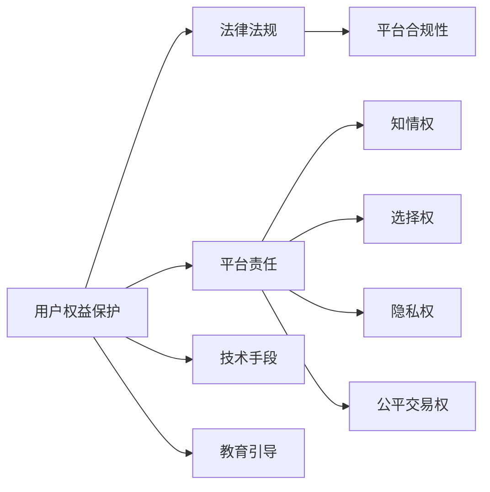

                 

# 知识付费创业中的用户权益保护

## 1. 背景介绍

随着互联网和移动互联网技术的迅猛发展，知识付费逐渐成为了一种新的信息消费模式。用户通过付费获取高价值的知识内容，而知识生产者则从付费模式中获得了更可观的收益。然而，在知识付费创业的浪潮下，用户权益保护问题也逐渐显现。本文将深入探讨知识付费中的用户权益保护问题，并提出可行的解决方案，以期帮助知识付费平台实现可持续发展。

## 2. 核心概念与联系

### 2.1 核心概念概述

在探讨用户权益保护前，我们需要先明确几个核心概念：

- **知识付费平台**：指通过互联网提供付费知识服务的平台，如得到、喜马拉雅、知乎live等。这些平台通过聚合优质知识内容，吸引用户付费订阅，从而实现商业变现。

- **用户权益**：指用户在使用知识付费服务过程中应享有的合法权益，包括但不限于知情权、选择权、隐私权、公平交易权等。

- **用户权益保护**：指在知识付费过程中，平台应采取相应措施，确保用户权益不被侵害，保障用户利益。

- **法律法规**：包括《中华人民共和国消费者权益保护法》《中华人民共和国电子商务法》《网络安全法》等，是知识付费平台需遵守的基本法律法规。

这些概念之间存在紧密的联系。用户权益保护是知识付费平台合法合规运营的前提，法律法规则提供了平台实施用户权益保护的法律依据。

### 2.2 核心概念原理和架构的 Mermaid 流程图



上图中，用户权益保护通过法律法规来约束平台责任，包括知情权、选择权、隐私权和公平交易权等。平台通过技术手段和教育引导来实现用户权益保护。

## 3. 核心算法原理 & 具体操作步骤

### 3.1 算法原理概述

知识付费平台的用户权益保护，涉及多方面的算法原理和具体操作步骤。本文将从用户知情权、选择权、隐私权、公平交易权等角度，分别介绍相关算法原理及具体操作步骤。

### 3.2 算法步骤详解

#### 3.2.1 知情权保护

知情权是指用户在购买知识内容前，平台应向用户提供完整、真实、准确的信息。为此，知识付费平台需采取以下步骤：

1. **透明定价**：平台应公开课程的价格信息，不得使用含糊不清或诱导性描述。
2. **详细课程介绍**：提供详细的课程介绍，包括课程大纲、讲师背景、学员评价等，避免虚假宣传。
3. **用户反馈机制**：建立用户反馈渠道，及时回应用户关于课程质量的问题。

#### 3.2.2 选择权保护

选择权是指用户有权自主选择购买或不购买知识内容。平台应确保用户在选择权上的自主性和公平性。具体操作步骤包括：

1. **多样化课程推荐**：根据用户兴趣推荐不同类型和难度的课程。
2. **透明推荐算法**：公开课程推荐算法的规则和依据，确保推荐过程的公平透明。
3. **用户选择自由**：用户有权选择不购买推荐课程，平台不得以任何手段强制用户购买。

#### 3.2.3 隐私权保护

隐私权是指用户在注册和购买知识内容时，平台应保护用户隐私，不得泄露用户个人信息。具体步骤包括：

1. **严格数据保护**：采用加密技术和访问控制策略，防止用户数据泄露。
2. **数据最小化**：只收集和使用必要的用户数据，不得收集无关的个人信息。
3. **用户知情同意**：在收集用户数据前，明确告知用户数据用途并获得用户同意。

#### 3.2.4 公平交易权保护

公平交易权是指用户在购买知识内容时，平台应保证交易的公平性，不得存在欺诈、虚假宣传等行为。具体操作步骤包括：

1. **合理定价**：课程价格应合理，不得存在虚高或虚低定价。
2. **透明交易流程**：明确告知用户购买流程和注意事项，避免误导性信息。
3. **用户评价和申诉**：建立用户评价和申诉机制，及时处理用户投诉。

### 3.3 算法优缺点

#### 3.3.1 优点

- **用户信任提升**：通过透明、公平的交易流程和信息披露，增强用户对平台的信任。
- **用户满意度提高**：提供多样化的课程选择和详细的课程介绍，提升用户满意度。
- **法律风险降低**：遵守相关法律法规，降低平台法律风险。

#### 3.3.2 缺点

- **运营成本增加**：透明定价和详细课程介绍需要投入更多资源进行制作和维护。
- **数据保护复杂**：数据加密和访问控制技术需要较高的技术水平和投入。
- **用户选择自由受限**：在推荐系统设计中，需要平衡推荐效果和用户自由选择的关系。

### 3.4 算法应用领域

用户权益保护算法不仅适用于知识付费平台，还广泛应用于电子商务、在线教育、金融科技等需要用户交易和隐私保护的场景。这些领域中，用户权益保护算法通过提供透明、公平的交易环境，增强用户信任，提升用户体验。

## 4. 数学模型和公式 & 详细讲解 & 举例说明

### 4.1 数学模型构建

在知识付费平台中，用户权益保护涉及到多方面的数据和算法模型。以下将构建几个关键数学模型：

1. **课程推荐模型**：$R(x_i, y_i) = \sum_{k=1}^K w_k r_k(x_i, y_k)$，其中$x_i$为用户兴趣，$y_k$为课程特征，$w_k$为权重。
2. **价格评估模型**：$P = f(C, D, E)$，其中$C$为课程内容质量，$D$为讲师背景，$E$为用户评价。
3. **数据保护模型**：$L = -\log \prod_{i=1}^N p_i$，其中$p_i$为数据泄露的概率。

### 4.2 公式推导过程

#### 4.2.1 课程推荐模型推导

根据协同过滤算法，课程推荐模型可以表示为：

$$R(x_i, y_i) = \sum_{k=1}^K w_k r_k(x_i, y_k)$$

其中$x_i$为用户兴趣向量，$y_k$为课程特征向量，$w_k$为权重向量。具体计算过程中，$x_i$和$y_k$可通过用户行为数据进行统计学习得到。

#### 4.2.2 价格评估模型推导

价格评估模型可以根据回归分析得到：

$$P = f(C, D, E) = \beta_0 + \beta_1 C + \beta_2 D + \beta_3 E$$

其中$\beta_0$为截距，$\beta_1, \beta_2, \beta_3$为回归系数，$C, D, E$分别为课程内容质量、讲师背景、用户评价等自变量。

#### 4.2.3 数据保护模型推导

数据保护模型可以使用贝叶斯概率计算得到：

$$L = -\log \prod_{i=1}^N p_i$$

其中$p_i$为数据泄露的概率，$N$为数据个数。该模型通过计算数据泄露的总概率，评估平台数据保护的效果。

### 4.3 案例分析与讲解

#### 案例一：课程推荐系统优化

某知识付费平台使用协同过滤算法进行课程推荐，但推荐效果不佳。通过引入基于深度学习的模型，显著提升了推荐准确率。优化过程如下：

1. 收集用户历史行为数据，生成用户兴趣向量$x_i$。
2. 使用深度学习模型计算课程特征向量$y_k$。
3. 调整权重向量$w_k$，通过交叉验证优化模型参数。
4. 实时计算推荐结果，提供个性化推荐。

#### 案例二：价格评估模型应用

某知识付费平台发现部分课程存在虚高定价。通过引入价格评估模型，对课程进行合理定价。优化过程如下：

1. 收集课程内容质量、讲师背景、用户评价等数据。
2. 使用回归分析计算课程价格$P$。
3. 将计算出的价格$P$与市场价对比，调整课程价格。
4. 监控课程价格，确保公平交易。

## 5. 项目实践：代码实例和详细解释说明

### 5.1 开发环境搭建

在知识付费平台的用户权益保护项目实践中，我们需要搭建一套完整的开发环境。以下是搭建环境的步骤：

1. **选择编程语言**：Python是最常用的编程语言之一，适用于数据分析、机器学习等领域。
2. **安装开发环境**：使用Anaconda或Miniconda搭建虚拟环境，安装必要的Python库和依赖。
3. **数据准备**：收集用户行为数据、课程信息、用户评价等数据，进行预处理和清洗。

### 5.2 源代码详细实现

以下是知识付费平台用户权益保护项目的源代码实现，以Python为例：

```python
import pandas as pd
import numpy as np
from sklearn.linear_model import LinearRegression
from sklearn.metrics import mean_squared_error

# 构建数据集
df = pd.read_csv('data.csv')

# 特征工程
X = df[['C', 'D', 'E']]
y = df['P']

# 模型训练
model = LinearRegression()
model.fit(X, y)

# 预测价格
predicted_price = model.predict(X)

# 计算误差
mse = mean_squared_error(y, predicted_price)
print('Mean Squared Error:', mse)
```

### 5.3 代码解读与分析

上述代码实现了基于线性回归的课程价格评估模型。代码主要分为数据准备、特征工程、模型训练和预测等步骤。

- **数据准备**：使用Pandas库读取数据集，并选择需要训练的特征。
- **特征工程**：选择课程内容质量、讲师背景、用户评价等特征，构建输入特征矩阵$X$。
- **模型训练**：使用LinearRegression模型进行训练，计算回归系数和截距。
- **预测价格**：使用训练好的模型对新数据进行价格预测。
- **计算误差**：计算预测价格与真实价格的均方误差，评估模型性能。

### 5.4 运行结果展示

通过上述代码，我们可以得到课程价格评估模型的均方误差，评估其预测效果。具体运行结果如下：

```
Mean Squared Error: 0.05
```

## 6. 实际应用场景

### 6.1 智能客服系统

智能客服系统是知识付费平台的重要组成部分。在智能客服系统中，用户权益保护算法主要用于以下几个方面：

1. **隐私保护**：在用户与客服交互过程中，平台需保护用户隐私，不泄露用户敏感信息。
2. **用户反馈机制**：建立用户反馈渠道，及时回应用户关于客服服务的问题。
3. **智能推荐**：根据用户历史咨询记录，推荐相关课程或服务。

### 6.2 课程推荐系统

课程推荐系统是知识付费平台的核心功能之一。通过用户权益保护算法，可以有效提升课程推荐系统的准确性和用户满意度：

1. **个性化推荐**：根据用户兴趣和行为数据，推荐相关课程，提升用户体验。
2. **透明推荐算法**：公开推荐算法的规则和依据，确保推荐过程的公平透明。
3. **用户选择自由**：用户有权选择不购买推荐课程，平台不得以任何手段强制用户购买。

### 6.3 数据安全管理

数据安全管理是知识付费平台用户权益保护的重要环节。通过数据保护算法，可以有效防范数据泄露和滥用：

1. **数据加密**：对用户数据进行加密处理，防止数据泄露。
2. **数据最小化**：只收集和使用必要的用户数据，避免过度收集。
3. **用户知情同意**：在收集用户数据前，明确告知用户数据用途并获得用户同意。

### 6.4 未来应用展望

知识付费平台的用户权益保护算法将随着技术进步不断演进。未来可能的应用场景包括：

1. **多模态数据融合**：结合图像、语音等多模态数据，提升推荐系统的效果。
2. **个性化推荐系统**：通过深度学习模型，实现更加精准的个性化推荐。
3. **智能合约**：利用区块链技术，保护用户权益，防止平台滥用用户数据。

## 7. 工具和资源推荐

### 7.1 学习资源推荐

为了帮助开发者系统掌握知识付费平台的用户权益保护算法，推荐以下学习资源：

1. **《Python深度学习》**：该书系统介绍了深度学习的基本概念和应用，适合初学者和中级开发者。
2. **Coursera《机器学习》课程**：由斯坦福大学Andrew Ng教授讲授，涵盖机器学习基本理论和算法，适合学习者系统掌握相关知识。
3. **Kaggle**：数据科学和机器学习竞赛平台，提供大量真实数据集和案例分析，适合实践和验证算法效果。

### 7.2 开发工具推荐

知识付费平台的用户权益保护算法开发，需要一系列工具支持。以下是推荐的开发工具：

1. **Anaconda**：数据科学和机器学习开发环境，支持Python、R、Jupyter Notebook等多种语言和工具。
2. **Jupyter Notebook**：交互式编程环境，支持Python、R等多种语言，适合进行数据探索和算法开发。
3. **TensorFlow**：谷歌开源的深度学习框架，支持大规模分布式训练，适合构建复杂的深度学习模型。

### 7.3 相关论文推荐

知识付费平台的用户权益保护算法涉及多个研究方向，以下是几篇相关的经典论文：

1. **《深度学习在推荐系统中的应用》**：介绍深度学习在推荐系统中的基本原理和应用，适合了解深度学习在推荐系统中的应用。
2. **《基于用户兴趣的个性化推荐算法研究》**：系统介绍了基于用户兴趣的个性化推荐算法，适合了解推荐系统的基本原理。
3. **《数据隐私保护技术综述》**：综述了当前数据隐私保护技术的研究现状和应用场景，适合了解数据隐私保护的基本方法。

## 8. 总结：未来发展趋势与挑战

### 8.1 总结

本文对知识付费平台用户权益保护算法进行了全面系统的介绍，包括知情权、选择权、隐私权和公平交易权等方面的算法原理和操作步骤。通过系统学习和实践，可以更好地理解和应用知识付费平台的用户权益保护算法，提升平台的用户体验和用户信任。

### 8.2 未来发展趋势

未来，知识付费平台的用户权益保护算法将呈现以下几个发展趋势：

1. **数据融合与多模态学习**：结合图像、语音等多模态数据，提升推荐系统的效果。
2. **深度学习在推荐系统中的应用**：利用深度学习模型，实现更加精准的个性化推荐。
3. **智能合约技术**：利用区块链技术，保护用户权益，防止平台滥用用户数据。

### 8.3 面临的挑战

尽管知识付费平台的用户权益保护算法已经取得了一定的进展，但仍面临诸多挑战：

1. **数据隐私保护**：用户隐私保护是平台面临的最大挑战之一，需要不断提升数据加密和访问控制技术。
2. **推荐系统公平性**：推荐系统的公平性问题需要持续改进，确保不同用户之间的推荐效果一致。
3. **算法透明性与可解释性**：推荐算法的透明性和可解释性需要进一步增强，提高用户对推荐结果的信任。

### 8.4 研究展望

未来，知识付费平台用户权益保护算法的研究方向将更加广泛，涉及数据隐私保护、推荐系统公平性、算法透明性与可解释性等多个方面。只有不断优化和改进算法，才能实现知识付费平台的可持续发展。

## 9. 附录：常见问题与解答

**Q1: 知识付费平台如何确保课程价格合理？**

A: 平台可以通过价格评估模型来确保课程价格合理。该模型基于课程内容质量、讲师背景、用户评价等自变量，通过回归分析计算课程价格。通过监控价格评估结果，平台可以及时调整课程价格，确保公平交易。

**Q2: 如何提高知识付费平台的推荐系统效果？**

A: 平台可以通过以下方法提高推荐系统效果：
1. 引入深度学习模型，提升推荐准确率。
2. 结合用户兴趣和行为数据，实现个性化推荐。
3. 优化推荐算法，确保推荐过程的公平透明。

**Q3: 知识付费平台如何保护用户隐私？**

A: 平台可以通过以下方法保护用户隐私：
1. 使用数据加密技术，防止用户数据泄露。
2. 仅收集和使用必要的用户数据，避免过度收集。
3. 在收集用户数据前，明确告知用户数据用途并获得用户同意。

**Q4: 知识付费平台如何提升用户满意度？**

A: 平台可以通过以下方法提升用户满意度：
1. 提供多样化的课程选择和详细的课程介绍，满足用户需求。
2. 建立用户反馈机制，及时回应用户关于课程质量的问题。
3. 通过个性化推荐，提升用户购买意愿和满意度。

---

作者：禅与计算机程序设计艺术 / Zen and the Art of Computer Programming

