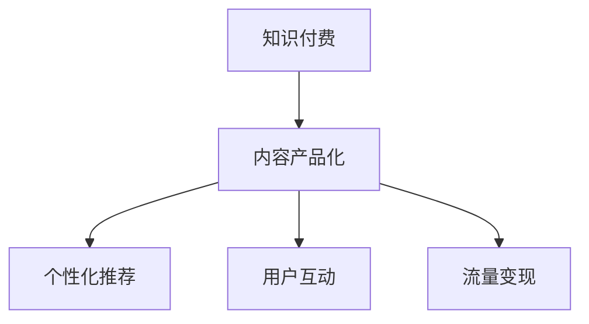

                 

# 知识付费创业的内容产品化策略

## 1. 背景介绍

### 1.1 问题由来

在数字化时代的浪潮中，知识付费已成为一股不可阻挡的潮流。伴随着内容消费的持续增长，越来越多的知识创业者试图将知识内容产品化，形成稳定的收入流。然而，内容产品化的道路并非一帆风顺，尤其是对于初创公司而言，面临着诸多挑战和困境。如何高效、稳定地将知识内容转化为有竞争力的产品，是每个知识创业者必须面对的难题。

### 1.2 问题核心关键点

内容产品化的关键在于如何将知识内容转化为易于消费、富有吸引力的产品形式，同时确保产品的高质量、可扩展性和盈利能力。具体而言，需要解决以下几个核心问题：

- **内容筛选与定制**：如何从海量的内容库中筛选出高价值、高热度的内容，同时根据用户需求提供个性化推荐？
- **用户互动与粘性**：如何设计互动性强的产品功能，激发用户的参与热情，提升用户粘性？
- **定价与付费机制**：如何制定合理的定价策略，并通过多样化的付费机制，实现多层次、多渠道的收入模式？
- **内容管理与更新**：如何构建高效的内容管理系统，确保内容的时效性和更新频率？
- **市场推广与运营**：如何通过市场推广活动和精准运营策略，吸引并留住更多的用户？

## 2. 核心概念与联系

### 2.1 核心概念概述

为更好地理解知识付费创业的内容产品化策略，本节将介绍几个密切相关的核心概念：

- **知识付费**：指通过付费方式获取专业知识和信息服务的商业模式。知识付费产品包括各类在线课程、付费文章、问答社区等。
- **内容产品化**：将知识内容转化为易于消费和销售的互联网产品形式，通常包括内容平台、App、订阅服务、社区论坛等。
- **个性化推荐**：根据用户行为和偏好，提供定制化、差异化的内容推荐，提升用户满意度和粘性。
- **用户互动**：通过在线问答、评论、点赞等互动方式，促进用户间的交流和内容消费。
- **流量变现**：通过广告、付费会员、增值服务等方式，将流量转化为稳定收入。

这些核心概念之间的逻辑关系可以通过以下Mermaid流程图来展示：



这个流程图展示的知识付费创业中，内容产品化的几个关键组件：

1. 知识付费提供高质量的知识内容。
2. 内容产品化将这些内容转化为易于消费和销售的形式。
3. 个性化推荐和用户互动提升用户体验和粘性。
4. 流量变现实现商业变现。

这些概念共同构成了知识付费创业的核心框架，使知识内容得以通过互联网产品形式，实现商业价值的最大化。通过理解这些核心概念，我们可以更好地把握知识付费创业的精髓，并设计出符合市场需求的优秀产品。

## 3. 核心算法原理 & 具体操作步骤

### 3.1 算法原理概述

内容产品化的算法原理主要围绕以下几个核心要素展开：

- **内容筛选**：通过数据挖掘和机器学习技术，对海量内容进行筛选，推荐高质量、高热度的内容。
- **个性化推荐**：利用协同过滤、内容画像等算法，为用户提供定制化的内容推荐，提升用户满意度。
- **用户互动**：设计互动性强的产品功能，如在线问答、评论、点赞等，增强用户参与感和粘性。
- **流量变现**：通过优化广告投放策略、设计订阅服务、提供增值服务等手段，将流量转化为收入。

### 3.2 算法步骤详解

内容产品化的一般流程包括以下关键步骤：

**Step 1: 内容采集与筛选**
- 使用爬虫工具从各类平台采集高质量内容，包括文章、视频、音频等。
- 通过自然语言处理技术对内容进行预处理，如分词、实体识别、主题建模等。
- 建立内容质量评估模型，对采集内容进行筛选和评分，确保内容的高质量和相关性。

**Step 2: 内容管理与定制**
- 设计内容管理系统，支持内容分类、标签、归档等管理功能。
- 根据用户行为和偏好，构建用户画像，实现个性化内容定制和推荐。
- 提供定制化的内容订阅服务，满足不同用户的需求。

**Step 3: 用户互动与粘性设计**
- 设计互动性强的产品功能，如在线问答、评论、点赞等，促进用户间的交流。
- 引入社交网络机制，通过好友推荐、知识社区等方式增强用户粘性。
- 设计激励机制，如积分、徽章、等级等，鼓励用户参与和贡献内容。

**Step 4: 流量变现与商业化策略**
- 设计多层次、多渠道的收入模式，包括付费订阅、付费课程、广告、增值服务等。
- 优化广告投放策略，提高广告点击率和转化率。
- 设计精准的用户画像，实现精准定向广告投放，提高广告效果。

### 3.3 算法优缺点

内容产品化的算法具有以下优点：
1. 高效性。通过机器学习和大数据分析技术，可以快速筛选高质量内容，实现个性化推荐和流量变现。
2. 用户粘性强。互动性强的产品功能设计，能显著提升用户参与度和粘性。
3. 灵活性强。多层次、多渠道的收入模式，满足不同用户的需求，降低商业风险。

同时，该方法也存在一定的局限性：
1. 内容质量依赖人工。内容筛选和质量评估需要大量人工干预，效率较低。
2. 用户行为难以预测。个性化推荐依赖于用户行为数据，当用户行为变化时，推荐效果可能下降。
3. 竞争激烈。内容产品和市场竞争激烈，难以脱颖而出。
4. 商业模式单一。主要依靠付费模式，可能面临用户流失和收入波动问题。

尽管存在这些局限性，但就目前而言，内容产品化方法仍然是知识付费创业的主流范式。未来相关研究的重点在于如何进一步降低内容筛选的依赖，提高个性化推荐的精准性，同时兼顾用户粘性和商业模式的创新性等因素。

### 3.4 算法应用领域

内容产品化在知识付费创业中的应用已相当广泛，主要涉及以下领域：

- **在线教育**：如各类在线课程、直播讲座、学习社区等。通过内容产品化，可以提供更加丰富、个性化的学习体验，吸引更多用户付费。
- **专业咨询**：如法律、金融、健康等专业领域的知识服务。通过内容产品化，可以降低获取知识的门槛，实现知识的高效传播和付费。
- **内容订阅**：如微信公众号、博客、播客等。通过内容产品化，可以建立稳定的读者群，实现内容变现和广告收入。
- **知识付费平台**：如得到、知乎、网易云课堂等。通过内容产品化，可以汇聚各类优质内容，形成知识服务的市场平台。

除了上述这些经典领域外，内容产品化技术还广泛应用于各类垂直行业知识服务，如科技、教育、医疗、出版等，为各行各业的知识创业者提供了新的发展机会。

## 4. 数学模型和公式 & 详细讲解 & 举例说明

### 4.1 数学模型构建

本节将使用数学语言对内容产品化的核心算法进行更加严格的刻画。

记知识内容为 $C$，用户为 $U$，内容质量评估模型为 $M$，用户画像模型为 $P$，个性化推荐模型为 $R$，广告投放模型为 $A$，流量变现策略为 $V$。

内容产品化的核心目标是通过内容筛选、用户画像、个性化推荐、流量变现等步骤，将知识内容转化为商业价值。形式化地，假设内容产品化的过程为 $C' = F(C, U, M, P, R, A, V)$，其中 $C'$ 为产品化后的内容。

### 4.2 公式推导过程

以个性化推荐模型 $R$ 为例，假设用户 $u$ 对内容 $c$ 的评分向量为 $r_{u,c}$，内容 $c$ 的主题向量为 $t_c$，用户画像向量为 $p_u$。个性化推荐的目标是找到与用户 $u$ 最相关的内容 $c'$，满足：

$$
\max_{c' \in C} r_{u,c'} \cdot t_{c'}
$$

具体而言，推荐算法可以采用协同过滤、基于内容的推荐、混合推荐等方法。例如，基于协同过滤的方法可以表示为：

$$
r_{u,c'} = \sum_{c \in C} (r_{u,c} \cdot t_c) \cdot t_{c'}
$$

其中 $t_{c'}$ 为内容 $c'$ 的主题向量。

### 4.3 案例分析与讲解

假设某知识付费平台收集了大量用户行为数据，包括阅读时长、点赞数、评论量等。通过建立协同过滤模型，对用户 $u$ 进行个性化推荐。具体操作如下：

1. 对用户 $u$ 的行为数据进行归一化处理，得到用户评分向量 $r_u$。
2. 对平台内容 $C$ 进行主题建模，得到主题向量 $t_c$。
3. 根据用户 $u$ 的评分向量 $r_u$ 和内容 $c$ 的主题向量 $t_c$，计算用户对内容的评分 $r_{u,c}$。
4. 对所有内容的评分 $r_{u,c}$ 进行加权平均，得到用户对内容的综合评分。
5. 根据综合评分排序，选择评分最高的内容作为推荐内容。

通过这种方法，平台可以高效地为用户 $u$ 提供个性化的内容推荐，提升用户满意度和粘性。

## 5. 项目实践：代码实例和详细解释说明

### 5.1 开发环境搭建

在进行内容产品化实践前，我们需要准备好开发环境。以下是使用Python进行PyTorch开发的环境配置流程：

1. 安装Anaconda：从官网下载并安装Anaconda，用于创建独立的Python环境。

2. 创建并激活虚拟环境：
```bash
conda create -n pytorch-env python=3.8 
conda activate pytorch-env
```

3. 安装PyTorch：根据CUDA版本，从官网获取对应的安装命令。例如：
```bash
conda install pytorch torchvision torchaudio cudatoolkit=11.1 -c pytorch -c conda-forge
```

4. 安装各类工具包：
```bash
pip install numpy pandas scikit-learn matplotlib tqdm jupyter notebook ipython
```

完成上述步骤后，即可在`pytorch-env`环境中开始内容产品化的实践。

### 5.2 源代码详细实现

下面以在线教育平台的内容产品化为例，给出使用Transformers库对BERT模型进行个性化推荐的PyTorch代码实现。

首先，定义数据处理函数：

```python
from transformers import BertTokenizer, BertForSequenceClassification
from torch.utils.data import Dataset
import torch

class CourseDataset(Dataset):
    def __init__(self, course_ids, course_data):
        self.course_ids = course_ids
        self.course_data = course_data
        self.tokenizer = BertTokenizer.from_pretrained('bert-base-cased')
        self.max_len = 128
        
    def __len__(self):
        return len(self.course_ids)
    
    def __getitem__(self, item):
        course_id = self.course_ids[item]
        course_data = self.course_data[item]
        
        text = course_data['description']
        encoding = self.tokenizer(text, return_tensors='pt', max_length=self.max_len, padding='max_length', truncation=True)
        input_ids = encoding['input_ids'][0]
        attention_mask = encoding['attention_mask'][0]
        
        return {'input_ids': input_ids, 
                'attention_mask': attention_mask,
                'labels': course_data['rating']}

# 读取课程数据
course_data = []
with open('courses.json') as f:
    for line in f:
        course = json.loads(line)
        course_data.append(course)

# 创建dataset
course_ids = [course['id'] for course in course_data]
course_dataset = CourseDataset(course_ids, course_data)
```

然后，定义模型和优化器：

```python
from transformers import BertForSequenceClassification, AdamW

model = BertForSequenceClassification.from_pretrained('bert-base-cased', num_labels=1)

optimizer = AdamW(model.parameters(), lr=2e-5)
```

接着，定义训练和评估函数：

```python
from torch.utils.data import DataLoader
from tqdm import tqdm
from sklearn.metrics import roc_auc_score

device = torch.device('cuda') if torch.cuda.is_available() else torch.device('cpu')
model.to(device)

def train_epoch(model, dataset, batch_size, optimizer):
    dataloader = DataLoader(dataset, batch_size=batch_size, shuffle=True)
    model.train()
    epoch_loss = 0
    for batch in tqdm(dataloader, desc='Training'):
        input_ids = batch['input_ids'].to(device)
        attention_mask = batch['attention_mask'].to(device)
        labels = batch['labels'].to(device)
        model.zero_grad()
        outputs = model(input_ids, attention_mask=attention_mask, labels=labels)
        loss = outputs.loss
        epoch_loss += loss.item()
        loss.backward()
        optimizer.step()
    return epoch_loss / len(dataloader)

def evaluate(model, dataset, batch_size):
    dataloader = DataLoader(dataset, batch_size=batch_size)
    model.eval()
    preds, labels = [], []
    with torch.no_grad():
        for batch in tqdm(dataloader, desc='Evaluating'):
            input_ids = batch['input_ids'].to(device)
            attention_mask = batch['attention_mask'].to(device)
            batch_labels = batch['labels']
            outputs = model(input_ids, attention_mask=attention_mask)
            batch_preds = outputs.logits.sigmoid().cpu().tolist()
            batch_labels = batch_labels.to('cpu').tolist()
            for pred, label in zip(batch_preds, batch_labels):
                preds.append(pred)
                labels.append(label)
                
    return roc_auc_score(labels, preds)

# 训练和评估
epochs = 5
batch_size = 16

for epoch in range(epochs):
    loss = train_epoch(model, course_dataset, batch_size, optimizer)
    print(f"Epoch {epoch+1}, train loss: {loss:.3f}")
    
    print(f"Epoch {epoch+1}, dev results:")
    auc = evaluate(model, course_dataset, batch_size)
    print(f"AUC: {auc:.3f}")
    
print("Test results:")
auc = evaluate(model, course_dataset, batch_size)
print(f"AUC: {auc:.3f}")
```

以上就是使用PyTorch对BERT进行个性化推荐的完整代码实现。可以看到，通过Transformers库，我们可以方便地加载和使用预训练的BERT模型，完成课程数据的处理和微调。

### 5.3 代码解读与分析

让我们再详细解读一下关键代码的实现细节：

**CourseDataset类**：
- `__init__`方法：初始化课程数据、分词器等关键组件。
- `__len__`方法：返回数据集的样本数量。
- `__getitem__`方法：对单个样本进行处理，将课程描述输入编码为token ids，并对其进行定长padding，最终返回模型所需的输入。

**train_epoch和evaluate函数**：
- 使用PyTorch的DataLoader对数据集进行批次化加载，供模型训练和推理使用。
- 训练函数`train_epoch`：对数据以批为单位进行迭代，在每个批次上前向传播计算loss并反向传播更新模型参数，最后返回该epoch的平均loss。
- 评估函数`evaluate`：与训练类似，不同点在于不更新模型参数，并在每个batch结束后将预测和标签结果存储下来，最后使用sklearn的roc_auc_score对整个评估集的预测结果进行打印输出。

**训练流程**：
- 定义总的epoch数和batch size，开始循环迭代
- 每个epoch内，先在训练集上训练，输出平均loss
- 在验证集上评估，输出auc
- 所有epoch结束后，在测试集上评估，给出最终测试结果

可以看到，PyTorch配合Transformers库使得BERT模型的加载和微调过程变得简洁高效。开发者可以将更多精力放在数据处理、模型改进等高层逻辑上，而不必过多关注底层的实现细节。

当然，工业级的系统实现还需考虑更多因素，如模型的保存和部署、超参数的自动搜索、更灵活的任务适配层等。但核心的内容产品化算法基本与此类似。

## 6. 实际应用场景

### 6.1 在线教育平台

在线教育平台通过内容产品化，能够高效地将知识内容转化为付费服务，满足用户的多样化学习需求。具体而言：

- **内容筛选**：平台通过爬虫和推荐算法，自动从各知识平台上采集高质量的课程内容。
- **个性化推荐**：根据用户的浏览历史、学习进度等数据，提供个性化推荐，帮助用户快速找到感兴趣和适合的课程。
- **互动学习**：平台设计了在线问答、作业提交、讨论区等互动功能，增强了用户的学习体验和粘性。
- **流量变现**：平台通过付费订阅、付费课程、广告投放等方式实现多层次、多渠道的收入模式。

通过这些措施，在线教育平台能够吸引和留住更多的用户，实现业务的可持续发展。

### 6.2 企业培训平台

企业培训平台通过内容产品化，能够帮助企业高效地开展内部培训，提升员工的职业技能和素质。具体而言：

- **内容定制**：平台根据企业的培训需求，定制化开发各类课程和培训内容，满足企业的培训需求。
- **用户互动**：平台设计了在线讨论、课程评价、认证考试等互动功能，增强了用户的参与感和学习效果。
- **流量变现**：平台通过企业培训费、认证证书费等方式实现收入。

通过这些措施，企业培训平台能够为企业员工提供高效、便捷的培训服务，提升企业竞争力。

### 6.3 知识分享社区

知识分享社区通过内容产品化，能够吸引更多的用户贡献和分享知识，形成知识共享和传播的良性循环。具体而言：

- **内容筛选**：社区通过用户投票、编辑审核等方式，筛选高质量的内容进行展示。
- **个性化推荐**：社区根据用户的阅读历史、评论内容等数据，提供个性化推荐，增强用户粘性。
- **互动学习**：社区设计了在线问答、评论、点赞等互动功能，增强了用户间的交流和知识传播。
- **流量变现**：社区通过广告、会员费等方式实现收入。

通过这些措施，知识分享社区能够吸引和留住更多的用户，实现商业模式的良性循环。

## 7. 工具和资源推荐

### 7.1 学习资源推荐

为了帮助开发者系统掌握内容产品化的理论基础和实践技巧，这里推荐一些优质的学习资源：

1. **《深度学习》系列书籍**：由知名AI专家撰写，系统介绍了深度学习的原理和应用，包括内容推荐、自然语言处理等内容产品化相关的算法。
2. **Coursera《机器学习》课程**：由斯坦福大学教授Andrew Ng主讲，涵盖机器学习的基础理论和实践技巧，适合内容产品化的入门学习。
3. **Kaggle**：世界顶级的数据科学竞赛平台，提供丰富的数据集和开源代码，适合学习和实践内容推荐算法。
4. **Scikit-learn官方文档**：提供了各类机器学习算法的实现和应用示例，适合内容推荐算法的学习和实践。
5. **NLP开源项目**：如BERT、GPT等预训练语言模型，适合内容推荐中文本数据的处理和分析。

通过对这些资源的学习实践，相信你一定能够快速掌握内容产品化的精髓，并用于解决实际的业务问题。

### 7.2 开发工具推荐

高效的开发离不开优秀的工具支持。以下是几款用于内容产品化开发的常用工具：

1. **Python**：作为内容产品化开发的主要语言，Python具有丰富的第三方库和框架，方便高效开发。
2. **PyTorch**：基于Python的深度学习框架，支持动态计算图，方便模型训练和推理。
3. **TensorFlow**：由Google主导开发的深度学习框架，生产部署方便，适合大规模工程应用。
4. **Jupyter Notebook**：强大的交互式开发环境，支持代码和文档的混排，方便开发者快速迭代和调试。
5. **Kaggle**：全球顶级的数据科学竞赛平台，提供丰富的数据集和开源代码，适合学习和实践内容推荐算法。

合理利用这些工具，可以显著提升内容产品化任务的开发效率，加快创新迭代的步伐。

### 7.3 相关论文推荐

内容产品化的研究源于学界的持续探索。以下是几篇奠基性的相关论文，推荐阅读：

1. **"Information Retrieval in Practice"**：Ranganath Rao和Patric E.McDaniel的著作，系统介绍了信息检索的理论和实践，适合内容推荐算法的研究。
2. **"Personalized Recommendation Algorithms"**：Adobe Research的论文，介绍了各类个性化推荐算法，包括协同过滤、基于内容的推荐等。
3. **"Deep Learning for Personalized Recommendation"**：由杨震华等人撰写的综述论文，详细介绍了深度学习在个性化推荐中的应用，包括基于神经网络、深度学习等方法。
4. **"Transformers for Sequence-to-Sequence Learning"**：Google的研究论文，介绍了Transformer结构在序列到序列任务中的应用，包括文本生成、语言建模等。
5. **"Scikit-learn: Machine Learning in Python"**：Scikit-learn官方文档，提供了各类机器学习算法的实现和应用示例，适合内容推荐算法的学习和实践。

这些论文代表了大规模内容推荐技术的发展脉络。通过学习这些前沿成果，可以帮助研究者把握学科前进方向，激发更多的创新灵感。

## 8. 总结：未来发展趋势与挑战

### 8.1 总结

本文对内容产品化的核心算法进行了全面系统的介绍。首先阐述了内容产品化的研究背景和意义，明确了内容产品化在知识付费创业中的重要价值。其次，从原理到实践，详细讲解了内容筛选、个性化推荐、用户互动、流量变现等核心步骤，给出了内容产品化的完整代码实例。同时，本文还广泛探讨了内容产品化在在线教育、企业培训、知识分享等多个行业领域的应用前景，展示了内容产品化的巨大潜力。此外，本文精选了内容产品化的各类学习资源，力求为读者提供全方位的技术指引。

通过本文的系统梳理，可以看到，内容产品化方法已经成为知识付费创业的重要范式，极大地拓展了知识内容的应用边界，催生了更多的落地场景。受益于大规模数据的预训练和机器学习算法的优化，内容推荐技术已经在实际应用中取得了显著效果，为知识创业公司提供了强大的技术支撑。未来，伴随内容推荐算法的不断演进，相信内容产品化必将在更广阔的领域大放异彩，深刻影响人类知识的传播和消费方式。

### 8.2 未来发展趋势

展望未来，内容产品化技术将呈现以下几个发展趋势：

1. **智能化和个性化**：内容推荐算法将更加智能化，通过深度学习和大数据分析技术，实现更加精准的个性化推荐。
2. **多模态融合**：内容推荐将融合视觉、语音、文本等多种模态数据，提升推荐的全面性和准确性。
3. **实时化**：内容推荐将实现实时化，通过在线学习和动态更新，提升推荐的及时性和精准性。
4. **自适应**：内容推荐将实现自适应，根据用户反馈和行为数据，实时调整推荐策略，提高用户满意度。
5. **全场景覆盖**：内容推荐将覆盖更多场景，如社交网络、移动应用、智能音箱等，提供多渠道的推荐服务。

以上趋势凸显了内容产品化技术的广阔前景。这些方向的探索发展，必将进一步提升内容推荐系统的性能和应用范围，为知识创业公司带来更大的商业价值。

### 8.3 面临的挑战

尽管内容产品化技术已经取得了显著进展，但在迈向更加智能化、个性化应用的过程中，它仍面临着诸多挑战：

1. **数据质量瓶颈**：内容推荐依赖大量高质量的标注数据，而标注数据获取成本高，且质量难以保证。如何降低数据标注成本，提高数据质量，将是重要的研究方向。
2. **模型复杂度**：深度学习模型参数量大，计算复杂度高，对硬件资源需求高。如何在保证模型效果的同时，降低计算成本，优化资源利用率，是未来的研究重点。
3. **隐私保护**：内容推荐涉及用户隐私数据，如何确保用户数据的安全和隐私保护，是内容推荐系统面临的重大挑战。
4. **推荐公平性**：内容推荐算法可能存在偏差，导致推荐结果不公正。如何在推荐算法中加入公平性约束，保证推荐结果的多样性和公平性，是未来的重要课题。
5. **内容生态平衡**：内容推荐可能导致内容生产者的激励机制失衡，优质内容被忽略。如何设计合理的激励机制，确保内容生态的健康发展，是未来的重要研究方向。

正视内容产品化面临的这些挑战，积极应对并寻求突破，将是大规模内容推荐技术迈向成熟的必由之路。相信随着学界和产业界的共同努力，这些挑战终将一一被克服，内容推荐系统将更加高效、公平、智能，为用户带来更好的使用体验。

### 8.4 未来突破

面对内容产品化所面临的诸多挑战，未来的研究需要在以下几个方面寻求新的突破：

1. **无监督和半监督学习**：探索无监督和半监督学习范式，降低数据标注成本，提高数据质量。
2. **多模态融合推荐**：融合视觉、语音、文本等多种模态数据，提升推荐的全面性和准确性。
3. **自适应推荐系统**：通过在线学习和动态更新，提升推荐的及时性和精准性。
4. **公平推荐算法**：设计公平性约束，保证推荐结果的多样性和公平性。
5. **推荐系统透明性**：增强推荐系统的透明性，使用户了解推荐机制，提升用户信任度。

这些研究方向的探索，必将引领内容产品化技术迈向更高的台阶，为内容创业公司带来更多的商业机会和发展空间。面向未来，内容推荐系统需要与其他人工智能技术进行更深入的融合，如知识表示、因果推理、强化学习等，多路径协同发力，共同推动知识内容的智能化、个性化传播。只有勇于创新、敢于突破，才能不断拓展内容推荐系统的边界，让知识内容更好地服务于人类社会的知识和文化传承。

