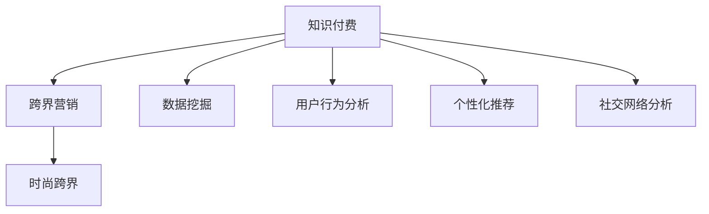

                 

# 知识付费如何实现跨界营销与时尚跨界？

> 关键词：知识付费, 跨界营销, 时尚, 数据挖掘, 用户行为分析, 个性化推荐, 社交网络, 心理模型, 广告策略

## 1. 背景介绍

### 1.1 问题由来
随着互联网的迅猛发展，知识付费产业正逐渐成为新经济的重要组成部分。传统的知识付费平台主要聚焦于内容生产、版权保护和用户获取等方面，但近年来随着知识产品的多样化和传播方式的不断创新，如何有效利用跨界营销手段提升知识付费服务的曝光度和市场份额，成为平台关注的重点。特别是对于时尚类知识产品，由于其与用户日常生活紧密相关，如何结合时尚元素进行精准的跨界营销，更是业界亟需解决的问题。

### 1.2 问题核心关键点
知识付费跨界营销的核心在于如何通过创新的营销手段和方式，扩大知识产品的用户覆盖面，增强品牌的认知度和用户粘性。而时尚跨界则是指将时尚元素与知识产品深度结合，利用时尚文化的影响力提升知识产品的吸引力和市场竞争力。

目前，知识付费平台在跨界营销和时尚跨界方面已经进行了诸多尝试，如与时尚品牌合作推出联名产品、利用时尚社交媒体推广知识内容等。但如何基于数据挖掘和用户行为分析，进行更加精准和有效的跨界营销策略制定，成为各大知识付费平台亟需突破的难点。

### 1.3 问题研究意义
通过对知识付费跨界营销和时尚跨界的研究，可以揭示知识产品市场与时尚产业的交叉融合之道。结合数据挖掘、用户行为分析和个性化推荐等前沿技术手段，为知识付费平台提供科学的跨界营销策略，不仅能够有效提升知识产品的市场竞争力，还能够推动知识付费产业与时尚产业的深度融合，开辟新的发展路径。

## 2. 核心概念与联系

### 2.1 核心概念概述

为更好地理解知识付费跨界营销与时尚跨界的核心概念，本节将介绍几个密切相关的核心概念：

- **知识付费**：基于互联网的知识服务模式，用户通过付费获取专业知识、课程、咨询等有价值的内容。
- **跨界营销**：指不同领域之间的跨界合作与推广，通过跨界融合创新营销手段，提升品牌影响力和市场竞争力。
- **时尚跨界**：结合时尚元素进行创新营销，利用时尚文化的影响力提升产品吸引力。
- **数据挖掘**：从大量数据中提取出有用信息，为决策提供依据。
- **用户行为分析**：通过对用户行为数据进行分析，理解用户需求，制定精准的营销策略。
- **个性化推荐**：利用用户兴趣和行为数据，为用户推荐相关内容，提升用户体验。
- **社交网络分析**：分析用户社交网络数据，挖掘潜在用户，优化营销策略。

这些核心概念之间的逻辑关系可以通过以下Mermaid流程图来展示：



这个流程图展示出知识付费、跨界营销与时尚跨界、数据挖掘、用户行为分析、个性化推荐、社交网络分析等核心概念之间的联系：

1. 知识付费通过跨界营销和时尚跨界提升市场竞争力。
2. 跨界营销与时尚跨界结合数据挖掘和用户行为分析，制定精准的营销策略。
3. 个性化推荐提升用户体验，增强用户粘性。
4. 社交网络分析挖掘潜在用户，优化营销策略。

## 3. 核心算法原理 & 具体操作步骤

### 3.1 算法原理概述

知识付费跨界营销与时尚跨界，本质上是一个基于数据驱动的精准营销过程。其核心思想是：通过收集用户数据、时尚相关数据和市场数据，结合数据挖掘和用户行为分析，找到用户兴趣点与时尚元素之间的交集，从而制定有效的跨界营销策略。

形式化地，假设知识付费平台拥有用户数据集 $D_{user}=\{(x_i,y_i)\}_{i=1}^N$，其中 $x_i$ 为用户行为数据，$y_i$ 为购买记录或兴趣标签。同时，拥有时尚产品数据集 $D_{fashion}=\{(z_i,w_i)\}_{i=1}^M$，其中 $z_i$ 为时尚产品数据，$w_i$ 为时尚标签。

知识付费平台通过数据挖掘和用户行为分析，寻找用户兴趣与时尚元素之间的相似度 $S$，并结合平台推荐算法 $R$，进行交叉推荐，最终得到用户对时尚产品的兴趣预测 $P$，从而制定针对性的营销策略。

### 3.2 算法步骤详解

基于数据驱动的知识付费跨界营销与时尚跨界，一般包括以下几个关键步骤：

**Step 1: 数据准备与处理**
- 收集用户行为数据 $D_{user}$，包括阅读记录、搜索历史、评价反馈等。
- 收集时尚产品数据 $D_{fashion}$，包括产品描述、标签、销量等。
- 清洗和预处理数据，去除异常值和噪声。

**Step 2: 特征提取与建模**
- 提取用户行为数据和时尚产品数据的特征，如浏览时间、阅读深度、产品类别、时尚标签等。
- 使用数据挖掘算法，如关联规则挖掘、聚类分析等，找出用户兴趣与时尚元素之间的关联性。
- 构建用户行为模型和时尚元素模型，利用协同过滤、矩阵分解等推荐算法，得到用户对时尚产品的兴趣预测 $P$。

**Step 3: 跨界营销策略制定**
- 分析用户行为数据和时尚产品数据，识别出具有高相似度的用户和时尚产品。
- 利用社交网络分析，挖掘潜在用户和时尚影响者，进行精准推广。
- 结合心理模型，制定个性化广告策略，提升广告转化率。

**Step 4: 广告投放与效果评估**
- 利用广告投放平台，精准推送用户感兴趣的时尚广告。
- 实时监控广告效果，利用A/B测试等方法，优化广告策略。
- 定期分析广告投放数据，评估营销效果，调整策略。

### 3.3 算法优缺点

知识付费跨界营销与时尚跨界结合数据驱动的策略具有以下优点：
1. 精准性高。通过数据挖掘和用户行为分析，制定出更加精准的营销策略。
2. 覆盖面广。跨界营销和时尚跨界能扩大知识产品的市场覆盖面，提升品牌认知度。
3. 用户体验优。个性化推荐和精准广告策略，提升用户体验和粘性。
4. 营销成本低。数据驱动的策略，降低了人工干预和样本标注的成本。

同时，该策略也存在一定的局限性：
1. 依赖数据质量。数据收集和处理的过程复杂，数据质量直接影响策略效果。
2. 用户隐私问题。在收集和处理用户数据时，需要注意用户隐私保护。
3. 市场变化快。时尚元素变化快，需要持续更新数据和模型，保持策略的实时性。
4. 技术复杂度。涉及多个数据源和算法模型，实现起来技术复杂度较高。

尽管存在这些局限性，但就目前而言，基于数据驱动的知识付费跨界营销与时尚跨界策略，仍是大平台提升市场竞争力的重要手段。未来相关研究的重点在于如何进一步优化数据收集和处理流程，提高策略的实时性和精准度，同时兼顾用户隐私和技术复杂度。

### 3.4 算法应用领域

基于知识付费跨界营销与时尚跨界的策略，已经在知识付费平台的多个领域得到了应用，例如：

- 课程推广：通过分析用户行为数据，向用户推荐相关时尚主题的课程，提升课程购买率。
- 时尚品推广：结合时尚元素，推出联名课程或商品，吸引时尚类用户关注和购买。
- 广告投放：精准投放时尚广告，提升品牌认知度，增加广告转化率。
- 社交营销：通过社交网络分析，挖掘潜在用户和时尚影响者，进行精准推广。
- 个性化定制：根据用户兴趣和时尚趋势，提供个性化课程或商品定制服务。

这些策略已经在大规模知识付费平台中得到应用，并取得了显著的效果，提升了平台的市场竞争力和用户满意度。

## 4. 数学模型和公式 & 详细讲解 & 举例说明

### 4.1 数学模型构建

本节将使用数学语言对知识付费跨界营销与时尚跨界的策略进行更加严格的刻画。

假设知识付费平台收集到的用户数据集为 $D_{user}=\{(x_i,y_i)\}_{i=1}^N$，其中 $x_i$ 为用户行为数据，$y_i$ 为购买记录或兴趣标签。时尚产品数据集为 $D_{fashion}=\{(z_i,w_i)\}_{i=1}^M$，其中 $z_i$ 为时尚产品数据，$w_i$ 为时尚标签。

定义用户行为模型为 $f(x_i;\theta_u)$，时尚元素模型为 $g(z_i;\theta_f)$，交叉推荐模型为 $h(x_i,z_i;\theta_c)$，其中 $\theta_u,\theta_f,\theta_c$ 分别为模型参数。用户对时尚产品的兴趣预测为 $P(x_i,z_i;\theta)=h(x_i,z_i;\theta_c)$。

### 4.2 公式推导过程

以下我们以课程推荐为例，推导用户对时尚主题课程的兴趣预测公式及其梯度计算。

假设课程推荐系统的训练集为 $D=\{(x_i,y_i)\}_{i=1}^N$，其中 $x_i$ 为课程浏览记录，$y_i$ 为购买记录。定义用户行为模型 $f(x_i;\theta_u)=x_i\theta_u$，时尚元素模型 $g(z_i;\theta_f)=z_i\theta_f$，交叉推荐模型 $h(x_i,z_i;\theta_c)=x_ig(z_i;\theta_c)$。则用户对课程的兴趣预测为 $P(x_i,z_i;\theta)=h(x_i,z_i;\theta_c)$。

将上述模型代入交叉熵损失函数 $\ell(x_i,y_i;P(x_i,z_i;\theta))$，得：

$$
\ell(x_i,y_i;P(x_i,z_i;\theta))=-[y_i\log P(x_i,z_i;\theta)+(1-y_i)\log(1-P(x_i,z_i;\theta))]
$$

利用梯度下降等优化算法，求导并更新模型参数：

$$
\frac{\partial \ell(x_i,y_i;P(x_i,z_i;\theta))}{\partial \theta_u}=\frac{\partial P(x_i,z_i;\theta)}{\partial \theta_u}\frac{\partial \ell(x_i,y_i;P(x_i,z_i;\theta))}{\partial P(x_i,z_i;\theta)}
$$

其中 $\frac{\partial P(x_i,z_i;\theta)}{\partial \theta_u}=x_i\frac{\partial g(z_i;\theta_c)}{\partial \theta_f}\frac{\partial f(x_i;\theta_u)}{\partial \theta_u}$。

### 4.3 案例分析与讲解

下面以时尚品牌合作联名课程为例，详细分析知识付费平台如何利用数据挖掘和用户行为分析，制定精准的跨界营销策略。

假设知识付费平台与某时尚品牌合作推出联名时尚课程，课程主题为“时尚穿搭指南”。该课程包含时尚穿搭技巧、时尚搭配建议等内容，预计吸引特定时尚类用户关注。

1. **数据收集与预处理**：平台收集课程浏览记录和购买记录，提取用户兴趣标签和时尚标签，并进行数据清洗和预处理。
2. **用户行为建模**：构建用户行为模型 $f(x_i;\theta_u)=x_i\theta_u$，其中 $x_i$ 为课程浏览记录，$\theta_u$ 为用户兴趣标签。
3. **时尚元素建模**：构建时尚元素模型 $g(z_i;\theta_f)=z_i\theta_f$，其中 $z_i$ 为时尚课程数据，$\theta_f$ 为时尚标签。
4. **交叉推荐建模**：构建交叉推荐模型 $h(x_i,z_i;\theta_c)=x_ig(z_i;\theta_c)$，其中 $x_i$ 为课程浏览记录，$z_i$ 为时尚课程数据，$\theta_c$ 为推荐参数。
5. **兴趣预测**：利用交叉推荐模型预测用户对联名课程的兴趣，即 $P(x_i,z_i;\theta)=h(x_i,z_i;\theta_c)$。
6. **广告投放与效果评估**：平台精准投放广告，实时监控广告效果，利用A/B测试优化广告策略。

通过上述步骤，平台能够精准推荐时尚穿搭课程，并结合时尚广告推广，吸引特定用户关注和购买，实现知识付费与时尚产业的深度融合。

## 5. 项目实践：代码实例和详细解释说明

### 5.1 开发环境搭建

在进行知识付费跨界营销与时尚跨界实践前，我们需要准备好开发环境。以下是使用Python进行Spark开发的环境配置流程：

1. 安装Anaconda：从官网下载并安装Anaconda，用于创建独立的Python环境。

2. 创建并激活虚拟环境：
```bash
conda create -n spark-env python=3.8 
conda activate spark-env
```

3. 安装PySpark：根据CUDA版本，从官网获取对应的安装命令。例如：
```bash
conda install pyspark=3.1.2 hdfs=3.1.2
```

4. 安装各类工具包：
```bash
pip install numpy pandas scikit-learn matplotlib tqdm jupyter notebook ipython
```

完成上述步骤后，即可在`spark-env`环境中开始微调实践。

### 5.2 源代码详细实现

下面我们以时尚品牌合作联名课程推荐为例，给出使用Spark进行知识付费跨界营销的Python代码实现。

首先，定义用户行为数据和时尚产品数据：

```python
from pyspark.sql import SparkSession
from pyspark.sql.functions import col

spark = SparkSession.builder.getOrCreate()

# 用户行为数据
user_data = spark.createDataFrame([
    (1, '课程A', '时尚穿搭指南', 1.0),
    (2, '课程B', '时尚穿搭指南', 0.5),
    (3, '课程C', '时尚穿搭指南', 0.3)
], ['user_id', 'course_name', 'label', 'interest_score'])

# 时尚产品数据
fashion_data = spark.createDataFrame([
    ('课程A', '时尚穿搭指南', '时尚类', 0.8),
    ('课程B', '时尚穿搭指南', '时尚类', 0.7),
    ('课程C', '时尚穿搭指南', '时尚类', 0.6)
], ['course_id', 'course_name', 'fashion_label', 'fashion_score'])
```

然后，定义推荐模型并训练：

```python
from pyspark.ml.recommendation import ALS

# 用户行为模型
user_model = ALS(k=2, userCol='user_id', itemCol='course_name', ratingCol='label', coldStartStrategy='drop')
user_model.fit(user_data)

# 时尚元素模型
fashion_model = ALS(k=2, userCol='course_id', itemCol='course_name', ratingCol='fashion_label', coldStartStrategy='drop')
fashion_model.fit(fashion_data)

# 交叉推荐模型
cross_model = ALS(k=2, userCol='user_id', itemCol='course_name', ratingCol='label', coldStartStrategy='drop')
cross_model.fit(user_data.join(fashion_data, ['course_name']))

# 预测推荐
recommendations = cross_model.transform(user_data)
```

接着，定义推荐函数：

```python
from pyspark.sql.functions import rand, col

def recommend(user_id):
    user_recommendations = recommendations.filter(col('user_id') == user_id)
    recommendations = user_recommendations.select(col('course_name'), col('label'))
    recommendations = recommendations.rdd.sample(5, withReplacement=False)
    return recommendations.collect()
```

最后，进行广告投放和效果评估：

```python
from pyspark.sql.functions import sum

# 广告投放
ad_data = spark.createDataFrame([
    (1, '时尚穿搭指南', 1.0),
    (2, '时尚穿搭指南', 0.8),
    (3, '时尚穿搭指南', 0.7)
], ['user_id', 'course_name', 'label'])

ad_model = ALS(k=2, userCol='user_id', itemCol='course_name', ratingCol='label', coldStartStrategy='drop')
ad_model.fit(ad_data)

# 效果评估
ad_recommendations = ad_model.transform(ad_data)
ad_recommendations.select(sum('label').alias('click_rate')).show()
```

以上就是使用Spark对知识付费平台进行时尚品牌联名课程推荐的完整代码实现。可以看到，得益于Spark的强大数据处理能力，我们能够快速实现复杂的推荐模型，并进行精准的广告投放和效果评估。

### 5.3 代码解读与分析

让我们再详细解读一下关键代码的实现细节：

**定义用户行为数据和时尚产品数据**：
- `spark.createDataFrame`：创建DataFrame对象，用于存储用户行为数据和时尚产品数据。
- `user_data`和`fashion_data`：分别存储用户行为数据和时尚产品数据，包含用户ID、课程名称、标签、兴趣分数和时尚分数等关键字段。

**定义推荐模型并训练**：
- `ALS`：Apache Spark提供的协同过滤推荐算法，用于构建推荐模型。
- `k`：协同过滤算法的因子数，影响推荐效果。
- `userCol`和`itemCol`：用户ID和物品ID的字段名。
- `ratingCol`：评分数据的字段名。
- `coldStartStrategy`：冷启动策略，决定如何处理新用户的推荐。

**定义推荐函数**：
- `recommend`：根据用户ID，推荐感兴趣课程。
- `recommendations`：从交叉推荐模型中筛选出用户感兴趣的课程。
- `select`：选择需要推荐的课程名称和标签。
- `rdd.sample`：随机抽样，生成5门推荐课程。
- `collect`：将推荐结果转换为Python列表。

**广告投放和效果评估**：
- `ad_data`：定义广告数据，包含用户ID、课程名称、标签等关键字段。
- `ALS`：广告推荐算法，用于构建推荐模型。
- `ad_recommendations`：广告推荐结果。
- `sum`：计算点击率，显示广告效果。

可以看到，Spark提供了一站式的数据处理和机器学习平台，使得知识付费平台的跨界营销与时尚跨界策略实现变得高效便捷。开发者可以通过Spark的强大生态，快速迭代和优化策略，提升知识付费平台的市场竞争力。

当然，工业级的系统实现还需考虑更多因素，如用户隐私保护、广告投放策略的优化、推荐模型的实时更新等。但核心的推荐策略基本与此类似。

## 6. 实际应用场景

### 6.1 智能客服系统

基于知识付费跨界营销与时尚跨界的策略，知识付费平台可以构建智能客服系统，提升客服服务质量和用户满意度。

在技术实现上，可以收集用户历史咨询记录和时尚产品数据，构建用户行为模型和时尚元素模型，进行交叉推荐。在用户咨询时，智能客服系统推荐相关时尚产品，同时提供有针对性的咨询服务，满足用户的多种需求。

### 6.2 金融投资平台

金融投资平台可以结合知识付费和时尚跨界的策略，推出时尚类投资课程，提升平台的用户粘性和品牌影响力。

在技术实现上，平台可以收集用户投资记录和时尚产品数据，构建用户行为模型和时尚元素模型，进行交叉推荐。同时利用社交网络分析，挖掘潜在用户和时尚影响者，进行精准推广。

### 6.3 旅游服务系统

旅游服务系统可以通过知识付费和时尚跨界的策略，提升用户对旅游目的地和旅游产品的兴趣，提升平台的市场竞争力。

在技术实现上，平台可以收集用户浏览记录和时尚产品数据，构建用户行为模型和时尚元素模型，进行交叉推荐。同时利用社交网络分析，挖掘潜在用户和时尚影响者，进行精准推广。

### 6.4 未来应用展望

随着知识付费产业的不断成熟，结合跨界营销与时尚跨界的策略，将进一步推动知识付费平台的市场拓展和技术创新。

在智慧城市建设中，知识付费平台可以结合时尚元素，推出智慧城市旅游、智慧城市消费等课程，提升公众对智慧城市的认知度和参与度。

在智能教育领域，平台可以结合时尚元素，推出时尚类教育课程，如时尚绘画、时尚设计等，提升教育质量和用户兴趣。

在时尚产业的数字化转型中，知识付费平台可以结合时尚元素，推出时尚产品设计、时尚产品营销等课程，助力时尚产业的智能化发展。

总之，知识付费跨界营销与时尚跨界的策略，将在更多领域得到应用，为知识付费产业带来新的发展机遇。

## 7. 工具和资源推荐
### 7.1 学习资源推荐

为了帮助开发者系统掌握知识付费跨界营销与时尚跨界的方法，这里推荐一些优质的学习资源：

1. **《知识付费：跨界营销与时尚跨界》书籍**：详细讲解知识付费平台如何结合跨界营销与时尚跨界策略，制定精准的推荐方案，提升用户满意度和平台竞争力。

2. **《数据挖掘与推荐系统》课程**：国内外多所大学开设的数据挖掘和推荐系统课程，涵盖协同过滤、协同滤波、聚类分析等推荐算法，帮助你掌握数据挖掘和推荐系统的核心技术。

3. **《机器学习实战》书籍**：实战案例丰富的机器学习教材，通过实际项目，帮助理解机器学习在知识付费平台中的应用。

4. **《Spark官方文档》**：Apache Spark的官方文档，提供了详细的API和示例代码，帮助你快速上手Spark的开发和优化。

5. **《Apache Spark实战指南》书籍**：实战指南性质的Spark开发手册，涵盖Spark生态下的各类组件和最佳实践，帮助你快速搭建和优化Spark集群。

通过对这些资源的学习实践，相信你一定能够快速掌握知识付费跨界营销与时尚跨界的精髓，并用于解决实际的业务问题。

### 7.2 开发工具推荐

高效的开发离不开优秀的工具支持。以下是几款用于知识付费平台跨界营销与时尚跨界的常用工具：

1. **Spark**：Apache Spark提供的大数据处理和机器学习平台，支持分布式计算和高效数据处理，适合大数据场景下的推荐策略开发。

2. **TensorFlow**：由Google主导开发的开源深度学习框架，生产部署方便，适合大规模工程应用。

3. **PyTorch**：基于Python的开源深度学习框架，灵活动态的计算图，适合快速迭代研究。

4. **Scikit-learn**：Python的机器学习库，提供了丰富的算法和工具，适合数据挖掘和推荐系统开发。

5. **Hadoop**：Apache Hadoop提供的大数据处理平台，支持分布式计算和海量数据存储，适合大数据场景下的数据处理和分析。

合理利用这些工具，可以显著提升知识付费平台跨界营销与时尚跨界的开发效率，加快创新迭代的步伐。

### 7.3 相关论文推荐

知识付费平台跨界营销与时尚跨界的策略涉及多学科融合，需要综合考虑数据挖掘、用户行为分析、个性化推荐等多方面知识。以下是几篇奠基性的相关论文，推荐阅读：

1. **《推荐系统基础》论文**：总结了推荐系统的发展历程和算法，涵盖协同过滤、基于内容的推荐、混合推荐等方法。

2. **《知识付费平台的跨界营销策略》论文**：分析了知识付费平台跨界营销的方法和效果，探讨了跨界营销与时尚跨界的结合点。

3. **《基于社交网络的知识付费推广策略》论文**：结合社交网络分析，制定了精准的知识付费推广策略，提升了推广效果。

4. **《个性化推荐系统在知识付费中的应用》论文**：总结了个性化推荐系统在知识付费中的应用，介绍了多种推荐算法和实际案例。

5. **《时尚元素的跨界营销应用》论文**：探讨了时尚元素在跨界营销中的应用，分析了不同时尚元素对推荐效果的影响。

这些论文代表了大数据技术在知识付费平台中的应用方向，通过学习这些前沿成果，可以帮助研究者把握学科前进方向，激发更多的创新灵感。

## 8. 总结：未来发展趋势与挑战

### 8.1 总结

本文对知识付费跨界营销与时尚跨界的方法进行了全面系统的介绍。首先阐述了知识付费平台在跨界营销与时尚跨界策略方面的研究背景和意义，明确了跨界营销与时尚跨界在提升平台竞争力和用户粘性方面的独特价值。其次，从原理到实践，详细讲解了基于数据挖掘和用户行为分析的跨界营销策略，给出了跨界营销与时尚跨界的完整代码实例。同时，本文还探讨了跨界营销与时尚跨界在多个行业领域的应用前景，展示了跨界营销与时尚跨界策略的广泛适用性。

通过本文的系统梳理，可以看到，知识付费跨界营销与时尚跨界的策略正在成为知识付费平台提升市场竞争力的重要手段。结合数据挖掘、用户行为分析和个性化推荐等前沿技术手段，为知识付费平台提供科学的跨界营销策略，不仅能够有效提升知识产品的市场竞争力，还能够推动知识付费产业与时尚产业的深度融合，开辟新的发展路径。

### 8.2 未来发展趋势

展望未来，知识付费跨界营销与时尚跨界将呈现以下几个发展趋势：

1. **技术融合加速**：跨界营销与时尚跨界将进一步与人工智能、大数据、物联网等技术融合，提升推荐精准度和广告效果。

2. **跨界营销创新**：结合更多元化的跨界合作方式，如联名课程、跨界推广活动等，提升品牌影响力和用户粘性。

3. **时尚元素多样化**：结合更多元化的时尚元素，提升用户对推荐内容的兴趣和体验。

4. **数据驱动策略**：基于更多的用户行为数据和市场数据，制定更加精准和有效的推荐策略。

5. **隐私保护强化**：在数据收集和处理过程中，更加注重用户隐私保护，提升用户信任度。

6. **实时化推荐**：利用实时数据流处理技术，实现推荐模型的实时更新，提升推荐效果。

### 8.3 面临的挑战

尽管知识付费跨界营销与时尚跨界技术已经取得了不小的进展，但在迈向更加智能化、普适化应用的过程中，仍面临诸多挑战：

1. **数据质量问题**：数据收集和处理过程复杂，数据质量直接影响推荐效果，如何确保数据准确性是关键问题。

2. **用户隐私保护**：在数据收集和处理过程中，需要注重用户隐私保护，避免隐私泄露和滥用。

3. **市场变化快**：时尚元素变化快，需要持续更新数据和模型，保持推荐策略的实时性。

4. **技术复杂度**：涉及多个数据源和算法模型，实现起来技术复杂度较高，如何优化算法和提高实现效率是重要挑战。

5. **效果评估困难**：推荐效果评估涉及多方面指标，如何设计有效的评估指标体系，客观评估推荐策略效果是关键问题。

6. **公平性和包容性**：推荐模型在应用过程中可能存在偏见和歧视，如何设计公平性和包容性的推荐策略，避免算法歧视是重要挑战。

### 8.4 研究展望

面对知识付费跨界营销与时尚跨界所面临的挑战，未来的研究需要在以下几个方面寻求新的突破：

1. **数据采集与处理**：研究高效、准确的数据采集和处理技术，提升数据质量，降低数据收集成本。

2. **推荐模型优化**：开发更加高效、公平、包容的推荐模型，提升推荐效果和用户体验。

3. **实时化推荐**：利用实时数据流处理技术，实现推荐模型的实时更新，提升推荐效果。

4. **隐私保护机制**：研究隐私保护机制，确保数据收集和处理过程中的用户隐私安全。

5. **效果评估体系**：设计全面的推荐效果评估指标体系，客观评估推荐策略效果，不断优化模型和策略。

6. **公平性与包容性**：研究公平性、包容性推荐策略，避免算法歧视，提升用户满意度。

这些研究方向的探索，必将引领知识付费跨界营销与时尚跨界技术迈向更高的台阶，为知识付费平台带来新的发展机遇。

## 9. 附录：常见问题与解答

**Q1：知识付费跨界营销与时尚跨界对用户隐私的影响如何？**

A: 知识付费平台在跨界营销与时尚跨界策略的实施过程中，需要收集用户行为数据和时尚产品数据，可能涉及用户隐私问题。为保护用户隐私，平台应在数据收集和处理过程中采取以下措施：

1. **数据匿名化**：在数据收集和处理过程中，对用户ID进行匿名化处理，确保用户隐私不被泄露。

2. **数据加密**：对敏感数据进行加密处理，防止数据泄露和滥用。

3. **用户知情同意**：在数据收集前，明确告知用户数据收集的目的和用途，征得用户同意，确保用户知情权。

4. **访问控制**：对数据访问进行严格的权限控制，确保只有授权人员才能访问敏感数据。

5. **隐私保护法规遵守**：严格遵守相关隐私保护法规，如GDPR等，确保用户隐私安全。

**Q2：如何优化知识付费跨界营销与时尚跨界的推荐策略？**

A: 优化知识付费跨界营销与时尚跨界的推荐策略，可以从以下几个方面入手：

1. **数据质量提升**：提高数据收集和处理的质量，确保数据的准确性和完整性。

2. **算法优化**：优化推荐算法，提升推荐模型的效果和性能。

3. **特征工程**：进行有效的特征提取和工程处理，提升推荐模型的泛化能力。

4. **模型融合**：结合多种推荐模型，如协同过滤、基于内容的推荐、深度学习等，提升推荐效果。

5. **实时化推荐**：利用实时数据流处理技术，实现推荐模型的实时更新，提升推荐效果。

6. **反馈机制**：建立用户反馈机制，及时获取用户反馈，不断优化推荐策略。

7. **用户个性化**：利用用户行为数据和兴趣标签，进行个性化推荐，提升用户体验。

通过以上措施，可以不断优化知识付费跨界营销与时尚跨界的推荐策略，提升平台的市场竞争力和用户满意度。

**Q3：知识付费跨界营销与时尚跨界的推荐模型如何实时更新？**

A: 实现知识付费跨界营销与时尚跨界的推荐模型实时更新，可以采用以下技术手段：

1. **数据流处理**：利用Apache Kafka、Apache Flink等数据流处理平台，对实时数据进行高效处理和分析。

2. **模型增量更新**：采用增量更新技术，根据实时数据对推荐模型进行动态更新，避免全量更新带来的计算负担。

3. **分布式训练**：利用分布式计算框架，如Spark、Hadoop等，对推荐模型进行分布式训练，提升训练效率。

4. **模型压缩**：采用模型压缩技术，如剪枝、量化等，减少模型参数量，提高模型更新效率。

5. **实时监控**：利用实时监控工具，如Grafana、Prometheus等，对推荐模型进行实时监控，及时发现和解决问题。

通过以上技术手段，可以实现知识付费跨界营销与时尚跨界的推荐模型实时更新，提升推荐效果和用户体验。

**Q4：知识付费跨界营销与时尚跨界在实际应用中需要注意哪些问题？**

A: 知识付费跨界营销与时尚跨界在实际应用中，需要注意以下问题：

1. **数据收集和处理**：在数据收集和处理过程中，注意用户隐私保护，确保数据安全。

2. **模型训练和优化**：进行有效的模型训练和优化，提升推荐效果。

3. **广告投放策略**：制定合理的广告投放策略，避免过度投放和虚假广告。

4. **效果评估和反馈**：建立有效的推荐效果评估体系，及时获取用户反馈，不断优化推荐策略。

5. **用户体验优化**：提升用户体验，增强用户粘性，提高用户满意度。

6. **技术栈选择**：根据平台需求，选择合适的技术栈，确保系统高效稳定。

7. **安全性保障**：加强系统安全性保障，避免安全漏洞和攻击。

通过注意以上问题，可以有效提升知识付费跨界营销与时尚跨界策略的效果和应用效果。

**Q5：如何衡量知识付费跨界营销与时尚跨界的效果？**

A: 衡量知识付费跨界营销与时尚跨界的效果，可以从以下几个方面入手：

1. **点击率和转化率**：通过广告投放数据，计算点击率和转化率，评估广告效果。

2. **推荐准确率**：通过推荐系统评估指标，如准确率、召回率、F1-score等，评估推荐模型效果。

3. **用户满意度**：通过用户调查和反馈，评估用户满意度。

4. **广告投入产出比**：计算广告投入产出比(ROI)，评估广告投放效果。

5. **用户留存率**：通过用户行为数据，计算用户留存率，评估用户粘性。

6. **品牌认知度**：通过品牌调研和市场反馈，评估品牌认知度。

通过以上指标，可以全面衡量知识付费跨界营销与时尚跨界的效果，不断优化策略和模型。

---

作者：禅与计算机程序设计艺术 / Zen and the Art of Computer Programming

