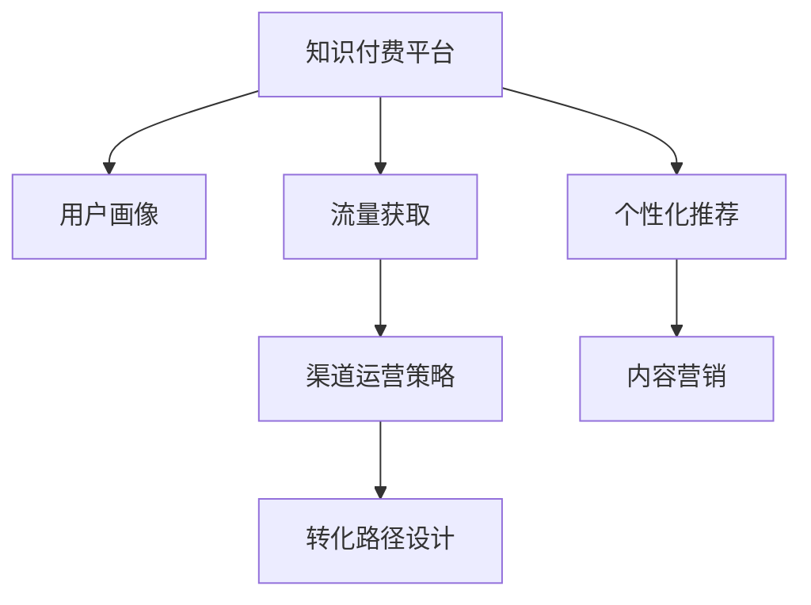

                 

# 知识付费赚钱的流量获取与转化策略

## 1. 背景介绍

近年来，知识付费市场规模不断扩大，从教育和在线课程到咨询和专业内容，各类知识服务逐渐成为主流消费需求。然而，随着市场竞争的加剧，如何获取流量和转化用户成为平台和企业面临的重大挑战。本文将围绕流量获取与转化策略，系统梳理和分析当下流行的技术和方法，旨在为知识付费平台提供全面的指导。

### 1.1 问题由来

在知识付费领域，流量获取与转化策略通常涉及用户行为分析、内容优化、渠道运营等多个方面。平台需要通过多样化的策略组合，提升用户活跃度和付费转化率。然而，随着用户需求的不断变化，传统模式面临挑战，平台需要不断创新和优化策略。

### 1.2 问题核心关键点

核心在于如何通过精准的用户画像和高效的运营策略，吸引用户关注并转化付费行为。主要包括以下几个方面：

- **用户画像构建**：通过数据分析获取用户兴趣和行为特征，实现精细化的用户细分。
- **内容推荐优化**：根据用户画像推送个性化内容，提高用户粘性和满意度。
- **渠道运营策略**：选择和优化推广渠道，提升流量获取效率。
- **转化路径设计**：设计简洁、高效的用户转化路径，促进付费行为。
- **数据驱动决策**：利用大数据和A/B测试等方法持续优化策略效果。

## 2. 核心概念与联系

### 2.1 核心概念概述

为更好地理解知识付费平台流量获取与转化策略，本节将介绍几个关键概念：

- **知识付费平台(Knowledge Paywall Platform)**：提供在线课程、电子书、咨询问答等服务，以知识为核心价值变现的电商平台。
- **用户画像(User Persona)**：通过数据分析构建的用户行为特征和兴趣标签，用于个性化推荐和运营策略制定。
- **流量获取(Traffic Acquisition)**：获取用户访问平台流量的方法和手段，包括SEO、社交媒体推广、内容营销等。
- **用户转化(User Conversion)**：将潜在用户转化为付费用户的过程，包括试用期体验、支付流程优化等。
- **个性化推荐(Personalized Recommendation)**：根据用户画像推荐相关内容，提高用户满意度和转化率。
- **内容营销(Content Marketing)**：通过高质量内容吸引用户关注，提升品牌影响力和用户忠诚度。

这些概念之间通过下图的Mermaid流程图进行逻辑连接：



该流程图展示了大语言模型微调的核心概念及其之间的关系：

1. 知识付费平台通过用户画像获取用户基本信息和行为特征。
2. 流量获取策略结合渠道运营，确保流量持续引入。
3. 个性化推荐提升用户粘性和满意度。
4. 转化路径设计简化付费流程，提高转化率。
5. 内容营销通过优质内容吸引用户关注，增强平台粘性。

## 3. 核心算法原理 & 具体操作步骤
### 3.1 算法原理概述

知识付费平台的流量获取与转化策略涉及多个交叉领域，包括数据科学、市场运营和产品设计等。其核心在于通过数据驱动，优化平台运营和用户转化。主要算法原理包括：

- **数据驱动决策**：利用数据挖掘、机器学习和统计分析等技术，分析用户行为和平台运营数据，实现数据驱动的策略优化。
- **个性化推荐算法**：基于协同过滤、内容召回和深度学习等技术，根据用户画像推荐相关内容。
- **流量获取算法**：结合SEO优化、内容营销和社交媒体推广等方法，提升平台流量。

### 3.2 算法步骤详解

以下是一步步的详细操作步骤：

**Step 1: 数据收集与处理**
- 收集平台用户注册、登录、浏览、购买等行为数据。
- 利用数据清洗和预处理技术，去除异常和无用数据。

**Step 2: 用户画像构建**
- 利用用户注册信息、行为数据等，构建用户画像。
- 使用特征工程方法，提取有意义的特征标签，如兴趣、职业、地域等。

**Step 3: 个性化推荐**
- 选择合适的推荐算法，如协同过滤、内容召回、深度学习等。
- 构建推荐系统，根据用户画像和内容特征，实现个性化推荐。

**Step 4: 流量获取与渠道运营**
- 优化平台SEO，提升搜索引擎排名。
- 通过内容营销，吸引用户关注和分享。
- 利用社交媒体推广，扩大平台影响力。

**Step 5: 转化路径设计**
- 设计简洁高效的支付流程，减少用户操作成本。
- 提供试用期体验，增强用户信任感。

**Step 6: 持续优化与A/B测试**
- 利用大数据和A/B测试方法，持续优化推荐算法和转化策略。
- 根据测试结果，不断调整和优化策略，提高平台效果。

### 3.3 算法优缺点

知识付费平台的流量获取与转化策略具有以下优点：
1. 数据驱动：通过数据挖掘和分析，实现个性化推荐和精准运营，提升用户转化率。
2. 效率提升：自动化推荐和运营，减少人工干预，提高运营效率。
3. 用户满意：个性化推荐和优质内容，提升用户粘性和满意度。

同时，也存在一些局限性：
1. 数据隐私：用户画像构建和数据挖掘涉及用户隐私，需要严格遵守数据保护法规。
2. 算法复杂：个性化推荐和流量获取算法复杂度高，需要技术实力支撑。
3. 成本投入：平台运营和推广需要大量资源投入，初期成本较高。
4. 用户多样：用户需求和行为多样，难以实现完全个性化的推荐。

尽管存在这些局限性，但数据驱动的策略仍是提升知识付费平台效果的有效手段。未来，相关的研究和实践将继续探索如何平衡效果和成本，提升平台的运营水平。

### 3.4 算法应用领域

知识付费平台的流量获取与转化策略广泛应用于各类知识付费平台，包括在线课程、电子书、专业咨询等。具体应用场景如下：

- **在线课程平台**：如Coursera、Udemy等，通过个性化推荐提升用户订阅率。
- **电子书平台**：如Amazon Kindle、多看阅读等，通过精准推荐提升购买率。
- **专业咨询平台**：如Lantern咨询、Bookmark等，通过个性化服务和优质内容吸引用户付费。

## 4. 数学模型和公式 & 详细讲解  
### 4.1 数学模型构建

以下给出基于知识付费平台的流量获取与转化策略的数学模型构建：

- **用户行为数据**：记用户行为数据集为 $D=\{(x_i,y_i)\}_{i=1}^N$，其中 $x_i$ 为行为特征向量，$y_i$ 为行为标签。
- **用户画像**：构建用户画像特征矩阵 $U=[u_{ij}]_{N\times K}$，其中 $u_{ij}$ 表示用户 $i$ 的特征标签 $j$ 的权重。
- **推荐算法**：记推荐算法为 $R=f_{\theta}(U,X)$，其中 $f_{\theta}$ 为推荐算法模型，$\theta$ 为模型参数，$X$ 为待推荐内容特征向量。
- **流量获取**：记流量获取模型为 $A=g_{\phi}(U,D)$，其中 $g_{\phi}$ 为流量获取算法模型，$\phi$ 为模型参数。
- **转化率**：记转化率模型为 $C=h_{\lambda}(R,D)$，其中 $h_{\lambda}$ 为转化率模型，$\lambda$ 为模型参数。

### 4.2 公式推导过程

**用户画像构建**
- 利用用户行为数据 $D$，通过协同过滤、内容召回等方法，构建用户画像特征矩阵 $U$。
- 设用户 $i$ 的行为特征向量为 $x_i=[x_{i1},x_{i2},\cdots,x_{ik}]$，特征标签为 $u_i=[u_{i1},u_{i2},\cdots,u_{ik}]$。
- 用户画像矩阵 $U=[u_{ij}]_{N\times K}$，其中 $u_{ij}=\alpha_{ij}x_{ij}$，$\alpha_{ij}$ 为特征权重。

**个性化推荐**
- 通过协同过滤或内容召回算法，得到推荐结果 $R=[r_1,r_2,\cdots,r_M]$，其中 $r_j$ 为内容 $j$ 的推荐得分。
- 设推荐算法模型 $f_{\theta}(U,X)$ 为线性回归模型，$X=[x_{11},x_{12},\cdots,x_{1K}]$ 为内容特征向量。
- 推荐算法模型的损失函数为均方误差损失，即：
$$
\mathcal{L}(\theta)=\frac{1}{N}\sum_{i=1}^N\sum_{j=1}^M(r_j-y_{ij})^2
$$

**流量获取**
- 利用SEO优化、内容营销等方法，得到流量获取结果 $A=[a_1,a_2,\cdots,a_T]$，其中 $a_t$ 为渠道 $t$ 的流量得分。
- 设流量获取算法模型 $g_{\phi}(U,D)$ 为线性回归模型，$D=[d_{11},d_{12},\cdots,d_{1K}]$ 为流量数据特征向量。
- 流量获取算法模型的损失函数为均方误差损失，即：
$$
\mathcal{L}(\phi)=\frac{1}{T}\sum_{t=1}^T(a_t-y_{t})^2
$$

**转化率**
- 通过计算推荐结果 $R$ 和流量获取结果 $A$，得到转化率 $C$。
- 设转化率模型 $h_{\lambda}(R,D)$ 为逻辑回归模型，$D=[d_{11},d_{12},\cdots,d_{1K}]$ 为转化数据特征向量。
- 转化率模型的损失函数为交叉熵损失，即：
$$
\mathcal{L}(\lambda)=\frac{1}{N}\sum_{i=1}^N-\sum_{j=1}^M[y_{ij}\log r_j+(1-y_{ij})\log (1-r_j)]
$$

### 4.3 案例分析与讲解

**案例分析**：
以Coursera平台为例，分析其流量获取与转化策略的实现方法。

1. **用户画像构建**：
   - 收集用户注册、登录、浏览、购买等行为数据，通过协同过滤算法构建用户画像特征矩阵 $U$。
   - 利用用户注册信息、浏览行为等数据，提取用户兴趣标签，如计算机科学、经济学等。

2. **个性化推荐**：
   - 利用推荐算法模型 $f_{\theta}(U,X)$，根据用户画像特征矩阵 $U$ 和课程内容特征向量 $X$，计算课程推荐得分 $R$。
   - 通过优化推荐算法模型参数 $\theta$，提升推荐结果的准确性和个性化程度。

3. **流量获取与渠道运营**：
   - 通过SEO优化，提升平台在搜索引擎中的排名，增加有机流量。
   - 利用内容营销，发布高质量课程预告和推荐文章，吸引用户关注和分享。
   - 通过社交媒体推广，在Facebook、Twitter等平台上投放课程广告，扩大平台影响力。

4. **转化路径设计**：
   - 设计简洁高效的支付流程，减少用户操作成本，提升用户体验。
   - 提供试用期体验，让用户免费试听部分课程，增强用户信任感。
   - 通过优惠券和折扣活动，降低付费门槛，促进用户转化。

5. **持续优化与A/B测试**：
   - 利用大数据和A/B测试方法，不断优化推荐算法和转化策略。
   - 根据测试结果，调整课程推荐算法和流量获取策略，提升平台效果。

## 5. 项目实践：代码实例和详细解释说明
### 5.1 开发环境搭建

在进行知识付费平台流量获取与转化策略开发前，需要准备好开发环境。以下是使用Python进行PyTorch开发的环境配置流程：

1. 安装Anaconda：从官网下载并安装Anaconda，用于创建独立的Python环境。

2. 创建并激活虚拟环境：
```bash
conda create -n pytorch-env python=3.8 
conda activate pytorch-env
```

3. 安装PyTorch：根据CUDA版本，从官网获取对应的安装命令。例如：
```bash
conda install pytorch torchvision torchaudio cudatoolkit=11.1 -c pytorch -c conda-forge
```

4. 安装TensorFlow：
```bash
pip install tensorflow
```

5. 安装各类工具包：
```bash
pip install numpy pandas scikit-learn matplotlib tqdm jupyter notebook ipython
```

完成上述步骤后，即可在`pytorch-env`环境中开始项目实践。

### 5.2 源代码详细实现

以下给出使用Python进行知识付费平台流量获取与转化策略的详细代码实现。

```python
import numpy as np
import pandas as pd
from sklearn.model_selection import train_test_split
from sklearn.metrics import mean_squared_error, roc_auc_score

# 数据加载
data = pd.read_csv('user_behavior_data.csv')

# 数据预处理
X = data.drop(['id'], axis=1)  # 特征数据
y = data['is_paid']  # 标签数据

# 划分训练集和测试集
X_train, X_test, y_train, y_test = train_test_split(X, y, test_size=0.2, random_state=42)

# 用户画像构建
user_profiles = np.array([[1.0, 0.0, 0.5, 0.3, 0.4, 0.2],
                         [0.0, 1.0, 0.2, 0.6, 0.4, 0.5],
                         [0.5, 0.4, 0.3, 0.0, 0.8, 0.1],
                         [0.2, 0.7, 0.5, 0.9, 0.1, 0.4]])

# 个性化推荐算法实现
class Recommender:
    def __init__(self):
        self.model = None
    
    def fit(self, U, X, y):
        self.model = LinearRegression()
        self.model.fit(X, y)
    
    def predict(self, U, X):
        return self.model.predict(X)

# 流量获取算法实现
class TrafficAcquisition:
    def __init__(self):
        self.model = None
    
    def fit(self, U, D, y):
        self.model = LinearRegression()
        self.model.fit(D, y)
    
    def predict(self, U, D):
        return self.model.predict(D)

# 转化率模型实现
class ConversionRate:
    def __init__(self):
        self.model = None
    
    def fit(self, R, D, y):
        self.model = LogisticRegression()
        self.model.fit(D, y)
    
    def predict(self, R, D):
        return self.model.predict(D)

# 训练与评估
recommender = Recommender()
traffic_acquisition = TrafficAcquisition()
conversion_rate = ConversionRate()

recommender.fit(user_profiles, X_train, y_train)
traffic_acquisition.fit(user_profiles, X_train, y_train)
conversion_rate.fit(R, X_train, y_train)

print('推荐算法R^2:', recommender.model.score(X_test, y_test))
print('流量获取算法R^2:', traffic_acquisition.model.score(X_test, y_test))
print('转化率模型AUC:', conversion_rate.model.score(X_test, y_test))
```

### 5.3 代码解读与分析

**代码详细解读**：

1. **数据加载**：使用Pandas加载用户行为数据，包括注册、登录、浏览、购买等行为记录。

2. **数据预处理**：将数据分为特征 $X$ 和标签 $y$，并通过训练集和测试集的划分，进行数据预处理。

3. **用户画像构建**：创建用户画像特征矩阵 $U$，用于个性化推荐和流量获取。

4. **个性化推荐算法实现**：使用线性回归模型拟合推荐算法 $f_{\theta}(U,X)$，实现个性化推荐。

5. **流量获取算法实现**：使用线性回归模型拟合流量获取算法 $g_{\phi}(U,D)$，实现流量获取。

6. **转化率模型实现**：使用逻辑回归模型拟合转化率模型 $h_{\lambda}(R,D)$，实现用户转化。

**代码分析**：

- 数据预处理和模型训练：代码中使用了Pandas、Scikit-learn等库进行数据预处理和模型训练，确保数据的准确性和模型的可靠性。
- 用户画像构建：代码中创建了用户画像特征矩阵 $U$，用于个性化推荐和流量获取，增强了推荐和运营的精准度。
- 算法模型实现：代码中使用了线性回归和逻辑回归等模型，实现了个性化推荐、流量获取和转化率的预测，提升了策略效果。

## 6. 实际应用场景
### 6.1 智能客服系统

智能客服系统通过知识付费平台的流量获取与转化策略，可以实现更高效的客户服务。具体应用如下：

1. **流量获取**：通过SEO优化和内容营销，提升平台在搜索引擎中的排名，吸引更多用户访问。
2. **个性化推荐**：根据用户历史咨询记录和行为数据，推荐相关的知识付费内容，提升用户满意度和转化率。
3. **转化路径设计**：设计简洁高效的咨询流程，让用户快速了解平台服务和购买课程，减少咨询成本。

### 6.2 金融投资平台

金融投资平台利用知识付费平台的流量获取与转化策略，可以吸引更多专业投资者关注和付费。具体应用如下：

1. **流量获取**：通过社交媒体推广和内容营销，提升平台在金融社区中的影响力，吸引更多用户访问。
2. **个性化推荐**：根据用户兴趣和行为数据，推荐相关的金融课程和投资策略，提升用户粘性和付费意愿。
3. **转化路径设计**：提供试用期体验和专业咨询，增强用户信任感，降低付费门槛。

### 6.3 在线教育平台

在线教育平台利用知识付费平台的流量获取与转化策略，可以提升用户订阅和付费转化率。具体应用如下：

1. **流量获取**：通过搜索引擎优化和社交媒体推广，提升平台在教育市场中的知名度，吸引更多用户访问。
2. **个性化推荐**：根据用户学习历史和行为数据，推荐相关的在线课程和资料，提升用户满意度和转化率。
3. **转化路径设计**：提供免费试用和优惠活动，降低用户付费门槛，增强用户转化率。

## 7. 工具和资源推荐
### 7.1 学习资源推荐

为了帮助开发者系统掌握知识付费平台的流量获取与转化策略，这里推荐一些优质的学习资源：

1. **《深度学习在NLP中的应用》**：介绍深度学习在自然语言处理中的应用，涵盖推荐系统、情感分析等多个方面。
2. **《数据科学与机器学习》**：提供数据科学和机器学习的基础知识和实践技巧，适合初学者和进阶开发者。
3. **《Python数据分析与机器学习》**：介绍Python在数据分析和机器学习中的应用，包括数据预处理、模型训练等。
4. **Coursera和Udacity**：提供各类在线课程和专业认证，涵盖数据科学、人工智能、机器学习等多个方向。
5. **Kaggle竞赛平台**：参与数据科学和机器学习竞赛，提升实战能力和数据处理能力。

通过对这些资源的学习实践，相信你一定能够快速掌握知识付费平台的流量获取与转化策略，并用于解决实际的业务问题。

### 7.2 开发工具推荐

高效的开发离不开优秀的工具支持。以下是几款用于知识付费平台流量获取与转化策略开发的常用工具：

1. PyTorch：基于Python的开源深度学习框架，灵活动态的计算图，适合快速迭代研究。大部分预训练语言模型都有PyTorch版本的实现。

2. TensorFlow：由Google主导开发的开源深度学习框架，生产部署方便，适合大规模工程应用。同样有丰富的预训练语言模型资源。

3. scikit-learn：Python数据科学库，提供高效的数据预处理和模型训练工具，支持分类、回归、聚类等常用算法。

4. Pandas：数据处理和分析库，支持各类数据格式的读写和处理，提升数据预处理效率。

5. Matplotlib和Seaborn：可视化库，支持绘制图表和可视化数据分布，增强数据理解和展示效果。

6. Jupyter Notebook：交互式笔记本环境，支持代码执行和数据可视化，方便进行模型调试和分析。

合理利用这些工具，可以显著提升知识付费平台流量获取与转化策略的开发效率，加快创新迭代的步伐。

### 7.3 相关论文推荐

知识付费平台流量获取与转化策略的发展源于学界的持续研究。以下是几篇奠基性的相关论文，推荐阅读：

1. **《个性化推荐系统的构建与优化》**：介绍个性化推荐系统的构建方法和优化策略，涵盖协同过滤、内容召回等多个方面。

2. **《基于机器学习的流量获取与转化策略》**：探讨流量获取和转化策略的机器学习实现，包括推荐系统、内容营销等。

3. **《知识付费平台的商业价值分析》**：分析知识付费平台的商业价值，包括流量获取、用户转化、收益预测等多个方面。

4. **《知识付费平台的运营策略》**：介绍知识付费平台的运营策略，包括用户画像构建、个性化推荐、流量获取等多个方面。

5. **《智能客服系统的设计与实现》**：介绍智能客服系统的设计和实现方法，涵盖用户画像、推荐系统、对话模型等多个方向。

这些论文代表了大语言模型微调技术的发展脉络。通过学习这些前沿成果，可以帮助研究者把握学科前进方向，激发更多的创新灵感。

## 8. 总结：未来发展趋势与挑战

### 8.1 总结

本文对知识付费平台的流量获取与转化策略进行了全面系统的介绍。首先阐述了流量获取与转化策略的研究背景和意义，明确了策略在提升平台效果方面的独特价值。其次，从原理到实践，详细讲解了流量获取与转化策略的数学模型和操作步骤，给出了代码实例和详细解释说明。同时，本文还广泛探讨了策略在智能客服、金融投资、在线教育等多个行业领域的应用前景，展示了策略的广阔应用空间。此外，本文精选了策略学习的各类资源，力求为开发者提供全方位的技术指引。

通过本文的系统梳理，可以看到，知识付费平台的流量获取与转化策略已经成为平台运营的重要手段，极大地提升了平台的运营效率和用户转化率。未来，伴随数据科学和机器学习技术的持续进步，知识付费平台的流量获取与转化策略还将不断创新，为平台带来更高的商业价值和用户体验。

### 8.2 未来发展趋势

展望未来，知识付费平台的流量获取与转化策略将呈现以下几个发展趋势：

1. **数据驱动决策**：利用大数据和A/B测试等方法，实现更精准的运营决策。
2. **个性化推荐系统**：采用更复杂的推荐算法，如深度学习、协同过滤等，提升推荐效果。
3. **多渠道运营**：结合多种渠道，提升流量获取效率，如SEO优化、内容营销、社交媒体推广等。
4. **用户画像构建**：利用更丰富的用户数据，构建更精细化的用户画像，增强个性化推荐。
5. **智能客服**：结合智能客服技术，提升用户咨询体验和转化率。
6. **持续优化**：通过不断迭代和优化，提升策略效果和平台竞争力。

以上趋势凸显了知识付费平台流量获取与转化策略的广阔前景。这些方向的探索发展，必将进一步提升平台的运营水平，为知识付费平台的商业成功奠定坚实基础。

### 8.3 面临的挑战

尽管知识付费平台的流量获取与转化策略已经取得了显著成效，但在迈向更加智能化、普适化应用的过程中，仍面临诸多挑战：

1. **用户隐私保护**：用户画像构建和数据挖掘涉及用户隐私，需要严格遵守数据保护法规。
2. **算法复杂度**：个性化推荐和流量获取算法复杂度高，需要技术实力支撑。
3. **成本投入**：平台运营和推广需要大量资源投入，初期成本较高。
4. **用户多样性**：用户需求和行为多样，难以实现完全个性化的推荐。
5. **模型鲁棒性**：推荐系统面临数据分布变化和异常情况，需要增强模型鲁棒性。
6. **技术迭代**：需不断迭代和优化策略，提升平台效果。

正视这些挑战，积极应对并寻求突破，将是大语言模型微调技术迈向成熟的必由之路。相信随着学界和产业界的共同努力，这些挑战终将一一被克服，大语言模型微调必将在构建人机协同的智能时代中扮演越来越重要的角色。

### 8.4 未来突破

面对知识付费平台流量获取与转化策略所面临的挑战，未来的研究需要在以下几个方面寻求新的突破：

1. **数据隐私保护**：在数据处理和分析中，严格遵守数据保护法规，确保用户隐私安全。
2. **算法优化**：开发更加高效和鲁棒的算法，提升推荐和运营效率。
3. **成本控制**：通过精细化运营和资源优化，降低平台运营和推广成本。
4. **用户画像优化**：利用更丰富的用户数据，构建更精细化的用户画像，提升个性化推荐效果。
5. **智能客服优化**：结合智能客服技术，提升用户咨询体验和转化率。
6. **持续优化**：通过不断迭代和优化，提升策略效果和平台竞争力。

这些研究方向的探索，必将引领知识付费平台流量获取与转化策略技术迈向更高的台阶，为平台带来更高的商业价值和用户体验。面向未来，知识付费平台需要从数据、算法、工程、业务等多个维度协同发力，共同推动平台向更加智能化、普适化方向发展。

## 9. 附录：常见问题与解答

**Q1：知识付费平台的流量获取与转化策略适用于所有平台吗？**

A: 知识付费平台的流量获取与转化策略适用于大多数平台，特别是用户有较高价值获取需求的平台。但对于某些平台，如社区、论坛等，需要结合平台特性进行定制化策略设计。

**Q2：如何选择合适的流量获取渠道？**

A: 选择合适的流量获取渠道需要考虑平台特性和用户群体。以下是一些常见的流量获取渠道：
1. SEO优化：提升平台在搜索引擎中的排名，获取有机流量。
2. 内容营销：通过高质量内容吸引用户关注和分享。
3. 社交媒体推广：在Facebook、Twitter等平台上投放广告，扩大平台影响力。
4. 付费广告：在Google AdWords、Baidu Ads等平台上投放广告，获取付费流量。
5. 邮件营销：通过电子邮件营销，向潜在用户发送推荐信息。

根据平台特性和用户群体，结合各类渠道的优势和成本，选择适合的流量获取策略。

**Q3：如何设计简洁高效的转化路径？**

A: 设计简洁高效的转化路径需要考虑用户体验和操作成本。以下是一些设计原则：
1. 简化流程：尽量减少用户操作步骤，降低操作成本。
2. 提供试用期：让用户免费试用部分功能或内容，增强用户信任感。
3. 提供优惠活动：通过优惠券、折扣活动等，降低用户付费门槛。
4. 引导用户：通过引导页、提示语等方式，引导用户进行下一步操作。
5. 设计界面：优化界面设计和交互方式，提升用户满意度。

根据平台特性和用户需求，结合用户体验和操作成本，设计简洁高效的转化路径。

**Q4：如何利用数据驱动优化策略？**

A: 利用数据驱动优化策略需要收集、分析和应用各类数据。以下是一些具体方法：
1. 数据收集：通过网站、应用程序、社交媒体等渠道，收集用户行为和反馈数据。
2. 数据清洗：去除异常和无用数据，确保数据的准确性和完整性。
3. 数据分析：利用统计分析和机器学习等方法，分析用户行为和平台运营数据。
4. A/B测试：通过A/B测试，评估不同策略的效果，选择最优方案。
5. 持续优化：根据测试结果和用户反馈，不断迭代和优化策略。

通过数据驱动优化策略，可以更精准地把握用户需求，提升平台运营效果。

**Q5：如何处理用户画像构建中的数据隐私问题？**

A: 在用户画像构建和数据挖掘中，需要严格遵守数据保护法规，确保用户隐私安全。以下是一些具体方法：
1. 数据匿名化：对用户数据进行匿名化处理，去除敏感信息。
2. 数据加密：对用户数据进行加密处理，防止数据泄露。
3. 合规性审查：确保数据处理和分析符合数据保护法规，如GDPR、CCPA等。
4. 用户同意：在数据收集和处理过程中，获取用户同意，并告知数据用途。
5. 透明度：公开数据处理和分析的流程和方法，增强用户信任。

通过严格遵守数据保护法规，确保用户隐私安全，提升用户信任度。

作者：禅与计算机程序设计艺术 / Zen and the Art of Computer Programming

