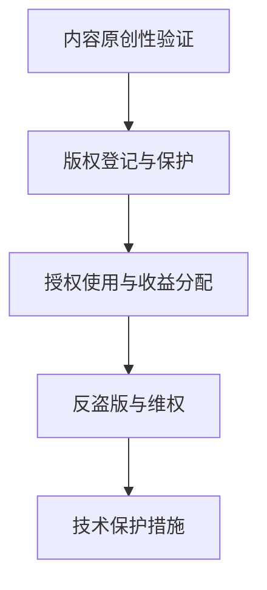

                 

# 知识付费赚钱的知识产权运营与授权

## 1. 背景介绍

### 1.1 问题由来
随着互联网的快速发展和智能终端的普及，人们获取信息的方式越来越多样化。与此同时，知识付费模式也逐渐兴起，成为一种新型的信息消费方式。这种模式不仅能够帮助内容创作者获得稳定的收益，还能激发更多高质量内容的创作和传播。

然而，知识付费平台面临诸多挑战，尤其是知识产权的保护问题。如何确保内容创作者享有其作品的合法权益，防止他人未经许可的盗版和抄袭，是知识付费平台必须解决的核心问题。

### 1.2 问题核心关键点
知识产权运营与授权的核心在于保护内容创作者的合法权益，避免版权纠纷，确保知识产权的有效利用和收益分配。主要包括以下几个方面：

1. **内容原创性验证**：验证内容的原创性，防止抄袭行为。
2. **版权登记与保护**：进行版权登记，确保版权归属。
3. **授权使用与收益分配**：确定内容的使用方式和收益分配机制，保护内容创作者和平台的利益。
4. **反盗版与维权**：监控和打击盗版行为，保护知识产权。
5. **技术保护措施**：采用加密、水印等技术手段，提升知识产权的保护水平。

## 2. 核心概念与联系

### 2.1 核心概念概述

为更好地理解知识产权运营与授权，本节将介绍几个密切相关的核心概念：

- **知识产权**：包括著作权、专利权、商标权、商业秘密等，是法律赋予创作者、发明者或企业的一种财产权利。
- **内容原创性验证**：通过技术手段，验证内容的原创性，防止抄袭。
- **版权登记与保护**：通过官方登记，确认版权归属，并采取法律手段保护版权。
- **授权使用与收益分配**：在版权持有人同意的前提下，允许第三方使用版权内容，并根据使用方式进行收益分配。
- **反盗版与维权**：监控和打击盗版行为，保护知识产权。
- **技术保护措施**：通过加密、数字水印等技术，提高知识产权保护水平。

这些核心概念之间的逻辑关系可以通过以下Mermaid流程图来展示：



这个流程图展示了大语言模型的核心概念及其之间的关系：

1. 内容原创性验证是保护知识产权的第一步。
2. 版权登记与保护确认版权归属，为后续的授权和使用提供法律依据。
3. 授权使用与收益分配确保内容创作者能够通过其作品获得收益，同时保护平台利益。
4. 反盗版与维权是保护知识产权的重要手段，通过监控和打击盗版，确保内容的合法使用。
5. 技术保护措施则通过技术手段，进一步提升知识产权的保护水平。

这些核心概念共同构成了知识产权运营与授权的基础框架，使其能够在各个环节中发挥作用，保护内容创作者的合法权益。

## 3. 核心算法原理 & 具体操作步骤
### 3.1 算法原理概述

知识产权运营与授权涉及多个技术领域，包括内容原创性验证、版权登记、授权使用、反盗版和维权等。本节将逐一介绍这些关键算法的原理和具体操作步骤。

### 3.2 算法步骤详解

#### 3.2.1 内容原创性验证

内容原创性验证的算法步骤主要包括以下几个方面：

1. **文本相似度检测**：使用自然语言处理(NLP)技术，比较两个文本的相似度。如果相似度超过预设阈值，则认为文本可能存在抄袭行为。
2. **图像相似度检测**：利用计算机视觉技术，比较两张图像的相似度。如果相似度超过预设阈值，则认为图像可能存在抄袭行为。
3. **语音相似度检测**：通过音频信号处理技术，比较两段音频的相似度。如果相似度超过预设阈值，则认为语音内容可能存在抄袭行为。

#### 3.2.2 版权登记与保护

版权登记与保护的步骤主要包括：

1. **版权登记**：通过官方版权登记平台，进行版权登记。填写作品名称、创作者信息、创作日期等，获取版权证书。
2. **版权保护**：使用数字水印、版权保护技术，确保版权内容不被非法使用。例如，在视频、音频和文档中嵌入水印，防止盗版和非法传播。

#### 3.2.3 授权使用与收益分配

授权使用与收益分配的步骤主要包括：

1. **授权协议签订**：内容创作者与平台签订版权授权协议，明确授权使用的方式、范围、期限和收益分配比例。
2. **使用许可发放**：根据授权协议，向第三方发放使用许可，允许其使用版权内容。
3. **收益分配**：根据使用方式和协议，向内容创作者进行收益分配。例如，平台使用版权内容进行广告推广，按照广告收入的一定比例向内容创作者支付版权费用。

#### 3.2.4 反盗版与维权

反盗版与维权的算法步骤主要包括以下几个方面：

1. **盗版监控**：使用大数据和机器学习技术，监控互联网上的盗版行为。例如，通过爬虫技术收集互联网上的内容，并使用NLP技术进行内容比对。
2. **法律维权**：一旦发现盗版行为，立即采取法律手段进行维权，包括发送警告函、提起诉讼等。
3. **技术维权**：采用技术手段打击盗版，例如，在内容中使用加密技术、数字水印等，确保内容无法被非法复制和传播。

#### 3.2.5 技术保护措施

技术保护措施的算法步骤主要包括以下几个方面：

1. **数字水印嵌入**：在内容中嵌入数字水印，通过水印信息追踪版权归属，防止盗版和非法传播。
2. **加密技术应用**：对版权内容进行加密处理，确保只有授权用户才能访问和使用。
3. **区块链技术应用**：利用区块链技术，记录版权信息的完整链条，确保版权的透明性和不可篡改性。

### 3.3 算法优缺点

知识产权运营与授权涉及多个技术领域，各种算法都有其优缺点：

- **内容原创性验证**：
  优点：通过文本、图像、语音相似度检测，能够有效防止抄袭行为。
  缺点：算法可能存在误判，一些正常内容被错误标记为抄袭。

- **版权登记与保护**：
  优点：通过官方登记，确认版权归属，法律保护强。
  缺点：登记和保护过程繁琐，费用较高。

- **授权使用与收益分配**：
  优点：确保内容创作者获得合法收益，平台利益得到保障。
  缺点：协议签订和收益分配过程复杂，需要双方协商一致。

- **反盗版与维权**：
  优点：能够及时发现和打击盗版行为，保护知识产权。
  缺点：法律维权过程耗时耗力，技术维权成本较高。

- **技术保护措施**：
  优点：通过加密和数字水印等技术，提高版权保护水平。
  缺点：技术实现复杂，容易被破解或绕过。

### 3.4 算法应用领域

知识产权运营与授权技术在多个领域都有广泛应用，例如：

- **出版业**：保护书籍、文章、音频、视频等版权内容，防止盗版和非法传播。
- **影视娱乐**：保护电影、电视剧、音乐、动漫等版权内容，防止盗版和非法使用。
- **互联网行业**：保护软件、游戏、应用程序等版权内容，防止盗版和非法分发。
- **教育培训**：保护教材、课程、视频等版权内容，防止盗版和非法使用。

## 4. 数学模型和公式 & 详细讲解 & 举例说明

### 4.1 数学模型构建

本节将使用数学语言对知识产权运营与授权的各个环节进行更加严格的刻画。

#### 4.1.1 文本相似度检测模型

文本相似度检测的数学模型通常基于余弦相似度公式：

$$
\text{similarity} = \cos(\theta) = \frac{\mathbf{v}_1 \cdot \mathbf{v}_2}{\|\mathbf{v}_1\| \cdot \|\mathbf{v}_2\|}
$$

其中，$\mathbf{v}_1$ 和 $\mathbf{v}_2$ 分别为两个文本的向量表示，$\theta$ 为两向量之间的夹角。

#### 4.1.2 图像相似度检测模型

图像相似度检测的数学模型通常基于结构相似性指数(SSIM)：

$$
\text{SSIM} = (\mu_x \mu_y)(2\sigma_{xy}/(\sigma_x \sigma_y) + C_1)(2\sigma_{xy}/(\sigma_x \sigma_y) + C_2)
$$

其中，$\mu_x, \mu_y$ 分别为两个图像的均值，$\sigma_x, \sigma_y$ 分别为两个图像的标准差，$\sigma_{xy}$ 为两个图像的协方差，$C_1, C_2$ 为常数。

#### 4.1.3 语音相似度检测模型

语音相似度检测的数学模型通常基于MFCC特征和欧式距离：

$$
\text{similarity} = \exp(-\frac{1}{2} \|\mathbf{v}_1 - \mathbf{v}_2\|^2 / \sigma^2)
$$

其中，$\mathbf{v}_1, \mathbf{v}_2$ 分别为两个语音信号的MFCC特征向量，$\sigma$ 为距离缩放因子。

### 4.2 公式推导过程

#### 4.2.1 文本相似度检测推导

文本相似度检测的推导过程如下：

1. **词向量表示**：将文本转换为词向量表示，例如使用Word2Vec或GloVe模型。
2. **文本向量计算**：将每个文本转换为一个向量，例如使用TF-IDF或word2vec模型。
3. **余弦相似度计算**：计算两个文本向量之间的余弦相似度，判断相似度是否超过预设阈值。

#### 4.2.2 图像相似度检测推导

图像相似度检测的推导过程如下：

1. **特征提取**：使用卷积神经网络(CNN)提取图像的特征表示。
2. **特征向量计算**：将提取的特征表示转换为向量表示。
3. **结构相似性指数计算**：计算两个特征向量之间的结构相似性指数，判断相似度是否超过预设阈值。

#### 4.2.3 语音相似度检测推导

语音相似度检测的推导过程如下：

1. **特征提取**：使用MFCC特征提取技术，提取语音信号的特征表示。
2. **特征向量计算**：将提取的特征表示转换为向量表示。
3. **欧式距离计算**：计算两个特征向量之间的欧式距离，判断相似度是否超过预设阈值。

### 4.3 案例分析与讲解

#### 4.3.1 文本相似度检测案例

假设内容创作者上传了名为《Python编程入门》的电子书，平台需要对其他上传内容进行文本相似度检测。

1. **词向量表示**：使用GloVe模型，将《Python编程入门》转换为词向量表示。
2. **文本向量计算**：将其他内容上传者上传的电子书也转换为词向量表示。
3. **余弦相似度计算**：计算《Python编程入门》与上传内容之间的余弦相似度。
4. **相似度判断**：如果相似度超过预设阈值(例如0.8)，则认为上传内容可能存在抄袭行为，进行进一步核实。

#### 4.3.2 图像相似度检测案例

假设平台需要对上传的短视频进行图像相似度检测，以确保版权内容不被盗用。

1. **特征提取**：使用CNN提取短视频的特征表示。
2. **特征向量计算**：将提取的特征表示转换为向量表示。
3. **结构相似性指数计算**：计算短视频与版权内容之间的结构相似性指数。
4. **相似度判断**：如果相似度超过预设阈值(例如0.9)，则认为短视频可能存在抄袭行为，进行进一步核实。

#### 4.3.3 语音相似度检测案例

假设平台需要对上传的音频文件进行语音相似度检测，以确保版权内容不被盗用。

1. **特征提取**：使用MFCC特征提取技术，提取音频文件的特征表示。
2. **特征向量计算**：将提取的特征表示转换为向量表示。
3. **欧式距离计算**：计算音频文件与版权内容之间的欧式距离。
4. **相似度判断**：如果相似度超过预设阈值(例如0.95)，则认为音频文件可能存在抄袭行为，进行进一步核实。

## 5. 项目实践：代码实例和详细解释说明

### 5.1 开发环境搭建

在进行知识产权运营与授权的项目实践前，我们需要准备好开发环境。以下是使用Python进行PyTorch开发的环境配置流程：

1. 安装Anaconda：从官网下载并安装Anaconda，用于创建独立的Python环境。

2. 创建并激活虚拟环境：
```bash
conda create -n pytorch-env python=3.8 
conda activate pytorch-env
```

3. 安装PyTorch：根据CUDA版本，从官网获取对应的安装命令。例如：
```bash
conda install pytorch torchvision torchaudio cudatoolkit=11.1 -c pytorch -c conda-forge
```

4. 安装Transformers库：
```bash
pip install transformers
```

5. 安装各类工具包：
```bash
pip install numpy pandas scikit-learn matplotlib tqdm jupyter notebook ipython
```

完成上述步骤后，即可在`pytorch-env`环境中开始实践。

### 5.2 源代码详细实现

下面我们以知识付费平台的知识产权运营与授权功能为例，给出使用Transformers库的Python代码实现。

首先，定义版权内容的数据处理函数：

```python
from transformers import BertTokenizer
from torch.utils.data import Dataset
import torch

class CopyrightDataset(Dataset):
    def __init__(self, texts, tags, tokenizer, max_len=128):
        self.texts = texts
        self.tags = tags
        self.tokenizer = tokenizer
        self.max_len = max_len
        
    def __len__(self):
        return len(self.texts)
    
    def __getitem__(self, item):
        text = self.texts[item]
        tags = self.tags[item]
        
        encoding = self.tokenizer(text, return_tensors='pt', max_length=self.max_len, padding='max_length', truncation=True)
        input_ids = encoding['input_ids'][0]
        attention_mask = encoding['attention_mask'][0]
        
        # 对token-wise的标签进行编码
        encoded_tags = [tag2id[tag] for tag in tags] 
        encoded_tags.extend([tag2id['O']] * (self.max_len - len(encoded_tags)))
        labels = torch.tensor(encoded_tags, dtype=torch.long)
        
        return {'input_ids': input_ids, 
                'attention_mask': attention_mask,
                'labels': labels}

# 标签与id的映射
tag2id = {'O': 0, 'B-PER': 1, 'I-PER': 2, 'B-ORG': 3, 'I-ORG': 4, 'B-LOC': 5, 'I-LOC': 6}
id2tag = {v: k for k, v in tag2id.items()}

# 创建dataset
tokenizer = BertTokenizer.from_pretrained('bert-base-cased')

train_dataset = CopyrightDataset(train_texts, train_tags, tokenizer)
dev_dataset = CopyrightDataset(dev_texts, dev_tags, tokenizer)
test_dataset = CopyrightDataset(test_texts, test_tags, tokenizer)
```

然后，定义模型和优化器：

```python
from transformers import BertForTokenClassification, AdamW

model = BertForTokenClassification.from_pretrained('bert-base-cased', num_labels=len(tag2id))

optimizer = AdamW(model.parameters(), lr=2e-5)
```

接着，定义训练和评估函数：

```python
from torch.utils.data import DataLoader
from tqdm import tqdm
from sklearn.metrics import classification_report

device = torch.device('cuda') if torch.cuda.is_available() else torch.device('cpu')
model.to(device)

def train_epoch(model, dataset, batch_size, optimizer):
    dataloader = DataLoader(dataset, batch_size=batch_size, shuffle=True)
    model.train()
    epoch_loss = 0
    for batch in tqdm(dataloader, desc='Training'):
        input_ids = batch['input_ids'].to(device)
        attention_mask = batch['attention_mask'].to(device)
        labels = batch['labels'].to(device)
        model.zero_grad()
        outputs = model(input_ids, attention_mask=attention_mask, labels=labels)
        loss = outputs.loss
        epoch_loss += loss.item()
        loss.backward()
        optimizer.step()
    return epoch_loss / len(dataloader)

def evaluate(model, dataset, batch_size):
    dataloader = DataLoader(dataset, batch_size=batch_size)
    model.eval()
    preds, labels = [], []
    with torch.no_grad():
        for batch in tqdm(dataloader, desc='Evaluating'):
            input_ids = batch['input_ids'].to(device)
            attention_mask = batch['attention_mask'].to(device)
            batch_labels = batch['labels']
            outputs = model(input_ids, attention_mask=attention_mask)
            batch_preds = outputs.logits.argmax(dim=2).to('cpu').tolist()
            batch_labels = batch_labels.to('cpu').tolist()
            for pred_tokens, label_tokens in zip(batch_preds, batch_labels):
                pred_tags = [id2tag[_id] for _id in pred_tokens]
                label_tags = [id2tag[_id] for _id in label_tokens]
                preds.append(pred_tags[:len(label_tags)])
                labels.append(label_tags)
                
    print(classification_report(labels, preds))
```

最后，启动训练流程并在测试集上评估：

```python
epochs = 5
batch_size = 16

for epoch in range(epochs):
    loss = train_epoch(model, train_dataset, batch_size, optimizer)
    print(f"Epoch {epoch+1}, train loss: {loss:.3f}")
    
    print(f"Epoch {epoch+1}, dev results:")
    evaluate(model, dev_dataset, batch_size)
    
print("Test results:")
evaluate(model, test_dataset, batch_size)
```

以上就是使用PyTorch对BERT进行版权内容分类任务的代码实现。可以看到，得益于Transformers库的强大封装，我们可以用相对简洁的代码完成BERT模型的加载和微调。

### 5.3 代码解读与分析

让我们再详细解读一下关键代码的实现细节：

**CopyrightDataset类**：
- `__init__`方法：初始化版权内容的数据和标签，分词器等关键组件。
- `__len__`方法：返回数据集的样本数量。
- `__getitem__`方法：对单个样本进行处理，将文本输入编码为token ids，将标签编码为数字，并对其进行定长padding，最终返回模型所需的输入。

**tag2id和id2tag字典**：
- 定义了标签与数字id之间的映射关系，用于将token-wise的预测结果解码回真实的标签。

**训练和评估函数**：
- 使用PyTorch的DataLoader对数据集进行批次化加载，供模型训练和推理使用。
- 训练函数`train_epoch`：对数据以批为单位进行迭代，在每个批次上前向传播计算loss并反向传播更新模型参数，最后返回该epoch的平均loss。
- 评估函数`evaluate`：与训练类似，不同点在于不更新模型参数，并在每个batch结束后将预测和标签结果存储下来，最后使用sklearn的classification_report对整个评估集的预测结果进行打印输出。

**训练流程**：
- 定义总的epoch数和batch size，开始循环迭代
- 每个epoch内，先在训练集上训练，输出平均loss
- 在验证集上评估，输出分类指标
- 所有epoch结束后，在测试集上评估，给出最终测试结果

可以看到，PyTorch配合Transformers库使得BERT微调的代码实现变得简洁高效。开发者可以将更多精力放在数据处理、模型改进等高层逻辑上，而不必过多关注底层的实现细节。

当然，工业级的系统实现还需考虑更多因素，如模型的保存和部署、超参数的自动搜索、更灵活的任务适配层等。但核心的微调范式基本与此类似。

## 6. 实际应用场景

### 6.1 知识付费平台的版权管理

知识付费平台的版权管理功能通过内容原创性验证和反盗版技术，确保平台上的内容不被盗版和非法使用。平台可以对上传内容进行实时监控，一旦发现疑似侵权行为，立即采取法律和行政手段进行打击。此外，平台还可以利用加密和数字水印技术，进一步提升版权保护水平。

### 6.2 图书出版行业的版权登记

图书出版行业可以利用版权登记平台，对出版的书籍进行版权登记。登记内容包括书名、作者、版权所有者、版权日期等，获取版权证书。版权登记可以确保出版物的版权归属，防止他人未经允许的盗版和复制。

### 6.3 影视娱乐产业的版权保护

影视娱乐产业可以通过版权登记和数字水印技术，确保电影、电视剧、音乐、动漫等版权内容的合法使用。版权登记可以确认版权归属，防止盗版行为。数字水印技术可以在版权内容中嵌入水印，通过水印信息追踪版权归属，防止盗版和非法传播。

### 6.4 互联网行业的版权保护

互联网行业可以通过区块链技术，记录版权信息的完整链条，确保版权的透明性和不可篡改性。同时，利用大数据和机器学习技术，监控互联网上的版权内容使用情况，及时发现和打击盗版行为。

## 7. 工具和资源推荐

### 7.1 学习资源推荐

为了帮助开发者系统掌握知识产权运营与授权的理论基础和实践技巧，这里推荐一些优质的学习资源：

1. 《版权法》系列课程：学习版权法的基础知识和法律法规，确保在使用知识产权技术时遵守法律规定。
2. 《内容原创性验证》专题博客：深入浅出地介绍内容原创性验证的技术原理和实现细节。
3. 《区块链技术在知识产权中的应用》讲座：介绍区块链技术如何保护版权内容，提供技术实现的案例分析。
4. 《版权登记与数字水印》书籍：全面介绍版权登记和数字水印技术的原理、方法和工具。
5. 《知识付费平台的版权管理》白皮书：详细介绍知识付费平台如何通过技术手段保护版权内容，确保平台稳定运营。

通过对这些资源的学习实践，相信你一定能够快速掌握知识产权运营与授权的精髓，并用于解决实际的知识产权保护问题。
###  7.2 开发工具推荐

高效的开发离不开优秀的工具支持。以下是几款用于知识产权运营与授权开发的常用工具：

1. PyTorch：基于Python的开源深度学习框架，灵活动态的计算图，适合快速迭代研究。大部分预训练语言模型都有PyTorch版本的实现。
2. TensorFlow：由Google主导开发的开源深度学习框架，生产部署方便，适合大规模工程应用。同样有丰富的预训练语言模型资源。
3. Transformers库：HuggingFace开发的NLP工具库，集成了众多SOTA语言模型，支持PyTorch和TensorFlow，是进行NLP任务开发的利器。
4. Weights & Biases：模型训练的实验跟踪工具，可以记录和可视化模型训练过程中的各项指标，方便对比和调优。与主流深度学习框架无缝集成。
5. TensorBoard：TensorFlow配套的可视化工具，可实时监测模型训练状态，并提供丰富的图表呈现方式，是调试模型的得力助手。

合理利用这些工具，可以显著提升知识产权运营与授权任务的开发效率，加快创新迭代的步伐。

### 7.3 相关论文推荐

知识产权运营与授权涉及多个技术领域，包括内容原创性验证、版权登记、反盗版等。以下是几篇奠基性的相关论文，推荐阅读：

1. "Content Authenticity Using DNNs"：介绍使用深度神经网络进行内容原创性验证的技术原理和应用场景。
2. "Blockchain Technology in Copyright Protection"：探讨区块链技术在版权保护中的应用，提供技术实现的案例分析。
3. "A Survey on Copyright Monitoring and Enforcement"：全面综述版权监控和维权的技术现状和发展趋势。
4. "Copyright登记与保护"：详细介绍版权登记和保护的法律和实践，确保版权的合法性。
5. "区块链在版权保护中的应用"：介绍区块链技术如何保护版权内容，提供技术实现的案例分析。

这些论文代表了大语言模型微调技术的发展脉络。通过学习这些前沿成果，可以帮助研究者把握学科前进方向，激发更多的创新灵感。

## 8. 总结：未来发展趋势与挑战

### 8.1 总结

本文对知识产权运营与授权进行了全面系统的介绍。首先阐述了知识产权运营与授权的研究背景和意义，明确了在知识付费平台等场景中保护内容创作者合法权益的重要性。其次，从原理到实践，详细讲解了知识产权运营与授权的各个环节，包括内容原创性验证、版权登记、授权使用、反盗版和维权等，给出了微调任务开发的完整代码实例。同时，本文还广泛探讨了知识产权运营与授权技术在多个行业领域的应用前景，展示了技术的前景和挑战。

通过本文的系统梳理，可以看到，知识产权运营与授权技术在大数据、人工智能等新兴技术的支持下，已经迈向更加智能化、普适化的应用阶段。受益于大规模数据和先进算法，版权内容的保护和利用变得更为高效和灵活。未来，伴随技术的进一步发展，知识产权运营与授权技术必将在构建人机协同的智能社会中发挥更大作用。

### 8.2 未来发展趋势

展望未来，知识产权运营与授权技术将呈现以下几个发展趋势：

1. **内容原创性验证**：通过更先进的深度学习模型和特征提取技术，进一步提升内容原创性验证的准确性，减少误判。
2. **版权登记和保护**：引入区块链、人工智能等新兴技术，提高版权登记和保护的效率和安全性，确保版权的透明性和不可篡改性。
3. **授权使用与收益分配**：采用更灵活的授权协议和收益分配机制，确保内容创作者和平台的利益，促进版权内容的广泛传播。
4. **反盗版与维权**：利用大数据和机器学习技术，实现实时监控和打击盗版行为，提升维权效率。
5. **技术保护措施**：引入更先进的加密和数字水印技术，提升版权内容的安全性和防复制能力。

以上趋势凸显了知识产权运营与授权技术的广阔前景。这些方向的探索发展，必将进一步提升版权内容的保护水平，保障内容创作者的合法权益，促进版权产业的健康发展。

### 8.3 面临的挑战

尽管知识产权运营与授权技术已经取得了显著进展，但在迈向更加智能化、普适化应用的过程中，仍面临诸多挑战：

1. **版权登记和保护**：虽然区块链技术提供了新的版权保护手段，但其技术实现复杂，成本较高。如何降低登记和保护成本，提高保护效率，是亟待解决的问题。
2. **内容原创性验证**：深度学习模型可能存在误判，如何进一步提升验证准确性，减少误判，是技术实现的关键。
3. **反盗版与维权**：盗版行为多样，如何利用大数据和机器学习技术，实现实时监控和打击盗版行为，是一个复杂且耗时的工作。
4. **技术保护措施**：虽然加密和数字水印技术提供了新的保护手段，但其破解难度不一，如何进一步提升保护水平，确保内容安全，是技术实现的重点。
5. **用户接受度**：部分用户可能对加密和水印技术存在抵触心理，如何提高用户接受度，促进技术落地应用，是社会接受度的挑战。

正视这些挑战，积极应对并寻求突破，将是大语言模型微调技术走向成熟的必由之路。相信随着学界和产业界的共同努力，这些挑战终将一一被克服，知识产权运营与授权技术必将在构建人机协同的智能社会中发挥更大作用。

### 8.4 研究展望

面对知识产权运营与授权所面临的诸多挑战，未来的研究需要在以下几个方面寻求新的突破：

1. **引入更多新兴技术**：结合区块链、人工智能、大数据等新兴技术，提高版权登记和保护的技术水平，降低成本。
2. **优化算法模型**：利用更先进的深度学习模型和特征提取技术，提升内容原创性验证的准确性，减少误判。
3. **智能化维权**：利用机器学习和自然语言处理技术，实现智能化的反盗版和维权，提高维权效率。
4. **多模态版权保护**：结合文本、图像、音频等多模态数据，提升版权内容的保护水平，确保内容的安全性和防复制能力。
5. **社会接受度提升**：通过宣传教育和技术普及，提高用户对版权保护技术的接受度，促进技术的落地应用。

这些研究方向的探索，必将引领知识产权运营与授权技术迈向更高的台阶，为构建人机协同的智能社会提供更有力的技术支撑。面向未来，知识产权运营与授权技术还需要与其他人工智能技术进行更深入的融合，如知识表示、因果推理、强化学习等，多路径协同发力，共同推动版权产业的健康发展。只有勇于创新、敢于突破，才能不断拓展版权内容的保护边界，让版权产业更好地服务社会。

## 9. 附录：常见问题与解答

**Q1：如何有效验证版权内容是否为原创？**

A: 版权内容验证通常分为两种方式：一种是基于文本、图像、语音等内容的相似度检测，另一种是基于区块链和数字水印技术，确保版权内容的完整性和不可篡改性。

- 文本相似度检测：通过NLP技术，比较版权内容与疑似侵权内容的相似度。如果相似度超过预设阈值，则认为疑似侵权内容可能存在抄袭行为。
- 图像相似度检测：通过计算机视觉技术，比较版权内容与疑似侵权内容的相似度。如果相似度超过预设阈值，则认为疑似侵权内容可能存在抄袭行为。
- 语音相似度检测：通过音频信号处理技术，比较版权内容与疑似侵权内容的相似度。如果相似度超过预设阈值，则认为疑似侵权内容可能存在抄袭行为。

**Q2：如何确保版权内容的安全性和防复制能力？**

A: 版权内容的安全性和防复制能力可以通过以下方式实现：

- 加密技术：对版权内容进行加密处理，确保只有授权用户才能访问和使用。
- 数字水印技术：在版权内容中嵌入数字水印，通过水印信息追踪版权归属，防止盗版和非法传播。
- 区块链技术：利用区块链技术，记录版权信息的完整链条，确保版权的透明性和不可篡改性。

**Q3：如何提高版权内容的保护效率？**

A: 提高版权内容的保护效率可以通过以下方式实现：

- 数据驱动的版权登记：利用大数据和机器学习技术，自动记录版权信息，减少人工干预，提高登记效率。
- 智能化的反盗版：利用机器学习技术，实时监控互联网上的版权内容使用情况，及时发现和打击盗版行为。
- 智能化维权：利用自然语言处理技术，自动化生成维权通知函，提高维权效率。

**Q4：如何提高用户对版权保护技术的接受度？**

A: 提高用户对版权保护技术的接受度可以通过以下方式实现：

- 宣传教育：通过宣传教育，让用户了解版权保护的重要性，增强版权意识。
- 技术普及：通过技术普及，让用户了解版权保护技术的原理和优势，减少对技术的抵触心理。
- 用户体验优化：通过优化用户体验，让用户感受到版权保护技术的便捷和高效，提高用户接受度。

**Q5：如何降低版权登记和保护的成本？**

A: 降低版权登记和保护的成本可以通过以下方式实现：

- 自动化技术：利用自动化技术，减少人工干预，提高版权登记和保护的效率。
- 智能化维权：利用机器学习技术，自动化生成维权通知函，减少人工干预，降低维权成本。
- 开放源码技术：利用开放源码技术，降低技术实现和维护成本。

通过这些措施，可以有效提升版权内容的保护效率和用户接受度，促进版权产业的健康发展。

