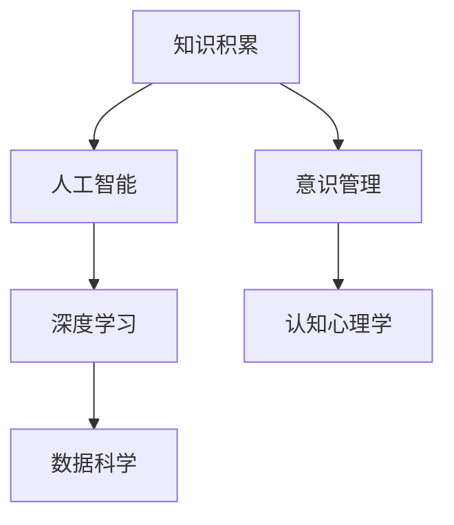

                 

# 知识积累对意识管理的影响

> 关键词：知识积累,意识管理,人工智能,深度学习,数据科学,认知心理学

## 1. 背景介绍

### 1.1 问题由来
在当今信息爆炸的时代，我们每个人都面临着如何有效管理自己知识的问题。知识管理不仅能提升个人学习效率，还能优化决策过程，增强问题解决能力。然而，知识的积累不仅仅是收集和存储，更重要的是如何组织和利用这些知识，使其在意识层面得以有效整合和管理。

### 1.2 问题核心关键点
面对庞大的信息量，如何高效存储、检索和应用知识？如何处理认知负荷，避免信息过载？这些问题在技术、心理学和教育学等多个学科中都有深入的研究。特别是在人工智能和认知科学领域，知识积累与意识管理之间的互动关系正逐渐成为研究热点。

## 2. 核心概念与联系

### 2.1 核心概念概述

为更好地理解知识积累对意识管理的影响，本节将介绍几个关键概念：

- **知识积累(Knowledge Accumulation)**：指个体通过学习、实践、阅读等方式获取和存储知识的持续过程。知识积累是个人成长和专业发展的基石。

- **意识管理(Consciousness Management)**：指通过认知心理学和神经科学的理论和方法，对个人意识状态进行管理，以提升学习、工作和生活的效率和质量。

- **人工智能(Artificial Intelligence, AI)**：以机器学习和深度学习技术为核心的智能系统，能够模仿人类智能，处理大量复杂数据。

- **深度学习(Deep Learning, DL)**：一种基于神经网络的机器学习技术，能够自动学习数据的复杂特征，广泛应用于图像识别、语音处理、自然语言处理等领域。

- **数据科学(Data Science)**：通过数据收集、处理和分析，揭示数据背后的规律和模式，提供决策支持。

- **认知心理学(Cognitive Psychology)**：研究人类认知过程及其心理机制，旨在理解人类如何获取、处理和应用信息。

这些核心概念之间的逻辑关系可以通过以下Mermaid流程图来展示：



这个流程图展示了几大关键概念及其相互关系：

1. 知识积累通过人工智能和深度学习技术，得到高效存储和处理。
2. 意识管理则通过认知心理学理论，优化知识获取和应用过程。
3. 数据科学为知识积累和意识管理提供技术支撑。

### 2.2 核心概念原理和架构的 Mermaid 流程图


## 3. 核心算法原理 & 具体操作步骤
### 3.1 算法原理概述

知识积累和意识管理之间的互动关系，可以通过认知心理学中的认知负荷理论来解释。认知负荷理论认为，个体在学习和记忆过程中，存在有限的心理资源，过多信息会导致认知过载，影响记忆效果。因此，知识管理不仅要有效存储信息，还要在意识层面进行优化，以减少认知负荷，提升学习效率。

基于这一理论，知识积累对意识管理的影响可以分为两个主要方面：

- **存储优化**：通过技术手段优化知识的存储结构，使其更加易于检索和应用。
- **意识引导**：利用认知心理学理论，引导个体更有效地处理和应用知识，减少认知负荷。

### 3.2 算法步骤详解

以下将详细介绍知识积累对意识管理的具体操作步骤：

**Step 1: 知识收集与存储**

1. **数据源收集**：通过网络搜索、文献阅读、专业课程等多种途径，收集相关领域的知识和信息。
2. **结构化存储**：使用数据库、知识图谱、云存储等技术，对知识进行结构化存储，使其有序、易于检索。

**Step 2: 认知负荷管理**

1. **认知评估**：使用问卷、心理测试等方法，评估个体当前认知负荷水平。
2. **知识筛选**：根据评估结果，筛选出对当前认知负荷影响最小的知识进行学习。
3. **学习节奏调整**：根据认知负荷水平，调整学习时间和节奏，避免过载。

**Step 3: 知识应用与反馈**

1. **任务驱动**：将知识应用于实际任务中，如问题解决、决策支持等，提升实践能力。
2. **反思与迭代**：通过反思和评估，发现知识应用中的不足，进行迭代改进。

**Step 4: 意识引导与优化**

1. **元认知训练**：通过元认知训练，提高个体对知识管理和应用过程的自我监控能力。
2. **认知行为干预**：使用认知行为疗法等技术，引导个体改变不良认知习惯，提升知识应用效果。

**Step 5: 持续改进**

1. **定期评估**：定期评估知识管理效果，发现问题并改进。
2. **技术更新**：跟踪最新的知识管理技术和工具，持续提升知识管理效率。

### 3.3 算法优缺点

知识积累对意识管理的优化，具有以下优点：

- **提高学习效率**：通过科学的知识管理和意识引导，能够更有效地利用有限的心理资源，减少认知负荷，提升学习效果。
- **提升实践能力**：通过知识在意识层面的整合和应用，能够更好地解决实际问题，增强决策支持能力。

同时，该方法也存在一定的局限性：

- **对技术依赖**：知识管理依赖于先进的技术手段，对于资源有限的小规模应用场景可能不适用。
- **个体差异**：不同个体在认知负荷管理上的需求和效果可能存在差异，需要个性化的策略。
- **持续投入**：知识管理和意识引导是一个长期过程，需要持续的投入和维护。

尽管存在这些局限性，但知识积累对意识管理的优化，仍然是提升个人能力和发展的重要手段。

### 3.4 算法应用领域

知识积累对意识管理的优化，广泛应用于教育、培训、科研、项目管理等多个领域。具体如下：

- **教育**：通过知识管理工具，优化学生的学习路径，减少认知负荷，提升学习效果。
- **培训**：利用知识管理技术，针对不同岗位需求，设计个性化培训方案，提高培训效果。
- **科研**：通过知识图谱等技术，优化科研数据的组织和检索，提升科研效率和成果质量。
- **项目管理**：通过知识管理平台，积累项目经验，优化决策过程，提升项目管理能力。

## 4. 数学模型和公式 & 详细讲解 & 举例说明

### 4.1 数学模型构建

知识积累对意识管理的影响，可以通过以下数学模型进行描述：

- **认知负荷模型(Cognitive Load Model)**：定义认知负荷$L$为信息处理所需要的时间$T$与个体可用时间$T_{\text{total}}$之比，即：
  $$
  L = \frac{T}{T_{\text{total}}}
  $$
  其中，$T = F(I)$，$F$为信息复杂度函数，$I$为信息量。

- **知识管理模型(Knowledge Management Model)**：定义知识管理效果$E$为实际应用中的知识数量$K_{\text{applied}}$与存储知识数量$K_{\text{stored}}$之比，即：
  $$
  E = \frac{K_{\text{applied}}}{K_{\text{stored}}}
  $$

### 4.2 公式推导过程

首先，我们推导认知负荷模型中的信息复杂度函数$F$。

假设信息$I$由$n$个信息单元组成，每个信息单元的处理时间为$t$。则总处理时间为$T = nt$。根据认知负荷模型，有：
$$
L = \frac{nt}{T_{\text{total}}}
$$

如果$L$过大，个体会出现认知负荷过载的情况。因此，我们需要最小化$L$，即：
$$
\min_{n} \frac{nt}{T_{\text{total}}}
$$

为了最小化$L$，我们需要优化$n$。假设个体在单位时间内能处理的信息单元数为$k$，则有：
$$
n = k \cdot T_{\text{total}}
$$

代入$L$的公式中，得：
$$
L = \frac{kt \cdot T_{\text{total}}}{T_{\text{total}}} = kt
$$

为了使$L$最小，$t$需要尽可能小。因此，我们需要通过技术手段优化信息处理效率，减少$t$。

接下来，我们推导知识管理模型的$E$值。

根据知识管理模型的定义，有：
$$
E = \frac{K_{\text{applied}}}{K_{\text{stored}}}
$$

如果$E$过低，说明存储的知识未被充分利用，知识管理效果差。因此，我们需要最大化$E$，即：
$$
\max_{K_{\text{applied}}} \frac{K_{\text{applied}}}{K_{\text{stored}}}
$$

为了最大化$E$，我们需要优化$K_{\text{applied}}$。假设知识管理的效果与个体对知识的应用频率成正比，则有：
$$
K_{\text{applied}} = k' \cdot \text{Usage Frequency}
$$

代入$E$的公式中，得：
$$
E = \frac{k' \cdot \text{Usage Frequency}}{K_{\text{stored}}}
$$

为了使$E$最大化，我们需要提高知识的应用频率。因此，我们需要通过意识引导和优化，提高个体对知识的实际应用能力。

### 4.3 案例分析与讲解

假设一位数据科学家需要在一周内完成一个数据分析项目，项目需要从多个数据源收集数据，并进行复杂的处理和分析。

**Step 1: 知识收集与存储**

1. **数据源收集**：通过网络搜索和文献阅读，收集相关的数据集和处理工具。
2. **结构化存储**：使用数据库和数据湖技术，对数据进行结构化存储，使其有序、易于检索。

**Step 2: 认知负荷管理**

1. **认知评估**：使用问卷和心理测试，评估当前认知负荷水平。发现当前任务所需的信息复杂度较高，个体认知负荷$L = 0.8$。
2. **知识筛选**：根据评估结果，筛选出对当前认知负荷影响最小的数据和工具。优先处理信息复杂度较低的数据集。
3. **学习节奏调整**：根据认知负荷水平，调整学习时间和节奏，避免过载。每天学习2小时，累计学习10小时，完成大部分信息处理。

**Step 3: 知识应用与反馈**

1. **任务驱动**：将知识应用于实际任务中，进行数据预处理和分析。发现数据处理过程存在瓶颈，需要进一步优化。
2. **反思与迭代**：通过反思和评估，发现知识应用中的不足，进行迭代改进。使用更高效的数据处理工具，优化信息处理效率。

**Step 4: 意识引导与优化**

1. **元认知训练**：通过元认知训练，提高个体对知识管理和应用过程的自我监控能力。发现学习效率不高，需要优化学习策略。
2. **认知行为干预**：使用认知行为疗法等技术，引导个体改变不良认知习惯，提升知识应用效果。每日设定学习目标，并进行反馈和调整。

**Step 5: 持续改进**

1. **定期评估**：定期评估知识管理效果，发现问题并改进。发现知识管理效果有提升，但仍存在信息过载的风险。
2. **技术更新**：跟踪最新的知识管理技术和工具，持续提升知识管理效率。使用新的数据处理工具，进一步提高效率。

最终，该数据科学家在一周内成功完成数据分析项目，并在过程中不断优化知识管理和意识引导策略，提升了自己的工作能力和效率。

## 5. 项目实践：代码实例和详细解释说明
### 5.1 开发环境搭建

在进行知识管理系统的开发前，我们需要准备好开发环境。以下是使用Python进行PyTorch开发的环境配置流程：

1. 安装Anaconda：从官网下载并安装Anaconda，用于创建独立的Python环境。

2. 创建并激活虚拟环境：
```bash
conda create -n pytorch-env python=3.8 
conda activate pytorch-env
```

3. 安装PyTorch：根据CUDA版本，从官网获取对应的安装命令。例如：
```bash
conda install pytorch torchvision torchaudio cudatoolkit=11.1 -c pytorch -c conda-forge
```

4. 安装TensorFlow：
```bash
pip install tensorflow
```

5. 安装各类工具包：
```bash
pip install numpy pandas scikit-learn matplotlib tqdm jupyter notebook ipython
```

完成上述步骤后，即可在`pytorch-env`环境中开始知识管理系统的开发。

### 5.2 源代码详细实现

下面以知识图谱(Knowledge Graph)为例，给出使用PyTorch进行知识积累和意识管理项目的PyTorch代码实现。

首先，定义知识图谱的节点和边：

```python
class Node:
    def __init__(self, name, type):
        self.name = name
        self.type = type
        self.neighbors = set()

class Edge:
    def __init__(self, from_node, to_node, label):
        self.from_node = from_node
        self.to_node = to_node
        self.label = label
```

然后，定义知识图谱的数据结构：

```python
class KnowledgeGraph:
    def __init__(self):
        self.nodes = {}
        self.edges = {}
```

接下来，定义知识图谱的存储和查询方法：

```python
def add_node(self, name, type):
    if name not in self.nodes:
        self.nodes[name] = Node(name, type)
    else:
        return

def add_edge(self, from_name, to_name, label):
    from_node = self.nodes[from_name]
    to_node = self.nodes[to_name]
    edge = Edge(from_node, to_node, label)
    from_node.neighbors.add(edge)
    to_node.neighbors.add(edge)
    if label not in self.edges:
        self.edges[label] = []
    self.edges[label].append(edge)

def get_neighbors(self, name):
    if name in self.nodes:
        return self.nodes[name].neighbors
    else:
        return set()
```

最后，使用知识图谱存储和查询知识：

```python
kg = KnowledgeGraph()

kg.add_node('Apple', 'Company')
kg.add_node('iPhone', 'Product')
kg.add_node('iOS', 'OS')
kg.add_edge('Apple', 'iPhone', 'makes')
kg.add_edge('iPhone', 'iOS', 'uses')

print(kg.get_neighbors('Apple'))
print(kg.get_neighbors('iPhone'))
```

以上代码实现了一个简单的知识图谱系统，通过节点和边来表示知识之间的关联。

### 5.3 代码解读与分析

让我们再详细解读一下关键代码的实现细节：

**Node类**：
- `__init__`方法：初始化节点的名称、类型和邻居集合。

**Edge类**：
- `__init__`方法：初始化边的起点、终点和标签。

**KnowledgeGraph类**：
- `__init__`方法：初始化节点和边集合。
- `add_node`方法：向知识图谱中添加节点，如果节点已存在则返回。
- `add_edge`方法：向知识图谱中添加边，同时更新起点和终点的邻居集合。
- `get_neighbors`方法：根据节点名称，获取该节点的所有邻居。

使用知识图谱存储知识时，需要注意以下几点：

1. 知识图谱的结构需要根据实际应用场景进行设计。本示例中，我们定义了公司、产品和操作系统三种类型的节点，并通过边的标签表示它们之间的关系。
2. 知识图谱的查询需要根据具体需求进行优化。本示例中，我们提供了根据节点名称获取邻居的简单方法，但在实际应用中，可能需要更复杂的查询算法和数据结构。
3. 知识图谱的维护需要定期进行更新和优化。随着新知识的积累，知识图谱也需要动态调整和扩展，才能保持其时效性和完整性。

## 6. 实际应用场景
### 6.1 企业知识管理

企业知识管理是知识管理的重要应用场景之一。通过知识图谱等技术，企业可以有效组织和存储内部知识，提升员工的学习和创新能力。

具体而言，企业可以构建内部知识图谱，将员工的知识、经验、文档等信息进行结构化存储，并定期更新。通过知识图谱的查询功能，员工可以快速获取所需知识，减少重复学习和信息过载的问题。同时，企业还可以通过知识图谱进行知识共享和协作，提高团队的工作效率和创新能力。

### 6.2 教育个性化学习

教育个性化学习是知识管理的另一重要应用场景。通过知识图谱等技术，教师可以构建个性化的学习路径，帮助学生更好地掌握知识。

具体而言，教师可以构建学科知识图谱，将课程内容、习题、案例等信息进行结构化存储，并通过知识图谱进行查询和推荐。同时，教师还可以根据学生的学习情况和兴趣，动态调整学习路径，提供个性化的学习建议和资源。通过知识图谱的引导和优化，学生可以更加高效地掌握知识，提升学习效果。

### 6.3 医疗知识管理

医疗知识管理是知识管理的另一个重要应用场景。通过知识图谱等技术，医疗机构可以有效组织和存储医疗知识，提升医疗服务水平和质量。

具体而言，医疗机构可以构建医疗知识图谱，将疾病的诊断、治疗、预防等信息进行结构化存储，并通过知识图谱进行查询和推荐。同时，医疗机构还可以根据患者的病历和诊断结果，动态调整治疗方案，提供个性化的医疗服务。通过知识图谱的引导和优化，医疗机构可以更好地应对复杂的医疗问题，提高诊疗效率和效果。

## 7. 工具和资源推荐
### 7.1 学习资源推荐

为了帮助开发者系统掌握知识管理技术的理论基础和实践技巧，这里推荐一些优质的学习资源：

1. 《Knowledge Management for Dummies》系列书籍：介绍知识管理的基本概念和实践方法，适合入门学习。
2. Coursera《Knowledge Management》课程：由知识管理专家开设的在线课程，涵盖知识管理的理论、技术和案例。
3. IBM Knowledge Management Hub：提供丰富的知识管理工具和资源，包括知识图谱、文档管理、协作平台等。
4. Wiley《Handbook of Knowledge Management》书籍：知识管理领域的经典著作，涵盖多个方面的理论和实践。
5. 《The Knowledge Manager's Toolkit》书籍：提供知识管理工具和技术的实用指南，适合日常应用。

通过对这些资源的学习实践，相信你一定能够快速掌握知识管理技术的精髓，并用于解决实际的业务问题。

### 7.2 开发工具推荐

高效的开发离不开优秀的工具支持。以下是几款用于知识管理系统开发的常用工具：

1. Apache Jena：Java平台上的知识图谱框架，支持RDF数据的存储和查询。
2. Neo4j：高性能的图形数据库，适合存储和查询复杂关系图。
3. Amazon Neptune：AWS上的图形数据库服务，支持大规模图形数据的管理和分析。
4. Elasticsearch：分布式搜索和分析引擎，适合存储和查询文本数据。
5. Apache Solr：另一个分布式搜索引擎，支持多语言搜索和数据处理。

合理利用这些工具，可以显著提升知识管理系统的开发效率，加快创新迭代的步伐。

### 7.3 相关论文推荐

知识管理技术的发展源于学界的持续研究。以下是几篇奠基性的相关论文，推荐阅读：

1. 《Knowledge Management Systems: Issues, Definitions, and Dynamics》：提出知识管理系统的定义和分类，探讨其面临的挑战和解决方案。
2. 《Semantic Web, Ontology, and Knowledge Graph》：介绍语义网和知识图谱的基本概念和应用场景，探讨其在知识管理中的作用。
3. 《A Survey on Knowledge Graphs》：综述知识图谱的研究现状和未来趋势，涵盖其构建、查询和应用等多个方面。
4. 《Knowledge Discovery and Semantic Search in Enterprise Organizations》：探讨知识发现和语义搜索在企业中的应用，提出相关的技术和方法。
5. 《Learning to reason: Knowledge Graph Embeddings》：介绍知识图谱嵌入技术，通过向量表示学习知识图谱中的隐含关系。

这些论文代表了大规模知识管理技术的研究方向，阅读这些文献将有助于理解知识管理技术的最新进展和前沿成果。

## 8. 总结：未来发展趋势与挑战

### 8.1 总结

本文对知识积累对意识管理的影响进行了全面系统的介绍。首先阐述了知识积累和意识管理的研究背景和意义，明确了知识管理在提升个体学习和工作效率方面的重要作用。其次，从原理到实践，详细讲解了知识管理的技术方法和操作步骤，给出了知识管理任务开发的完整代码实例。同时，本文还探讨了知识管理在企业、教育、医疗等不同领域的应用前景，展示了知识管理技术的广泛应用价值。此外，本文精选了知识管理技术的各类学习资源，力求为读者提供全方位的技术指引。

通过本文的系统梳理，可以看到，知识管理技术通过优化知识的存储、检索和应用，能够在意识层面有效整合和管理知识，显著提升个体和组织的学习和工作效率。未来，伴随知识管理技术的不断发展，其在智能系统中将扮演越来越重要的角色，为社会的知识共享和创新发展提供新动力。

### 8.2 未来发展趋势

展望未来，知识管理技术的发展趋势主要包括以下几个方面：

1. **自动化和智能化**：通过人工智能和机器学习技术，自动构建和维护知识图谱，实现知识发现的自动化。同时，利用自然语言处理技术，提高知识抽取和推理的智能化水平。
2. **多模态融合**：知识管理不仅关注文本信息，还关注图片、音频、视频等多种形式的数据。通过多模态融合技术，构建更全面、更丰富的知识图谱。
3. **个性化学习**：根据个体的学习偏好和历史行为，动态调整知识推荐和学习路径，提供个性化的学习体验。
4. **实时更新**：知识管理需要实时更新知识图谱，动态反映新知识和新趋势。利用分布式存储和计算技术，实现知识图谱的实时更新和查询。
5. **跨领域应用**：知识管理技术在更多领域得到应用，如智慧城市、医疗健康、金融服务等，为不同领域的发展提供知识支持。

这些趋势表明，知识管理技术正在向着更加智能化、自动化、实时化的方向发展，未来必将在更多领域发挥重要作用。

### 8.3 面临的挑战

尽管知识管理技术已经取得了显著进展，但在实际应用中也面临着诸多挑战：

1. **数据整合与质量**：知识管理需要大量的高质量数据，但数据整合和清洗工作复杂且耗时。如何高效整合和清洗海量数据，是知识管理面临的重要挑战。
2. **隐私与安全**：知识图谱和知识存储需要考虑隐私和安全问题，如何保护数据的隐私和安全，避免泄露敏感信息，是一个需要重点解决的问题。
3. **知识表示与推理**：知识图谱的表示和推理技术需要进一步改进，才能更好地处理复杂的语义关系和推理问题。
4. **跨语言知识管理**：在全球化的背景下，跨语言的知识管理需求日益增加。如何处理多语言知识图谱，提供跨语言的查询和推荐服务，是一个需要解决的重要问题。
5. **知识管理系统的可扩展性**：随着数据规模的增长，知识管理系统的可扩展性和性能需要进一步提升。如何构建可扩展的知识管理系统，支持大规模数据的存储和查询，是一个需要研究的重点。

这些挑战需要我们在技术、方法和工程实践中不断创新和改进，才能推动知识管理技术的成熟和应用。

### 8.4 研究展望

面对知识管理技术面临的挑战，未来的研究需要在以下几个方面寻求新的突破：

1. **自动化知识发现**：利用人工智能和机器学习技术，自动化地构建和维护知识图谱，提高知识发现的效率和质量。
2. **多模态知识融合**：研究多模态知识融合技术，将文本、图片、视频等多种形式的数据整合，构建更全面、更丰富的知识图谱。
3. **知识图谱嵌入**：研究知识图谱嵌入技术，通过向量表示学习知识图谱中的隐含关系，提高知识推理和查询的效率和准确性。
4. **跨语言知识管理**：研究跨语言知识管理技术，提供多语言的查询和推荐服务，支持全球化的知识共享和创新。
5. **分布式知识管理**：研究分布式知识管理技术，构建可扩展的知识管理系统，支持大规模数据的存储和查询。

这些研究方向将推动知识管理技术的进一步发展和应用，为社会的知识共享和创新提供更加强大的技术支撑。

## 9. 附录：常见问题与解答

**Q1: 知识管理技术在企业中的应用有哪些？**

A: 知识管理技术在企业中的应用非常广泛，主要包括以下几个方面：

1. **知识共享**：通过知识图谱等技术，企业可以实现知识的共享和传播，促进员工之间的经验交流和学习。
2. **知识库构建**：企业可以构建内部的知识库，存储和检索各类知识资源，提升员工的学习效率。
3. **决策支持**：知识管理技术可以为决策提供知识支持，帮助企业管理层进行科学决策。
4. **问题解决**：通过知识图谱等技术，企业可以快速获取相关知识，提高问题解决的效率和效果。
5. **知识创新**：企业可以通过知识管理技术，激发员工的创造力，促进新技术和新产品的开发。

**Q2: 如何进行知识图谱的构建和维护？**

A: 知识图谱的构建和维护需要遵循以下步骤：

1. **数据采集**：收集相关的文本、图片、视频等数据，并进行清洗和预处理。
2. **知识抽取**：利用自然语言处理技术，从文本数据中提取实体、关系和属性等信息。
3. **知识建模**：将抽取的信息构建为知识图谱，形成节点和边的结构。
4. **知识融合**：将多源异构数据进行融合，构建统一的知识图谱。
5. **知识推理**：利用推理技术，对知识图谱进行推理和查询，提供知识支持的决策。
6. **知识更新**：定期更新知识图谱，反映新知识和新趋势，保持其时效性和完整性。

这些步骤需要结合具体的业务需求和技术手段进行灵活应用，才能构建高效、准确的知识图谱。

**Q3: 知识图谱在教育个性化学习中的应用有哪些？**

A: 知识图谱在教育个性化学习中的应用主要包括以下几个方面：

1. **个性化推荐**：根据学生的学习历史和兴趣，利用知识图谱推荐相关的学习资源和课程，提高学习效果。
2. **学习路径优化**：利用知识图谱构建学习路径，根据学生的学习情况和知识掌握情况，动态调整学习路径，提供个性化的学习建议。
3. **智能辅导**：通过知识图谱提供智能辅导，回答学生的问题，提供实时的学习支持。
4. **学习成果评估**：利用知识图谱进行学习成果的评估，帮助学生了解自己的学习情况和知识掌握程度。
5. **跨学科学习**：利用知识图谱进行跨学科学习，构建多学科知识图谱，促进学科之间的知识整合和融合。

这些应用将极大地提升教育的个性化和智能化水平，为学生的学习提供更好的支持。

**Q4: 如何提升知识管理系统的可扩展性和性能？**

A: 提升知识管理系统的可扩展性和性能需要结合具体的技术手段和工程实践，以下是几个关键措施：

1. **分布式存储**：利用分布式存储技术，将知识图谱存储在多个节点上，提升存储的扩展性和性能。
2. **分布式计算**：利用分布式计算技术，实现知识图谱的实时更新和查询，提升计算效率。
3. **数据压缩**：利用数据压缩技术，减少知识图谱的存储和传输成本，提升系统的可扩展性。
4. **缓存机制**：利用缓存机制，加速知识图谱的查询和访问，提升系统的响应速度。
5. **增量更新**：利用增量更新技术，减少知识图谱的维护成本，提升系统的性能。

这些措施需要根据具体的业务需求和技术场景进行灵活应用，才能提升知识管理系统的可扩展性和性能。

---

作者：禅与计算机程序设计艺术 / Zen and the Art of Computer Programming

