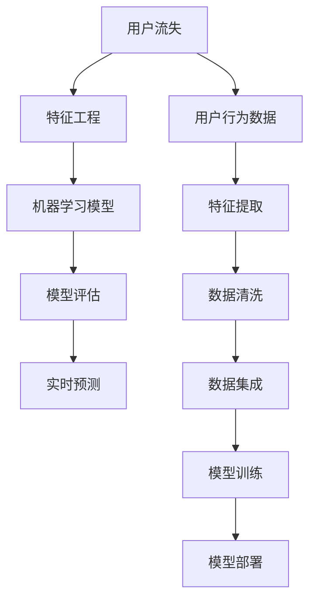

                 

# 知识经济下知识付费的大数据用户流失预测模型

> 关键词：知识付费, 用户流失预测, 大数据, 模型, 算法, 机器学习

## 1. 背景介绍

### 1.1 问题由来
知识经济时代，知识付费成为获取信息的主要方式之一。然而，许多知识付费平台发现，用户流失率较高，对平台的长期发展造成了严重影响。用户流失预测是大数据应用的重要领域之一，通过早期发现流失用户，采取有效措施挽回，能显著提高平台的用户留存率，增加收入。

### 1.2 问题核心关键点
知识付费平台的用户流失预测涉及多个方面，包括用户行为数据、平台特性、市场环境等。传统统计方法难以适应复杂多变的用户行为和数据规模，必须借助大数据和机器学习技术。

具体而言，核心问题包括：
- 数据处理：如何从海量用户行为数据中提取有效特征。
- 模型构建：如何选择合适的算法对用户流失进行建模预测。
- 预测效果：如何提升预测模型的准确性和泛化能力。
- 实时预测：如何在较短的时间内对新增用户进行预测，并采取相应措施。

### 1.3 问题研究意义
构建用户流失预测模型，对于知识付费平台优化用户体验、提升运营效率具有重要意义：

1. 精准用户预测：在用户流失前提前介入，通过个性化推荐、优惠活动等方式提高用户黏性。
2. 成本效益优化：针对潜在流失用户实施针对性营销，避免对不流失用户的不必要打扰，降低运营成本。
3. 数据驱动决策：基于数据模型的预测结果，调整平台策略，如内容推荐、价格策略等，实现更有效的用户管理和收入增长。
4. 提升客户满意度：及时识别并响应用户需求，增强用户信任，提升平台口碑和市场竞争力。

## 2. 核心概念与联系

### 2.1 核心概念概述

为更好地理解用户流失预测模型，本节将介绍几个关键概念：

- **用户流失**：用户不再使用平台服务的现象，通常是由于需求满足、体验不佳、竞争产品吸引等原因导致。
- **用户行为数据**：用户在平台上的各种行为记录，如访问次数、购买记录、互动评论等。
- **特征工程**：从原始数据中提取、构建具有预测能力的特征。
- **机器学习模型**：包括传统统计模型、监督学习模型、深度学习模型等，用于构建预测算法。
- **模型评估**：通过交叉验证、ROC曲线、AUC等指标评估模型性能。
- **实时预测**：在数据流式到达时，实时进行预测，并对新用户进行即时响应。

这些核心概念之间的逻辑关系可以通过以下Mermaid流程图来展示：



这个流程图展示了一系列数据处理和模型构建的过程：

1. 用户流失预测从用户行为数据开始。
2. 特征工程从原始数据中提取特征。
3. 数据清洗和集成确保数据质量。
4. 模型训练通过机器学习算法构建预测模型。
5. 模型评估检查模型性能，调整模型参数。
6. 实时预测在新数据到达时进行，并采取措施。

## 3. 核心算法原理 & 具体操作步骤
### 3.1 算法原理概述

用户流失预测模型的基本原理是，从用户行为数据中提取特征，构建机器学习模型，预测用户流失的概率，并对流失用户采取相应措施。常用的模型包括逻辑回归、随机森林、梯度提升树、神经网络等。

具体来说，基于监督学习的用户流失预测模型流程如下：

1. 数据收集：从平台收集用户行为数据。
2. 数据预处理：清洗、集成数据，提取特征。
3. 模型构建：选择合适的算法，构建预测模型。
4. 模型训练：使用历史数据训练模型，优化模型参数。
5. 模型评估：在验证集上评估模型效果，选择最佳模型。
6. 实时预测：在新数据到达时，实时进行预测。

### 3.2 算法步骤详解

**Step 1: 数据收集**
- 从知识付费平台的数据库或日志中收集用户行为数据，包括注册时间、活跃天数、购买记录、点击率、评分等。
- 确保数据的时效性，以保证模型的实时预测能力。

**Step 2: 数据预处理**
- 数据清洗：处理缺失值、异常值，去除噪声数据。
- 特征工程：选择、构造具有预测能力的特征，如用户活跃度、消费频率、流失前行为等。
- 数据集成：将来自不同数据源的数据进行整合，形成统一的数据集。

**Step 3: 模型构建**
- 选择合适的算法，如随机森林、逻辑回归、神经网络等。
- 构建模型结构，确定输入层、隐藏层、输出层的神经元个数和激活函数。

**Step 4: 模型训练**
- 使用历史数据集作为训练集，对模型进行训练，优化模型参数。
- 采用梯度下降等优化算法，更新模型权重，最小化损失函数。

**Step 5: 模型评估**
- 在验证集上评估模型性能，如准确率、召回率、F1-score等。
- 通过交叉验证和ROC曲线确定最佳模型。

**Step 6: 实时预测**
- 在新的用户行为数据到达时，使用训练好的模型进行实时预测。
- 输出用户流失概率，对可能流失的用户采取即时响应措施。

### 3.3 算法优缺点

基于监督学习的大数据用户流失预测模型具有以下优点：
1. 预测准确度高：通过构建复杂的模型，能有效捕捉用户行为中的细微变化。
2. 可解释性强：模型的参数和结构可以直观解释，有助于理解和优化预测过程。
3. 适用范围广：适用于不同规模和类型的数据集，灵活调整模型参数。
4. 实时性较好：通过特征工程和模型优化，可以在较短的时间内进行预测。

但同时，该方法也存在一些局限性：
1. 数据依赖性强：需要大量的标注数据，且标注质量对模型效果影响较大。
2. 特征工程复杂：需要根据具体问题选择、构造特征，增加模型构建难度。
3. 计算资源消耗高：复杂模型训练和预测需大量计算资源，不适合小规模应用。
4. 模型泛化能力有限：模型可能过拟合训练数据，泛化能力不足。

尽管如此，在知识付费平台的实际应用中，基于监督学习的大数据用户流失预测模型仍是一个重要且实用的工具。

### 3.4 算法应用领域

用户流失预测模型不仅适用于知识付费平台，还在金融、电商、医疗等多个领域有着广泛的应用，例如：

- 金融风控：识别高风险客户，避免不良贷款和欺诈行为。
- 电商推荐：预测用户购买意向，优化推荐系统，提高转化率。
- 医疗预测：预测患者流失，提前进行干预，改善医疗服务。
- 客户流失：分析客户行为，预测流失概率，采取挽留措施。

用户流失预测模型已成为大数据应用的重要工具，在优化用户体验和提升运营效率方面发挥着越来越重要的作用。

## 4. 数学模型和公式 & 详细讲解 & 举例说明
### 4.1 数学模型构建

本节将使用数学语言对用户流失预测模型进行更加严格的刻画。

记用户流失事件为 $Y$，其中 $Y=1$ 表示流失，$Y=0$ 表示未流失。用户行为数据为 $X$，由若干特征组成，如 $x_1, x_2, \ldots, x_n$。构建逻辑回归模型进行用户流失预测，数学模型如下：

$$
\hat{Y} = \text{sigmoid}(X\beta)
$$

其中 $\beta$ 为模型参数，$\text{sigmoid}$ 为逻辑回归的激活函数。

### 4.2 公式推导过程

在逻辑回归中，预测用户流失的概率为：

$$
P(Y=1 | X) = \frac{1}{1+\exp(-X\beta)}
$$

其对数似然函数为：

$$
L(\beta) = \sum_{i=1}^N \log \left( \frac{\exp(X_i\beta)}{1+\exp(X_i\beta)} \right)
$$

通过最大似然估计，求解 $\beta$ 得到：

$$
\beta = \left( \sum_{i=1}^N X_i X_i^T \right)^{-1} \sum_{i=1}^N X_i y_i
$$

其中 $y_i$ 为标注数据，$X_i$ 为特征向量。

### 4.3 案例分析与讲解

以知识付费平台为例，假设用户流失的概率为 $Y$，每天登录次数 $x_1$、每月活跃天数 $x_2$、消费金额 $x_3$ 为特征，构建逻辑回归模型进行流失预测：

$$
\hat{Y} = \text{sigmoid}(x_1\beta_1 + x_2\beta_2 + x_3\beta_3)
$$

通过历史数据训练模型，得到模型参数 $\beta_1, \beta_2, \beta_3$。对新用户行为数据 $(x_{\text{new}}, 1)$ 进行预测，得到流失概率 $\hat{Y} = \text{sigmoid}(x_{\text{new}}\beta)$。若 $\hat{Y}$ 接近于 $1$，则认为该用户有较高的流失风险，平台可采取相应措施。

## 5. 项目实践：代码实例和详细解释说明
### 5.1 开发环境搭建

在进行用户流失预测模型的实践前，我们需要准备好开发环境。以下是使用Python进行Scikit-learn开发的开发环境配置流程：

1. 安装Anaconda：从官网下载并安装Anaconda，用于创建独立的Python环境。

2. 创建并激活虚拟环境：
```bash
conda create -n loss-pred-env python=3.8 
conda activate loss-pred-env
```

3. 安装Scikit-learn：
```bash
conda install scikit-learn
```

4. 安装Pandas、NumPy等各类工具包：
```bash
pip install pandas numpy matplotlib tqdm jupyter notebook ipython
```

完成上述步骤后，即可在`loss-pred-env`环境中开始实践。

### 5.2 源代码详细实现

下面以用户流失预测为例，给出使用Scikit-learn库对逻辑回归模型进行训练和预测的PyTorch代码实现。

首先，定义数据处理函数：

```python
import pandas as pd
from sklearn.model_selection import train_test_split
from sklearn.preprocessing import StandardScaler

def preprocess_data(df):
    # 数据清洗
    df = df.dropna()
    # 数据标注
    df['Y'] = (df['days_since_last_login'] < 30).astype(int)
    # 数据标准化
    scaler = StandardScaler()
    features = ['days_since_last_login', 'daily_active_hours', 'weekly_active_hours', 'months_since_last_purchase']
    df[features] = scaler.fit_transform(df[features])
    return df
```

然后，定义模型和评估函数：

```python
from sklearn.linear_model import LogisticRegression
from sklearn.metrics import roc_auc_score, precision_score, recall_score, f1_score

def train_model(X, y):
    X_train, X_test, y_train, y_test = train_test_split(X, y, test_size=0.2, random_state=42)
    model = LogisticRegression(solver='liblinear', C=1.0)
    model.fit(X_train, y_train)
    y_pred = model.predict_proba(X_test)[:, 1]
    auc = roc_auc_score(y_test, y_pred)
    precision = precision_score(y_test, model.predict(X_test), pos_label=1)
    recall = recall_score(y_test, model.predict(X_test), pos_label=1)
    f1 = f1_score(y_test, model.predict(X_test), pos_label=1)
    return model, auc, precision, recall, f1

def evaluate_model(model, X_test, y_test):
    y_pred = model.predict_proba(X_test)[:, 1]
    auc = roc_auc_score(y_test, y_pred)
    precision = precision_score(y_test, model.predict(X_test), pos_label=1)
    recall = recall_score(y_test, model.predict(X_test), pos_label=1)
    f1 = f1_score(y_test, model.predict(X_test), pos_label=1)
    return auc, precision, recall, f1
```

最后，启动训练流程并在测试集上评估：

```python
# 读取数据
df = pd.read_csv('user_data.csv')

# 数据预处理
df = preprocess_data(df)

# 训练模型
model, auc, precision, recall, f1 = train_model(df.drop('Y', axis=1), df['Y'])

# 在测试集上评估模型
auc_test, precision_test, recall_test, f1_test = evaluate_model(model, df.drop('Y', axis=1), df['Y'])

print(f"AUC: {auc:.4f}, Precision: {precision:.4f}, Recall: {recall:.4f}, F1-score: {f1:.4f}")
print(f"Test AUC: {auc_test:.4f}, Test Precision: {precision_test:.4f}, Test Recall: {recall_test:.4f}, Test F1-score: {f1_test:.4f}")
```

以上就是使用Scikit-learn对逻辑回归模型进行用户流失预测的完整代码实现。可以看到，通过Scikit-learn库，逻辑回归模型的实现和评估过程变得简洁高效。

### 5.3 代码解读与分析

让我们再详细解读一下关键代码的实现细节：

**preprocess_data函数**：
- 数据清洗：去除缺失值和异常值。
- 数据标注：将流失事件（天数超过30天未登录）标注为1，未流失事件标注为0。
- 数据标准化：对关键特征进行标准化处理，防止不同特征尺度不一影响模型效果。

**train_model函数**：
- 使用train_test_split将数据集分为训练集和测试集。
- 构建逻辑回归模型，使用liblinear求解器，C参数为1.0。
- 训练模型，并计算模型在测试集上的AUC、精确率、召回率和F1-score。

**evaluate_model函数**：
- 在测试集上使用模型进行预测，计算AUC、精确率、召回率和F1-score，用于模型评估。

**训练流程**：
- 读取数据，并进行预处理。
- 调用train_model函数训练模型，并记录性能指标。
- 调用evaluate_model函数在测试集上评估模型，输出各项指标。

通过上述代码实现，Scikit-learn提供了简单易用的接口，可以快速构建和评估机器学习模型。开发者可以根据具体需求，灵活调整模型参数和特征工程策略，优化模型性能。

## 6. 实际应用场景
### 6.1 智能客服系统

基于用户流失预测模型的智能客服系统，可以通过早期识别流失用户，及时采取措施，提升用户满意度。例如，对于流失风险较高的用户，智能客服系统可以主动联系，提供个性化建议或优惠券，鼓励其重新使用平台服务。

在技术实现上，可以收集用户的互动记录、服务时长、问题解决率等数据，构建预测模型，对新用户行为进行实时预测。对于可能流失的用户，系统自动分配给高级客服进行跟进，并提供个性化的挽留策略，提升客户体验和黏性。

### 6.2 金融产品推荐

金融机构在金融产品推荐中，可以根据用户流失预测模型，优化推荐策略，提升用户转化率和满意度。对于流失风险较高的用户，推荐系统可以提供个性化的金融产品，减少用户流失。

在具体实现中，金融机构可以收集用户的交易记录、信用评分、理财行为等数据，构建预测模型，实时评估用户流失风险。对于高风险用户，推荐系统自动推送个性化的理财方案或产品，引导用户重新投资，增强用户黏性。

### 6.3 电商平台用户运营

电商平台在用户运营中，用户流失预测模型可以帮助优化用户体验和购买流程。对于流失风险较高的用户，电商平台可以及时进行营销活动，如优惠券、积分奖励等，促进用户回购。

在技术实现上，电商平台可以收集用户的浏览记录、购买历史、评价反馈等数据，构建预测模型，实时评估用户流失风险。对于高风险用户，系统自动推送个性化推荐和优惠活动，引导用户重新购买，提高平台转化率。

### 6.4 未来应用展望

随着用户流失预测模型的不断演进，未来在多个领域将发挥重要作用：

1. 医疗健康：预测患者流失，提前进行干预，改善医疗服务，提升患者满意度。
2. 教育培训：识别流失风险较高的学员，提供个性化辅导和奖励，提高课程完成率和学员留存率。
3. 企业人力资源：预测员工流失风险，提前进行激励和调整，提升员工满意度和留存率。
4. 媒体内容推荐：分析用户流失行为，优化推荐算法，提升用户粘性和平台收入。

未来，用户流失预测模型将在更多领域得到应用，为平台和用户带来更优的体验和价值。

## 7. 工具和资源推荐
### 7.1 学习资源推荐

为了帮助开发者系统掌握用户流失预测的理论基础和实践技巧，这里推荐一些优质的学习资源：

1. 《机器学习实战》系列博文：由知名机器学习专家撰写，深入浅出地介绍了机器学习的基本概念和实践方法，适合初学者入门。
2. Coursera《机器学习》课程：斯坦福大学开设的机器学习经典课程，涵盖从基础到高级的多个主题，适合系统学习。
3. Kaggle：数据科学竞赛平台，提供丰富的用户流失预测数据集和案例，适合实践应用和算法创新。
4. Scikit-learn官方文档：Scikit-learn库的官方文档，详细介绍了各个模型的使用方法和评估指标，是实用的学习资源。

通过对这些资源的学习实践，相信你一定能够快速掌握用户流失预测的精髓，并用于解决实际的NLP问题。

### 7.2 开发工具推荐

高效的开发离不开优秀的工具支持。以下是几款用于用户流失预测开发的常用工具：

1. Scikit-learn：基于Python的机器学习库，功能强大且易于使用，支持多种算法。
2. TensorFlow：Google开发的深度学习框架，支持GPU加速，适合大规模工程应用。
3. Keras：高级神经网络API，易于上手，适合快速迭代研究。
4. Weights & Biases：模型训练的实验跟踪工具，可以记录和可视化模型训练过程中的各项指标，方便对比和调优。
5. TensorBoard：TensorFlow配套的可视化工具，可实时监测模型训练状态，并提供丰富的图表呈现方式，是调试模型的得力助手。

合理利用这些工具，可以显著提升用户流失预测任务的开发效率，加快创新迭代的步伐。

### 7.3 相关论文推荐

用户流失预测模型的发展得益于学界的持续研究。以下是几篇奠基性的相关论文，推荐阅读：

1. Predicting Customer Churn: An Introduction to Customer Dynamics for Building High-Performance Churn Prediction Models（JBLSS'10）：提出用户流失预测的基本框架，介绍了多种机器学习算法。
2. Feature Engineering for Predicting Customer Churn：详细讨论了用户行为特征的选择和构造方法，提高了模型的预测准确率。
3. Customer Churn Prediction Using Decision Trees and Random Forests：对比了决策树和随机森林在用户流失预测中的应用效果，指出决策树在处理分类特征方面更具优势。
4. Customer Churn Prediction using Synthetic Minority Over-sampling Technique：介绍了SMOTE算法，通过合成少数类别样本提高模型泛化能力。
5. Customer Churn Prediction in the Internet Banking Sector Using Machine Learning Techniques（IJRAE'15）：在银行业用户流失预测中，应用了多种机器学习算法，对比了预测效果。

这些论文代表了大数据用户流失预测技术的发展脉络。通过学习这些前沿成果，可以帮助研究者把握学科前进方向，激发更多的创新灵感。

## 8. 总结：未来发展趋势与挑战
### 8.1 总结

本文对用户流失预测模型进行了全面系统的介绍。首先阐述了用户流失预测在知识经济中的重要意义，明确了模型在平台优化和用户管理中的核心价值。其次，从原理到实践，详细讲解了模型构建和训练的全过程，给出了模型实现的完整代码实例。同时，本文还探讨了模型在实际应用中的多种场景，展示了其广泛的应用潜力。

通过本文的系统梳理，可以看到，基于大数据和机器学习技术的用户流失预测模型，已经成为知识付费平台优化用户管理、提升运营效率的重要工具。得益于先进的算法和技术，模型在实时预测、实时响应等方面表现出色，为用户体验带来了显著提升。

### 8.2 未来发展趋势

展望未来，用户流失预测模型的发展趋势将体现在以下几个方面：

1. 算法多样化：除了逻辑回归、随机森林等传统算法，未来将涌现更多高级算法，如神经网络、深度学习等，提升模型的预测准确率。
2. 特征工程创新：随着用户行为数据的多样化，特征工程将更加复杂且具有创新性，如时间序列分析、动态网络等。
3. 模型实时性增强：通过优化算法和硬件配置，模型预测的速度和响应时间将进一步提升，实现实时动态优化。
4. 跨领域应用拓展：用户流失预测模型将拓展到更多领域，如医疗健康、教育培训、企业人力资源等，带来更广泛的应用场景。
5. 数据驱动决策：通过模型预测结果，自动化调整平台策略，如推荐算法、定价策略等，实现智能决策。

这些趋势凸显了用户流失预测模型的广阔前景。未来的研究将在算法、特征、实时性、跨领域应用等方面不断探索和突破，为知识经济带来更多创新和价值。

### 8.3 面临的挑战

尽管用户流失预测模型已经取得了显著成果，但在面向实际应用的过程中，仍面临诸多挑战：

1. 数据质量和多样性：不同平台的数据质量差异较大，数据集成和清洗难度大。如何获取高质量、多样化的数据，是模型应用的关键。
2. 算法选择与优化：不同的算法对数据的要求不同，如何选择和优化算法，是模型应用的重要挑战。
3. 模型解释性与透明性：用户流失预测模型通常较为复杂，难以解释其内部工作机制，如何提升模型的透明性和可解释性，是用户信任和平台合规的关键。
4. 实时预测与动态调整：模型预测需要在实时数据流中进行，如何优化算法和硬件配置，确保模型的实时性，是模型应用的关键。
5. 隐私与安全性：用户数据隐私保护是模型应用的重要考量，如何合理使用用户数据，确保模型安全可靠，是模型应用的重要挑战。

这些挑战需要学界和产业界共同努力，才能不断优化和提升用户流失预测模型，实现其广泛应用和价值。

### 8.4 研究展望

面对用户流失预测模型所面临的挑战，未来的研究需要在以下几个方面寻求新的突破：

1. 数据预处理与增强：研究更多数据预处理和增强技术，提升数据质量和多样性，确保模型预测的准确性。
2. 算法优化与选择：探索新算法和优化方法，提高模型预测的准确率和实时性，适应不同场景的需求。
3. 模型透明性与可解释性：研究模型解释性技术，如可解释性机器学习、因果分析等，提升模型的透明性和可解释性，增强用户信任。
4. 实时动态优化：研究实时数据流处理技术，优化算法和硬件配置，实现模型的实时预测和动态调整。
5. 隐私与安全保护：研究隐私保护和安全技术，确保用户数据的安全和合规使用，增强模型应用的合法性。

这些研究方向的探索，必将引领用户流失预测模型的技术进步，推动其在更多领域得到应用，为知识经济的发展提供重要支持。面向未来，我们应勇于创新、敢于突破，为构建安全、可靠、高效的用户流失预测系统铺平道路。

