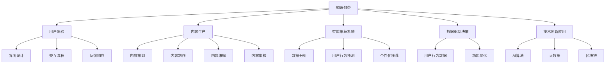

                 

# 知识经济时代下的知识付费创新产品迭代优化

## 1. 背景介绍

### 1.1 问题由来
随着互联网的普及和数字技术的快速发展，全球已步入知识经济时代。知识付费作为一种新型商业模式，正逐渐成为人们获取知识与技能的重要渠道。从在线课程、电子书、咨询服务到智能语音助手、在线文档、AI问答等，各类知识产品层出不穷，满足了用户多样化的学习需求。然而，面对海量信息与日新月异的技术迭代，知识付费产品如何持续迭代优化，保持市场竞争力，成为亟待解决的问题。

### 1.2 问题核心关键点
知识付费产品的迭代优化，需要从用户体验、内容质量、服务效率等多个维度进行全面考量，以更好地满足用户需求，提升用户留存率和满意度。以下将详细阐述这一过程中需要重点关注的核心问题：

- **用户需求分析**：识别用户真实需求，针对性地优化产品功能。
- **内容质量提升**：提高内容生产效率，确保内容质量，满足用户个性化需求。
- **智能推荐系统**：构建精准推荐引擎，个性化推送内容，提升用户粘性。
- **数据驱动决策**：利用数据分析，优化产品功能与用户体验。
- **技术创新应用**：引入前沿技术，如AI、机器学习等，提升产品竞争力。

本文将围绕这些核心问题，探讨知识付费产品的迭代优化策略，通过具体案例和实践方法，帮助开发者和产品经理实现高效迭代，推动知识付费产业的持续发展。

## 2. 核心概念与联系

### 2.1 核心概念概述

为更好地理解知识付费产品迭代优化的过程，本节将介绍几个关键概念：

- **知识付费**：指通过付费方式获取专业知识和技能的商业模式，包括在线课程、电子书、一对一咨询等。
- **用户体验**：指用户在使用产品过程中的感受，包括界面设计、交互流程、反馈响应等。
- **内容生产**：指知识产品的制作过程，包括内容策划、制作、编辑、审核等。
- **智能推荐系统**：通过数据分析和机器学习，智能推送用户感兴趣的内容，提升用户体验。
- **数据驱动决策**：利用大数据分析，优化产品功能，提升决策效率和质量。
- **技术创新应用**：引入前沿技术，如AI、大数据、区块链等，提升产品功能和性能。

这些概念之间的逻辑关系可以通过以下Mermaid流程图来展示：



这个流程图展示的知识付费产品的关键概念及其之间的关系：

1. 知识付费涵盖了用户体验、内容生产、智能推荐、数据驱动、技术创新等多个方面。
2. 用户体验影响界面设计、交互流程和反馈响应等，是产品迭代的出发点和归宿。
3. 内容生产包括内容策划、制作、编辑和审核，是知识付费的核心要素。
4. 智能推荐系统通过数据分析和机器学习，实现个性化内容推送，提升用户体验。
5. 数据驱动决策利用用户行为数据，优化产品功能与用户体验。
6. 技术创新应用通过引入前沿技术，提升产品竞争力和用户体验。

这些概念共同构成了知识付费产品的核心框架，为后续优化策略提供了明确的指导方向。

## 3. 核心算法原理 & 具体操作步骤
### 3.1 算法原理概述

知识付费产品的迭代优化，通常采用数据驱动的迭代方法。该方法通过收集用户反馈和行为数据，不断调整产品功能和用户体验，实现精准定位和高效迭代。其核心思想是：

1. **数据收集**：通过分析用户行为数据、反馈数据和产品使用日志，获取用户需求和体验反馈。
2. **模型训练**：利用机器学习算法，建立预测模型，识别用户需求和行为趋势。
3. **产品优化**：根据模型预测结果，调整产品功能和界面设计，提升用户体验。
4. **迭代评估**：通过用户反馈和行为数据，评估产品优化效果，调整策略。

### 3.2 算法步骤详解

知识付费产品迭代优化的具体步骤包括：

**Step 1: 数据收集与预处理**
- 收集用户行为数据、反馈数据、使用日志等，进行数据清洗和特征工程。
- 选择合适的机器学习算法，如聚类、分类、回归等，建立预测模型。

**Step 2: 用户行为分析**
- 通过数据分析，识别用户行为模式和需求偏好。
- 使用文本分析、情感分析等技术，理解用户反馈内容。

**Step 3: 内容推荐优化**
- 构建智能推荐系统，利用协同过滤、基于内容的推荐等方法，个性化推送内容。
- 实时监控推荐效果，调整推荐策略和算法参数。

**Step 4: 产品功能优化**
- 根据用户反馈和行为分析结果，优化产品功能，如界面设计、交互流程等。
- 引入前沿技术，提升产品性能和用户体验。

**Step 5: 迭代评估与决策**
- 通过A/B测试、用户调研等方法，评估产品优化效果。
- 根据评估结果，调整优化策略，进行下一轮迭代。

### 3.3 算法优缺点

数据驱动的迭代优化方法具有以下优点：
1. 精准定位用户需求，提升用户体验。
2. 利用数据和算法，实现高效迭代，快速响应市场变化。
3. 优化效果可量化，决策过程透明。

同时，该方法也存在一些局限：
1. 数据质量影响模型效果，数据收集和处理成本较高。
2. 用户行为复杂多变，模型预测存在误差。
3. 技术创新应用存在技术难度和成本。

尽管有这些局限，但数据驱动的迭代优化方法仍是知识付费产品迭代优化的主流范式。未来相关研究的重点在于如何进一步提高数据收集和处理效率，优化模型算法，引入更多前沿技术，提升迭代效果。

### 3.4 算法应用领域

数据驱动的迭代优化方法在知识付费产品中的应用非常广泛，包括：

- **在线课程**：通过数据分析和推荐系统，个性化推送课程内容，提升用户学习效果和满意度。
- **电子书**：通过行为分析和内容推荐，提升用户阅读体验和粘性。
- **一对一咨询**：通过用户反馈和行为分析，优化咨询流程和服务质量。
- **智能语音助手**：利用自然语言处理技术，提升用户交互体验和问题解决效率。
- **在线文档**：通过内容推荐和用户反馈，优化文档分类和搜索功能。
- **AI问答**：通过数据分析和机器学习，提升问答系统的准确性和响应速度。

除了上述这些主要应用外，数据驱动的迭代优化方法还被创新性地应用到更多场景中，如个性化标签、智能提醒、内容更新策略等，为知识付费产品带来了全新的突破。

## 4. 数学模型和公式 & 详细讲解 & 举例说明
### 4.1 数学模型构建

本节将使用数学语言对知识付费产品的迭代优化过程进行更加严格的刻画。

假设知识付费产品的用户行为数据集为 $D=\{(x_i,y_i)\}_{i=1}^N, x_i \in \mathcal{X}, y_i \in \mathcal{Y}$，其中 $\mathcal{X}$ 为输入空间，$\mathcal{Y}$ 为输出空间。

定义用户行为预测模型为 $M_{\theta}:\mathcal{X} \rightarrow \mathcal{Y}$，其中 $\theta \in \mathbb{R}^d$ 为模型参数。

记预测误差函数为 $L$，通过最小化预测误差，实现模型优化。

### 4.2 公式推导过程

以协同过滤推荐系统为例，推导推荐模型的损失函数和梯度计算公式。

设用户 $u$ 对物品 $i$ 的评分数据为 $R_{ui}$，物品 $i$ 的属性特征向量为 $a_i$，用户 $u$ 的属性特征向量为 $a_u$。推荐系统的目标是为用户 $u$ 推荐与其评分较高的物品 $j$。假设推荐模型为 $\theta$，则推荐评分预测函数为：

$$
\hat{R}_{ui}(\theta) = \theta^Ta_i
$$

预测误差函数为：

$$
L(\theta) = \sum_{i=1}^N \sum_{j=1}^M (R_{ui} - \hat{R}_{ui}(\theta))^2
$$

其中 $N$ 为用户数，$M$ 为物品数。利用梯度下降算法更新模型参数 $\theta$：

$$
\theta \leftarrow \theta - \eta \nabla_{\theta}L(\theta)
$$

其中 $\eta$ 为学习率。

### 4.3 案例分析与讲解

以Netflix为例，其推荐系统采用协同过滤和矩阵分解等方法，通过用户行为数据构建用户-物品矩阵 $P$，进行用户兴趣预测和个性化推荐。Netflix通过不断收集用户观看历史数据，优化模型参数，提升推荐效果，使用户粘性显著提高。

通过Netflix的案例，可以看出协同过滤推荐系统在大规模知识付费产品中的有效性和可行性，展示了数据驱动迭代优化的强大能力。

## 5. 项目实践：代码实例和详细解释说明
### 5.1 开发环境搭建

在进行迭代优化实践前，我们需要准备好开发环境。以下是使用Python进行TensorFlow开发的环境配置流程：

1. 安装Anaconda：从官网下载并安装Anaconda，用于创建独立的Python环境。

2. 创建并激活虚拟环境：
```bash
conda create -n tf-env python=3.8 
conda activate tf-env
```

3. 安装TensorFlow：根据CUDA版本，从官网获取对应的安装命令。例如：
```bash
pip install tensorflow==2.7.0
```

4. 安装Keras：
```bash
pip install keras
```

5. 安装各类工具包：
```bash
pip install numpy pandas scikit-learn matplotlib tqdm jupyter notebook ipython
```

完成上述步骤后，即可在`tf-env`环境中开始迭代优化实践。

### 5.2 源代码详细实现

这里我们以在线课程推荐系统为例，给出使用TensorFlow对协同过滤推荐模型进行迭代优化的Python代码实现。

首先，定义协同过滤推荐模型的输入和输出：

```python
from tensorflow import keras
from tensorflow.keras.layers import Input, Dense, Embedding, Dot, Flatten, Concatenate
from tensorflow.keras.models import Model

input_user = Input(shape=(1,), name='user')
input_item = Input(shape=(1,), name='item')

user_embed = Embedding(N, M, input_length=1, output_dim=K)(input_user)
item_embed = Embedding(M, K)(input_item)

dot = Dot(axes=1)([user_embed, item_embed])
concat = Concatenate(axis=1)(dot, input_item)
output = Dense(1, activation='sigmoid')(concat)

model = Model([input_user, input_item], output)
```

接着，定义优化器和编译函数：

```python
model.compile(optimizer='adam', loss='binary_crossentropy', metrics=['accuracy'])
```

然后，加载用户行为数据和物品属性数据，并构建推荐模型：

```python
train_data = np.loadtxt('user_item_ratings.txt', delimiter=',')
user_ids, item_ids, ratings = train_data[:, 0], train_data[:, 1], train_data[:, 2]

user_embed = Embedding(N, M, input_length=1, output_dim=K)(input_user)
item_embed = Embedding(M, K)(input_item)

dot = Dot(axes=1)([user_embed, item_embed])
concat = Concatenate(axis=1)(dot, input_item)
output = Dense(1, activation='sigmoid')(concat)

model = Model([input_user, input_item], output)
```

最后，训练模型并评估推荐效果：

```python
model.fit([user_ids, item_ids], ratings, epochs=10, batch_size=32, validation_split=0.2)

test_data = np.loadtxt('test_user_item_ratings.txt', delimiter=',')
test_user_ids, test_item_ids, test_ratings = test_data[:, 0], test_data[:, 1], test_data[:, 2]

predictions = model.predict([test_user_ids, test_item_ids])
print(classification_report(test_ratings, predictions))
```

以上就是使用TensorFlow对协同过滤推荐模型进行迭代优化的完整代码实现。可以看到，TensorFlow提供的高级API使得模型构建和训练过程变得简洁高效。

### 5.3 代码解读与分析

让我们再详细解读一下关键代码的实现细节：

**在线课程推荐系统**：
- `Input`层用于定义用户和物品的输入，`Embedding`层将用户ID和物品ID映射为向量，`Dot`层计算内积，`Concatenate`层将内积结果与物品向量拼接，`Dense`层进行二分类输出。
- 通过`compile`函数设置优化器、损失函数和评价指标，`fit`函数用于模型训练，`evaluate`函数用于模型评估。
- `classification_report`函数用于评估预测结果的精确度、召回率和F1分数。

**协同过滤推荐系统**：
- 利用用户行为数据构建用户-物品矩阵，使用`Embedding`层将用户ID和物品ID映射为向量，通过`Dot`层计算内积，`Concatenate`层将内积结果与物品向量拼接，最后通过`Dense`层进行二分类输出。
- 通过`fit`函数训练模型，`evaluate`函数评估模型在测试集上的表现。

可以看到，TensorFlow使得推荐系统的代码实现变得非常简洁和高效。开发者只需关注模型的逻辑和优化参数，而不需要过多关注底层细节。

当然，实际系统实现还需考虑更多因素，如数据预处理、超参数调优、模型保存与部署等。但核心的迭代优化流程基本与此类似。

## 6. 实际应用场景
### 6.1 智能语音助手

智能语音助手作为知识付费产品的一部分，为用户的日常学习提供了极大的便利。通过智能语音助手，用户可以随时随地获取知识内容，实现语音交互，提升学习效率。

具体而言，可以构建基于深度学习模型的智能语音助手，利用自然语言处理技术，识别用户语音指令，进行语义分析和意图识别。根据用户意图，智能语音助手从知识库中检索相关内容，或直接调用其他知识付费产品（如在线课程、电子书等），进行内容推送和互动。

通过智能语音助手的应用，用户能够实现更加自然、流畅的交互，提升学习体验和粘性。

### 6.2 在线文档平台

在线文档平台是知识付费产品的重要组成部分，为用户提供丰富的学习资源和参考文档。通过知识付费产品的迭代优化，在线文档平台可以更好地满足用户需求，提升文档搜索和阅读体验。

具体而言，可以构建基于推荐系统的在线文档平台，利用用户行为数据和文档元数据，进行个性化内容推荐。根据用户浏览和下载行为，智能推荐相关文档，提升用户粘性和满意度。同时，通过数据分析和内容更新策略，优化文档分类和搜索功能，提升用户搜索效率。

### 6.3 个性化推荐系统

个性化推荐系统是知识付费产品的核心功能之一，通过推荐个性化内容，提升用户学习效果和粘性。利用协同过滤、基于内容的推荐等方法，构建个性化推荐引擎，实现精准推送内容。

具体而言，可以通过用户行为数据和物品属性数据，构建推荐模型，利用协同过滤等方法，为用户推荐最相关的内容。通过实时监控推荐效果，调整推荐策略和算法参数，提升推荐精度和用户满意度。

### 6.4 未来应用展望

随着数据驱动的迭代优化方法不断发展，知识付费产品将在更多领域得到应用，为传统行业带来变革性影响。

在教育领域，基于推荐系统的在线课程平台、个性化学习助手等应用将大幅提升教学效果和用户体验，实现因材施教，促进教育公平。

在企业培训领域，基于数据驱动的在线学习平台将帮助企业提升员工技能，支持企业知识共享和知识管理。

在学术研究领域，基于数据驱动的学术交流平台将加速学术交流和知识传播，提升科研效率和质量。

此外，在健康医疗、文化艺术、金融投资等众多领域，基于知识付费产品的迭代优化方法也将不断涌现，为各行各业注入新的动力。

## 7. 工具和资源推荐
### 7.1 学习资源推荐

为了帮助开发者系统掌握数据驱动的迭代优化技术，这里推荐一些优质的学习资源：

1. 《深度学习》系列博文：由深度学习专家撰写，深入浅出地介绍了深度学习原理和应用，涵盖推荐系统、内容生成等主题。

2. CS229《机器学习》课程：斯坦福大学开设的经典机器学习课程，系统讲解了机器学习算法和应用，包括协同过滤、聚类等推荐技术。

3. 《推荐系统实战》书籍：推荐系统领域的经典书籍，系统介绍了推荐系统的构建和优化，提供大量实际案例。

4. Weights & Biases：模型训练的实验跟踪工具，可以记录和可视化模型训练过程中的各项指标，方便对比和调优。

5. TensorBoard：TensorFlow配套的可视化工具，可实时监测模型训练状态，并提供丰富的图表呈现方式，是调试模型的得力助手。

通过对这些资源的学习实践，相信你一定能够快速掌握数据驱动的迭代优化技术的精髓，并用于解决实际的NLP问题。

### 7.2 开发工具推荐

高效的开发离不开优秀的工具支持。以下是几款用于数据驱动的迭代优化开发的常用工具：

1. TensorFlow：基于Python的开源深度学习框架，灵活的计算图，适合快速迭代研究。广泛应用于推荐系统和机器学习任务。

2. Keras：高层API，方便快速搭建神经网络模型，支持TensorFlow等后端。适合新手快速上手。

3. PyTorch：基于Python的开源深度学习框架，灵活动态的计算图，适合快速迭代研究。支持动态图和静态图两种模式。

4. Weights & Biases：模型训练的实验跟踪工具，可以记录和可视化模型训练过程中的各项指标，方便对比和调优。与主流深度学习框架无缝集成。

5. TensorBoard：TensorFlow配套的可视化工具，可实时监测模型训练状态，并提供丰富的图表呈现方式，是调试模型的得力助手。

6. Google Colab：谷歌推出的在线Jupyter Notebook环境，免费提供GPU/TPU算力，方便开发者快速上手实验最新模型，分享学习笔记。

合理利用这些工具，可以显著提升知识付费产品的开发效率，加快创新迭代的步伐。

### 7.3 相关论文推荐

数据驱动的迭代优化技术的发展源于学界的持续研究。以下是几篇奠基性的相关论文，推荐阅读：

1. Recommender Systems Handbook：推荐系统领域的经典书籍，系统介绍了推荐系统的构建和优化方法，涵盖协同过滤、基于内容的推荐等技术。

2. Contextual Bandits: A Unified Framework for Personalized Online Learning：介绍上下文强化的推荐系统，探讨如何利用用户上下文信息提升推荐效果。

3. Matrix Factorization Techniques for Recommender Systems：介绍矩阵分解等推荐技术，探讨如何通过因子分解实现推荐。

4. Personalized Recommendation Algorithms: A Textbook for Users：推荐系统领域的经典教材，系统介绍推荐算法，涵盖协同过滤、基于内容的推荐、混合推荐等技术。

这些论文代表了大数据驱动的迭代优化技术的发展脉络。通过学习这些前沿成果，可以帮助研究者把握学科前进方向，激发更多的创新灵感。

## 8. 总结：未来发展趋势与挑战

### 8.1 总结

本文对数据驱动的迭代优化方法进行了全面系统的介绍。首先阐述了数据驱动的迭代优化方法在知识付费产品中的应用背景和意义，明确了迭代优化在提升用户体验、内容质量和运营效率方面的独特价值。其次，从原理到实践，详细讲解了数据驱动的迭代优化的数学原理和关键步骤，给出了知识付费产品迭代的完整代码实例。同时，本文还广泛探讨了数据驱动的迭代优化方法在智能语音助手、在线文档平台、个性化推荐系统等实际应用场景中的应用前景，展示了数据驱动迭代优化的强大能力。

通过本文的系统梳理，可以看到，数据驱动的迭代优化方法在知识付费产品中的应用前景广阔，极大地提升了用户学习体验和产品竞争优势，成为推动知识付费产业发展的关键技术。未来，伴随数据驱动技术的不断发展，基于知识付费产品的迭代优化方法还将不断迭代，为传统行业带来更深远的变革。

### 8.2 未来发展趋势

展望未来，数据驱动的迭代优化方法将呈现以下几个发展趋势：

1. 数据质量提升。数据质量是迭代优化效果的关键，未来将引入更多的数据采集和预处理技术，提升数据质量，降低数据噪音。

2. 模型算法优化。通过引入先进算法和技术，如深度强化学习、对抗学习等，提升推荐系统的精确度和鲁棒性。

3. 跨模态数据融合。利用跨模态数据融合技术，提升推荐系统对多源数据的利用能力，实现更全面、精准的内容推荐。

4. 实时动态优化。引入实时数据流处理和在线学习技术，实现动态优化，适应市场变化，提升用户体验。

5. 个性化需求满足。通过深度学习技术，挖掘用户个性化需求，提供更加精准、个性化的内容推荐。

6. 自动化与智能化。引入自动化和智能化技术，优化模型训练和推荐策略，提升工作效率和质量。

以上趋势凸显了数据驱动的迭代优化技术的广阔前景。这些方向的探索发展，必将进一步提升知识付费产品的性能和用户体验，为知识付费产业带来更多的创新和发展机遇。

### 8.3 面临的挑战

尽管数据驱动的迭代优化技术已经取得了显著成效，但在迈向更加智能化、普适化应用的过程中，仍面临诸多挑战：

1. 数据隐私与安全。用户行为数据涉及用户隐私，如何在数据采集和处理过程中保障数据安全，是重要的研究课题。

2. 算法透明性与可解释性。推荐系统的黑盒性质导致用户难以理解其决策逻辑，如何提升算法的透明性与可解释性，是重要的研究挑战。

3. 多模态数据融合难度。多模态数据融合技术虽然能提升推荐系统的性能，但技术难度较高，实现成本较高。

4. 算法复杂度与资源消耗。深度学习推荐系统虽然效果显著，但复杂度高，资源消耗大，如何优化算法效率，是重要的研究方向。

5. 推荐模型的泛化能力。推荐系统往往存在过拟合问题，如何提高模型的泛化能力，是重要的研究挑战。

6. 用户隐私保护。用户行为数据涉及用户隐私，如何在数据采集和处理过程中保障数据安全，是重要的研究课题。

正视这些挑战，积极应对并寻求突破，将是大数据驱动的迭代优化技术走向成熟的必由之路。相信随着学界和产业界的共同努力，这些挑战终将一一被克服，大数据驱动的迭代优化方法必将在知识付费产品中发挥更大的作用。

### 8.4 研究展望

面对大数据驱动的迭代优化方法所面临的种种挑战，未来的研究需要在以下几个方面寻求新的突破：

1. 探索新的数据采集与预处理技术。引入更高效的数据采集和预处理技术，提升数据质量，降低数据噪音。

2. 引入更先进的算法与技术。利用深度强化学习、对抗学习等前沿算法，提升推荐系统的精确度和鲁棒性。

3. 推动跨模态数据融合技术的发展。引入跨模态数据融合技术，提升推荐系统对多源数据的利用能力，实现更全面、精准的内容推荐。

4. 引入实时动态优化技术。引入实时数据流处理和在线学习技术，实现动态优化，适应市场变化，提升用户体验。

5. 提升算法的透明性与可解释性。通过引入可解释性算法和技术，提升推荐系统的透明性与可解释性，增强用户信任。

6. 推动个性化需求满足技术的发展。利用深度学习技术，挖掘用户个性化需求，提供更加精准、个性化的内容推荐。

7. 优化推荐模型的泛化能力。通过引入泛化能力提升技术，提升推荐模型的泛化能力，防止过拟合。

8. 推动自动化与智能化技术的发展。引入自动化和智能化技术，优化模型训练和推荐策略，提升工作效率和质量。

这些研究方向将引领大数据驱动的迭代优化技术迈向更高的台阶，为知识付费产品带来更多的创新和发展机遇。面向未来，大数据驱动的迭代优化技术还需要与其他人工智能技术进行更深入的融合，如知识表示、因果推理、强化学习等，多路径协同发力，共同推动知识付费产品的进步。

## 9. 附录：常见问题与解答

**Q1：知识付费产品的迭代优化如何考虑用户个性化需求？**

A: 通过数据驱动的迭代优化，可以充分挖掘和利用用户个性化需求。具体而言，可以通过用户行为数据、历史反馈和兴趣标签等，构建用户画像，个性化推送相关内容。同时，引入深度学习技术，对用户需求进行建模，提升个性化推荐效果。

**Q2：如何提升知识付费产品的运营效率？**

A: 利用数据驱动的迭代优化方法，可以通过分析用户行为数据和反馈，优化产品功能和用户体验，提升用户粘性和满意度。具体而言，可以通过个性化推荐、内容更新策略等手段，提升运营效率和用户体验。

**Q3：数据驱动的迭代优化如何处理多模态数据？**

A: 多模态数据融合技术可以提升推荐系统的性能，但技术难度较高。可以通过引入跨模态数据融合算法和技术，实现多模态数据的有效整合和利用。例如，可以利用文本、图像、音频等多模态数据，进行联合推荐，提升推荐效果。

**Q4：如何处理数据隐私和安全问题？**

A: 在数据采集和处理过程中，需要严格遵守数据隐私和安全法律法规，如GDPR等。可以采用差分隐私技术、匿名化处理等手段，保护用户隐私。同时，引入安全加密技术，防止数据泄露和攻击。

**Q5：如何提升知识付费产品的可解释性和透明度？**

A: 通过引入可解释性算法和技术，提升推荐系统的透明性与可解释性，增强用户信任。可以引入可解释性模型（如LIME、SHAP等），解释推荐系统的工作机制和决策过程。同时，可以通过可视化工具（如TensorBoard等），展示模型训练和推荐效果，提升透明度。

通过本文的系统梳理，可以看到，数据驱动的迭代优化方法在知识付费产品中的应用前景广阔，极大地提升了用户学习体验和产品竞争优势，成为推动知识付费产业发展的关键技术。未来，伴随数据驱动技术的不断发展，基于知识付费产品的迭代优化方法还将不断迭代，为传统行业带来更深远的变革。

