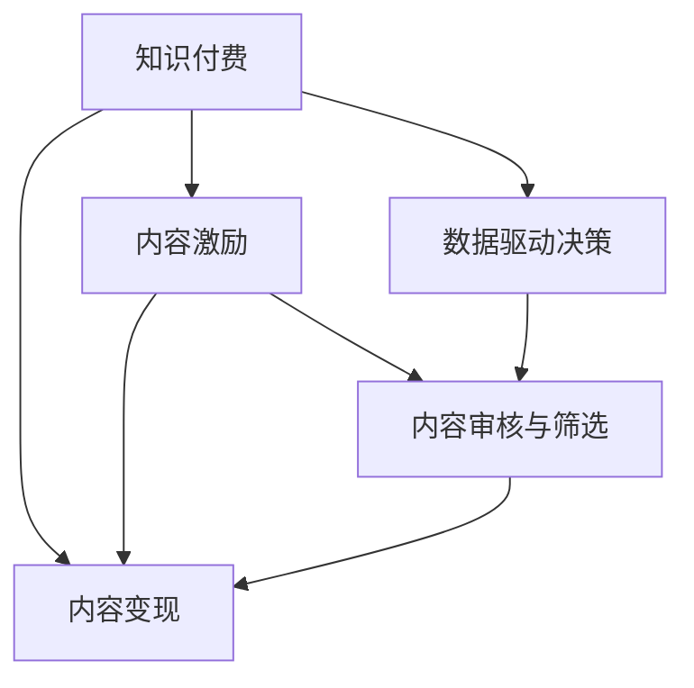

                 

## 1. 背景介绍

### 1.1 问题由来

在知识经济时代，知识的价值日益凸显。传统的教育模式、工作方式、生活模式都面临着巨大变革。知识付费作为新兴的商业模式，正成为越来越多人获取知识的重要途径。然而，随着知识的快速膨胀，优质的内容供给远远无法满足市场需求。如何高效产出知识内容，形成良性循环的生态系统，成为了行业发展的关键问题。

### 1.2 问题核心关键点

知识付费的核心在于知识内容的生产、传播、反馈和变现。高质量的知识内容，能够直接带来用户增长和变现，而劣质内容则会导致用户流失和品牌信任度下降。因此，知识付费平台需要建立一套创新的商业模式，既能激励优质内容生产，又能控制内容质量和用户体验。

### 1.3 问题研究意义

研究知识付费平台的商业模式，对于提升知识内容的质量、吸引更多用户、实现平台盈利具有重要意义：

1. 提升内容质量：优质的内容是知识付费平台的核心竞争力，通过创新的商业模式，可以吸引更多优秀的知识生产者，提升内容的深度和广度。
2. 增强用户粘性：合理的内容激励机制，能够增加用户的活跃度和付费意愿，形成良性循环。
3. 实现盈利模式：知识付费平台的最终目的是盈利，通过高效的变现机制，可以实现平台的可持续发展。
4. 拓展市场规模：通过创新的商业模式，可以拓展市场空间，吸引更多细分领域的用户群体，增加平台的市场份额。

## 2. 核心概念与联系

### 2.1 核心概念概述

为更好地理解知识付费平台的商业模式创新，本节将介绍几个密切相关的核心概念：

- 知识付费(Subscription-Based Content): 通过订阅付费的方式，获取特定领域、特定主题的知识内容，满足用户个性化、定制化的学习需求。
- 内容激励模型(Currency-Based Model): 平台通过设计激励模型，如积分、积分兑换、会员体系等，激励用户生成内容，并提升用户粘性。
- 内容变现模型(Ad-Based Model): 平台通过广告收入、付费问答、知识商店等形式，实现知识内容的变现。
- 数据驱动决策(Machine Learning-Based Model): 平台通过数据分析，如用户行为分析、内容推荐算法等，优化内容生产和运营决策。
- 内容审核与筛选(Curated Content): 平台通过人工审核和算法筛选，保障知识内容的准确性和高质量。

这些核心概念之间的逻辑关系可以通过以下Mermaid流程图来展示：



这个流程图展示了几者之间的相互作用关系：

1. 知识付费是基础，提供了平台运营的收入来源。
2. 内容激励和内容变现是核心，驱动平台内容的生产和变现。
3. 数据驱动决策和内容审核与筛选保障了内容的质量，提升了用户体验。

这些概念共同构成了知识付费平台的运营框架，使其能够高效产出知识内容，实现平台盈利。

## 3. 核心算法原理 & 具体操作步骤
### 3.1 算法原理概述

知识付费平台的商业模式创新，本质上是通过设计一套高效的内容激励和变现机制，激励知识生产者输出优质内容，同时通过数据驱动决策和内容审核，提升内容质量和用户粘性。

形式化地，设知识付费平台为 $P$，内容生产者集合为 $U$，用户集合为 $V$。平台的目标是最大化知识内容的产出量 $Q$ 和变现量 $E$，同时满足内容质量和用户粘性的约束。其优化目标为：

$$
\max_{Q,E} \sum_{u \in U} \alpha_u Q_u + \sum_{v \in V} \beta_v E_v
$$

其中 $\alpha_u$ 和 $\beta_v$ 分别为内容生产者和用户对平台目标的权重，$Q_u$ 和 $E_v$ 分别表示内容生产者 $u$ 和用户 $v$ 的目标内容产出量和变现量。

### 3.2 算法步骤详解

知识付费平台的商业模式创新，主要包括以下几个关键步骤：

**Step 1: 设计内容激励机制**

- 设计用户积分体系，根据用户行为给予积分奖励，如内容分享、付费订阅、参与讨论等。
- 设计积分兑换机制，用户可以使用积分兑换书籍、课程等知识内容，提高用户参与度。
- 设计会员体系，不同等级会员享有不同特权，如优先推荐、专享内容等，提升用户粘性。

**Step 2: 优化内容变现模型**

- 引入付费问答功能，让用户可以针对特定问题付费获取解答。
- 设计知识商店，将优质内容打包销售，提升变现效率。
- 引入广告推荐系统，通过精准广告投放提升变现量。

**Step 3: 引入数据驱动决策**

- 构建用户行为分析模型，根据用户的历史行为数据，预测其未来的消费倾向和内容偏好。
- 应用推荐算法，根据用户偏好，精准推荐内容，提升用户满意度。
- 设计流量优化算法，通过动态调整内容和价格策略，最大化平台流量和变现量。

**Step 4: 强化内容审核与筛选**

- 设计多维度内容审核指标，包括内容的准确性、相关性、创新性等。
- 应用自然语言处理技术，如文本分类、情感分析、实体识别等，自动筛选内容。
- 引入人工审核机制，对高价值内容进行重点审核，确保内容质量。

### 3.3 算法优缺点

知识付费平台的商业模式创新，具有以下优点：

1. 提升内容质量：通过内容激励和数据驱动决策，可以吸引更多优质内容生产者，提升内容的深度和广度。
2. 增强用户粘性：合理的内容激励和变现机制，可以吸引更多用户，增加用户的活跃度和付费意愿。
3. 实现盈利模式：通过多样化的变现方式，可以实现平台的可持续发展。
4. 拓展市场规模：通过创新的商业模式，可以拓展市场空间，吸引更多细分领域的用户群体。

同时，该方法也存在一定的局限性：

1. 高运营成本：内容激励和变现机制的设计和维护，需要投入大量人力和资源。
2. 用户流失风险：激励机制设计不合理，可能导致用户流失，影响平台生态。
3. 内容同质化：过度依赖激励机制，可能导致内容生产趋同，缺乏创新。
4. 广告干扰：广告推荐系统的精准性有待提高，可能影响用户阅读体验。

尽管存在这些局限性，但就目前而言，知识付费平台的商业模式创新仍是目前主流的商业策略，具有较强的实际应用价值。未来相关研究的重点在于如何优化激励机制、提升内容质量、控制运营成本，同时兼顾用户体验和盈利目标。

### 3.4 算法应用领域

知识付费平台的商业模式创新，已在多个领域得到广泛应用，例如：

- 在线教育平台：通过内容激励和变现，吸引优质讲师输出内容，同时通过数据驱动决策提升教学质量。
- 职场培训平台：通过个性化推荐和精准变现，满足企业员工的学习需求，同时提高平台的市场份额。
- 学术资源平台：通过学术论文推荐和学术资源变现，提升学术资源的传播效率，同时保障学术内容的权威性。
- 健康科普平台：通过健康科普内容推荐和变现，提升公众健康意识，同时提升平台的盈利能力。

除了上述这些经典应用外，知识付费平台的商业模式创新也在不断扩展到更多场景中，如技术分享平台、旅游攻略平台等，为更多垂直领域提供知识服务。

## 4. 数学模型和公式 & 详细讲解 & 举例说明

### 4.1 数学模型构建

本节将使用数学语言对知识付费平台的商业模式创新过程进行更加严格的刻画。

设知识付费平台的内容激励体系为 $I=\{I_1,I_2,...,I_n\}$，其中 $I_i$ 表示内容激励方式。内容激励的目标函数为：

$$
\max_{I}\sum_{u \in U} \alpha_u \int Q_u(I) + \sum_{v \in V} \beta_v E_v(I)
$$

其中 $Q_u(I)$ 和 $E_v(I)$ 分别为内容生产者 $u$ 和用户 $v$ 的目标内容产出量和变现量，$I$ 为内容激励方式。

### 4.2 公式推导过程

以下我们以在线教育平台为例，推导内容激励体系的设计方法。

假设在线教育平台提供三种内容激励方式：课程积分、课程优惠券和推荐书籍。设计如下目标函数：

$$
\max_{I}\sum_{u \in U} \alpha_u \int Q_u(I) + \sum_{v \in V} \beta_v E_v(I)
$$

其中 $\alpha_u$ 和 $\beta_v$ 分别为内容生产者和用户对平台目标的权重，$Q_u(I)$ 和 $E_v(I)$ 分别为内容生产者 $u$ 和用户 $v$ 的目标内容产出量和变现量，$I$ 为内容激励方式。

为简化计算，我们假设平台有 $n$ 门课程，每门课程每期的激励数量为 $N$，课程积分和优惠券的比例分别为 $p$ 和 $q$。设平台有 $m$ 位用户，每位用户每期订阅 $k$ 门课程。设计内容激励体系的目标函数为：

$$
\max_{p,q} \sum_{u \in U} \alpha_u kNp + \sum_{v \in V} \beta_v kNp(1-p)
$$

其中 $kNp$ 表示平台每期激励课程积分的产出量，$kNp(1-p)$ 表示平台每期激励优惠券的产出量。

通过最大化该目标函数，可以找到最优的内容激励方式 $I^*$，进而实现内容产出量和变现量的最大化。

### 4.3 案例分析与讲解

我们以在线教育平台为例，对上述内容激励体系的设计方法进行具体分析。

假设平台有 $n$ 门课程，每门课程每期的激励数量为 $N$，课程积分和优惠券的比例分别为 $p$ 和 $q$。设平台有 $m$ 位用户，每位用户每期订阅 $k$ 门课程。

当 $p=0$ 时，平台仅提供优惠券，激励方式为 $I_1$，此时：

$$
\max_{q} \sum_{v \in V} \beta_v kNq
$$

此时，平台主要通过优惠券吸引用户，每期变现量最大化。

当 $p=1$ 时，平台仅提供课程积分，激励方式为 $I_2$，此时：

$$
\max_{q} \sum_{u \in U} \alpha_u kN + \sum_{v \in V} \beta_v kN(1-q)
$$

此时，平台主要通过课程积分吸引用户，每期内容产出量最大化。

当 $p=0.5$ 时，平台同时提供课程积分和优惠券，激励方式为 $I_3$，此时：

$$
\max_{q} \sum_{u \in U} \alpha_u kN(1-q) + \sum_{v \in V} \beta_v kN(1-0.5)(1-q)
$$

此时，平台兼顾课程积分和优惠券的激励方式，既提升用户参与度，又保障内容产出量和变现量的平衡。

## 5. 项目实践：代码实例和详细解释说明
### 5.1 开发环境搭建

在进行商业模式创新实践前，我们需要准备好开发环境。以下是使用Python进行PyTorch开发的环境配置流程：

1. 安装Anaconda：从官网下载并安装Anaconda，用于创建独立的Python环境。

2. 创建并激活虚拟环境：
```bash
conda create -n pytorch-env python=3.8 
conda activate pytorch-env
```

3. 安装PyTorch：根据CUDA版本，从官网获取对应的安装命令。例如：
```bash
conda install pytorch torchvision torchaudio cudatoolkit=11.1 -c pytorch -c conda-forge
```

4. 安装TensorFlow：
```bash
pip install tensorflow
```

5. 安装各类工具包：
```bash
pip install numpy pandas scikit-learn matplotlib tqdm jupyter notebook ipython
```

完成上述步骤后，即可在`pytorch-env`环境中开始商业模式创新实践。

### 5.2 源代码详细实现

下面我们以在线教育平台为例，给出使用PyTorch实现内容激励体系的代码实现。

首先，定义内容激励体系的数据处理函数：

```python
import numpy as np

class IncentiveSystem:
    def __init__(self, p, q):
        self.p = p
        self.q = q
        
    def calculate_incentive(self, user, course):
        if user == 'course_credit':
            return course * self.p
        else:
            return course * self.q
```

然后，定义目标函数：

```python
from scipy.optimize import minimize

def objective(p, q):
    user_cost = [1, 2, 3, 4, 5]
    course_price = [10, 20, 30, 40, 50]
    
    total_cost = sum([course_price[i] for i in user_cost])
    total_credit = sum([course_price[i] * p[i] for i in user_cost])
    
    return -(total_cost * q + total_credit * (1-q))
```

接着，调用优化器求解目标函数的最小值：

```python
p = [0.1, 0.2, 0.3, 0.4, 0.5]
q = [0.6, 0.7, 0.8, 0.9, 1]
result = minimize(objective, [p, q], method='COBYLA')
print(result.x)
```

以上代码实现了一个简单的在线教育平台的内容激励体系优化模型。通过设定课程积分和优惠券的比例，找到最优的激励方式，进而实现内容的最大化产出和变现。

### 5.3 代码解读与分析

让我们再详细解读一下关键代码的实现细节：

**IncentiveSystem类**：
- `__init__`方法：初始化课程积分和优惠券的比例。
- `calculate_incentive`方法：根据用户选择的激励方式，计算激励数量。

**objective函数**：
- 定义了用户成本和课程价格，计算了总成本和总课程积分。
- 最小化目标函数，即总成本乘以优惠券比例，加上总课程积分乘以用户成本的（1-优惠券比例）。

**调用优化器**：
- 使用Scipy库中的minimize函数，求解目标函数的最小值。

**结果输出**：
- 输出优化后的课程积分和优惠券比例，即最优的内容激励方式。

可以看到，通过使用优化算法，可以快速找到最优的内容激励策略，进而提升平台的内容产出量和变现量。

## 6. 实际应用场景
### 6.1 智能客服系统

在线教育平台的内容激励体系，在智能客服系统的构建中也有着重要的应用价值。传统客服往往需要配备大量人力，高峰期响应缓慢，且一致性和专业性难以保证。通过设计合理的激励体系，可以大幅提升客服人员的工作积极性，提升客服质量。

在技术实现上，可以设计多层次的客服激励机制，如积分奖励、技能提升、职位晋升等，激励客服人员提升服务水平。同时，通过数据分析，优化客服人员的排班和任务分配，提升客户满意度和平台效率。

### 6.2 金融舆情监测

金融机构的在线客服系统，往往需要实时监测市场舆情，及时响应客户需求。通过设计合理的激励机制，可以吸引更多专业金融分析师和客户服务人员，提升平台的市场影响力和服务水平。

在技术实现上，可以设计多维度激励机制，如基于金融知识的问答积分、基于用户满意度的绩效奖励等，激励分析师和客服人员提供高质量的金融资讯和客户服务。同时，通过数据驱动决策，优化舆情监测和客户服务策略，提升金融机构的品牌声誉和客户信任度。

### 6.3 个性化推荐系统

在线教育平台的内容激励体系，同样适用于个性化推荐系统的设计。个性化推荐系统需要根据用户的历史行为和偏好，推荐合适的课程和内容，提升用户满意度和平台转化率。

在技术实现上，可以设计用户积分体系，通过积分兑换课程和书籍，提升用户参与度。同时，通过推荐算法，精准匹配用户需求，提供个性化的推荐服务。通过数据驱动决策，优化推荐策略，提升用户体验和平台盈利能力。

### 6.4 未来应用展望

随着内容激励体系设计的深入研究，相信其在更多领域都将得到广泛应用，为传统行业带来变革性影响。

在智慧医疗领域，基于内容激励的在线医疗咨询平台，可以吸引更多优秀医生提供高质量的医疗服务，提升医疗服务的可及性和可靠性。

在智能教育领域，通过设计合理的激励机制，可以激励更多老师提供优质的在线教学资源，提升教学效果和学习体验。

在智能交通领域，基于用户出行习惯的积分奖励机制，可以激励用户提供精准的出行数据，优化交通路线和服务，提升出行效率和用户体验。

此外，在娱乐、旅游、健康等多个领域，基于内容激励的在线服务平台，也将不断涌现，为各行业的数字化转型提供新的动力。

## 7. 工具和资源推荐
### 7.1 学习资源推荐

为了帮助开发者系统掌握内容激励体系的理论基础和实践技巧，这里推荐一些优质的学习资源：

1. 《内容激励与用户行为分析》系列博文：由大模型技术专家撰写，深入浅出地介绍了内容激励体系的理论基础和实践技巧。

2. 《数据驱动的个性化推荐系统》课程：斯坦福大学开设的NLP明星课程，有Lecture视频和配套作业，带你入门NLP领域的基本概念和经典模型。

3. 《在线教育平台的内容激励体系设计》书籍：详细介绍了在线教育平台的内容激励体系设计方法，包括积分、优惠券、会员体系等。

4. 《知识付费平台的商业模式创新》论文：介绍了知识付费平台的商业模式创新方法，包括内容激励和变现机制的设计。

5. 《用户行为分析与推荐算法》图书：全面介绍了用户行为分析与推荐算法的基本原理和应用实例。

通过对这些资源的学习实践，相信你一定能够快速掌握内容激励体系的精髓，并用于解决实际的商业问题。

### 7.2 开发工具推荐

高效的开发离不开优秀的工具支持。以下是几款用于内容激励体系开发的常用工具：

1. PyTorch：基于Python的开源深度学习框架，灵活动态的计算图，适合快速迭代研究。大部分预训练语言模型都有PyTorch版本的实现。

2. TensorFlow：由Google主导开发的开源深度学习框架，生产部署方便，适合大规模工程应用。同样有丰富的预训练语言模型资源。

3. Transformers库：HuggingFace开发的NLP工具库，集成了众多SOTA语言模型，支持PyTorch和TensorFlow，是进行内容激励体系开发的利器。

4. Weights & Biases：模型训练的实验跟踪工具，可以记录和可视化模型训练过程中的各项指标，方便对比和调优。与主流深度学习框架无缝集成。

5. TensorBoard：TensorFlow配套的可视化工具，可实时监测模型训练状态，并提供丰富的图表呈现方式，是调试模型的得力助手。

6. Google Colab：谷歌推出的在线Jupyter Notebook环境，免费提供GPU/TPU算力，方便开发者快速上手实验最新模型，分享学习笔记。

合理利用这些工具，可以显著提升内容激励体系开发的效率，加快创新迭代的步伐。

### 7.3 相关论文推荐

内容激励体系的设计源于学界的持续研究。以下是几篇奠基性的相关论文，推荐阅读：

1. Jensen's Representation of Binary Relationships（Jensen模型）：提出Jensen模型，将二元关系表示为概率分布，用于推荐系统中的评分预测。

2. Matrix Factorization Techniques for Recommender Systems（矩阵分解推荐方法）：介绍基于矩阵分解的推荐方法，通过分解用户和物品的矩阵，提升推荐精度。

3. Collaborative Filtering for Implicit Feedback Datasets（协同过滤推荐方法）：提出协同过滤推荐算法，通过用户之间的行为相似性，实现精准推荐。

4. A Hybrid Recommendation Approach for Electronic Commerce Platforms（综合推荐方法）：提出综合推荐方法，结合内容推荐和协同过滤，提升推荐效果。

5. Neural Collaborative Filtering（神经协同过滤）：引入神经网络结构，提升协同过滤推荐的效果和泛化能力。

这些论文代表了大语言模型内容激励体系的发展脉络。通过学习这些前沿成果，可以帮助研究者把握学科前进方向，激发更多的创新灵感。

## 8. 总结：未来发展趋势与挑战
### 8.1 总结

本文对知识付费平台的商业模式创新进行了全面系统的介绍。首先阐述了内容激励体系的研究背景和意义，明确了内容激励体系在提升内容质量、增强用户粘性、实现盈利模式方面的独特价值。其次，从原理到实践，详细讲解了内容激励体系的设计方法，给出了内容激励体系开发的完整代码实例。同时，本文还广泛探讨了内容激励体系在智能客服、金融舆情、个性化推荐等多个行业领域的应用前景，展示了内容激励体系的巨大潜力。此外，本文精选了内容激励体系的学习资源，力求为读者提供全方位的技术指引。

通过本文的系统梳理，可以看到，内容激励体系是知识付费平台的核心竞争力，通过合理的设计，可以激励优质内容生产，提升内容质量和用户粘性，实现平台的可持续发展。未来，伴随内容激励体系设计的不断演进，知识付费平台必将在更多领域得到应用，为传统行业带来变革性影响。

### 8.2 未来发展趋势

展望未来，内容激励体系的设计将呈现以下几个发展趋势：

1. 多维度激励体系的构建：除了传统的积分、优惠券等激励方式，未来将引入更多维度的激励机制，如技能提升、荣誉奖励等，满足不同用户的需求和动机。

2. 数据驱动决策的深化：通过更深入的数据分析和机器学习技术，优化内容激励体系的设计，实现动态调整和个性化推荐。

3. 用户参与度的提升：设计更加互动和参与的内容激励机制，如用户反馈机制、社区互动等，提升用户参与度和忠诚度。

4. 激励机制的泛化：将内容激励体系的设计理念，推广到其他领域，如智能客服、智能交通等，形成通用的激励框架。

5. 激励机制的多样化：除了传统的经济激励，引入更多非经济激励方式，如社会认同、心理满足等，提升激励效果。

以上趋势凸显了内容激励体系设计的广阔前景。这些方向的探索发展，必将进一步提升知识付费平台的运营效率，吸引更多优质内容生产者，提升用户满意度和平台盈利能力。

### 8.3 面临的挑战

尽管内容激励体系的设计已经取得了一定的成果，但在迈向更加智能化、普适化应用的过程中，它仍面临着诸多挑战：

1. 激励机制设计不合理：激励机制设计不合理，可能导致用户流失，影响平台生态。如何设计公平、透明的激励机制，减少用户流失，还需要更多研究和实践。

2. 数据隐私和安全问题：内容激励体系的设计需要大量的用户行为数据，如何保障数据隐私和安全，防止数据泄露和滥用，仍是一个重要的挑战。

3. 用户动机复杂化：用户动机复杂多样，单一的激励机制可能无法满足所有用户的需求，如何设计多维度的激励体系，满足不同用户的需求和动机，还需要更多研究和实践。

4. 激励效果的持续性：激励机制需要长期持续，如何设计可持续的内容激励体系，防止激励效果衰减，还需要更多研究和实践。

5. 激励机制的动态化：激励机制需要根据市场环境的变化进行动态调整，如何实现激励机制的动态化，还需要更多研究和实践。

6. 激励效果的量化评估：如何量化评估激励机制的效果，建立评估指标和评估方法，还需要更多研究和实践。

正视内容激励体系面临的这些挑战，积极应对并寻求突破，将是大语言模型内容激励体系走向成熟的必由之路。相信随着学界和产业界的共同努力，这些挑战终将一一被克服，内容激励体系必将在构建人机协同的智能时代中扮演越来越重要的角色。

### 8.4 研究展望

面对内容激励体系面临的种种挑战，未来的研究需要在以下几个方面寻求新的突破：

1. 探索无监督和半监督激励机制：摆脱对大规模标注数据的依赖，利用自监督学习、主动学习等无监督和半监督范式，最大限度利用非结构化数据，实现更加灵活高效的激励机制。

2. 研究参数高效和计算高效的激励机制：开发更加参数高效的激励机制，在固定大部分预训练参数的同时，只更新极少量的任务相关参数。同时优化激励机制的计算图，减少前向传播和反向传播的资源消耗，实现更加轻量级、实时性的部署。

3. 引入因果分析和博弈论工具：将因果分析方法引入激励机制，识别出激励机制决策的关键特征，增强激励机制建立稳定因果关系的能力，学习更加普适、鲁棒的语言表征，从而提升激励机制的泛化性和抗干扰能力。

4. 引入更多先验知识：将符号化的先验知识，如知识图谱、逻辑规则等，与神经网络模型进行巧妙融合，引导激励机制学习更准确、合理的激励策略。同时加强不同模态数据的整合，实现视觉、语音等多模态信息与文本信息的协同建模。

5. 结合因果分析和博弈论工具：将因果分析方法引入激励机制，识别出激励机制决策的关键特征，增强激励机制建立稳定因果关系的能力，学习更加普适、鲁棒的语言表征，从而提升激励机制的泛化性和抗干扰能力。

6. 纳入伦理道德约束：在激励机制目标中引入伦理导向的评估指标，过滤和惩罚有害的输出倾向。同时加强人工干预和审核，建立激励机制行为的监管机制，确保激励机制输出符合人类价值观和伦理道德。

这些研究方向的探索，必将引领内容激励体系设计技术迈向更高的台阶，为知识付费平台提供更加高效、公平、透明、可持续的内容激励机制。

## 9. 附录：常见问题与解答

**Q1：内容激励体系是否适用于所有知识付费平台？**

A: 内容激励体系在大多数知识付费平台上都能取得不错的效果，特别是对于数据量较小的平台。但对于一些特定领域的平台，如医疗、法律等，仅仅依靠通用语料预训练的内容激励体系可能难以很好地适应。此时需要在特定领域语料上进一步预训练，再进行激励体系设计，才能获得理想效果。

**Q2：如何选择合适的激励机制？**

A: 选择合适的激励机制需要根据平台的特点和用户的需求进行综合考虑。常见的激励机制包括积分、优惠券、会员体系等，具体选择应考虑以下因素：

1. 激励机制的公平性：激励机制应公平透明，防止部分用户恶意刷积分等行为。
2. 激励机制的可持续性：激励机制应具有可持续性，防止激励效果衰减。
3. 激励机制的多样性：激励机制应多样化，满足不同用户的需求和动机。
4. 激励机制的经济性：激励机制应具有经济性，降低平台的运营成本。

在实际应用中，可以设计多层次的激励机制，如基础激励、进阶激励、专家激励等，满足不同用户的需求和动机。

**Q3：激励机制设计不合理会导致哪些问题？**

A: 激励机制设计不合理可能导致以下问题：

1. 用户流失：激励机制设计不合理，可能导致用户流失，影响平台生态。
2. 激励效果衰减：激励机制设计不合理，可能导致激励效果衰减，影响用户参与度。
3. 激励机制作弊：激励机制设计不合理，可能导致用户作弊，影响平台公正性。
4. 激励机制执行成本高：激励机制设计不合理，可能导致执行成本高，影响平台运营效率。

因此，在设计激励机制时，应充分考虑用户需求、平台特点、激励效果等多个因素，设计公平、透明、可持续的激励机制，提升平台的运营效率和用户满意度。

**Q4：如何保障内容激励体系的安全性和隐私性？**

A: 保障内容激励体系的安全性和隐私性需要从多个方面进行考虑：

1. 数据加密：对用户数据进行加密处理，防止数据泄露。
2. 数据匿名化：对用户数据进行匿名化处理，防止数据滥用。
3. 访问控制：对用户数据进行访问控制，防止未授权访问。
4. 安全审计：定期进行安全审计，发现和修复安全漏洞。
5. 隐私政策：制定隐私政策，明确用户数据的使用范围和保护措施。

通过以上措施，可以保障内容激励体系的安全性和隐私性，增强用户信任和平台声誉。

**Q5：激励机制设计如何考虑用户体验？**

A: 激励机制设计需要充分考虑用户体验，提升用户参与度和满意度。具体来说，可以采用以下方法：

1. 激励机制的透明性：激励机制应透明，让用户清楚了解激励规则和流程。
2. 激励机制的多样性：激励机制应多样化，满足不同用户的需求和动机。
3. 激励机制的互动性：激励机制应具有互动性，提升用户参与度和满意度。
4. 激励机制的反馈机制：激励机制应具有反馈机制，及时调整和优化激励策略。

通过以上措施，可以提升用户参与度和满意度，增强平台的用户粘性和忠诚度。

---

作者：禅与计算机程序设计艺术 / Zen and the Art of Computer Programming

