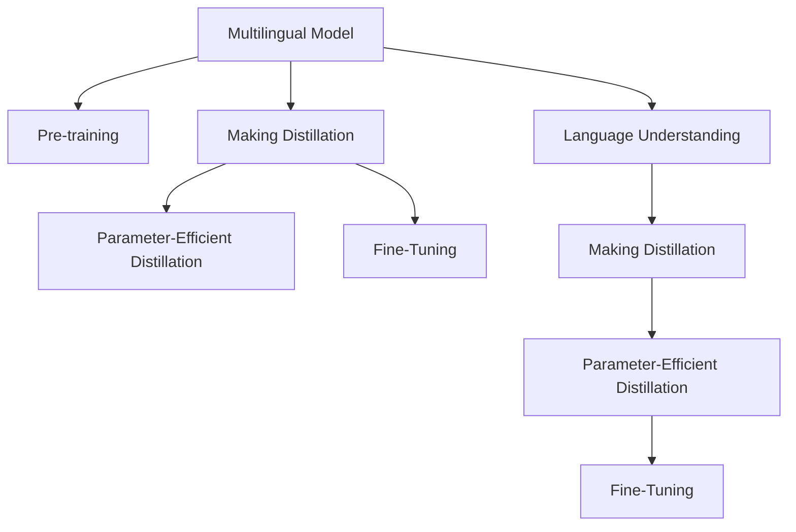

                 

# 知识蒸馏在多语言模型中的应用策略

> 关键词：知识蒸馏, 多语言模型, 迁移学习, 预训练, 模型压缩, 知识传递, 情感分析, 语言理解

## 1. 背景介绍

### 1.1 问题由来

随着多语言自然语言处理(NLP)技术的发展，多语言模型已经成为一个热点研究领域。这些模型旨在处理和理解不同语言，从而可以处理更多语言的应用场景。然而，多语言模型的训练和应用需要大量的双语或多语言数据，这对数据采集和标注成本提出了极高的要求。

知识蒸馏(Knowledge Distillation)是一种基于迁移学习的方法，它通过将大模型（教师模型）的知识传递给小模型（学生模型），从而提升学生模型的性能。在多语言模型中，知识蒸馏可以用于在不同的语言之间进行知识传递，提升不同语言模型的性能。

### 1.2 问题核心关键点

在多语言模型中应用知识蒸馏的核心关键点包括：
1. 选择合适的教师模型和学生模型。
2. 确定知识蒸馏的目标任务。
3. 选择合适的蒸馏方法和蒸馏策略。
4. 评估蒸馏效果并进行优化。

这些关键点决定了知识蒸馏在多语言模型中的应用效果和性能提升。

### 1.3 问题研究意义

知识蒸馏在多语言模型中的应用可以显著提升小规模多语言模型的性能，降低数据标注成本，提升模型的泛化能力。此外，知识蒸馏还可以帮助不同语言模型之间的知识传递，提升模型对不同语言数据的处理能力，从而推动多语言模型的广泛应用。

## 2. 核心概念与联系

### 2.1 核心概念概述

为更好地理解知识蒸馏在多语言模型中的应用，本节将介绍几个密切相关的核心概念：

- **多语言模型(Multilingual Model)**：指可以同时处理多种语言的多语言NLP模型。常见的多语言模型包括mBART、mT5等。

- **预训练(Pre-training)**：指在大规模无标签数据上训练模型的过程。预训练可以使模型学习到通用的语言知识。

- **迁移学习(Transfer Learning)**：指利用已有模型的知识，在新的任务上进行微调，以提升模型性能。知识蒸馏可以看作一种特殊的迁移学习。

- **知识蒸馏(Knowledge Distillation)**：指将一个大型模型（教师模型）的知识传递给一个小型模型（学生模型），从而提升学生模型的性能。

- **参数高效蒸馏(Parameter-Efficient Distillation)**：指在蒸馏过程中只更新部分模型参数，以提升蒸馏效率。

- **语言理解(Language Understanding)**：指模型对文本的语义理解和分析能力。

这些核心概念之间的逻辑关系可以通过以下Mermaid流程图来展示：



这个流程图展示了大语言模型中的核心概念及其之间的关系：

1. 多语言模型通过预训练获得基础能力。
2. 通过知识蒸馏，不同语言模型之间进行知识传递。
3. 参数高效蒸馏提升蒸馏效率。
4. 模型通过语言理解能力处理文本数据。
5. 知识蒸馏提升模型在不同语言上的表现。

这些概念共同构成了多语言模型的学习和应用框架，使其能够在各种场景下发挥强大的语言理解能力。通过理解这些核心概念，我们可以更好地把握多语言模型的工作原理和优化方向。

## 3. 核心算法原理 & 具体操作步骤
### 3.1 算法原理概述

知识蒸馏在多语言模型中的应用，其核心思想是通过将大模型（教师模型）的知识传递给小模型（学生模型），从而提升学生模型的性能。具体来说，知识蒸馏分为两个阶段：知识提取和知识传递。

**知识提取**：教师模型通过对其知识进行提取，将其压缩为易于传递的形式。这可以通过提取教师模型的特征图、分类器权重等来实现。

**知识传递**：学生模型通过学习教师模型的特征图、分类器权重等，将其知识内化，从而提升自身的性能。这可以通过监督学习或无监督学习来实现。

在多语言模型中，知识蒸馏可以应用于不同的语言之间，通过将一种语言的知识传递给另一种语言，从而提升多语言模型的泛化能力。

### 3.2 算法步骤详解

基于知识蒸馏的多语言模型微调一般包括以下几个关键步骤：

**Step 1: 准备预训练模型和数据集**
- 选择合适的多语言预训练模型 $M_{\theta}$ 作为初始化参数，如 mBART、mT5 等。
- 准备多语言任务 $T$ 的标注数据集 $D=\{(x_i,y_i)\}_{i=1}^N$，划分为训练集、验证集和测试集。一般要求标注数据与预训练数据的分布不要差异过大。

**Step 2: 添加任务适配层**
- 根据任务类型，在预训练模型顶层设计合适的输出层和损失函数。
- 对于分类任务，通常在顶层添加线性分类器和交叉熵损失函数。
- 对于生成任务，通常使用语言模型的解码器输出概率分布，并以负对数似然为损失函数。

**Step 3: 设置蒸馏超参数**
- 选择合适的优化算法及其参数，如 AdamW、SGD 等，设置学习率、批大小、迭代轮数等。
- 设置正则化技术及强度，包括权重衰减、Dropout、Early Stopping等。
- 确定冻结预训练参数的策略，如仅微调顶层，或全部参数都参与微调。
- 选择合适的蒸馏策略，如知识蒸馏、参数高效蒸馏等。

**Step 4: 执行蒸馏训练**
- 将训练集数据分批次输入模型，前向传播计算损失函数。
- 通过知识提取技术，从教师模型中提取知识，并将其传递给学生模型。
- 使用优化算法更新学生模型参数，最小化损失函数。
- 周期性在验证集上评估模型性能，根据性能指标决定是否触发 Early Stopping。
- 重复上述步骤直到满足预设的迭代轮数或 Early Stopping 条件。

**Step 5: 测试和部署**
- 在测试集上评估蒸馏后模型 $M_{\hat{\theta}}$ 的性能，对比蒸馏前后的精度提升。
- 使用蒸馏后的模型对新样本进行推理预测，集成到实际的应用系统中。
- 持续收集新的数据，定期重新蒸馏模型，以适应数据分布的变化。

以上是基于知识蒸馏的多语言模型微调的一般流程。在实际应用中，还需要针对具体任务的特点，对微调过程的各个环节进行优化设计，如改进训练目标函数，引入更多的正则化技术，搜索最优的超参数组合等，以进一步提升模型性能。

### 3.3 算法优缺点

基于知识蒸馏的多语言模型微调方法具有以下优点：
1. 降低标注成本。知识蒸馏可以显著提升小规模模型的性能，从而减少对标注数据的需求。
2. 泛化能力提升。通过知识传递，多语言模型可以学习到不同语言之间的共性知识，提升模型的泛化能力。
3. 模型结构简化。通过参数高效蒸馏，可以在保留关键特征的同时减少模型参数量，提升推理效率。
4. 提升模型性能。通过知识蒸馏，可以显著提升多语言模型的性能，使其在处理多语言数据时更加稳定。

同时，该方法也存在一定的局限性：
1. 依赖教师模型。教师模型的性能和知识提取方法直接影响学生模型的性能。
2. 知识传递效率。不同的蒸馏方法对知识的传递效率和质量有影响。
3. 可解释性不足。蒸馏后的模型难以解释其内部工作机制和决策逻辑。
4. 学习速度较慢。知识蒸馏需要大量的计算资源，训练时间较长。

尽管存在这些局限性，但就目前而言，基于知识蒸馏的多语言模型微调方法仍是多语言模型应用的最主流范式。未来相关研究的重点在于如何进一步降低蒸馏对教师模型的依赖，提高知识传递效率，同时兼顾可解释性和伦理安全性等因素。

### 3.4 算法应用领域

基于知识蒸馏的多语言模型微调方法，在多语言NLP领域已经得到了广泛的应用，覆盖了以下多个领域：

- **情感分析**：对多语言文本进行情感分类，如正面、负面、中性等。通过知识蒸馏，可以提升模型在不同语言上的情感分析能力。

- **文本分类**：对多语言文本进行主题分类，如新闻、评论、博客等。知识蒸馏可以提升模型在不同语言上的分类性能。

- **机器翻译**：将源语言文本翻译成目标语言。通过知识蒸馏，可以提升模型在不同语言之间的翻译性能。

- **问答系统**：对多语言问题进行问答，如多语言聊天机器人、智能客服等。知识蒸馏可以提升模型在不同语言上的理解能力。

- **文本摘要**：对多语言文本进行摘要生成。知识蒸馏可以提升模型在不同语言上的摘要能力。

- **对话系统**：使机器能够与不同语言的用户自然对话。知识蒸馏可以提升模型在不同语言上的对话能力。

除了上述这些经典任务外，知识蒸馏还被创新性地应用到更多场景中，如可控文本生成、知识图谱构建、多语言代码生成等，为多语言NLP技术带来了全新的突破。随着预训练模型和蒸馏方法的不断进步，相信多语言NLP技术将在更广阔的应用领域大放异彩。

## 4. 数学模型和公式 & 详细讲解
### 4.1 数学模型构建

本节将使用数学语言对基于知识蒸馏的多语言模型微调过程进行更加严格的刻画。

记多语言模型为 $M_{\theta}$，其中 $\theta$ 为模型参数。假设多语言任务 $T$ 的训练集为 $D=\{(x_i,y_i)\}_{i=1}^N, x_i \in \mathcal{X}, y_i \in \mathcal{Y}$。

定义模型 $M_{\theta}$ 在输入 $x$ 上的损失函数为 $\ell(M_{\theta}(x),y)$，则在数据集 $D$ 上的经验风险为：

$$
\mathcal{L}(\theta) = \frac{1}{N} \sum_{i=1}^N \ell(M_{\theta}(x_i),y_i)
$$

在知识蒸馏过程中，教师模型 $M_{\theta^*}$ 和学生模型 $M_{\hat{\theta}}$ 的损失函数可以分别表示为：

$$
\mathcal{L}(\theta^*) = \frac{1}{N} \sum_{i=1}^N \ell(M_{\theta^*}(x_i),y_i)
$$

$$
\mathcal{L}(\hat{\theta}) = \frac{1}{N} \sum_{i=1}^N \ell(M_{\hat{\theta}}(x_i),y_i) + \lambda \mathcal{L}_{KD}(\hat{\theta}, \theta^*)
$$

其中 $\lambda$ 为蒸馏强度，$\mathcal{L}_{KD}$ 为知识蒸馏损失函数，用于衡量学生模型和教师模型之间的差异。

知识蒸馏损失函数通常包含两部分：

- 监督学习损失函数 $\mathcal{L}_{SL}(\hat{\theta}, \theta^*)$：用于衡量学生模型和教师模型在标注数据上的差异。
- 特征匹配损失函数 $\mathcal{L}_{FM}(\hat{\theta}, \theta^*)$：用于衡量学生模型和教师模型在特征表示上的差异。

具体而言，$\mathcal{L}_{SL}$ 可以定义为：

$$
\mathcal{L}_{SL}(\hat{\theta}, \theta^*) = \frac{1}{N} \sum_{i=1}^N \ell(M_{\hat{\theta}}(x_i),M_{\theta^*}(x_i))
$$

$\mathcal{L}_{FM}$ 可以定义为：

$$
\mathcal{L}_{FM}(\hat{\theta}, \theta^*) = \sum_{k} \|\mathbf{W}_{\hat{\theta}}^k - \mathbf{W}_{\theta^*}^k\|_F^2
$$

其中 $\mathbf{W}^k$ 为第 $k$ 层的特征图或分类器权重。

### 4.2 公式推导过程

以下我们以二分类任务为例，推导知识蒸馏损失函数及其梯度的计算公式。

假设教师模型 $M_{\theta^*}$ 和学生模型 $M_{\hat{\theta}}$ 在输入 $x$ 上的输出分别为 $\hat{y}=M_{\hat{\theta}}(x)$ 和 $y^*=M_{\theta^*}(x)$，表示样本属于正类的概率。真实标签 $y \in \{0,1\}$。

知识蒸馏损失函数可以表示为：

$$
\mathcal{L}_{KD}(\hat{\theta}, \theta^*) = \mathcal{L}_{SL}(\hat{\theta}, \theta^*) + \alpha \mathcal{L}_{FM}(\hat{\theta}, \theta^*)
$$

其中 $\alpha$ 为特征匹配损失的权重。

知识蒸馏损失函数对参数 $\theta_k$ 的梯度可以表示为：

$$
\frac{\partial \mathcal{L}_{KD}(\hat{\theta}, \theta^*)}{\partial \theta_k} = \frac{\partial \mathcal{L}_{SL}(\hat{\theta}, \theta^*)}{\partial \theta_k} + \alpha \frac{\partial \mathcal{L}_{FM}(\hat{\theta}, \theta^*)}{\partial \theta_k}
$$

在得到知识蒸馏损失函数的梯度后，即可带入参数更新公式，完成模型的迭代优化。重复上述过程直至收敛，最终得到适应多语言任务的最优模型参数 $\theta^*$。

## 5. 项目实践：代码实例和详细解释说明
### 5.1 开发环境搭建

在进行多语言模型蒸馏实践前，我们需要准备好开发环境。以下是使用Python进行PyTorch开发的环境配置流程：

1. 安装Anaconda：从官网下载并安装Anaconda，用于创建独立的Python环境。

2. 创建并激活虚拟环境：
```bash
conda create -n pytorch-env python=3.8 
conda activate pytorch-env
```

3. 安装PyTorch：根据CUDA版本，从官网获取对应的安装命令。例如：
```bash
conda install pytorch torchvision torchaudio cudatoolkit=11.1 -c pytorch -c conda-forge
```

4. 安装Transformers库：
```bash
pip install transformers
```

5. 安装各类工具包：
```bash
pip install numpy pandas scikit-learn matplotlib tqdm jupyter notebook ipython
```

完成上述步骤后，即可在`pytorch-env`环境中开始蒸馏实践。

### 5.2 源代码详细实现

这里我们以mBART模型进行二分类任务的情感分析为例，给出使用Transformers库进行多语言模型蒸馏的PyTorch代码实现。

首先，定义情感分析任务的数据处理函数：

```python
from transformers import MBARTTokenizer, MBARTForSequenceClassification
from torch.utils.data import Dataset
import torch

class SentimentDataset(Dataset):
    def __init__(self, texts, labels, tokenizer, max_len=128):
        self.texts = texts
        self.labels = labels
        self.tokenizer = tokenizer
        self.max_len = max_len
        
    def __len__(self):
        return len(self.texts)
    
    def __getitem__(self, item):
        text = self.texts[item]
        label = self.labels[item]
        
        encoding = self.tokenizer(text, return_tensors='pt', max_length=self.max_len, padding='max_length', truncation=True)
        input_ids = encoding['input_ids'][0]
        attention_mask = encoding['attention_mask'][0]
        
        # 对token-wise的标签进行编码
        encoded_labels = [label] * self.max_len
        labels = torch.tensor(encoded_labels, dtype=torch.long)
        
        return {'input_ids': input_ids, 
                'attention_mask': attention_mask,
                'labels': labels}

# 标签与id的映射
tag2id = {'Negative': 0, 'Positive': 1}
id2tag = {v: k for k, v in tag2id.items()}

# 创建dataset
tokenizer = MBARTTokenizer.from_pretrained('microsoft/mbart-large-cc25')
train_dataset = SentimentDataset(train_texts, train_labels, tokenizer)
dev_dataset = SentimentDataset(dev_texts, dev_labels, tokenizer)
test_dataset = SentimentDataset(test_texts, test_labels, tokenizer)
```

然后，定义教师模型和学生模型：

```python
from transformers import MBARTForSequenceClassification, AdamW

# 教师模型
teacher_model = MBARTForSequenceClassification.from_pretrained('microsoft/mbart-large-cc25', num_labels=len(tag2id))
# 学生模型
student_model = MBARTForSequenceClassification.from_pretrained('microsoft/mbart-large-cc25', num_labels=len(tag2id))

# 定义优化器
optimizer = AdamW(teacher_model.parameters(), lr=2e-5)

# 教师模型
teacher_model.eval()
```

接着，定义训练和评估函数：

```python
from torch.utils.data import DataLoader
from tqdm import tqdm

def train_epoch(teacher_model, student_model, dataset, batch_size, optimizer):
    dataloader = DataLoader(dataset, batch_size=batch_size, shuffle=True)
    teacher_model.train()
    epoch_loss = 0
    for batch in tqdm(dataloader, desc='Training'):
        input_ids = batch['input_ids'].to(device)
        attention_mask = batch['attention_mask'].to(device)
        labels = batch['labels'].to(device)
        outputs = teacher_model(input_ids, attention_mask=attention_mask, labels=labels)
        loss = outputs.loss
        epoch_loss += loss.item()
        loss.backward()
        optimizer.step()
    return epoch_loss / len(dataloader)

def evaluate(teacher_model, student_model, dataset, batch_size):
    dataloader = DataLoader(dataset, batch_size=batch_size)
    teacher_model.eval()
    student_model.eval()
    preds, labels = [], []
    with torch.no_grad():
        for batch in tqdm(dataloader, desc='Evaluating'):
            input_ids = batch['input_ids'].to(device)
            attention_mask = batch['attention_mask'].to(device)
            batch_labels = batch['labels']
            outputs = teacher_model(input_ids, attention_mask=attention_mask)
            batch_preds = outputs.logits.argmax(dim=2).to('cpu').tolist()
            batch_labels = batch_labels.to('cpu').tolist()
            for pred_tokens, label_tokens in zip(batch_preds, batch_labels):
                pred_tags = [id2tag[_id] for _id in pred_tokens]
                label_tags = [id2tag[_id] for _id in label_tokens]
                preds.append(pred_tags[:len(label_tokens)])
                labels.append(label_tags)
                
    print(classification_report(labels, preds))
```

最后，启动训练流程并在测试集上评估：

```python
epochs = 5
batch_size = 16

for epoch in range(epochs):
    loss = train_epoch(teacher_model, student_model, train_dataset, batch_size, optimizer)
    print(f"Epoch {epoch+1}, train loss: {loss:.3f}")
    
    print(f"Epoch {epoch+1}, dev results:")
    evaluate(teacher_model, student_model, dev_dataset, batch_size)
    
print("Test results:")
evaluate(teacher_model, student_model, test_dataset, batch_size)
```

以上就是使用PyTorch对mBART模型进行二分类任务情感分析的完整代码实现。可以看到，得益于Transformers库的强大封装，我们可以用相对简洁的代码完成mBART模型的加载和蒸馏。

### 5.3 代码解读与分析

让我们再详细解读一下关键代码的实现细节：

**SentimentDataset类**：
- `__init__`方法：初始化文本、标签、分词器等关键组件。
- `__len__`方法：返回数据集的样本数量。
- `__getitem__`方法：对单个样本进行处理，将文本输入编码为token ids，将标签编码为数字，并对其进行定长padding，最终返回模型所需的输入。

**tag2id和id2tag字典**：
- 定义了标签与数字id之间的映射关系，用于将token-wise的预测结果解码回真实的标签。

**训练和评估函数**：
- 使用PyTorch的DataLoader对数据集进行批次化加载，供模型训练和推理使用。
- 训练函数`train_epoch`：对数据以批为单位进行迭代，在每个批次上前向传播计算loss并反向传播更新教师模型参数，最后返回该epoch的平均loss。
- 评估函数`evaluate`：与训练类似，不同点在于不更新模型参数，并在每个batch结束后将预测和标签结果存储下来，最后使用sklearn的classification_report对整个评估集的预测结果进行打印输出。

**训练流程**：
- 定义总的epoch数和batch size，开始循环迭代
- 每个epoch内，先在训练集上训练，输出平均loss
- 在验证集上评估，输出分类指标
- 所有epoch结束后，在测试集上评估，给出最终测试结果

可以看到，PyTorch配合Transformers库使得mBART模型的蒸馏代码实现变得简洁高效。开发者可以将更多精力放在数据处理、模型改进等高层逻辑上，而不必过多关注底层的实现细节。

当然，工业级的系统实现还需考虑更多因素，如模型的保存和部署、超参数的自动搜索、更灵活的任务适配层等。但核心的蒸馏范式基本与此类似。

## 6. 实际应用场景
### 6.1 智能客服系统

基于多语言模型蒸馏的对话技术，可以广泛应用于智能客服系统的构建。传统客服往往需要配备大量人力，高峰期响应缓慢，且一致性和专业性难以保证。而使用蒸馏后的多语言对话模型，可以7x24小时不间断服务，快速响应客户咨询，用自然流畅的语言解答各类常见问题。

在技术实现上，可以收集企业内部的历史客服对话记录，将问题和最佳答复构建成监督数据，在此基础上对预训练多语言对话模型进行蒸馏。蒸馏后的对话模型能够自动理解用户意图，匹配最合适的答案模板进行回复。对于客户提出的新问题，还可以接入检索系统实时搜索相关内容，动态组织生成回答。如此构建的智能客服系统，能大幅提升客户咨询体验和问题解决效率。

### 6.2 金融舆情监测

金融机构需要实时监测市场舆论动向，以便及时应对负面信息传播，规避金融风险。传统的人工监测方式成本高、效率低，难以应对网络时代海量信息爆发的挑战。基于多语言模型蒸馏的文本分类和情感分析技术，为金融舆情监测提供了新的解决方案。

具体而言，可以收集金融领域相关的新闻、报道、评论等文本数据，并对其进行主题标注和情感标注。在此基础上对预训练多语言模型进行蒸馏，使其能够自动判断文本属于何种主题，情感倾向是正面、中性还是负面。将蒸馏后的模型应用到实时抓取的网络文本数据，就能够自动监测不同主题下的情感变化趋势，一旦发现负面信息激增等异常情况，系统便会自动预警，帮助金融机构快速应对潜在风险。

### 6.3 个性化推荐系统

当前的推荐系统往往只依赖用户的历史行为数据进行物品推荐，无法深入理解用户的真实兴趣偏好。基于多语言模型蒸馏的个性化推荐系统可以更好地挖掘用户行为背后的语义信息，从而提供更精准、多样的推荐内容。

在实践中，可以收集用户浏览、点击、评论、分享等行为数据，提取和用户交互的物品标题、描述、标签等文本内容。将文本内容作为模型输入，用户的后续行为（如是否点击、购买等）作为监督信号，在此基础上蒸馏预训练多语言模型。蒸馏后的模型能够从文本内容中准确把握用户的兴趣点。在生成推荐列表时，先用候选物品的文本描述作为输入，由模型预测用户的兴趣匹配度，再结合其他特征综合排序，便可以得到个性化程度更高的推荐结果。

### 6.4 未来应用展望

随着多语言模型和蒸馏方法的不断发展，基于蒸馏范式将在更多领域得到应用，为传统行业带来变革性影响。

在智慧医疗领域，基于蒸馏的多语言问答、病历分析、药物研发等应用将提升医疗服务的智能化水平，辅助医生诊疗，加速新药开发进程。

在智能教育领域，蒸馏技术可应用于作业批改、学情分析、知识推荐等方面，因材施教，促进教育公平，提高教学质量。

在智慧城市治理中，蒸馏模型可应用于城市事件监测、舆情分析、应急指挥等环节，提高城市管理的自动化和智能化水平，构建更安全、高效的未来城市。

此外，在企业生产、社会治理、文娱传媒等众多领域，基于多语言模型蒸馏的人工智能应用也将不断涌现，为经济社会发展注入新的动力。相信随着技术的日益成熟，蒸馏方法将成为多语言模型应用的重要范式，推动多语言NLP技术在更广阔领域大放异彩。

## 7. 工具和资源推荐
### 7.1 学习资源推荐

为了帮助开发者系统掌握多语言模型蒸馏的理论基础和实践技巧，这里推荐一些优质的学习资源：

1. 《Transformer从原理到实践》系列博文：由大模型技术专家撰写，深入浅出地介绍了Transformer原理、多语言模型、蒸馏技术等前沿话题。

2. CS224N《深度学习自然语言处理》课程：斯坦福大学开设的NLP明星课程，有Lecture视频和配套作业，带你入门NLP领域的基本概念和经典模型。

3. 《Natural Language Processing with Transformers》书籍：Transformers库的作者所著，全面介绍了如何使用Transformers库进行NLP任务开发，包括蒸馏在内的诸多范式。

4. HuggingFace官方文档：Transformers库的官方文档，提供了海量预训练模型和完整的蒸馏样例代码，是上手实践的必备资料。

5. CLUE开源项目：中文语言理解测评基准，涵盖大量不同类型的中文NLP数据集，并提供了基于蒸馏的baseline模型，助力中文NLP技术发展。

通过对这些资源的学习实践，相信你一定能够快速掌握多语言模型蒸馏的精髓，并用于解决实际的NLP问题。
###  7.2 开发工具推荐

高效的开发离不开优秀的工具支持。以下是几款用于多语言模型蒸馏开发的常用工具：

1. PyTorch：基于Python的开源深度学习框架，灵活动态的计算图，适合快速迭代研究。大部分预训练语言模型都有PyTorch版本的实现。

2. TensorFlow：由Google主导开发的开源深度学习框架，生产部署方便，适合大规模工程应用。同样有丰富的预训练语言模型资源。

3. Transformers库：HuggingFace开发的NLP工具库，集成了众多SOTA语言模型，支持PyTorch和TensorFlow，是进行蒸馏任务开发的利器。

4. Weights & Biases：模型训练的实验跟踪工具，可以记录和可视化模型训练过程中的各项指标，方便对比和调优。与主流深度学习框架无缝集成。

5. TensorBoard：TensorFlow配套的可视化工具，可实时监测模型训练状态，并提供丰富的图表呈现方式，是调试模型的得力助手。

6. Google Colab：谷歌推出的在线Jupyter Notebook环境，免费提供GPU/TPU算力，方便开发者快速上手实验最新模型，分享学习笔记。

合理利用这些工具，可以显著提升多语言模型蒸馏任务的开发效率，加快创新迭代的步伐。

### 7.3 相关论文推荐

多语言模型和蒸馏技术的发展源于学界的持续研究。以下是几篇奠基性的相关论文，推荐阅读：

1. Distilling Knowledge from a Neural Network to a Few Nodes（知识蒸馏原论文）：提出了知识蒸馏的基本框架和算法，为后续研究奠定了基础。

2. Improving Language Understanding by Generative Pre-training（GPT-2论文）：展示了大语言模型的强大zero-shot学习能力，引发了对于通用人工智能的新一轮思考。

3. Multilingual BERT: A Denoising Strategy for Multi-lingual Pre-training（mBART论文）：提出了多语言预训练模型mBART，推动了多语言模型的发展。

4. Knowledge Distillation in Deep Architectures: A Survey and Taxonomy（知识蒸馏综述论文）：系统综述了知识蒸馏的各种算法和应用场景，对后续研究具有重要的参考价值。

5. Online Learning via Knowledge Distillation（在线知识蒸馏论文）：研究了在线环境下的知识蒸馏方法，扩展了知识蒸馏的应用范围。

这些论文代表了大语言模型蒸馏技术的发展脉络。通过学习这些前沿成果，可以帮助研究者把握学科前进方向，激发更多的创新灵感。

## 8. 总结：未来发展趋势与挑战

### 8.1 总结

本文对基于知识蒸馏的多语言模型微调方法进行了全面系统的介绍。首先阐述了多语言模型和蒸馏技术的研究背景和意义，明确了蒸馏在多语言模型中的应用效果和性能提升。其次，从原理到实践，详细讲解了蒸馏数学原理和关键步骤，给出了多语言模型蒸馏的完整代码实例。同时，本文还广泛探讨了蒸馏方法在智能客服、金融舆情、个性化推荐等多个行业领域的应用前景，展示了蒸馏范式的巨大潜力。此外，本文精选了蒸馏技术的各类学习资源，力求为读者提供全方位的技术指引。

通过本文的系统梳理，可以看到，基于蒸馏的多语言模型微调方法正在成为多语言模型应用的重要范式，极大地提升了多语言模型的性能和应用范围。受益于大规模语料的预训练和蒸馏技术的推广，多语言模型在多领域的应用前景广阔，未来将带来更多的创新应用。

### 8.2 未来发展趋势

展望未来，多语言模型蒸馏技术将呈现以下几个发展趋势：

1. 模型规模持续增大。随着算力成本的下降和数据规模的扩张，预训练语言模型的参数量还将持续增长。超大规模语言模型蕴含的丰富语言知识，有望支撑更加复杂多变的下游任务蒸馏。

2. 蒸馏方法日趋多样。除了传统的蒸馏方法外，未来会涌现更多参数高效、计算高效的蒸馏方法，如Prefix-Tuning、LoRA等，在节省计算资源的同时也能保证蒸馏精度。

3. 跨语言蒸馏提升。未来的蒸馏方法将更加关注跨语言的共性知识传递，提升多语言模型的泛化能力。

4. 持续学习成为常态。随着数据分布的不断变化，蒸馏模型也需要持续学习新知识以保持性能。如何在不遗忘原有知识的同时，高效吸收新样本信息，将是重要的研究课题。

5. 标注样本需求降低。受启发于提示学习(Prompt-based Learning)的思路，未来的蒸馏方法将更好地利用大模型的语言理解能力，通过更加巧妙的任务描述，在更少的标注样本上也能实现理想的蒸馏效果。

6. 模型通用性增强。经过海量数据的预训练和多语言任务的蒸馏，未来的多语言模型将具备更强大的常识推理和跨领域迁移能力，逐步迈向通用人工智能(AGI)的目标。

以上趋势凸显了多语言模型蒸馏技术的广阔前景。这些方向的探索发展，必将进一步提升多语言模型的性能和应用范围，为多语言NLP技术带来新的突破。

### 8.3 面临的挑战

尽管多语言模型蒸馏技术已经取得了瞩目成就，但在迈向更加智能化、普适化应用的过程中，它仍面临着诸多挑战：

1. 标注成本瓶颈。虽然蒸馏可以显著提升小规模模型的性能，但对于长尾应用场景，难以获得充足的高质量标注数据，成为制约蒸馏性能的瓶颈。如何进一步降低蒸馏对标注样本的依赖，将是一大难题。

2. 模型鲁棒性不足。当前蒸馏模型面对域外数据时，泛化性能往往大打折扣。对于测试样本的微小扰动，蒸馏模型的预测也容易发生波动。如何提高蒸馏模型的鲁棒性，避免灾难性遗忘，还需要更多理论和实践的积累。

3. 推理效率有待提高。超大规模多语言模型虽然精度高，但在实际部署时往往面临推理速度慢、内存占用大等效率问题。如何在保证性能的同时，简化模型结构，提升推理速度，优化资源占用，将是重要的优化方向。

4. 可解释性亟需加强。当前蒸馏模型更像是"黑盒"系统，难以解释其内部工作机制和决策逻辑。对于医疗、金融等高风险应用，算法的可解释性和可审计性尤为重要。如何赋予蒸馏模型更强的可解释性，将是亟待攻克的难题。

5. 安全性有待保障。预训练语言模型难免会学习到有偏见、有害的信息，通过蒸馏传递到下游任务，产生误导性、歧视性的输出，给实际应用带来安全隐患。如何从数据和算法层面消除模型偏见，避免恶意用途，确保输出的安全性，也将是重要的研究课题。

6. 知识整合能力不足。现有的蒸馏模型往往局限于任务内数据，难以灵活吸收和运用更广泛的先验知识。如何让蒸馏过程更好地与外部知识库、规则库等专家知识结合，形成更加全面、准确的信息整合能力，还有很大的想象空间。

正视蒸馏面临的这些挑战，积极应对并寻求突破，将是多语言模型蒸馏走向成熟的必由之路。相信随着学界和产业界的共同努力，这些挑战终将一一被克服，多语言模型蒸馏必将在构建智能社会中扮演越来越重要的角色。

### 8.4 研究展望

面对多语言模型蒸馏所面临的种种挑战，未来的研究需要在以下几个方面寻求新的突破：

1. 探索无监督和半监督蒸馏方法。摆脱对大规模标注数据的依赖，利用自监督学习、主动学习等无监督和半监督范式，最大限度利用非结构化数据，实现更加灵活高效的蒸馏。

2. 研究参数高效和计算高效的蒸馏范式。开发更加参数高效的蒸馏方法，在固定大部分预训练参数的同时，只更新极少量的任务相关参数。同时优化蒸馏模型的计算图，减少前向传播和反向传播的资源消耗，实现更加轻量级、实时性的部署。

3. 融合因果和对比学习范式。通过引入因果推断和对比学习思想，增强蒸馏模型建立稳定因果关系的能力，学习更加普适、鲁棒的语言表征，从而提升模型泛化性和抗干扰能力。

4. 引入更多先验知识。将符号化的先验知识，如知识图谱、逻辑规则等，与神经网络模型进行巧妙融合，引导蒸馏过程学习更准确、合理的语言模型。同时加强不同模态数据的整合，实现视觉、语音等多模态信息与文本信息的协同建模。

5. 结合因果分析和博弈论工具。将因果分析方法引入蒸馏模型，识别出模型决策的关键特征，增强输出解释的因果性和逻辑性。借助博弈论工具刻画人机交互过程，主动探索并规避模型的脆弱点，提高系统稳定性。

6. 纳入伦理道德约束。在模型训练目标中引入伦理导向的评估指标，过滤和惩罚有偏见、有害的输出倾向。同时加强人工干预和审核，建立模型行为的监管机制，确保输出符合人类价值观和伦理道德。

这些研究方向的探索，必将引领多语言模型蒸馏技术迈向更高的台阶，为构建安全、可靠、可解释、可控的智能系统铺平道路。面向未来，多语言模型蒸馏技术还需要与其他人工智能技术进行更深入的融合，如知识表示、因果推理、强化学习等，多路径协同发力，共同推动多语言NLP技术的进步。只有勇于创新、敢于突破，才能不断拓展多语言模型的边界，让智能技术更好地造福人类社会。

## 9. 附录：常见问题与解答

**Q1：知识蒸馏在多语言模型中是否适用于所有任务？**

A: 知识蒸馏在多语言模型中可以适用于大多数NLP任务，特别是对于数据量较小的任务。但对于一些特定领域的任务，如医学、法律等，仅仅依靠通用语料预训练的模型可能难以很好地适应。此时需要在特定领域语料上进一步预训练，再进行蒸馏，才能获得理想效果。此外，对于一些需要时效性、个性化很强的任务，如对话、推荐等，蒸馏方法也需要针对性的改进优化。

**Q2：蒸馏过程中如何选择合适的学习率？**

A: 蒸馏学习率一般要比预训练时小1-2个数量级，如果使用过大的学习率，容易破坏预训练权重，导致过拟合。一般建议从1e-5开始调参，逐步减小学习率，直至收敛。也可以使用warmup策略，在开始阶段使用较小的学习率，再逐渐过渡到预设值。需要注意的是，不同的优化器(如AdamW、Adafactor等)以及不同的学习率调度策略，可能需要设置不同的学习率阈值。

**Q3：采用多语言模型蒸馏时会面临哪些资源瓶颈？**

A: 目前主流的预训练多语言模型动辄以亿计的参数规模，对算力、内存、存储都提出了很高的要求。GPU/TPU等高性能设备是必不可少的，但即便如此，超大批次的训练和推理也可能遇到显存不足的问题。因此需要采用一些资源优化技术，如梯度积累、混合精度训练、模型并行等，来突破硬件瓶颈。同时，模型的存储和读取也可能占用大量时间和空间，需要采用模型压缩、稀疏化存储等方法进行优化。

**Q4：如何缓解蒸馏过程中的过拟合问题？**

A: 过拟合是蒸馏面临的主要挑战，尤其是在标注数据不足的情况下。常见的缓解策略包括：
1. 数据增强：通过回译、近义替换等方式扩充训练集
2. 正则化：使用L2正则、Dropout、Early Stopping等避免过拟合
3. 对抗训练：引入对抗样本，提高模型鲁棒性
4. 参数高效蒸馏：只调整少量参数(如Adapter、Prefix等)，减小过拟合风险
5. 多模型集成：训练多个蒸馏模型，取平均输出，抑制过拟合

这些策略往往需要根据具体任务和数据特点进行灵活组合。只有在数据、模型、训练、推理等各环节进行全面优化，才能最大限度地发挥蒸馏的威力。

**Q5：蒸馏模型在落地部署时需要注意哪些问题？**

A: 将蒸馏模型转化为实际应用，还需要考虑以下因素：
1. 模型裁剪：去除不必要的层和参数，减小模型尺寸，加快推理速度
2. 量化加速：将浮点模型转为定点模型，压缩存储空间，提高计算效率
3. 服务化封装：将模型封装为标准化服务接口，便于集成调用
4. 弹性伸缩：根据请求流量动态调整资源配置，平衡服务质量和成本
5. 监控告警：实时采集系统指标，设置异常告警阈值，确保服务稳定性
6. 安全防护：采用访问鉴权、数据脱敏等措施，保障数据和模型安全

多语言模型蒸馏为多语言NLP应用开启了广阔的想象空间，但如何将强大的性能转化为稳定、高效、安全的业务价值，还需要工程实践的不断打磨。唯有从数据、算法、工程、业务等多个维度协同发力，才能真正实现人工智能技术在垂直行业的规模化落地。总之，蒸馏需要开发者根据具体任务，不断迭代和优化模型、数据和算法，方能得到理想的效果。

---

作者：禅与计算机程序设计艺术 / Zen and the Art of Computer Programming

