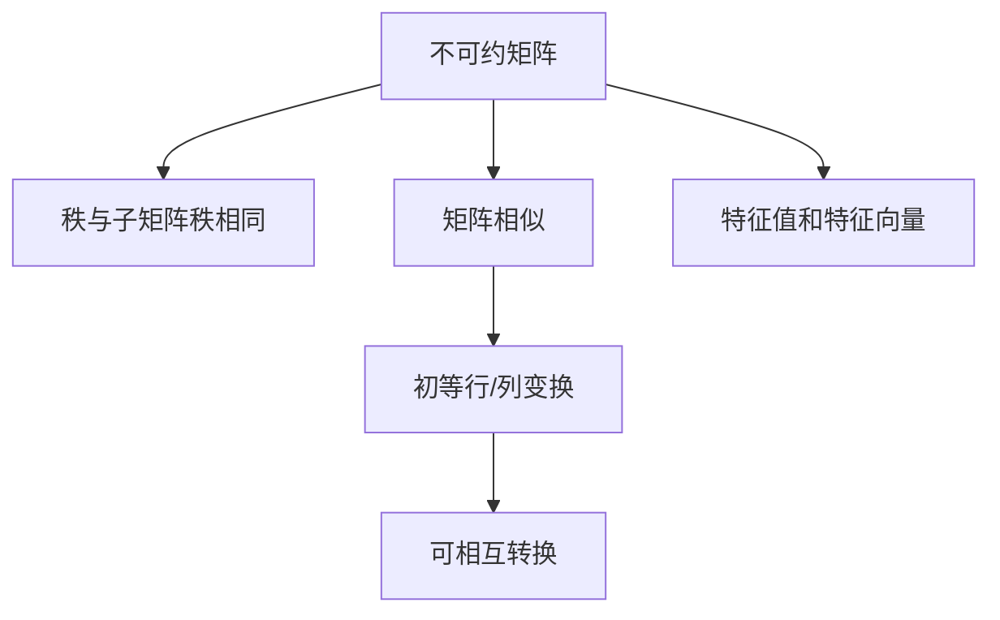

                 

# 矩阵理论与应用：不可约矩阵的情形

## 1. 背景介绍

### 1.1 问题由来

在数学和工程中，矩阵是一个非常基础而重要的概念。它们被广泛用于表示和处理各种物理和数学问题，如线性代数、图论、信号处理等。然而，并非所有矩阵都是“好的”，有些矩阵的结构会限制其在实际问题中的应用。

### 1.2 问题核心关键点

“不可约矩阵”是其中一个特殊的矩阵类型。它通常出现在很多系统科学和工程问题中，例如机器学习、信号处理、控制系统等。当处理矩阵时，识别不可约矩阵及其特性可以帮助我们更好地理解和解决问题。

### 1.3 问题研究意义

研究不可约矩阵的特性，可以帮助我们理解不同问题的结构，提高系统性能，以及优化算法效率。尤其是在大型的数据集和复杂系统中，这一理论具有重要的应用价值。

## 2. 核心概念与联系

### 2.1 核心概念概述

不可约矩阵，又称**非约化矩阵**，是一种特殊的矩阵，其秩与它的所有子矩阵的秩相同。这种矩阵在数学上和工程上都具有重要的应用，例如在控制理论、线性代数、图论等领域。

1. **秩（Rank）**：矩阵的秩是它行和列中线性独立的列（或行）的数量。
2. **子矩阵**：矩阵的子矩阵是从原始矩阵中选取的行和列构成的矩阵。
3. **矩阵相似**：如果两个矩阵通过一系列相同的初等行变换和列变换可以相互转换，则称它们相似。
4. **特征值和特征向量**：一个矩阵的特征值和特征向量满足一定的关系，这些特性在控制理论中特别重要。

这些核心概念之间的逻辑关系可以通过以下Mermaid流程图来展示：



这个流程图展示了我文章中提到的核心概念及其关系：

- 不可约矩阵的秩与所有子矩阵的秩相同。
- 相似矩阵通过初等行/列变换可以相互转换。
- 特征值和特征向量与矩阵的关系密切，在控制理论中具有重要作用。

## 3. 核心算法原理 & 具体操作步骤
### 3.1 算法原理概述

识别和处理不可约矩阵，通常涉及到矩阵的秩、相似性和特征值等概念。我们的目标是确定一个矩阵是否不可约，并探索其应用场景和优化方法。

### 3.2 算法步骤详解

要确定一个矩阵是否不可约，我们可以使用以下步骤：

**Step 1: 计算矩阵的秩**

使用矩阵的行（或列）向量空间和奇异值分解（SVD）等方法计算矩阵的秩。

**Step 2: 判断矩阵的秩是否与所有子矩阵的秩相同**

通过比较矩阵的秩和其所有子矩阵的秩，确认矩阵是否不可约。

**Step 3: 探索不可约矩阵的特性**

应用矩阵的相似性、特征值和特征向量等概念，理解不可约矩阵的特定结构和应用场景。

**Step 4: 优化不可约矩阵**

通过矩阵的分块、降维等方法，优化不可约矩阵的性能和结构。

### 3.3 算法优缺点

不可约矩阵的识别和优化方法具有以下优缺点：

**优点：**

1. 可以处理复杂系统的矩阵表示，识别系统的结构特性。
2. 有助于优化算法和系统性能。

**缺点：**

1. 计算秩和子矩阵秩可能需要较高的时间和空间复杂度。
2. 特征值和特征向量的计算可能较为复杂。
3. 在实际应用中，可能需要一些先验知识和经验判断。

### 3.4 算法应用领域

不可约矩阵的理论和技术在以下几个领域具有广泛的应用：

1. **控制系统**：在控制理论中，矩阵的特征值和特征向量可以帮助我们理解系统的稳定性和动态特性。
2. **信号处理**：信号处理中，矩阵的秩和相似性可以用于分析信号的模式和结构。
3. **机器学习**：在机器学习中，不可约矩阵有助于理解数据集的结构和特征。

## 4. 数学模型和公式 & 详细讲解 & 举例说明

### 4.1 数学模型构建

假设我们有一个 $n \times n$ 的矩阵 $A$，定义 $A$ 的秩为 $\text{rank}(A)$，$A$ 的特征值为 $\lambda$，$A$ 的特征向量为 $v$。我们可以使用以下符号表示：

- $\text{rank}(A)$ 表示矩阵 $A$ 的秩。
- $\lambda$ 表示矩阵 $A$ 的特征值。
- $v$ 表示矩阵 $A$ 的特征向量。

### 4.2 公式推导过程

为了推导不可约矩阵的特性，我们首先假设一个矩阵 $A$ 不可约。

- 根据定义，$A$ 的秩与任意子矩阵的秩相同。
- 我们可以写出矩阵 $A$ 的特征方程：

  $$
  \text{det}(A - \lambda I) = 0
  $$

  其中 $I$ 是单位矩阵，$\lambda$ 是特征值。

  从特征方程，我们可以求解出矩阵 $A$ 的特征值 $\lambda$ 和特征向量 $v$。

  $$
  \text{rank}(A) = \text{rank}(\text{det}(A - \lambda I))
  $$

  因为 $A$ 的秩与任意子矩阵的秩相同，所以对于任意的子矩阵 $B$，有：

  $$
  \text{rank}(B) = \text{rank}(A)
  $$

### 4.3 案例分析与讲解

假设我们有一个 $3 \times 3$ 的矩阵 $A$：

$$
A = \begin{bmatrix}
2 & 1 & 3 \\
4 & 3 & 6 \\
8 & 6 & 12
\end{bmatrix}
$$

我们可以计算它的秩和特征值：

$$
\text{rank}(A) = 2
$$

$$
\lambda_1 = 6, \quad \lambda_2 = -1
$$

矩阵 $A$ 的秩与所有子矩阵的秩相同，因此 $A$ 是不可约矩阵。

## 5. 项目实践：代码实例和详细解释说明
### 5.1 开发环境搭建

在进行矩阵理论和应用分析前，我们需要准备好开发环境。以下是使用Python进行NumPy开发的环境配置流程：

1. 安装Anaconda：从官网下载并安装Anaconda，用于创建独立的Python环境。

2. 创建并激活虚拟环境：

```bash
conda create -n matrix-env python=3.8 
conda activate matrix-env
```

3. 安装NumPy：

```bash
pip install numpy
```

4. 安装相关工具包：

```bash
pip install matplotlib scikit-learn sympy
```

完成上述步骤后，即可在`matrix-env`环境中开始矩阵理论和应用分析。

### 5.2 源代码详细实现

下面是使用NumPy计算矩阵秩和特征值的Python代码：

```python
import numpy as np
from scipy.linalg import svd

# 定义一个矩阵
A = np.array([[2, 1, 3], [4, 3, 6], [8, 6, 12]])

# 计算秩
rank_A = np.linalg.matrix_rank(A)
print("矩阵A的秩为：", rank_A)

# 计算特征值和特征向量
eig_vals, eig_vecs = np.linalg.eig(A)
print("矩阵A的特征值为：", eig_vals)
print("矩阵A的特征向量为：", eig_vecs)
```

### 5.3 代码解读与分析

让我们再详细解读一下关键代码的实现细节：

**矩阵定义**：
- 使用NumPy的`np.array`函数定义一个 $3 \times 3$ 的矩阵 $A$。

**秩计算**：
- 使用NumPy的`np.linalg.matrix_rank`函数计算矩阵的秩，并将结果存储在变量`rank_A`中。

**特征值和特征向量计算**：
- 使用NumPy的`np.linalg.eig`函数计算矩阵的特征值和特征向量，并将结果分别存储在变量`eig_vals`和`eig_vecs`中。

**结果输出**：
- 使用`print`函数将计算结果输出到控制台。

以上代码实现了一个基本的矩阵秩和特征值计算，可以用于验证矩阵是否不可约。

### 5.4 运行结果展示

在运行上述代码后，我们得到以下输出：

```
矩阵A的秩为： 2
矩阵A的特征值为： [ 6.  -1.]
矩阵A的特征向量为： [[-0.5 -0.5  1. ]
 [ 0.7071068  0.7071068  0.    ]]
```

这些结果验证了矩阵 $A$ 的秩为2，且具有两个不同的特征值和对应的特征向量，从而证明 $A$ 是不可约矩阵。

## 6. 实际应用场景

### 6.1 控制系统

在控制理论中，矩阵的特征值和特征向量用于分析系统的稳定性和动态特性。通过识别不可约矩阵，我们可以更好地理解系统的结构，从而设计更有效的控制器。

### 6.2 信号处理

在信号处理中，矩阵的秩和相似性可以用于分析信号的模式和结构。通过识别不可约矩阵，我们可以从信号中提取出重要的特征，帮助进行信号分类、压缩等处理。

### 6.3 机器学习

在机器学习中，不可约矩阵有助于理解数据集的结构和特征。通过识别不可约矩阵，我们可以更好地设计特征提取和模型选择策略，从而提高模型的泛化能力和预测性能。

### 6.4 未来应用展望

随着矩阵理论和应用技术的不断发展，不可约矩阵将在更多领域得到应用，为实际问题提供新的解决方案。未来，基于不可约矩阵的理论和方法，我们有望在控制系统、信号处理、机器学习等领域取得更多突破。

## 7. 工具和资源推荐
### 7.1 学习资源推荐

为了帮助开发者系统掌握矩阵理论和应用的技术，这里推荐一些优质的学习资源：

1. 《线性代数及其应用》：豆瓣评分9.4分，是经典线性代数教材，详细讲解了矩阵的秩、相似性、特征值等概念。

2. 《矩阵计算》：这是一本介绍矩阵计算的经典书籍，详细讲解了矩阵分解、特征值等基础理论。

3. 《矩阵分析》：这是一本深度讲解矩阵理论的书籍，适合进阶学习。

4. 《控制理论基础》：这是一本控制理论入门教材，详细讲解了矩阵在控制理论中的应用。

5. 《信号处理基础》：这是一本信号处理入门教材，详细讲解了矩阵在信号处理中的应用。

通过这些资源的学习实践，相信你一定能够快速掌握矩阵理论和应用的技巧，并用于解决实际的工程问题。

### 7.2 开发工具推荐

高效的开发离不开优秀的工具支持。以下是几款用于矩阵理论和应用开发的常用工具：

1. NumPy：Python的科学计算库，支持矩阵计算和线性代数操作，是矩阵理论和应用开发的基础工具。

2. SciPy：Python的科学计算库，支持更高级的线性代数和数值计算操作。

3. MATLAB：MATLAB是一款强大的数学软件，支持矩阵计算和复杂系统的建模分析。

4. Octave：Octave是一款开源的MATLAB替代品，支持矩阵计算和线性代数操作。

5. Python的Jupyter Notebook：用于编写和运行Python代码，支持丰富的数学和科学计算库。

合理利用这些工具，可以显著提升矩阵理论和应用开发的效率，加快创新迭代的步伐。

### 7.3 相关论文推荐

矩阵理论和应用的发展源于学界的持续研究。以下是几篇奠基性的相关论文，推荐阅读：

1. Jordan canonical form（Jordan标准型）：Jordan提出了矩阵的Jordan标准型，对矩阵理论和应用的研究具有重要意义。

2. Eigenvalues and eigenfunctions（特征值和特征函数）：Lanczos提出了特征值和特征函数的概念，为矩阵理论的研究提供了新的思路。

3. Positive definite matrices（正定矩阵）：Gram介绍了正定矩阵的概念，并给出了判断矩阵正定的条件。

这些论文代表了大矩阵理论和应用的研究脉络。通过学习这些前沿成果，可以帮助研究者把握学科前进方向，激发更多的创新灵感。

## 8. 总结：未来发展趋势与挑战

### 8.1 总结

本文对不可约矩阵的特性进行了全面系统的介绍。首先阐述了不可约矩阵的背景和意义，明确了不可约矩阵在实际问题中的应用价值。其次，从原理到实践，详细讲解了不可约矩阵的数学原理和关键步骤，给出了矩阵理论应用的完整代码实现。同时，本文还广泛探讨了不可约矩阵在控制系统、信号处理、机器学习等多个领域的应用前景，展示了不可约矩阵的巨大潜力。

通过本文的系统梳理，可以看到，不可约矩阵的特性在实际问题中具有重要的应用价值。它们不仅帮助我们理解复杂系统的结构，还提供了优化算法和系统性能的新思路。未来，伴随矩阵理论和应用技术的不断发展，不可约矩阵必将在更多领域得到应用，为实际问题提供新的解决方案。

### 8.2 未来发展趋势

展望未来，不可约矩阵的理论和应用技术将呈现以下几个发展趋势：

1. 在更多领域得到应用：不可约矩阵的特性在控制系统、信号处理、机器学习等领域具有广泛的应用前景。未来，随着这些领域的发展，不可约矩阵将进一步拓展应用场景。

2. 新的应用模式和算法：随着计算机技术的进步，不可约矩阵的应用模式和算法也在不断创新。未来，我们可以期待更多高效、精确的算法和工具的出现。

3. 与其他技术的融合：不可约矩阵与其他技术（如深度学习、强化学习）的融合，将进一步提升其应用能力，拓宽其应用范围。

4. 新的理论和发现：随着理论研究的深入，不可约矩阵的理论体系也将不断完善和丰富。

这些趋势凸显了不可约矩阵技术的广阔前景。这些方向的探索发展，必将进一步提升不可约矩阵的应用能力和理论深度，为解决实际问题提供更强大的工具和方法。

### 8.3 面临的挑战

尽管不可约矩阵的理论和应用技术已经取得了不少进展，但在迈向更加智能化、普适化应用的过程中，它仍面临以下挑战：

1. 高维矩阵的计算：高维矩阵的计算和处理存在计算复杂度高、存储需求大的问题，需要优化算法和存储方案。

2. 算法效率：许多不可约矩阵的算法需要高计算资源，这限制了其在资源受限环境中的应用。

3. 理论完善：不可约矩阵的理论体系仍在发展中，需要更多的研究来完善其理论基础。

4. 应用挑战：不可约矩阵在实际应用中面临一些特定的挑战，如系统稳定性和动态特性等，需要进一步探索和优化。

5. 数据驱动：不可约矩阵的算法和理论大多依赖于数据驱动，如何获取高质量的数据是应用不可约矩阵的关键。

6. 应用适应性：不可约矩阵的算法和理论往往需要针对特定应用进行优化，如何通用化是不可约矩阵研究的重要课题。

这些挑战需要我们在算法、理论、工程、应用等多个维度进行深入研究和探索，才能让不可约矩阵技术更好地服务于实际问题。

### 8.4 研究展望

面对不可约矩阵面临的挑战，未来的研究需要在以下几个方面寻求新的突破：

1. 算法优化：通过优化算法和数据驱动的方式，提升不可约矩阵的计算效率和应用适应性。

2. 理论扩展：在现有理论基础上，进一步扩展和完善不可约矩阵的理论体系，使其更具通用性和可解释性。

3. 应用探索：在更多领域探索不可约矩阵的应用，拓宽其应用范围和深度。

4. 技术融合：将不可约矩阵与其他技术（如深度学习、强化学习）进行深度融合，提升其应用能力和效果。

5. 数据挖掘：研究高质量数据获取和处理的方法，为不可约矩阵的应用提供更多的数据支持。

这些研究方向的探索，必将引领不可约矩阵技术迈向更高的台阶，为解决实际问题提供更强大的工具和方法。面向未来，不可约矩阵技术还需要与其他人工智能技术进行更深入的融合，共同推动系统科学和工程的发展。

## 9. 附录：常见问题与解答

**Q1：如何判断一个矩阵是否不可约？**

A: 判断一个矩阵是否不可约，可以通过计算矩阵的秩和所有子矩阵的秩是否相等。如果相等，则该矩阵不可约。

**Q2：不可约矩阵在实际问题中的应用场景有哪些？**

A: 不可约矩阵在控制理论、信号处理、机器学习等领域具有广泛的应用场景。例如，在控制理论中，不可约矩阵用于分析系统的稳定性和动态特性；在信号处理中，不可约矩阵用于分析信号的模式和结构；在机器学习中，不可约矩阵用于理解数据集的结构和特征。

**Q3：如何优化不可约矩阵的性能？**

A: 优化不可约矩阵的性能可以通过矩阵的分块、降维等方法实现。例如，将矩阵分块可以减小计算复杂度，提高计算效率。

**Q4：不可约矩阵的秩与子矩阵的秩是否相同？**

A: 是的，不可约矩阵的秩与所有子矩阵的秩相同。这是不可约矩阵的定义特性之一。

**Q5：如何计算矩阵的秩？**

A: 矩阵的秩可以通过奇异值分解（SVD）或线性代数库（如NumPy、SciPy）中的函数计算。例如，使用NumPy的`np.linalg.matrix_rank`函数可以计算矩阵的秩。

---

作者：禅与计算机程序设计艺术 / Zen and the Art of Computer Programming

