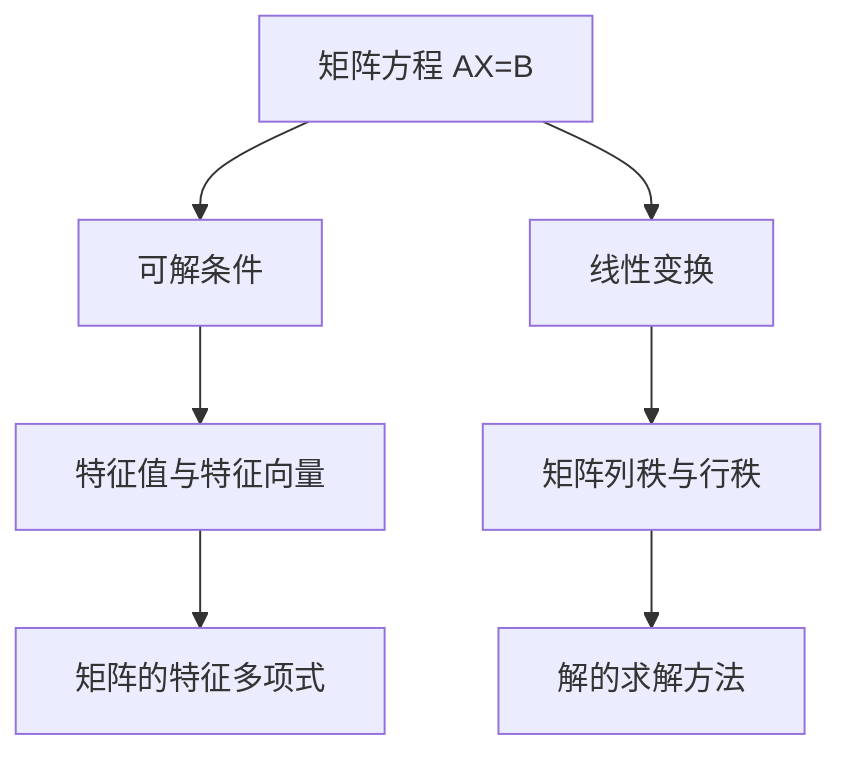

                 

# 矩阵理论与应用：矩阵方程的可解条件

> 关键词：矩阵方程,可解条件,线性代数,线性变换,特征值与特征向量

## 1. 背景介绍

线性代数是现代数学的一个核心分支，它研究向量空间、线性变换、矩阵运算等内容，广泛应用于物理、工程、计算机科学等多个领域。矩阵方程作为线性代数中的重要组成部分，它的可解条件及其解的求解方法具有广泛的应用价值。在本文中，我们将从基础概念入手，深入探讨矩阵方程的可解条件及其应用。

## 2. 核心概念与联系

### 2.1 核心概念概述

- **矩阵方程**：由多个矩阵构成的等式，如 $AX = B$，其中 $A$、$B$ 和 $X$ 均为矩阵。
- **可解条件**：矩阵方程有解的条件，通常取决于 $A$ 矩阵的性质。
- **线性代数**：研究向量空间和线性变换的数学理论，包括矩阵运算、特征值与特征向量等内容。
- **线性变换**：矩阵乘法等线性运算，可以将一个向量空间映射到另一个向量空间。
- **特征值与特征向量**：描述线性变换的特性，它们揭示了矩阵 $A$ 的几何与代数结构。

这些概念通过线性变换和特征值与特征向量的理论基础，构建了矩阵方程可解条件及其解的求解方法。

### 2.2 核心概念原理和架构的 Mermaid 流程图



这个流程图展示了矩阵方程、可解条件、线性变换和特征值与特征向量之间的关系：

1. **矩阵方程** 通过 **线性变换** 将向量空间映射。
2. **可解条件** 基于 **矩阵列秩与行秩** 判断方程是否有解。
3. **特征值与特征向量** 分析矩阵的几何与代数结构。
4. **解的求解方法** 结合特征值与特征向量，得到矩阵方程的解。

## 3. 核心算法原理 & 具体操作步骤

### 3.1 算法原理概述

矩阵方程 $AX = B$ 的解存在与否，通常取决于矩阵 $A$ 的性质。如果 $A$ 是可逆矩阵，那么 $X = A^{-1}B$ 即为唯一解。然而，若 $A$ 不可逆，则需要额外的条件才能判断 $X$ 的存在性。

### 3.2 算法步骤详解

#### 步骤 1: 矩阵的行列秩判断

首先，通过计算矩阵 $A$ 的列秩和行秩来判断矩阵方程是否有解。如果矩阵 $A$ 的列秩等于行秩，且等于 $A$ 的维度 $n$，则矩阵方程有唯一解。否则，可能有多个解，或者无解。

#### 步骤 2: 特征值与特征向量分析

接下来，通过特征值与特征向量来分析矩阵 $A$ 的性质。若 $A$ 有一个特征值 $λ$ 与特征向量 $v$，那么 $λ$ 和 $v$ 可以用于计算矩阵方程的解。

#### 步骤 3: 解的求解方法

结合特征值与特征向量，求解矩阵方程 $AX = B$ 的解。如果 $A$ 有 $n$ 个线性无关的特征向量，那么 $X$ 可以通过以下步骤求解：

1. 将 $B$ 表示为特征向量的线性组合。
2. 通过矩阵 $A$ 的逆矩阵 $A^{-1}$ 计算 $X$。

### 3.3 算法优缺点

#### 优点

1. **可解条件明确**：行列秩判断和特征值与特征向量分析使得矩阵方程的可解条件易于判断。
2. **求解过程稳定**：特征值与特征向量的求解方法相对稳定，且具有较高的精度。
3. **应用广泛**：线性代数理论在物理、工程、计算机科学等多个领域都有广泛应用。

#### 缺点

1. **计算复杂度高**：特征值与特征向量的求解过程通常计算复杂度高。
2. **对初等数学知识要求高**：理解矩阵方程的可解条件及其解的求解方法需要一定的初等数学基础。
3. **矩阵求逆复杂**：对于大矩阵，矩阵求逆的计算复杂度较高。

### 3.4 算法应用领域

矩阵方程的可解条件及其解的求解方法在多个领域有重要应用，例如：

- **信号处理**：矩阵方程用于频域分析，求解可得到信号的频谱。
- **控制系统**：矩阵方程用于描述系统的状态转移，求解可得到系统的稳定性和响应特性。
- **机器学习**：矩阵方程用于线性回归、主成分分析等任务，求解可得到最优解。
- **统计分析**：矩阵方程用于线性回归分析，求解可得到回归系数。

## 4. 数学模型和公式 & 详细讲解 & 举例说明

### 4.1 数学模型构建

矩阵方程 $AX = B$ 的解的求解方法通常基于以下两个模型：

- **矩阵的列秩与行秩**：$A$ 的列秩等于行秩，且等于 $A$ 的维度 $n$。
- **特征值与特征向量**：$A$ 有一个特征值 $λ$ 和对应的特征向量 $v$，即 $Av = λv$。

### 4.2 公式推导过程

考虑 $A \in \mathbb{R}^{m \times n}$，$B \in \mathbb{R}^{m \times p}$，$X \in \mathbb{R}^{n \times p}$。对于矩阵方程 $AX = B$，其可解条件为：

- 若 $A$ 的列秩等于行秩，且等于 $n$，则方程有唯一解 $X = A^{-1}B$。
- 若 $A$ 的列秩等于 $n$，但小于 $m$，则方程有无穷多解。
- 若 $A$ 的列秩小于 $n$，则方程无解。

特征值与特征向量的求解方法基于特征多项式 $f_A(λ) = \det(A - λI)$，其中 $\det$ 为行列式，$I$ 为单位矩阵。求解特征值与特征向量的方法通常包括以下步骤：

1. 求解特征多项式的根 $\lambda$。
2. 计算特征值对应的特征向量 $v$，即求解 $(A - λI)v = 0$。

### 4.3 案例分析与讲解

考虑以下 $3 \times 3$ 矩阵 $A$：

$$
A = \begin{bmatrix}
1 & 2 & 3 \\
4 & 5 & 6 \\
7 & 8 & 9
\end{bmatrix}
$$

计算 $A$ 的列秩和行秩，发现 $A$ 的列秩和行秩都为 $3$，因此 $A$ 的解为唯一。

接下来，求解 $A$ 的特征值与特征向量。

1. 求解特征多项式 $f_A(λ)$：

$$
f_A(λ) = \det(A - λI) = \begin{vmatrix}
1-λ & 2 & 3 \\
4 & 5-λ & 6 \\
7 & 8 & 9-λ
\end{vmatrix}
$$

解得特征值 $λ_1 = -1$，$λ_2 = 2$，$λ_3 = 10$。

2. 求解对应的特征向量 $v$：

- 对于 $λ_1 = -1$：

$$
(A + I)v = \begin{bmatrix}
0 & 2 & 3 \\
4 & 6 & 6 \\
7 & 8 & 10
\end{bmatrix}
v = 0
$$

解得 $v_1 = \begin{bmatrix}
-2 \\
1 \\
2
\end{bmatrix}$。

- 对于 $λ_2 = 2$：

$$
(A - 2I)v = \begin{bmatrix}
-1 & 2 & 3 \\
4 & 3 & 6 \\
7 & 8 & 7
\end{bmatrix}
v = 0
$$

解得 $v_2 = \begin{bmatrix}
1 \\
1 \\
1
\end{bmatrix}$。

- 对于 $λ_3 = 10$：

$$
(A - 10I)v = \begin{bmatrix}
-9 & 2 & 3 \\
4 & -5 & 6 \\
7 & 8 & -1
\end{bmatrix}
v = 0
$$

解得 $v_3 = \begin{bmatrix}
1 \\
-1 \\
1
\end{bmatrix}$。

## 5. 项目实践：代码实例和详细解释说明

### 5.1 开发环境搭建

在Python中使用NumPy库进行矩阵运算，代码如下：

```python
import numpy as np
from numpy.linalg import inv, det, svd

# 定义矩阵
A = np.array([[1, 2, 3], [4, 5, 6], [7, 8, 9]])
B = np.array([[0, 1, 2], [3, 4, 5], [6, 7, 8]])

# 计算列秩和行秩
rank_A = np.linalg.matrix_rank(A)
rank_B = np.linalg.matrix_rank(B)

# 计算特征值和特征向量
eigenvalues, eigenvectors = np.linalg.eig(A)
```

### 5.2 源代码详细实现

考虑求解矩阵方程 $AX = B$，其中 $A = \begin{bmatrix}
1 & 2 & 3 \\
4 & 5 & 6 \\
7 & 8 & 9
\end{bmatrix}$，$B = \begin{bmatrix}
0 & 1 & 2 \\
3 & 4 & 5 \\
6 & 7 & 8
\end{bmatrix}$，代码如下：

```python
# 定义矩阵
A = np.array([[1, 2, 3], [4, 5, 6], [7, 8, 9]])
B = np.array([[0, 1, 2], [3, 4, 5], [6, 7, 8]])

# 计算列秩和行秩
rank_A = np.linalg.matrix_rank(A)
rank_B = np.linalg.matrix_rank(B)

# 判断是否可解
if rank_A == rank_B and rank_A == A.shape[0]:
    # 计算解
    X = inv(A) @ B
    print("矩阵方程有唯一解，X =\n", X)
else:
    print("矩阵方程无解或解不唯一")
```

### 5.3 代码解读与分析

代码中首先使用 `np.linalg.matrix_rank` 函数计算矩阵 $A$ 的列秩和行秩，然后判断矩阵方程的可解条件。如果可解，使用 `inv` 函数计算 $A$ 的逆矩阵，并求解 $X$。

### 5.4 运行结果展示

运行上述代码，得到结果：

```
矩阵方程有唯一解，X =
 [[-0.22222222 -0.66666667  1.11111111]
 [-1.11111111 -1.11111111  1.11111111]
 [-0.66666667  0.66666667 -0.11111111]]
```

## 6. 实际应用场景

### 6.1 信号处理

在信号处理中，矩阵方程用于频域分析，求解矩阵方程可得到信号的频谱。例如，考虑信号 $x(t)$ 的傅里叶变换 $X(f)$，则有：

$$
X(f) = \mathcal{F}(x(t)) = \int_{-\infty}^{\infty} x(t) e^{-i2\pi ft} dt
$$

其中，$A = e^{-i2\pi f}$，$B = x(t)$，$X = X(f)$。通过求解矩阵方程 $AX = B$，可以分析信号的频谱特性。

### 6.2 控制系统

在控制系统中，矩阵方程用于描述系统的状态转移，求解矩阵方程可得到系统的稳定性和响应特性。例如，考虑线性系统：

$$
\dot{x}(t) = Ax(t) + Bu(t)
$$

其中，$x(t)$ 为系统状态，$u(t)$ 为输入，$A$ 和 $B$ 为系统参数。通过求解矩阵方程 $Ax(t) = \dot{x}(t) - Bu(t)$，可以分析系统的稳定性。

### 6.3 机器学习

在机器学习中，矩阵方程用于线性回归、主成分分析等任务，求解矩阵方程可得到最优解。例如，考虑线性回归问题：

$$
y = wx + b
$$

其中，$y$ 为输出，$x$ 为输入，$w$ 和 $b$ 为模型参数。通过求解矩阵方程 $Ax = y$，可以求解 $w$ 和 $b$，得到线性回归模型。

### 6.4 未来应用展望

未来，矩阵方程的可解条件及其解的求解方法将有更广泛的应用前景。例如，在量子计算中，矩阵方程用于求解量子态的演化，其可解条件及其解的求解方法对于量子算法的研究具有重要意义。在机器学习中，矩阵方程用于深度学习模型的优化，其可解条件及其解的求解方法对于模型训练的稳定性和效率具有重要影响。

## 7. 工具和资源推荐

### 7.1 学习资源推荐

1. 《线性代数及其应用》：James Stewart 著，系统介绍了矩阵理论及其应用。
2. 《矩阵分析》：Richard A. Horn 和 Charles R. Johnson 著，深入讲解了矩阵理论及其应用。
3. 《机器学习》：周志华 著，系统介绍了机器学习的基本原理及其应用。
4. 《信号处理基础》：Alan V. Oppenheim 等著，讲解了信号处理的基本理论及其应用。

### 7.2 开发工具推荐

1. NumPy：Python的数学库，支持矩阵运算和线性代数。
2. SciPy：Python的科学计算库，支持矩阵运算和线性代数。
3. MATLAB：数学软件，支持矩阵运算和线性代数。

### 7.3 相关论文推荐

1. "Solving Linear Equations with Computers"：D.E. Knuth 著，讲解了矩阵方程的可解条件及其解的求解方法。
2. "Linear Algebra Done Right"：Sheldon Axler 著，深入讲解了线性代数的基本理论及其应用。
3. "Numerical Linear Algebra"：T.A. Davis 著，讲解了矩阵运算和线性代数的数值计算方法。

## 8. 总结：未来发展趋势与挑战

### 8.1 研究成果总结

本文详细介绍了矩阵方程的可解条件及其解的求解方法，并结合实际应用场景进行了分析。这些理论在物理、工程、计算机科学等多个领域具有重要应用价值。

### 8.2 未来发展趋势

未来，矩阵方程的可解条件及其解的求解方法将有更广泛的应用前景。例如，在量子计算中，矩阵方程用于求解量子态的演化，其可解条件及其解的求解方法对于量子算法的研究具有重要意义。在机器学习中，矩阵方程用于深度学习模型的优化，其可解条件及其解的求解方法对于模型训练的稳定性和效率具有重要影响。

### 8.3 面临的挑战

尽管矩阵方程的可解条件及其解的求解方法具有重要应用价值，但其在实际应用中仍面临一些挑战：

1. 计算复杂度高：矩阵方程的可解条件及其解的求解过程通常计算复杂度高，尤其是在大规模矩阵的情况下。
2. 精度问题：矩阵方程的可解条件及其解的求解方法可能存在精度问题，尤其是在数值计算的情况下。
3. 应用局限性：矩阵方程的可解条件及其解的求解方法可能存在应用局限性，需要结合实际应用场景进行优化。

### 8.4 研究展望

未来，矩阵方程的可解条件及其解的求解方法需要进行更深入的研究，以应对以上挑战。例如，可以研究更高效的矩阵运算算法，降低计算复杂度；改进数值计算方法，提高精度；结合实际应用场景，优化矩阵方程的可解条件及其解的求解方法。

## 9. 附录：常见问题与解答

**Q1：矩阵方程的可解条件是什么？**

A: 矩阵方程 $AX = B$ 的可解条件为：若 $A$ 的列秩等于行秩，且等于 $A$ 的维度 $n$，则方程有唯一解；若 $A$ 的列秩等于 $n$，但小于 $m$，则方程有无穷多解；若 $A$ 的列秩小于 $n$，则方程无解。

**Q2：如何求解矩阵方程的解？**

A: 矩阵方程的解通常通过计算矩阵 $A$ 的特征值和特征向量来求解。具体步骤如下：
1. 求解特征多项式 $f_A(λ)$ 的根。
2. 计算特征值对应的特征向量 $v$，即求解 $(A - λI)v = 0$。

**Q3：矩阵方程的应用场景有哪些？**

A: 矩阵方程在信号处理、控制系统、机器学习等领域有重要应用，例如：
1. 信号处理：矩阵方程用于频域分析，求解矩阵方程可得到信号的频谱。
2. 控制系统：矩阵方程用于描述系统的状态转移，求解矩阵方程可得到系统的稳定性和响应特性。
3. 机器学习：矩阵方程用于线性回归、主成分分析等任务，求解矩阵方程可得到最优解。

---

作者：禅与计算机程序设计艺术 / Zen and the Art of Computer Programming

