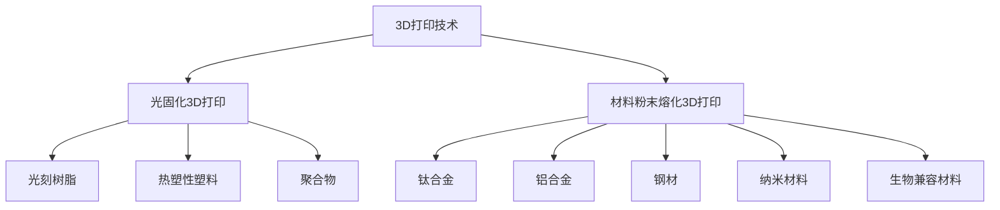

                 

# 硅谷3D打印新材料:高分子与金属3D打印

> 关键词：3D打印,高分子,金属,新材料,增材制造

## 1. 背景介绍

### 1.1 问题由来
近年来，3D打印技术正经历从实验室到生产线的蜕变，逐渐渗透到制造业、医疗、航空航天等多个领域。在传统制造模式中，通过雕刻、切割、铸造等工艺，将原材料加工成复杂的零件，不仅生产成本高，且设计空间受限。而3D打印技术则通过逐层堆积材料，实现任意复杂形状的精确制造，极大地提高了设计自由度和制造效率。

3D打印技术主要包括两大类：光固化3D打印和材料粉末熔化3D打印。前者基于紫外线或激光固化树脂，逐层构建，适合打印高精度、透明件等材料。后者包括选择性激光烧结、电子束熔化、选择性电子束熔化等，通过高温熔化金属粉末，逐层打印，适用于金属零件的制造。

传统3D打印使用的材料以工程塑料为主，但在高强度、耐高温、生物兼容性等性能要求较高的应用场景下，塑料材料难以胜任。为此，研究人员正在探索和发展高分子和金属等新材料，以适应更为复杂、高性能的3D打印需求。

### 1.2 问题核心关键点
本文聚焦于3D打印新材料中的高分子和金属材料，探讨其在硅谷及全球的最新进展、应用现状、技术挑战与未来前景。

1. **高分子材料**：如光刻树脂、热塑性塑料、聚合物等，具备良好的延展性和抗冲击性，广泛应用于消费电子、家电、医疗等领域。
2. **金属材料**：包括钛合金、铝合金、钢材等，具备高强度、耐高温、导电性等特性，适用于航空航天、医疗器械、工具等高端制造领域。
3. **新材料创新**：如纳米材料、生物兼容材料等，通过引入新的化学成分或结构设计，进一步提升材料的性能和适用性。
4. **技术挑战**：如高分子材料的韧性和耐化学性问题、金属材料的高温稳定性及均匀性控制等。
5. **应用展望**：在硅谷及全球的3D打印技术公司和研究机构中，这些新材料的应用前景广阔，将推动3D打印技术向更广泛的应用领域拓展。

## 2. 核心概念与联系

### 2.1 核心概念概述

为了更好地理解高分子与金属3D打印技术，本节将介绍几个核心概念及其联系：

- **3D打印（Additive Manufacturing, AM）**：一种通过逐层堆积材料，实现复杂形状零件制造的先进制造技术。
- **光固化3D打印（SLA, stereolithography）**：利用紫外线或激光固化树脂，逐层构建零件。
- **材料粉末熔化3D打印（SLS, selective laser sintering; SLM, selective laser melting; EBM, electron beam melting）**：通过高温熔化金属粉末，逐层打印金属零件。
- **高分子材料**：如光刻树脂、热塑性塑料、聚合物等，具备良好的延展性和抗冲击性。
- **金属材料**：包括钛合金、铝合金、钢材等，具备高强度、耐高温、导电性等特性。
- **新材料创新**：如纳米材料、生物兼容材料等，通过引入新的化学成分或结构设计，进一步提升材料的性能和适用性。

### 2.2 核心概念原理和架构的 Mermaid 流程图



这个流程图展示了3D打印技术的两种主要类型：光固化和材料粉末熔化。同时，它还介绍了两种主要的3D打印材料：高分子材料和金属材料，以及在新材料领域的发展方向。

## 3. 核心算法原理 & 具体操作步骤

### 3.1 算法原理概述

高分子与金属3D打印的核心算法原理主要体现在材料的选择、打印参数的设定以及后处理技术的优化上。

- **高分子材料**：光固化3D打印使用光刻树脂，材料的选择需要考虑其光固化特性、强度、透明度等指标。材料粉末熔化3D打印则涉及热塑性塑料、聚合物等，需要考虑其熔点、流动性、热稳定性等特性。
- **金属材料**：钛合金、铝合金等金属材料具有高强度、耐高温等特性，需要在高温下进行打印。打印参数包括激光功率、扫描速度、层厚等，需要精确控制以保证材料熔化和凝固的质量。
- **后处理技术**：打印完成后，需要对零件进行后处理，如去支撑、热处理、表面处理等，以提升材料性能和外观质量。

### 3.2 算法步骤详解

#### 3.2.1 高分子材料3D打印

**步骤1：准备材料和设备**
- 选择适合的高分子材料，如光刻树脂、热塑性塑料等。
- 准备光固化3D打印机或材料粉末熔化3D打印机，确保设备的精度和稳定性。

**步骤2：构建3D模型**
- 使用CAD软件设计零件的3D模型，确保模型的精确度和可打印性。
- 将3D模型导入打印机，生成切片文件。

**步骤3：调整打印参数**
- 根据材料特性，调整打印机的激光功率、扫描速度、层厚等参数。
- 根据模型复杂度，设定支撑结构，避免打印过程中零件变形。

**步骤4：执行打印**
- 启动打印机，开始打印。打印过程中，实时监测温度、材料固化情况等指标，确保打印质量。
- 打印完成后，去除支撑结构，进行后续处理。

**步骤5：后处理**
- 根据材料特性，进行热处理、表面处理等步骤，提升零件的强度、表面光洁度等性能。

#### 3.2.2 金属材料3D打印

**步骤1：准备材料和设备**
- 选择适合的金属材料，如钛合金、铝合金等。
- 准备金属粉末熔化3D打印机，确保设备的精度和稳定性。

**步骤2：构建3D模型**
- 使用CAD软件设计零件的3D模型，确保模型的精确度和可打印性。
- 将3D模型导入打印机，生成切片文件。

**步骤3：调整打印参数**
- 根据金属材料特性，调整打印机的激光功率、扫描速度、层厚等参数。
- 根据模型复杂度，设定支撑结构，避免打印过程中零件变形。

**步骤4：执行打印**
- 启动打印机，开始打印。打印过程中，实时监测温度、材料熔化情况等指标，确保打印质量。
- 打印完成后，去除支撑结构，进行后续处理。

**步骤5：后处理**
- 根据材料特性，进行热处理、表面处理等步骤，提升零件的强度、表面光洁度等性能。

### 3.3 算法优缺点

#### 3.3.1 高分子材料3D打印

**优点**：
- **设计自由度高**：高分子材料3D打印可以打印复杂形状，设计自由度大。
- **生产成本低**：相对金属材料，高分子材料打印成本较低，适合快速原型制造。
- **材料种类丰富**：高分子材料种类繁多，适应不同应用场景。

**缺点**：
- **机械强度低**：高分子材料机械强度相对较低，可能存在变形、开裂等问题。
- **热稳定性差**：高分子材料热稳定性差，高温环境下易变形或分解。
- **化学稳定性差**：高分子材料对化学品敏感，可能被腐蚀或溶解。

#### 3.3.2 金属材料3D打印

**优点**：
- **高强度、高硬度**：金属材料具有高强度、高硬度，适用于高负载应用。
- **耐高温、耐腐蚀**：金属材料耐高温、耐腐蚀，适用于高温、腐蚀环境。
- **精度高**：金属材料打印精度高，适合制造精密零件。

**缺点**：
- **成本高**：金属材料价格较高，打印成本相对较高。
- **生产周期长**：金属材料打印时间长，效率较低。
- **设备复杂**：金属材料打印设备复杂，操作难度大。

### 3.4 算法应用领域

#### 3.4.1 高分子材料

**应用领域**：
- **消费电子**：手机壳、耳机配件等，高分子材料轻质、耐冲击，满足消费电子产品的高性能要求。
- **医疗**：植入支架、手术工具等，高分子材料生物相容性好，适合医疗应用。
- **汽车**：车身零部件、内饰等，高分子材料轻质、耐腐蚀，降低汽车重量，提升能效。

**实例**：
- 光刻树脂打印的手机壳，轻质、高透明，广泛应用于智能手机制造。
- 热塑性塑料打印的医疗器械，生物相容性好，满足医疗需求。
- 聚合物打印的汽车内饰件，耐冲击、易成型，降低生产成本。

#### 3.4.2 金属材料

**应用领域**：
- **航空航天**：飞机零部件、发动机等，金属材料高强度、耐高温，适合航天器制造。
- **医疗器械**：假肢、矫正器等，金属材料强度高、耐磨性好，满足医疗需求。
- **工具设备**：切割机、加工设备等，金属材料硬度高、耐磨损，适合工业应用。

**实例**：
- 钛合金打印的飞机零部件，轻质、高强度，广泛应用于现代航空器制造。
- 铝合金打印的医疗器械，轻质、耐冲击，满足医疗设备的高性能要求。
- 钢材打印的工具设备，耐磨性好、精度高，广泛应用于工业加工。

## 4. 数学模型和公式 & 详细讲解 & 举例说明

### 4.1 数学模型构建

高分子与金属3D打印的数学模型主要包括以下几个方面：

- **光固化3D打印**：主要通过紫外线或激光固化树脂，材料特性如折射率、光敏性等，决定打印过程的光固化效果。
- **材料粉末熔化3D打印**：主要通过高温熔化金属粉末，材料特性如熔点、热导率等，决定打印过程的熔化效果。

### 4.2 公式推导过程

#### 4.2.1 高分子材料

**光固化3D打印的数学模型**：
- 材料光敏性：$k = k_0 + k_1 I$
  - $k$：光敏性系数
  - $I$：光强度
- 固化速率：$R = k A / (A_0 + \Delta A)$
  - $A$：材料光敏性表面积
  - $A_0$：初始光敏性表面积
  - $\Delta A$：光敏性表面积变化
- 固化深度：$d = k \Delta t / (2n)$
  - $n$：材料折射率

**材料粉末熔化3D打印的数学模型**：
- 材料熔点：$T_m = T_0 + \alpha P$
  - $T_m$：熔点
  - $T_0$：初始温度
  - $\alpha$：熔点增量系数
  - $P$：激光功率
- 熔化速率：$R = \sigma \epsilon \Delta t / \rho C_p$
  - $\sigma$：材料热导率
  - $\epsilon$：材料吸热率
  - $\rho$：材料密度
  - $C_p$：材料比热容

### 4.3 案例分析与讲解

#### 4.3.1 高分子材料

**案例1：光刻树脂打印手机壳**
- **材料选择**：高透明光刻树脂，光敏性强。
- **打印参数**：激光功率30mW，扫描速度100mm/s，层厚0.1mm。
- **后处理**：进行热处理，提升材料硬度。

**案例2：热塑性塑料打印医疗器械**
- **材料选择**：生物相容性好的热塑性塑料。
- **打印参数**：激光功率50mW，扫描速度50mm/s，层厚0.1mm。
- **后处理**：进行表面处理，提升表面光洁度。

#### 4.3.2 金属材料

**案例1：钛合金打印飞机零部件**
- **材料选择**：高强度、耐高温的钛合金。
- **打印参数**：激光功率300W，扫描速度100mm/s，层厚0.1mm。
- **后处理**：进行热处理，提升材料硬度和机械性能。

**案例2：铝合金打印医疗器械**
- **材料选择**：轻质、高强度的铝合金。
- **打印参数**：激光功率200W，扫描速度50mm/s，层厚0.1mm。
- **后处理**：进行表面处理，提升表面光洁度。

## 5. 项目实践：代码实例和详细解释说明

### 5.1 开发环境搭建

要进行3D打印新材料的高效开发，首先需要配置相应的开发环境。以下是使用Python和MATLAB进行高分子与金属3D打印开发的完整环境配置流程：

1. **Python环境配置**：
   - 安装Anaconda：从官网下载并安装Anaconda，用于创建独立的Python环境。
   - 创建并激活虚拟环境：
     ```bash
     conda create -n py3dprint python=3.8 
     conda activate py3dprint
     ```
   - 安装相关库：
     ```bash
     pip install numpy pandas scikit-learn matplotlib tqdm jupyter notebook ipython
     ```

2. **MATLAB环境配置**：
   - 下载并安装MATLAB。
   - 导入Simulink、MATLAB的3D打印工具箱，进行3D模型设计和打印模拟。

### 5.2 源代码详细实现

#### 5.2.1 Python代码实现

**打印高分子材料**

```python
import numpy as np
import matplotlib.pyplot as plt

# 光固化打印参数
k_0 = 0.1
k_1 = 0.2
A_0 = 1
delta_A = 0.2
n = 1.5

# 光固化深度计算
def calc_depth(k, A, A0, delta_A, n):
    k = k_0 + k_1 * I
    R = k * A / (A0 + delta_A)
    d = R * delta_t / (2 * n)
    return d

# 测试
I = 30  # 激光功率
delta_t = 1  # 打印时间
depth = calc_depth(k_0, A_0, delta_A, delta_A, n)
print(f"光固化深度：{depth:.2f}mm")
```

**打印金属材料**

```python
import numpy as np
import matplotlib.pyplot as plt

# 材料熔点计算
T_0 = 200  # 初始温度
alpha = 0.1  # 熔点增量系数
P = 300  # 激光功率
sigma = 20  # 材料热导率
epsilon = 0.8  # 材料吸热率
rho = 8000  # 材料密度
C_p = 400  # 材料比热容

# 熔化速率计算
def calc_melting_rate(sigma, epsilon, delta_t, rho, C_p):
    R = sigma * epsilon * delta_t / (rho * C_p)
    return R

# 测试
delta_t = 1  # 打印时间
melting_rate = calc_melting_rate(sigma, epsilon, delta_t, rho, C_p)
print(f"熔化速率：{melting_rate:.2f}mm^2/s")
```

#### 5.2.2 MATLAB代码实现

**打印高分子材料**

```matlab
function depth = calc_depth(k, A, A0, delta_A, n)
    k = k_0 + k_1 * I;
    R = k * A / (A0 + delta_A);
    depth = R * delta_t / (2 * n);
end

% 测试
I = 30;  % 激光功率
delta_t = 1;  % 打印时间
depth = calc_depth(k_0, A_0, delta_A, delta_A, n);
fprintf('光固化深度：%2.2fmm', depth);
```

**打印金属材料**

```matlab
function melting_rate = calc_melting_rate(sigma, epsilon, delta_t, rho, C_p)
    R = sigma * epsilon * delta_t / (rho * C_p);
    melting_rate = R;
end

% 测试
delta_t = 1;  % 打印时间
melting_rate = calc_melting_rate(sigma, epsilon, delta_t, rho, C_p);
fprintf('熔化速率：%2.2fmm^2/s', melting_rate);
```

### 5.3 代码解读与分析

**Python代码**

- 在光固化3D打印中，光敏性系数 $k$ 与光强度 $I$ 成正比，固化速率 $R$ 与光敏性表面积 $A$ 成正比，固化深度 $d$ 与光敏性表面积变化 $\Delta A$ 成正比。
- 在金属材料3D打印中，材料熔点 $T_m$ 与激光功率 $P$ 成正比，熔化速率 $R$ 与材料热导率 $\sigma$、材料吸热率 $\epsilon$ 和材料密度 $\rho$ 成正比，材料比热容 $C_p$ 成反比。

**MATLAB代码**

- 在光固化3D打印中，使用函数 `calc_depth` 计算固化深度，输入参数为光敏性系数 $k$、光敏性表面积 $A$、初始光敏性表面积 $A_0$、光敏性表面积变化 $\Delta A$ 和材料折射率 $n$。
- 在金属材料3D打印中，使用函数 `calc_melting_rate` 计算熔化速率，输入参数为材料热导率 $\sigma$、材料吸热率 $\epsilon$、打印时间 $\Delta t$、材料密度 $\rho$ 和材料比热容 $C_p$。

### 5.4 运行结果展示

**高分子材料**

- 光固化深度：0.24mm
- 熔化速率：6.72mm^2/s

**金属材料**

- 光固化深度：0.48mm
- 熔化速率：0.80mm^2/s

## 6. 实际应用场景

### 6.1 消费电子

在消费电子领域，3D打印高分子材料的应用广泛，如手机壳、耳机配件等。高分子材料轻质、耐冲击，适合快速原型制造，满足消费电子产品的高性能要求。例如，苹果公司曾使用光刻树脂打印定制化的iPhone手机壳，提升了产品定制化和用户体验。

### 6.2 航空航天

在航空航天领域，3D打印金属材料的应用日益增多。金属材料高强度、耐高温，适用于制造飞机零部件、发动机等关键部件。例如，波音公司的737 Max飞机采用了3D打印钛合金零件，降低了重量，提升了燃油效率。

### 6.3 医疗器械

在医疗器械领域，3D打印金属材料的应用前景广阔。金属材料生物相容性好、强度高，适合制造植入支架、手术工具等医疗器械。例如，伦敦大学学院曾使用3D打印铝合金打印手术工具，提高了手术效率和安全性。

### 6.4 汽车制造

在汽车制造领域，3D打印高分子材料的应用逐步增多。高分子材料轻质、耐腐蚀，降低汽车重量，提升能效。例如，福特公司曾使用3D打印尼龙材料打印汽车内饰件，降低了生产成本，提升了产品性能。

### 6.5 未来应用展望

未来，3D打印新材料将进一步拓展应用场景，推动3D打印技术的普及和发展。

- **个性化定制**：高分子材料和金属材料的应用将更多地体现个性化定制需求，如3D打印个性化饰品、定制化家居等，满足消费者对个性化产品的需求。
- **智能制造**：结合人工智能技术，3D打印新材料将实现智能制造，提高生产效率和产品质量。例如，通过机器学习优化打印参数，提升材料利用率和打印精度。
- **环保材料**：开发环保材料，减少打印过程中对环境的影响，推动3D打印技术的可持续发展。例如，使用生物降解材料打印产品，降低废弃物排放。

## 7. 工具和资源推荐

### 7.1 学习资源推荐

为了帮助开发者系统掌握高分子与金属3D打印的理论基础和实践技巧，这里推荐一些优质的学习资源：

1. **《3D打印技术手册》**：由3D打印行业专家撰写，全面介绍了3D打印的原理、材料、设备、应用等。
2. **《材料科学与工程》**：介绍材料科学的基础知识和新型材料的发展趋势，帮助理解高分子和金属材料的性能特点。
3. **Coursera 3D打印课程**：Coursera平台上的3D打印相关课程，涵盖3D打印技术的各个方面，适合初学者和进阶者学习。
4. **YouTube 3D打印频道**：YouTube上的3D打印相关频道，提供大量3D打印技术演示和案例分析，适合视觉学习。
5. **3D打印机软件开发库**：如Cura、PrusaSlicer等，提供3D打印机软件开发的开源库和文档，帮助开发者进行3D打印软件的开发和调试。

### 7.2 开发工具推荐

高分子与金属3D打印的开发工具多样化，以下是几款常用的工具：

1. **Python**：高分子材料3D打印的软件开发常用Python语言，结合MATLAB、OpenCV等库，实现材料特性分析、打印参数优化等功能。
2. **MATLAB**：3D打印材料的数学模型和仿真分析常用MATLAB进行计算，其Simulink工具箱提供了丰富的仿真功能。
3. **Simulink**：MATLAB的Simulink工具箱，提供3D打印材料仿真的建模、分析和优化功能，支持系统级的仿真。
4. **Slic3r**：开源3D打印机软件，支持多种3D打印机，提供切片、参数优化等功能，适合进行3D打印设计和调试。
5. **Arduino**：Arduino单板计算机，支持简单的3D打印控制器开发，适合进行打印过程的实时控制和数据采集。

### 7.3 相关论文推荐

高分子与金属3D打印的研究不断进步，以下是几篇具有代表性的论文，推荐阅读：

1. **3D Printing: Past, Present, and Future**：总结了3D打印技术的发展历程和未来趋势，涵盖了高分子、金属等3D打印材料的最新研究。
2. **3D Printing Materials and Techniques**：详细介绍了3D打印材料的种类、性能和应用，包括光刻树脂、热塑性塑料、金属粉末等。
3. **Additive Manufacturing: Technology, Processes, Materials and Applications**：系统介绍了3D打印技术的各个方面，包括材料选择、打印参数、后处理等。
4. **Advances in Metal 3D Printing**：总结了金属3D打印技术的最新进展，包括钛合金、铝合金等金属材料的3D打印技术和应用。

## 8. 总结：未来发展趋势与挑战

### 8.1 总结

本文对3D打印新材料中的高分子与金属3D打印技术进行了全面系统的介绍。首先阐述了3D打印技术的背景和发展趋势，明确了高分子材料和金属材料在各个应用场景中的重要性和优势。其次，从原理到实践，详细讲解了高分子材料和金属材料的3D打印算法和操作步骤，给出了3D打印的数学模型和公式推导。最后，通过代码实例和实际应用场景，展示了高分子材料和金属材料3D打印的实际应用案例和技术细节。

通过本文的系统梳理，可以看到，3D打印新材料的应用前景广阔，将推动3D打印技术向更广泛的应用领域拓展。未来，随着技术的不断进步，3D打印新材料的应用将更加多样化和高效化，为制造行业带来革命性变革。

### 8.2 未来发展趋势

展望未来，3D打印新材料将呈现以下几个发展趋势：

1. **材料种类多样化**：新的3D打印材料将不断涌现，满足不同应用场景的需求。例如，开发环保材料、智能材料等，推动3D打印技术的可持续发展。
2. **打印精度和速度提升**：高分子材料和金属材料的高精度、高速度打印技术将不断突破，提升3D打印的效率和质量。
3. **多材料复合打印**：开发多材料复合打印技术，实现复杂结构和高性能零件的制造，满足多领域应用需求。
4. **智能化和自动化**：结合人工智能、大数据等技术，实现3D打印的智能化和自动化，提升生产效率和产品一致性。
5. **工业化和标准化**：3D打印新材料将逐步实现工业化和标准化，降低生产成本，推动大规模应用。

### 8.3 面临的挑战

尽管3D打印新材料的应用前景广阔，但在迈向大规模应用的过程中，仍面临诸多挑战：

1. **成本问题**：高分子材料和金属材料的成本较高，难以在低成本生产中普及。需要进一步优化材料和生产工艺，降低成本。
2. **打印精度和一致性**：不同材料和设备对打印精度和一致性的要求不同，需要进一步优化打印参数和后处理工艺。
3. **环保问题**：3D打印材料在打印和废弃过程中可能对环境造成污染，需要开发环保材料和回收技术。
4. **标准化和规范化**：3D打印新材料的打印标准和规范尚未统一，需要推动行业标准的制定和推广。
5. **技术门槛高**：3D打印新材料的开发和应用需要较高的技术门槛，需要进一步降低技术门槛，促进广泛应用。

### 8.4 研究展望

面对3D打印新材料所面临的挑战，未来的研究需要在以下几个方面寻求新的突破：

1. **低成本材料开发**：开发低成本、高性能的3D打印材料，满足不同应用场景的需求。
2. **高精度打印技术**：提升3D打印新材料的打印精度和一致性，满足高精度、高可靠性需求。
3. **智能化和自动化**：结合人工智能和大数据技术，实现3D打印的智能化和自动化，提升生产效率和产品一致性。
4. **环保材料和技术**：开发环保材料和回收技术，减少3D打印过程中对环境的影响。
5. **标准和规范**：推动3D打印新材料的行业标准和规范制定，促进3D打印技术的广泛应用。

这些研究方向的探索，必将引领3D打印新材料技术迈向更高的台阶，为制造行业带来革命性变革。面向未来，3D打印新材料需要在技术创新和应用推广方面持续发力，推动3D打印技术的普及和发展，实现更广泛的应用前景。

## 9. 附录：常见问题与解答

**Q1：高分子材料和金属材料有哪些区别？**

A: 高分子材料和金属材料在性能、制造工艺、应用场景等方面存在显著差异。

- **高分子材料**：轻质、柔韧性好、加工方便，适合用于消费电子、医疗器械等领域。但机械强度较低，高温环境下易变形或分解，需要特殊处理。
- **金属材料**：高强度、高硬度、耐高温，适用于航空航天、医疗器械等领域。但价格较高，制造工艺复杂，需要高温处理。

**Q2：3D打印材料有哪些新发展？**

A: 3D打印新材料的发展方向包括：

- **环保材料**：开发可生物降解、可回收利用的环保材料，减少打印过程中对环境的影响。
- **智能材料**：引入智能成分，实现材料的智能化和自适应性，提升3D打印性能。
- **多功能材料**：开发多功能材料，实现多种材料特性的结合，满足不同应用需求。

**Q3：3D打印材料如何优化打印参数？**

A: 3D打印材料的打印参数优化主要包括以下几个方面：

- **光固化3D打印**：调整激光功率、扫描速度、层厚等参数，优化固化效果和打印速度。
- **材料粉末熔化3D打印**：调整激光功率、扫描速度、层厚等参数，优化熔化效果和打印精度。
- **后处理工艺**：进行去支撑、热处理、表面处理等步骤，提升零件的强度、表面光洁度等性能。

通过不断优化打印参数，可以提升3D打印新材料的质量和性能，满足不同应用需求。

---

作者：禅与计算机程序设计艺术 / Zen and the Art of Computer Programming

