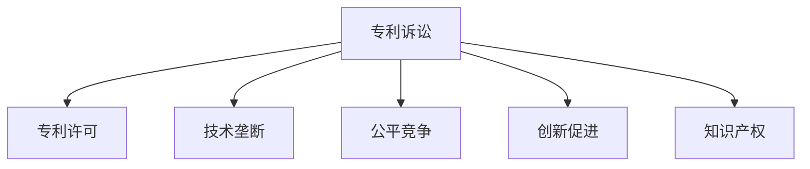

                 

# 硅谷专利战争的影响与对策

> 关键词：硅谷专利战争, 专利诉讼, 技术垄断, 公平竞争, 专利许可, 创新促进, 知识产权, 企业策略

## 1. 背景介绍

### 1.1 问题由来

硅谷，作为全球高科技创新的发源地，吸引了大量企业和人才聚集，形成了极其竞争激烈的商业环境。然而，随着科技竞争的加剧，硅谷逐渐变成了一场没有硝烟的专利战争。各大企业为了争夺市场主导权，频繁发起专利诉讼，不仅耗费巨大资源，还严重阻碍了技术的进步和创新。

### 1.2 问题核心关键点

硅谷专利战争的核心在于专利和知识产权保护。随着科技的发展，越来越多的前沿技术被转化为专利，成为企业竞争的焦点。一方面，专利保护可以激励企业和科研机构投入更多资源进行技术研发；另一方面，专利诉讼和专利许可问题却成为了限制创新和市场公平竞争的障碍。如何平衡专利保护和市场竞争，成为硅谷专利战争的关键。

## 2. 核心概念与联系

### 2.1 核心概念概述

为更好地理解硅谷专利战争的影响与对策，本节将介绍几个密切相关的核心概念：

- 专利诉讼：指企业之间因专利权争议而进行的法律诉讼，涉及专利权归属、侵权、许可等问题。专利诉讼通常是专利战争的重要形式之一，对市场竞争和创新生态有重大影响。
- 专利许可：指专利持有者将其专利授权他人使用，收取许可费或版税的商业行为。专利许可是专利技术的商业化途径，对企业知识产权保护有重要意义。
- 技术垄断：指一家或少数几家企业通过专利、市场策略等手段，在某一技术领域占据市场主导地位，限制其他企业的竞争。技术垄断容易引发不公平的市场竞争，损害消费者和市场公平。
- 公平竞争：指市场各主体在同等条件下，基于技术创新和市场策略展开公平竞争。公平竞争环境有利于激发技术创新和市场活力。
- 创新促进：指通过合理的知识产权保护和市场规则，激励企业进行技术创新，推动技术进步和产业升级。
- 知识产权：指包括专利、商标、版权等在内的各种形式的知识财产权利。知识产权保护是激发技术创新的重要手段。

这些核心概念之间的逻辑关系可以通过以下Mermaid流程图来展示：



这个流程图展示了一些核心概念及其之间的关系：

1. 专利诉讼通常涉及专利许可和公平竞争问题，可能会引发技术垄断。
2. 专利许可是专利技术的商业化途径，促进了公平竞争和创新。
3. 知识产权保护是专利诉讼和专利许可的基础，是公平竞争和创新促进的前提。

## 3. 核心算法原理 & 具体操作步骤
### 3.1 算法原理概述

硅谷专利战争的根源在于专利权的保护和市场竞争的冲突。通过分析专利诉讼、专利许可、技术垄断等关键环节，可以更好地理解硅谷专利战争的运作机制和影响。

### 3.2 算法步骤详解

1. **识别核心技术**：企业需要识别出自身核心技术，将其转化为专利，并申请保护。
2. **专利保护策略**：制定专利保护策略，包括专利申请、专利布局、专利监控等。
3. **专利许可谈判**：与潜在许可方进行专利许可谈判，设定许可费率、许可范围等条款。
4. **专利诉讼准备**：收集专利侵权证据，准备法律诉讼材料。
5. **专利诉讼执行**：向法院提起诉讼，进行庭审，争取胜利。
6. **市场策略调整**：根据专利诉讼结果，调整市场策略，进行技术垄断或公平竞争。

### 3.3 算法优缺点

硅谷专利战争中的专利诉讼和专利许可存在以下优缺点：

#### 优点：
- 促进技术创新：专利保护激励企业投入更多资源进行技术研发。
- 确保市场公平：通过专利许可和专利诉讼，维护市场公平竞争。
- 保护企业利益：专利许可和专利诉讼有助于保护企业的商业利益和技术成果。

#### 缺点：
- 耗费巨大资源：专利诉讼和专利许可过程复杂，成本高昂。
- 阻碍市场竞争：专利垄断容易限制其他企业的竞争，影响市场活力。
- 法律风险高：专利诉讼具有不确定性，企业可能面临败诉风险。

### 3.4 算法应用领域

硅谷专利战争涉及的专利诉讼和专利许可不仅限于科技行业，在医药、生物、金融等领域也广泛存在。技术垄断和公平竞争问题同样是所有行业的普遍关注点。

## 4. 数学模型和公式 & 详细讲解 & 举例说明（备注：数学公式请使用latex格式，latex嵌入文中独立段落使用 $$，段落内使用 $)
### 4.1 数学模型构建

假设市场中有N家企业，每家企业有n项核心技术。每项技术i的专利权为P_i，市场份额为S_i。设专利权保护期为T，专利许可费率为R，专利诉讼成本为C，专利垄断带来的利润为P_M。

### 4.2 公式推导过程

1. **专利许可成本模型**：
   $$
   Cost_{\text{licensing}} = n \times \max(R \times T - C, 0)
   $$
   其中，$\max$函数表示专利许可费率和专利诉讼成本之差大于0时，专利许可成本为正；反之，专利许可成本为0。

2. **专利诉讼成本模型**：
   $$
   Cost_{\text{litigation}} = \sum_{i=1}^{n} P_i \times S_i \times \max(C \times S_i, 0)
   $$
   其中，$\max$函数表示当企业胜诉时，专利诉讼成本为正；反之，专利诉讼成本为0。

3. **专利垄断利润模型**：
   $$
   Profit_{\text{monopoly}} = \sum_{i=1}^{n} P_i \times S_i \times R \times T
   $$
   表示技术垄断下，专利许可带来的总利润。

### 4.3 案例分析与讲解

以谷歌和微软为例，谷歌通过收购摩托罗拉和华为的专利，获得了大量的专利资产。微软则通过在Windows和Office等核心产品上申请大量专利，形成技术垄断。

谷歌和微软在各自的领域内通过专利诉讼和专利许可策略，形成了专利垄断和技术优势。微软的专利诉讼策略使其在Office市场占据主导地位，谷歌则通过专利许可和开放源代码策略，扩展了Android和云服务的市场份额。

## 5. 项目实践：代码实例和详细解释说明
### 5.1 开发环境搭建

在进行专利战争分析与对策开发前，我们需要准备好开发环境。以下是使用Python进行数据分析和可视化的环境配置流程：

1. 安装Anaconda：从官网下载并安装Anaconda，用于创建独立的Python环境。

2. 创建并激活虚拟环境：
```bash
conda create -n patent-analysis python=3.8 
conda activate patent-analysis
```

3. 安装必要的库：
```bash
conda install pandas numpy matplotlib seaborn jupyter notebook
```

4. 安装matplotlib，用于绘图：
```bash
pip install matplotlib
```

完成上述步骤后，即可在`patent-analysis`环境中进行专利战争的分析和可视化实践。

### 5.2 源代码详细实现

下面是一个使用Python和Pandas库进行专利数据处理和分析的样例代码：

```python
import pandas as pd

# 读取专利数据
patent_data = pd.read_csv('patent_data.csv')

# 分析专利数量分布
num_patents = patent_data['num_patents'].value_counts()

# 分析专利许可费率分布
royalty_rates = patent_data['royalty_rate'].value_counts()

# 分析专利诉讼成本分布
litigation_costs = patent_data['litigation_cost'].value_counts()

# 绘制专利数量、许可费率和诉讼成本的分布图
import matplotlib.pyplot as plt

plt.figure(figsize=(10, 6))
plt.bar(num_patents.index, num_patents.values, color='blue', label='Number of Patents')
plt.bar(royalty_rates.index, royalty_rates.values, color='red', label='Royalty Rate')
plt.bar(litigation_costs.index, litigation_costs.values, color='green', label='Litigation Cost')

plt.title('Patent Data Analysis')
plt.xlabel('Value')
plt.ylabel('Frequency')
plt.legend()
plt.show()
```

### 5.3 代码解读与分析

让我们再详细解读一下关键代码的实现细节：

- **数据读取**：通过`pandas`的`read_csv`方法读取专利数据，存储在`patent_data`变量中。
- **专利数量分布分析**：使用`value_counts`方法计算不同专利数量的频数，绘制直方图。
- **专利许可费率分布分析**：使用`value_counts`方法计算不同专利许可费率的频数，绘制直方图。
- **专利诉讼成本分布分析**：使用`value_counts`方法计算不同专利诉讼成本的频数，绘制直方图。
- **绘图**：通过`matplotlib`库绘制三个直方图，展示专利数量、许可费率和诉讼成本的分布情况。

通过上述代码，可以快速对专利数据进行基本分析和可视化，帮助理解专利战争中的核心参数和分布特征。

## 6. 实际应用场景
### 6.1 科技公司

对于科技公司而言，专利战争的影响主要体现在市场竞争和创新激励两个方面：

1. **市场竞争**：专利诉讼和专利许可直接影响公司的市场份额和利润。通过专利保护，公司可以避免被竞争对手诉讼或索赔，保持市场竞争优势。
2. **创新激励**：专利保护和专利许可可以激励公司进行更多技术研发，推出更多创新产品，提升市场竞争力。

以苹果公司为例，苹果通过严格的专利保护和专利诉讼策略，确保了其产品和技术在市场上的领先地位。同时，苹果也通过与其他公司达成专利许可协议，获取更多利润。

### 6.2 政府机构

政府机构在专利战争中的作用主要体现在知识产权保护和市场监管两个方面：

1. **知识产权保护**：政府通过制定和实施知识产权保护法规，确保企业创新成果得到合理保护。
2. **市场监管**：政府通过监控和打击专利侵权行为，维护市场公平竞争环境。

例如，美国政府通过《专利法》和《知识产权法》等法规，保护企业和科研机构的发明创造。同时，美国专利和商标办公室（USPTO）负责专利审查和授权，打击专利侵权行为。

### 6.3 学术机构

学术机构在专利战争中的作用主要体现在技术创新和知识产权保护两个方面：

1. **技术创新**：学术机构通过基础研究和应用研究，不断推出新技术和新方法，推动科技发展。
2. **知识产权保护**：学术机构通过专利申请和授权，保护研究成果的商业化和市场应用。

例如，麻省理工学院通过严格的知识产权保护策略，确保其研究成果的商业化和市场应用。麻省理工学院还通过与其他企业合作，进行技术转移和商业化，推动科技产业的发展。

### 6.4 未来应用展望

随着科技的不断发展，未来专利战争的影响和应对策略将更加复杂和多样。以下是对未来专利战争的展望：

1. **国际化**：专利战争将从国内市场扩展到全球市场，各国政府和国际组织将更加关注专利保护和市场监管。
2. **技术标准化**：标准化的专利技术将减少专利纠纷，提升技术合作和市场效率。
3. **专利池**：专利池和交叉许可协议将更多出现，减少专利诉讼风险。
4. **开源技术**：开源技术将成为未来科技发展的重要趋势，减少专利侵权风险。
5. **人工智能**：人工智能技术的应用将引发新的专利纠纷，企业需要提前制定应对策略。
6. **数据隐私**：数据隐私和知识产权保护的冲突将引发新的专利战争，企业需要平衡数据隐私和技术创新。

## 7. 工具和资源推荐
### 7.1 学习资源推荐

为了帮助开发者深入理解专利战争的影响与对策，以下推荐一些优质的学习资源：

1. 《专利法》和《知识产权法》：介绍专利和知识产权保护的法律知识，帮助理解专利战争的法律背景。
2. 《专利战争：知识产权冲突与应对策略》：详细介绍专利战争的历史和现状，提出应对策略。
3. 《专利许可协议》：解释专利许可协议的内容和条款，帮助企业制定合理的专利许可策略。
4. 《专利诉讼指南》：提供专利诉讼的流程和技巧，帮助企业避免专利诉讼风险。
5. 《技术创新与知识产权保护》：介绍技术创新的知识产权保护策略，帮助企业保护创新成果。

通过这些资源的学习，相信你一定能够深入理解专利战争的影响与对策，为企业的知识产权保护和市场竞争提供重要参考。

### 7.2 开发工具推荐

高效的开发离不开优秀的工具支持。以下是几款用于专利战争分析和对策开发的常用工具：

1. Jupyter Notebook：一个交互式的开发环境，可以方便地进行数据处理和分析。
2. Visual Studio Code：一个功能强大的代码编辑器，支持多种编程语言。
3. Git：一个版本控制工具，方便团队协作和代码管理。
4. Google Colab：谷歌提供的免费在线Jupyter Notebook环境，方便进行数据处理和分析。
5. Scikit-learn：一个用于机器学习的Python库，方便进行数据处理和分析。

合理利用这些工具，可以显著提升专利战争分析和对策的开发效率，加快创新迭代的步伐。

### 7.3 相关论文推荐

专利战争和知识产权保护的研究源于学界的持续研究。以下是几篇奠基性的相关论文，推荐阅读：

1. "Patent Litigation and Innovation" by Paul R. Kruger：研究专利诉讼对创新的影响。
2. "The Economics of Patent Protection" by Henry E. Siemens：分析专利保护的经济效应。
3. "Patent Pooling: From Technology Cooperation to Antitrust Law" by Michael Shang：探讨专利池的形成和影响。
4. "Open Source Software: Understanding the Technology Base" by Eben Moglen：研究开源技术对专利战争的影响。
5. "AI Patent War: What Lies Ahead?" by Daniel H. Weitzenfeld：预测人工智能技术在专利战争中的应用。
6. "Data Privacy and Intellectual Property" by Robin Green：探讨数据隐私与知识产权保护的冲突。

这些论文代表了大规模专利战争和知识产权保护的发展脉络。通过学习这些前沿成果，可以帮助研究者把握学科前进方向，激发更多的创新灵感。

## 8. 总结：未来发展趋势与挑战

### 8.1 总结

本文对硅谷专利战争的影响与对策进行了全面系统的介绍。首先阐述了专利战争的背景和核心问题，明确了专利保护和市场竞争之间的矛盾。其次，从原理到实践，详细讲解了专利诉讼、专利许可、技术垄断等核心环节，给出了专利战争的完整分析框架。同时，本文还探讨了专利战争在科技公司、政府机构、学术机构等不同主体中的应用场景，展示了专利战争的广泛影响。

通过本文的系统梳理，可以看到，硅谷专利战争已经深刻影响了科技公司和企业的创新和市场竞争策略。未来，专利战争将随着技术的发展和市场的变化，继续在更多领域和层面展开。解决专利战争中的法律、技术、市场和伦理问题，将是大企业、政府和学术机构共同面临的挑战。

### 8.2 未来发展趋势

展望未来，硅谷专利战争将呈现以下几个发展趋势：

1. **国际化**：专利战争将从国内市场扩展到全球市场，各国政府和国际组织将更加关注专利保护和市场监管。
2. **技术标准化**：标准化的专利技术将减少专利纠纷，提升技术合作和市场效率。
3. **专利池**：专利池和交叉许可协议将更多出现，减少专利诉讼风险。
4. **开源技术**：开源技术将成为未来科技发展的重要趋势，减少专利侵权风险。
5. **人工智能**：人工智能技术的应用将引发新的专利纠纷，企业需要提前制定应对策略。
6. **数据隐私**：数据隐私和知识产权保护的冲突将引发新的专利战争，企业需要平衡数据隐私和技术创新。

这些趋势凸显了专利战争的复杂性和多面性，也预示了未来专利战争的新挑战和新机遇。

### 8.3 面临的挑战

尽管专利战争的研究已经取得了一定进展，但在迈向更加智能化、普适化应用的过程中，它仍面临着诸多挑战：

1. **法律风险高**：专利诉讼和专利许可具有不确定性，企业可能面临败诉风险。
2. **市场竞争激烈**：专利战争可能引发市场竞争的过度激化，影响市场公平和稳定。
3. **技术复杂度高**：专利技术的复杂性增加了专利保护和市场监管的难度。
4. **知识产权保护不足**：知识产权保护力度不足，可能激发更多的专利纠纷。
5. **伦理问题复杂**：专利战争涉及到伦理和道德问题，如何平衡各方利益，需要更多研究和讨论。

### 8.4 研究展望

面对专利战争面临的诸多挑战，未来的研究需要在以下几个方面寻求新的突破：

1. **法律保障**：加强知识产权保护的法律框架和执行力度，减少专利纠纷和诉讼风险。
2. **市场监管**：加强市场监管和公平竞争，平衡各方利益，推动市场健康发展。
3. **技术标准化**：推动技术标准化的发展，减少专利纠纷，提升技术合作和市场效率。
4. **知识产权保护**：通过知识产权保护，激励企业进行更多技术研发，推动技术创新。
5. **伦理问题**：探讨专利战争中的伦理和道德问题，寻求解决方案，平衡各方利益。

这些研究方向的探索，必将引领专利战争研究迈向更高的台阶，为构建公平、稳定、高效的知识产权保护环境铺平道路。面向未来，专利战争的研究需要多学科的交叉融合，才能真正实现专利战争的平衡和可持续性发展。

## 9. 附录：常见问题与解答

**Q1：专利战争对市场竞争的影响有哪些？**

A: 专利战争对市场竞争的影响主要体现在以下几个方面：

1. **市场垄断**：专利诉讼和专利许可可以形成市场垄断，限制其他企业的竞争。
2. **市场分割**：专利纠纷可能导致市场分割，形成多个独立的市场区域。
3. **市场波动**：专利战争可能导致市场竞争加剧，增加市场波动性。

**Q2：专利许可协议需要考虑哪些因素？**

A: 专利许可协议需要考虑以下因素：

1. **许可范围**：明确专利许可的范围，包括地域、产品、技术等。
2. **许可费率**：设定合理的许可费率，确保双方利益平衡。
3. **许可期限**：设定专利许可的期限，保护企业利益。
4. **违约责任**：明确违约责任和赔偿条款，避免法律风险。
5. **争议解决**：制定争议解决的机制和流程，确保合同执行。

**Q3：如何避免专利侵权风险？**

A: 避免专利侵权风险需要采取以下措施：

1. **专利审查**：在推出新产品前，进行专利审查，确保不侵犯他人专利。
2. **专利布局**：进行专利布局，覆盖关键技术，形成专利屏障。
3. **专利监控**：通过专利监控工具，及时发现潜在侵权风险。
4. **专利律师**：聘请专业的专利律师，提供法律咨询和支持。
5. **专利维权**：在发现侵权行为时，及时启动专利维权程序，保护企业利益。

**Q4：如何进行专利数据分析？**

A: 进行专利数据分析需要采取以下步骤：

1. **数据收集**：收集专利数据，包括专利号、发明人、申请日期等关键信息。
2. **数据处理**：对专利数据进行处理，去除重复和无用信息。
3. **数据分析**：使用数据分析工具，如Python和R，进行专利数量、许可费率、诉讼成本等分析。
4. **数据可视化**：使用数据可视化工具，如Matplotlib和Seaborn，绘制专利数据分析图表。

**Q5：如何进行专利战争的战略部署？**

A: 进行专利战争的战略部署需要考虑以下因素：

1. **市场分析**：分析市场竞争态势，识别主要竞争对手和专利纠纷。
2. **专利布局**：进行专利布局，覆盖关键技术，形成专利屏障。
3. **专利诉讼**：根据专利纠纷情况，进行专利诉讼准备和执行。
4. **专利许可**：通过专利许可谈判，获取许可费率和技术许可范围。
5. **专利保护**：加强专利保护，防止他人侵权和诉讼。

通过这些措施，可以有效应对专利战争，保护企业利益和技术成果。

---

作者：禅与计算机程序设计艺术 / Zen and the Art of Computer Programming

