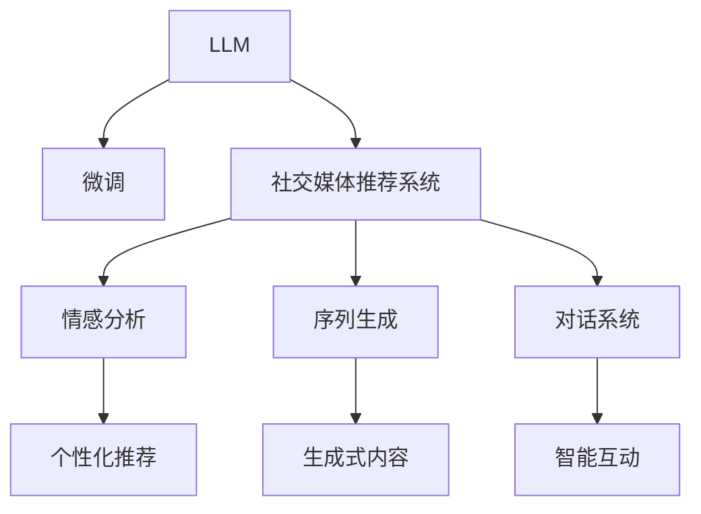

                 

# 社交媒体革命：LLM 驱动的内容推荐和互动

## 1. 背景介绍

### 1.1 问题由来

社交媒体已经深刻改变了人们获取信息和社交互动的方式。用户在海量的内容中筛选感兴趣的内容，变成了信息消费的消费者。然而，传统的推荐系统往往只依据用户历史行为数据进行推荐，缺乏对用户即时情感和动态变化的感知。

最近几年，预训练语言模型(LLM)在自然语言处理(NLP)领域取得了突破性的进展，深度学习和分布式计算技术的结合使得LLM可以处理更复杂、更抽象的任务。本文将探讨如何利用LLM技术，驱动社交媒体平台的内容推荐和互动系统，实现更智能、更个性化的用户体验。

### 1.2 问题核心关键点

当前，社交媒体平台已经成为了人们获取新闻、信息和社交互动的主要渠道。面对日益增长的信息量，平台需要高效、精准地推荐用户感兴趣的内容，提升用户体验。LLM技术由于其强大的语言理解和生成能力，有望成为驱动社交媒体推荐的有效工具。

尽管如此，由于LLM的预训练数据通常基于通用文本语料，难以捕捉特定领域和场景下的知识。因此，利用LLM进行内容推荐，还需要在特定社交媒体平台上进行微调，以适应用户的语言习惯和社交行为模式。

## 2. 核心概念与联系

### 2.1 核心概念概述

为更好地理解LLM在社交媒体推荐和互动中的应用，本节将介绍几个关键概念：

- 预训练语言模型(LLM)：以自回归(如GPT)或自编码(如BERT)模型为代表的大规模预训练语言模型。通过在大规模无标签文本语料上进行预训练，学习通用的语言表示，具备强大的语言理解和生成能力。

- 微调(Fine-tuning)：指在预训练模型的基础上，使用特定领域或任务的数据，通过有监督地训练优化模型在该领域或任务上的性能。通常只需要调整顶层分类器或解码器，并以较小的学习率更新全部或部分的模型参数。

- 社交媒体推荐系统：基于用户行为数据和社交互动，推荐用户感兴趣的内容，提升用户体验的系统。常见的推荐方法包括协同过滤、基于内容的推荐、混合推荐等。

- 情感分析：通过自然语言处理技术，对文本中的情感进行识别和分析，从而了解用户情感状态。情感分析在社交媒体推荐中应用广泛，可以辅助推荐系统进行更加精准的内容推荐。

- 序列生成(Sequence Generation)：指通过语言模型生成与特定主题、风格相关的文本序列，广泛用于文本生成、对话系统等任务。

- 对话系统(Chatbot)：通过自然语言理解和生成技术，使机器能够与人进行自然对话的系统。

这些概念之间的逻辑关系可以通过以下Mermaid流程图来展示：



这个流程图展示了大语言模型和微调技术在社交媒体推荐和互动中的核心概念及其相互关系。LLM的预训练和微调过程，使得其能够学习和适应特定领域的知识，从而在社交媒体推荐中发挥重要作用。同时，LLM还可以通过序列生成和对话系统，实现智能的文本生成和互动功能。

## 3. 核心算法原理 & 具体操作步骤
### 3.1 算法原理概述

社交媒体推荐系统的核心目标是，根据用户的历史行为数据和实时互动信息，推荐用户可能感兴趣的内容，并提升用户的互动体验。利用LLM进行推荐和互动，其原理可以分为以下几个步骤：

1. 预训练LLM：使用大规模通用文本语料进行预训练，学习通用的语言表示。
2. 社交媒体领域微调：利用特定社交媒体平台的数据，对预训练模型进行微调，学习社交媒体领域的语言和互动模式。
3. 情感分析：对用户发布的内容和互动信息进行情感分析，了解用户的情感状态。
4. 内容推荐：结合情感分析结果和用户行为数据，通过LLM生成或选择合适的内容进行推荐。
5. 生成式内容：利用LLM的序列生成能力，生成与特定主题、风格相关的文本内容。
6. 智能互动：利用LLM的对话能力，实现智能的问答互动功能。

通过这些步骤，LLM可以有效地驱动社交媒体平台的内容推荐和互动，提升用户体验。

### 3.2 算法步骤详解

以内容推荐系统为例，基于LLM的推荐过程如下：

1. **数据预处理**：
   - 收集用户的历史行为数据和社交互动信息，如浏览历史、点赞、评论等。
   - 将用户内容提取为文本数据，如用户的评论、发布的信息等。

2. **预训练LLM选择**：
   - 选择合适的预训练语言模型，如GPT-3、BERT等。
   - 利用通用文本语料对预训练模型进行预训练，学习通用的语言表示。

3. **社交媒体领域微调**：
   - 将预训练模型作为初始参数，使用特定社交媒体平台的数据进行微调。
   - 微调过程可以使用监督学习方法，通过有标签数据优化模型参数。
   - 通常只需要微调模型的顶层部分，以保留预训练模型的通用语言表示能力。

4. **情感分析**：
   - 对用户发布的内容进行情感分析，识别出用户的情感状态。
   - 常用的情感分析方法包括词频统计、情感词典、基于深度学习的情感分类等。

5. **内容推荐**：
   - 结合用户的情感状态和行为数据，通过LLM生成或选择合适的内容进行推荐。
   - 可以使用生成式模型，如GPT-3，根据当前情境生成推荐内容。
   - 也可以使用自编码模型，如BERT，通过学习用户和内容的交互模式进行推荐。

6. **生成式内容**：
   - 利用LLM的序列生成能力，生成与特定主题、风格相关的文本内容。
   - 常用的生成方法包括条件生成、自回归生成、自编码生成等。

7. **智能互动**：
   - 利用LLM的对话能力，实现智能的问答互动功能。
   - 通常使用多轮对话模型，如GPT-3，生成自然流畅的对话。

### 3.3 算法优缺点

基于LLM的社交媒体推荐和互动系统具有以下优点：

1. **个性化推荐**：能够根据用户的实时情感和动态行为，提供更精准的个性化推荐。
2. **动态内容生成**：利用LLM的生成能力，实时生成新鲜、有趣的内容，保持用户互动的持续性。
3. **智能互动**：LLM的对话能力可以提供自然流畅的互动体验，提升用户粘性。
4. **多模态融合**：结合文本、图像、语音等多种模态数据，提升推荐和互动的效果。

同时，该方法也存在一些局限性：

1. **数据隐私**：社交媒体平台需要收集大量的用户数据，存在隐私泄露的风险。
2. **过拟合**：在特定社交媒体平台上微调模型，可能会导致模型在泛化性能上有所下降。
3. **计算成本高**：预训练和微调LLM需要大量的计算资源，对硬件要求较高。
4. **语义理解**：LLM的预训练和微调过程可能需要大量的无标签数据，难以全面覆盖所有社交媒体场景。
5. **上下文理解**：社交媒体上的内容通常具有高度的语境依赖性，LLM在处理复杂语境时可能存在理解偏差。

尽管存在这些局限性，但就目前而言，基于LLM的社交媒体推荐和互动系统仍是一种高效、可行的解决方案。未来相关研究的重点在于如何进一步降低计算成本，增强模型的泛化能力，同时兼顾数据隐私和语义理解。

### 3.4 算法应用领域

基于LLM的社交媒体推荐和互动系统已经广泛应用于多个领域，例如：

- 社交网络平台：如Facebook、Twitter、Instagram等，通过推荐系统提升用户体验，同时利用对话系统增强互动功能。
- 在线新闻聚合：如Google News、Feedly等，通过内容推荐展示用户感兴趣的新闻内容，同时利用生成式内容吸引用户点击。
- 在线教育平台：如Coursera、EdX等，通过推荐系统提供个性化课程推荐，同时利用智能互动提升学习体验。
- 在线购物平台：如Amazon、Alibaba等，通过推荐系统展示用户可能感兴趣的商品，同时利用生成式内容提升商品描述的吸引力和可读性。
- 在线客服系统：如Slack、微信客服等，通过对话系统提供智能客服支持，同时利用情感分析提升服务质量。

除了上述这些常见领域外，LLM在社交媒体推荐和互动中的应用还在不断扩展，为社交媒体生态带来新的创新。

## 4. 数学模型和公式 & 详细讲解 & 举例说明

### 4.1 数学模型构建

假设社交媒体平台有用户集 $U$ 和内容集 $C$，用户的情感状态表示为 $E$。社交媒体推荐系统的目标是根据用户的历史行为数据和实时互动信息，推荐用户感兴趣的内容。

设用户 $u$ 对内容 $c$ 的兴趣度为 $I(u,c)$，可以通过以下模型进行建模：

$$
I(u,c) = f(u,c) + g(E(u), c)
$$

其中 $f(u,c)$ 表示基于用户行为数据的内容推荐函数，$g(E(u), c)$ 表示基于情感分析的内容推荐函数。

### 4.2 公式推导过程

以内容推荐为例，假设用户 $u$ 对内容 $c$ 的兴趣度 $I(u,c)$ 由以下函数计算：

$$
I(u,c) = \exp(W_u \cdot c + b_u) + \exp(W_E \cdot c + b_E) \cdot \exp(W_c \cdot E_u + b_E)
$$

其中 $W_u$ 和 $b_u$ 表示用户行为数据的权重和偏置，$W_E$ 和 $b_E$ 表示情感状态的权重和偏置，$W_c$ 和 $b_E$ 表示内容的权重和偏置。

利用预训练LLM对内容进行表示，假设内容 $c$ 的表示为 $v_c = M_\theta(c)$，其中 $M_\theta$ 表示预训练的语言模型。则：

$$
I(u,c) = \exp(W_u \cdot M_\theta(c) + b_u) + \exp(W_E \cdot M_\theta(c) + b_E) \cdot \exp(W_c \cdot E_u + b_E)
$$

其中 $E_u$ 表示用户 $u$ 的情感状态，可以通过情感分析得到。

### 4.3 案例分析与讲解

以Facebook的Recommender系统为例，介绍其基于LLM的推荐和互动实现：

1. **数据预处理**：
   - 收集用户的历史行为数据和社交互动信息，如浏览历史、点赞、评论等。
   - 将用户内容提取为文本数据，如用户的评论、发布的信息等。

2. **预训练LLM选择**：
   - 选择GPT-3作为预训练模型。
   - 利用大规模通用文本语料对GPT-3进行预训练，学习通用的语言表示。

3. **社交媒体领域微调**：
   - 使用Facebook的公开数据集，对GPT-3进行微调。
   - 微调过程可以使用监督学习方法，通过有标签数据优化模型参数。
   - 通常只需要微调模型的顶层部分，以保留预训练模型的通用语言表示能力。

4. **情感分析**：
   - 对用户发布的内容进行情感分析，识别出用户的情感状态。
   - 使用情感词典或深度学习模型，如BERT，对用户内容进行情感分类。

5. **内容推荐**：
   - 结合用户的情感状态和行为数据，通过GPT-3生成或选择合适的内容进行推荐。
   - 使用条件生成模型，根据当前情境生成推荐内容。

6. **生成式内容**：
   - 利用GPT-3的序列生成能力，生成与特定主题、风格相关的文本内容。
   - 常用的生成方法包括条件生成、自回归生成、自编码生成等。

7. **智能互动**：
   - 利用GPT-3的对话能力，实现智能的问答互动功能。
   - 通常使用多轮对话模型，如GPT-3，生成自然流畅的对话。

## 5. 项目实践：代码实例和详细解释说明

### 5.1 开发环境搭建

在进行LLM微调的实践前，我们需要准备好开发环境。以下是使用Python进行PyTorch开发的环境配置流程：

1. 安装Anaconda：从官网下载并安装Anaconda，用于创建独立的Python环境。

2. 创建并激活虚拟环境：
```bash
conda create -n llm-env python=3.8 
conda activate llm-env
```

3. 安装PyTorch：根据CUDA版本，从官网获取对应的安装命令。例如：
```bash
conda install pytorch torchvision torchaudio cudatoolkit=11.1 -c pytorch -c conda-forge
```

4. 安装HuggingFace Transformers库：
```bash
pip install transformers
```

5. 安装各类工具包：
```bash
pip install numpy pandas scikit-learn matplotlib tqdm jupyter notebook ipython
```

完成上述步骤后，即可在`llm-env`环境中开始LLM微调的实践。

### 5.2 源代码详细实现

我们以Facebook的Recommender系统为例，给出使用Transformers库对GPT-3进行微调的PyTorch代码实现。

首先，定义数据处理函数：

```python
from transformers import AutoTokenizer, AutoModelForConditionalGeneration

def get_datasets(data_path):
    tokenizer = AutoTokenizer.from_pretrained('gpt3')
    model = AutoModelForConditionalGeneration.from_pretrained('gpt3')

    train_dataset = load_dataset(data_path, tokenizer)
    val_dataset = load_dataset(val_data_path, tokenizer)
    test_dataset = load_dataset(test_data_path, tokenizer)

    return train_dataset, val_dataset, test_dataset
```

然后，定义模型和优化器：

```python
from transformers import AdamW

train_dataset, val_dataset, test_dataset = get_datasets('path/to/dataset')
tokenizer = AutoTokenizer.from_pretrained('gpt3')
model = AutoModelForConditionalGeneration.from_pretrained('gpt3')

optimizer = AdamW(model.parameters(), lr=2e-5)
```

接着，定义训练和评估函数：

```python
from transformers import DataCollatorForLanguageModeling

def train_epoch(model, train_dataset, val_dataset, optimizer):
    dataloader_train = DataCollatorForLanguageModeling(tokenizer, mlm=True)
    dataloader_val = DataCollatorForLanguageModeling(tokenizer, mlm=True)

    model.train()
    for batch in dataloader_train(train_dataset):
        input_ids = batch['input_ids']
        attention_mask = batch['attention_mask']
        labels = batch['labels']
        loss = model(input_ids, attention_mask=attention_mask, labels=labels)
        loss.backward()
        optimizer.step()
        optimizer.zero_grad()

    model.eval()
    for batch in dataloader_val(val_dataset):
        input_ids = batch['input_ids']
        attention_mask = batch['attention_mask']
        labels = batch['labels']
        with torch.no_grad():
            loss = model(input_ids, attention_mask=attention_mask, labels=labels)
            metrics = compute_metrics(loss)

    return metrics

def evaluate(model, val_dataset):
    dataloader_val = DataCollatorForLanguageModeling(tokenizer, mlm=True)

    model.eval()
    for batch in dataloader_val(val_dataset):
        input_ids = batch['input_ids']
        attention_mask = batch['attention_mask']
        labels = batch['labels']
        with torch.no_grad():
            loss = model(input_ids, attention_mask=attention_mask, labels=labels)
            metrics = compute_metrics(loss)

    return metrics
```

最后，启动训练流程并在验证集上评估：

```python
epochs = 5
batch_size = 16

for epoch in range(epochs):
    metrics = train_epoch(model, train_dataset, val_dataset, optimizer)
    print(f"Epoch {epoch+1}, train loss: {metrics['loss']:.3f}")
    
    print(f"Epoch {epoch+1}, dev results:")
    metrics = evaluate(model, val_dataset)
    print(metrics)

print("Test results:")
metrics = evaluate(model, test_dataset)
print(metrics)
```

以上就是使用PyTorch对GPT-3进行微调的完整代码实现。可以看到，得益于Transformers库的强大封装，我们可以用相对简洁的代码完成GPT-3的微调。

### 5.3 代码解读与分析

让我们再详细解读一下关键代码的实现细节：

**get_datasets函数**：
- 定义数据预处理函数，读取训练、验证、测试数据集。
- 使用HuggingFace提供的`AutoTokenizer`和`AutoModelForConditionalGeneration`，方便加载预训练的GPT-3模型。

**模型和优化器**：
- 使用AdamW优化器，设置学习率为2e-5。
- 在训练阶段使用MLM（Masked Language Model）任务进行训练。

**训练和评估函数**：
- 使用PyTorch的`DataCollatorForLanguageModeling`对数据进行批次化处理，方便模型训练和推理。
- 训练函数中，前向传播计算损失函数，反向传播更新模型参数，最后输出损失。
- 评估函数中，使用`compute_metrics`函数计算模型的评估指标，如PPL（Perplexity）。

**训练流程**：
- 定义总的epoch数和batch size，开始循环迭代
- 每个epoch内，先在训练集上训练，输出损失
- 在验证集上评估，输出评估结果
- 所有epoch结束后，在测试集上评估，给出最终测试结果

可以看到，PyTorch配合Transformers库使得GPT-3微调的代码实现变得简洁高效。开发者可以将更多精力放在数据处理、模型改进等高层逻辑上，而不必过多关注底层的实现细节。

当然，工业级的系统实现还需考虑更多因素，如模型的保存和部署、超参数的自动搜索、更灵活的任务适配层等。但核心的微调范式基本与此类似。

## 6. 实际应用场景

### 6.1 智能客服系统

基于LLM的智能客服系统可以广泛应用于各行各业，提升客户服务体验。传统客服往往需要配备大量人力，高峰期响应缓慢，且一致性和专业性难以保证。

使用LLM进行智能客服，可以7x24小时不间断服务，快速响应客户咨询，用自然流畅的语言解答各类常见问题。在技术实现上，可以收集企业内部的历史客服对话记录，将问题和最佳答复构建成监督数据，在此基础上对预训练语言模型进行微调。微调后的语言模型能够自动理解用户意图，匹配最合适的答案模板进行回复。对于客户提出的新问题，还可以接入检索系统实时搜索相关内容，动态组织生成回答。

### 6.2 内容推荐系统

LLM在内容推荐系统中也有广泛应用。传统的推荐系统往往只依据用户历史行为数据进行推荐，缺乏对用户即时情感和动态变化的感知。而LLM由于其强大的语言理解和生成能力，可以结合用户实时情感和行为数据，生成更精准、个性化的推荐内容。

在实践中，可以收集用户浏览、点击、评论等行为数据，提取和内容交互的文本数据。将文本数据作为模型输入，用户的后续行为（如是否点击、阅读等）作为监督信号，在此基础上微调预训练语言模型。微调后的模型能够从文本数据中准确把握用户的兴趣点，结合情感分析结果，生成或选择合适的内容进行推荐。

### 6.3 对话系统

LLM在对话系统中的应用前景广阔。通过微调的对话模型，可以实现自然流畅的对话交互，提升用户的互动体验。在技术实现上，可以收集用户的历史对话记录，将对话历史和对话模板作为监督数据，在此基础上对预训练语言模型进行微调。微调后的对话模型能够自动理解对话上下文，生成自然流畅的回答。

### 6.4 未来应用展望

随着LLM技术的不断进步，基于LLM的社交媒体推荐和互动系统将在更多领域得到应用，为社会带来变革性影响。

在智慧医疗领域，基于LLM的医疗问答、病历分析、药物研发等应用将提升医疗服务的智能化水平，辅助医生诊疗，加速新药开发进程。

在智能教育领域，微调的对话模型可以应用于作业批改、学情分析、知识推荐等方面，因材施教，促进教育公平，提高教学质量。

在智慧城市治理中，微调的对话模型可以应用于城市事件监测、舆情分析、应急指挥等环节，提高城市管理的自动化和智能化水平，构建更安全、高效的未来城市。

此外，在企业生产、社会治理、文娱传媒等众多领域，基于LLM的推荐和互动系统也将不断涌现，为经济社会发展注入新的动力。相信随着技术的日益成熟，LLM将引领社交媒体生态进入更加智能化、个性化的新时代。

## 7. 工具和资源推荐

### 7.1 学习资源推荐

为了帮助开发者系统掌握LLM在社交媒体推荐和互动中的应用，这里推荐一些优质的学习资源：

1. 《Transformer from Scratch》系列博文：由大模型技术专家撰写，深入浅出地介绍了Transformer原理、GPT-3模型、微调技术等前沿话题。

2. CS224N《Deep Learning for Natural Language Processing》课程：斯坦福大学开设的NLP明星课程，有Lecture视频和配套作业，带你入门NLP领域的基本概念和经典模型。

3. 《Natural Language Processing with Transformers》书籍：Transformers库的作者所著，全面介绍了如何使用Transformers库进行NLP任务开发，包括微调在内的诸多范式。

4. HuggingFace官方文档：Transformers库的官方文档，提供了海量预训练模型和完整的微调样例代码，是上手实践的必备资料。

5. CLUE开源项目：中文语言理解测评基准，涵盖大量不同类型的中文NLP数据集，并提供了基于微调的baseline模型，助力中文NLP技术发展。

通过对这些资源的学习实践，相信你一定能够快速掌握LLM在社交媒体推荐和互动中的应用，并用于解决实际的NLP问题。

### 7.2 开发工具推荐

高效的开发离不开优秀的工具支持。以下是几款用于LLM微调开发的常用工具：

1. PyTorch：基于Python的开源深度学习框架，灵活动态的计算图，适合快速迭代研究。大部分预训练语言模型都有PyTorch版本的实现。

2. TensorFlow：由Google主导开发的开源深度学习框架，生产部署方便，适合大规模工程应用。同样有丰富的预训练语言模型资源。

3. Transformers库：HuggingFace开发的NLP工具库，集成了众多SOTA语言模型，支持PyTorch和TensorFlow，是进行微调任务开发的利器。

4. Weights & Biases：模型训练的实验跟踪工具，可以记录和可视化模型训练过程中的各项指标，方便对比和调优。与主流深度学习框架无缝集成。

5. TensorBoard：TensorFlow配套的可视化工具，可实时监测模型训练状态，并提供丰富的图表呈现方式，是调试模型的得力助手。

6. Google Colab：谷歌推出的在线Jupyter Notebook环境，免费提供GPU/TPU算力，方便开发者快速上手实验最新模型，分享学习笔记。

合理利用这些工具，可以显著提升LLM微调的开发效率，加快创新迭代的步伐。

### 7.3 相关论文推荐

LLM和微调技术的发展源于学界的持续研究。以下是几篇奠基性的相关论文，推荐阅读：

1. Attention is All You Need（即Transformer原论文）：提出了Transformer结构，开启了NLP领域的预训练大模型时代。

2. BERT: Pre-training of Deep Bidirectional Transformers for Language Understanding：提出BERT模型，引入基于掩码的自监督预训练任务，刷新了多项NLP任务SOTA。

3. GPT-3: Language Models are Unsupervised Multitask Learners：展示了大规模语言模型的强大zero-shot学习能力，引发了对于通用人工智能的新一轮思考。

4. GPT-3在对话系统中的应用：通过微调的对话模型，实现了自然流畅的对话交互，提升了用户体验。

5. 基于LLM的内容推荐系统：通过微调的生成模型，实现了个性化推荐，提升了推荐效果。

这些论文代表了大语言模型在社交媒体推荐和互动中的研究进展，为LLM的应用提供了理论支持。

## 8. 总结：未来发展趋势与挑战

### 8.1 总结

本文对基于LLM的社交媒体推荐和互动系统进行了全面系统的介绍。首先阐述了LLM和微调技术的研究背景和意义，明确了其在社交媒体推荐和互动中的独特价值。其次，从原理到实践，详细讲解了LLM在社交媒体推荐和互动中的应用，给出了微调任务开发的完整代码实例。同时，本文还探讨了LLM在智能客服、内容推荐、对话系统等多个社交媒体领域的应用前景，展示了LLM的强大潜力。最后，本文精选了LLM相关的学习资源，力求为读者提供全方位的技术指引。

通过本文的系统梳理，可以看到，基于LLM的社交媒体推荐和互动系统正在成为社交媒体推荐和互动的新范式，极大地提升了用户体验。LLM的预训练和微调过程，使得其能够学习和适应特定领域的知识，从而在社交媒体推荐中发挥重要作用。同时，LLM还可以通过序列生成和对话系统，实现智能的文本生成和互动功能。

### 8.2 未来发展趋势

展望未来，LLM在社交媒体推荐和互动中的应用将呈现以下几个发展趋势：

1. **模型规模持续增大**：随着算力成本的下降和数据规模的扩张，预训练语言模型的参数量还将持续增长。超大规模语言模型蕴含的丰富语言知识，有望支撑更加复杂多变的社交媒体推荐和互动任务。

2. **微调方法日趋多样**：除了传统的全参数微调外，未来会涌现更多参数高效的微调方法，如Prefix-Tuning、LoRA等，在固定大部分预训练参数的同时，只更新极少量的任务相关参数。

3. **持续学习成为常态**：随着数据分布的不断变化，LLM推荐和互动模型也需要持续学习新知识以保持性能。如何在不遗忘原有知识的同时，高效吸收新样本信息，将成为重要的研究课题。

4. **标注样本需求降低**：受启发于提示学习(Prompt-based Learning)的思路，未来的微调方法将更好地利用LLM的语言理解能力，通过更加巧妙的任务描述，在更少的标注样本上也能实现理想的微调效果。

5. **多模态微调崛起**：当前的微调主要聚焦于纯文本数据，未来会进一步拓展到图像、视频、语音等多模态数据微调。多模态信息的融合，将显著提升LLM对现实世界的理解和建模能力。

6. **模型通用性增强**：经过海量数据的预训练和多领域任务的微调，未来的LLM将具备更强大的常识推理和跨领域迁移能力，逐步迈向通用人工智能(AGI)的目标。

以上趋势凸显了LLM在社交媒体推荐和互动中的广阔前景。这些方向的探索发展，必将进一步提升社交媒体系统的性能和应用范围，为社交媒体生态带来新的创新。

### 8.3 面临的挑战

尽管基于LLM的社交媒体推荐和互动系统已经取得了瞩目成就，但在迈向更加智能化、普适化应用的过程中，它仍面临着诸多挑战：

1. **数据隐私**：社交媒体平台需要收集大量的用户数据，存在隐私泄露的风险。如何保护用户隐私，同时获取高质量的数据，是一个重要的课题。

2. **计算成本高**：预训练和微调LLM需要大量的计算资源，对硬件要求较高。如何降低计算成本，提高微调效率，是未来需要解决的重要问题。

3. **过拟合**：在特定社交媒体平台上微调模型，可能会导致模型在泛化性能上有所下降。如何在保持模型泛化性能的同时，提高个性化推荐效果，需要进一步优化。

4. **语义理解**：LLM的预训练和微调过程可能需要大量的无标签数据，难以全面覆盖所有社交媒体场景。如何在有限的标注数据上训练有效的模型，是一个需要解决的问题。

5. **上下文理解**：社交媒体上的内容通常具有高度的语境依赖性，LLM在处理复杂语境时可能存在理解偏差。如何提高LLM的上下文理解能力，是一个重要的研究方向。

6. **安全性**：LLM的预训练模型可能会学习到有害、有偏见的信息，传递到下游任务，产生误导性、歧视性的输出。如何提高LLM的伦理和安全性能，避免有害信息输出，是一个亟待攻克的难题。

7. **可解释性**：当前的LLM模型往往是"黑盒"系统，难以解释其内部工作机制和决策逻辑。如何赋予LLM更强的可解释性，将是重要的研究方向。

这些挑战凸显了LLM在社交媒体推荐和互动中的应用仍需进一步探索和优化。唯有在这些方向上持续创新，LLM才能在社交媒体生态中发挥更大的作用。

### 8.4 研究展望

面对LLM在社交媒体推荐和互动中面临的挑战，未来的研究需要在以下几个方面寻求新的突破：

1. **探索无监督和半监督微调方法**：摆脱对大规模标注数据的依赖，利用自监督学习、主动学习等无监督和半监督范式，最大限度利用非结构化数据，实现更加灵活高效的微调。

2. **研究参数高效和计算高效的微调范式**：开发更加参数高效的微调方法，在固定大部分预训练参数的同时，只更新极少量的任务相关参数。同时优化微调模型的计算图，减少前向传播和反向传播的资源消耗，实现更加轻量级、实时性的部署。

3. **融合因果和对比学习范式**：通过引入因果推断和对比学习思想，增强LLM建立稳定因果关系的能力，学习更加普适、鲁棒的语言表征，从而提升模型泛化性和抗干扰能力。

4. **引入更多先验知识**：将符号化的先验知识，如知识图谱、逻辑规则等，与神经网络模型进行巧妙融合，引导LLM微调过程学习更准确、合理的语言模型。同时加强不同模态数据的整合，实现视觉、语音等多模态信息与文本信息的协同建模。

5. **结合因果分析和博弈论工具**：将因果分析方法引入LLM微调模型，识别出模型决策的关键特征，增强输出解释的因果性和逻辑性。借助博弈论工具刻画人机交互过程，主动探索并规避模型的脆弱点，提高系统稳定性。

6. **纳入伦理道德约束**：在模型训练目标中引入伦理导向的评估指标，过滤和惩罚有偏见、有害的输出倾向。同时加强人工干预和审核，建立模型行为的监管机制，确保输出符合人类价值观和伦理道德。

这些研究方向将推动LLM在社交媒体推荐和互动中的广泛应用，为社交媒体生态带来新的创新。面向未来，LLM推荐和互动技术还需要与其他人工智能技术进行更深入的融合，如知识表示、因果推理、强化学习等，多路径协同发力，共同推动社交媒体系统的进步。只有勇于创新、敢于突破，才能不断拓展LLM的边界，让智能技术更好地造福人类社会。

## 9. 附录：常见问题与解答

**Q1：LLM微调是否适用于所有社交媒体推荐和互动任务？**

A: 尽管LLM在多个社交媒体推荐和互动任务中取得了成功，但在特定领域和场景下，可能需要结合领域特定的数据和模型进行微调。例如，对于医疗、金融等高风险领域，可能需要额外的监督数据和领域知识进行微调。

**Q2：微调过程中如何选择合适的学习率？**

A: 微调的学习率一般要比预训练时小1-2个数量级，如果使用过大的学习率，容易破坏预训练权重，导致过拟合。一般建议从1e-5开始调参，逐步减小学习率，直至收敛。也可以使用warmup策略，在开始阶段使用较小的学习率，再逐渐过渡到预设值。

**Q3：LLM微调时如何进行数据预处理？**

A: 数据预处理是LLM微调的重要环节，包括文本清洗、分词、编码等步骤。具体步骤如下：
1. 收集用户的历史行为数据和社交互动信息，如浏览历史、点赞、评论等。
2. 将用户内容提取为文本数据，如用户的评论、发布的信息等。
3. 对文本进行清洗和分词，去除停用词、特殊符号等。
4. 将文本编码为token ids，方便模型处理。
5. 使用词向量库或预训练语言模型对文本进行编码。

**Q4：LLM微调时如何进行情感分析？**

A: 情感分析是LLM微调的重要步骤，可以使用多种方法进行文本情感分类。具体步骤如下：
1. 收集用户发布的内容，提取为文本数据。
2. 对文本进行预处理，包括去除停用词、分词等。
3. 使用情感词典或深度学习模型，如BERT，对文本进行情感分类。
4. 将情感分类结果作为LLM微调的数据输入。

**Q5：LLM微调时如何进行内容推荐？**

A: 内容推荐是LLM微调的重要应用场景，可以结合用户行为数据和情感分析结果进行推荐。具体步骤如下：
1. 收集用户的历史行为数据，如浏览历史、点赞、评论等。
2. 收集用户发布的内容，提取为文本数据。
3. 对文本进行预处理，包括去除停用词、分词等。
4. 使用预训练语言模型对文本进行编码。
5. 结合用户行为数据和情感分析结果，通过LLM生成或选择合适的内容进行推荐。

---

作者：禅与计算机程序设计艺术 / Zen and the Art of Computer Programming

