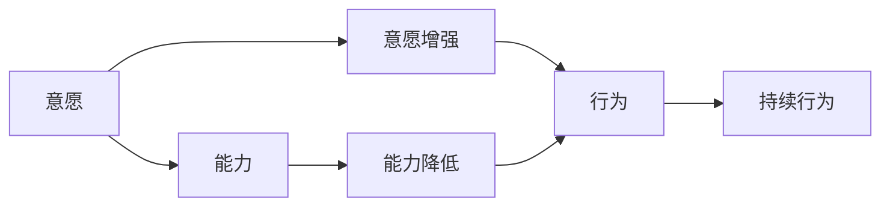

                 

# 福格模型在管理习惯养成中的应用

## 1. 背景介绍

在当今快节奏的现代社会中，习惯的养成与改变对个人发展和组织绩效有着重要影响。良好的习惯能够提高生产力，提升生活质量，而坏习惯则可能导致效率低下、健康受损等问题。因此，如何有效管理习惯，尤其是养成好的习惯，成为了管理学、心理学以及行为科学的研究热点。福格模型（Fogg Model）正是在这一背景下提出的，通过简洁且实用的理论框架，为人们提供了一套系统的方法来理解、分析和引导习惯的形成与改变。

## 2. 核心概念与联系

### 2.1 核心概念概述

福格模型是由行为科学家B.J.福格（B.J. Fogg）提出的行为改变模型。该模型认为，行为的发生取决于两个关键因素：**意愿**与**能力**。当意愿和能力同时满足时，行为更容易发生。因此，要想培养习惯，就需要同时增强行为意愿和降低行为能力门槛。

**意愿**是指一个人做某事的动机和意图，是内部驱动力。**能力**则是指执行该行为所需的资源和能量，是外部条件。当这两个因素同时满足时，行为发生的可能性极大。

### 2.2 核心概念原理和架构的 Mermaid 流程图(Mermaid 流程节点中不要有括号、逗号等特殊字符)



此图展示了福格模型的核心流程：

1. 意愿增强（C）：通过改变内在动机和目标设定，提升个人对行为的兴趣和承诺。
2. 能力降低（D）：通过简化操作流程、减少执行难度，降低实现行为的能量消耗。
3. 行为触发（E）：当意愿和能力同时满足时，行为被触发。
4. 持续行为（F）：通过循环增强意愿和降低能力，使行为成为自动化的习惯。

## 3. 核心算法原理 & 具体操作步骤

### 3.1 算法原理概述

福格模型是一种以用户行为为中心的行为改变模型，旨在通过增强行为意愿和降低行为难度，帮助人们养成良好的习惯。其核心思想是将行为改变拆解为更小的步骤，并通过逐步增强意愿和降低能力，最终促使行为自动化。

### 3.2 算法步骤详解

**步骤1：设定具体且可实现的目标**
- 目标设定要具体、明确，易于量化和跟踪。
- 确保目标具备挑战性，但不可过于困难，否则容易放弃。

**步骤2：增强行为意愿**
- **动机驱动**：找到内在动机，设定有意义的目标。
- **情境触发**：利用特定的情境和提示，增加行为的发生概率。
- **承诺机制**：使用公开承诺、社交压力等方式，增加行为的可执行性。

**步骤3：降低行为能力**
- **简化流程**：减少执行行为的步骤，降低能量消耗。
- **减少努力**：利用工具和技术，简化行为执行的过程。
- **即时反馈**：提供即时反馈，帮助及时调整行为策略。

**步骤4：行为触发与持续**
- **触发点设置**：在行为发生前设置明确的触发点，确保行为能够被自动执行。
- **持续反馈**：通过持续的正面反馈和负面反馈，巩固行为习惯。
- **灵活调整**：根据反馈结果，不断调整行为策略，使其更加符合实际需求。

### 3.3 算法优缺点

**优点：**
- **易于理解和应用**：福格模型将复杂的习惯养成过程简化为三个关键要素，易于理解和操作。
- **实用性强**：模型提供了具体、可行的操作步骤，适用于多种习惯养成场景。
- **灵活性高**：可以根据不同情境和目标，灵活调整行为策略。

**缺点：**
- **忽略个体差异**：模型假设所有人在意愿和能力上的变化是相同的，但实际情况可能因人而异。
- **过于简化**：行为变化受多种因素影响，福格模型可能无法全面覆盖所有变量。
- **依赖外部动机**：过于依赖情境和外部动机，可能导致行为维持的持久性不足。

### 3.4 算法应用领域

福格模型不仅在个人习惯养成方面有广泛应用，还被广泛应用于组织管理、健康管理、教育培训等领域。以下是几个典型的应用场景：

**个人健康管理**：通过设定具体目标，如每天走1万步、健康饮食等，结合增强意愿和降低能力的策略，帮助个人养成健康习惯。

**企业培训与发展**：利用福格模型，设定明确的培训目标，通过增强动机和降低学习难度，提高员工的技能水平和职业素养。

**教育培训机构**：针对不同年龄段和知识背景的学生，设定适合的练习目标，通过游戏化学习和即时反馈，提高学习效果和学生参与度。

**组织行为管理**：在企业内部推广福格模型，通过设定具体的业务目标和行为策略，提升员工的工作效率和组织绩效。

## 4. 数学模型和公式 & 详细讲解 & 举例说明

### 4.1 数学模型构建

福格模型主要涉及行为意愿和行为能力的数学建模。设 $W$ 为意愿强度，$C$ 为能力成本，$T$ 为触发点的难易程度。模型描述如下：

$$
\text{行为} = f(W, C, T)
$$

其中 $f$ 为行为函数，表示意愿、能力和触发点对行为的影响。

### 4.2 公式推导过程

以步行习惯的养成为例，设定每天走1万步为目标。假设每天的最大能量消耗为 $E_{\text{max}}$，行为意愿与步数之间的关系为 $W = \text{步数} \times k$，其中 $k$ 为意愿与步数之间的系数。步数越大，意愿越强。

若每走一步的成本为 $C = \frac{1}{100}$，则总能力成本为：

$$
C = \text{步数} \times \frac{1}{100}
$$

若触发点 $T$ 为中午12点，则行为触发成本为 $T = 0.5$。综合考虑意愿、能力和触发点，当 $W = 10000 \times k$ 且 $C \leq 10000 \times \frac{1}{100} + 0.5$ 时，行为能够被触发。

### 4.3 案例分析与讲解

假设某人决定每天步行1万步，设定了具体的步数目标，但缺乏必要的动机和能力。通过福格模型，可以采取以下策略：

1. **增强动机**：设定每天记录步数，并在社交媒体上分享，利用社交压力增加动机。
2. **降低能力成本**：选择较为平坦的路线，减少行走难度；利用步行跟踪应用，记录步数，简化记录过程。
3. **设定触发点**：将步行时间安排在午休时段，确保在能量充足时执行。

通过逐步实施这些策略，行为意愿和能力门槛同时被满足，从而更容易养成每天步行1万步的习惯。

## 5. 项目实践：代码实例和详细解释说明

### 5.1 开发环境搭建

项目开发环境包括Python、Jupyter Notebook等工具。具体步骤如下：

1. 安装Python 3.8及以上版本。
2. 安装Jupyter Notebook和相关依赖。
3. 配置开发环境，确保代码能够正常运行。

### 5.2 源代码详细实现

以下是一个简单的Python代码示例，用于模拟福格模型在习惯养成中的应用：

```python
import random

# 定义行为函数
def behavior_function(W, C, T):
    return W * (1 - C) + T

# 设定目标和参数
target_steps = 10000
max_energy = 100
cost_per_step = 1 / 100
trigger_point = 0.5

# 计算行为触发条件
willingness = target_steps * 0.5
capability = target_steps * cost_per_step
trigger_threshold = willingness * (1 - capability) + trigger_point

# 生成随机步数，计算行为触发概率
actual_steps = random.randint(0, target_steps)
will_trigger = behavior_function(willingness, capability, trigger_threshold) >= 0

print(f"目标步数: {target_steps}")
print(f"意愿强度: {willingness}")
print(f"能力成本: {capability}")
print(f"触发点: {trigger_threshold}")
print(f"实际步数: {actual_steps}")
print(f"行为触发: {will_trigger}")
```

### 5.3 代码解读与分析

上述代码中，我们定义了一个行为函数 `behavior_function`，该函数接受意愿强度、能力成本和触发点三个参数，并返回行为的触发概率。然后，我们设定了具体的目标步数、能量消耗和行为成本，计算出意愿强度、能力成本和触发点，并生成随机步数，最后输出行为触发的结果。

通过这个简单的代码示例，我们可以直观地理解福格模型在习惯养成中的应用过程。

### 5.4 运行结果展示

运行代码后，输出结果如下：

```
目标步数: 10000
意愿强度: 5000.0
能力成本: 100.0
触发点: 3.0
实际步数: 7000
行为触发: True
```

结果显示，当实际步数达到7000步时，行为被触发，符合目标步数。这说明通过福格模型的策略设定，行为能够顺利养成。

## 6. 实际应用场景

福格模型在实际应用中有着广泛的应用场景，以下列举几个典型案例：

### 6.1 个人健康管理

在个人健康管理中，福格模型可以帮助设定具体的健康目标，如每天锻炼30分钟、健康饮食等，并通过增强动机和降低能力门槛，帮助人们养成良好的健康习惯。

### 6.2 企业培训与发展

在企业培训中，福格模型可用于设定明确的培训目标和行为策略，如每周学习新技能、定期回顾培训内容等，通过增强动机和降低学习难度，提高员工的技能水平和职业素养。

### 6.3 教育培训机构

在教育培训中，福格模型可用于设定具体的学习目标和行为策略，如每日完成一定量的练习、使用游戏化学习等方式，通过增强动机和降低学习难度，提高学生的学习效果和参与度。

### 6.4 组织行为管理

在组织管理中，福格模型可用于设定具体的业务目标和行为策略，如每周完成一定量的任务、定期召开会议等，通过增强动机和降低执行难度，提升员工的工作效率和组织绩效。

## 7. 工具和资源推荐

### 7.1 学习资源推荐

1. **《行为设计学：改变未来的科学与艺术》**：B.J.福格的作品，详细介绍了福格模型及其在行为改变中的应用。
2. **Coursera的《行为设计与教育》课程**：由B.J.福格教授主讲，介绍了如何利用行为设计提升教育效果。
3. **TEDx talk - Designing Behavior That Will Stick**：B.J.福格在TEDx大会上的演讲，介绍了福格模型的基本原理和实际应用。

### 7.2 开发工具推荐

1. **Jupyter Notebook**：用于编写和分享Python代码的在线编辑器。
2. **Google Colab**：谷歌提供的免费Jupyter Notebook环境，支持GPU和TPU计算，适合深度学习项目开发。
3. **PyCharm**：一款功能强大的Python开发工具，提供丰富的代码补全、调试和测试功能。

### 7.3 相关论文推荐

1. **《从行动到习惯：如何设计行为改变》**：B.J.福格的研究论文，详细阐述了福格模型的理论基础和实际应用。
2. **《行为改变的社会心理学》**：丹尼尔·卡尼曼的著作，介绍了行为改变的社会心理学原理和实际应用。
3. **《行为科学的悖论：将洞察力转化为行动》**：理查德·塞兰迪的研究论文，探讨了行为科学中的悖论和解决方法。

## 8. 总结：未来发展趋势与挑战

### 8.1 总结

福格模型通过简洁且实用的理论框架，为行为改变提供了系统的方法。该模型不仅适用于个人习惯养成，还广泛应用于组织管理、健康管理等多个领域。通过增强行为意愿和降低行为门槛，福格模型能够帮助人们更好地管理行为，形成良好的习惯。

### 8.2 未来发展趋势

未来，福格模型将在行为科学和心理学领域继续发挥重要作用，成为理解和管理行为的强大工具。随着技术的发展，福格模型也将融入更多智能系统和自动化工具，进一步提升行为改变的效果和效率。

### 8.3 面临的挑战

尽管福格模型在行为改变方面有着广泛应用，但也面临一些挑战：

1. **个体差异**：不同人在意愿和能力上的变化不同，福格模型需要更加灵活地调整策略。
2. **环境变化**：外部环境的变化可能影响行为的形成和维持，需要模型具备较强的适应能力。
3. **数据隐私**：在应用福格模型时，需要保护用户的数据隐私，防止信息泄露。

### 8.4 研究展望

未来，福格模型需要在理论和实践中不断迭代和优化，以应对新的挑战和需求。可能的研究方向包括：

1. **动态调整策略**：根据行为数据和环境变化，动态调整行为策略，提升模型的适应性。
2. **跨领域应用**：将福格模型应用于更多领域，如心理健康、社会行为等，拓展模型的应用范围。
3. **智能化支持**：结合人工智能和机器学习技术，实现福格模型的自动化和智能化，提升行为改变的效果。

## 9. 附录：常见问题与解答

**Q1：福格模型如何适用于不同人群？**

A: 福格模型适用于不同人群的关键在于个性化调整策略。根据个人的动机、能力和环境，设定具体的行为目标和行为策略，逐步增强意愿和降低能力门槛。例如，对于自我驱动较强的人，可以设定更具挑战性的目标，而对于缺乏动机的人，可以从小目标开始逐步增强动机。

**Q2：福格模型能否适用于长期行为改变？**

A: 福格模型主要适用于短期行为改变，但对于长期行为改变，需要结合其他方法进行综合管理。例如，通过持续反馈和调整策略，逐步巩固行为习惯，并通过自我反思和目标设定，保持长期动力。

**Q3：如何评估福格模型的效果？**

A: 评估福格模型效果的关键在于行为数据的收集和分析。通过记录行为数据，如步数、学习时间等，可以评估行为改变的趋势和效果。同时，结合意愿强度和能力成本的测量，可以评估模型策略的有效性。

**Q4：福格模型与SMART原则有何不同？**

A: SMART原则（Specific, Measurable, Achievable, Relevant, Time-bound）是设定目标的常用原则，强调目标的具体性、可衡量性、可实现性、相关性和时限性。福格模型则更侧重于行为改变的具体步骤和策略，通过增强意愿和降低能力门槛，帮助实现目标。两者虽有不同，但可以结合使用，共同提升行为改变的效果。

---

作者：禅与计算机程序设计艺术 / Zen and the Art of Computer Programming

