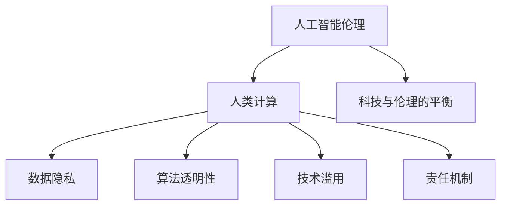

                 

# 科技与伦理的平衡点：人类计算的伦理

> 关键词：人工智能伦理,人类计算,数据隐私,算法透明性,技术滥用,责任机制

## 1. 背景介绍

### 1.1 问题由来
随着人工智能（AI）技术的飞速发展，尤其是深度学习、大数据和自然语言处理等技术的突破，人类计算的伦理问题变得越来越突出。人工智能不仅在技术层面带来诸多挑战，如数据隐私、算法透明性和技术滥用等，还引发了关于人类计算角色的深层次思考，即人工智能如何在人类的价值和伦理框架下发挥作用。科技与伦理的平衡点，成为了当前AI领域迫切需要解决的难题。

### 1.2 问题核心关键点
当前，科技与伦理的平衡点主要体现在以下几个方面：

- 数据隐私：如何在确保数据安全与共享之间找到平衡，防止数据滥用和侵犯个人隐私。
- 算法透明性：如何使算法决策过程可解释，避免“黑箱”问题，增强用户信任。
- 技术滥用：如何防止人工智能技术被用于不道德的目的，如虚假信息传播、恶意攻击等。
- 责任机制：如何界定人工智能系统在造成损害时的责任归属，确保公平公正。

这些关键问题不仅关系到AI技术的健康发展，还直接影响到社会的公平、正义和可持续发展。只有科技与伦理并重，才能实现AI技术的全面、健康、和谐发展。

### 1.3 问题研究意义
研究科技与伦理的平衡点，对于推动人工智能技术的负责任应用具有重要意义：

1. 促进技术的公平性。确保人工智能技术服务于全社会，避免数据和算法偏见带来的不公。
2. 增强技术信任度。通过增强算法透明性和可解释性，增强用户对AI技术的信任和接受度。
3. 防范技术滥用。通过建立健全的责任机制，防止AI技术被用于不道德的行为。
4. 推动法规制定。为政府和监管机构提供政策建议，促进AI技术的规范化、法制化应用。
5. 提升人类福祉。确保AI技术在尊重人类伦理和价值观的前提下，推动社会的全面进步。

## 2. 核心概念与联系

### 2.1 核心概念概述

为更好地理解科技与伦理的平衡点，本节将介绍几个密切相关的核心概念：

- 人工智能伦理(AI Ethics)：研究人工智能技术在开发、应用、管理等过程中应遵循的伦理原则和规范。
- 人类计算(Human-Computer Interaction, HCI)：研究人与计算机系统之间的交互，强调技术在人类生活和社会中的角色和影响。
- 数据隐私(Data Privacy)：研究如何保护个人信息，避免未经授权的数据访问和滥用。
- 算法透明性(Algorithm Transparency)：研究算法的决策过程和结果的可解释性，增强用户信任。
- 技术滥用(Technology Misuse)：研究技术被用于不当目的的风险，如虚假信息传播、网络攻击等。
- 责任机制(Liability Mechanism)：研究人工智能系统在造成损害时的责任归属和责任分配问题。

这些核心概念之间的逻辑关系可以通过以下Mermaid流程图来展示：



这个流程图展示了大语言模型的核心概念及其之间的关系：

1. 人工智能伦理研究技术在伦理层面的应用，指导人类计算的伦理框架。
2. 人类计算关注技术在人类生活和社会中的作用，涉及数据隐私、算法透明性、技术滥用和责任机制等方面。
3. 数据隐私、算法透明性、技术滥用和责任机制是技术伦理的重要组成部分，共同构建科技与伦理的平衡点。

这些概念共同构成了人类计算的伦理研究框架，为解决科技与伦理的平衡问题提供了理论和实践的支撑。

## 3. 核心算法原理 & 具体操作步骤
### 3.1 算法原理概述

人工智能伦理的核心算法原理主要涉及以下三个方面：

- 数据隐私保护算法：研究如何通过技术手段保护个人信息，防止数据滥用。
- 算法透明性增强算法：研究如何使算法决策过程可解释，增强用户信任。
- 技术滥用防范算法：研究如何防止人工智能技术被用于不道德的目的。

### 3.2 算法步骤详解

1. **数据隐私保护算法**
   - **数据匿名化**：将敏感数据进行匿名化处理，去除可识别个人身份的信息。
   - **差分隐私**：在数据统计过程中加入噪声，保护个体隐私。
   - **联邦学习**：在分布式环境中，各数据拥有者保留本地数据，仅分享模型参数，确保数据隐私。

2. **算法透明性增强算法**
   - **可解释模型**：使用可解释模型（如决策树、规则模型）替代黑箱模型（如深度学习模型）。
   - **可视化技术**：通过可视化工具展示算法决策过程，增强用户理解。
   - **解释性诊断**：开发解释性诊断工具，揭示算法决策的逻辑和依据。

3. **技术滥用防范算法**
   - **恶意意图检测**：使用机器学习模型检测数据和算法的恶意意图，防止虚假信息传播。
   - **攻击行为监测**：实时监测系统行为，防止恶意攻击和不当使用。
   - **伦理审核机制**：引入伦理专家和用户代表，对算法应用进行伦理审核和监督。

### 3.3 算法优缺点

人工智能伦理的算法具有以下优点：

- 增强用户信任：通过增强算法的透明性和可解释性，增强用户对AI技术的信任和接受度。
- 保护数据隐私：通过数据匿名化和差分隐私等技术手段，保护个人信息，防止数据滥用。
- 防范技术滥用：通过恶意意图检测和攻击行为监测，防止AI技术被用于不道德的目的。

但这些算法也存在一定的局限性：

- 复杂性高：隐私保护和透明性增强算法往往需要复杂的技术手段，实施难度大。
- 数据依赖性强：差分隐私等算法依赖大量数据进行噪声注入，可能影响模型性能。
- 伦理审核成本高：引入伦理专家和用户代表进行伦理审核，成本较高，且存在主观性。

尽管存在这些局限性，但就目前而言，这些算法是实现人工智能伦理的关键手段，需要不断改进和优化，以应对不断变化的伦理挑战。

### 3.4 算法应用领域

人工智能伦理的算法广泛应用于以下领域：

- 医疗领域：保护患者隐私，确保医疗数据安全；提升算法透明性，增强患者信任。
- 金融领域：保护用户数据隐私，防止金融欺诈；增强算法透明性，防范算法滥用。
- 公共安全领域：保护个人隐私，防止监控滥用；增强算法透明性，增强公众信任。
- 教育领域：保护学生隐私，防止数据滥用；增强算法透明性，促进教育公平。
- 社交媒体领域：保护用户隐私，防止虚假信息传播；增强算法透明性，防范恶意攻击。

除了上述这些领域，人工智能伦理的算法还在更多领域得到广泛应用，为社会进步提供了有力的技术支撑。

## 4. 数学模型和公式 & 详细讲解 & 举例说明

### 4.1 数学模型构建

本节将使用数学语言对人工智能伦理的核心算法进行更加严格的刻画。

假设数据集为 $D=\{(x_i, y_i)\}_{i=1}^N$，其中 $x_i$ 为输入特征，$y_i$ 为标签。定义算法的隐私保护度 $\epsilon$，表示在统计过程中注入的噪声量。

隐私保护算法的目标是最小化模型在数据集上的损失函数 $L(\theta)$，同时满足隐私保护度 $\epsilon$ 的要求。具体而言，差分隐私算法的损失函数可以表示为：

$$
L(\theta) = \frac{1}{N}\sum_{i=1}^N \ell(y_i, \hat{y}(x_i))
$$

其中 $\ell$ 为损失函数，$\hat{y}(x_i)$ 为模型预测的输出。

### 4.2 公式推导过程

以差分隐私算法为例，我们推导其隐私保护度的计算公式。

差分隐私算法通过在模型预测过程中加入噪声，保护数据隐私。设噪声的分布为 $\mathcal{N}(0,\sigma^2)$，则加入噪声后的模型预测为：

$$
\hat{y}(x_i) = f_{\theta}(x_i) + \mathcal{N}(0,\sigma^2)
$$

其中 $f_{\theta}(x_i)$ 为模型在输入 $x_i$ 上的预测函数。

定义模型在数据集 $D$ 上的经验风险为 $R(\theta)$，则差分隐私算法的隐私保护度 $\epsilon$ 可以表示为：

$$
\epsilon = \max_{x' \in \mathcal{X}} \frac{1}{N} \sum_{i=1}^N e^{-\Delta f_{\theta}(x_i, x')}
$$

其中 $\Delta f_{\theta}(x_i, x')$ 为模型在不同输入 $x_i$ 和 $x'$ 上的预测差异。

通过差分隐私算法，可以在保证数据隐私的前提下，最小化模型损失函数 $L(\theta)$。具体来说，可以引入拉普拉斯噪声，计算隐私保护度的期望：

$$
L(\theta) = \frac{1}{N}\sum_{i=1}^N \ell(y_i, f_{\theta}(x_i) + \lambda L(1 + \frac{\Delta f_{\theta}(x_i)}{\sigma})
$$

其中 $\lambda$ 为拉普拉斯噪声强度，$\Delta f_{\theta}(x_i)$ 为模型在不同输入 $x_i$ 上的预测差异。

### 4.3 案例分析与讲解

假设某电商平台希望保护用户隐私，防止数据滥用。用户历史购买记录 $D=\{(x_i, y_i)\}_{i=1}^N$ 包含商品ID和购买时间等信息，其中 $x_i$ 为商品ID，$y_i$ 为购买时间。平台希望使用机器学习模型预测用户未来的购买行为。

首先，对用户购买记录进行差分隐私处理，引入拉普拉斯噪声，确保用户隐私不被泄露。其次，使用模型 $f_{\theta}(x_i) = \theta_1 f(x_i) + \theta_2$ 对用户行为进行预测，其中 $f(x_i)$ 为特征提取函数，$\theta_1, \theta_2$ 为模型参数。

定义模型在数据集 $D$ 上的损失函数为：

$$
L(\theta) = \frac{1}{N}\sum_{i=1}^N \ell(y_i, f_{\theta}(x_i))
$$

其中 $\ell$ 为交叉熵损失函数。

在差分隐私保护下，模型损失函数为：

$$
L(\theta) = \frac{1}{N}\sum_{i=1}^N \ell(y_i, f_{\theta}(x_i) + \lambda L(1 + \frac{\Delta f_{\theta}(x_i)}{\sigma}))
$$

通过优化上述模型，平台可以在保护用户隐私的同时，提升模型预测性能，防止数据滥用。

## 5. 项目实践：代码实例和详细解释说明

### 5.1 开发环境搭建

在进行人工智能伦理的算法实践前，我们需要准备好开发环境。以下是使用Python进行PyTorch开发的环境配置流程：

1. 安装Anaconda：从官网下载并安装Anaconda，用于创建独立的Python环境。

2. 创建并激活虚拟环境：
```bash
conda create -n pytorch-env python=3.8 
conda activate pytorch-env
```

3. 安装PyTorch：根据CUDA版本，从官网获取对应的安装命令。例如：
```bash
conda install pytorch torchvision torchaudio cudatoolkit=11.1 -c pytorch -c conda-forge
```

4. 安装各类工具包：
```bash
pip install numpy pandas scikit-learn matplotlib tqdm jupyter notebook ipython
```

完成上述步骤后，即可在`pytorch-env`环境中开始人工智能伦理的算法实践。

### 5.2 源代码详细实现

这里我们以差分隐私算法为例，给出使用PyTorch实现的完整代码：

```python
import torch
import torch.nn as nn
import torch.optim as optim
from torch.utils.data import DataLoader
from sklearn.datasets import load_breast_cancer
from sklearn.model_selection import train_test_split
from torch.utils.data import TensorDataset

# 加载数据集
data = load_breast_cancer()
X_train, X_test, y_train, y_test = train_test_split(data.data, data.target, test_size=0.2, random_state=42)

# 构建模型
class Model(nn.Module):
    def __init__(self):
        super(Model, self).__init__()
        self.fc1 = nn.Linear(30, 15)
        self.fc2 = nn.Linear(15, 1)
    
    def forward(self, x):
        x = nn.functional.relu(self.fc1(x))
        x = self.fc2(x)
        return x

# 训练模型
model = Model()
criterion = nn.BCELoss()
optimizer = optim.Adam(model.parameters())

# 差分隐私处理
def laplace_noise(mu, sigma):
    epsilon = 1.0
    delta = 0.1
    sigma_eff = 2 * sigma * epsilon / delta
    return torch.tensor(mu + torch.randn_like(mu) * sigma_eff, dtype=torch.float)

X_train_noisy = laplace_noise(X_train, 0.1)
X_test_noisy = laplace_noise(X_test, 0.1)

# 训练差分隐私保护模型
for epoch in range(10):
    for i in range(len(X_train_noisy)):
        optimizer.zero_grad()
        y_hat = model(X_train_noisy[i])
        loss = criterion(y_hat, y_train[i])
        loss.backward()
        optimizer.step()

# 评估模型性能
with torch.no_grad():
    y_hat = model(X_test_noisy)
    y_pred = torch.round(y_hat)
    accuracy = (y_pred == y_test).mean().item()
    print("Accuracy: {:.2f}%".format(accuracy * 100))
```

### 5.3 代码解读与分析

这里我们详细解读一下关键代码的实现细节：

- `laplace_noise`函数：实现差分隐私保护，在输入数据中添加拉普拉斯噪声，确保数据隐私。
- `Model`类：定义神经网络模型，使用两个全连接层进行特征提取和分类。
- `optimizer`对象：使用Adam优化器更新模型参数。
- 训练模型：在训练过程中，对输入数据进行差分隐私处理，并在模型上进行前向传播和反向传播，更新模型参数。
- 模型评估：在测试集上评估模型性能，计算准确率。

## 6. 实际应用场景

### 6.1 医疗领域

在医疗领域，人工智能伦理的算法可以应用于电子病历保护、隐私数据处理和算法透明性增强等方面。

- **电子病历保护**：通过差分隐私算法保护患者隐私，防止医疗数据被滥用。
- **隐私数据处理**：使用匿名化技术处理敏感数据，确保数据安全。
- **算法透明性增强**：通过可视化工具展示算法决策过程，增强患者信任。

例如，某医院使用深度学习模型对患者的疾病进行预测和治疗方案推荐。模型在训练过程中，对电子病历进行差分隐私处理，确保患者隐私不被泄露。同时，通过可视化工具展示模型的决策过程，增强患者对治疗方案的信任和理解。

### 6.2 金融领域

在金融领域，人工智能伦理的算法可以应用于用户隐私保护、算法透明性和技术滥用防范等方面。

- **用户隐私保护**：通过差分隐私算法保护用户数据隐私，防止金融欺诈。
- **算法透明性增强**：通过可视化工具展示算法决策过程，增强用户信任。
- **技术滥用防范**：使用恶意意图检测技术，防止虚假信息传播。

例如，某金融公司使用深度学习模型预测用户的信用评分。模型在训练过程中，对用户数据进行差分隐私处理，确保用户隐私不被滥用。同时，通过可视化工具展示模型决策过程，增强用户对信用评分的信任。

### 6.3 公共安全领域

在公共安全领域，人工智能伦理的算法可以应用于监控视频保护、隐私数据处理和算法透明性增强等方面。

- **监控视频保护**：通过差分隐私算法保护监控视频隐私，防止监控滥用。
- **隐私数据处理**：使用匿名化技术处理敏感数据，确保数据安全。
- **算法透明性增强**：通过可视化工具展示算法决策过程，增强公众信任。

例如，某城市使用深度学习模型对公共安全事件进行监测和预警。模型在训练过程中，对监控视频进行差分隐私处理，确保视频隐私不被滥用。同时，通过可视化工具展示模型决策过程，增强公众对公共安全事件的信任。

## 7. 工具和资源推荐

### 7.1 学习资源推荐

为了帮助开发者系统掌握人工智能伦理的理论基础和实践技巧，这里推荐一些优质的学习资源：

1. 《人工智能伦理》系列博文：由大模型技术专家撰写，深入浅出地介绍了人工智能伦理的核心概念和前沿话题。

2. 《人工智能伦理与法律》课程：斯坦福大学开设的AI伦理与法律课程，涵盖人工智能伦理的基础知识、法律法规和实际案例。

3. 《人工智能伦理：科技与人类》书籍：著名AI伦理专家所著，全面介绍了人工智能伦理的理论基础和实际应用，是了解人工智能伦理的入门读物。

4. IEEE Computer Society：提供大量AI伦理相关的论文、会议和标准，是研究人工智能伦理的重要资源。

5. Kaggle竞赛：参与AI伦理相关的竞赛，通过实际项目提升解决人工智能伦理问题的能力。

通过对这些资源的学习实践，相信你一定能够快速掌握人工智能伦理的精髓，并用于解决实际的AI伦理问题。

### 7.2 开发工具推荐

高效的开发离不开优秀的工具支持。以下是几款用于人工智能伦理算法开发的常用工具：

1. PyTorch：基于Python的开源深度学习框架，灵活动态的计算图，适合快速迭代研究。大部分预训练语言模型都有PyTorch版本的实现。

2. TensorFlow：由Google主导开发的开源深度学习框架，生产部署方便，适合大规模工程应用。同样有丰富的预训练语言模型资源。

3. Scikit-learn：Python数据科学库，提供多种数据处理和模型训练工具，适合基础研究和实际应用。

4. Weights & Biases：模型训练的实验跟踪工具，可以记录和可视化模型训练过程中的各项指标，方便对比和调优。与主流深度学习框架无缝集成。

5. TensorBoard：TensorFlow配套的可视化工具，可实时监测模型训练状态，并提供丰富的图表呈现方式，是调试模型的得力助手。

6. Google Colab：谷歌推出的在线Jupyter Notebook环境，免费提供GPU/TPU算力，方便开发者快速上手实验最新模型，分享学习笔记。

合理利用这些工具，可以显著提升人工智能伦理算法开发的效率，加快创新迭代的步伐。

### 7.3 相关论文推荐

人工智能伦理的研究源于学界的持续研究。以下是几篇奠基性的相关论文，推荐阅读：

1. "Ethical Deep Learning: A Survey of the Landscape"：详细介绍了人工智能伦理的研究现状和未来方向，涵盖隐私保护、透明性增强、责任机制等方面。

2. "Adversarial Robustness: A New Perspective on Intrusion Detection"：讨论了AI系统对抗攻击的脆弱性，提出了提高系统鲁棒性的新思路。

3. "AI Fairness, Accountability, and Transparency: An Introduction"：介绍AI伦理的基本原则和重要概念，为研究人工智能伦理提供了理论基础。

4. "The Moral Landscape of Machine Learning"：探讨了AI伦理的多维视角，包括数据隐私、算法透明性和技术滥用等方面。

5. "Human-AI Collaboration"：讨论了人类计算在AI伦理中的角色和挑战，强调了AI系统的公平性和可解释性。

这些论文代表了大语言模型伦理的研究方向，通过学习这些前沿成果，可以帮助研究者把握学科前进方向，激发更多的创新灵感。

## 8. 总结：未来发展趋势与挑战

### 8.1 总结

本文对人工智能伦理的核心算法进行了全面系统的介绍。首先阐述了人工智能伦理的研究背景和意义，明确了数据隐私、算法透明性、技术滥用和责任机制等关键问题，探讨了科技与伦理的平衡点。其次，从原理到实践，详细讲解了隐私保护、透明性增强、技术滥用防范等核心算法的数学模型和实现细节。最后，介绍了这些算法在医疗、金融、公共安全等领域的实际应用，展示了人工智能伦理的广阔前景。

通过本文的系统梳理，可以看到，人工智能伦理的核心算法正在成为AI技术应用的重要保障，为实现科技与伦理的平衡提供了关键手段。尽管仍面临诸多挑战，但未来的发展方向明确，不断改进和优化这些算法，必将推动人工智能技术的全面、健康、和谐发展。

### 8.2 未来发展趋势

展望未来，人工智能伦理的核心算法将呈现以下几个发展趋势：

1. 数据隐私保护技术进一步完善。随着隐私保护技术的发展，数据隐私保护的算法将更加高效和可靠，确保数据的安全共享。

2. 算法透明性增强技术日趋成熟。通过可解释模型、可视化技术和解释性诊断工具，增强算法透明性，增强用户信任。

3. 技术滥用防范机制逐步建立。通过恶意意图检测、攻击行为监测和伦理审核机制，防止AI技术被用于不道德的目的，确保技术应用的公平性和正义性。

4. 伦理审核机制更加完善。引入多学科专家和用户代表，建立科学的伦理审核机制，确保AI技术的伦理合规性。

5. 跨领域伦理应用拓展。将伦理原则和方法应用于更多领域，如教育、政府、军事等，推动AI技术的全面发展。

以上趋势凸显了人工智能伦理的核心算法的广阔前景。这些方向的探索发展，必将进一步提升AI技术的可靠性、公平性和安全性，为构建安全、可靠、可解释、可控的智能系统提供技术保障。

### 8.3 面临的挑战

尽管人工智能伦理的核心算法已经取得了一定的进展，但在迈向更加智能化、普适化应用的过程中，仍面临诸多挑战：

1. 隐私保护技术复杂度高。隐私保护算法往往需要复杂的技术手段，实施难度大，且可能影响模型性能。

2. 算法透明性提升有限。可解释模型在复杂任务上的表现仍需改进，可视化技术对用户理解的提升有限。

3. 技术滥用防范困难。恶意意图检测和攻击行为监测技术仍需不断完善，伦理审核成本高。

4. 伦理审核主观性强。伦理审核机制存在主观性，可能影响评估结果的公正性。

5. 跨领域应用复杂。不同领域的伦理标准和原则不同，伦理审核和监管机制需要适应多变的需求。

正视人工智能伦理核心算法面临的这些挑战，积极应对并寻求突破，将是大语言模型伦理走向成熟的必由之路。相信随着学界和产业界的共同努力，这些挑战终将一一被克服，人工智能伦理的核心算法必将在构建安全、可靠、可解释、可控的智能系统中扮演越来越重要的角色。

### 8.4 研究展望

面对人工智能伦理核心算法面临的诸多挑战，未来的研究需要在以下几个方面寻求新的突破：

1. 探索更加高效、安全的隐私保护算法。结合差分隐私、联邦学习等技术，开发更加安全、高效的隐私保护算法。

2. 提升算法的透明性和可解释性。开发新的可解释模型和可视化技术，增强算法透明性，提高用户信任度。

3. 建立全面的技术滥用防范机制。结合机器学习、博弈论等技术，构建全面的技术滥用防范体系。

4. 制定统一的伦理审核标准。引入多学科专家和用户代表，制定统一的伦理审核标准，确保AI技术的伦理合规性。

5. 推动跨领域伦理应用研究。将伦理原则和方法应用于更多领域，推动AI技术的全面发展。

这些研究方向将为人工智能伦理核心算法的不断进步提供新的思路和方法，推动人工智能技术在更加负责任、公平、安全的轨道上发展。面向未来，人工智能伦理核心算法的不断改进和优化，必将在构建安全、可靠、可解释、可控的智能系统方面发挥重要作用。

## 9. 附录：常见问题与解答

**Q1：数据隐私保护与技术发展之间的平衡如何实现？**

A: 实现数据隐私保护与技术发展的平衡，关键在于采用科学合理的隐私保护算法和技术手段。差分隐私、联邦学习、匿名化等隐私保护技术可以有效保护用户隐私，同时确保数据的安全共享。

**Q2：如何评估算法的透明性和可解释性？**

A: 评估算法的透明性和可解释性，可以采用以下方法：
- 可解释模型：使用可解释模型（如决策树、规则模型）替代黑箱模型（如深度学习模型）。
- 可视化技术：通过可视化工具展示算法决策过程，增强用户理解。
- 解释性诊断：开发解释性诊断工具，揭示算法决策的逻辑和依据。

**Q3：技术滥用防范的难点在哪里？**

A: 技术滥用防范的难点在于恶意意图检测和攻击行为监测技术的复杂性和不确定性。需要结合机器学习、博弈论等技术，不断完善技术滥用防范机制，确保AI技术的公平性和正义性。

**Q4：伦理审核机制如何保证公平性？**

A: 伦理审核机制的公平性需要引入多学科专家和用户代表，建立科学的伦理审核标准，确保审核结果的公正性。同时，需要不断完善伦理审核机制，确保其适应多变的需求。

**Q5：如何推动跨领域伦理应用研究？**

A: 推动跨领域伦理应用研究，需要制定统一的伦理审核标准，引入多学科专家和用户代表，建立科学的伦理审核机制。同时，需要结合不同领域的伦理标准和原则，开发适应不同场景的伦理审核技术，推动AI技术的全面发展。

---

作者：禅与计算机程序设计艺术 / Zen and the Art of Computer Programming

