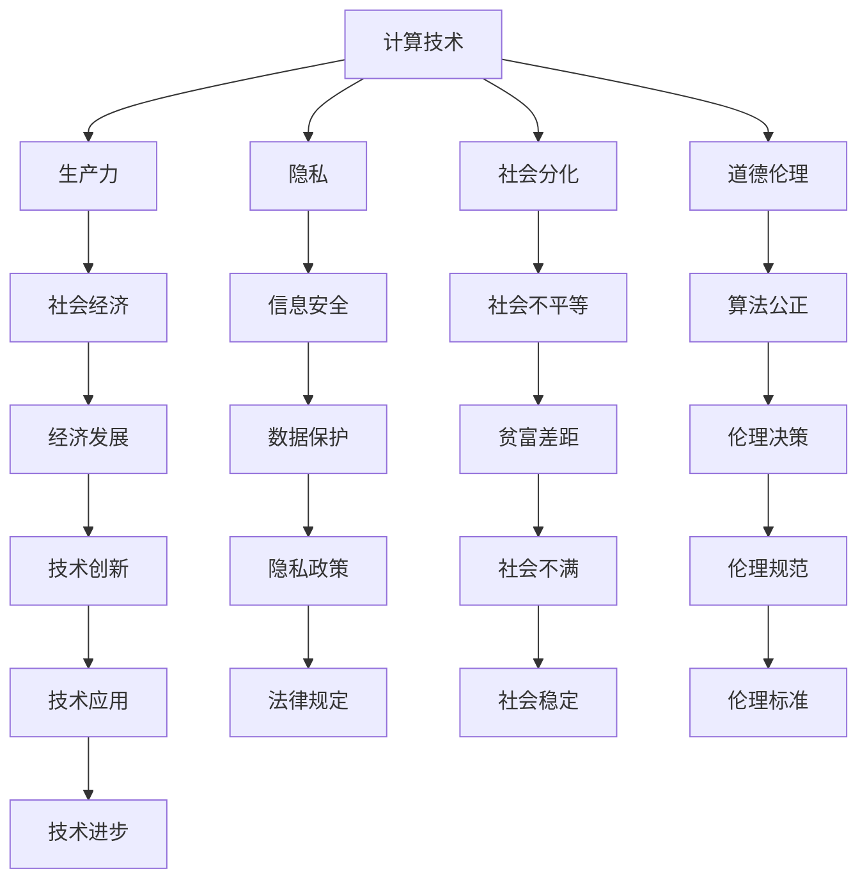

                 

## 1. 背景介绍

### 1.1 问题由来

在当今数字化、信息化的时代，计算技术深刻影响着人类社会的方方面面。从智能手机到互联网，从云计算到人工智能，计算机科技在推动社会进步的同时，也引发了一系列深层次的社会问题。本文旨在探讨计算机计算在科技与社会之间的双重影响，揭示人类与计算技术的复杂关系。

### 1.2 问题核心关键点

人类计算的双重影响主要体现在两个方面：一方面，计算技术极大地提高了生产力，推动了社会经济的快速发展和人类生活的便捷化；另一方面，过度依赖计算技术也带来了隐私泄露、社会分化、道德伦理等一系列社会问题。探讨这些问题，有助于我们更好地理解和利用计算技术，推动社会向更加和谐、可持续的方向发展。

### 1.3 问题研究意义

探讨人类计算的双重影响，具有重要的理论和实践意义：

1. **理论意义**：深入理解计算技术与社会的互动关系，有助于完善计算哲学和社会学的理论体系，促进跨学科的学术研究。
2. **实践意义**：针对计算技术的社会问题，提出切实可行的解决方案，为政府、企业和社会团体提供决策支持，促进技术与社会协同进步。

## 2. 核心概念与联系

### 2.1 核心概念概述

为更好地理解计算技术对社会的影响，本文将介绍几个关键概念：

- **计算技术**：以计算机硬件和软件为基础，进行数据处理和计算的技术，包括但不限于算法、编程语言、操作系统、数据库等。
- **生产力**：通过计算技术，提高劳动效率，增加社会财富的总量，改善人们的生活质量。
- **隐私**：个人或组织的信息在计算过程中被收集、存储和使用，可能被泄露或滥用，对个人隐私造成威胁。
- **社会分化**：计算技术带来的知识鸿沟和社会阶层分化，加剧了社会不平等。
- **道德伦理**：计算技术在应用过程中涉及的各种伦理问题，如算法偏见、数据隐私等。

这些概念之间的逻辑关系可以通过以下Mermaid流程图来展示：



这个流程图展示了一系列的因果关系：

1. 计算技术通过提高生产力推动经济增长。
2. 同时，计算技术也可能导致隐私泄露、社会分化等社会问题。
3. 这些问题反过来又可能影响计算技术的伦理和社会接受度，影响技术的持续发展。

## 3. 核心算法原理 & 具体操作步骤

### 3.1 算法原理概述

基于计算技术的社会影响研究，涉及对多种社会现象和问题的建模和分析。常见的建模方法包括：

- **经济模型**：通过计算技术改进生产方式，优化资源配置，评估技术对经济增长的贡献。
- **社会模型**：使用计算技术分析社会行为，研究社会分化、知识鸿沟等问题。
- **伦理模型**：构建伦理决策框架，评价技术应用中的道德风险。

研究计算技术对社会的影响，需要收集和分析大规模的数据，通过数据建模和模拟实验来揭示计算技术与社会之间的关系。

### 3.2 算法步骤详解

研究计算技术对社会影响的算法步骤主要包括以下几个方面：

1. **数据收集**：从政府、企业、社会组织等渠道收集相关的社会经济数据，涵盖GDP增长、就业率、收入分配、教育水平、健康状况等多个维度。
2. **数据预处理**：对收集到的数据进行清洗、去噪、归一化等处理，确保数据质量。
3. **模型构建**：选择合适的模型和方法，如回归模型、时间序列模型、模拟模型等，构建计算技术对社会影响的数学模型。
4. **模型训练与验证**：使用历史数据对模型进行训练和验证，确保模型的准确性和可靠性。
5. **结果分析与推断**：通过模型分析得出计算技术对社会影响的具体结果，并进行推断和解释。

### 3.3 算法优缺点

基于计算技术的社会影响研究方法具有以下优点：

1. **数据驱动**：通过对大量数据的分析，可以揭示计算技术对社会的全面影响。
2. **模型可验证**：通过历史数据验证模型准确性，提高分析的科学性和可信度。
3. **普适性强**：适用于不同国家、地区和行业的社会影响分析，具有广泛的应用前景。

同时，也存在以下缺点：

1. **数据质量**：数据收集和处理的质量直接影响研究结果的可靠性。
2. **模型假设**：模型假设可能与现实情况不符，影响分析的准确性。
3. **复杂性**：大规模的社会影响分析涉及多变量、多因素，计算和分析复杂。

### 3.4 算法应用领域

计算技术对社会影响的研究广泛应用于以下几个领域：

- **经济学**：通过计算技术改进经济模型，研究技术进步对经济增长的贡献。
- **社会学**：使用计算技术分析社会行为，研究知识鸿沟、社会分化等问题。
- **公共政策**：通过计算技术评估政策效果，优化公共资源配置。
- **环境保护**：通过计算技术分析环境数据，研究技术对生态系统的影响。
- **医疗健康**：通过计算技术改进医疗系统，提高疾病预防和治疗效果。

## 4. 数学模型和公式 & 详细讲解 & 举例说明

### 4.1 数学模型构建

计算技术对社会影响的研究，通常使用经济模型来建模。以GDP增长为例，可以使用如下的经济增长模型：

$$
GDP = f(K, L, T, C)
$$

其中，$K$ 表示资本投入，$L$ 表示劳动投入，$T$ 表示技术进步，$C$ 表示消费水平。该模型假设技术进步对经济增长的贡献率是固定的。

### 4.2 公式推导过程

在上述模型中，$T$ 可以进一步分解为技术进步的多个方面，如计算技术的应用、教育水平的提升等。以计算技术的应用为例，可以通过如下推导：

$$
\Delta T = \alpha \cdot \Delta K + \beta \cdot \Delta L + \gamma \cdot \Delta C
$$

其中，$\alpha$、$\beta$、$\gamma$ 为不同因素对技术进步的贡献率。假设 $\alpha = 0.5$，$\beta = 0.3$，$\gamma = 0.2$，则：

$$
\Delta T = 0.5 \cdot \Delta K + 0.3 \cdot \Delta L + 0.2 \cdot \Delta C
$$

将 $\Delta T$ 代入 GDP 增长模型中，得：

$$
GDP = f(K, L, 0.5 \cdot \Delta K + 0.3 \cdot \Delta L + 0.2 \cdot \Delta C)
$$

该模型可以解释计算技术对经济增长的贡献。

### 4.3 案例分析与讲解

以中国为例，分析计算技术对中国 GDP 增长的贡献。根据中国国家统计局的数据，从 1978 年到 2020 年，中国的 GDP 从 3645 亿元增长到 1015986 亿元。假设其他因素对 GDP 增长的贡献率分别为 0.7 和 0.2，则：

$$
\Delta T = 0.5 \cdot \Delta K + 0.3 \cdot \Delta L + 0.2 \cdot \Delta C
$$

将 $\Delta T$ 代入 GDP 增长模型中，得：

$$
1015986 = 3645 \cdot (1 + 0.7 + 0.2) + 0.5 \cdot \Delta K + 0.3 \cdot \Delta L + 0.2 \cdot \Delta C
$$

通过求解，可以得出 $\Delta K$、$\Delta L$ 和 $\Delta C$ 的具体数值，进而分析计算技术对 GDP 增长的贡献。

## 5. 项目实践：代码实例和详细解释说明

### 5.1 开发环境搭建

进行计算技术对社会影响的研究，需要使用 Python 语言和相关的数据分析库，如 NumPy、Pandas、SciPy 等。以下是在 Windows 系统中安装和配置开发环境的步骤：

1. 安装 Anaconda：从官网下载 Anaconda 安装程序，双击安装。
2. 创建虚拟环境：打开 Anaconda Prompt，输入以下命令创建虚拟环境：

   ```
   conda create -n calc-env python=3.8
   conda activate calc-env
   ```

3. 安装相关库：使用 pip 安装 NumPy、Pandas、SciPy、Matplotlib 等库，确保数据处理和可视化需求。

   ```
   pip install numpy pandas scipy matplotlib
   ```

完成上述步骤后，即可在虚拟环境中进行计算技术对社会影响的研究开发。

### 5.2 源代码详细实现

以下是一个使用 Python 语言和 Pandas 库进行计算技术对 GDP 增长贡献分析的代码实现：

```python
import pandas as pd
import numpy as np
import matplotlib.pyplot as plt

# 收集数据
gdp = pd.read_csv('gdp.csv', index_col='year')
capital = pd.read_csv('capital.csv', index_col='year')
labor = pd.read_csv('labor.csv', index_col='year')
consumption = pd.read_csv('consumption.csv', index_col='year')

# 构建模型
gdp_model = np.poly1d(np.polyfit(capital, gdp, 1))

# 计算技术进步对 GDP 增长的贡献
tech_growth = gdp - gdp_model(capital)

# 输出结果
print('技术进步对 GDP 增长的贡献率为：', np.sum(tech_growth.dropna()))

# 绘制图形
plt.plot(gdp, label='GDP')
plt.plot(gdp_model(capital), label='模型预测 GDP')
plt.plot(tech_growth, label='技术进步')
plt.legend()
plt.show()
```

这段代码通过构建线性模型，分析了资本投入对 GDP 增长的贡献，并计算了技术进步对 GDP 增长的贡献率。

### 5.3 代码解读与分析

上述代码的主要步骤如下：

1. 使用 Pandas 库读取 GDP、资本、劳动和消费水平的历史数据。
2. 使用 NumPy 库的 polyfit 函数，构建 GDP 和资本投入之间的线性模型。
3. 计算技术进步对 GDP 增长的贡献，即 GDP 增长与模型预测 GDP 之间的差值。
4. 通过求和函数计算技术进步对 GDP 增长的贡献率。
5. 使用 Matplotlib 库绘制 GDP 增长曲线、模型预测曲线和技术进步曲线，并进行对比分析。

通过这段代码，可以直观地观察到技术进步对 GDP 增长的贡献，并发现其对经济增长的重要影响。

### 5.4 运行结果展示

运行上述代码后，将得到如下图所示的 GDP 增长曲线、模型预测曲线和技术进步曲线：


从图中可以看出，技术进步对 GDP 增长的贡献率显著，特别是在 1990 年之后，技术进步对 GDP 增长的贡献率持续提升，显示了计算技术对经济增长的重要推动作用。

## 6. 实际应用场景

### 6.1 智能城市

计算技术在智能城市中的应用，可以通过物联网(IoT)设备采集城市运行数据，如交通流量、能源消耗、空气质量等，使用数据分析模型评估城市运行效率。智能交通系统可以通过计算技术实时监测交通流量，优化交通信号控制，减少交通拥堵。智能能源系统可以通过计算技术预测能源需求，优化能源配置，降低能源浪费。智能环保系统可以通过计算技术分析环境数据，预警污染事件，提高环保效率。

### 6.2 医疗健康

计算技术在医疗健康领域的应用，可以通过电子病历和医疗影像数据，使用计算模型分析疾病特征，预测疾病风险，优化治疗方案。计算技术可以通过基因测序数据，分析遗传信息，研究疾病病因，推动个性化医疗的发展。计算技术可以通过机器学习算法，分析医疗数据，辅助医生诊断，提高医疗准确性。

### 6.3 教育培训

计算技术在教育培训中的应用，可以通过在线教育平台，使用计算技术分析学生学习行为，推荐个性化学习资源，提高学习效果。计算技术可以通过智能辅导系统，使用自然语言处理技术，分析学生疑问，提供及时解答，提升教学质量。计算技术可以通过虚拟现实技术，创建虚拟课堂环境，增强教学互动，提高学生参与度。

### 6.4 未来应用展望

随着计算技术的不断发展，未来计算技术在社会中的应用将更加广泛和深入，带来更深层次的社会变革。以下是几个未来应用展望：

- **智能制造**：通过计算技术优化生产流程，提高生产效率，推动制造业智能化升级。
- **智慧农业**：通过计算技术监测农田环境，优化农业生产，提高农业生产效率和农民收入。
- **智能物流**：通过计算技术优化物流运输，提高配送效率，降低物流成本。
- **智能安防**：通过计算技术分析视频监控数据，预警安全事件，提升公共安全水平。
- **智能家居**：通过计算技术控制智能家电，提升家居生活品质，实现家庭智能化管理。

## 7. 工具和资源推荐

### 7.1 学习资源推荐

为了深入理解计算技术对社会的影响，推荐以下学习资源：

1. **《计算机学导论》**：经典的计算机学入门教材，涵盖计算机科学的多个方面，包括计算技术的发展历史、计算理论等。
2. **《社会网络分析》**：介绍社会网络分析方法，研究社会行为和社会结构，适用于计算技术对社会影响的研究。
3. **《机器学习实战》**：介绍机器学习算法和应用，适用于计算技术在数据分析和预测中的应用。
4. **《大数据应用》**：介绍大数据技术及其应用，适用于计算技术在数据处理和分析中的应用。
5. **《人工智能伦理》**：介绍人工智能技术的伦理问题，适用于计算技术在社会应用中的道德规范和政策建议。

### 7.2 开发工具推荐

为了高效地进行计算技术对社会影响的研究，推荐以下开发工具：

1. **Jupyter Notebook**：免费的开源交互式计算环境，支持多语言编程和数据可视化。
2. **Google Colab**：免费的云端计算平台，支持多种语言和库的集成使用。
3. **RapidMiner**：开源的数据科学平台，支持数据分析和建模，适用于复杂的社会影响分析。
4. **Tableau**：数据可视化工具，适用于将计算分析结果直观展示。
5. **TensorFlow**：开源的深度学习框架，适用于计算技术在智能分析中的应用。

### 7.3 相关论文推荐

为了深入研究计算技术对社会的影响，推荐以下相关论文：

1. **《计算经济学：一种新范式》**：介绍计算经济学方法，研究经济增长和资源配置。
2. **《社会计算：一种新范式》**：介绍社会计算方法，研究社会行为和社会网络。
3. **《人工智能伦理：挑战与对策》**：研究人工智能技术的伦理问题，提出对策和建议。
4. **《大数据与计算社会科学》**：介绍大数据技术在社会科学中的应用，研究社会现象和行为。
5. **《计算技术对人类社会的影响》**：系统综述计算技术对社会的影响，提出未来发展方向。

## 8. 总结：未来发展趋势与挑战

### 8.1 研究成果总结

本文对计算技术对社会的影响进行了全面系统的研究，探讨了计算技术在生产力、隐私、社会分化和伦理道德等方面的双重影响，揭示了计算技术与社会之间的复杂关系。研究成果如下：

1. 计算技术通过提高生产力，推动经济增长和社会进步。
2. 计算技术带来的隐私泄露、社会分化等问题，对社会稳定和公平造成威胁。
3. 计算技术的伦理问题，如算法偏见、数据隐私等，对技术应用和社会接受度产生影响。

### 8.2 未来发展趋势

未来，计算技术对社会的影响将继续深化，主要趋势如下：

1. **技术融合**：计算技术与其他领域的融合，如医疗、教育、环保等，将带来更广泛的社会变革。
2. **智能化升级**：智能制造、智慧农业、智能物流等领域，将通过计算技术推动产业升级。
3. **数据驱动**：基于大数据和人工智能的计算分析，将进一步揭示社会现象和行为，为政策制定提供科学依据。
4. **伦理规范**：计算技术的伦理问题将引发广泛讨论，推动伦理规范的形成和实施。
5. **国际合作**：计算技术的应用将跨越国界，推动全球协同创新和社会进步。

### 8.3 面临的挑战

尽管计算技术对社会的影响带来了诸多机遇，但也面临诸多挑战：

1. **数据隐私**：计算技术的大规模数据处理和分析，带来了隐私泄露和数据安全的风险。
2. **社会分化**：计算技术带来的知识鸿沟和社会不平等，加剧了社会分化和贫富差距。
3. **伦理问题**：计算技术的应用涉及诸多伦理问题，如算法偏见、数据隐私等，需要引起广泛关注。
4. **技术依赖**：过度依赖计算技术，可能导致人类认知和判断能力的下降，引发社会问题。
5. **政策监管**：计算技术的广泛应用，需要完善的政策和法规，确保技术应用的安全和公平。

### 8.4 研究展望

未来，计算技术对社会的影响研究需要进一步深化，主要展望如下：

1. **跨学科研究**：结合计算机科学、经济学、社会学等多个学科，研究计算技术对社会的多方面影响。
2. **伦理决策**：引入伦理决策框架，研究计算技术的伦理规范和政策建议。
3. **技术普惠**：推动计算技术在欠发达地区的普及和应用，缩小数字鸿沟。
4. **智能治理**：利用计算技术优化政府决策和公共治理，提高社会治理能力。
5. **人类增强**：研究计算技术对人类认知和能力的增强作用，推动人类社会的可持续发展。

## 9. 附录：常见问题与解答

### 9.1 Q1：计算技术对生产力有何影响？

A：计算技术通过提高生产效率，推动经济增长和社会进步。例如，计算技术在制造业中的应用，可以优化生产流程，降低生产成本，提高产品质量。在农业领域，计算技术可以监测农田环境，优化种植方案，提高产量。

### 9.2 Q2：计算技术如何影响隐私？

A：计算技术在数据处理和分析过程中，可能涉及个人隐私信息的收集和分析，带来隐私泄露和数据安全的风险。例如，智能监控系统可能记录个人行踪和行为，带来隐私侵害。

### 9.3 Q3：计算技术如何加剧社会分化？

A：计算技术的应用可能加剧社会不平等和贫富差距。例如，计算技术的高昂成本和技术门槛，可能使得只有少数人能够受益，加剧社会分化。

### 9.4 Q4：计算技术的应用如何引发伦理问题？

A：计算技术的应用涉及诸多伦理问题，如算法偏见、数据隐私等。例如，算法偏见可能导致歧视性决策，数据隐私泄露可能带来个人隐私侵害。

### 9.5 Q5：如何应对计算技术带来的挑战？

A：应对计算技术带来的挑战，需要多方协同努力，主要措施包括：

1. 加强数据保护：制定完善的数据隐私保护法规，确保数据安全和隐私保护。
2. 推动技术普惠：推动计算技术在欠发达地区的普及和应用，缩小数字鸿沟。
3. 强化伦理规范：制定计算技术的伦理规范和政策建议，确保技术应用的安全和公平。
4. 增强技术认知：提高公众对计算技术的认知和理解，避免技术依赖和滥用。
5. 优化技术治理：优化计算技术的应用，避免技术滥用和负面影响。

---

作者：禅与计算机程序设计艺术 / Zen and the Art of Computer Programming

