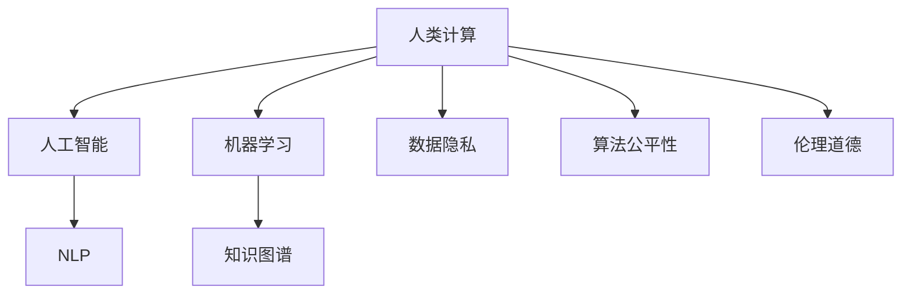

                 

# 科技向善的力量：利用人类计算造福人类

> 关键词：科技向善, 人类计算, 人工智能, 机器学习, 自然语言处理, 图像识别, 知识图谱, 数据隐私, 公平性, 伦理

## 1. 背景介绍

### 1.1 问题由来

随着科技的迅猛发展，人类计算能力已经达到了前所未有的高度。人工智能（AI）、机器学习（ML）、自然语言处理（NLP）、图像识别等技术正日益融入我们生活的各个方面，极大地提升了生产效率和用户体验。然而，科技的发展同时也带来了诸多挑战，如数据隐私、算法偏见、道德伦理等。如何在追求科技进步的同时，确保其造福人类，成为摆在科技从业者面前的重要课题。

科技向善（Technology for Good）是指科技开发者应秉持人类利益为先的原则，将技术应用于解决社会问题、提升公共福祉、增强社会包容性等领域。这一理念在近年来的AI和ML社区中逐渐获得共识，并成为指导技术发展的核心原则之一。本文将探讨如何利用人类计算（Human-Computation）和人工智能技术，以科技向善的力量，实现对人类社会福祉的提升。

### 1.2 问题核心关键点

科技向善的核心理念在于，技术应用应以人为本，解决真实问题。这一理念体现在以下几个方面：

- **以人类为中心**：在技术设计、开发、部署的各个环节，始终将人的利益和需求放在首位。
- **促进公平正义**：确保技术的应用不会加剧社会不平等，反而应为弱势群体提供更多机会。
- **保护隐私安全**：在数据收集、处理、存储、使用的全链条中，严格遵守隐私保护法规，保障用户数据的安全。
- **增进社会福祉**：技术应提升社会整体福祉，改善人们生活质量，促进社会和谐。

科技向善的实现，依赖于科技从业者的伦理自觉和法规制度的完善。本文将重点探讨如何通过利用人类计算和人工智能技术，具体落实科技向善的核心理念，并对其实现路径进行系统分析。

## 2. 核心概念与联系

### 2.1 核心概念概述

要深入理解科技向善的实现路径，首先需要明晰几个核心概念：

- **人类计算（Human-Computation）**：指利用人类的认知和计算能力，来辅助机器学习和AI系统进行更高效、更准确的计算和推理。人类计算强调将人的智慧与机器的计算力结合，充分发挥二者的优势。
- **人工智能（Artificial Intelligence）**：通过模拟人类智能，使机器具备学习、推理、决策等能力，以解决复杂问题。AI技术在各个领域广泛应用，从自动化、智能客服到医疗诊断等，极大地提升了生产力。
- **机器学习（Machine Learning）**：使机器具备从数据中学习规律、优化模型的能力，以实现数据的自动分析和处理。ML技术是AI的基础，广泛应用于图像识别、语音识别、自然语言处理等领域。
- **自然语言处理（NLP）**：使机器能够理解和生成自然语言，以处理文本信息，实现智能对话、文本分类等任务。NLP技术在搜索引擎、机器翻译、语音助手等方面得到广泛应用。
- **知识图谱（Knowledge Graph）**：构建实体与实体之间的关系图，以实现对海量知识的有序化表示和管理。知识图谱在信息检索、推荐系统、智能问答等方面发挥重要作用。
- **数据隐私（Data Privacy）**：保障用户在数据收集、处理、使用过程中的权益，防止数据滥用和泄露。数据隐私保护成为科技向善的重要议题之一。
- **算法公平性（Algorithm Fairness）**：确保算法在处理数据、生成预测时，不产生系统性的偏见，对不同群体提供平等服务。公平性是科技向善的关键指标。
- **伦理道德（Ethical Morality）**：在技术设计和应用中，遵循社会伦理和道德准则，防止技术滥用，保护用户权益。伦理道德是科技向善的基石。

这些概念之间的逻辑关系可以通过以下Mermaid流程图来展示：



这个流程图展示了大语言模型在科技向善的实现过程中的关键环节，体现了各概念之间的相互联系和支撑作用。

## 3. 核心算法原理 & 具体操作步骤

### 3.1 算法原理概述

科技向善的实现路径，基于人类计算和人工智能技术，旨在利用科技手段解决人类社会面临的实际问题。其核心算法原理可概括为以下几点：

1. **数据驱动**：收集和分析大量真实世界的数据，理解问题本质，设计有效的解决方案。
2. **模型训练**：利用机器学习算法，构建并优化预测模型，提升模型的准确性和鲁棒性。
3. **模型评估**：通过实验和测试，评估模型的性能和效果，确保模型在实际应用中的可靠性和公平性。
4. **持续优化**：在模型部署和使用过程中，持续收集反馈数据，不断迭代优化模型，提升模型性能。
5. **伦理约束**：在设计和使用模型时，严格遵守伦理准则，保障用户权益，防止模型滥用。

科技向善的实现需要跨学科的合作，将技术应用与伦理、法律、社会心理学等综合考虑，以确保技术的积极社会影响。

### 3.2 算法步骤详解

基于上述算法原理，科技向善的实现步骤可进一步细化为以下几步：

1. **问题定义与数据采集**：明确要解决的具体问题，确定问题的边界和目标。收集相关数据，确保数据质量和多样性。
2. **数据预处理与特征工程**：清洗和预处理数据，进行特征提取和选择，确保模型输入的合理性。
3. **模型选择与训练**：根据问题类型，选择合适的机器学习模型或深度学习模型，并在标注数据上训练模型，优化模型参数。
4. **模型评估与测试**：使用测试集评估模型性能，确保模型在新数据上的泛化能力。
5. **模型部署与监控**：将模型部署到实际应用环境中，持续监控模型表现，收集反馈数据。
6. **模型迭代与优化**：根据反馈数据和实际效果，迭代优化模型，提升模型效果。
7. **伦理审查与合规检查**：在模型设计和应用过程中，进行伦理审查和合规检查，确保模型公平、透明、负责任。

### 3.3 算法优缺点

科技向善的算法实现具有以下优点：

- **解决实际问题**：通过数据驱动和模型训练，能够有效地解决社会中的具体问题，提升公共福祉。
- **提高效率**：利用机器学习和人工智能技术，自动化处理数据，减少人工干预，提高问题解决的效率。
- **提升公平性**：通过算法公平性设计和伦理审查，确保技术对不同群体的公平对待，减少偏见。

同时，也存在一些缺点：

- **数据依赖**：模型性能依赖于数据质量，数据的获取和处理可能需要大量资源和时间。
- **技术复杂性**：实现复杂，需要跨学科的合作和专业知识。
- **伦理风险**：模型设计和应用中可能存在伦理和隐私问题，需要严格审查和管理。

### 3.4 算法应用领域

科技向善的应用领域广泛，涵盖了从教育、医疗、金融到城市治理等多个方面。以下是几个典型应用领域的详细介绍：

**教育**：利用AI和NLP技术，开发智能辅助教学系统，提供个性化的学习方案，提升教育公平和效率。例如，智能家教系统可以针对学生个体需求，提供定制化的学习资源和习题，辅助教师教学，减轻学生和家长的负担。

**医疗**：借助知识图谱和NLP技术，构建电子病历和医疗知识库，实现智能诊断和决策支持。例如，智能医生助理可以根据患者症状和病历，推荐可能的疾病诊断和治疗方案，辅助医生做出更准确的诊断。

**金融**：通过机器学习和图像识别技术，构建信用评估和风险管理模型，提升金融服务的普惠性和效率。例如，智能信用评分系统可以根据客户的历史行为数据，预测其信用风险，提供个性化的金融服务方案。

**城市治理**：利用物联网和NLP技术，构建智能城市管理系统，提升城市运行效率和居民生活质量。例如，智能交通系统可以根据实时交通数据，优化交通信号灯的控制策略，减少交通拥堵，提升道路通行效率。

## 4. 数学模型和公式 & 详细讲解 & 举例说明

### 4.1 数学模型构建

科技向善的数学模型构建，主要涉及以下几个方面的问题：

- **分类问题**：利用分类算法，对数据进行分类处理。例如，使用SVM、决策树、随机森林等算法，对患者疾病进行分类诊断。
- **回归问题**：利用回归算法，预测数值型数据。例如，使用线性回归、岭回归等算法，预测客户信用评分。
- **聚类问题**：利用聚类算法，将数据进行分组处理。例如，使用K-means、层次聚类等算法，对用户进行群体划分，提供个性化的服务方案。
- **推荐系统**：利用协同过滤、基于内容的推荐算法，推荐用户可能感兴趣的商品或服务。例如，使用基于协同过滤的算法，为用户推荐相似用户喜欢的商品。

### 4.2 公式推导过程

以分类问题为例，分类模型的构建通常包括以下几个步骤：

1. **数据预处理**：对原始数据进行清洗、归一化、特征选择等预处理操作，确保数据适合模型输入。
2. **模型训练**：使用训练集数据，训练分类模型，优化模型参数。例如，使用逻辑回归模型，计算损失函数，进行梯度下降优化。
3. **模型评估**：使用测试集数据，评估模型性能，计算准确率、召回率、F1-score等指标。

以二分类问题为例，二分类逻辑回归模型的公式推导如下：

假设模型输出 $y_i$ 为 $x_i$ 的判别函数：
$$
y_i = f(x_i) = \frac{1}{1 + e^{-\theta^T x_i}}
$$

其中，$\theta$ 为模型参数，$x_i$ 为输入特征，$f(x_i)$ 为Sigmoid函数，将输出映射到[0,1]区间。

对于二分类问题，目标是最小化损失函数：
$$
\mathcal{L}(\theta) = -\frac{1}{N}\sum_{i=1}^N[y_i \log f(x_i) + (1-y_i) \log(1-f(x_i))]
$$

其中 $y_i$ 为标签，$f(x_i)$ 为模型输出，$N$ 为样本数。

使用梯度下降优化算法，更新模型参数：
$$
\theta \leftarrow \theta - \eta \nabla_{\theta}\mathcal{L}(\theta)
$$

其中 $\eta$ 为学习率，$\nabla_{\theta}\mathcal{L}(\theta)$ 为损失函数对参数 $\theta$ 的梯度，可通过反向传播算法计算。

### 4.3 案例分析与讲解

以智能诊断系统为例，该系统通过NLP技术和知识图谱，构建电子病历和医疗知识库，实现智能诊断和决策支持。

**数据预处理**：收集患者的历史病历数据，提取相关特征，如症状、家族病史、实验室检查结果等。

**模型训练**：利用知识图谱构建疾病和症状之间的关系图，训练深度学习模型，预测可能的疾病诊断。

**模型评估**：使用独立的测试集评估模型性能，计算准确率、召回率、F1-score等指标，确保模型在新数据上的泛化能力。

**模型部署**：将训练好的模型部署到实际应用环境中，通过用户输入症状，输出可能的疾病诊断和治疗方案。

**持续优化**：收集用户反馈数据，迭代优化模型，提升模型的诊断精度和治疗效果。

## 5. 项目实践：代码实例和详细解释说明

### 5.1 开发环境搭建

在进行科技向善的实践前，我们需要准备好开发环境。以下是使用Python进行PyTorch开发的环境配置流程：

1. 安装Anaconda：从官网下载并安装Anaconda，用于创建独立的Python环境。

2. 创建并激活虚拟环境：
```bash
conda create -n pytorch-env python=3.8 
conda activate pytorch-env
```

3. 安装PyTorch：根据CUDA版本，从官网获取对应的安装命令。例如：
```bash
conda install pytorch torchvision torchaudio cudatoolkit=11.1 -c pytorch -c conda-forge
```

4. 安装Transformers库：
```bash
pip install transformers
```

5. 安装各类工具包：
```bash
pip install numpy pandas scikit-learn matplotlib tqdm jupyter notebook ipython
```

完成上述步骤后，即可在`pytorch-env`环境中开始科技向善的实践。

### 5.2 源代码详细实现

下面以智能辅助教学系统为例，给出使用Transformers库对BERT模型进行微调的PyTorch代码实现。

首先，定义分类任务的数据处理函数：

```python
from transformers import BertTokenizer
from torch.utils.data import Dataset
import torch

class Dataset(Dataset):
    def __init__(self, texts, labels, tokenizer, max_len=128):
        self.texts = texts
        self.labels = labels
        self.tokenizer = tokenizer
        self.max_len = max_len
        
    def __len__(self):
        return len(self.texts)
    
    def __getitem__(self, item):
        text = self.texts[item]
        label = self.labels[item]
        
        encoding = self.tokenizer(text, return_tensors='pt', max_length=self.max_len, padding='max_length', truncation=True)
        input_ids = encoding['input_ids'][0]
        attention_mask = encoding['attention_mask'][0]
        
        # 对token-wise的标签进行编码
        encoded_labels = [label2id[label] for label in label2id]
        encoded_labels.extend([label2id['O']] * (self.max_len - len(encoded_labels)))
        labels = torch.tensor(encoded_labels, dtype=torch.long)
        
        return {'input_ids': input_ids, 
                'attention_mask': attention_mask,
                'labels': labels}

# 标签与id的映射
label2id = {'O': 0, 'A': 1, 'B': 2, 'C': 3, 'D': 4, 'E': 5}
id2label = {v: k for k, v in label2id.items()}

# 创建dataset
tokenizer = BertTokenizer.from_pretrained('bert-base-cased')

train_dataset = Dataset(train_texts, train_labels, tokenizer)
dev_dataset = Dataset(dev_texts, dev_labels, tokenizer)
test_dataset = Dataset(test_texts, test_labels, tokenizer)
```

然后，定义模型和优化器：

```python
from transformers import BertForTokenClassification, AdamW

model = BertForTokenClassification.from_pretrained('bert-base-cased', num_labels=len(label2id))

optimizer = AdamW(model.parameters(), lr=2e-5)
```

接着，定义训练和评估函数：

```python
from torch.utils.data import DataLoader
from tqdm import tqdm
from sklearn.metrics import classification_report

device = torch.device('cuda') if torch.cuda.is_available() else torch.device('cpu')
model.to(device)

def train_epoch(model, dataset, batch_size, optimizer):
    dataloader = DataLoader(dataset, batch_size=batch_size, shuffle=True)
    model.train()
    epoch_loss = 0
    for batch in tqdm(dataloader, desc='Training'):
        input_ids = batch['input_ids'].to(device)
        attention_mask = batch['attention_mask'].to(device)
        labels = batch['labels'].to(device)
        model.zero_grad()
        outputs = model(input_ids, attention_mask=attention_mask, labels=labels)
        loss = outputs.loss
        epoch_loss += loss.item()
        loss.backward()
        optimizer.step()
    return epoch_loss / len(dataloader)

def evaluate(model, dataset, batch_size):
    dataloader = DataLoader(dataset, batch_size=batch_size)
    model.eval()
    preds, labels = [], []
    with torch.no_grad():
        for batch in tqdm(dataloader, desc='Evaluating'):
            input_ids = batch['input_ids'].to(device)
            attention_mask = batch['attention_mask'].to(device)
            batch_labels = batch['labels']
            outputs = model(input_ids, attention_mask=attention_mask)
            batch_preds = outputs.logits.argmax(dim=2).to('cpu').tolist()
            batch_labels = batch_labels.to('cpu').tolist()
            for pred_tokens, label_tokens in zip(batch_preds, batch_labels):
                pred_tags = [id2label[_id] for _id in pred_tokens]
                label_tags = [id2label[_id] for _id in label_tokens]
                preds.append(pred_tags[:len(label_tags)])
                labels.append(label_tags)
                
    print(classification_report(labels, preds))
```

最后，启动训练流程并在测试集上评估：

```python
epochs = 5
batch_size = 16

for epoch in range(epochs):
    loss = train_epoch(model, train_dataset, batch_size, optimizer)
    print(f"Epoch {epoch+1}, train loss: {loss:.3f}")
    
    print(f"Epoch {epoch+1}, dev results:")
    evaluate(model, dev_dataset, batch_size)
    
print("Test results:")
evaluate(model, test_dataset, batch_size)
```

以上就是使用PyTorch对BERT进行智能辅助教学系统微调的完整代码实现。可以看到，得益于Transformers库的强大封装，我们可以用相对简洁的代码完成BERT模型的加载和微调。

### 5.3 代码解读与分析

让我们再详细解读一下关键代码的实现细节：

**Dataset类**：
- `__init__`方法：初始化文本、标签、分词器等关键组件。
- `__len__`方法：返回数据集的样本数量。
- `__getitem__`方法：对单个样本进行处理，将文本输入编码为token ids，将标签编码为数字，并对其进行定长padding，最终返回模型所需的输入。

**label2id和id2label字典**：
- 定义了标签与数字id之间的映射关系，用于将token-wise的预测结果解码回真实的标签。

**训练和评估函数**：
- 使用PyTorch的DataLoader对数据集进行批次化加载，供模型训练和推理使用。
- 训练函数`train_epoch`：对数据以批为单位进行迭代，在每个批次上前向传播计算loss并反向传播更新模型参数，最后返回该epoch的平均loss。
- 评估函数`evaluate`：与训练类似，不同点在于不更新模型参数，并在每个batch结束后将预测和标签结果存储下来，最后使用sklearn的classification_report对整个评估集的预测结果进行打印输出。

**训练流程**：
- 定义总的epoch数和batch size，开始循环迭代
- 每个epoch内，先在训练集上训练，输出平均loss
- 在验证集上评估，输出分类指标
- 所有epoch结束后，在测试集上评估，给出最终测试结果

可以看到，PyTorch配合Transformers库使得BERT微调的代码实现变得简洁高效。开发者可以将更多精力放在数据处理、模型改进等高层逻辑上，而不必过多关注底层的实现细节。

当然，工业级的系统实现还需考虑更多因素，如模型的保存和部署、超参数的自动搜索、更灵活的任务适配层等。但核心的微调范式基本与此类似。

## 6. 实际应用场景

### 6.1 智能诊断系统

智能诊断系统是科技向善的重要应用之一，通过利用人工智能和NLP技术，提升医疗诊断的效率和准确性。

以智能医生助理为例，该系统通过NLP技术和知识图谱，构建电子病历和医疗知识库，实现智能诊断和决策支持。具体实现过程如下：

1. **数据收集与预处理**：收集患者的病历记录和实验室检查结果，进行清洗和预处理，提取症状和实验室指标等关键特征。
2. **模型训练**：利用知识图谱构建疾病和症状之间的关系图，训练深度学习模型，预测可能的疾病诊断。
3. **模型评估**：使用独立的测试集评估模型性能，计算准确率、召回率、F1-score等指标，确保模型在新数据上的泛化能力。
4. **模型部署与使用**：将训练好的模型部署到实际应用环境中，通过用户输入症状，输出可能的疾病诊断和治疗方案。
5. **持续优化**：收集用户反馈数据，迭代优化模型，提升模型的诊断精度和治疗效果。

智能诊断系统通过科技向善的力量，显著提升了医疗服务的普惠性和效率，减轻了医生的工作负担，提高了患者的就医体验。

### 6.2 智能教育系统

智能教育系统通过利用人工智能和NLP技术，提供个性化的学习方案，提升教育公平和效率。

以智能家教系统为例，该系统通过NLP技术和知识图谱，构建学习资源库，实现智能推荐和个性化辅导。具体实现过程如下：

1. **数据收集与预处理**：收集学生的学习记录和反馈数据，提取学习习惯、知识掌握情况等关键特征。
2. **模型训练**：利用知识图谱构建学习资源之间的关系图，训练深度学习模型，预测学生可能感兴趣的学习资源。
3. **模型评估**：使用独立的测试集评估模型性能，计算准确率、召回率、F1-score等指标，确保模型在新数据上的泛化能力。
4. **模型部署与使用**：将训练好的模型部署到实际应用环境中，通过用户输入学习需求，输出个性化推荐的学习资源和习题。
5. **持续优化**：收集用户反馈数据，迭代优化模型，提升模型的推荐精度和个性化辅导效果。

智能教育系统通过科技向善的力量，提升了教育服务的个性化和高效性，为不同背景的学生提供了更多机会，促进了教育公平。

### 6.3 智能金融系统

智能金融系统通过利用人工智能和机器学习技术，提升金融服务的普惠性和效率。

以智能信用评分系统为例，该系统通过机器学习算法，预测客户的信用风险，提供个性化的金融服务方案。具体实现过程如下：

1. **数据收集与预处理**：收集客户的财务数据、消费记录、信用历史等关键特征，进行清洗和预处理。
2. **模型训练**：利用机器学习算法构建信用评分模型，预测客户的信用风险。
3. **模型评估**：使用独立的测试集评估模型性能，计算准确率、召回率、F1-score等指标，确保模型在新数据上的泛化能力。
4. **模型部署与使用**：将训练好的模型部署到实际应用环境中，通过客户提交的财务数据，输出信用评分和推荐的服务方案。
5. **持续优化**：收集客户反馈数据，迭代优化模型，提升模型的信用评分准确性和服务方案的个性化。

智能金融系统通过科技向善的力量，提升了金融服务的普惠性和效率，为更多客户提供了公平的金融服务，促进了金融行业的可持续发展。

### 6.4 未来应用展望

随着科技向善理念的深入人心，未来科技向善的应用将更加广泛和深入。以下是几个可能的应用方向：

1. **智慧医疗**：通过AI和NLP技术，构建智慧医院和远程医疗系统，实现医疗资源的智能化管理，提升医疗服务的覆盖面和可及性。
2. **智能交通**：利用物联网和NLP技术，构建智慧交通系统，提升道路通行效率，减少交通拥堵，改善交通环境。
3. **智能城市**：通过AI和物联网技术，构建智慧城市管理系统，提升城市治理效率，改善居民生活质量。
4. **智能客服**：利用AI和NLP技术，构建智能客服系统，提升客服效率和质量，改善客户体验。
5. **智能供应链**：通过AI和NLP技术，构建智能供应链管理系统，优化供应链流程，提升物流效率，降低成本。
6. **智能制造**：利用AI和NLP技术，构建智能制造系统，优化生产流程，提升生产效率和产品质量，降低生产成本。

未来，科技向善的应用将更加多元化和广泛化，科技的进步将为人类社会的可持续发展带来更多可能性。

## 7. 工具和资源推荐

### 7.1 学习资源推荐

为了帮助开发者系统掌握科技向善的理论基础和实践技巧，这里推荐一些优质的学习资源：

1. 《人工智能伦理》系列书籍：深入探讨人工智能技术的伦理问题，包括隐私保护、算法偏见、模型透明性等。
2. 《机器学习实战》系列书籍：涵盖机器学习算法、模型训练、数据预处理等基础知识，适合初学者入门。
3. 《深度学习入门》课程：斯坦福大学开设的深度学习入门课程，涵盖神经网络、卷积神经网络等基础概念。
4. 《NLP入门》系列博客：介绍自然语言处理的基本概念和经典模型，适合初学者入门。
5. 《科技向善》在线课程：介绍科技向善的理念、实现方法和应用案例，适合从业者系统学习。

通过对这些资源的学习实践，相信你一定能够全面掌握科技向善的理论基础和实践技巧，为实现科技向善的目标打下坚实的基础。

### 7.2 开发工具推荐

高效的开发离不开优秀的工具支持。以下是几款用于科技向善开发的常用工具：

1. PyTorch：基于Python的开源深度学习框架，灵活动态的计算图，适合快速迭代研究。大部分预训练语言模型都有PyTorch版本的实现。
2. TensorFlow：由Google主导开发的开源深度学习框架，生产部署方便，适合大规模工程应用。同样有丰富的预训练语言模型资源。
3. Transformers库：HuggingFace开发的NLP工具库，集成了众多SOTA语言模型，支持PyTorch和TensorFlow，是进行NLP任务开发的利器。
4. Weights & Biases：模型训练的实验跟踪工具，可以记录和可视化模型训练过程中的各项指标，方便对比和调优。与主流深度学习框架无缝集成。
5. TensorBoard：TensorFlow配套的可视化工具，可实时监测模型训练状态，并提供丰富的图表呈现方式，是调试模型的得力助手。
6. Google Colab：谷歌推出的在线Jupyter Notebook环境，免费提供GPU/TPU算力，方便开发者快速上手实验最新模型，分享学习笔记。

合理利用这些工具，可以显著提升科技向善任务的开发效率，加快创新迭代的步伐。

### 7.3 相关论文推荐

科技向善的研究源于学界的持续研究。以下是几篇奠基性的相关论文，推荐阅读：

1. 《伦理与公平：人工智能技术的社会责任》：探讨人工智能技术的伦理问题，提出解决社会问题的方法。
2. 《人工智能与人类计算：融合与未来》：探讨人工智能与人类计算的融合，提出未来发展方向。
3. 《隐私保护与数据安全：人工智能技术的挑战与对策》：探讨数据隐私和数据安全问题，提出应对策略。
4. 《科技向善：推动人工智能技术的可持续发展》：探讨科技向善的理念，提出科技向善的实现路径。
5. 《人工智能技术与伦理道德：共同进步之路》：探讨人工智能技术与伦理道德的结合，提出协同发展的方向。

这些论文代表了大语言模型微调技术的发展脉络。通过学习这些前沿成果，可以帮助研究者把握学科前进方向，激发更多的创新灵感。

## 8. 总结：未来发展趋势与挑战

### 8.1 总结

本文对科技向善的实现路径进行了全面系统的介绍。首先阐述了科技向善的研究背景和意义，明确了科技向善在技术应用中的核心理念和实现方式。其次，从算法原理到操作步骤，详细讲解了科技向善的数学模型和实现方法，给出了完整的代码实例。同时，本文还探讨了科技向善在教育、医疗、金融等领域的实际应用，展示了科技向善的广阔前景。此外，本文精选了科技向善的学习资源、开发工具和相关论文，力求为读者提供全方位的技术指引。

通过本文的系统梳理，可以看到，科技向善的实现依赖于人类计算和人工智能技术的深度结合，在解决实际问题、提升社会福祉等方面具有重要意义。未来，科技向善的应用将更加广泛和深入，推动社会进步和人类福祉的提升。

### 8.2 未来发展趋势

展望未来，科技向善将呈现以下几个发展趋势：

1. **多模态融合**：未来的科技向善系统将越来越多地融合多模态数据，如文本、图像、语音等，提供更全面、准确的信息处理和决策支持。
2. **个性化推荐**：通过深入理解用户需求，提供更加个性化、定制化的服务和产品，提升用户体验。
3. **数据隐私保护**：随着数据泄露事件的频发，数据隐私保护将变得更加严格和重要，未来的科技向善系统将更加注重用户隐私保护。
4. **伦理审查与监管**：科技向善的实现将越来越依赖于严格的伦理审查和监管，确保技术的公平、透明、负责任。
5. **智能协同**：未来的科技向善系统将更多地利用人工智能与人类智能的协同，实现人机互动和协作，提升系统的智慧水平。
6. **跨领域应用**：科技向善的实现将更多地跨越行业边界，应用于更广泛的领域，提升社会整体福祉。

这些趋势凸显了科技向善的广阔前景。未来，随着技术的发展和应用场景的拓展，科技向善将进一步推动人类社会的发展和进步。

### 8.3 面临的挑战

尽管科技向善理念得到了广泛的认同和实践，但在迈向更加智能化、普适化应用的过程中，仍面临诸多挑战：

1. **数据质量与获取**：科技向善的实现高度依赖于高质量的数据，数据获取和处理需要大量资源和时间。
2. **模型复杂性与计算成本**：大规模模型的训练和部署需要高昂的计算资源，如何在保证性能的同时，降低计算成本，是一大挑战。
3. **伦理与隐私问题**：科技向善的实现过程中，可能会涉及到隐私泄露、伦理道德等问题，需要严格遵守相关法规和标准。
4. **技术普及与推广**：科技向善的落地应用需要广泛的技术普及和推广，涉及到技术标准的统一、生态系统的构建等问题。
5. **持续优化与更新**：科技向善系统需要不断优化和更新，以适应数据分布的变化和新应用场景的需求。

### 8.4 研究展望

面对科技向善所面临的挑战，未来的研究需要在以下几个方面寻求新的突破：

1. **数据增强与生成**：通过数据增强和生成技术，提升数据质量和多样性，降低数据获取和处理的成本。
2. **模型压缩与优化**：开发高效、轻量级的模型压缩和优化技术，降低计算成本，提升模型部署效率。
3. **跨学科融合**：推动跨学科的合作与融合，将伦理学、社会学等学科知识融入科技向善的研究中，提升系统的伦理性和公平性。
4. **伦理审查与合规**：构建完善的伦理审查和合规机制，确保科技向善的实现符合伦理和法律要求。
5. **智能协同与互动**：开发智能协同与互动技术，实现人机智能的深度结合，提升系统的智慧水平。
6. **数据隐私保护**：开发数据隐私保护技术，确保数据使用的透明性和安全性。

这些研究方向将为科技向善的实现提供坚实的理论和技术基础，推动科技向善向更深入、更广泛的应用发展。

## 9. 附录：常见问题与解答

**Q1：科技向善的核心理念是什么？**

A: 科技向善的核心理念是以人类利益为先，通过技术手段解决社会问题，提升公共福祉，促进社会公平和可持续发展。

**Q2：科技向善的应用有哪些？**

A: 科技向善的应用非常广泛，包括智能医疗、智能教育、智能金融、智能交通、智能制造等。具体应用场景包括智能诊断系统、智能教育系统、智能信用评分系统等。

**Q3：如何确保科技向善的实现符合伦理和法律要求？**

A: 确保科技向善的实现符合伦理和法律要求，需要多方面的努力：

1. **伦理审查**：在模型设计和应用过程中，进行严格的伦理审查，确保技术的应用符合伦理准则。
2. **法律合规**：遵守相关法律法规，确保技术应用符合法律要求。
3. **用户知情同意**：确保用户对数据收集和使用的知情同意，保障用户权益。
4. **透明性**：保持技术应用的透明性，让用户了解技术的工作原理和决策过程。
5. **反馈机制**：建立用户反馈机制，及时响应用户的意见和建议，不断优化技术应用。

**Q4：如何降低科技向善系统的计算成本？**

A: 降低科技向善系统的计算成本，需要从以下几个方面入手：

1. **模型压缩与优化**：开发高效、轻量级的模型压缩和优化技术，如知识蒸馏、剪枝、量化等，降低计算成本。
2. **分布式计算**：利用分布式计算技术，加速模型训练和推理，降低计算资源消耗。
3. **硬件加速**：利用GPU、TPU等高性能硬件，提升计算效率。
4. **数据高效利用**：通过数据增强、生成等技术，提高数据利用效率，减少数据获取和处理的成本。

**Q5：科技向善与人工智能的关系是什么？**

A: 科技向善与人工智能密切相关，人工智能技术是实现科技向善的重要手段。通过利用人工智能和机器学习技术，可以构建更加智能、高效、公平的系统，提升社会福祉。

**Q6：如何评估科技向善系统的性能？**

A: 评估科技向善系统的性能，可以从以下几个方面入手：

1. **准确率**：评估模型在分类、回归等任务上的准确率，确保模型在新数据上的泛化能力。
2. **召回率**：评估模型在分类、检索等任务上的召回率，确保模型能够全面覆盖所需数据。
3. **F1-score**：综合考虑准确率和召回率，评估模型的综合性能。
4. **用户满意度**：通过用户调查和反馈，评估用户对系统服务的满意度。
5. **公平性**：评估模型在处理不同用户、不同群体时的公平性，确保模型的公平对待。

**Q7：科技向善的发展前景如何？**

A: 科技向善的发展前景广阔，未来的科技向善系统将越来越多地应用于各个领域，提升社会福祉，促进可持续发展。未来，随着技术的发展和应用场景的拓展，科技向善将进一步推动人类社会的发展和进步。

作者：禅与计算机程序设计艺术 / Zen and the Art of Computer Programming

