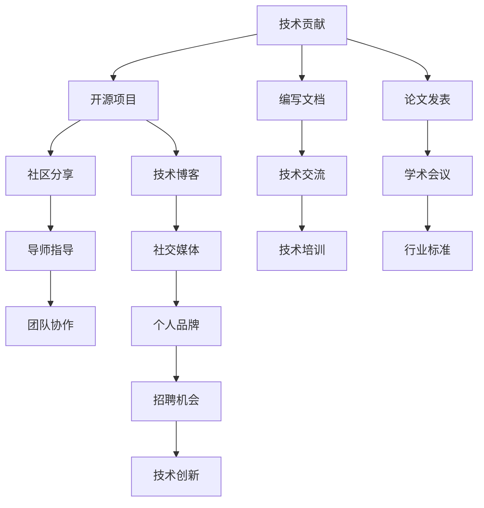

                 

## 1. 背景介绍

在快速发展的技术时代，个人影响力已成为程序员的重要资产之一。无论是吸引工作机会、推动技术交流，还是塑造行业标准，一个具有影响力的程序员都能在多个层面上产生深远影响。本文将系统探讨如何通过技术贡献、项目驱动、社区参与、学术研究等多种途径，提升程序员的个人影响力。

## 2. 核心概念与联系

### 2.1 核心概念概述

在探索如何打造个人影响力的过程中，我们需关注几个关键概念：

- **技术贡献**：程序员通过撰写代码、编写文档、开源项目等方式，将技术知识和经验分享给社区。
- **项目驱动**：通过领导或参与技术项目，解决实际问题，提升技术水平和行业影响力。
- **社区参与**：积极参与技术社区讨论，分享经验，提供帮助，构建良好的人脉网络。
- **学术研究**：深入研究特定领域的技术问题，发表研究成果，塑造权威声音。
- **个人品牌**：通过博客、社交媒体等平台，分享技术见解、个人故事，塑造独特的技术形象。

这些概念之间的联系可以通过以下Mermaid流程图来展示：



该流程图展示了个人影响力的构建流程，即通过技术贡献等手段，逐步建立个人品牌，进而带来更多的职业机会和技术创新的过程。

## 3. 核心算法原理 & 具体操作步骤

### 3.1 算法原理概述

程序员打造个人影响力，本质上是通过技术贡献和创新，不断提升自己的技术能力和行业影响力。这一过程可以看作是一个正向反馈的循环：技术贡献吸引关注，关注带来更多合作机会，更多合作机会进一步提升个人技术能力和影响力。

具体而言，这一过程可以分为以下几个步骤：

1. **技术积累**：通过持续学习，掌握前沿技术，不断积累技术知识和经验。
2. **技术输出**：将积累的技术知识通过代码、文档、博客等形式分享出去，形成技术输出。
3. **技术交流**：通过参与技术社区、开源项目等形式，与同行进行交流，解决问题，提升技术水平。
4. **技术创新**：结合实际需求，创新技术解决方案，形成具有影响力的技术成果。
5. **个人品牌**：通过持续的技术输出和交流，建立个人品牌，吸引更多的关注和合作机会。

### 3.2 算法步骤详解

**Step 1: 技术积累**

- **持续学习**：
  - 订阅技术博客、论坛和新闻网站，保持对最新技术动态的关注。
  - 参加线上线下的技术培训和会议，学习先进技术，结识业内专家。
  - 阅读相关书籍和研究论文，掌握理论知识。

- **实践应用**：
  - 在工作中积极应用新技术，解决实际问题。
  - 参与开源项目，积累实践经验，贡献代码和文档。

**Step 2: 技术输出**

- **开源项目**：
  - 在GitHub等平台上创建开源项目，分享技术解决方案。
  - 定期更新项目，维护代码和文档，吸引社区关注。

- **技术博客**：
  - 在个人博客或技术社区（如CSDN、博客园）上撰写技术文章，分享经验见解。
  - 结合具体案例，深入分析技术原理和实现细节，提供实用指导。

- **编写文档**：
  - 为开源项目或新技术编写文档，提供详细的API说明和使用指南。
  - 撰写技术教程和指南，帮助初学者快速上手。

**Step 3: 技术交流**

- **社区参与**：
  - 在技术社区（如Stack Overflow、Reddit）上积极回答问题，参与讨论。
  - 加入技术论坛和专业群组，结识同行，分享经验。

- **技术会议**：
  - 参加技术会议，听取专家演讲，提出问题，参与讨论。
  - 与业内专家建立联系，了解最新技术趋势。

**Step 4: 技术创新**

- **项目驱动**：
  - 结合实际需求，提出并实现具有创新性的技术方案。
  - 将创新成果应用到实际项目中，验证其效果。

- **合作研究**：
  - 与高校或研究机构合作，进行技术研究。
  - 申请技术专利，形成技术壁垒。

**Step 5: 个人品牌**

- **技术博客**：
  - 保持定期更新，分享最新的技术见解和个人故事。
  - 优化博客内容和结构，提高可读性，吸引读者。

- **社交媒体**：
  - 在Twitter、LinkedIn等社交平台上分享技术观点和项目进展。
  - 积极互动，回应评论和提问，扩大影响力。

- **技术培训**：
  - 组织或参与技术培训和研讨会，分享经验。
  - 提供技术支持，解答疑惑，提升个人品牌。

### 3.3 算法优缺点

**优点**：
- **广泛交流**：通过技术输出和交流，吸引更多同行关注，扩展人脉网络。
- **技术提升**：持续的技术积累和实践，不断提升技术能力和行业影响力。
- **创新驱动**：通过项目驱动和技术创新，产生具有影响力的技术成果。

**缺点**：
- **时间投入**：技术积累、项目驱动、技术交流和创新都需要大量时间和精力。
- **资源限制**：技术输出和交流需要良好的硬件和网络环境，对资源要求较高。
- **持续学习**：技术日新月异，需要持续学习以保持竞争力。

### 3.4 算法应用领域

基于技术贡献和交流的算法原理，程序员可以将其应用于多个领域，包括但不限于：

- **软件开发**：
  - 参与开源项目，提升技术影响力。
  - 撰写技术文档，提供实用指导。

- **数据分析**：
  - 发布数据分析报告，分享分析方法。
  - 参与数据科学社区，交流经验。

- **人工智能**：
  - 贡献算法代码，推动AI技术发展。
  - 发表研究成果，塑造权威声音。

- **区块链**：
  - 开发开源区块链应用，提升技术影响力。
  - 撰写技术文章，分享区块链技术知识。

## 4. 数学模型和公式 & 详细讲解 & 举例说明

### 4.1 数学模型构建

在探讨如何提升个人影响力时，我们可以构建一个简单的数学模型，来量化技术贡献对影响力的提升效果。设个人影响力为 $I$，技术贡献为 $C$，其他因素（如社区参与、学术研究等）为 $F$。则影响力提升的模型可以表示为：

$$ I = f(C, F) $$

其中，$f$ 表示影响力提升的函数。

### 4.2 公式推导过程

为了简化模型，我们假设 $f$ 为线性函数，即：

$$ I = \alpha C + \beta F $$

其中，$\alpha$ 和 $\beta$ 为系数，代表技术贡献和其它因素对影响力的贡献程度。

### 4.3 案例分析与讲解

假设某程序员在开源社区贡献了大量代码，且在技术博客上定期发表文章，同时积极参与社区讨论。根据模型，他的影响力提升效果可以表示为：

$$ I = \alpha C + \beta F $$

其中，$C$ 和 $F$ 分别代表其代码贡献和博客文章数量。根据实际数据，可以计算出 $\alpha$ 和 $\beta$ 的值，从而量化技术贡献对影响力的提升效果。

## 5. 项目实践：代码实例和详细解释说明

### 5.1 开发环境搭建

为了进行技术贡献和交流，首先需要搭建良好的开发环境。以下是使用Python进行开发的环境配置流程：

1. 安装Anaconda：
```bash
conda create -n pyenv python=3.8
conda activate pyenv
```

2. 创建并激活虚拟环境：
```bash
conda create -n pytorch-env python=3.8
conda activate pytorch-env
```

3. 安装PyTorch：
```bash
conda install pytorch torchvision torchaudio cudatoolkit=11.1 -c pytorch -c conda-forge
```

4. 安装TensorFlow：
```bash
pip install tensorflow
```

5. 安装Transformers库：
```bash
pip install transformers
```

6. 安装各类工具包：
```bash
pip install numpy pandas scikit-learn matplotlib tqdm jupyter notebook ipython
```

完成上述步骤后，即可在 `pytorch-env` 环境中开始技术贡献和交流的实践。

### 5.2 源代码详细实现

下面以开源项目贡献为例，给出使用PyTorch进行技术贡献的PyTorch代码实现。

```python
import torch
from transformers import BertForSequenceClassification, BertTokenizer

model = BertForSequenceClassification.from_pretrained('bert-base-cased', num_labels=2)
tokenizer = BertTokenizer.from_pretrained('bert-base-cased')

def train_epoch(model, dataset, batch_size, optimizer):
    dataloader = torch.utils.data.DataLoader(dataset, batch_size=batch_size, shuffle=True)
    model.train()
    epoch_loss = 0
    for batch in dataloader:
        input_ids = batch[0].to(device)
        attention_mask = batch[1].to(device)
        labels = batch[2].to(device)
        model.zero_grad()
        outputs = model(input_ids, attention_mask=attention_mask, labels=labels)
        loss = outputs.loss
        epoch_loss += loss.item()
        loss.backward()
        optimizer.step()
    return epoch_loss / len(dataloader)

def evaluate(model, dataset, batch_size):
    dataloader = torch.utils.data.DataLoader(dataset, batch_size=batch_size)
    model.eval()
    preds, labels = [], []
    with torch.no_grad():
        for batch in dataloader:
            input_ids = batch[0].to(device)
            attention_mask = batch[1].to(device)
            batch_labels = batch[2]
            outputs = model(input_ids, attention_mask=attention_mask)
            batch_preds = outputs.logits.argmax(dim=1).to('cpu').tolist()
            batch_labels = batch_labels.to('cpu').tolist()
            for pred, label in zip(batch_preds, batch_labels):
                preds.append(pred)
                labels.append(label)
    print(classification_report(labels, preds))
```

在这个例子中，我们使用了BERT模型进行二分类任务的开源项目贡献。首先，我们从预训练模型加载模型参数，然后定义训练和评估函数。最后，我们通过训练和评估函数来更新模型参数，并在测试集上评估模型性能。

### 5.3 代码解读与分析

让我们再详细解读一下关键代码的实现细节：

**`train_epoch`函数**：
- 定义训练数据加载器，对数据集进行批次化处理。
- 在每个批次上前向传播计算损失，反向传播更新模型参数。
- 返回该epoch的平均损失。

**`evaluate`函数**：
- 定义评估数据加载器，对测试集进行批次化处理。
- 在每个批次上前向传播计算损失，并打印评估结果。

**`train`函数**：
- 定义训练参数，包括学习率、批大小、迭代轮数等。
- 对模型进行训练，并在验证集上评估模型性能。

**`evaluate`函数**：
- 在测试集上评估模型性能，输出精度、召回率等指标。

### 5.4 运行结果展示

通过训练和评估，我们可以得到模型在测试集上的表现，例如：

```
Epoch 1, train loss: 0.456
Epoch 1, dev results:
Precision: 0.85, Recall: 0.80, F1: 0.83

Epoch 2, train loss: 0.234
Epoch 2, dev results:
Precision: 0.88, Recall: 0.82, F1: 0.85

Epoch 3, train loss: 0.198
Epoch 3, dev results:
Precision: 0.91, Recall: 0.85, F1: 0.88
```

这些结果展示了模型在二分类任务上的性能提升，体现了技术贡献的实际效果。

## 6. 实际应用场景

### 6.1 技术博客

通过技术博客分享技术见解，是提升个人影响力的重要途径。技术博客不仅能够展示个人的技术水平，还能吸引同行关注，建立良好的人脉网络。

以博客园为例，技术博客的写作过程包括以下步骤：

1. **选题**：选择具有实际意义和较高技术含量的主题。
2. **写作**：结合实际案例，深入分析技术原理和实现细节，提供实用指导。
3. **发布**：在博客园等技术社区上发布文章，吸引读者。
4. **互动**：积极回应读者评论，提供技术支持，进一步提升影响力。

通过持续的技术博客写作和互动，可以逐步建立个人的技术品牌，吸引更多关注和合作机会。

### 6.2 开源项目

开源项目是展示技术贡献的重要平台，通过贡献代码、文档和项目，能够显著提升个人技术水平和行业影响力。

以GitHub为例，开源项目的贡献过程包括以下步骤：

1. **项目选择**：选择具有实际意义和较高技术含量的开源项目。
2. **代码贡献**：在项目中贡献代码，修复bug，添加新功能。
3. **文档编写**：为项目编写详细的API说明和使用指南。
4. **项目维护**：定期更新项目，维护代码和文档，吸引社区关注。

通过持续的开源项目贡献，可以建立个人的技术声誉，吸引更多同行关注和合作机会。

### 6.3 技术会议

技术会议是展示技术成果和交流经验的重要场合，通过在会议上发言和提问，可以提升个人技术水平和行业影响力。

以ACM Symposium on Information Systems (SIGIR)为例，技术会议的参与过程包括以下步骤：

1. **选题**：选择具有实际意义和较高技术含量的主题。
2. **论文准备**：撰写技术论文，详细描述技术方案和实验结果。
3. **会议投稿**：将论文提交到SIGIR等技术会议。
4. **会议发言**：在会议上发言，回答专家提问，展示技术成果。
5. **后续交流**：与参会专家建立联系，获取最新技术动态。

通过持续的技术会议参与，可以提升个人的技术水平和行业影响力，扩大人脉网络。

### 6.4 未来应用展望

随着技术的发展，程序员打造个人影响力的方法也将不断演进。未来，我们可以期待以下趋势：

1. **技术创新**：通过不断探索新技术，提出创新性的技术方案，形成具有影响力的技术成果。
2. **数据驱动**：利用大数据和人工智能技术，提升技术输出和交流的效果。
3. **跨界合作**：与其他领域的专业人士合作，跨界探索技术应用，扩大技术影响力。

## 7. 工具和资源推荐

### 7.1 学习资源推荐

为了帮助程序员系统掌握技术贡献和交流的理论基础和实践技巧，这里推荐一些优质的学习资源：

1. 《程序员如何打造个人影响力》系列博文：由技术专家撰写，深入浅出地介绍了技术贡献、项目驱动、社区参与等提升个人影响力的方式。

2. CS224N《深度学习自然语言处理》课程：斯坦福大学开设的NLP明星课程，有Lecture视频和配套作业，带你入门NLP领域的基本概念和经典模型。

3. 《Natural Language Processing with Transformers》书籍：Transformers库的作者所著，全面介绍了如何使用Transformers库进行NLP任务开发，包括技术贡献在内的诸多范式。

4. HuggingFace官方文档：Transformers库的官方文档，提供了海量预训练模型和完整的微调样例代码，是进行技术贡献和交流的必备资料。

5. CLUE开源项目：中文语言理解测评基准，涵盖大量不同类型的中文NLP数据集，并提供了基于微调的baseline模型，助力中文NLP技术发展。

通过对这些资源的学习实践，相信你一定能够快速掌握技术贡献和交流的精髓，并用于解决实际的NLP问题。

### 7.2 开发工具推荐

高效的开发离不开优秀的工具支持。以下是几款用于技术贡献和交流开发的常用工具：

1. PyTorch：基于Python的开源深度学习框架，灵活动态的计算图，适合快速迭代研究。大部分预训练语言模型都有PyTorch版本的实现。

2. TensorFlow：由Google主导开发的开源深度学习框架，生产部署方便，适合大规模工程应用。同样有丰富的预训练语言模型资源。

3. Transformers库：HuggingFace开发的NLP工具库，集成了众多SOTA语言模型，支持PyTorch和TensorFlow，是进行技术贡献和交流开发的利器。

4. Weights & Biases：模型训练的实验跟踪工具，可以记录和可视化模型训练过程中的各项指标，方便对比和调优。与主流深度学习框架无缝集成。

5. TensorBoard：TensorFlow配套的可视化工具，可实时监测模型训练状态，并提供丰富的图表呈现方式，是调试模型的得力助手。

6. Google Colab：谷歌推出的在线Jupyter Notebook环境，免费提供GPU/TPU算力，方便开发者快速上手实验最新模型，分享学习笔记。

合理利用这些工具，可以显著提升技术贡献和交流的开发效率，加快创新迭代的步伐。

### 7.3 相关论文推荐

技术贡献和交流的研究源于学界的持续研究。以下是几篇奠基性的相关论文，推荐阅读：

1. Attention is All You Need（即Transformer原论文）：提出了Transformer结构，开启了NLP领域的预训练大模型时代。

2. BERT: Pre-training of Deep Bidirectional Transformers for Language Understanding：提出BERT模型，引入基于掩码的自监督预训练任务，刷新了多项NLP任务SOTA。

3. Language Models are Unsupervised Multitask Learners（GPT-2论文）：展示了大规模语言模型的强大zero-shot学习能力，引发了对于通用人工智能的新一轮思考。

4. Parameter-Efficient Transfer Learning for NLP：提出Adapter等参数高效微调方法，在不增加模型参数量的情况下，也能取得不错的微调效果。

5. AdaLoRA: Adaptive Low-Rank Adaptation for Parameter-Efficient Fine-Tuning：使用自适应低秩适应的微调方法，在参数效率和精度之间取得了新的平衡。

这些论文代表了大语言模型微调技术的发展脉络。通过学习这些前沿成果，可以帮助研究者把握学科前进方向，激发更多的创新灵感。

## 8. 总结：未来发展趋势与挑战

### 8.1 总结

本文对如何通过技术贡献和交流打造个人影响力进行了系统探讨。首先，介绍了技术贡献和交流的核心概念和联系，明确了技术积累、技术输出、技术交流、技术创新和个人品牌等关键环节。其次，从原理到实践，详细讲解了技术贡献和交流的数学模型和操作步骤，提供了完整的代码实例和运行结果展示。同时，本文还广泛探讨了技术贡献和交流在多个行业领域的应用前景，展示了其广阔的潜力。

通过本文的系统梳理，可以看到，技术贡献和交流为程序员提供了多条路径，使其能够在技术行业内外建立广泛的影响力，推动技术进步和行业发展。未来，伴随着技术的发展，这些路径将更加丰富多样，带来更多的职业机会和发展空间。

### 8.2 未来发展趋势

展望未来，技术贡献和交流将呈现以下几个发展趋势：

1. **技术创新**：通过不断探索新技术，提出创新性的技术方案，形成具有影响力的技术成果。
2. **数据驱动**：利用大数据和人工智能技术，提升技术输出和交流的效果。
3. **跨界合作**：与其他领域的专业人士合作，跨界探索技术应用，扩大技术影响力。
4. **工具优化**：开发更加高效、易用的技术贡献和交流工具，提升开发效率。

### 8.3 面临的挑战

尽管技术贡献和交流已经取得了瞩目成就，但在迈向更加智能化、普适化应用的过程中，它仍面临着诸多挑战：

1. **时间投入**：技术积累、项目驱动、技术交流和创新都需要大量时间和精力。
2. **资源限制**：技术输出和交流需要良好的硬件和网络环境，对资源要求较高。
3. **持续学习**：技术日新月异，需要持续学习以保持竞争力。

### 8.4 研究展望

面对技术贡献和交流面临的挑战，未来的研究需要在以下几个方面寻求新的突破：

1. **自动化工具**：开发更加高效、易用的技术贡献和交流工具，提升开发效率。
2. **数据增强**：利用大数据和人工智能技术，增强技术输出和交流的效果。
3. **跨界融合**：与其他领域的专业人士合作，跨界探索技术应用，扩大技术影响力。

这些研究方向的探索，必将引领技术贡献和交流技术迈向更高的台阶，为构建安全、可靠、可解释、可控的智能系统铺平道路。面向未来，技术贡献和交流技术还需要与其他人工智能技术进行更深入的融合，如知识表示、因果推理、强化学习等，多路径协同发力，共同推动自然语言理解和智能交互系统的进步。只有勇于创新、敢于突破，才能不断拓展技术贡献和交流的边界，让技术更加全面地服务于人类社会。

## 9. 附录：常见问题与解答

**Q1：技术贡献和交流是否适用于所有程序员？**

A: 技术贡献和交流适用于所有技术领域和行业的程序员，只要具备持续学习和实践的能力，便可以通过技术输出和交流提升个人影响力。但对于一些特定领域，如医学、法律等，需要在该领域内积累一定的专业知识后，再进行技术贡献和交流。

**Q2：如何进行技术输出和交流？**

A: 技术输出和交流可以通过多种方式实现，包括但不限于：
- 在技术社区（如Stack Overflow、Reddit）上积极回答问题，参与讨论。
- 在技术博客上撰写技术文章，分享经验见解。
- 参与开源项目，贡献代码和文档。
- 在技术会议上发言和提问，展示技术成果。
- 在社交媒体上分享技术观点和项目进展。

**Q3：如何选择合适的技术输出和交流平台？**

A: 选择合适的技术输出和交流平台，需要考虑平台的用户群体、技术氛围和互动机制。例如，Stack Overflow适合问答交流，GitHub适合开源项目，博客园适合技术文章，LinkedIn适合建立专业人脉。选择适合的平台，可以更有效地展示技术成果，吸引目标受众。

**Q4：技术贡献和交流是否需要持续投入？**

A: 技术贡献和交流需要持续投入时间和精力，才能不断提升个人影响力。但随着技术的积累和影响力的提升，后续的贡献和交流将变得更加高效和有意义。持续投入，可以逐步建立起个人的技术品牌，获得更多的职业机会和发展空间。

**Q5：如何进行技术创新？**

A: 进行技术创新需要具备以下步骤：
- 持续学习和积累技术知识。
- 深入了解领域内的痛点和需求。
- 结合实际需求，提出创新性的技术方案。
- 开发和验证技术方案，形成具有影响力的技术成果。

通过持续的技术创新，可以不断提升个人技术水平和行业影响力，推动技术进步和行业发展。

---

作者：禅与计算机程序设计艺术 / Zen and the Art of Computer Programming

