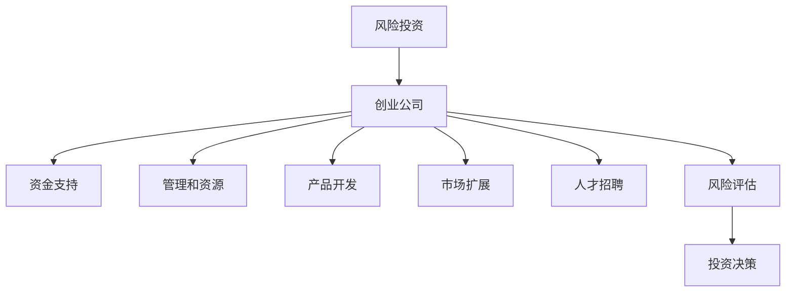

                 

# 程序员如何进行风险投资

> 关键词：风险投资,风险管理,风险评估,创业公司,创业环境,投资决策

## 1. 背景介绍

在当今快速发展的科技行业中，程序员不仅需要专注于编码和创新，还需要了解如何评估和进行风险投资。风险投资（Venture Capital, VC）是创业公司获得资金的重要途径，但同时也伴随着高风险。对于程序员来说，理解风险投资的基本原理和策略，能够帮助他们在创业和投资决策中做出更为明智的选择。

本文将深入探讨风险投资的原理、流程和评估方法，帮助程序员更好地进行风险投资。通过本文的学习，读者将能够了解如何识别有潜力的初创公司，评估风险和回报，以及如何构建一个成功的投资组合。

## 2. 核心概念与联系

### 2.1 核心概念概述

- **风险投资（Venture Capital, VC）**：指由风险投资公司提供的资金支持，用于资助那些具有高增长潜力但缺乏资金的初创企业。风险投资不仅提供资金，还提供管理和资源，帮助企业快速成长。

- **创业公司**：指新成立的企业，通常处于发展早期，尚未达到成熟阶段。创业公司需要资金来开发产品、扩大市场和招聘人才。

- **创业环境**：指一个区域或国家支持创业企业的所有外部因素，包括法律环境、政策支持、创业文化等。

- **投资决策**：指投资者在多个投资机会中进行选择的过程，涉及对公司价值、市场前景和投资回报的评估。

- **风险评估**：指评估投资项目可能面临的风险和不确定性，包括市场风险、财务风险、管理风险等。

### 2.2 核心概念原理和架构的 Mermaid 流程图



该流程图展示了风险投资的基本流程：风险投资公司向创业公司提供资金、管理和资源支持，帮助其进行产品开发、市场扩展和人才招聘，同时进行风险评估和投资决策。

## 3. 核心算法原理 & 具体操作步骤

### 3.1 算法原理概述

风险投资的核心在于识别和评估有潜力的初创企业，并在合适的时机进行投资。这一过程通常包括以下几个步骤：

1. **市场调研**：了解目标市场的规模、增长潜力和竞争态势。
2. **公司评估**：评估公司的商业模式、产品、团队和财务状况。
3. **风险评估**：分析市场和公司可能面临的风险和不确定性。
4. **投资决策**：在多个投资机会中进行选择，决定投资哪些公司。
5. **后续管理**：对投资的公司进行管理和支持，帮助其快速成长。

### 3.2 算法步骤详解

#### 3.2.1 市场调研

1. **定义目标市场**：明确你想进入的市场领域，如电子商务、人工智能、健康科技等。
2. **市场规模和增长潜力**：研究目标市场的规模、增长率和未来趋势，使用数据和市场研究报告支持你的分析。
3. **竞争态势**：分析市场上的主要竞争对手，了解他们的市场份额、优势和劣势。

#### 3.2.2 公司评估

1. **商业模式**：评估公司的商业模式是否可行，包括产品、客户、渠道和收入模型。
2. **产品和技术**：分析公司的产品和技术是否具有创新性和竞争力，是否能够满足市场需求。
3. **团队和领导力**：评估公司的管理团队和领导层，看他们是否具备经验和能力带领公司实现成长。
4. **财务状况**：审查公司的财务报表，了解其收入、支出、利润和现金流状况。

#### 3.2.3 风险评估

1. **市场风险**：分析市场的不确定性和变化，如市场需求变化、政策调整等。
2. **财务风险**：评估公司的财务健康状况，如现金流、债务和收入预测。
3. **管理风险**：分析公司管理层的能力和决策，看其能否有效应对市场变化和挑战。

#### 3.2.4 投资决策

1. **投资回报预期**：基于市场调研和公司评估，确定期望的投资回报率和风险承受能力。
2. **投资金额和阶段**：根据公司的成长阶段和需求，决定投资金额和投资阶段，如种子轮、A轮、B轮等。
3. **条款和条件**：制定投资条款和条件，包括股权分配、董事会席位、优先权等。

#### 3.2.5 后续管理

1. **监控和支持**：定期监控公司的运营情况，提供管理支持和资源，帮助其解决成长中的问题。
2. **退出策略**：制定退出策略，如IPO、并购或二次出售，以实现投资回报。

### 3.3 算法优缺点

**优点**：
- **高回报潜力**：风险投资通常具有高回报潜力，特别是在新兴市场和领域。
- **多样性**：风险投资可以分散投资组合，降低单一投资的风险。
- **专业支持**：风险投资不仅提供资金，还提供管理和资源支持，帮助公司快速成长。

**缺点**：
- **高风险**：风险投资通常伴随着高风险，失败的概率较高。
- **长周期**：投资周期较长，从种子轮到退出可能需要数年时间。
- **信息不对称**：投资者可能对创业公司的真实情况了解不够，存在信息不对称的风险。

### 3.4 算法应用领域

风险投资广泛应用于科技、医疗、生物技术、能源等高增长领域，这些领域具有高风险和高回报的特征。风险投资也适用于一些新兴市场和领域，如人工智能、区块链、可持续发展等。

## 4. 数学模型和公式 & 详细讲解 & 举例说明

### 4.1 数学模型构建

风险投资决策通常使用量化模型进行分析和评估，常见的数学模型包括：

- **资本资产定价模型（CAPM）**：用于评估股票和投资组合的期望回报和风险。
- **蒙特卡洛模拟**：用于模拟公司未来的收入和支出，进行财务预测。
- **期权定价模型**：用于评估公司在未来不同情况下的回报，进行风险评估。

### 4.2 公式推导过程

#### 4.2.1 资本资产定价模型（CAPM）

资本资产定价模型（CAPM）用于评估股票的期望回报和风险，公式如下：

$$
E(R_i) = R_f + \beta_i (E(R_m) - R_f)
$$

其中：
- $E(R_i)$ 为股票 $i$ 的期望回报率。
- $R_f$ 为无风险利率。
- $\beta_i$ 为股票 $i$ 的贝塔系数，表示其与市场波动的相关性。
- $E(R_m)$ 为市场的期望回报率。

通过CAPM模型，可以计算出股票的期望回报和市场波动率之间的线性关系，从而进行风险评估和投资决策。

#### 4.2.2 蒙特卡洛模拟

蒙特卡洛模拟是一种随机模拟方法，用于模拟公司未来的收入和支出，进行财务预测。假设公司未来的收入和支出具有随机性，通过模拟大量随机路径，计算出各种情况下的期望回报和风险。公式如下：

$$
V = \sum_{i=1}^n F_i \times P_i
$$

其中：
- $V$ 为公司未来收入的期望值。
- $F_i$ 为第 $i$ 种情况下的未来收入。
- $P_i$ 为第 $i$ 种情况发生的概率。

通过蒙特卡洛模拟，可以更准确地进行财务预测和风险评估。

#### 4.2.3 期权定价模型

期权定价模型（如Black-Scholes模型）用于评估公司在未来不同情况下的回报，进行风险评估。假设股票价格服从几何布朗运动，通过求解期权价格，可以计算出公司未来的不同情况的回报。公式如下：

$$
C = S_0 N(d_1) - K e^{-rt} N(d_2)
$$

其中：
- $C$ 为期权价格。
- $S_0$ 为股票当前价格。
- $K$ 为期权执行价格。
- $r$ 为无风险利率。
- $t$ 为期权到期时间。
- $N(d_1)$ 和 $N(d_2)$ 为标准正态分布的累积分布函数。

通过期权定价模型，可以评估公司在未来不同情况下的回报，进行风险评估和投资决策。

### 4.3 案例分析与讲解

假设有一家初创公司，正在寻找风险投资。投资者通过以下步骤进行评估和投资决策：

1. **市场调研**：该公司所在的市场为人工智能领域，市场规模大且增长迅速。主要竞争对手包括Google、Amazon等巨头，但市场仍然有巨大空间。

2. **公司评估**：公司正在开发一款基于AI的智能助手，产品具有创新性和竞争力。团队由多名技术专家组成，管理层经验丰富。财务报表显示公司处于初期阶段，收入和支出均较低。

3. **风险评估**：市场竞争激烈，技术研发风险较高，但市场前景广阔。公司财务状况较差，存在现金流和债务风险。管理层能力较强，但市场变化可能会带来不确定性。

4. **投资决策**：投资者期望在未来5年内退出，预计投资回报率为30%，风险承受能力较低。决定投资500万美元，进行种子轮融资。

5. **后续管理**：投资者定期监控公司运营情况，提供管理支持和资源，帮助其解决成长中的问题。同时，制定退出策略，准备在3年后进行IPO。

## 5. 项目实践：代码实例和详细解释说明

### 5.1 开发环境搭建

在开始项目实践前，需要搭建合适的开发环境。以下是使用Python进行风险投资评估的开发环境配置流程：

1. 安装Python：从官网下载并安装Python，选择合适的版本（如Python 3.8）。
2. 安装PyTorch：安装PyTorch深度学习框架，用于支持数学模型计算。
3. 安装Pandas和Numpy：安装Pandas和Numpy，用于数据处理和分析。
4. 安装Scikit-learn：安装Scikit-learn机器学习库，用于进行模型训练和评估。
5. 安装Jupyter Notebook：安装Jupyter Notebook，用于编写和运行代码。

### 5.2 源代码详细实现

以下是使用Python进行风险投资评估的示例代码：

```python
import numpy as np
import pandas as pd
from scipy.stats import norm

# 定义资本资产定价模型
def capm(returns, risk_free_rate, market_return):
    beta = np.corrcoef(returns - risk_free_rate, market_return - risk_free_rate)[0, 1]
    expected_return = risk_free_rate + beta * (market_return - risk_free_rate)
    return expected_return

# 定义蒙特卡洛模拟
def monte_carlo(simulations, volatility, risk_free_rate, time, strike):
    np.random.seed(0)
    random_walks = np.random.normal(0, volatility, (simulations, time))
    asset_price = np.exp(risk_free_rate * time + np.dot(np.cumsum(random_walks, axis=1), np.sqrt(time)))
    call_price = np.maximum(asset_price - strike, 0)
    expected_price = np.mean(call_price)
    return expected_price

# 定义期权定价模型
def black_scholes(stock_price, strike, time, risk_free_rate, volatility):
    d1 = (np.log(stock_price / strike) + (risk_free_rate + 0.5 * volatility**2) * time) / (volatility * np.sqrt(time))
    d2 = d1 - volatility * np.sqrt(time)
    call_price = stock_price * norm.cdf(d1) - strike * np.exp(-risk_free_rate * time) * norm.cdf(d2)
    return call_price

# 使用示例数据进行计算
risk_free_rate = 0.05
market_return = 0.1
volatility = 0.2
time = 1
strike = 100

# 计算股票期望回报
expected_return = capm(0.2, risk_free_rate, market_return)
print("股票期望回报：", expected_return)

# 计算蒙特卡洛模拟价格
simulations = 10000
expected_price = monte_carlo(simulations, volatility, risk_free_rate, time, strike)
print("蒙特卡洛模拟价格：", expected_price)

# 计算期权价格
stock_price = 110
call_price = black_scholes(stock_price, strike, time, risk_free_rate, volatility)
print("期权价格：", call_price)
```

### 5.3 代码解读与分析

#### 5.3.1 资本资产定价模型

定义了一个资本资产定价模型函数，计算股票的期望回报率。函数使用numpy和scipy库进行计算，输入包括股票的实际回报率、无风险利率和市场回报率。

#### 5.3.2 蒙特卡洛模拟

定义了一个蒙特卡洛模拟函数，用于模拟公司未来的收入和支出，进行财务预测。函数使用numpy库生成随机路径，计算出各种情况下的期望回报和风险。

#### 5.3.3 期权定价模型

定义了一个期权定价模型函数，用于评估公司在未来不同情况下的回报，进行风险评估。函数使用numpy和scipy库进行计算，输入包括股票当前价格、执行价格、时间、无风险利率和波动率。

## 6. 实际应用场景

### 6.1 创业投资公司

风险投资公司是创业投资的重要参与者，负责寻找和投资有潜力的初创公司。这些公司通常具备丰富的行业经验、强大的资金实力和专业的管理团队，能够帮助初创公司快速成长。

### 6.2 创业环境

创业环境对初创公司的成长和风险投资的成功至关重要。一个良好的创业环境包括：
- 政策支持：政府提供的创业支持政策，如税收优惠、创业基金等。
- 创业文化：社区对创业的接受度和支持，如孵化器、加速器、创业活动等。
- 基础设施：创业者所需的基础设施，如办公空间、网络资源等。

### 6.3 投资决策

投资决策是风险投资成功的关键环节。投资者需要综合考虑多个因素，进行全面的风险评估和回报预测，做出明智的投资决策。

### 6.4 未来应用展望

随着科技的进步和市场的需求变化，风险投资的应用场景将更加多样化。未来，风险投资将更多地关注以下几个领域：

1. **可持续发展**：随着环保和可持续发展的需求增加，投资绿色科技和可再生能源项目将变得更为重要。
2. **人工智能**：人工智能和机器学习领域的投资将继续增长，特别是在自动驾驶、医疗诊断、金融科技等领域。
3. **健康科技**：随着人口老龄化和生活水平的提高，健康科技领域的投资将增加，特别是在远程医疗、可穿戴设备等领域。
4. **新兴市场**：新兴市场的经济增长和消费升级将带来更多投资机会，特别是在亚洲和非洲等地区。
5. **金融科技**：随着金融市场的数字化和金融服务的需求增长，金融科技领域的投资将继续扩大，特别是在区块链、加密货币等领域。

## 7. 工具和资源推荐

### 7.1 学习资源推荐

为了帮助程序员更好地理解风险投资，以下是一些优质的学习资源：

1. **风险投资课程**：Coursera和edX等在线教育平台提供了多门关于风险投资的课程，涵盖从基础到高级的内容。
2. **风险投资书籍**：《 venture capital made easy》、《 venture capital investing》等书籍详细介绍了风险投资的基本原理和实践经验。
3. **风险投资博客和文章**：如AngelList博客、PitchBook等平台提供了丰富的案例分析和投资见解，帮助程序员了解市场动态和行业趋势。

### 7.2 开发工具推荐

以下是一些常用的开发工具，用于风险投资评估和投资决策：

1. **Jupyter Notebook**：用于编写和运行Python代码，支持数学模型和数据处理。
2. **Pandas**：用于数据处理和分析，支持数据清洗、数据可视化等功能。
3. **Scikit-learn**：用于机器学习模型训练和评估，支持多种算法和模型。
4. **TensorFlow**：用于深度学习模型训练和推理，支持大规模数据处理和模型优化。
5. **Excel**：用于财务预测和数据可视化，支持复杂的计算和图表展示。

### 7.3 相关论文推荐

以下是一些关于风险投资的重要论文，推荐阅读：

1. **"Venture Capital and Corporate Control"**：该论文研究了风险投资对公司治理和控制的影响，提供了重要的理论支持。
2. **"Measuring the Economic Effects of Venture Capital"**：该论文评估了风险投资对经济增长的贡献，提供了实证研究的结果。
3. **"Private Equity and Venture Capital: A Study of Fund Performance"**：该论文研究了私募股权和风险投资基金的表现，提供了绩效评估的框架和方法。

## 8. 总结：未来发展趋势与挑战

### 8.1 研究成果总结

本文系统介绍了风险投资的基本原理、操作步骤和评估方法，帮助程序员更好地理解如何进行风险投资。通过学习本文，程序员可以了解如何识别有潜力的初创公司，评估风险和回报，以及如何构建一个成功的投资组合。

### 8.2 未来发展趋势

未来的风险投资将呈现以下几个趋势：

1. **科技驱动**：科技的进步将带来更多投资机会，特别是在人工智能、健康科技、可持续发展等领域。
2. **多样化投资**：投资组合将更加多样化，涵盖不同行业和领域，降低单一投资的风险。
3. **全球化投资**：全球市场的互联互通将带来更多投资机会，特别是在新兴市场和地区。
4. **长期投资**：风险投资将更加注重长期投资，帮助公司实现可持续发展。
5. **社会责任**：投资者将更加关注社会责任和可持续发展，投资环境友好的项目。

### 8.3 面临的挑战

尽管风险投资在不断发展，但也面临一些挑战：

1. **市场波动**：市场的不确定性和波动将增加投资风险，投资者需要具备较强的风险管理能力。
2. **信息不对称**：创业者与投资者之间存在信息不对称的风险，需要更多的信息披露和透明度。
3. **退出困难**：退出机制不畅将影响投资回报，投资者需要具备较强的退出策略和执行能力。
4. **合规问题**：合规问题将增加投资成本和复杂性，投资者需要具备合规意识和能力。
5. **资源限制**：大额的资金需求和复杂的管理将增加资源限制，投资者需要具备较强的资源管理能力。

### 8.4 研究展望

未来的风险投资研究将关注以下几个方面：

1. **算法和模型**：开发更加精确的算法和模型，提高风险评估和投资决策的准确性。
2. **数据驱动**：利用大数据和人工智能技术，进行更全面的数据分析和预测。
3. **透明度和合规**：提升投资和创业的透明度，确保合规性和法律风险的规避。
4. **全球化合作**：加强国际合作和交流，分享经验和资源，共同应对全球化挑战。
5. **社会责任**：关注社会责任和可持续发展，推动责任投资和社会价值实现。

## 9. 附录：常见问题与解答

### Q1：什么是风险投资？

A：风险投资是指投资于具有高增长潜力但缺乏资金的初创企业，通过提供资金和管理支持，帮助公司快速成长。

### Q2：如何进行风险投资？

A：风险投资需要进行市场调研、公司评估、风险评估和投资决策。投资者需要综合考虑多个因素，进行全面的风险评估和回报预测，做出明智的投资决策。

### Q3：风险投资有哪些优缺点？

A：风险投资具有高回报潜力，但同时也伴随着高风险。高回报潜力源自初创公司的快速增长和市场空间，但高风险源自初创公司的成长性和不确定性。

### Q4：如何构建成功的投资组合？

A：构建成功的投资组合需要多样化投资，涵盖不同行业和领域，降低单一投资的风险。同时，投资者需要具备较强的风险管理能力，进行全面的风险评估和回报预测。

### Q5：未来风险投资的发展趋势是什么？

A：未来风险投资将更多地关注可持续发展、人工智能、健康科技、新兴市场等领域。投资组合将更加多样化，涵盖不同行业和领域，降低单一投资的风险。

通过本文的学习，程序员可以更好地理解风险投资的基本原理、操作步骤和评估方法，进行更明智的投资决策。风险投资在科技创新和产业发展中发挥着重要作用，未来的研究和发展将为创业者和投资者带来更多机会和挑战。

---

作者：禅与计算机程序设计艺术 / Zen and the Art of Computer Programming

