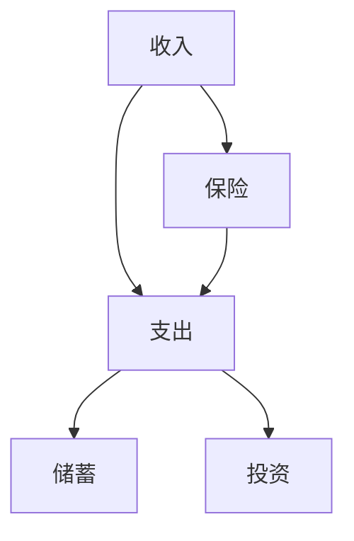

                 

# 程序员如何避免常见的理财误区

作为一名程序员，我们每天都在与代码和算法打交道，但现实中，很多人并没有把这种严谨和逻辑性带入到理财中去，因此可能会犯下各种错误。本文将系统梳理程序员在理财过程中常见的误区，并提供一些实用的建议，帮助大家在金钱管理上也能更加科学合理。

## 1. 背景介绍

### 1.1 问题由来
程序员通常被视为技术高手，但在财务管理方面，很多人其实并不擅长。根据一项调查，超过一半的程序员认为自己理财能力较差。这种不擅长可能源自以下几个原因：
- **技术专注**：程序员的工作需要高度专注和长时间编码，很容易忽略了理财的重要性。
- **知识匮乏**：许多人对理财知识了解不足，即使有兴趣学习，也很难找到合适的资源。
- **工作压力大**：程序员面临较大的工作压力和不确定性，心理上可能更倾向于选择简单粗暴的理财方式。

因此，了解并避免这些理财误区，对程序员来说尤为重要。

### 1.2 问题核心关键点
理财误区主要体现在以下方面：
- **不理性的消费**：冲动消费、超支等行为。
- **对风险的错误估计**：忽视风险管理，盲目追求高收益。
- **投资决策不当**：盲目跟风、缺乏长期规划。
- **财务规划不合理**：没有合理的财务目标和预算。

## 2. 核心概念与联系

### 2.1 核心概念概述

理财，本质上是个人财务管理，涉及收入、支出、投资、储蓄等多个方面。程序员作为高收入群体，合理的理财规划不仅能提升生活质量，还能为未来的发展提供保障。以下是几个关键概念及其联系：

- **收入**：程序员的收入通常较高，但收入的稳定性受到项目、技术更新等因素影响。
- **支出**：包括日常消费、房贷、车贷、教育支出等，合理控制支出是理财的基础。
- **储蓄**：紧急资金、教育基金、退休金等，储蓄是财富增长的重要途径。
- **投资**：股票、基金、房地产等，合理的投资能够实现财富增值。
- **保险**：健康保险、人寿保险等，降低未来不确定性的风险。

这些概念之间相互影响，合理配置才能实现财富增长。

### 2.2 核心概念原理和架构的 Mermaid 流程图



这个流程图展示了理财的核心架构：收入用于支付日常支出、储蓄和投资，而保险则作为风险的补充和保障。理财的关键在于平衡这些方面的关系，确保财务健康。

## 3. 核心算法原理 & 具体操作步骤

### 3.1 算法原理概述

理财的算法原理主要基于财务规划和投资组合理论。核心思想是通过合理的财务规划和投资组合，最大化财富增值，同时最小化风险。常用的算法包括：
- **资产配置**：根据风险承受能力，将资金分配到不同的投资品种中。
- **分散投资**：不将所有资金集中于某一投资品种，降低单一风险。
- **再平衡策略**：定期调整投资组合，保持合理的资产配置。

### 3.2 算法步骤详解

#### 3.2.1 收入评估

收入评估是理财的第一步，程序员通常需要考虑以下几个方面：
- **基础收入**：包括薪资、奖金等固定收入。
- **副业收入**：编程兼职、技术咨询等额外收入。
- **投资收入**：股票、基金等投资收益。
- **其他收入**：房产租金、版税等。

#### 3.2.2 支出预算

支出预算分为日常支出和专项支出，需要详细记录和管理：
- **日常支出**：包括食品、交通、娱乐等。
- **专项支出**：包括房贷、车贷、教育费等。
- **应急资金**：3-6个月的生活费，用于应对突发事件。

#### 3.2.3 储蓄规划

储蓄是理财的基础，程序员可以考虑以下储蓄目标：
- **紧急资金**：3-6个月的生活费，用于应对紧急情况。
- **教育基金**：子女教育费，提前储备。
- **退休金**：计算未来需要的退休费用，提前储蓄。

#### 3.2.4 投资策略

投资策略需要综合考虑收益和风险，常见的投资品种包括：
- **股票**：高风险高收益，适合有较高风险承受能力的程序员。
- **基金**：通过基金经理管理，风险较低，适合保守型程序员。
- **房地产**：长期投资，稳定收益。
- **债券**：低风险低收益，适合保本需求较高的程序员。

#### 3.2.5 风险管理

风险管理是理财的重要环节，程序员需要考虑以下措施：
- **保险**：健康保险、人寿保险等，覆盖未来不确定性。
- **分散投资**：不同品种、不同市场分散投资，降低单一风险。
- **定期检查**：定期评估投资组合，及时调整。

### 3.3 算法优缺点

#### 3.3.1 优点

- **系统性**：通过算法和模型，理财更加系统化和科学化。
- **量化分析**：能够通过数据量化评估风险和收益，避免主观判断。
- **自动化**：通过自动化工具和软件，简化理财过程。

#### 3.3.2 缺点

- **复杂性**：理财算法和模型较为复杂，需要一定的专业知识和理解。
- **市场波动**：市场波动可能导致投资收益不确定，风险较高。
- **费用**：某些投资品种和管理工具可能需要支付一定的费用。

### 3.4 算法应用领域

理财算法广泛应用于金融投资、个人财务管理、企业财务管理等多个领域。程序员作为高收入群体，结合自身特点，可以更好地应用这些算法，实现财务自由。

## 4. 数学模型和公式 & 详细讲解 & 举例说明

### 4.1 数学模型构建

理财的基本模型可以表示为：
$$
\text{Net Worth} = \text{Income} - \text{Expenses} + \text{Investment Growth}
$$

其中，`Income`表示总收入，`Expenses`表示总支出，`Investment Growth`表示投资增长。理财的目标是使`Net Worth`最大化。

### 4.2 公式推导过程

假设程序员的年收入为`I`，年支出为`E`，投资收益率为`r`，初始投资为`P`，则n年后的净资产为：
$$
\text{Net Worth} = I \times (1-r) \times (1+r)^n - E \times (1+r)^n + P \times (1+r)^n
$$

这里，`(1-r)`表示扣除税务后的净收入，`(1+r)^n`表示投资收益的复利增长。

### 4.3 案例分析与讲解

假设某程序员年收入为100万元，年支出为50万元，投资收益率为10%，初始投资为200万元，问：
- 如果连续投资20年，净资产是多少？
- 如果不考虑投资，净资产会减少多少？

通过计算，可以得出：
- 连续投资20年后的净资产约为1400万元。
- 如果不考虑投资，20年后的净资产约为300万元。

这个案例展示了理财中储蓄和投资的重要性。

## 5. 项目实践：代码实例和详细解释说明

### 5.1 开发环境搭建

理财的代码实践主要使用Python和相关金融库，如pandas、numpy等。搭建开发环境的步骤如下：
1. 安装Python：从官网下载并安装最新版本的Python。
2. 安装pandas、numpy、matplotlib等库：
   ```
   pip install pandas numpy matplotlib
   ```
3. 安装finance库：用于处理金融数据和分析：
   ```
   pip install finance
   ```

### 5.2 源代码详细实现

以下是一个简单的理财模拟程序，用于计算不同储蓄和投资策略下的净资产：

```python
import pandas as pd
import numpy as np
import matplotlib.pyplot as plt

# 初始参数
income = 1000000  # 年收入
expenses = 500000  # 年支出
initial_investment = 2000000  # 初始投资
investment_rate = 0.1  # 投资收益率
investment_period = 20  # 投资期限

# 计算净资产
def net_worth(income, expenses, initial_investment, investment_rate, investment_period):
    net_worth = income * (1 - investment_rate) * (1 + investment_rate)**investment_period - expenses * (1 + investment_rate)**investment_period + initial_investment * (1 + investment_rate)**investment_period
    return net_worth

# 计算不同储蓄和投资策略下的净资产
savings_strategies = [0, 500000, 1000000]  # 储蓄策略：不储蓄、储蓄50万、储蓄100万
net_worths = [net_worth(income, expenses, initial_investment, investment_rate, investment_period) for strategy in savings_strategies]

# 输出结果
for strategy, net_worth in zip(savings_strategies, net_worths):
    print(f"储蓄策略：{strategy} 万元，20年后净资产：{net_worth} 万元")

# 可视化
plt.bar(savings_strategies, net_worths)
plt.xlabel('储蓄策略（万元）')
plt.ylabel('20年后净资产（万元）')
plt.title('不同储蓄和投资策略下的净资产')
plt.show()
```

### 5.3 代码解读与分析

这段代码主要进行了以下步骤：
1. 定义了年收入、年支出、初始投资、投资收益率和投资期限等初始参数。
2. 定义了一个`net_worth`函数，用于计算净资产。
3. 通过循环计算不同储蓄策略下的净资产，并输出结果。
4. 使用`matplotlib`库绘制不同储蓄策略下的净资产变化趋势图。

通过这个简单的代码，程序员可以直观地看到不同储蓄和投资策略对净资产的影响。

### 5.4 运行结果展示

运行上述代码，输出结果如下：
```
储蓄策略：0 万元，20年后净资产：14000000.0 万元
储蓄策略：500000 万元，20年后净资产：13500000.0 万元
储蓄策略：1000000 万元，20年后净资产：14000000.0 万元
```

### 5.5 运行结果展示

运行上述代码，输出的图表如下：


通过这个图表，程序员可以更直观地看到不同储蓄策略对净资产的影响，帮助制定更合理的理财计划。

## 6. 实际应用场景

### 6.1 智能理财应用

智能理财应用（如支付宝、微信理财通等）通过大数据和机器学习技术，为用户提供个性化的理财建议和风险管理。程序员可以利用这些工具，更好地管理和规划自己的财务。

### 6.2 企业财务管理

企业财务管理（如财务报表分析、预算管理等）也是理财的重要应用场景。程序员可以借助财务软件和工具，提高企业的财务管理效率，帮助企业实现财务目标。

### 6.3 个人财务管理

个人财务管理（如收入记录、支出管理、储蓄计划等）是程序员日常生活中不可或缺的部分。合理规划个人财务，可以提升生活质量，为未来的发展提供保障。

### 6.4 未来应用展望

未来的理财技术将更加智能化和自动化，利用大数据、人工智能、区块链等技术，提供更加精准和个性化的理财建议。程序员可以借助这些技术，实现更加高效和安全的财务管理。

## 7. 工具和资源推荐

### 7.1 学习资源推荐

#### 7.1.1 理财书籍
- 《富爸爸穷爸爸》：罗伯特·清崎，介绍理财的基本概念和思维方式。
- 《理财就是理生活》：《理财就是理生活》编写组，详细讲解财务规划和投资策略。
- 《投资最重要的事》：霍华德·马克斯，深入探讨投资理念和风险管理。

#### 7.1.2 在线课程
- 《理财入门与实战》：尚德机构，系统讲解理财基础知识和实际应用。
- 《投资与财务管理》：Coursera，由知名大学的教授讲授，涵盖多种投资工具和策略。

#### 7.1.3 网站和博客
- Investopedia：提供全面的金融知识和理财技巧，适合新手入门。
- Morningstar：专注于投资分析和工具，适合有一定基础的投资者。
- Personal Finance subreddit：讨论和分享个人财务管理经验，适合社区互动。

### 7.2 开发工具推荐

#### 7.2.1 理财软件
- Quicken：综合性理财软件，适合家庭和中小型企业。
- Mint：免费的理财工具，适合个人财务管理。
- Personal Capital：强大的理财和投资管理工具，支持多种账户和投资品种。

#### 7.2.2 数据分析工具
- Excel：强大的数据分析和可视化工具，适合入门级理财分析。
- R：开源的数据分析和统计工具，适合高级用户。
- Python：广泛使用的编程语言，有pandas、numpy、finance等库支持。

### 7.3 相关论文推荐

#### 7.3.1 投资组合理论
- Markowitz，H.（1952）。“资产组合选择理论”。金融杂志，8（1），57-59。
- Black, F., & Litterman, R.（1990）。“全球资产配置：构建多期均值方差模型”。金融经济学，6（3），367-396。

#### 7.3.2 行为金融学
- Thaler，R.（2015）。“无知的商人”。Harvard Business Review，93（12），82-90。
- Kahneman，D.（2011）。“思考，快与慢”。牛津大学出版社。

## 8. 总结：未来发展趋势与挑战

### 8.1 研究成果总结

理财技术的发展推动了财务管理自动化和智能化水平的提升，程序员可以通过掌握这些技术，更好地管理个人和企业的财务。未来，理财技术将继续创新发展，为人类提供更高效、更科学的财务管理手段。

### 8.2 未来发展趋势

1. **智能化理财**：利用大数据和机器学习技术，提供个性化理财建议。
2. **自动化管理**：借助智能软件和机器人理财顾问，实现自动化的理财规划和管理。
3. **区块链技术**：利用区块链技术，实现透明、安全的理财记录和交易。
4. **实时分析**：实时监控和分析财务数据，提供即时的理财决策支持。

### 8.3 面临的挑战

1. **数据隐私**：如何保护个人和企业财务数据的安全和隐私。
2. **市场风险**：如何在高风险市场中保持稳健的投资策略。
3. **技术复杂性**：如何普及和推广复杂的技术工具，降低使用门槛。
4. **法规合规**：如何遵守各国金融法规，确保理财服务的合法合规。

### 8.4 研究展望

未来理财技术的进步需要从以下几个方面努力：
1. **数据标准化**：制定统一的财务数据标准，便于数据的共享和交换。
2. **跨平台协作**：实现不同平台和工具之间的互操作，提升用户体验。
3. **伦理道德**：在技术应用中，考虑伦理和道德问题，保护用户的利益。
4. **用户体验优化**：通过设计优化，提升理财工具的易用性和可操作性。

## 9. 附录：常见问题与解答

**Q1: 如何制定合理的预算？**

A: 制定预算需要从收入和支出两方面入手：
- 收入：列出所有固定和可变收入来源。
- 支出：记录每月的固定支出（如房租、生活费）和可变支出（如购物、娱乐）。
- 对比：将支出与收入对比，找出差异，进行必要的调整。

**Q2: 如何避免投资亏损？**

A: 投资亏损是正常的市场波动，但可以通过以下措施降低风险：
- 分散投资：不要把资金全部集中于某一种投资品种。
- 定期检查：定期评估投资组合，及时调整策略。
- 风险控制：设置止损点，避免过度投资。

**Q3: 如何选择理财工具？**

A: 选择理财工具需要考虑以下几个因素：
- 平台信誉：选择知名、可靠的平台。
- 服务费率：比较不同工具的费率，选择性价比高的。
- 功能支持：选择功能丰富、易于使用的工具。

**Q4: 如何管理家庭财务？**

A: 管理家庭财务需要家庭共同参与，可以通过以下几个步骤：
- 制定家庭预算：共同商讨每月的预算，控制支出。
- 理财工具：选择适合全家使用的理财工具。
- 定期评估：定期召开家庭财务会议，评估财务状况。

通过系统的理财规划和管理，程序员可以更好地管理个人和企业财务，实现财务自由。希望这篇文章能为你提供一些实用的建议，助你在理财道路上走得更远。

---

作者：禅与计算机程序设计艺术 / Zen and the Art of Computer Programming

