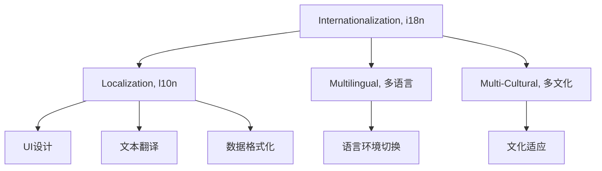

                 

# 程序员的全球化视野：机遇与挑战

## 1. 背景介绍

全球化视野是当今世界许多行业中的重要概念，尤其在软件开发和技术领域中，全球化不仅意味着软件产品的国际化，还涉及到软件开发的国际化。程序员拥有全球化视野，意味着他们能够理解和适应不同的文化、语言和技术环境，并能在全球范围内开展工作。全球化视野也促进了技术交流和合作，有助于软件产品和技术的普及和传播。

### 1.1 全球化视野的必要性

全球化视野对程序员的重要性体现在多个方面：

- **国际交流与合作**：全球化视野使程序员能够更好地与国际同行沟通合作，分享技术经验和最佳实践，促进全球技术进步。
- **多元文化理解**：理解不同文化背景下的用户需求和技术限制，有助于设计更加符合全球用户习惯的产品。
- **语言技能**：掌握多种编程语言和技术栈，能够提高在多国开发项目中的灵活性和适应性。
- **市场拓展**：具备全球化视野的程序员能够识别和利用全球市场机会，推动软件产品和技术的国际扩展。

### 1.2 全球化视野的挑战

虽然全球化视野具有诸多优势，但也面临着一些挑战：

- **文化差异**：不同国家和地区的文化差异可能导致沟通障碍和理解偏差。
- **技术多样性**：全球技术栈和技术标准的差异增加了学习和适应新技术的难度。
- **时差与协作**：跨越多个时区进行协作，需要协调不同团队的工作时间。
- **本地化需求**：了解并满足不同地区的用户需求，增加了产品的本地化工作量。

## 2. 核心概念与联系

### 2.1 核心概念概述

理解全球化视野的核心概念，有助于程序员更好地适应全球化工作环境。以下是几个关键概念：

- **国际化（Internationalization, i18n）**：将软件设计为能够适应不同语言和地区特性的技术过程。
- **本地化（Localization, l10n）**：将国际化软件产品适配到特定地区文化和语言环境的过程。
- **多语言（Multi-Language）**：软件产品支持多种语言的特性。
- **多文化（Multi-Cultural）**：软件产品尊重并支持不同文化习惯的特性。

这些概念之间的关系可以通过以下Mermaid流程图来展示：



这个流程图展示了国际化、本地化和多语言、多文化之间的关系：国际化是基础，本地化是在国际化基础上适配特定地区的文化和语言，多语言和多文化是在这些基础上支持多种语言和文化。

### 2.2 核心概念原理和架构

**国际化（i18n）**：
- **原理**：i18n的目的是使软件能够支持多种语言环境，通常通过使用Unicode字符集、语言环境检测、字符串国际化等技术实现。
- **架构**：i18n通常涉及前端和后端的共同设计，前端负责展示国际化的UI元素和文本，后端负责处理语言环境检测和字符串翻译。

**本地化（l10n）**：
- **原理**：l10n是在国际化基础上，针对特定地区文化和语言环境进行的适配。通常包括UI设计、文本翻译和数据格式化。
- **架构**：l10n通常包括本地化工具和流程，如CAT工具、翻译记忆库、本地化测试等。

**多语言（Multilingual）**：
- **原理**：多语言支持是一种能够显示和处理多种语言文本的特性。通常通过资源文件、语言包和UI元素适配等方式实现。
- **架构**：多语言通常涉及资源文件管理、语言包配置和UI元素动态加载等。

**多文化（Multi-Cultural）**：
- **原理**：多文化支持是指软件产品能够尊重和支持不同文化背景用户的需求，如日期格式、货币单位、节日设定等。
- **架构**：多文化通常涉及文化敏感数据管理和文化特定功能设计。

## 3. 核心算法原理 & 具体操作步骤

### 3.1 算法原理概述

全球化视野的应用涉及到多个层面的算法和操作步骤，包括国际化、本地化、多语言和多文化的设计和实现。

### 3.2 算法步骤详解

以下是一个简单的国际化流程示例，包括步骤和原理：

**步骤1：确定国际化需求**
- **原理**：明确软件产品需要支持的语言和地区，分析用户需求和使用场景。
- **操作步骤**：调查目标市场和用户群体，确定需要支持的地区和语言。

**步骤2：设计国际化架构**
- **原理**：设计支持多语言和多文化的软件架构，确保代码的可扩展性和可维护性。
- **操作步骤**：
  - 使用资源文件管理字符串和文本。
  - 设计UI元素和数据格式支持多种文化。
  - 实现语言环境检测和切换机制。

**步骤3：进行本地化适配**
- **原理**：将国际化软件适配到特定地区文化和语言环境，以提供最佳用户体验。
- **操作步骤**：
  - 翻译UI元素和文本。
  - 适配日期格式、货币单位等本地化需求。
  - 进行本地化测试，确保产品适应特定地区环境。

**步骤4：实现多语言和多文化支持**
- **原理**：通过资源文件和语言包，实现多语言和多文化的展示和处理。
- **操作步骤**：
  - 创建多语言资源文件和语言包。
  - 设计动态UI元素加载机制。
  - 实现文化敏感数据的处理和展示。

### 3.3 算法优缺点

全球化视野下的开发方法具有以下优点：

- **灵活性**：能够支持多种语言和文化，满足全球用户需求。
- **用户体验**：提供本地化适配，提升用户满意度和使用体验。
- **市场拓展**：适应全球市场，促进产品国际化。

但同时，也存在以下缺点：

- **开发复杂度增加**：需要进行国际化和本地化适配，增加了开发和维护的复杂度。
- **成本增加**：需要额外的时间和资源进行本地化测试和适配。
- **语言和文化的理解难度**：需要深入了解不同语言和文化背景，可能增加沟通和理解的难度。

### 3.4 算法应用领域

全球化视野的应用不仅限于软件开发，还广泛涉及多个领域：

- **Web开发**：国际化Web应用，支持多语言和多文化的Web站点。
- **移动应用**：国际化移动应用，支持不同地区语言和文化的移动设备。
- **游戏开发**：国际化游戏，支持多种语言和文化的游戏内容。
- **电子商务**：国际化电子商务平台，支持全球支付和物流。
- **企业软件**：国际化企业系统，支持全球员工和文化。

## 4. 数学模型和公式 & 详细讲解 & 举例说明

### 4.1 数学模型构建

为了更好地理解国际化、本地化和多语言、多文化的实现原理，我们需要构建一些数学模型。以下是一个简单的国际化模型示例：

假设我们有一个文本字符串 $T$，需要在两种语言 $L_1$ 和 $L_2$ 中进行展示。我们定义 $T_{L_1}$ 和 $T_{L_2}$ 分别表示在语言 $L_1$ 和 $L_2$ 中的文本字符串。

**数学模型**：
$$
T_{L_1} = T_{L_2} = T
$$

### 4.2 公式推导过程

在上述模型中，$T$ 是原始文本，$T_{L_1}$ 和 $T_{L_2}$ 是在不同语言中的展示文本。在国际化过程中，我们需要将 $T$ 转换为 $T_{L_1}$ 和 $T_{L_2}$。

**公式推导**：
$$
T_{L_1} = \text{translate}(T, L_1)
$$
$$
T_{L_2} = \text{translate}(T, L_2)
$$

其中 $\text{translate}$ 表示文本翻译函数，将原始文本 $T$ 翻译为特定语言 $L_1$ 或 $L_2$ 的展示文本。

### 4.3 案例分析与讲解

**案例**：国际化电商网站的设计

**分析**：
- **需求**：电商网站需要支持中文和英文两种语言。
- **设计**：
  - 使用资源文件管理两种语言的文本。
  - 设计UI元素适配两种语言和文化的展示。
  - 实现语言环境检测和切换机制。

**讲解**：
- **文本翻译**：使用CAT工具将电商网站的所有文本翻译成中文和英文。
- **UI设计**：设计两种语言环境的UI元素，如按钮、标题等，确保在不同语言中展示一致。
- **本地化测试**：在两种语言环境下进行测试，确保网站功能正常，用户友好。

## 5. 项目实践：代码实例和详细解释说明

### 5.1 开发环境搭建

为了进行国际化开发，我们需要安装一些必要的开发工具和库：

1. **开发环境**：
   - 安装Python和相关库，如Flask、Django等Web开发框架。
   - 安装资源文件管理库，如gettext、pygettext等。

2. **本地化支持**：
   - 安装本地化工具，如GetText、Poedit等。
   - 配置翻译记忆库，如MO文件等。

### 5.2 源代码详细实现

以下是一个简单的Web应用国际化示例，包括代码实现和解释：

```python
# 导入Flask框架
from flask import Flask, render_template, request

# 创建Flask应用实例
app = Flask(__name__)

# 加载资源文件
locales = {
    'zh_CN': 'zh_CN.LibChinese(pymtnez=3.4.2).pot',
    'en_US': 'en_US.pot'
}

# 获取当前语言环境
language = request.accept_languages.best_match(locales.keys())

# 加载翻译文件
translator = gettext.translation.load(locales[language], fallback=True)

# 定义路由
@app.route('/')
def index():
    # 加载UI元素翻译
    title = translator.gettext('欢迎来到电商网站')
    description = translator.gettext('这是一个国际化电商网站')
    # 渲染页面
    return render_template('index.html', title=title, description=description)

# 启动应用
if __name__ == '__main__':
    app.run(debug=True)
```

### 5.3 代码解读与分析

**代码解释**：
- **Flask框架**：用于创建Web应用，提供路由和渲染功能。
- **资源文件管理**：使用gettext库加载翻译文件，提供UI元素翻译功能。
- **路由处理**：定义路由函数，加载并渲染国际化UI元素。

**分析**：
- **文本翻译**：使用gettext库加载翻译文件，确保UI元素在不同语言环境下展示一致。
- **本地化适配**：通过UI元素翻译，满足不同语言用户的需求。
- **语言环境检测**：使用请求头获取当前语言环境，确保UI展示符合用户期望。

### 5.4 运行结果展示

运行上述代码，在浏览器中输入不同语言环境下的URL，展示国际化UI元素：

```
http://localhost:5000/zh_CN
http://localhost:5000/en_US
```

## 6. 实际应用场景

### 6.1 国际化电子商务

国际化电子商务平台是全球化视野应用的典型场景之一。电商网站需要支持全球用户，提供多语言和多文化的购物体验。

**示例**：
- **多语言支持**：在网站中展示所有产品的多语言描述，支持用户选择不同语言。
- **本地化适配**：根据不同地区的货币单位和支付方式，提供本地化支付选项。
- **文化适应**：根据不同地区的文化和习俗，设计商品展示和购物流程。

**挑战**：
- **语言翻译**：需要翻译大量的产品描述和用户界面。
- **本地化适配**：需要根据不同地区的文化习惯，适配商品展示和购物流程。
- **时区管理**：需要处理不同地区的时差，确保产品功能正常。

### 6.2 跨国公司企业软件

跨国公司的企业软件系统需要支持全球员工，提供多语言和多文化的办公环境。

**示例**：
- **多语言支持**：支持多种语言的企业通讯工具，如邮件、即时通讯等。
- **本地化适配**：根据不同地区的法律和文化，设计企业流程和规则。
- **文化适应**：支持不同地区的节假日和休假政策。

**挑战**：
- **多语言支持**：需要支持多种语言的文档和通讯工具。
- **本地化适配**：需要根据不同地区的法律和文化，调整企业流程和规则。
- **文化适应**：需要支持不同地区的节假日和休假政策，确保员工权益。

### 6.3 国际化移动应用

国际化移动应用需要在全球范围内提供一致的用户体验，支持多种语言和文化。

**示例**：
- **多语言支持**：在移动应用中展示所有功能的多种语言版本。
- **本地化适配**：根据不同地区的文化习惯，调整应用的UI和功能。
- **文化适应**：支持不同地区的货币单位和支付方式。

**挑战**：
- **多语言支持**：需要支持多种语言的资源文件和UI元素。
- **本地化适配**：需要根据不同地区的文化习惯，调整应用的UI和功能。
- **文化适应**：需要支持不同地区的货币单位和支付方式。

## 7. 工具和资源推荐

### 7.1 学习资源推荐

为了帮助程序员掌握全球化视野，以下是一些推荐的学习资源：

1. **《Web国际化指南》（《Web Internationalization and Localization》）**：介绍了Web国际化技术和最佳实践，适合Web开发工程师参考。
2. **《软件国际化设计》（《Software Internationalization Design》）**：讲解了软件国际化的设计原理和实现方法，适合软件工程师参考。
3. **《Python国际化开发》（《Python Internationalization Development》）**：详细介绍了使用Python进行国际化开发的技巧和工具，适合Python开发工程师参考。
4. **Coursera《国际化软件开发》课程**：提供全球化视野的全面课程，适合编程学习者和软件开发工程师参考。

### 7.2 开发工具推荐

以下是一些常用的开发工具和库，可以帮助程序员进行国际化开发：

1. **Flask和Django**：常用的Web开发框架，支持国际化特性。
2. **gettext和pygettext**：Python的资源文件管理库，支持多语言翻译。
3. **i18next**：一个JavaScript库，支持多语言翻译和本地化。
4. **React-Intl**：一个React库，支持国际化UI元素展示和格式化。

### 7.3 相关论文推荐

以下是几篇关于国际化、本地化和全球化视野的重要论文，推荐阅读：

1. **《Web国际化和本地化》**：详细介绍了Web国际化技术和实践，适合Web开发工程师参考。
2. **《软件国际化设计》**：讲解了软件国际化的设计原理和实现方法，适合软件工程师参考。
3. **《Python国际化开发》**：详细介绍了使用Python进行国际化开发的技巧和工具，适合Python开发工程师参考。

## 8. 总结：未来发展趋势与挑战

### 8.1 研究成果总结

本文介绍了全球化视野的基本概念、核心算法原理和具体操作步骤，并通过代码实例和实际应用场景展示了其应用效果。

### 8.2 未来发展趋势

全球化视野在未来将呈现以下几个发展趋势：

- **技术进步**：随着国际化技术和工具的不断进步，全球化视野的应用将更加广泛和高效。
- **文化融合**：全球化视野将促进不同文化背景下的技术交流和融合，推动全球技术的发展。
- **应用场景**：全球化视野将应用于更多行业和领域，如电商、企业软件、移动应用等。
- **数据和AI**：全球化视野将与大数据和人工智能技术结合，推动全球化视野的智能化应用。

### 8.3 面临的挑战

尽管全球化视野具有广泛的应用前景，但也面临着一些挑战：

- **技术复杂性**：国际化开发需要处理多语言和多文化，增加了开发复杂性。
- **资源消耗**：国际化开发需要额外的时间和资源进行翻译和本地化适配。
- **文化理解**：需要深入了解不同文化背景下的用户需求和技术限制。

### 8.4 研究展望

未来，全球化视野的研究将进一步深入，主要方向包括：

- **智能化**：结合大数据和人工智能技术，提升全球化视野的智能化水平。
- **自动化**：开发自动化工具和流程，减少人工干预和重复工作。
- **跨领域应用**：将全球化视野应用到更多行业和领域，推动技术进步和创新。
- **文化适应**：增强全球化视野对不同文化背景的适应能力，提升用户满意度。

## 9. 附录：常见问题与解答

### 9.1 常见问题解答

**Q1：如何进行国际化开发？**

A: 国际化开发需要考虑以下几个步骤：
- **需求分析**：确定需要支持的地区和语言。
- **设计架构**：设计支持多语言和多文化的软件架构。
- **本地化适配**：进行文本翻译和UI适配。
- **测试和发布**：进行本地化测试，确保产品适应特定地区环境。

**Q2：如何选择国际化和本地化工具？**

A: 选择国际化和本地化工具需要考虑以下几个因素：
- **功能完备性**：工具是否支持多语言翻译和本地化适配。
- **易用性**：工具是否易用，适合团队使用。
- **性能和扩展性**：工具的性能和扩展性是否满足项目需求。
- **社区支持**：工具是否有活跃的社区和文档支持。

**Q3：如何处理多语言和多文化的本地化需求？**

A: 处理多语言和多文化的本地化需求需要考虑以下几个方面：
- **翻译管理**：使用CAT工具管理翻译资源，确保翻译质量。
- **UI设计**：设计支持多语言和多文化的UI元素，确保一致性。
- **文化适应**：考虑不同地区的文化习惯，调整产品功能和展示。

**Q4：如何进行本地化测试？**

A: 本地化测试需要考虑以下几个方面：
- **功能测试**：测试产品功能是否在特定语言环境下正常工作。
- **UI测试**：测试UI元素展示是否符合用户预期。
- **性能测试**：测试产品性能是否满足特定地区的需求。

总之，全球化视野的应用需要综合考虑技术、文化和用户体验等多个方面，通过合理设计和实践，才能实现良好的国际化效果。

