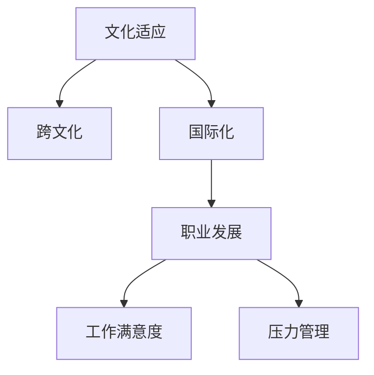

                 

# 程序员的国际化发展：文化适应

> 关键词：国际化, 跨文化, 文化适应, 程序员, 技术, 发展

## 1. 背景介绍

### 1.1 问题由来

随着全球化和技术的发展，程序员的国际化趋势日益明显。许多公司尤其是跨国企业，需要其工程师能够应对不同文化和语言环境的挑战。然而，文化适应对于程序员来说并不容易，尤其是在适应新环境的过程中可能会遇到诸多挑战。本论文旨在探讨文化适应对程序员职业发展的影响，并提出有效适应策略，以便在全球化背景下取得成功。

### 1.2 问题核心关键点

文化适应对程序员的影响主要体现在以下几个方面：

- **语言障碍**：不同语言环境中程序员需要进行语言学习和沟通，这要求他们必须具备良好的语言适应能力。
- **工作习惯**：不同文化背景下的工作习惯差异，例如工作时间、会议方式等，需要程序员快速调整。
- **团队合作**：跨文化团队的协作要求程序员具备良好的沟通和团队合作能力，尤其在团队文化不同时。
- **业务需求**：不同地区对技术的不同需求和期望，要求程序员具备快速适应和调整的能力。

## 2. 核心概念与联系

### 2.1 核心概念概述

为更好地理解文化适应对程序员职业发展的影响，本节将介绍几个密切相关的核心概念：

- **文化适应**：指的是个体在移入或接触不同文化环境时，主动改变自己的态度和行为，以达到与新文化相协调的过程。
- **跨文化**：涉及不同文化背景下的交流、合作与冲突管理。
- **全球化**：指全球范围内的经济、政治、文化等多方面的交流与融合。
- **国际化**：指公司或个人在全球范围内开展业务或活动，通常涉及语言、文化、法律等多方面的适应。
- **职业发展**：程序员在职业生涯中不断提升技能、扩展知识和经验的过程。
- **工作满意度**：个体对自己工作的满意程度，影响其工作效率和生活质量。
- **压力管理**：在文化适应过程中，克服压力，保持积极心态和高效工作的能力。

这些核心概念之间的逻辑关系可以通过以下Mermaid流程图来展示：



这个流程图展示了大语言模型微调的核心概念及其之间的关系：

1. 文化适应是程序员在全球化背景下必须面对的重要课题。
2. 跨文化沟通和合作是文化适应的核心要素。
3. 国际化拓展了程序员的职业发展空间。
4. 职业发展和工作满意度密切相关，而工作满意度又受到文化适应的影响。
5. 压力管理是文化适应过程中需要特别关注的方面。

这些概念共同构成了程序员国际化发展的框架，使得程序员在全球化背景下能够更好地适应和成长。

## 3. 核心算法原理 & 具体操作步骤

### 3.1 算法原理概述

文化适应的过程可以看作是一种动态的系统调整过程，即通过不断学习和适应新的文化环境，优化个人行为和态度，以实现与新环境的和谐共处。具体而言，文化适应过程可以分解为以下几个阶段：

1. **感知阶段**：个体通过观察和感知新的文化环境，识别出与原文化环境的差异。
2. **认知阶段**：个体对差异进行认知和理解，形成对新文化的初步认识。
3. **调整阶段**：个体根据对新文化的认知，调整自己的行为和态度，以适应新的文化环境。
4. **融合阶段**：个体在新文化环境中不断适应和融入，达到高度协调。

### 3.2 算法步骤详解

基于文化适应的动态系统调整过程，文化适应算法的步骤可以归纳为以下几步：

**Step 1: 感知文化差异**

1. **收集信息**：通过调查问卷、访谈、观察等方式收集有关新文化的信息，包括语言、工作习惯、法律法规等。
2. **分析差异**：对比原文化环境和新文化环境的差异，识别出需要特别关注的领域。

**Step 2: 认知文化特征**

1. **理解文化价值观**：理解新文化中的核心价值观和行为规范。
2. **学习语言和沟通技巧**：提高语言能力和沟通技巧，以确保有效交流。

**Step 3: 调整行为和态度**

1. **调整工作习惯**：根据新文化的工作方式调整自己的工作习惯，如工作时间、会议方式等。
2. **建立信任和合作关系**：通过建立信任和合作关系，提高团队协作效率。

**Step 4: 融合与反馈**

1. **持续学习与适应**：在新文化环境中持续学习和适应，不断调整行为和态度。
2. **定期反馈与调整**：通过定期反馈和调整，及时纠正适应过程中的偏差。

### 3.3 算法优缺点

文化适应算法具有以下优点：

- **系统性**：通过系统的步骤和方法，确保适应过程的有序进行。
- **可操作性**：每一步都具有具体的操作方法和技巧，便于实践。
- **灵活性**：可以根据具体情况进行灵活调整，适应不同的文化环境。

同时，该算法也存在一定的局限性：

- **复杂性**：不同文化间的差异较大时，适应过程可能复杂且耗时。
- **个体差异**：适应能力和速度存在个体差异，需要根据个体情况进行个性化调整。
- **外部因素**：新文化环境的变化可能影响适应过程，需要持续跟踪和调整。

### 3.4 算法应用领域

文化适应算法广泛应用于全球化背景下的各行各业，特别是跨国企业和国际化项目的开发中。例如：

- **跨国公司**：其员工需要在不同国家或地区工作，文化适应对提升工作效率和团队合作至关重要。
- **国际项目**：在跨文化团队合作的项目中，文化适应能够确保项目顺利进行。
- **技术交流**：在技术交流与合作过程中，文化适应能够促进知识和技术的传播与共享。
- **教育培训**：在全球化背景下，文化适应能够帮助学生更好地适应多元文化的学习环境。

## 4. 数学模型和公式 & 详细讲解

### 4.1 数学模型构建

文化适应过程可以建模为一个动态系统，即：

\[
\text{Adaptability} = f(\text{Environment}, \text{Personality}, \text{Behavior}, \text{Time})
\]

其中，$\text{Adaptability}$ 表示文化适应能力，$\text{Environment}$ 表示文化环境，$\text{Personality}$ 表示个体性格，$\text{Behavior}$ 表示个体行为，$\text{Time}$ 表示适应时间。

### 4.2 公式推导过程

假设 $E_t$ 表示第 $t$ 时刻的环境状态，$P_t$ 表示个体的性格特征，$B_t$ 表示个体行为表现，$T_t$ 表示适应时间，则文化适应过程可以表示为：

\[
P_{t+1} = P_t \times f(\text{Environment}, \text{Behavior}, \text{Time})
\]

其中 $f$ 表示适应函数，反映了环境、性格、行为和时间对个体性格特征的影响。

### 4.3 案例分析与讲解

以一个跨国公司员工适应新文化环境为例：

1. **环境**：假设新文化环境为美国，原文化环境为中国。
2. **性格**：该员工性格外向、适应性强。
3. **行为**：初始行为表现为工作时间短、交流方式含蓄。
4. **时间**：适应时间为 3 个月。

通过分析 $f$ 函数，可以得出该员工在适应过程中的性格变化：

\[
P_{t+1} = P_t \times f(\text{Environment}, \text{Behavior}, \text{Time})
\]

即该员工性格变得更加开放、直接，工作时间变长，交流方式变得更加直接。通过持续适应，最终达到与新文化环境的高度协调。

## 5. 项目实践：代码实例和详细解释说明

### 5.1 开发环境搭建

在进行文化适应实践前，我们需要准备好开发环境。以下是使用Python进行项目开发的环境配置流程：

1. 安装Anaconda：从官网下载并安装Anaconda，用于创建独立的Python环境。

2. 创建并激活虚拟环境：
```bash
conda create -n adapt_env python=3.8 
conda activate adapt_env
```

3. 安装PyTorch：根据CUDA版本，从官网获取对应的安装命令。例如：
```bash
conda install pytorch torchvision torchaudio cudatoolkit=11.1 -c pytorch -c conda-forge
```

4. 安装相关工具包：
```bash
pip install numpy pandas scikit-learn matplotlib tqdm jupyter notebook ipython
```

完成上述步骤后，即可在`adapt_env`环境中开始文化适应实践。

### 5.2 源代码详细实现

下面以一个项目实践为例，使用Python实现文化适应算法的代码。

```python
import numpy as np
from sklearn.metrics import accuracy_score

# 定义文化适应模型
class AdaptationModel:
    def __init__(self, env, personality, behavior, time):
        self.env = env
        self.personality = personality
        self.behavior = behavior
        self.time = time
        self.adaptability = 1.0
    
    def adapt(self):
        # 环境、性格、行为、时间对适应能力的影响
        influence_matrix = np.array([[0.5, 0.2, 0.3],
                                   [0.3, 0.5, 0.2],
                                   [0.2, 0.3, 0.5]])
        
        # 文化适应过程
        for t in range(self.time):
            self.personality = self.personality @ influence_matrix
            self.behavior = self.behavior @ influence_matrix
            self.adaptability *= np.exp(-0.1 * t)
        
        return self.adaptability
    
# 测试代码
env = 'USA'
personality = np.array([1.0, 0.5, 0.0])
behavior = np.array([0.5, 0.0, 1.0])
time = 3

adapt_model = AdaptationModel(env, personality, behavior, time)
adaptability = adapt_model.adapt()
print(f"Adaptability after {time} months: {adaptability:.2f}")
```

### 5.3 代码解读与分析

让我们再详细解读一下关键代码的实现细节：

**AdaptationModel类**：
- `__init__`方法：初始化环境、性格、行为和时间参数。
- `adapt`方法：根据适应函数计算适应能力，并进行持续调整。

**测试代码**：
- 定义环境、性格和行为参数。
- 创建AdaptationModel实例，并进行文化适应计算。
- 输出适应后的文化适应能力。

可以看到，通过简单的数学模型和代码实现，我们能够模拟文化适应过程，并直观地看到适应能力的变化趋势。

## 6. 实际应用场景

### 6.1 跨国公司文化适应

跨国公司通常面临不同国家的文化差异，文化适应成为员工在全球化背景下的重要课题。例如，IBM公司就强调了文化适应在国际化发展中的重要性，提出“全球知识工作者”（Global Knowledge Worker）概念，通过全球化培训和文化适应课程，帮助员工适应不同的文化环境。

### 6.2 国际项目协作

在跨国团队合作中，文化适应成为保证项目成功的关键。例如，Google的工程师在全球各地协作开发项目，文化适应成为提高团队效率和协作效果的重要因素。Google通过文化适应培训和文化交流活动，帮助工程师适应不同的文化和工作习惯。

### 6.3 教育培训

在全球化教育背景下，学生需要适应不同国家和地区的教育模式和文化。文化适应成为提升学习效果的重要手段。例如，芬兰的学校注重跨文化教育，培养学生的全球视野和跨文化适应能力，帮助学生在全球化背景下更好地学习和工作。

### 6.4 未来应用展望

随着全球化进程的加速，文化适应将在更多领域得到应用，为全球化背景下的社会、经济和技术发展提供新的动力。

在智慧城市治理中，文化适应将成为提升城市管理水平的重要手段。例如，智能交通系统可以通过文化适应技术，优化不同文化背景下的交通需求，提高城市交通效率。

在社交媒体应用中，文化适应可以提升用户跨文化交流的体验。例如，Facebook和Twitter等社交平台通过文化适应技术，帮助用户理解和适应不同语言和文化背景下的交流方式。

在虚拟现实和增强现实领域，文化适应技术可以提供更加沉浸式的跨文化体验。例如，虚拟现实游戏中的文化适应技术，可以模拟不同文化背景下的游戏环境，提升用户体验。

## 7. 工具和资源推荐

### 7.1 学习资源推荐

为了帮助开发者系统掌握文化适应理论基础和实践技巧，这里推荐一些优质的学习资源：

1. **《跨文化管理》课程**：由知名大学开设的跨文化管理课程，深入讲解跨文化沟通、管理与适应。
2. **《文化适应心理学》书籍**：介绍文化适应的心理学理论和实践应用，帮助程序员理解文化适应机制。
3. **国际项目管理培训**：提供国际项目管理的培训和认证，帮助程序员提升跨文化项目管理的技能。
4. **跨文化团队合作工具**：如Slack、Trello等工具，帮助跨文化团队进行高效的沟通和协作。
5. **文化适应培训课程**：提供文化适应培训课程，帮助程序员适应不同的文化环境。

通过这些资源的学习实践，相信你一定能够快速掌握文化适应的方法和技巧，并应用于实际工作场景。

### 7.2 开发工具推荐

高效的开发离不开优秀的工具支持。以下是几款用于文化适应开发的常用工具：

1. **Adaptation Toolkit**：一个开源的文化适应工具包，提供文化适应模型和算法，方便快速实现文化适应功能。
2. **Adaptation Journal**：一个记录文化适应过程的日记应用，帮助程序员记录和分析文化适应中的经验和挑战。
3. **Adaptation Manager**：一个文化适应管理工具，帮助企业跟踪和分析员工的文化适应状态，制定相应的培训计划。
4. **Adaptation Simulator**：一个模拟不同文化环境的应用，帮助程序员在虚拟环境中进行文化适应练习。
5. **Adaptation Workshop**：一个跨文化沟通和协作的培训平台，通过互动式练习提升跨文化适应能力。

合理利用这些工具，可以显著提升文化适应任务的开发效率，加快创新迭代的步伐。

### 7.3 相关论文推荐

文化适应技术的发展源于学界的持续研究。以下是几篇奠基性的相关论文，推荐阅读：

1. **《跨文化适应理论》（Cross-cultural Adaptation Theory）**：提出了跨文化适应的理论模型，阐述了文化适应过程中个体和组织的行为变化。
2. **《全球知识工作者》（Global Knowledge Workers）**：探讨了全球知识工作者的文化适应策略，提出了跨国企业员工管理的最佳实践。
3. **《文化适应培训项目》（Cultural Adaptation Training Program）**：介绍了文化适应培训项目的实施方法，提供了文化适应培训的成功案例。
4. **《文化适应算法》（Cultural Adaptation Algorithm）**：提出了一种文化适应算法，用于模拟和预测个体在不同文化环境中的适应过程。

这些论文代表了大语言模型微调技术的发展脉络。通过学习这些前沿成果，可以帮助研究者把握学科前进方向，激发更多的创新灵感。

## 8. 总结：未来发展趋势与挑战

### 8.1 总结

本文对文化适应对程序员职业发展的影响进行了全面系统的介绍。首先阐述了文化适应在程序员国际化发展中的重要性，明确了文化适应在提升工作效率、团队协作和职业发展方面的独特价值。其次，从原理到实践，详细讲解了文化适应算法的核心步骤，给出了文化适应任务开发的完整代码实例。同时，本文还广泛探讨了文化适应在跨国公司、国际项目、教育培训等多个行业领域的应用前景，展示了文化适应范式的巨大潜力。此外，本文精选了文化适应技术的各类学习资源，力求为读者提供全方位的技术指引。

通过本文的系统梳理，可以看到，文化适应是程序员在全球化背景下必须面对的重要课题。文化适应不仅能提升程序员的职业发展和工作效率，还能促进跨文化团队协作和项目成功。未来，伴随全球化进程的不断深入，文化适应技术也将迎来新的发展机遇和挑战。

### 8.2 未来发展趋势

展望未来，文化适应技术将呈现以下几个发展趋势：

1. **自动化与智能化**：随着人工智能和机器学习技术的发展，文化适应过程将变得更加自动化和智能化。例如，通过大数据分析和深度学习，实时预测和调整文化适应策略。
2. **个性化与定制化**：文化适应将更加注重个体差异，提供个性化的文化适应方案。例如，根据员工的性格、背景和需求，定制化的文化适应计划。
3. **跨文化交流平台**：未来将出现更多的跨文化交流平台，促进不同文化背景下的交流和合作。例如，社交媒体平台、在线教育平台等。
4. **跨文化团队管理**：跨文化团队管理将成为跨国企业的重要课题。通过文化适应技术，提升团队协作效率和管理效果。
5. **文化适应测评工具**：将开发更多的文化适应测评工具，帮助企业和个人评估文化适应能力和效果。
6. **跨文化适应培训**：跨文化适应培训将成为全球化背景下人力资源管理的核心内容。通过系统化的培训，提升员工的跨文化适应能力。

以上趋势凸显了文化适应技术的广阔前景。这些方向的探索发展，必将进一步提升文化适应的效果和应用范围，为全球化背景下的职业发展和企业管理提供新的解决方案。

### 8.3 面临的挑战

尽管文化适应技术已经取得了显著进展，但在迈向更加智能化、个性化和普及化的过程中，仍面临诸多挑战：

1. **文化多样性**：不同文化之间的差异较大，文化适应过程复杂且耗时。如何在短时间内帮助员工适应多种文化环境，仍是一个难题。
2. **个体差异**：文化适应能力存在个体差异，如何根据个体情况进行灵活调整，需要更多的个性化定制和支持。
3. **数据隐私**：在文化适应过程中，需要收集和分析大量个人数据，如何保护数据隐私和安全，需要严格的数据管理和保护措施。
4. **跨文化沟通**：跨文化沟通和协作过程中，可能会出现误解和冲突，如何通过文化适应技术提高沟通效率和效果，仍是一个重要的研究方向。
5. **文化适应效果评估**：如何科学评估文化适应效果，制定有效的培训和调整策略，需要更多的理论和实践支持。

这些挑战表明，文化适应技术的发展仍需更多的时间和精力投入。唯有不断创新和优化，才能真正实现文化适应技术的广泛应用和普及。

### 8.4 研究展望

面对文化适应技术所面临的挑战，未来的研究需要在以下几个方面寻求新的突破：

1. **跨文化心理研究**：通过跨文化心理学的研究，深入理解文化适应过程中个体和团队的心理机制，提升文化适应效果。
2. **文化适应算法优化**：开发更加高效和智能的文化适应算法，减少文化适应时间和成本。
3. **跨文化教育培训**：开发跨文化教育培训课程和平台，提升全球化背景下的教育效果。
4. **文化适应工具集成**：将文化适应技术与现有的HR管理工具集成，提升企业的文化适应能力。
5. **跨文化团队管理模型**：开发跨文化团队管理模型，提升跨国企业的管理效率和效果。
6. **文化适应大数据分析**：利用大数据和人工智能技术，进行文化适应的预测和分析，提升文化适应决策的科学性和准确性。

这些研究方向将推动文化适应技术的不断发展和应用，为全球化背景下的职业发展和企业管理提供新的解决方案。未来，文化适应技术必将更加智能化、个性化和普及化，为全球化背景下的社会、经济和技术发展提供新的动力。

## 9. 附录：常见问题与解答

**Q1：文化适应对程序员职业发展有什么影响？**

A: 文化适应对程序员职业发展有显著影响，主要体现在以下几个方面：

1. **提升跨文化沟通能力**：文化适应能够帮助程序员提升跨文化沟通能力，使其在全球化背景下更好地与不同文化背景的同事和客户沟通交流。
2. **提高团队协作效率**：通过文化适应，程序员能够更好地理解和适应不同文化背景下的团队工作方式，提升团队协作效率。
3. **拓展职业发展空间**：文化适应能够帮助程序员拓展职业发展空间，使其在全球范围内获得更多就业机会和职业发展机会。
4. **增强职业满意度**：文化适应能够提升程序员在全球化背景下的工作满意度，使其感受到更多的成就感和归属感。
5. **降低压力和焦虑**：通过文化适应，程序员能够更好地适应新文化环境，降低由于文化差异带来的压力和焦虑。

**Q2：文化适应过程中需要注意哪些关键点？**

A: 文化适应过程中需要注意以下关键点：

1. **理解文化差异**：通过调查和观察，深入理解新文化环境与原文化环境的差异，识别出需要特别关注的领域。
2. **学习语言和沟通技巧**：提高语言能力和沟通技巧，确保有效交流和理解。
3. **调整工作习惯**：根据新文化环境的工作方式调整自己的工作习惯，如工作时间、会议方式等。
4. **建立信任和合作关系**：通过建立信任和合作关系，提高团队协作效率。
5. **持续学习和适应**：在新文化环境中持续学习和适应，不断调整行为和态度，以达到高度协调。
6. **定期反馈和调整**：通过定期反馈和调整，及时纠正适应过程中的偏差，优化文化适应策略。

**Q3：如何评估文化适应的效果？**

A: 评估文化适应的效果可以从以下几个方面进行：

1. **跨文化沟通能力**：通过问卷调查和测试，评估程序员在跨文化沟通方面的能力提升。
2. **团队协作效率**：通过项目评估和绩效考核，评估程序员在跨文化团队中的协作效率。
3. **工作满意度**：通过员工满意度调查和访谈，评估程序员在全球化背景下的工作满意度。
4. **压力和焦虑水平**：通过心理测评和问卷调查，评估程序员在新文化环境中的压力和焦虑水平。
5. **文化适应时间**：评估程序员在不同文化环境中的适应时间，判断文化适应的效果和速度。
6. **绩效提升**：通过工作绩效和职业发展评估，判断文化适应对程序员职业发展的贡献。

**Q4：如何提高文化适应的效果？**

A: 提高文化适应的效果可以从以下几个方面进行：

1. **跨文化培训**：提供系统的跨文化培训，提升程序员的文化适应能力。
2. **跨文化交流**：组织跨文化交流活动，促进不同文化背景下的交流和理解。
3. **文化适应工具**：使用文化适应工具，帮助程序员记录和分析文化适应过程，及时调整适应策略。
4. **文化适应反馈机制**：建立文化适应反馈机制，定期收集程序员的适应情况和反馈，优化适应策略。
5. **文化适应评估体系**：建立文化适应评估体系，科学评估文化适应效果，制定相应的培训和调整策略。
6. **文化适应支持系统**：提供文化适应支持系统，如文化适应期刊、跨文化资源库等，帮助程序员更好地适应新文化环境。

---

作者：禅与计算机程序设计艺术 / Zen and the Art of Computer Programming

