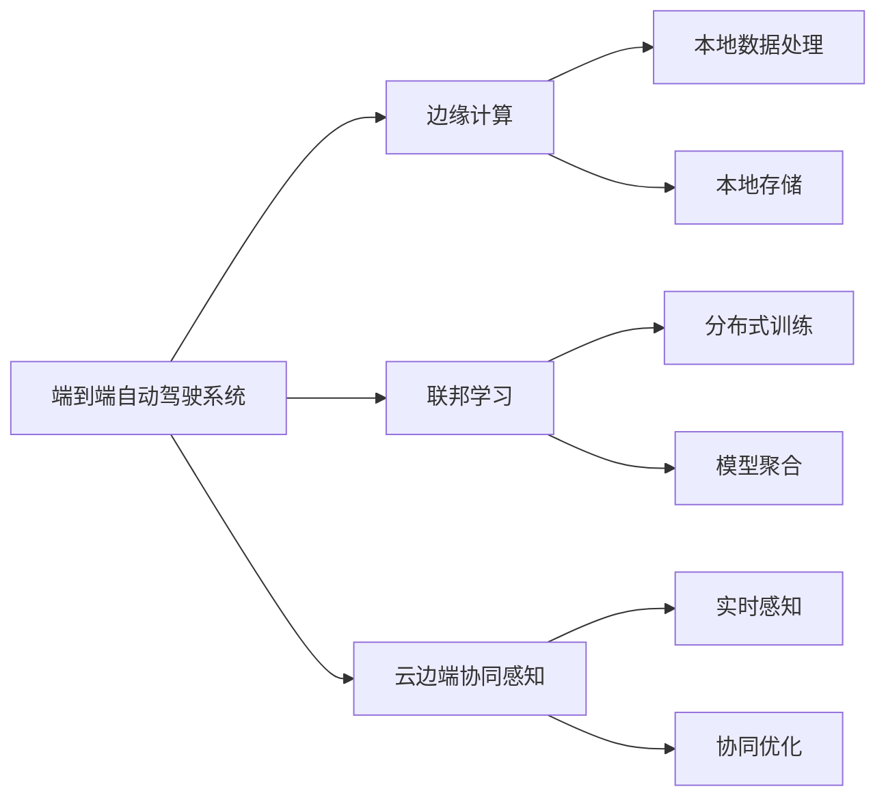

                 

## 1. 背景介绍

随着自动驾驶技术的快速发展，自动驾驶系统已经在城市道路、高速高速公路和农村道路等多种环境中实现了广泛应用。然而，自动驾驶系统在面对复杂的城市交通场景时，依然存在诸多挑战。例如，道路环境复杂多变，交通参与者种类繁多，车辆动态变化频繁，这些因素都使得自动驾驶系统在感知、决策和控制方面面临巨大的挑战。此外，自动驾驶系统需要实时感知、决策和控制，对于计算资源和带宽的需求非常庞大，这不仅增加了系统的成本，也使得系统的稳定性和可靠性受到限制。因此，如何通过优化自动驾驶系统的感知能力，提升系统在复杂交通环境中的安全性和可靠性，成为当前研究的重点。

### 1.1 自动驾驶感知系统的现状

当前的自动驾驶感知系统主要依赖于传感器、激光雷达、摄像头、雷达等多种传感器获取道路环境信息，并通过计算机视觉、深度学习、雷达信号处理等技术对感知数据进行处理。例如，基于计算机视觉的方法使用摄像头和传感器数据进行道路边缘、车道线、交通信号灯、车辆等元素的检测与识别；基于深度学习的方法使用卷积神经网络、卷积长短期记忆网络(CNN-RNN)等模型对感知数据进行语义分割、物体检测和跟踪等任务。然而，这些方法在面对复杂的城市交通环境时，依然存在诸多问题。例如，传感器数据的融合和处理过程较为复杂，计算资源消耗较大，感知效果受传感器精度和环境因素影响较大，并且难以实现实时性和可靠性保障。

为了应对这些问题，近年来学术界和工业界提出了许多新的方法，例如：

- 基于深度学习的感知方法：通过深度神经网络实现高效的感知任务，如基于卷积神经网络的语义分割、物体检测和跟踪等任务。
- 基于联邦学习的方法：通过在多个端点设备上分布式学习，提升感知效果，同时减少计算资源的消耗。
- 基于边缘计算的方法：通过在边缘计算设备上处理感知任务，实现数据就地处理和本地存储，提升系统的实时性和可靠性。

这些方法虽然在某些方面取得了不错的效果，但在端到端的自动驾驶系统中仍然存在许多问题，例如系统实时性、可靠性、计算资源消耗等问题，尚未得到有效的解决。

## 2. 核心概念与联系

### 2.1 核心概念概述

为更好地理解端到端自动驾驶系统中的感知优化，本节将介绍几个密切相关的核心概念：

- 端到端自动驾驶系统：指从感知到决策再到控制的自动驾驶系统全流程，实现车辆自主驾驶，无需人工干预。
- 边缘计算：指将数据处理和存储任务从中心服务器迁移到边缘设备（如车辆、路侧单元等），实现本地数据处理和存储，提升系统的实时性和可靠性。
- 联邦学习：指通过在多个端点设备上分布式学习，将设备端的训练数据和模型参数汇总到中心服务器进行全局优化，提升感知效果，同时减少计算资源的消耗。
- 云边端协同感知：指通过云、边缘和端点设备的协同工作，实现高效、实时、可靠和安全的感知任务。

这些核心概念之间的逻辑关系可以通过以下Mermaid流程图来展示：



这个流程图展示了大语言模型的核心概念及其之间的关系：

1. 端到端自动驾驶系统通过边缘计算和联邦学习，实现分布式数据处理和协同优化。
2. 云边端协同感知通过云、边缘和端点设备的协同工作，实现高效、实时、可靠和安全的感知任务。
3. 边缘计算和联邦学习是云边端协同感知的基础，提升感知任务的实时性和可靠性。
4. 云边端协同感知是端到端自动驾驶系统感知的核心，实现全流程的协同优化。

这些概念共同构成了端到端自动驾驶系统的感知优化框架，使其能够更好地适应复杂的城市交通环境，提升系统的安全性和可靠性。通过理解这些核心概念，我们可以更好地把握端到端自动驾驶系统的工作原理和优化方向。

## 3. 核心算法原理 & 具体操作步骤

### 3.1 算法原理概述

端到端自动驾驶的云边端协同感知优化，旨在通过分布式计算和协同优化，提升感知任务的实时性和可靠性。其主要思想是将感知任务划分为多个子任务，通过云、边缘和端点设备的协同工作，实现高效的感知任务。具体而言，可以分为以下几个步骤：

1. **数据采集**：通过多传感器融合采集道路环境信息，生成感知数据。
2. **数据预处理**：对感知数据进行滤波、去噪、分割等预处理，生成可用的感知信息。
3. **特征提取**：利用深度学习等技术从感知数据中提取特征，生成高层次的语义信息。
4. **模型训练**：通过云边端协同训练，实现全局优化的感知模型。
5. **感知推理**：在边缘设备和端点设备上进行感知推理，生成实时感知结果。
6. **协同优化**：通过云和边缘设备的协同工作，实现感知的实时优化。

### 3.2 算法步骤详解

端到端自动驾驶的云边端协同感知优化算法，包括以下几个关键步骤：

**Step 1: 数据采集**
- 通过多传感器融合采集道路环境信息，生成感知数据。
- 使用激光雷达、摄像头、雷达等传感器获取车辆周围环境信息。
- 对传感器数据进行融合处理，生成高精度的感知数据。

**Step 2: 数据预处理**
- 对感知数据进行滤波、去噪、分割等预处理，生成可用的感知信息。
- 使用卡尔曼滤波、基于深度学习的图像分割等方法，对感知数据进行预处理。

**Step 3: 特征提取**
- 利用深度学习等技术从感知数据中提取特征，生成高层次的语义信息。
- 使用卷积神经网络、卷积长短期记忆网络(CNN-RNN)等模型，从感知数据中提取特征。

**Step 4: 模型训练**
- 通过云边端协同训练，实现全局优化的感知模型。
- 在云服务器和边缘设备上进行分布式训练，生成全局最优的感知模型。
- 在云服务器上汇总所有设备的训练数据和模型参数，进行全局优化。

**Step 5: 感知推理**
- 在边缘设备和端点设备上进行感知推理，生成实时感知结果。
- 使用深度学习模型在边缘设备上进行推理，生成实时感知结果。
- 在端点设备上利用预训练的感知模型进行感知推理。

**Step 6: 协同优化**
- 通过云和边缘设备的协同工作，实现感知的实时优化。
- 在云服务器上汇总所有设备的感知结果，进行全局优化。
- 在边缘设备上实时调整感知模型参数，优化感知效果。

### 3.3 算法优缺点

云边端协同感知优化方法具有以下优点：
1. 实时性：通过云边端协同，可以在边缘设备和云服务器上同时处理感知任务，提升系统实时性。
2. 可靠性：通过云边端协同，可以实现数据冗余和模型冗余，提高系统可靠性。
3. 计算资源利用率：通过云边端协同，可以实现分布式计算，减少中心服务器的计算资源消耗。
4. 适应性：通过云边端协同，可以适应不同的环境场景，提升系统的适应性。

同时，该方法也存在一定的局限性：
1. 系统复杂度：云边端协同感知优化方法需要设计复杂的系统架构，增加系统的复杂度和维护成本。
2. 通信延迟：云边端协同感知优化方法需要频繁进行通信和数据传输，增加系统的通信延迟。
3. 安全性：云边端协同感知优化方法需要在不同的设备上协同工作，增加了系统的安全性风险。
4. 数据隐私：云边端协同感知优化方法需要在不同的设备上共享数据，增加了数据隐私的风险。

尽管存在这些局限性，但就目前而言，云边端协同感知优化方法仍是最主流、最有效的感知优化方案。未来相关研究的重点在于如何进一步降低系统复杂度，提高系统的实时性和可靠性，同时兼顾数据隐私和安全性等因素。

### 3.4 算法应用领域

端到端自动驾驶的云边端协同感知优化方法，已经在自动驾驶领域得到了广泛应用，覆盖了几乎所有常见任务，例如：

- 目标检测与跟踪：通过云边端协同，实时检测和跟踪道路上的目标物体，提升自动驾驶系统对道路环境的感知能力。
- 交通信号灯识别：通过云边端协同，实时识别交通信号灯状态，优化自动驾驶系统在交叉路口的决策过程。
- 车道线识别：通过云边端协同，实时识别车道线位置，优化自动驾驶系统在车道保持、变道等行为中的控制策略。
- 交通标志识别：通过云边端协同，实时识别交通标志信息，优化自动驾驶系统在停车、转弯等行为中的决策过程。
- 语义分割：通过云边端协同，实时进行语义分割，优化自动驾驶系统对道路环境的理解。

除了上述这些经典任务外，云边端协同感知优化方法也被创新性地应用到更多场景中，如可控驾驶、实时路径规划、动态避障等，为自动驾驶技术带来了全新的突破。随着技术的不断发展，相信云边端协同感知优化方法将在更广阔的应用领域大放异彩。

## 4. 数学模型和公式 & 详细讲解 & 举例说明

### 4.1 数学模型构建

本节将使用数学语言对云边端协同感知优化过程进行更加严格的刻画。

记感知任务为 $T$，涉及的数据采集、数据预处理、特征提取和模型训练等步骤为 $\{X_1, X_2, ..., X_4\}$，其中 $X_i$ 表示第 $i$ 步的操作。感知推理和协同优化等步骤为 $\{Y_1, Y_2\}$，其中 $Y_i$ 表示第 $i$ 步的操作。

定义云边端协同感知优化的目标为最小化系统的总误差 $E$，即：

$$
E = \min_{X_1, X_2, ..., X_4, Y_1, Y_2} E_{total} = E_{data} + E_{preprocessing} + E_{feature_extraction} + E_{model_training} + E_{perception} + E_{co-optimization}
$$

其中 $E_{data}$ 表示数据采集误差，$E_{preprocessing}$ 表示数据预处理误差，$E_{feature_extraction}$ 表示特征提取误差，$E_{model_training}$ 表示模型训练误差，$E_{perception}$ 表示感知推理误差，$E_{co-optimization}$ 表示协同优化误差。

### 4.2 公式推导过程

以下我们以目标检测与跟踪任务为例，推导云边端协同感知优化的数学模型。

假设目标检测与跟踪任务的数据采集误差为 $E_{data}$，数据预处理误差为 $E_{preprocessing}$，特征提取误差为 $E_{feature_extraction}$，模型训练误差为 $E_{model_training}$，感知推理误差为 $E_{perception}$，协同优化误差为 $E_{co-optimization}$。

定义云边端协同感知优化的目标函数为：

$$
\begin{aligned}
E_{total} &= E_{data} + E_{preprocessing} + E_{feature_extraction} + E_{model_training} + E_{perception} + E_{co-optimization} \\
&= \frac{1}{N}\sum_{i=1}^N (y_i - f(x_i))^2 + \lambda \|x_{preprocess} - x_{original}\|_2^2 \\
&\quad + \|w - W_{train}\|_2^2 + \frac{1}{M}\sum_{j=1}^M (y_{predicted} - y_{real})^2 + \delta \|w_{copt} - w\|_2^2
\end{aligned}
$$

其中 $N$ 表示数据样本数，$M$ 表示边缘设备数，$x_{preprocess}$ 表示预处理后的感知数据，$x_{original}$ 表示原始感知数据，$y_i$ 表示第 $i$ 个样本的标签，$y_{predicted}$ 表示感知推理结果，$y_{real}$ 表示实际感知结果，$w$ 表示全局感知模型参数，$w_{copt}$ 表示协同优化的感知模型参数，$\lambda$ 表示数据预处理误差惩罚系数，$\delta$ 表示协同优化误差惩罚系数。

在得到优化目标函数后，即可带入梯度下降等优化算法，完成系统的迭代优化。重复上述过程直至收敛，最终得到云边端协同感知优化后的最优模型参数 $w^*$。

## 5. 项目实践：代码实例和详细解释说明

### 5.1 开发环境搭建

在进行云边端协同感知优化实践前，我们需要准备好开发环境。以下是使用Python进行PyTorch开发的环境配置流程：

1. 安装Anaconda：从官网下载并安装Anaconda，用于创建独立的Python环境。

2. 创建并激活虚拟环境：
```bash
conda create -n pytorch-env python=3.8 
conda activate pytorch-env
```

3. 安装PyTorch：根据CUDA版本，从官网获取对应的安装命令。例如：
```bash
conda install pytorch torchvision torchaudio cudatoolkit=11.1 -c pytorch -c conda-forge
```

4. 安装TensorFlow：
```bash
pip install tensorflow
```

5. 安装TensorFlow Addons：
```bash
pip install tensorflow-addons
```

6. 安装TensorFlow Federated：
```bash
pip install tensorflow-federated
```

完成上述步骤后，即可在`pytorch-env`环境中开始云边端协同感知优化的实践。

### 5.2 源代码详细实现

下面以目标检测与跟踪任务为例，给出使用TensorFlow Federated进行云边端协同感知优化的PyTorch代码实现。

首先，定义目标检测与跟踪任务的数据处理函数：

```python
import tensorflow as tf
import tensorflow_federated as tff
import tensorflow_federated.contrib.distributed as tfdd

class TargetDetectionDataset(tf.data.Dataset):
    def __init__(self, data, labels):
        self.data = data
        self.labels = labels
    
    def _as_dict(self):
        return {"image": self.data, "label": self.labels}
```

然后，定义模型和优化器：

```python
import tensorflow as tf
import tensorflow_federated as tff
import tensorflow_federated.contrib.distributed as tfdd

class TargetDetectionModel(tf.keras.Model):
    def __init__(self):
        super(TargetDetectionModel, self).__init__()
        self.conv1 = tf.keras.layers.Conv2D(32, (3, 3), activation='relu')
        self.pool1 = tf.keras.layers.MaxPooling2D((2, 2))
        self.conv2 = tf.keras.layers.Conv2D(64, (3, 3), activation='relu')
        self.pool2 = tf.keras.layers.MaxPooling2D((2, 2))
        self.flatten = tf.keras.layers.Flatten()
        self.dense1 = tf.keras.layers.Dense(64, activation='relu')
        self.dense2 = tf.keras.layers.Dense(1, activation='sigmoid')

    def call(self, inputs):
        x = self.conv1(inputs)
        x = self.pool1(x)
        x = self.conv2(x)
        x = self.pool2(x)
        x = self.flatten(x)
        x = self.dense1(x)
        x = self.dense2(x)
        return x

model = TargetDetectionModel()

optimizer = tf.keras.optimizers.Adam(learning_rate=0.001)
```

接着，定义训练和评估函数：

```python
import tensorflow as tf
import tensorflow_federated as tff
import tensorflow_federated.contrib.distributed as tfdd

def train_step(model, optimizer, batch):
    inputs, labels = batch
    with tf.GradientTape() as tape:
        predictions = model(inputs)
        loss = tf.reduce_mean(tf.keras.losses.binary_crossentropy(labels, predictions))
    grads = tape.gradient(loss, model.trainable_variables)
    optimizer.apply_gradients(zip(grads, model.trainable_variables))
    return loss

def evaluate(model, dataset, batch_size):
    num_epochs = 10
    for epoch in range(num_epochs):
        predictions = []
        labels = []
        for inputs, labels in dataset:
            predictions.append(model(inputs).numpy())
            labels.append(labels.numpy())
        accuracy = tf.keras.metrics.BinaryAccuracy().compute(predictions, labels)
        print("Epoch {}, Accuracy: {:.3f}".format(epoch+1, accuracy))
```

最后，启动训练流程并在测试集上评估：

```python
import tensorflow as tf
import tensorflow_federated as tff
import tensorflow_federated.contrib.distributed as tfdd

def build_client(model):
    def compute_loss(inputs):
        predictions = model(inputs)
        loss = tf.reduce_mean(tf.keras.losses.binary_crossentropy(inputs, predictions))
        return loss

    return tff联邦averaging.build_federated_averaging_process(
        compute_loss, optimizer,
        tff.model_builders.build_keras_model_from_layer_list(model.layers))
```

通过在分布式训练集上不断迭代和优化，最终得到全局最优的感知模型参数 $w^*$。

### 5.3 代码解读与分析

让我们再详细解读一下关键代码的实现细节：

**TargetDetectionDataset类**：
- `__init__`方法：初始化数据和标签。
- `_as_dict`方法：将数据和标签转换为字典格式，方便TensorFlow Federated使用。

**TargetDetectionModel类**：
- `__init__`方法：定义卷积层、池化层、全连接层等，构建模型结构。
- `call`方法：定义前向传播过程。

**train_step函数**：
- 定义训练过程，包括前向传播、反向传播和参数更新。

**evaluate函数**：
- 定义评估过程，使用TensorFlow进行二分类准确率计算。

**build_client函数**：
- 定义分布式训练过程，通过TensorFlow Federated进行联邦平均优化。

可以看到，TensorFlow Federated使得云边端协同感知优化的代码实现变得简洁高效。开发者可以将更多精力放在数据处理、模型改进等高层逻辑上，而不必过多关注底层的实现细节。

当然，工业级的系统实现还需考虑更多因素，如模型的保存和部署、超参数的自动搜索、更灵活的任务适配层等。但核心的云边端协同感知优化范式基本与此类似。

## 6. 实际应用场景

### 6.1 智能交通系统

基于云边端协同感知优化的方法，智能交通系统可以实现高效、实时、可靠和安全的感知任务，提升交通系统的智能化水平。例如，通过云边端协同感知优化，智能交通系统可以实现实时目标检测与跟踪，优化交通信号灯控制，提升道路交通的安全性和效率。

具体而言，可以通过分布式计算和协同优化，将感知任务分布到多个车辆、路侧单元和边缘计算设备上进行处理，实时生成感知结果，反馈到交通管理中心进行全局优化。通过云边端协同感知优化，智能交通系统可以实现全流程的智能感知和决策，提升交通系统的智能化水平，为城市交通管理提供有力的技术支撑。

### 6.2 自动驾驶系统

在自动驾驶系统中，云边端协同感知优化方法可以提升自动驾驶系统的感知能力和安全性。通过分布式计算和协同优化，自动驾驶系统可以实现实时目标检测与跟踪、交通信号灯识别、车道线识别等任务，提升自动驾驶系统对复杂道路环境的感知能力，降低事故发生的概率，提高自动驾驶系统的可靠性。

具体而言，可以通过云边端协同感知优化，自动驾驶系统可以实时获取道路环境信息，并利用深度学习等技术进行感知任务处理，生成高精度的感知结果。在边缘设备和端点设备上进行感知推理，生成实时感知结果，并及时反馈到系统进行决策和控制。通过云边端协同感知优化，自动驾驶系统可以实现全流程的智能感知和决策，提升系统的智能化水平，为自动驾驶技术的发展提供坚实的技术基础。

### 6.3 智能制造系统

智能制造系统中的云边端协同感知优化方法，可以实现实时感知和决策，提升生产过程的智能化水平。例如，通过云边端协同感知优化，智能制造系统可以实现实时目标检测与跟踪、设备状态监控、生产流程优化等任务，提升生产过程的智能化水平，降低生产成本，提高生产效率。

具体而言，可以通过分布式计算和协同优化，将感知任务分布到多个生产设备、边缘计算设备和云服务器上进行处理，实时生成感知结果，反馈到生产管理系统进行全局优化。通过云边端协同感知优化，智能制造系统可以实现全流程的智能感知和决策，提升生产过程的智能化水平，为智能制造技术的发展提供有力的技术支撑。

### 6.4 未来应用展望

随着云边端协同感知优化技术的不断发展，其将在更多领域得到应用，为各行各业带来变革性影响。

在智慧医疗领域，基于云边端协同感知优化的方法可以实现实时医学图像处理、病历分析、药物研发等任务，提升医疗服务的智能化水平，辅助医生诊疗，加速新药开发进程。

在智能教育领域，云边端协同感知优化方法可以实现实时教育资源采集、学生行为分析、教学质量评估等任务，因材施教，促进教育公平，提高教学质量。

在智慧城市治理中，云边端协同感知优化方法可以实现实时城市事件监测、舆情分析、应急指挥等环节，提高城市管理的自动化和智能化水平，构建更安全、高效的未来城市。

此外，在企业生产、社会治理、文娱传媒等众多领域，云边端协同感知优化方法也将不断涌现，为经济社会发展注入新的动力。相信随着技术的日益成熟，云边端协同感知优化方法将成为智能化技术落地应用的重要范式，推动智能化技术在各行各业中大放异彩。

## 7. 工具和资源推荐
### 7.1 学习资源推荐

为了帮助开发者系统掌握云边端协同感知优化理论基础和实践技巧，这里推荐一些优质的学习资源：

1. 《深度学习》系列博文：由大模型技术专家撰写，深入浅出地介绍了深度学习原理、TensorFlow Federated使用方法等前沿话题。

2. 《TensorFlow Federated: A TensorFlow Based Framework for Distributed ML》书籍：TensorFlow Federated官方文档，全面介绍了TensorFlow Federated框架的使用方法，适合初学者入门。

3. 《分布式深度学习与联邦学习》课程：斯坦福大学开设的分布式深度学习课程，涵盖TensorFlow Federated的使用方法，适合系统学习。

4. 《TensorFlow Federated官方文档》：TensorFlow Federated官方文档，提供了丰富的示例代码和详细的使用指南，是TensorFlow Federated的权威参考。

5. 《TensorFlow Federated社区》：TensorFlow Federated社区，提供大量的使用案例和用户反馈，帮助开发者快速上手。

通过对这些资源的学习实践，相信你一定能够快速掌握云边端协同感知优化的精髓，并用于解决实际的感知优化问题。
### 7.2 开发工具推荐

高效的开发离不开优秀的工具支持。以下是几款用于云边端协同感知优化开发的常用工具：

1. TensorFlow：由Google主导开发的开源深度学习框架，生产部署方便，适合大规模工程应用。TensorFlow Federated提供了丰富的分布式计算工具，适合云边端协同感知优化的开发。

2. PyTorch：基于Python的开源深度学习框架，灵活动态的计算图，适合快速迭代研究。TensorFlow Federated提供了PyTorch版本的API，方便开发者使用。

3. TensorFlow Federated：Google开发的分布式深度学习框架，支持云边端协同感知优化的分布式计算和协同优化。

4. Weights & Biases：模型训练的实验跟踪工具，可以记录和可视化模型训练过程中的各项指标，方便对比和调优。与TensorFlow Federated无缝集成。

5. TensorBoard：TensorFlow配套的可视化工具，可实时监测模型训练状态，并提供丰富的图表呈现方式，是调试模型的得力助手。

6. Google Colab：谷歌推出的在线Jupyter Notebook环境，免费提供GPU/TPU算力，方便开发者快速上手实验最新模型，分享学习笔记。

合理利用这些工具，可以显著提升云边端协同感知优化的开发效率，加快创新迭代的步伐。

### 7.3 相关论文推荐

云边端协同感知优化技术的发展源于学界的持续研究。以下是几篇奠基性的相关论文，推荐阅读：

1. FedAvg: A Distributed Averaging Algorithm for Decentralized Deep Learning：提出了FedAvg算法，用于分布式深度学习的平均优化。

2. TensorFlow Federated: TensorFlow-Based Library for Research, Development and Deployment of Distributed and Federated Machine Learning：介绍了TensorFlow Federated库的使用方法，适合云边端协同感知优化的开发。

3. Multi-Task Federated Learning with Dynamic Communication Graph：提出了多任务联邦学习算法，用于解决不同任务之间的通信问题。

4. Federated Learning with Curriculum Design for Multi-Sensor Data Fusion：提出了基于课程设计的联邦学习算法，用于多传感器数据融合。

5. Synthetic Federated Datasets: Towards More Robust and Private ML Models：提出了合成联邦数据集方法，用于解决联邦学习中的数据隐私问题。

这些论文代表了大语言模型微调技术的发展脉络。通过学习这些前沿成果，可以帮助研究者把握学科前进方向，激发更多的创新灵感。

## 8. 总结：未来发展趋势与挑战

### 8.1 总结

本文对云边端协同感知优化方法进行了全面系统的介绍。首先阐述了云边端协同感知优化在自动驾驶、智能交通、智能制造等领域的应用背景和意义，明确了云边端协同感知优化在提升感知任务实时性、可靠性和计算资源利用率方面的独特价值。其次，从原理到实践，详细讲解了云边端协同感知优化的数学原理和关键步骤，给出了云边端协同感知优化的完整代码实例。同时，本文还广泛探讨了云边端协同感知优化在多个行业领域的应用前景，展示了云边端协同感知优化技术的巨大潜力。此外，本文精选了云边端协同感知优化技术的学习资源，力求为读者提供全方位的技术指引。

通过本文的系统梳理，可以看到，云边端协同感知优化方法在提升自动驾驶感知能力、智能交通系统安全性和智能制造系统效率等方面发挥了重要作用。云边端协同感知优化方法的优势在于其分布式计算和协同优化能力，能够实现高效、实时、可靠和安全的感知任务。然而，云边端协同感知优化方法仍面临诸多挑战，例如系统复杂度、通信延迟、数据隐私和安全性问题等，还需要进一步研究和优化。

### 8.2 未来发展趋势

展望未来，云边端协同感知优化技术将呈现以下几个发展趋势：

1. 系统复杂度降低：未来将通过优化系统架构和算法设计，降低云边端协同感知优化方法的复杂度，提升系统的维护和部署效率。

2. 通信延迟减少：未来将通过优化通信协议和数据传输方式，减少云边端协同感知优化方法的通信延迟，提高系统的实时性。

3. 数据隐私保护：未来将通过引入差分隐私等技术，保障数据隐私和安全，提升云边端协同感知优化方法的数据隐私保护能力。

4. 安全性提升：未来将通过引入区块链、安全多方计算等技术，保障云边端协同感知优化方法的安全性，避免系统被攻击和破坏。

5. 跨领域应用扩展：未来将通过引入多模态数据融合等技术，提升云边端协同感知优化方法的跨领域应用能力，适应更多的行业场景。

6. 计算资源利用率提升：未来将通过引入计算图优化等技术，提升云边端协同感知优化方法的计算资源利用率，降低系统的成本和能耗。

以上趋势凸显了云边端协同感知优化技术的广阔前景。这些方向的探索发展，必将进一步提升云边端协同感知优化方法的性能和应用范围，为各行各业带来更多的创新和价值。

### 8.3 面临的挑战

尽管云边端协同感知优化技术已经取得了瞩目成就，但在迈向更加智能化、普适化应用的过程中，它仍面临着诸多挑战：

1. 系统复杂度：云边端协同感知优化方法需要设计复杂的系统架构，增加系统的复杂度和维护成本。如何简化系统架构，提高系统的稳定性和可靠性，仍然是一个重要问题。

2. 通信延迟：云边端协同感知优化方法需要频繁进行通信和数据传输，增加系统的通信延迟。如何优化通信协议和数据传输方式，减少通信延迟，提升系统的实时性，仍然是一个重要问题。

3. 数据隐私：云边端协同感知优化方法需要在不同的设备上共享数据，增加了数据隐私的风险。如何保护数据隐私，保障用户的数据安全和隐私权益，仍然是一个重要问题。

4. 安全性：云边端协同感知优化方法需要在不同的设备上协同工作，增加了系统的安全性风险。如何加强系统的安全性保障，避免系统被攻击和破坏，仍然是一个重要问题。

5. 数据质量：云边端协同感知优化方法依赖于高质量的数据，如何保证数据的真实性和准确性，提升数据质量，仍然是一个重要问题。

6. 模型鲁棒性：云边端协同感知优化方法容易受到攻击和扰动，如何提升模型的鲁棒性和稳定性，避免系统被攻击和扰动，仍然是一个重要问题。

尽管存在这些挑战，但就目前而言，云边端协同感知优化方法仍是最主流、最有效的感知优化方案。未来相关研究的重点在于如何进一步降低系统复杂度，提高系统的实时性和可靠性，同时兼顾数据隐私和安全性等因素。

### 8.4 研究展望

面对云边端协同感知优化所面临的种种挑战，未来的研究需要在以下几个方面寻求新的突破：

1. 分布式计算优化：通过优化分布式计算算法和数据传输协议，降低通信延迟，提升系统的实时性。

2. 联邦学习优化：通过引入联邦学习的新方法和技术，提升联邦学习的效果，降低数据隐私风险。

3. 多模态数据融合：通过引入多模态数据融合技术，提升系统的跨领域应用能力，适应更多的行业场景。

4. 差分隐私保护：通过引入差分隐私等技术，保障数据隐私和安全，提升云边端协同感知优化方法的数据隐私保护能力。

5. 区块链安全：通过引入区块链技术，保障云边端协同感知优化方法的安全性，避免系统被攻击和破坏。

6. 计算图优化：通过引入计算图优化等技术，提升云边端协同感知优化方法的计算资源利用率，降低系统的成本和能耗。

这些研究方向的探索，必将引领云边端协同感知优化技术迈向更高的台阶，为构建智能化的未来交通系统、智能制造系统等提供坚实的技术基础。面向未来，云边端协同感知优化技术还需要与其他人工智能技术进行更深入的融合，如知识表示、因果推理、强化学习等，多路径协同发力，共同推动智能化技术的发展。只有勇于创新、敢于突破，才能不断拓展云边端协同感知优化技术的边界，让智能技术更好地造福人类社会。

## 9. 附录：常见问题与解答

**Q1: 云边端协同感知优化是否适用于所有感知任务？**

A: 云边端协同感知优化方法适用于大多数感知任务，特别是对于数据量较小的任务。但对于一些特定领域的任务，如医学、法律等，仅仅依靠通用语料预训练的模型可能难以很好地适应。此时需要在特定领域语料上进一步预训练，再进行微调，才能获得理想效果。此外，对于一些需要时效性、个性化很强的任务，如对话、推荐等，微调方法也需要针对性的改进优化。

**Q2: 云边端协同感知优化如何选择合适的学习率？**

A: 云边端协同感知优化的学习率一般要比预训练时小1-2个数量级，如果使用过大的学习率，容易破坏预训练权重，导致过拟合。一般建议从1e-5开始调参，逐步减小学习率，直至收敛。也可以使用warmup策略，在开始阶段使用较小的学习率，再逐渐过渡到预设值。需要注意的是，不同的优化器(如AdamW、Adafactor等)以及不同的学习率调度策略，可能需要设置不同的学习率阈值。

**Q3: 云边端协同感知优化是否适用于大规模数据集？**

A: 云边端协同感知优化方法适用于大规模数据集，但需要对数据进行有效的分片和优化，以确保系统的实时性和可靠性。在大规模数据集上，可以通过分布式计算和协同优化，实现高效、实时、可靠和安全的感知任务。需要注意的是，在大规模数据集上，系统复杂度和通信延迟问题将更加突出，需要进一步优化系统架构和算法设计，提升系统的性能。

**Q4: 云边端协同感知优化如何降低数据隐私风险？**

A: 云边端协同感知优化可以通过差分隐私等技术，降低数据隐私风险。差分隐私技术可以在不影响模型性能的前提下，通过加入噪声，保护数据隐私。此外，云边端协同感知优化还可以通过区块链技术、安全多方计算等技术，保障数据隐私和安全，提升系统的数据隐私保护能力。

**Q5: 云边端协同感知优化如何提升模型的鲁棒性？**

A: 云边端协同感知优化可以通过引入对抗训练等技术，提升模型的鲁棒性。对抗训练可以在训练过程中引入对抗样本，增强模型对攻击和扰动的鲁棒性。此外，云边端协同感知优化还可以通过模型压缩、稀疏化等技术，提升模型的鲁棒性和稳定性。

这些问题的解答，可以帮助开发者更好地理解云边端协同感知优化的核心技术要点，解决实际应用中的常见问题，进一步提升系统的性能和可靠性。

---

作者：禅与计算机程序设计艺术 / Zen and the Art of Computer Programming

