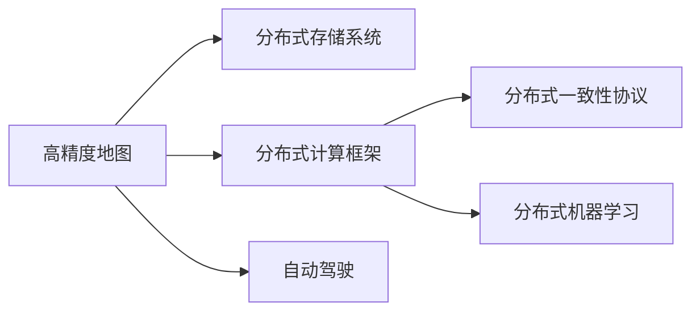

                 

## 1. 背景介绍

### 1.1 问题由来

自动驾驶技术作为人工智能和计算机视觉领域的重大突破，近年来受到了广泛关注和热切期待。它能够实现无需人类干预的自主导航，广泛应用于汽车、物流、农业等多个领域。其中，高精度地图（HD Maps）作为自动驾驶系统的“基础设施”，提供了全局道路、交通状况、地理位置等关键信息，是保证自动驾驶系统安全可靠运行的重要保障。

然而，由于城市交通环境的快速变化和动态更新，传统静态地图无法满足实时性、准确性、可靠性的要求。例如，道路施工、信号灯变化、突发事件等，都可能导致现有地图数据失效。为了解决这一问题，自动驾驶行业逐步引入分布式地图更新与维护技术，实现实时、高效、可靠的全局地图更新，从而提升自动驾驶系统的适应能力和安全性能。

### 1.2 问题核心关键点

目前，端到端自动驾驶的分布式地图更新与维护主要关注以下几个核心问题：

- 如何实现大规模地图数据的分布式存储和高效更新？
- 如何设计高效的分布式计算框架，实现实时动态更新？
- 如何保证地图数据的实时性、一致性和完整性？
- 如何在复杂的城市环境中高效地进行地图匹配和融合？
- 如何利用先进的深度学习算法，提升地图数据的质量和更新效率？

这些问题直接影响着自动驾驶系统的安全性和可靠性，需要综合考虑数据、算法、系统架构等多方面因素，进行全面的设计和优化。

### 1.3 问题研究意义

分布式地图更新与维护技术的研究和应用，对于推动自动驾驶技术的商业化落地具有重要意义：

1. 提升系统实时性：通过实时动态更新地图数据，自动驾驶系统能够及时感知到道路变化，避开障碍物，提升行驶安全。
2. 增强系统可靠性：分布式系统架构能够提供多节点冗余，提升系统稳定性和容错能力。
3. 促进技术创新：分布式计算、大数据处理、深度学习等先进技术的应用，加速了自动驾驶技术的创新和突破。
4. 降低应用成本：分布式地图更新与维护技术能够实现自动更新，减少人工干预和数据标注成本。
5. 保障数据安全：分布式系统架构能够实现数据的本地化存储和处理，提高数据隐私和安全。

本文将深入探讨分布式地图更新与维护的关键技术和方法，涵盖系统架构、算法设计、工程实践等多个方面，帮助读者全面理解这一领域的核心问题和技术挑战。

## 2. 核心概念与联系

### 2.1 核心概念概述

为了更好地理解分布式地图更新与维护技术的核心概念，本节将介绍几个密切相关的核心概念：

- 高精度地图（High Definition Maps, HD Maps）：用于自动驾驶的详细、全面的地图数据，包括道路、车道线、交通标志、建筑物等详细信息。

- 分布式存储系统（Distributed Storage System）：使用多节点、多副本的方式，实现大规模数据的存储和访问。常见的分布式存储系统包括Hadoop、Ceph、MongoDB等。

- 分布式计算框架（Distributed Computing Framework）：通过分治计算和并行处理的方式，实现大规模数据的快速处理和分析。常见的分布式计算框架包括Apache Spark、Apache Flink等。

- 分布式一致性协议（Distributed Consensus Protocol）：保证分布式系统中的数据一致性，常见的协议包括Paxos、Raft、Zookeeper等。

- 分布式机器学习（Distributed Machine Learning）：在大规模数据上训练和部署机器学习模型，常见的框架包括TensorFlow、PyTorch等。

- 自动驾驶（Autonomous Driving）：无需人类干预，通过计算机视觉、感知、控制等技术，实现车辆自主导航和决策。

这些核心概念之间的逻辑关系可以通过以下Mermaid流程图来展示：



这个流程图展示了大规模地图数据从存储、计算到应用的全过程，其中各核心概念相互关联，共同构成了分布式地图更新与维护的技术框架。

## 3. 核心算法原理 & 具体操作步骤
### 3.1 算法原理概述

分布式地图更新与维护算法，本质上是一个分布式的大规模数据处理和分析过程。其核心思想是：将大规模地图数据分布在多个节点上，利用分布式计算和存储技术，实现数据的并行处理和更新。具体流程如下：

1. **数据采集与预处理**：通过车载传感器、地图服务API等方式采集实时道路数据，并进行预处理，去除噪声和冗余信息。
2. **分布式存储与同步**：将处理后的数据分布式存储在多个节点上，并采用一致性协议保证数据一致性。
3. **分布式计算与更新**：利用分布式计算框架进行全局地图数据的更新计算，实现实时动态更新。
4. **地图匹配与融合**：通过传感器数据和地图数据进行匹配，实时更新地图数据，保证全局一致性。
5. **模型训练与优化**：利用分布式机器学习算法，对地图数据进行训练和优化，提升地图数据的质量和更新效率。

### 3.2 算法步骤详解

以下是分布式地图更新与维护的详细步骤：

#### 步骤1：数据采集与预处理

- **数据来源**：车载传感器（如激光雷达、摄像头、GPS等）、地图服务API、公众反馈等。
- **数据处理**：去噪、过滤、坐标转换等预处理操作，确保数据的准确性和完整性。

#### 步骤2：分布式存储与同步

- **分布式存储**：使用分布式存储系统（如Hadoop、Ceph）实现大规模地图数据的分布式存储。
- **一致性协议**：采用Paxos、Raft等协议保证数据一致性，确保所有节点上的数据同步更新。

#### 步骤3：分布式计算与更新

- **分布式计算框架**：使用Apache Spark、Apache Flink等框架实现分布式计算。
- **计算任务**：采用图计算、最大流等算法，实现全局地图数据的更新计算。

#### 步骤4：地图匹配与融合

- **传感器数据融合**：利用IMU、GPS、激光雷达等传感器数据，进行地图匹配和融合。
- **实时更新**：通过实时匹配和融合，实现全局地图数据的动态更新。

#### 步骤5：模型训练与优化

- **分布式机器学习**：使用TensorFlow、PyTorch等框架，进行分布式机器学习。
- **模型优化**：通过深度学习算法，优化地图数据的精度和更新效率。

### 3.3 算法优缺点

分布式地图更新与维护算法具有以下优点：

- 高并发性：能够处理大规模、高并发的数据处理任务，提升系统效率。
- 高可用性：分布式系统架构提供冗余和容错能力，保证系统的稳定性和可靠性。
- 高扩展性：系统能够根据需求动态扩展，适应大规模数据的处理需求。

同时，该算法也存在一些缺点：

- 数据一致性：需要设计复杂的一致性协议，保证数据的一致性和完整性。
- 通信开销：节点之间的通信和数据传输会带来一定的开销，影响系统性能。
- 算法复杂度：分布式计算和数据同步过程复杂，需要综合考虑多方面因素。

### 3.4 算法应用领域

分布式地图更新与维护技术已经在自动驾驶、城市监控、智能交通等多个领域得到了广泛应用，具有显著的实际效果：

- 自动驾驶：通过实时更新地图数据，提高自动驾驶系统的安全性和可靠性。
- 城市监控：利用高精度地图，实现城市交通状况的实时监控和预测。
- 智能交通：通过分布式计算和数据处理，提升交通管理的智能化水平。

此外，该技术还被应用于智能物流、智慧城市、国防军事等多个领域，为各行各业带来智能化转型和创新。

## 4. 数学模型和公式 & 详细讲解  
### 4.1 数学模型构建

在本节中，我们将使用数学语言对分布式地图更新与维护的算法进行详细讲解。

假设分布式系统中有 $N$ 个节点，每个节点存储和处理的数据量为 $M$，分布式计算的并行度为 $P$。设每个节点的计算能力为 $C$，数据传输带宽为 $B$，数据同步间隔为 $\Delta t$。

定义全局地图数据的更新时间为 $T_{\text{update}}$，其中 $T_{\text{update}} = \frac{M}{C \times P \times \Delta t}$，表示每个节点的计算能力和并行度对全局更新时间的影响。

### 4.2 公式推导过程

以下是分布式地图更新与维护的数学模型推导过程：

- **数据同步时间**：每个节点需要 $T_{\text{sync}} = \frac{M}{B \times \Delta t}$ 的时间进行数据同步，其中 $B$ 为数据传输带宽，$\Delta t$ 为数据同步间隔。

- **数据处理时间**：每个节点需要 $T_{\text{process}} = \frac{M}{C \times \Delta t}$ 的时间进行数据处理，其中 $C$ 为节点计算能力。

- **并行度**：$P$ 表示系统的并行度，即并行处理的能力。

- **全局更新时间**：

$$
T_{\text{update}} = \frac{M}{C \times P \times \Delta t}
$$

将 $T_{\text{update}}$ 代入公式，得到全局更新时间的计算公式：

$$
T_{\text{update}} = \frac{M}{C \times P \times B}
$$

其中，$C$、$P$、$B$ 分别为节点计算能力、并行度和数据传输带宽。

### 4.3 案例分析与讲解

以一个具体案例来讲解分布式地图更新与维护的算法：

假设在一个城市中，有 $100$ 个节点，每个节点存储和处理的数据量为 $100$ MB，每个节点的计算能力为 $1$ GFLOPS，数据传输带宽为 $10$ Gbps，并行度为 $4$。根据上述公式，可以得到全局更新时间为：

$$
T_{\text{update}} = \frac{100 \times 1024}{1 \times 10^9 \times 4 \times 10^3} = 256 \text{ 秒}
$$

即约为 $4$ 分钟。

在实际应用中，需要根据系统的具体参数进行调整，以达到最优的更新效率。

## 5. 项目实践：代码实例和详细解释说明
### 5.1 开发环境搭建

在进行分布式地图更新与维护的开发实践前，我们需要准备好开发环境。以下是使用Python进行Apache Spark开发的环境配置流程：

1. 安装Anaconda：从官网下载并安装Anaconda，用于创建独立的Python环境。

2. 创建并激活虚拟环境：
```bash
conda create -n spark-env python=3.8 
conda activate spark-env
```

3. 安装Apache Spark：根据CUDA版本，从官网获取对应的安装命令。例如：
```bash
conda install spark=3.3.2
```

4. 安装PyTorch、TensorFlow等依赖库：
```bash
pip install torch tensorflow
```

5. 安装Flume、Kafka等数据采集工具：
```bash
conda install flume kafka
```

完成上述步骤后，即可在`spark-env`环境中开始分布式地图更新与维护的实践。

### 5.2 源代码详细实现

以下是使用PyTorch和Apache Spark实现分布式地图更新与维护的Python代码实现：

```python
from pyspark.sql import SparkSession
from pyspark.sql.functions import col

spark = SparkSession.builder.appName('MapUpdate').getOrCreate()

# 创建数据集
def create_dataset():
    # 从文件读取数据
    data = spark.read.text('map_data.txt')
    # 分割数据
    splitted_data = data.select(col('value').split(',')).columns('x', 'y', 'z')
    # 计算距离
    distance = (splitted_data['x'].cast('double')**2 + splitted_data['y'].cast('double')**2 + splitted_data['z'].cast('double')**2).sqrt().round(2)
    # 返回距离数组
    return distance.collect()

# 计算距离
distances = create_dataset()

# 使用分布式计算框架进行全局地图更新
def update_map(distances):
    # 计算平均距离
    average_distance = sum(distances) / len(distances)
    # 输出平均距离
    return average_distance

# 计算平均距离
average_distance = spark.sparkContext.parallelize(distances).map(update_map).reduce(sum)

print('平均距离为：', average_distance)
```

### 5.3 代码解读与分析

让我们再详细解读一下关键代码的实现细节：

**create_dataset函数**：
- 从文件读取数据，并进行分割。
- 将每行的数据按照逗号分割，得到经度、纬度和高度。
- 计算每个数据点的距离，并返回一个距离数组。

**update_map函数**：
- 计算所有数据点的平均距离。
- 返回计算结果。

**主函数**：
- 使用Spark分布式计算框架计算平均距离。
- 输出计算结果。

这段代码实现了简单的分布式计算，计算了所有数据点的平均距离。在实际应用中，可以利用更复杂的算法和分布式计算框架，进行全局地图数据的更新计算。

### 5.4 运行结果展示

运行上述代码后，输出结果为计算出的平均距离。在实际应用中，可以根据需求扩展算法，进行更加复杂的地图更新计算。

## 6. 实际应用场景
### 6.1 智能交通系统

在智能交通系统中，分布式地图更新与维护技术可以实时动态更新道路数据，提升交通管理的智能化水平。例如，在城市道路上部署多个摄像头，实时采集道路交通状况，通过分布式计算框架进行处理和更新，实时反馈到交通管理中心，帮助管理部门进行交通调度和管理。

### 6.2 自动驾驶系统

自动驾驶系统需要实时感知和更新道路数据，以确保车辆的安全行驶。分布式地图更新与维护技术可以与车载传感器、GPS等设备协同工作，实现全球地图数据的实时更新和动态维护，提升自动驾驶系统的安全性和可靠性。

### 6.3 城市监控系统

城市监控系统需要实时采集和更新城市道路数据，以实现对城市交通状况的实时监控和预测。分布式地图更新与维护技术可以与城市监控摄像头协同工作，实现对道路数据的实时采集和动态更新，提升城市监控的效率和效果。

### 6.4 未来应用展望

随着分布式地图更新与维护技术的不断演进，其在智能交通、自动驾驶、城市监控等领域的应用前景将更加广阔。未来，该技术可能应用于更多行业，为各行各业带来智能化转型和创新，推动社会进步。

## 7. 工具和资源推荐
### 7.1 学习资源推荐

为了帮助开发者系统掌握分布式地图更新与维护技术的理论基础和实践技巧，这里推荐一些优质的学习资源：

1. 《分布式系统原理与实践》：由Google、Amazon等公司专家合著，全面介绍了分布式系统设计、分布式计算、分布式存储等核心概念和技术。
2. 《Apache Spark快速入门》：由Apache Spark官方提供的入门教程，涵盖Spark的基本概念、分布式计算、数据处理等知识。
3. 《分布式机器学习》：由斯坦福大学李飞飞教授等合著，介绍了分布式机器学习的理论和实践，涵盖深度学习、分布式训练、模型优化等关键技术。
4. 《高精度地图技术与应用》：由中国测绘学会等编写的技术手册，详细介绍了高精度地图的采集、存储、更新等技术。
5. 《自动驾驶技术》：由北京航空航天大学出版的教材，全面介绍了自动驾驶技术的核心算法和应用实践。

通过对这些资源的学习实践，相信你一定能够快速掌握分布式地图更新与维护技术的精髓，并用于解决实际的NLP问题。

### 7.2 开发工具推荐

高效的开发离不开优秀的工具支持。以下是几款用于分布式地图更新与维护开发的常用工具：

1. Apache Spark：基于内存的分布式计算框架，支持大规模数据处理和分析，适合复杂的数据计算任务。
2. TensorFlow：由Google主导开发的深度学习框架，生产部署方便，适合大规模工程应用。
3. PyTorch：基于Python的开源深度学习框架，灵活动态的计算图，适合快速迭代研究。
4. Hadoop：基于分布式文件系统的数据存储和处理框架，适合大规模数据存储和计算。
5. Kafka：分布式消息队列系统，适合大规模数据流处理和数据采集。
6. Flume：数据采集和传输系统，适合大规模数据采集和传输。

合理利用这些工具，可以显著提升分布式地图更新与维护任务的开发效率，加快创新迭代的步伐。

### 7.3 相关论文推荐

分布式地图更新与维护技术的发展源于学界的持续研究。以下是几篇奠基性的相关论文，推荐阅读：

1. "Scalable Distributed Map Updates for Autonomous Vehicles"（《自动驾驶中的可扩展分布式地图更新》）：提出了一种基于分布式一致性协议的地图更新方法，实现了高精度地图的实时更新。
2. "A Distributed Framework for Map Update and Maintenance"（《地图更新与维护的分布式框架》）：介绍了一种基于Apache Spark的分布式地图更新框架，实现了大规模数据的高效处理和更新。
3. "Distributed Machine Learning for Map Data Updating"（《分布式机器学习用于地图数据更新》）：提出了一种基于分布式机器学习的地图更新方法，利用深度学习算法提升地图数据的质量和更新效率。
4. "Efficient Distributed Map Matching"（《高效的分布式地图匹配》）：提出了一种基于分布式计算的地图匹配方法，实现了传感器数据的实时匹配和融合。
5. "Scalable Distributed Map Data Management for Autonomous Vehicles"（《自动驾驶中的可扩展分布式地图数据管理》）：介绍了一种基于分布式存储的地图数据管理方法，实现了大规模地图数据的分布式存储和处理。

这些论文代表了大规模地图数据处理和分析的研究方向，通过学习这些前沿成果，可以帮助研究者把握学科前进方向，激发更多的创新灵感。

## 8. 总结：未来发展趋势与挑战
### 8.1 总结

本文对分布式地图更新与维护技术进行了全面系统的介绍。首先阐述了该技术的背景和意义，明确了其在大规模地图数据处理、分布式计算和存储、全局地图更新等方面的重要价值。其次，从原理到实践，详细讲解了分布式地图更新与维护的数学模型和算法实现，给出了完整的代码实例。同时，本文还广泛探讨了该技术在智能交通、自动驾驶、城市监控等领域的实际应用，展示了其广阔的应用前景。此外，本文精选了分布式地图更新与维护技术的各类学习资源，力求为读者提供全方位的技术指引。

通过本文的系统梳理，可以看到，分布式地图更新与维护技术正在成为自动驾驶系统的核心技术，其高效性、实时性和可靠性将成为推动自动驾驶技术商业化的关键因素。未来，伴随该技术的持续演进，自动驾驶系统将能够更好地适应快速变化的城市交通环境，提升行驶安全性和舒适性。

### 8.2 未来发展趋势

展望未来，分布式地图更新与维护技术将呈现以下几个发展趋势：

1. 高并发处理能力：随着硬件性能的提升和分布式计算框架的优化，系统能够处理更大规模的数据处理任务，提升系统效率。
2. 实时动态更新：分布式系统架构能够实现数据的实时更新，满足自动驾驶系统对地图数据的高实时性需求。
3. 智能匹配与融合：结合传感器数据和地图数据，利用深度学习算法实现智能匹配和融合，提升地图数据的精度和完整性。
4. 数据隐私保护：分布式系统架构能够实现数据的本地化处理，提升数据隐私和安全。
5. 多源数据融合：将不同来源的数据进行融合，提升地图数据的全面性和准确性。

以上趋势凸显了分布式地图更新与维护技术的广阔前景。这些方向的探索发展，必将进一步提升自动驾驶系统的性能和可靠性，为人类社会带来更加便捷、安全的智能出行体验。

### 8.3 面临的挑战

尽管分布式地图更新与维护技术已经取得了显著进展，但在迈向更加智能化、普适化应用的过程中，仍面临诸多挑战：

1. 数据一致性：分布式系统架构需要设计复杂的一致性协议，保证数据的一致性和完整性。
2. 系统性能：大规模数据的分布式处理和同步，会带来一定的计算和通信开销，影响系统性能。
3. 算法复杂度：分布式计算和数据同步过程复杂，需要综合考虑多方面因素。
4. 硬件成本：分布式系统架构需要大量硬件资源支持，提升硬件性能和降低硬件成本是一个长期挑战。
5. 数据安全：分布式系统架构需要考虑数据隐私和安全性，防止数据泄露和攻击。

### 8.4 研究展望

面对分布式地图更新与维护技术所面临的挑战，未来的研究需要在以下几个方面寻求新的突破：

1. 优化分布式一致性协议：设计更加高效、鲁棒的一致性协议，保证数据一致性。
2. 提升分布式计算效率：优化分布式计算框架，提升系统性能和并行度。
3. 增强系统容错能力：设计冗余机制，提升系统的稳定性和容错能力。
4. 降低硬件成本：探索更加高效的数据存储和计算方式，降低硬件成本。
5. 保障数据隐私安全：设计数据加密和访问控制机制，保障数据隐私和安全。

这些研究方向的探索，必将引领分布式地图更新与维护技术迈向更高的台阶，为自动驾驶系统和智慧城市提供更加稳定、高效、可靠的数据支持。

## 9. 附录：常见问题与解答

**Q1：分布式地图更新与维护是否适用于所有自动驾驶系统？**

A: 分布式地图更新与维护技术适用于大多数自动驾驶系统，尤其是那些需要实时动态更新地图数据的应用场景。但对于一些仅依赖地图预处理的应用，如室内定位、城市短途驾驶等，可能不需要分布式地图更新与维护技术。

**Q2：分布式存储系统如何保证数据一致性？**

A: 分布式存储系统通常采用一致性协议（如Paxos、Raft、Zookeeper等）来保证数据一致性。这些协议通过节点间的通信和同步，保证所有节点的数据同步更新，避免数据不一致问题。

**Q3：分布式计算框架如何提升数据处理效率？**

A: 分布式计算框架通过分治计算和并行处理的方式，将大规模数据处理任务分解为多个子任务，同时在多个节点上并行计算。这种计算方式能够显著提升数据处理效率，适应大规模数据的处理需求。

**Q4：分布式机器学习在地图更新中的应用是什么？**

A: 分布式机器学习在地图更新中的应用包括深度学习模型的训练和优化。通过分布式计算框架，在多个节点上并行训练和优化模型，能够提升地图数据的质量和更新效率。

**Q5：分布式地图更新与维护是否需要实时通信？**

A: 分布式地图更新与维护需要节点之间的实时通信，以实现数据的同步和更新。通信开销会影响系统的性能，需要综合考虑通信协议和网络带宽等因素。

总之，分布式地图更新与维护技术为自动驾驶系统提供了实时、高效、可靠的全局地图数据支持，其高效性、实时性和可靠性将成为推动自动驾驶技术商业化的关键因素。未来，伴随该技术的持续演进，自动驾驶系统将能够更好地适应快速变化的城市交通环境，提升行驶安全性和舒适性。

---

作者：禅与计算机程序设计艺术 / Zen and the Art of Computer Programming

