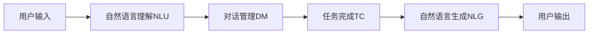

# AI Agent: AI的下一个风口 从图形用户界面到自然语言的进化

## 1.背景介绍

### 1.1 人机交互的演变历程
#### 1.1.1 命令行界面时代
#### 1.1.2 图形用户界面时代  
#### 1.1.3 自然语言交互的兴起

### 1.2 AI技术的发展现状
#### 1.2.1 机器学习和深度学习的突破
#### 1.2.2 自然语言处理技术的进步
#### 1.2.3 知识图谱和语义理解的发展

### 1.3 AI Agent的概念与意义
#### 1.3.1 AI Agent的定义
#### 1.3.2 AI Agent对人机交互的革新
#### 1.3.3 AI Agent的应用前景

## 2.核心概念与联系

### 2.1 AI Agent的核心要素
#### 2.1.1 自然语言理解(NLU)
#### 2.1.2 对话管理(Dialogue Management) 
#### 2.1.3 任务完成(Task Completion)

### 2.2 AI Agent与相关技术的关系
#### 2.2.1 AI Agent与机器学习的关系
#### 2.2.2 AI Agent与知识图谱的结合
#### 2.2.3 AI Agent与语音识别的协同

### 2.3 AI Agent的架构设计
#### 2.3.1 Pipeline架构
#### 2.3.2 端到端架构
#### 2.3.3 混合架构



## 3.核心算法原理具体操作步骤

### 3.1 自然语言理解(NLU)算法
#### 3.1.1 基于规则的方法
#### 3.1.2 基于统计的方法
#### 3.1.3 基于深度学习的方法

### 3.2 对话管理(DM)算法
#### 3.2.1 有限状态机方法
#### 3.2.2 基于框架的方法  
#### 3.2.3 基于深度强化学习的方法

### 3.3 任务完成(TC)算法
#### 3.3.1 基于检索的方法
#### 3.3.2 基于生成的方法
#### 3.3.3 基于知识图谱的方法

## 4.数学模型和公式详细讲解举例说明

### 4.1 自然语言理解中的数学模型
#### 4.1.1 隐马尔可夫模型(HMM)
隐马尔可夫模型是一种统计模型,由观察状态和隐藏状态组成。转移概率矩阵$A$和发射概率矩阵$B$是模型的两个重要参数:

$$
A=\begin{bmatrix}
a_{11} & a_{12} & \cdots & a_{1n}\
a_{21} & a_{22} & \cdots & a_{2n}\  
\vdots & \vdots & \ddots & \vdots\
a_{n1} & a_{n2} & \cdots & a_{nn}
\end{bmatrix}
$$

#### 4.1.2 条件随机场(CRF)
条件随机场是一种概率无向图模型,在序列标注任务中有广泛应用。CRF模型的数学表达式为:

$$
P(y|x) = \frac{1}{Z(x)} \exp \left(\sum_{i=1}^{n}\sum_{j=1}^{m}\lambda_j f_j (y_{i-1}, y_i, x, i)\right)
$$

其中$Z(x)$是归一化因子,$f_j$是特征函数,$\lambda_j$是对应的权重系数。

### 4.2 对话管理中的数学模型 
#### 4.2.1 马尔可夫决策过程(MDP)
马尔可夫决策过程由状态集合$S$,动作集合$A$,转移概率$P$,奖励函数$R$和折扣因子$\gamma$组成。最优策略$\pi^*$满足贝尔曼最优方程:

$$
V^*(s) = \max_{a \in A} \left\{ R(s,a) + \gamma \sum_{s' \in S} P(s'|s,a) V^*(s') \right\}
$$

#### 4.2.2 部分可观察马尔可夫决策过程(POMDP) 
POMDP在MDP的基础上引入了观察集合$O$和观察概率$Z$。最优策略需要在信念状态空间中进行搜索,贝尔曼最优方程变为:

$$
V^*(b) = \max_{a \in A} \left\{ \sum_{s \in S} b(s)R(s,a) + \gamma \sum_{o \in O} P(o|b,a) V^*(b') \right\}
$$

其中$b$是信念状态,$b'$是执行动作$a$并观察到$o$后的新信念状态。

### 4.3 任务完成中的数学模型
#### 4.3.1 序列到序列模型(Seq2Seq)
Seq2Seq模型常用于机器翻译和对话生成任务。编码器将输入序列$x=(x_1,\dots,x_T)$编码为隐状态$h=(h_1,\dots,h_T)$,解码器根据隐状态生成输出序列$y=(y_1,\dots,y_{T'})$。生成概率为:

$$
P(y|x) = \prod_{t=1}^{T'} P(y_t | y_1, \dots, y_{t-1}, h)
$$

#### 4.3.2 注意力机制(Attention Mechanism)
注意力机制能够让模型动态地聚焦于输入序列的不同部分。在第$t$步解码时,注意力分布$\alpha^t$为:

$$
\alpha^t = \text{softmax}(e^t) \
e^t_i = \text{score}(s_{t-1}, h_i)
$$

其中$s_{t-1}$是上一步的解码器隐状态,$h_i$是第$i$个编码器隐状态,$\text{score}$是注意力打分函数。

## 5.项目实践：代码实例和详细解释说明

### 5.1 基于深度学习的自然语言理解示例
下面是使用TensorFlow和Keras实现的一个基于BiLSTM-CRF的命名实体识别模型:

```python
import tensorflow as tf
from tensorflow.keras.models import Model
from tensorflow.keras.layers import Input, Embedding, Bidirectional, LSTM, Dense, TimeDistributed

def build_model(vocab_size, embed_dim, num_tags):
    input = Input(shape=(None,))
    embedding = Embedding(vocab_size, embed_dim)(input) 
    bilstm = Bidirectional(LSTM(units=128, return_sequences=True))(embedding)
    dense = TimeDistributed(Dense(50, activation="relu"))(bilstm)
    crf = CRF(num_tags)
    output = crf(dense)
    
    model = Model(input, output)
    model.compile(optimizer="adam", loss=crf.loss, metrics=[crf.accuracy])
    
    return model
```

这个模型首先使用Embedding层将输入的词转换为稠密向量,然后通过双向LSTM学习上下文信息,接着使用Dense层进行非线性变换,最后使用CRF层进行序列标注。

### 5.2 基于深度强化学习的对话管理示例
下面是使用PyTorch实现的一个基于DQN的对话管理模型:

```python
import torch
import torch.nn as nn
import torch.optim as optim

class DQN(nn.Module):
    def __init__(self, state_size, action_size):
        super(DQN, self).__init__()
        self.fc1 = nn.Linear(state_size, 256) 
        self.fc2 = nn.Linear(256, 256)
        self.fc3 = nn.Linear(256, action_size)
        
    def forward(self, state):
        x = torch.relu(self.fc1(state))
        x = torch.relu(self.fc2(x))
        q_values = self.fc3(x)
        return q_values

def train(model, optimizer, batch):
    states, actions, rewards, next_states, dones = batch
    
    q_values = model(states)
    next_q_values = model(next_states).detach()
    
    q_value = q_values.gather(1, actions.unsqueeze(1)).squeeze(1) 
    next_q_value = next_q_values.max(1)[0]
    expected_q_value = rewards + gamma * next_q_value * (1 - dones)
    
    loss = (q_value - expected_q_value).pow(2).mean()
    
    optimizer.zero_grad()
    loss.backward()
    optimizer.step()
```

这个模型使用三个全连接层来逼近Q值函数。在训练时,从经验回放池中采样一个批次的转移数据,然后最小化TD误差来更新模型参数。

### 5.3 基于Transformer的任务完成示例
下面是使用PyTorch实现的一个基于Transformer的Seq2Seq模型:

```python
import torch
import torch.nn as nn

class Transformer(nn.Module):
    def __init__(self, vocab_size, embed_dim, num_heads, num_layers):
        super(Transformer, self).__init__()
        
        self.embedding = nn.Embedding(vocab_size, embed_dim)
        self.positional_encoding = PositionalEncoding(embed_dim)
        self.encoder_layers = nn.TransformerEncoderLayer(embed_dim, num_heads)
        self.encoder = nn.TransformerEncoder(self.encoder_layers, num_layers)
        self.decoder_layers = nn.TransformerDecoderLayer(embed_dim, num_heads)
        self.decoder = nn.TransformerDecoder(self.decoder_layers, num_layers)
        self.fc = nn.Linear(embed_dim, vocab_size)
        
    def forward(self, src, tgt):
        src = self.embedding(src) * math.sqrt(embed_dim)
        src = self.positional_encoding(src)
        tgt = self.embedding(tgt) * math.sqrt(embed_dim)
        tgt = self.positional_encoding(tgt)
        
        memory = self.encoder(src)
        output = self.decoder(tgt, memory)
        output = self.fc(output)
        
        return output
```

这个模型使用Transformer的编码器-解码器架构,编码器将输入序列编码为隐表示,解码器根据隐表示和之前的输出生成下一个token。位置编码用于引入序列的位置信息。

## 6.实际应用场景

### 6.1 智能客服
AI Agent可以作为智能客服系统的核心引擎,通过自然语言交互为用户提供咨询、问题解答、投诉处理等服务,大大减轻了人工客服的压力,提高了客户满意度。

### 6.2 智能助理
AI Agent可以作为智能助理集成到各类终端设备中,例如智能音箱、智能手表、智能家居等。用户可以通过语音或文本与AI助理进行交互,完成信息查询、日程管理、设备控制等任务。

### 6.3 医疗健康
AI Agent可以应用于医疗健康领域,协助医生进行病情分析、治疗方案推荐,为患者提供智能导诊、健康咨询等服务,促进医疗资源的合理分配和利用。

## 7.工具和资源推荐

### 7.1 开源工具包
- [Rasa](https://rasa.com/): 一个开源的对话式AI平台,提供了对话管理、意图识别、实体提取等功能。
- [DeepPavlov](https://deeppavlov.ai/): 一个端到端的对话系统开发库,包含了常见的NLP组件和预训练模型。
- [Hugging Face Transformers](https://huggingface.co/transformers/): 一个流行的NLP库,提供了大量预训练的Transformer模型。

### 7.2 数据集
- [MultiWOZ](https://arxiv.org/abs/1810.00278): 一个大规模的多域对话数据集,广泛用于对话状态追踪和对话管理的研究。
- [bAbI](https://research.fb.com/downloads/babi/): 一个问答推理数据集,用于评估模型在复杂推理任务上的表现。
- [Stanford Multi-Domain Dialog Dataset](https://arxiv.org/abs/1911.06394): 一个多领域的人机对话数据集,包含了丰富的对话动作和状态注释。

### 7.3 竞赛和评测
- [Dialog System Technology Challenge (DSTC)](https://www.microsoft.com/en-us/research/event/dialog-state-tracking-challenge/): 一个著名的对话系统技术评测竞赛,每年举办不同主题的赛事。
- [The Conversational Intelligence Challenge (ConvAI)](http://convai.io/): 由微软和亚马逊联合举办的对话系统竞赛,旨在推动开放域对话系统的发展。
- [Alexa Prize](https://developer.amazon.com/alexaprize): 亚马逊举办的面向大学生的社交机器人竞赛,优胜团队可获得高额奖金。

## 8.总结：未来发展趋势与挑战

### 8.1 个性化和情感化
未来的AI Agent将更加注重个性化和情感化,根据用户的个人特征