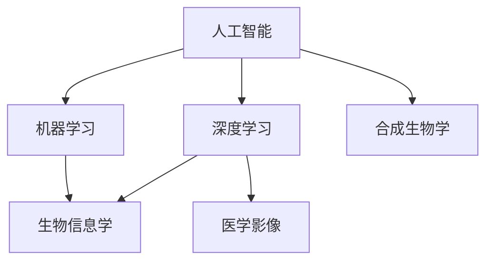

# AI与生物学交叉原理与代码实战案例讲解

## 1.背景介绍
### 1.1 人工智能与生物学的关系
人工智能(Artificial Intelligence, AI)是计算机科学的一个分支,它致力于创造出能够模拟人类智能的机器。而生物学是研究生命现象、生命活动的本质和规律的科学。近年来,随着AI技术的飞速发展,AI与生物学的交叉融合越来越紧密,AI正在深刻影响和改变着生物学研究的方式和内容。

### 1.2 AI在生物学中的应用现状
目前,AI已经在生物学的多个领域得到广泛应用,例如:
- 生物信息学:利用机器学习和深度学习算法分析基因组、蛋白质组等海量生物数据,进行序列比对、结构预测、功能注释等。
- 药物发现:应用AI算法和模型加速新药研发过程,如虚拟筛选、分子对接、药物性质预测等。
- 医学影像:利用计算机视觉和深度学习技术辅助医生进行医学影像的分析和诊断,如肿瘤检测、器官分割等。
- 合成生物学:运用AI优化基因线路设计,指导合成生物的构建。

### 1.3 AI与生物学交叉的意义
AI与生物学的交叉融合具有重要意义:
1. 促进生物学的发展:AI可以帮助生物学家更高效地分析海量数据,加速生物学研究进程,获得新的洞见。
2. 推动AI技术进步:生物学为AI提供了丰富的应用场景和研究问题,反过来也促进了AI算法的创新和发展。
3. 造福人类健康:AI与生物医学的结合,有望在疾病诊断、药物研发、个性化医疗等方面取得突破,造福人类健康。

## 2.核心概念与联系
### 2.1 机器学习
机器学习是AI的核心,它使计算机能够在没有明确编程的情况下学习和改进。常见的机器学习任务包括分类、回归、聚类等。在生物学中,机器学习被广泛用于生物数据的分析和预测。

### 2.2 深度学习
深度学习是机器学习的一个分支,它模仿人脑的结构和功能,使用多层神经网络从数据中学习高层次的特征表示。深度学习在计算机视觉、自然语言处理等领域取得了突破性进展,也正在重塑生物学研究。

### 2.3 生物信息学
生物信息学是应用计算机科学和信息技术来管理和分析生物数据的学科。它包括基因组学、转录组学、蛋白质组学等。生物信息学产生的海量数据为AI在生物学中的应用提供了丰富的素材。

### 2.4 合成生物学
合成生物学是利用工程化的方法来设计和构建新的生物系统,或者重新设计现有的生物系统以完成特定功能。AI可以辅助合成生物学的设计和优化过程。

### 2.5 概念联系


## 3.核心算法原理具体操作步骤
本节将以卷积神经网络(Convolutional Neural Network, CNN)在生物医学图像分析中的应用为例,讲解其核心算法原理和操作步骤。

### 3.1 卷积神经网络简介
CNN是一种广泛用于图像识别的深度学习模型,它的基本结构包括:
1. 卷积层:使用卷积核对图像进行特征提取
2. 池化层:对特征图下采样,减少参数数量
3. 全连接层:对提取的特征进行分类或回归

### 3.2 CNN在医学图像分析中的应用
CNN可以用于多种医学图像分析任务,如:
- 器官和病变区域的分割
- 肿瘤的检测和分类
- 疾病的诊断和分级

### 3.3 以肺结节检测为例的CNN操作步骤
1. 数据准备:收集CT图像数据,并进行标注,将肺结节的位置标记出来。
2. 数据预处理:对CT图像进行归一化、裁剪等预处理操作。
3. 构建CNN模型:设计CNN的网络结构,包括卷积层、池化层和全连接层的数量和参数。
4. 模型训练:将预处理后的数据输入CNN,通过反向传播算法学习模型参数。
5. 模型评估:在测试集上评估模型性能,计算准确率、召回率等指标。
6. 模型应用:使用训练好的模型对新的CT图像进行肺结节检测。

## 4.数学模型和公式详细讲解举例说明
本节以CNN中的卷积操作为例,详细讲解其数学模型和公式。

### 4.1 卷积的数学定义
对于一个二维图像$I$和卷积核$K$,卷积操作定义为:

$$(I*K)(i,j)=\sum_m\sum_nI(i-m,j-n)K(m,n)$$

其中,$*$表示卷积操作,$(i,j)$为像素坐标,$(m,n)$为卷积核内的相对坐标。

### 4.2 卷积的计算示例
假设有一个3x3的图像$I$和一个2x2的卷积核$K$:

$$I=\begin{bmatrix}
1 & 2 & 3\\
4 & 5 & 6\\
7 & 8 & 9
\end{bmatrix},
K=\begin{bmatrix}
1 & 0\\
0 & 1
\end{bmatrix}$$

则卷积结果为:

$$(I*K)(0,0)=1\times1+2\times0+4\times0+5\times1=6$$
$$(I*K)(0,1)=2\times1+3\times0+5\times0+6\times1=8$$
$$(I*K)(1,0)=4\times1+5\times0+7\times0+8\times1=12$$
$$(I*K)(1,1)=5\times1+6\times0+8\times0+9\times1=14$$

卷积结果为:
$$\begin{bmatrix}
6 & 8\\
12 & 14
\end{bmatrix}$$

### 4.3 卷积的作用
卷积操作可以提取图像的局部特征,不同的卷积核可以提取不同的特征,如边缘、纹理等。通过多层卷积和池化的堆叠,CNN可以自动学习层次化的特征表示。

## 5.项目实践：代码实例和详细解释说明
本节将使用Python和Keras库,以肺结节检测为例,演示如何使用CNN进行医学图像分析。

### 5.1 数据准备
首先,我们需要准备肺结节CT图像数据集,这里使用LUNA16数据集。将数据集划分为训练集和测试集,并进行标注。

```python
import numpy as np
from sklearn.model_selection import train_test_split

# 读取数据并划分训练集和测试集
X = np.load('luna16_images.npy')
y = np.load('luna16_labels.npy')
X_train, X_test, y_train, y_test = train_test_split(X, y, test_size=0.2)
```

### 5.2 数据预处理
对图像数据进行归一化和resize等预处理操作。

```python
from keras.preprocessing.image import ImageDataGenerator

# 数据归一化
X_train = X_train / 255.0
X_test = X_test / 255.0

# 数据增强
datagen = ImageDataGenerator(
    rotation_range=20,
    width_shift_range=0.2,
    height_shift_range=0.2,
    horizontal_flip=True)
```

### 5.3 构建CNN模型
使用Keras构建CNN模型,包括多层卷积、池化和全连接层。

```python
from keras.models import Sequential
from keras.layers import Conv2D, MaxPooling2D, Flatten, Dense

model = Sequential()
model.add(Conv2D(32, (3, 3), activation='relu', input_shape=(50, 50, 1)))
model.add(MaxPooling2D((2, 2)))
model.add(Conv2D(64, (3, 3), activation='relu'))
model.add(MaxPooling2D((2, 2)))
model.add(Conv2D(64, (3, 3), activation='relu'))
model.add(Flatten())
model.add(Dense(64, activation='relu'))
model.add(Dense(1, activation='sigmoid'))

model.compile(optimizer='adam',
              loss='binary_crossentropy',
              metrics=['accuracy'])
```

### 5.4 模型训练和评估
训练CNN模型,并在测试集上评估其性能。

```python
# 训练模型
history = model.fit_generator(datagen.flow(X_train, y_train, batch_size=32),
                              steps_per_epoch=len(X_train) / 32,
                              epochs=50,
                              validation_data=(X_test, y_test))

# 评估模型
score = model.evaluate(X_test, y_test)
print('Test loss:', score[0])
print('Test accuracy:', score[1])
```

### 5.5 模型应用
使用训练好的模型对新的CT图像进行肺结节检测。

```python
# 读取新的CT图像
new_image = np.load('new_ct_image.npy')

# 预处理
new_image = new_image / 255.0
new_image = np.expand_dims(new_image, axis=0)

# 预测
pred = model.predict(new_image)
if pred[0][0] > 0.5:
    print('Nodule detected!')
else:
    print('No nodule detected.')
```

## 6.实际应用场景
AI与生物学的交叉在多个领域有广泛的应用前景,例如:

### 6.1 新药研发
AI可以应用于新药研发的多个环节,如:
- 虚拟筛选:从海量化合物库中筛选出潜在的候选药物
- 药物设计:优化先导化合物的结构,提高药物的疗效和安全性
- 临床试验:优化临床试验方案,提高试验效率

### 6.2 精准医疗
AI可以帮助实现个性化、精准化的医疗,如:
- 基因组分析:分析患者的基因组数据,预测疾病风险,指导用药
- 医学影像分析:辅助医生进行疾病诊断和预后预测
- 可穿戴设备:实时监测患者的生理指标,进行健康管理

### 6.3 合成生物学
AI在合成生物学中的应用包括:
- 基因线路设计:使用优化算法辅助设计合成基因线路
- 代谢工程:优化细胞的代谢路径,提高目标产物的产量
- 蛋白质工程:设计和优化蛋白质的结构和功能

## 7.工具和资源推荐
### 7.1 数据集
- TCGA:人类肿瘤基因组数据集
- GEO:基因表达数据集
- PDB:蛋白质结构数据库
- LUNA16:肺结节CT图像数据集

### 7.2 工具包
- BioPython:Python生物信息学工具包
- Keras:基于Python的深度学习库
- TensorFlow:谷歌开源的机器学习框架
- PyTorch:Facebook开源的深度学习框架
- Scikit-learn:机器学习算法库

### 7.3 在线平台
- Kaggle:数据科学竞赛平台,提供众多生物医学数据集
- Google Colab:在线Python开发环境,可免费使用GPU
- AIcrowd:人工智能众包平台,包含多个生物医学AI挑战赛

## 8.总结：未来发展趋势与挑战
### 8.1 发展趋势
- 多组学数据整合:整合基因组、转录组、蛋白组、影像组等多组学数据,构建更准确的疾病模型
- 知识图谱:构建生物医学知识图谱,促进知识的表示、挖掘和推理
- 联邦学习:在保护数据隐私的前提下,实现多中心数据的共享和学习
- 强化学习:利用强化学习优化治疗决策,实现个性化、精准化治疗

### 8.2 面临的挑战
- 数据质量:生物医学数据的质量参差不齐,数据清洗和标准化面临挑战
- 数据隐私:如何在保护患者隐私的同时实现数据共享是一大挑战
- 模型解释性:深度学习模型的"黑箱"特性,导致其决策过程难以解释,临床应