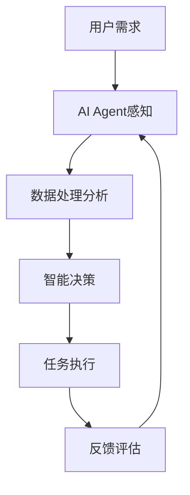

# AI人工智能 Agent：在分享经济中的应用

## 1.背景介绍

### 1.1 分享经济的兴起

分享经济(Sharing Economy)是一种新兴的经济模式,它通过互联网平台将分散的资源进行整合,实现资源的高效利用和价值最大化。近年来,随着互联网技术的快速发展,分享经济在全球范围内蓬勃发展,涌现出了一批像Uber、Airbnb这样的独角兽企业。

### 1.2 人工智能技术的发展

人工智能(Artificial Intelligence, AI)是计算机科学的一个重要分支,它致力于研究如何让机器像人一样思考和行动。近年来,得益于大数据、云计算、深度学习等技术的进步,人工智能取得了突破性的发展,在语音识别、图像识别、自然语言处理等领域展现出了强大的能力。

### 1.3 AI赋能分享经济

分享经济要高效运转,需要处理海量的供需信息,进行实时的匹配和调度,这对传统的运营模式提出了挑战。而人工智能恰恰能够在这些方面大显身手。将AI技术引入分享经济,可以极大提升运营效率,优化用户体验,创造更大的商业价值。AI Agent作为人工智能在分享经济场景下的具体应用形态,正在发挥越来越重要的作用。

## 2.核心概念与联系

### 2.1 AI Agent的定义

AI Agent,即人工智能代理,是一种能够感知环境、自主行动,并通过学习不断优化以实现特定目标的智能系统。它集成了人工智能的各项关键技术,如机器学习、知识表示、推理决策等,可以执行复杂的任务。

### 2.2 Multi-Agent System

在分享经济场景下,往往存在多个AI Agent,它们相互协作、博弈,构成了一个Multi-Agent System(多智能体系统)。每个Agent根据自身的感知和利益诉求采取行动,并与其他Agent产生交互,系统的整体行为模式由此涌现出来。

### 2.3 AI Agent与分享经济的契合点

AI Agent与分享经济有很多契合点:

1. 海量数据处理:分享经济平台每天产生海量数据,AI Agent可以高效处理和分析。

2. 实时匹配与调度:AI Agent可以根据实时的供需信息,进行智能匹配和动态定价。

3. 个性化推荐:通过学习用户行为,AI Agent可以提供个性化的资源推荐。

4. 智能客服:AI Agent可以为用户提供24小时不间断的智能客服服务。

下图展示了AI Agent在分享经济场景下的运作流程:



## 3.核心算法原理具体操作步骤

### 3.1 强化学习

AI Agent的核心能力之一是自主学习和决策,其主要算法范式是强化学习(Reinforcement Learning)。Agent通过与环境的交互,根据反馈的奖励或惩罚,不断调整策略,最终学会最优的行动策略。

强化学习的基本步骤如下:

1. Agent观察当前环境状态 $s_t$
2. 根据策略 $\pi$ 选择一个行动 $a_t$
3. 环境根据 $a_t$ 反馈下一个状态 $s_{t+1}$ 和奖励 $r_t$
4. Agent根据 $s_t$、$a_t$、$r_t$、$s_{t+1}$ 更新策略 $\pi$
5. 重复步骤1-4,直到满足终止条件

常见的强化学习算法有Q-Learning、SARSA、DQN等。

### 3.2 多智能体强化学习

在多Agent场景下,每个Agent不仅要学习自身的最优策略,还要考虑其他Agent的行为。多智能体强化学习(Multi-Agent Reinforcement Learning,MARL)算法如下:

1. 每个Agent $i$ 观察当前状态 $s^i_t$
2. 每个Agent选择行动 $a^i_t$,共同构成联合行动 $\boldsymbol{a}_t$
3. 环境根据 $\boldsymbol{a}_t$ 反馈下一状态 $s^i_{t+1}$ 和奖励 $r^i_t$
4. 每个Agent根据 $s^i_t$、$a^i_t$、$r^i_t$、$s^i_{t+1}$ 更新策略 $\pi_i$
5. 重复1-4,收敛到纳什均衡

常见的MARL算法有Independent Q-Learning、Joint Action Learning等。

### 3.3 分布式优化

在分享经济场景下,数据量巨大且分散在不同的地理位置,集中式处理难度很大。分布式优化算法可以让多个Agent并行处理任务,提高学习效率。常见的分布式强化学习架构有A3C、IMPALA等。

## 4.数学模型和公式详细讲解举例说明

### 4.1 马尔可夫决策过程

强化学习问题可以用马尔可夫决策过程(Markov Decision Process,MDP)来建模。一个MDP由以下元素构成:

- 状态空间 $\mathcal{S}$
- 行动空间 $\mathcal{A}$
- 状态转移概率 $\mathcal{P}(s'|s,a)$
- 奖励函数 $\mathcal{R}(s,a)$
- 折扣因子 $\gamma \in [0,1]$

Agent的目标是学习一个策略 $\pi: \mathcal{S} \rightarrow \mathcal{A}$,使得期望累积奖励最大化:

$$\pi^* = \arg\max_{\pi} \mathbb{E}\left[\sum_{t=0}^{\infty} \gamma^t r_t | \pi \right]$$

### 4.2 Q-Learning

Q-Learning是一种经典的强化学习算法,它通过学习动作-价值函数 $Q(s,a)$ 来找到最优策略。$Q(s,a)$ 表示在状态 $s$ 下采取行动 $a$ 的期望累积奖励。

Q-Learning的更新公式为:

$$Q(s_t,a_t) \leftarrow Q(s_t,a_t) + \alpha \left[r_t + \gamma \max_{a} Q(s_{t+1},a) - Q(s_t,a_t)\right]$$

其中 $\alpha$ 是学习率。在学习过程中,Agent根据 $\epsilon$-贪心策略选择行动:以 $\epsilon$ 的概率随机探索,否则选择 $Q$ 值最大的行动。

举例来说,假设一个共享单车的调度问题,状态 $s$ 为各个站点的单车数量,行动 $a$ 为调度单车的数量,奖励 $r$ 为调度后满足用户需求的程度。每个Agent对应一个区域,通过Q-Learning学习最优的调度策略,多个Agent同时进行可以加速学习过程。

### 4.3 MADDPG

MADDPG(Multi-Agent Deep Deterministic Policy Gradient)是一种多智能体强化学习算法,它结合了集中式学习和分布式执行,可以处理合作、竞争、混合等多种情形。

在MADDPG中,每个Agent $i$ 有一个Actor网络 $\mu_i$ 和一个Critic网络 $Q_i$。Actor根据局部观察 $o_i$ 输出连续的行动 $a_i$,Critic根据全局状态 $s$ 和联合行动 $\boldsymbol{a}$ 评估价值。Actor的目标是最大化Critic的估计 $Q_i(s, a_1, \dots, a_N)$。

MADDPG的Actor更新公式为:

$$\nabla_{\theta_i} J(\mu_i) = \mathbb{E}_{s, a_1, \dots, a_N} \left[ \nabla_{\theta_i} \mu_i(o_i) \nabla_{a_i} Q_i(s, a_1, \dots, a_N) |_{a_i=\mu_i(o_i)} \right]$$

Critic更新公式为:

$$\mathcal{L}(\theta_i) = \mathbb{E}_{s, a_1, \dots, a_N, r, s'} \left[ (Q_i(s,a_1,\dots,a_N) - y)^2 \right]$$

$$y = r_i + \gamma Q'_i(s', a'_1, \dots, a'_N) |_{a'_j = \mu'_j(o'_j)}$$

举例来说,在一个共享充电宝的场景中,多个Agent分别管理不同的充电站点,它们需要合作调度充电宝以满足用户需求,同时又存在库存和收益的竞争。MADDPG可以很好地解决这类问题。

## 5.项目实践：代码实例和详细解释说明

下面我们以一个简单的共享单车调度问题为例,演示如何用Python实现Q-Learning算法。

```python
import numpy as np

class QLearning:
    def __init__(self, n_stations, n_actions, epsilon, alpha, gamma):
        self.n_stations = n_stations  # 站点数
        self.n_actions = n_actions    # 行动数(调度单车数)
        self.epsilon = epsilon        # 探索率
        self.alpha = alpha            # 学习率
        self.gamma = gamma            # 折扣因子
        self.Q = np.zeros((n_stations, n_actions)) # Q表

    def choose_action(self, state):
        if np.random.uniform() < self.epsilon:
            action = np.random.choice(self.n_actions)
        else:
            action = np.argmax(self.Q[state, :])
        return action

    def update(self, state, action, reward, next_state):
        td_error = reward + self.gamma * np.max(self.Q[next_state, :]) - self.Q[state, action]
        self.Q[state, action] += self.alpha * td_error

# 初始化环境和Agent
n_stations = 10
n_actions = 5
epsilon = 0.1
alpha = 0.5
gamma = 0.9
agent = QLearning(n_stations, n_actions, epsilon, alpha, gamma)

# 开始训练
n_episodes = 1000
for episode in range(n_episodes):
    state = env.reset()  # 重置环境状态
    done = False
    while not done:
        action = agent.choose_action(state)  # 选择行动
        next_state, reward, done = env.step(action)  # 执行行动
        agent.update(state, action, reward, next_state)  # 更新Q表
        state = next_state
```

代码说明:

1. 首先定义一个`QLearning`类,初始化Q表和各种参数。

2. `choose_action`方法根据 $\epsilon$-贪心策略选择行动,以 $\epsilon$ 的概率随机探索,否则选择Q值最大的行动。

3. `update`方法根据Q-Learning的更新公式更新Q表。

4. 在训练循环中,每个episode重置环境状态,然后不断选择行动、执行行动、更新Q表,直到达到终止状态。

5. `env`是一个自定义的环境类(代码略),用于模拟共享单车调度问题,`state`表示各站点的单车数,`action`表示调度单车的数量,`reward`由调度后满足用户需求的程度决定。

通过多轮训练,Agent可以学习到一个较优的调度策略。实际应用中,还需要考虑更复杂的环境设定和奖励函数设计。

## 6.实际应用场景

AI Agent在分享经济领域有广泛的应用前景,一些实际的应用场景包括:

1. 共享出行:如共享单车、共享汽车等,Agent可以根据车辆供需实时调度,动态定价。

2. 民宿短租:在Airbnb等短租平台,Agent可以帮助房东优化定价,提高出租率。

3. 网约车调度:Agent可以预测客户需求,指导司机接单,缩短乘客等待时间。

4. 外卖配送调度:Agent可以优化骑手的配送路线,提高配送效率。

5. 共享充电宝:Agent可以预测借还需求,动态调配充电宝库存。

6. 二手交易平台:Agent可以为用户提供个性化商品推荐,提高交易转化率。

总的来说,AI Agent可以在需求预测、资源匹配、动态定价、智能调度等方面为分享经济赋能,提高资源利用效率,创造更大价值。未来,随着人工智能技术的进一步发展,AI Agent必将在分享经济领域扮演越来越重要的角色。

## 7.工具和资源推荐

对于想要深入研究和应用AI Agent技术的读者,这里推荐一些有用的工具和资源: