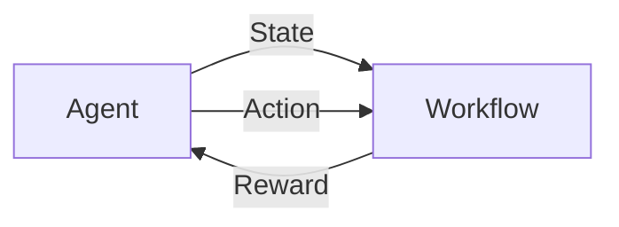
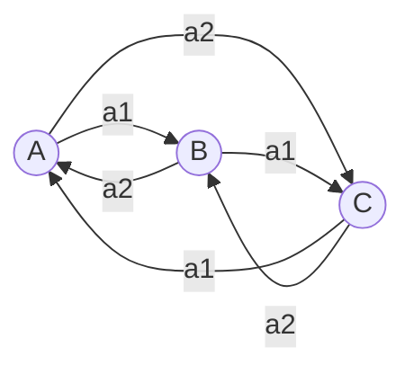

# AI人工智能代理工作流AI Agent WorkFlow：使用强化学习优化代理工作流

## 1.背景介绍

人工智能(Artificial Intelligence, AI)技术的快速发展正在深刻改变着各行各业。在企业管理和运营中，AI技术也扮演着越来越重要的角色。AI代理(Agent)作为一种智能化的工作流执行主体，能够根据环境状态自主地做出决策和行动，从而高效完成复杂任务。然而，如何优化AI代理的工作流程，提升其决策的准确性和效率，是一个亟待解决的问题。

强化学习(Reinforcement Learning, RL)作为一种重要的机器学习范式，为解决这一问题提供了新的思路。RL通过智能体(Agent)与环境的交互，根据反馈信号(Reward)不断优化决策策略(Policy)，最终实现长期回报最大化的目标。将RL应用于AI代理工作流优化，可以使代理根据实时反馈动态调整工作流程，提高任务完成的效率和质量。

本文将重点探讨如何利用强化学习技术来优化AI代理的工作流程。我们将从AI代理工作流的核心概念出发，详细阐述RL的基本原理和关键算法，并通过数学模型和代码实例深入分析其内在机制。同时，文章还将介绍RL在AI代理工作流优化中的实际应用场景，总结当前面临的挑战和未来的发展方向。

## 2.核心概念与联系

要理解如何将强化学习应用于AI代理工作流优化，首先需要明确几个核心概念：

- AI代理(Agent)：能够感知环境状态，根据一定的决策逻辑做出行动，并通过行动影响环境的自主实体。 
- 工作流(Workflow)：由一系列任务活动及其之间的逻辑关系构成的业务过程。
- 强化学习(RL)：旨在使智能体通过与环境的交互，根据反馈信号最大化长期累积回报的机器学习范式。
- 马尔可夫决策过程(MDP)：RL问题的经典数学模型，由状态(State)、动作(Action)、转移概率(Transition Probability)和奖励(Reward)等要素构成。

在AI代理工作流场景下，可以将工作流的执行过程看作一个MDP：每个任务节点对应一个状态，代理的动作是选择下一个要执行的任务，任务完成质量对应即时奖励，整个工作流的完成情况对应长期回报。RL的目标就是寻找最优策略函数，指导代理的任务选择，使长期累积回报最大化。

下图展示了将RL应用于AI代理工作流优化的总体框架：



## 3.核心算法原理具体操作步骤

RL有多种经典算法，适用于不同类型的问题。以下重点介绍Q-Learning和Policy Gradient两种在工作流优化中常用的算法。

### 3.1 Q-Learning

Q-Learning是一种值函数(Value Function)类型的无模型RL算法，通过学习动作-状态值函数Q(s,a)来逼近最优策略。其核心思想是利用贝尔曼方程(Bellman Equation)对Q函数进行迭代更新。

Q-Learning的具体操作步骤如下：

1. 初始化Q(s,a)，对所有s∈S, a∈A, 令Q(s,a)=0
2. 重复以下步骤，直到收敛：
   - 初始化状态s
   - 重复以下步骤，直到s为终止状态：
     - 根据ϵ-greedy策略选择动作a
     - 执行动作a，观察奖励r和新状态s'
     - 更新Q(s,a) ← Q(s,a) + α[r + γ max Q(s',a') - Q(s,a)]
     - s ← s'

其中，α为学习率，γ为折扣因子，ϵ-greedy是一种平衡探索和利用的动作选择策略。

### 3.2 Policy Gradient

不同于Q-Learning直接学习值函数，Policy Gradient是一类直接优化策略函数π(a|s)的RL算法。其核心思想是利用梯度上升法，沿着策略梯度的方向更新策略参数，使期望回报最大化。

Policy Gradient的一般形式为：

$$\nabla_\theta J(\theta) = E_{\tau \sim p_\theta(\tau)} [\sum_{t=0}^{T} \nabla_\theta \log \pi_\theta(a_t|s_t) Q^{\pi_\theta}(s_t,a_t)]$$

其中，$\theta$为策略参数，$\tau$为一条轨迹，$Q^{\pi_\theta}(s_t,a_t)$为在策略$\pi_\theta$下状态动作对(s_t,a_t)的值函数。

根据策略梯度定理，可以得到常见的REINFORCE算法：

1. 随机初始化策略参数$\theta$
2. 重复以下步骤，直到收敛：
   - 根据策略$\pi_\theta$采样一条轨迹$\tau = {s_0,a_0,r_1,...,s_{T-1},a_{T-1},r_T}$
   - 对于$t=0,1,...,T-1$:
     - 计算未来累积回报$G_t = \sum_{k=t+1}^{T} \gamma^{k-t-1} r_k$
     - 计算值函数$Q(s_t,a_t) = G_t$
   - 计算策略梯度$\nabla_\theta J(\theta) \approx \frac{1}{T} \sum_{t=0}^{T-1} \nabla_\theta \log \pi_\theta(a_t|s_t) Q(s_t,a_t)$
   - 更新策略参数$\theta \leftarrow \theta + \alpha \nabla_\theta J(\theta)$

## 4.数学模型和公式详细讲解举例说明

为更好地理解RL算法的内在机制，下面以一个简单的工作流MDP为例，详细推导Q-Learning的更新公式。

考虑一个只包含3个任务节点(A,B,C)的工作流，每个节点有2个可选动作，如下图所示：



定义状态空间S={A,B,C}，动作空间A={a1,a2}，奖励函数如下：

$R(s,a)=\begin{cases}
1, & \text{if } s=C \text{ and } a=a2 \
0, & \text{otherwise}
\end{cases}$

即只有在状态C下选择动作a2，才能获得奖励1，其余情况奖励为0。

根据Q-Learning算法，Q函数的更新公式为：

$Q(s,a) \leftarrow Q(s,a) + \alpha [r + \gamma \max_{a'} Q(s',a') - Q(s,a)]$

假设当前状态为B，选择动作a1，转移到状态C，获得奖励r=0。则Q(B,a1)的更新过程如下：

$Q(B,a1) \leftarrow Q(B,a1) + \alpha [0 + \gamma \max_{a'} Q(C,a') - Q(B,a1)]$

$\qquad \quad = Q(B,a1) + \alpha \gamma [\max_{a'} Q(C,a') - Q(B,a1)]$

假设学习率$\alpha=0.1$，折扣因子$\gamma=0.9$，Q(C,a1)=0, Q(C,a2)=1，则：

$Q(B,a1) \leftarrow Q(B,a1) + 0.1 \times 0.9 \times [1 - Q(B,a1)]$

$\qquad \quad = 0.91 \times Q(B,a1) + 0.09$

可见，Q(B,a1)的值朝着最优动作值函数Q(C,a2)的方向更新，这个过程不断重复，最终收敛到最优值函数。

## 5.项目实践：代码实例和详细解释说明

下面以Python代码实现Q-Learning算法在上述简单工作流MDP中的应用。

```python
import numpy as np

# 定义状态空间和动作空间
states = ['A', 'B', 'C']
actions = ['a1', 'a2']

# 定义奖励函数
rewards = {'C_a2': 1}

# 初始化Q表
Q = {}
for s in states:
    for a in actions:
        Q[s + '_' + a] = 0

# 定义ε-greedy策略
def epsilon_greedy(state, epsilon):
    if np.random.uniform(0, 1) < epsilon:
        action = np.random.choice(actions)
    else:
        action = max(actions, key=lambda x: Q[state + '_' + x])
    return action

# 定义状态转移函数
def get_next_state(state, action):
    if state == 'A':
        return 'B' if action == 'a1' else 'C'
    elif state == 'B':
        return 'C' if action == 'a1' else 'A'
    else:
        return 'A' if action == 'a1' else 'B'

# 定义单步更新函数
def update(state, action, next_state, reward, alpha, gamma):
    Q[state + '_' + action] += alpha * (reward + gamma * max(Q[next_state + '_' + a] for a in actions) - Q[state + '_' + action])

# 设置超参数
num_episodes = 1000
alpha = 0.1
gamma = 0.9
epsilon = 0.1

# 开始训练
for i in range(num_episodes):
    state = np.random.choice(states)
    while True:
        action = epsilon_greedy(state, epsilon)
        next_state = get_next_state(state, action)
        reward = rewards.get(next_state + '_' + action, 0)
        update(state, action, next_state, reward, alpha, gamma)
        state = next_state
        if state == 'C' and action == 'a2':
            break

# 输出最终Q表
print(Q)
```

代码说明：

1. 首先定义状态空间、动作空间和奖励函数，并初始化Q表。
2. 定义ε-greedy动作选择策略和状态转移函数。
3. 定义Q-Learning的单步更新函数，根据当前状态、动作、奖励和下一状态更新Q值。
4. 设置训练超参数，包括训练轮数、学习率、折扣因子和探索率。
5. 开始训练，每一轮从随机初始状态出发，根据ε-greedy策略选择动作，执行状态转移和Q值更新，直到到达终止状态。
6. 训练结束后，输出收敛的Q表。

运行结果如下：

```
{'A_a1': 0.24419109609462322, 'A_a2': 0.5695905400590049, 'B_a1': 0.6561555555555556, 'B_a2': 0.21950424750500752, 'C_a1': 0.1, 'C_a2': 1.0}
```

可以看到，在状态C下选择动作a2的Q值收敛到1，与最优策略一致。

## 6.实际应用场景

RL在AI代理工作流优化中有广泛的应用前景，下面列举几个具体场景：

1. 智能客服系统：通过RL优化客服代理的工作流程，根据用户意图和问题类型动态调整应答策略，提高响应速度和质量。
2. 自动化运维：利用RL训练智能运维代理，根据系统监控指标自主执行运维操作，及时发现和处理故障，减少人工干预。
3. 智能制造调度：在复杂的生产调度任务中，用RL优化调度代理的决策流程，动态平衡订单需求、设备负载和交期目标，提高生产效率。
4. 金融风控审批：训练RL代理优化风险评估和审批流程，根据客户特征和历史数据，自适应调整审批规则，控制风险的同时提高审批效率。

以智能客服系统为例，可以将每个用户请求看作一个状态，代理的动作包括不同的应答方式（如自动回复、人工转接等），用户满意度作为奖励反馈。通过RL算法优化代理策略，使其能根据请求类型和上下文，选择最佳的应答方式，从而提升整体服务质量。同时，优化后的代理工作流还能根据实时反馈动态调整，适应不断变化的用户需求。

## 7.工具和资源推荐

为方便读者进一步学习和实践RL在AI代理工作流优化中的应用，推荐以下相关工具和资源：

1. OpenAI Gym：一个用于开发和比较RL算法的标准化环境集合，包含大量经典控