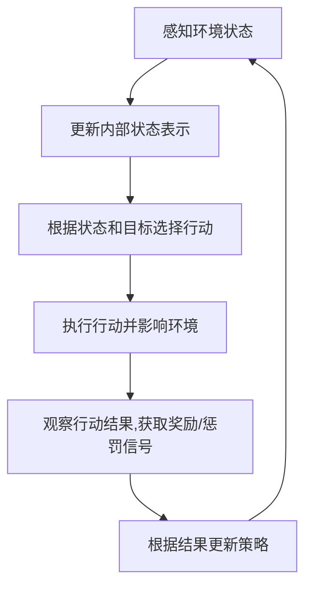
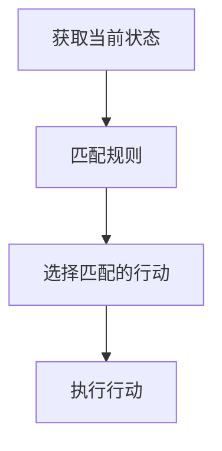
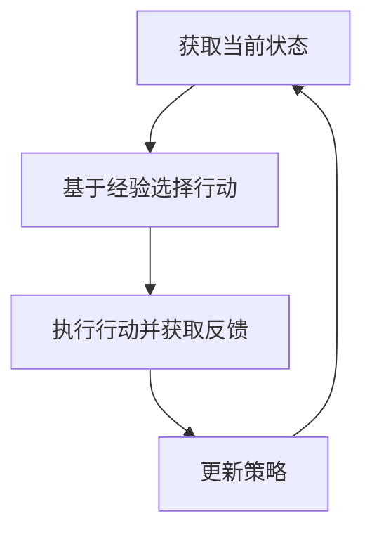

# AI人工智能代理工作流AI Agent WorkFlow：在健康医疗领域部署智能代理

## 1.背景介绍

### 1.1 医疗健康领域的挑战

医疗健康领域一直是人类社会中最为重要和关键的领域之一。随着人口老龄化、慢性病患病率上升以及医疗资源的相对匮乏,医疗健康领域面临着巨大的挑战。传统的医疗模式已经难以满足日益增长的需求,迫切需要新的解决方案来提高医疗服务的可及性、质量和效率。

### 1.2 人工智能在医疗健康领域的应用前景

人工智能(AI)技术在医疗健康领域的应用前景广阔。AI系统可以处理大量数据、发现隐藏的模式、提供个性化建议,并协助医疗专业人员做出更准确的诊断和治疗决策。此外,AI还可以用于药物发现、医疗影像分析、患者监控等多个领域,大大提高医疗服务的质量和效率。

### 1.3 AI代理在医疗健康领域的作用

AI代理是一种特殊的AI系统,它可以代表人类执行各种任务。在医疗健康领域,AI代理可以扮演多个角色,如虚拟助手、治疗顾问、健康管理员等。通过与患者、医生和其他相关人员进行自然语言交互,AI代理可以提供个性化的医疗建议、治疗方案、健康管理等服务,极大地提高了医疗服务的可及性和质量。

## 2.核心概念与联系

### 2.1 AI代理的定义

AI代理是一种自主的软件实体,它可以感知环境、处理信息、做出决策并采取行动,以实现特定目标。AI代理通常由以下几个核心组件组成:

- 感知器(Sensors):用于从环境中获取信息
- 执行器(Actuators):用于在环境中执行行动
- 状态表示(State Representation):描述代理当前状态的内部数据结构
- 策略(Policy):根据当前状态和目标决定下一步行动的函数或算法

### 2.2 AI代理与其他AI概念的关系

AI代理是一个广义的概念,它与其他AI概念密切相关:

- 机器学习(ML):AI代理可以使用ML算法从数据中学习,以改进其策略
- 自然语言处理(NLP):AI代理通常需要NLP技术来理解和生成自然语言
- 计算机视觉(CV):AI代理可以使用CV技术处理和理解图像数据
- 规划和推理:AI代理需要规划和推理能力来制定行动计划并做出决策

### 2.3 AI代理在医疗健康领域的应用

在医疗健康领域,AI代理可以扮演多种角色:

- 虚拟助手:与患者进行自然语言交互,提供医疗信息、预约服务等
- 治疗顾问:根据患者数据提供个性化的治疗方案建议
- 健康管理员:监测患者健康数据,提供生活方式建议
- 医疗影像分析:利用CV技术分析医学影像,协助诊断
- 药物发现:通过ML技术发现潜在的新药分子

## 3.核心算法原理具体操作步骤  

### 3.1 AI代理的一般工作流程

AI代理的工作流程通常包括以下步骤:

1. 感知环境状态
2. 更新内部状态表示
3. 根据状态和目标选择行动
4. 执行行动并影响环境
5. 观察行动结果,获取奖励/惩罚信号
6. 根据结果更新策略(可选)
7. 回到步骤1,重复循环

这个循环被称为感知-规划-行动循环(Perception-Planning-Action Cycle)。



### 3.2 基于规则的AI代理

基于规则的AI代理根据预定义的一组规则来选择行动。这些规则通常由人类专家制定,并编码到代理的策略中。虽然这种方法简单直观,但它缺乏灵活性和可扩展性。



### 3.3 基于学习的AI代理

基于学习的AI代理使用机器学习算法从经验中学习最优策略。常见的算法包括:

- 监督学习:从标记数据中学习映射函数
- 强化学习:通过试错和奖励信号优化策略
- 无监督学习:从未标记数据中发现隐藏模式



### 3.4 AI代理在医疗领域的应用实例

以虚拟助手为例,一个基于规则的AI代理可能包含以下规则:

- 如果患者提到症状X,询问症状持续时间
- 如果症状持续时间超过Y天,建议就医
- 如果患者询问医院地址,提供最近的医院信息

而一个基于学习的AI代理可以从过去的对话数据中学习如何响应不同的患者查询,并随着时间不断优化其响应策略。

## 4.数学模型和公式详细讲解举例说明

在医疗健康领域,AI代理经常需要处理不确定性数据和做出风险决策。贝叶斯决策理论为此提供了数学基础。

### 4.1 贝叶斯定理

贝叶斯定理描述了如何在获得新证据后更新事件发生概率的计算公式:

$$P(A|B) = \frac{P(B|A)P(A)}{P(B)}$$

其中:
- $P(A|B)$ 是在已知 $B$ 发生的情况下,事件 $A$ 发生的条件概率
- $P(B|A)$ 是在已知 $A$ 发生的情况下,事件 $B$ 发生的条件概率
- $P(A)$ 和 $P(B)$ 分别是 $A$ 和 $B$ 的边缘概率

### 4.2 期望效用理论

期望效用理论为做出最优决策提供了数学框架。对于每个可能的行动 $a$,我们计算其在所有可能结果 $o$ 下的期望效用:

$$EU(a) = \sum_{o} P(o|a)U(o)$$

其中:
- $P(o|a)$ 是在采取行动 $a$ 后,结果 $o$ 发生的概率
- $U(o)$ 是结果 $o$ 的效用值(代表其好坏程度)

最优行动 $a^*$ 是期望效用最大的那个:

$$a^* = \arg\max_a EU(a)$$

### 4.3 示例:诊断决策

假设一个AI代理需要根据一个患者的症状和检查结果,决定是否需要进一步检查。我们定义:

- $D$:患者患有某种疾病
- $S$:患者呈现出某些症状
- $T$:患者的检查结果为阳性

根据贝叶斯定理,我们可以计算患病的后验概率:

$$P(D|S,T) = \frac{P(S,T|D)P(D)}{P(S,T)}$$

其中 $P(D)$ 是该疾病的先验概率, $P(S,T|D)$ 是患有该疾病时出现症状和阳性检查结果的概率。

接下来,我们可以计算进一步检查和不检查两个行动的期望效用:

$$\begin{align*}
EU(\text{检查}) &= P(D|S,T)U(\text{正确治疗}) + (1-P(D|S,T))U(\text{避免不必要检查}) - C_\text{检查}\
EU(\text{不检查}) &= P(D|S,T)U(\text{疾病恶化}) + (1-P(D|S,T))U(\text{无事发生})
\end{align*}$$

其中 $U(\cdot)$ 是不同结果的效用值, $C_\text{检查}$ 是进行检查的成本。AI代理将选择期望效用更高的行动。

通过将症状、检查结果等证据整合到贝叶斯模型中,并结合期望效用分析,AI代理可以做出最优的诊断和治疗决策。

## 5.项目实践:代码实例和详细解释说明

为了更好地理解AI代理在医疗领域的应用,我们将使用Python构建一个简单的基于规则的虚拟助手示例。

### 5.1 问题描述

我们的虚拟助手将与用户进行自然语言对话,根据用户描述的症状提供就医建议。我们将使用一组预定义的规则来映射症状到建议。

### 5.2 代码实现

```python
# 症状-建议映射规则
symptom_advice_rules = {
    "头痛": "如果持续头痛,建议就医",
    "发烧": "如果体温超过38.5°C,立即就医",
    "咳嗽": "如果伴有气促,建议就医检查",
    "腹痛": "如果腹痛剧烈,立即就医"
}

def get_advice(symptom):
    """根据症状获取就医建议"""
    symptom = symptom.lower()
    if symptom in symptom_advice_rules:
        return symptom_advice_rules[symptom]
    else:
        return "很抱歉,我无法为这种症状提供建议。建议您咨询医生。"

def main():
    print("欢迎使用虚拟助手!请描述您的症状:")
    
    while True:
        symptom = input("> ")
        if symptom.lower() == "退出":
            print("再见!")
            break
        advice = get_advice(symptom)
        print(f"建议: {advice}")

if __name__ == "__main__":
    main()
```

### 5.3 代码解释

1. 我们首先定义了一个`symptom_advice_rules`字典,它将症状映射到相应的就医建议。这是我们的规则库。

2. `get_advice()`函数根据给定的症状在规则库中查找对应的建议。如果找不到匹配的症状,它会返回一个通用建议。

3. `main()`函数是程序的入口点。它首先向用户打印欢迎语,然后进入一个无限循环,等待用户输入症状。

4. 在循环中,程序获取用户输入的症状,将其传递给`get_advice()`函数以获取建议,并将建议打印出来。如果用户输入"退出",程序将终止循环并退出。

5. 最后,我们使用`if __name__ == "__main__":`idiom来确保`main()`函数只在直接运行该脚本时执行,而不会在将其导入为模块时执行。

### 5.4 运行示例

```
欢迎使用虚拟助手!请描述您的症状:
> 头痛
建议: 如果持续头痛,建议就医
> 发烧
建议: 如果体温超过38.5°C,立即就医
> 肚子痛
建议: 很抱歉,我无法为这种症状提供建议。建议您咨询医生。
> 退出
再见!
```

虽然这个示例非常简单,但它展示了如何使用基于规则的方法构建一个AI虚拟助手。在实际应用中,我们可以使用更复杂的规则库、自然语言处理技术和机器学习算法来提高代理的性能和智能水平。

## 6.实际应用场景

AI代理在医疗健康领域有广泛的应用前景,包括但不限于以下几个场景:

### 6.1 虚拟助手

AI虚拟助手可以与患者进行自然语言交互,提供医疗信息查询、就医指导、预约服务等功能。它们可以缓解医疗资源紧缺的压力,提高医疗服务的可及性。

### 6.2 治疗顾问

AI代理可以分析患者的病史、症状、检查结果等数据,并基于医学知识库和机器学习模型,为医生提供个性化的治疗方案建议。这有助于提高诊断和治疗的准确性和效率。

### 6.3 健康管理

AI代理可以持续监测患者的生