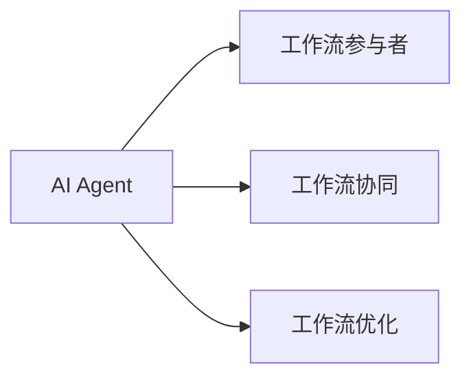

# AI人工智能代理工作流AI Agent WorkFlow：面向未来的AI代理与工作流研究方向

## 1.背景介绍
### 1.1 人工智能发展历程回顾
#### 1.1.1 人工智能的起源与发展
#### 1.1.2 人工智能的三次浪潮
#### 1.1.3 人工智能技术的现状与挑战

### 1.2 工作流技术的演进
#### 1.2.1 工作流的定义与分类
#### 1.2.2 工作流管理系统的发展历程
#### 1.2.3 工作流技术的应用现状

### 1.3 AI与工作流技术的融合
#### 1.3.1 AI驱动的智能工作流
#### 1.3.2 AI赋能工作流的优势
#### 1.3.3 AI Agent工作流的提出

## 2.核心概念与联系
### 2.1 AI Agent的内涵
#### 2.1.1 Agent的定义与特征
#### 2.1.2 AI Agent的能力与行为模型
#### 2.1.3 AI Agent的分类体系

### 2.2 AI Agent工作流的概念
#### 2.2.1 AI Agent工作流的定义
#### 2.2.2 AI Agent工作流的特点
#### 2.2.3 AI Agent工作流的价值

### 2.3 AI Agent与工作流的关系
#### 2.3.1 AI Agent作为工作流参与者
#### 2.3.2 AI Agent协同完成工作流
#### 2.3.3 AI Agent优化工作流执行



## 3.核心算法原理具体操作步骤
### 3.1 AI Agent的认知与决策
#### 3.1.1 基于知识图谱的认知推理
#### 3.1.2 基于强化学习的决策优化
#### 3.1.3 基于因果推理的行为预测

### 3.2 AI Agent的协同与交互
#### 3.2.1 基于博弈论的协同机制
#### 3.2.2 基于自然语言处理的交互
#### 3.2.3 基于多模态感知的上下文理解

### 3.3 AI Agent工作流的编排与执行
#### 3.3.1 基于有向无环图的工作流建模
#### 3.3.2 基于逻辑规划的工作流编排
#### 3.3.3 基于智能调度的工作流执行

## 4.数学模型和公式详细讲解举例说明
### 4.1 马尔可夫决策过程MDP
MDP是一种数学框架,用于对序贯决策问题建模。一个MDP由四元组$(S,A,P,R)$组成:

- $S$表示状态集合
- $A$表示动作集合
- $P$表示状态转移概率矩阵,其中$P(s'|s,a)$表示在状态$s$下执行动作$a$后转移到状态$s'$的概率
- $R$表示奖励函数,其中$R(s,a)$表示在状态$s$下执行动作$a$获得的即时奖励

求解MDP的目标是找到一个最优策略$\pi^*$,使得累积奖励最大化:

$$\pi^* = \arg\max_{\pi} \mathbb{E}\left[\sum_{t=0}^{\infty} \gamma^t R(s_t,a_t) \right]$$

其中$\gamma \in [0,1]$为折扣因子。求解最优策略的经典算法包括值迭代、策略迭代等。

### 4.2 部分可观测马尔可夫决策过程POMDP
在很多现实场景中,智能体无法完全感知环境状态,此时可以用POMDP对问题建模。一个POMDP在MDP的基础上引入观测集合$O$和观测概率$Z$:

$$\text{POMDP} = (S,A,P,R,O,Z)$$

其中$Z(o|s,a)$表示在状态$s$下执行动作$a$后得到观测$o$的概率。求解POMDP需要维护一个belief state $b(s)$,表示处于状态$s$的概率。最优策略$\pi^*$将belief state映射为动作。

### 4.3 多智能体强化学习MARL
在多个AI Agent协同完成任务时,可以用MARL框架对问题建模。常见的MARL算法包括:

- Independent Q-Learning (IQL):每个agent独立学习自己的最优Q值函数
$$Q_i(s,a_i) \leftarrow Q_i(s,a_i) + \alpha[r_i + \gamma \max_{a_i'} Q_i(s',a_i') - Q_i(s,a_i)]$$

- Joint Action Learning (JAL):考虑其他agent的联合动作空间
$$Q_i(s,\mathbf{a}) \leftarrow Q_i(s,\mathbf{a}) + \alpha[r_i + \gamma \max_{\mathbf{a}'} Q_i(s',\mathbf{a}') - Q_i(s,\mathbf{a})]$$

其中$\mathbf{a}=(a_1,\dots,a_n)$表示所有agent的联合动作。

## 5.项目实践：代码实例和详细解释说明
下面我们以一个简单的餐厅点餐场景为例,演示如何用Python实现一个基于MDP的AI Agent。

```python
import numpy as np

# 状态空间
states = ["准备点餐", "正在点餐", "等待上菜", "用餐中", "用餐结束"]
# 动作空间
actions = ["浏览菜单", "呼叫服务员", "开始点餐", "继续等待", "催单", "开始用餐", "结账离开"]
# 状态转移概率矩阵
P = {
  "准备点餐": {"浏览菜单": {"正在点餐": 1.0}},
  "正在点餐": {"呼叫服务员": {"正在点餐": 0.2, "等待上菜": 0.8}, "开始点餐": {"等待上菜": 1.0}},
  "等待上菜": {"继续等待": {"等待上菜": 0.8, "用餐中": 0.2}, "催单": {"等待上菜": 0.5, "用餐中": 0.5}},
  "用餐中": {"开始用餐": {"用餐中": 0.6, "用餐结束": 0.4}},
  "用餐结束": {"结账离开": {"准备点餐": 1.0}}
}
# 奖励函数
R = {
  "准备点餐": {"浏览菜单": -1},
  "正在点餐": {"呼叫服务员": -2, "开始点餐": 5},
  "等待上菜": {"继续等待": -1, "催单": -5},
  "用餐中": {"开始用餐": 10},
  "用餐结束": {"结账离开": 0}
}

# 值迭代算法求解最优策略
def value_iteration(P, R, gamma=0.9, epsilon=1e-6):
    V = {s: 0 for s in states}
    policy = {s: None for s in states}
    while True:
        delta = 0
        for s in states:
            v = V[s]
            max_v = float("-inf")
            for a, prob in P[s].items():
                r = R[s][a]
                v_next = sum(p * V[s_next] for s_next, p in prob.items())
                q = r + gamma * v_next
                if q > max_v:
                    max_v = q
                    policy[s] = a
            V[s] = max_v
            delta = max(delta, abs(v - V[s]))
        if delta < epsilon:
            break
    return policy

# 求解最优策略
optimal_policy = value_iteration(P, R)
print("最优点餐策略为:", optimal_policy)
```

代码解释:
1. 首先定义状态空间、动作空间、状态转移概率矩阵和奖励函数,对问题建模。
2. 然后用值迭代算法求解最优策略。值迭代的思想是迭代更新每个状态的最优价值函数,直到收敛。
3. 根据Bellman最优方程,每次迭代时,对每个状态$s$,遍历所有可能的动作$a$,计算Q值$q(s,a)=R(s,a)+\gamma \sum_{s'}P(s'|s,a)V(s')$,取最大的Q值更新$V(s)$,同时更新最优策略$\pi(s)$。
4. 迭代直到价值函数变化小于阈值,得到最优策略。

运行结果:
```
最优点餐策略为: {'准备点餐': '浏览菜单', '正在点餐': '开始点餐', '等待上菜': '继续等待', '用餐中': '开始用餐', '用餐结束': '结账离开'}
```

这个示例展示了如何用MDP对AI Agent的序贯决策问题建模,并用值迭代算法求解最优策略。在实际应用中,可以进一步考虑部分可观测、多智能体等因素,设计更加复杂的AI Agent系统。

## 6.实际应用场景
### 6.1 智能客服
AI Agent可以作为智能客服,通过工作流引擎,根据客户问题执行一系列任务,如信息检索、生成回复、情感分析等,提供全天候的客户服务。

### 6.2 自动化办公
AI Agent可以接入企业办公系统,根据预定义的工作流,自动完成日常事务,如邮件处理、日程安排、报表生成等,提高工作效率。

### 6.3 智慧医疗
医疗领域的AI Agent可以执行预诊断、导医分诊、药物推荐等工作流,辅助医生进行临床决策,提升医疗服务水平。

### 6.4 智能制造
在工业生产中,AI Agent可以控制机器人执行装配、检测、物流等工作流,实现生产过程的自动化和智能化,提高生产效率和产品质量。

### 6.5 无人驾驶
无人驾驶系统可以看作一种AI Agent,通过感知、决策、控制等工作流,实现车辆的自动驾驶,提高出行安全和效率。

## 7.工具和资源推荐
### 7.1 开源工作流引擎
- Apache Airflow: 一个用Python编写的工作流管理平台,可以编排、调度和监控工作流
- Camunda: 一个基于Java的工作流和决策自动化平台,支持BPMN、DMN等标准
- Flowable: 一个轻量级的Java工作流引擎,提供了强大的API和集成能力

### 7.2 AI开发框架
- TensorFlow: 谷歌开源的端到端机器学习平台,支持各种类型的神经网络模型
- PyTorch: Facebook开源的深度学习框架,提供了动态计算图和自动微分等功能
- Scikit-learn: 基于Python的机器学习库,提供了各种经典的机器学习算法实现

### 7.3 知识图谱构建工具
- Neo4j: 一个原生的图数据库,支持属性图模型和Cypher查询语言
- Apache Jena: 一个开源的语义网框架,提供了RDF、OWL等标准的API
- OpenKE: 一个知识图谱嵌入的开源工具包,实现了多种知识表示学习算法

### 7.4 多智能体平台
- MARLÖ: 一个多智能体强化学习的开源平台,支持在Minecraft环境中训练智能体
- OpenAI Gym: 一个开发和比较强化学习算法的工具包,提供了多个标准化环境
- MAgent: 一个研究多智能体系统的平台,支持大规模智能体的模拟和训练

## 8.总结：未来发展趋势与挑战
### 8.1 hybrid human-AI workflows
未来AI Agent将与人类协同,形成hybrid human-AI workflows。需要研究如何设计人机交互界面,合理分配任务,优化人机协同绩效。

### 8.2 AutoML工作流
AutoML旨在自动化机器学习工作流,包括数据预处理、特征工程、模型选择、超参数优化等。需要研究如何将AutoML与AI Agent工作流相结合,实现机器学习的自动化。

### 8.3 可解释性与可信性
AI Agent工作流的决策过程应该是可解释、可信的。需要研究如何设计可解释的机器学习算法,增强AI Agent的透明度,建立人对AI的信任。

### 8.4 安全与隐私保护
AI Agent接触了大量数据,可能存在安全与隐私风险。需要研究AI Agent工作流中的攻击检测、访问控制、数据脱敏等安全机制。

### 8.5 标准化与互操作
AI Agent工作流涉及异构系统的互联互通,需要制定通用的接口标准和元数据规范,实现不同AI Agent之间的互操作。

## 9