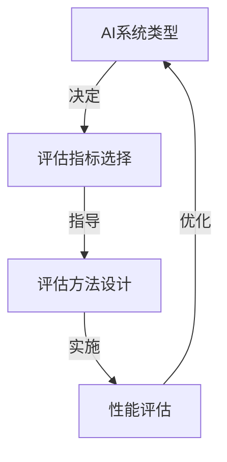

# AI系统性能评估原理与代码实战案例讲解

## 1.背景介绍

### 1.1 人工智能系统的重要性

在当今时代,人工智能(AI)已经广泛应用于各个领域,包括计算机视觉、自然语言处理、机器学习等。随着技术的不断进步,AI系统变得越来越复杂和强大。然而,评估这些系统的性能并不是一件简单的事情。准确评估AI系统的性能对于确保系统的可靠性、安全性和有效性至关重要。

### 1.2 AI系统性能评估的挑战

评估AI系统的性能面临着许多挑战,包括:

- **多维度指标**: AI系统的性能涉及多个方面,如准确性、效率、鲁棒性等,需要综合考虑多个指标。
- **数据质量**: 评估过程中使用的数据质量直接影响评估结果的可靠性。
- **场景复杂性**: 不同应用场景下,AI系统面临不同的挑战,需要针对性地设计评估方法。
- **评估成本**: 全面评估AI系统通常需要大量的计算资源和人力,评估成本较高。

### 1.3 本文内容概览

本文将深入探讨AI系统性能评估的原理和实践。我们将介绍常用的评估指标、评估方法,并通过代码实战案例讲解具体的评估流程。文章内容包括:

- 核心概念与联系
- 核心算法原理和具体操作步骤
- 数学模型和公式详细讲解
- 项目实践:代码实例和详细解释
- 实际应用场景
- 工具和资源推荐
- 总结:未来发展趋势与挑战
- 附录:常见问题与解答

## 2.核心概念与联系

在探讨AI系统性能评估之前,我们需要了解一些核心概念及其相互关系。

### 2.1 AI系统类型

AI系统可以分为以下几种主要类型:

1. **监督学习系统**: 基于标注数据进行训练,用于分类、回归等任务。
2. **无监督学习系统**: 从未标注数据中发现隐藏模式,用于聚类、降维等任务。
3. **强化学习系统**: 通过与环境交互获取反馈,优化决策策略。
4. **生成对抗网络(GAN)**: 由生成器和判别器组成,用于生成逼真的数据样本。

不同类型的AI系统在评估时需要考虑不同的指标和方法。

### 2.2 评估指标

常用的AI系统性能评估指标包括:

- **准确性**: 反映系统输出结果与真实值的偏差程度,如准确率、精确率、召回率等。
- **效率**: 评估系统的计算效率,如推理时间、内存占用等。
- **鲁棒性**: 系统对噪声、对抗样本等扰动的稳健性。
- **公平性**: 系统对不同人群的公平程度,避免算法偏差。
- **可解释性**: 系统决策过程的透明度和可解释性。
- **安全性**: 系统在实际应用中的安全性和可靠性。

根据具体场景和需求,需要选择合适的评估指标组合。

### 2.3 评估方法

常见的AI系统性能评估方法包括:

- **数据集评估**: 在标注数据集上进行评估,计算相关指标。
- **人工评估**: 由人工专家对系统输出结果进行评判。
- **在线评估**: 在实际应用场景中对系统进行评估。
- **压力测试**: 评估系统在极端条件下的性能表现。
- **对抗性评估**: 生成对抗样本,评估系统的鲁棒性。

不同方法有不同的优缺点,需要根据具体需求进行选择和组合使用。

### 2.4 核心概念关系

上述核心概念之间存在密切关系,如下图所示:



AI系统的类型决定了需要关注的评估指标,评估指标则指导评估方法的设计,通过实施评估方法获得性能评估结果,根据评估结果对AI系统进行优化和迭代。

## 3.核心算法原理具体操作步骤

在评估AI系统性能时,通常需要遵循一定的算法原理和操作步骤。本节将介绍其中的核心内容。

### 3.1 数据集构建

高质量的评估数据集是性能评估的基础。构建评估数据集的步骤如下:

1. **定义数据集要求**: 根据AI系统的应用场景和任务,确定数据集的规模、多样性、标注质量等要求。
2. **数据采集**: 从各种来源(如网络、传感器等)采集原始数据。
3. **数据清洗**: 去除噪声、异常值,进行必要的预处理。
4. **数据标注**: 邀请专家或众包的方式对数据进行标注,确保标注质量。
5. **数据集划分**: 将数据集划分为训练集、验证集和测试集。
6. **数据集评估**: 对构建的数据集进行评估,确保其质量满足要求。

### 3.2 评估指标计算

根据AI系统的类型和应用场景,选择合适的评估指标,并实现相应的计算算法。以下是一些常见指标的计算方法:

1. **准确率**:

$$
\text{Accuracy} = \frac{\text{正确预测的样本数}}{\text{总样本数}}
$$

2. **精确率和召回率**:

$$
\text{Precision} = \frac{\text{真正例}}{\text{真正例 + 假正例}}
$$

$$
\text{Recall} = \frac{\text{真正例}}{\text{真正例 + 假负例}}
$$

3. **F1分数**:

$$
\text{F1} = 2 \times \frac{\text{Precision} \times \text{Recall}}{\text{Precision} + \text{Recall}}
$$

4. **平均准确率(mAP)**: 对于目标检测任务,mAP是一种综合评估指标。

5. **语言模型评估指标**: 对于自然语言处理任务,常用的指标包括BLEU、METEOR、ROUGE等。

根据具体任务,还可以定义其他评估指标及其计算方法。

### 3.3 评估流程

AI系统性能评估的一般流程如下:

1. **确定评估目标**: 明确评估的目的,如系统优化、模型选择等。
2. **选择评估指标**: 根据评估目标和AI系统类型,选择合适的评估指标组合。
3. **构建评估数据集**: 按照上述步骤构建高质量的评估数据集。
4. **实施评估方法**: 在评估数据集上运行AI系统,收集相关数据,计算评估指标。
5. **分析评估结果**: 对评估结果进行深入分析,发现系统的优缺点和改进空间。
6. **系统优化**: 根据评估结果,对AI系统进行优化和迭代。
7. **持续评估**: 在系统优化后,重复进行评估,形成闭环优化过程。

### 3.4 评估工具

为了提高评估效率,可以使用一些开源或商业的评估工具,如:

- **TensorFlow Model Analysis**: 用于评估TensorFlow模型的公平性、可解释性等。
- **Adversarial Robustness Toolbox**: 评估机器学习模型对对抗样本的鲁棒性。
- **AI Fairness 360**: 用于检测和缓解AI系统中的偏差和不公平性。
- **MLPerf**: 提供一套基准测试,用于评估不同硬件和软件框架下的ML系统性能。

选择合适的评估工具可以提高评估效率,并利用工具提供的高级功能。

## 4.数学模型和公式详细讲解举例说明

在AI系统性能评估过程中,通常需要使用一些数学模型和公式。本节将详细讲解其中的几个核心内容,并给出具体示例。

### 4.1 混淆矩阵

混淆矩阵是一种用于评估分类模型性能的工具。它记录了模型在测试数据集上的预测结果与真实标签之间的关系。

对于二分类问题,混淆矩阵如下所示:

```
            预测值
            正例  负例
真实值 正例   TP    FN
      负例   FP    TN
```

其中:

- TP(True Positive): 正确预测为正例的样本数
- FN(False Negative): 错误预测为负例的正例样本数
- FP(False Positive): 错误预测为正例的负例样本数
- TN(True Negative): 正确预测为负例的样本数

基于混淆矩阵,我们可以计算多个评估指标,如准确率、精确率、召回率等。

**示例**:

假设一个二分类模型在测试集上的预测结果如下:

```
TP = 80
FN = 20
FP = 15
TN = 85
```

则该模型的准确率、精确率和召回率分别为:

$$
\text{Accuracy} = \frac{80 + 85}{80 + 20 + 15 + 85} = 0.825
$$

$$
\text{Precision} = \frac{80}{80 + 15} = 0.842
$$

$$
\text{Recall} = \frac{80}{80 + 20} = 0.8
$$

### 4.2 平均准确率(mAP)

平均准确率(mAP)是一种常用于评估目标检测模型性能的指标。它综合考虑了精确率和召回率,能够更全面地反映模型的性能。

计算mAP的步骤如下:

1. 对于每个类别,计算不同置信度阈值下的精确率和召回率,绘制精确率-召回率曲线。
2. 计算精确率-召回率曲线下的面积,即该类别的AP(Average Precision)。
3. 计算所有类别AP的均值,即mAP。

**示例**:

假设一个目标检测模型在测试集上的预测结果如下:

```
类别A:
AP = 0.72

类别B:
AP = 0.85

类别C:
AP = 0.63
```

则该模型的mAP为:

$$
\text{mAP} = \frac{0.72 + 0.85 + 0.63}{3} = 0.733
$$

### 4.3 语言模型评估指标

对于自然语言处理任务,常用的评估指标包括BLEU、METEOR和ROUGE等。这些指标主要用于评估机器翻译、文本摘要等任务的性能。

以BLEU(Bilingual Evaluation Understudy)为例,它是一种基于n-gram的评估指标,用于评估机器翻译的质量。BLEU的计算公式如下:

$$
\text{BLEU} = BP \times \exp\left(\sum_{n=1}^N w_n \log p_n\right)
$$

其中:

- $BP$是一个惩罚因子,用于惩罚过短的翻译结果。
- $N$是最大的n-gram长度。
- $w_n$是对应n-gram长度的权重。
- $p_n$是机器翻译结果中的n-gram与参考翻译中的n-gram的精确度匹配。

通过调整$N$和$w_n$的值,可以控制BLEU对不同长度的n-gram的关注程度。

**示例**:

假设一个机器翻译系统的BLEU分数如下:

```
N = 4
w_1 = 0.25, w_2 = 0.25, w_3 = 0.25, w_4 = 0.25
p_1 = 0.7, p_2 = 0.6, p_3 = 0.5, p_4 = 0.4
BP = 1.0 (未启用惩罚因子)
```

则该系统的BLEU分数为:

$$
\begin{aligned}
\text{BLEU} &= 1.0 \times \exp\left(0.25 \log 0.7 + 0.25 \log 0.6 + 0.25 \log 0.5 + 0.25 \log 0.4\right) \
            &= 1.0 \times \exp(-0.3147) \
            &= 0.73
\end{aligned}
$$

上述只是对一些常见的数学模型和公式进行了简单介绍,在实际评估过程中还可能涉及到更多的数学知识。

## 5.项目实践:代码实例和详细解释说明

为了更好地理解AI系统性能评估的原理和实践